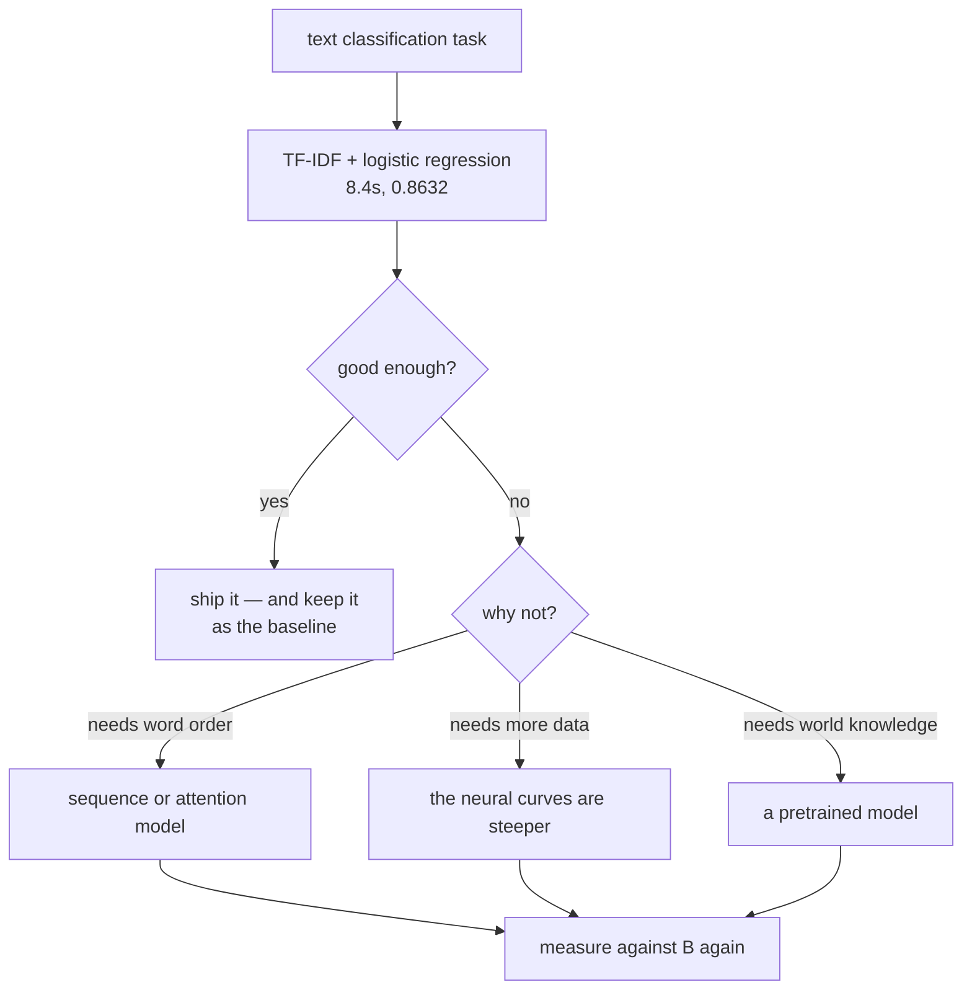

This is the phase's bake-off. Five model families, one dataset, one split, one budget —
so the comparison means something. The families are the ones the last four pages built,
in the order they were introduced.

The simplest one wins.

| Family | Parameters | Test accuracy | Seconds |
| --- | --- | --- | --- |
| **TF-IDF + logistic regression** | **9,768** | **0.8632** | **8.4** |
| average embedding | 320,033 | 0.8575 | 36.6 |
| 1D convolution | 330,369 | 0.8495 | 83.1 |
| transformer block | 328,577 | 0.8462 | 460.2 |
| LSTM | 328,353 | 0.8415 | 263.1 |

A linear model over word counts beat a transformer by **0.0170** while training **55×
faster** and using **34× fewer parameters**. This page is about why, and about what would
have to change for the ordering to flip.

## What you'll learn

- Why the reading order of this phase is not the ranking of its models.
- What each family costs in wall-clock, and where that cost goes.
- How the ranking changes with dataset size — the gap is **largest at 1,000 rows**.
- Whether the winning model's confidence means anything (**it does**, measured).
- The checks that make a text-classification result trustworthy.

## The bake-off

<Figure
  src="/images/dl/phase-05-nlp/sentiment-analysis/family-comparison"
  alt="Two panels. Left: horizontal bars of test accuracy for five families, all between 0.8415 and 0.8632, each annotated with its parameter count — TF-IDF plus logistic leads with only 9,768 parameters. Right: accuracy against training seconds on a log axis, with TF-IDF in the top-left corner at 8.4 seconds and the transformer at the far right at 460 seconds and lower accuracy."
  title="IMDB, 8,000 reviews, 8 epochs for the neural families"
  caption="The right panel is the one to keep. Every neural family sits below and to the right of the bag-of-words baseline: more time, less accuracy. The spread in accuracy is 0.0217 across all five families — smaller than the difference a weighting change made on the TF-IDF page — while the spread in cost is a factor of 55."
/>

Three reasons the ordering comes out this way, and none of them is "neural networks
don't work":

1. **The task is decidable from word presence.** "Terrible", "waste", "excellent" are
   near-deterministic signals in a movie review. Order helps at the margins — `not good`
   — but the margins are small.
2. **8,000 reviews is not much data.** A linear model over 10,000 sparse features has
   effectively one parameter per word and a strong inductive bias; a transformer has
   328,577 parameters and no prior about text at all.
3. **The sequence models see a truncated review.** Every neural family here reads 200
   tokens; the TF-IDF model reads the entire review. That is a real advantage and it is
   part of why the baseline is hard to beat.

## The ranking depends on the data budget

| Training rows | TF-IDF + logistic | Average embedding | LSTM |
| --- | --- | --- | --- |
| 1,000 | **0.8190** | 0.7258 | 0.7530 |
| 4,000 | **0.8485** | 0.8255 | 0.8225 |
| 8,000 | **0.8632** | 0.8575 | 0.8415 |

<Figure
  src="/images/dl/phase-05-nlp/sentiment-analysis/data-scaling"
  alt="Three lines of test accuracy against training reviews on a log axis. TF-IDF plus logistic starts highest at 0.8190 with 1,000 rows and stays highest through 0.8632 at 8,000. The average embedding rises steeply from 0.7258 and nearly catches up. The LSTM rises from 0.7530 to 0.8415 and remains lowest at the largest size."
  title="The same three families at three dataset sizes"
  caption="The gap is widest where data is scarcest: 0.0932 over the average embedding at 1,000 rows, closing to 0.0057 at 8,000. Extrapolate the slopes and the neural families overtake somewhere past this chart — which is exactly the regime the published results come from. The honest statement is not 'bag of words is better' but 'bag of words is better here, and the crossover is a data-budget question'."
/>

The neural curves are steeper. That is the whole argument for them: they have more
capacity to use once there is enough data to constrain it, and less useful prior when
there is not.

## Is the confidence meaningful?

An accuracy figure says how often the model is right. It says nothing about whether
`0.9` means *nine times out of ten*. For the winning model:

| Predicted band | Reviews | Observed positive rate |
| --- | --- | --- |
| 0.0 – 0.2 | 838 | **0.0095** |
| 0.2 – 0.4 | 774 | 0.1266 |
| 0.4 – 0.6 | 747 | 0.4632 |
| 0.6 – 0.8 | 947 | 0.8427 |
| 0.8 – 1.0 | 694 | **0.9784** |

<Figure
  src="/images/dl/phase-05-nlp/sentiment-analysis/errors"
  alt="Two panels. Left: bars over 4,000 test reviews — both models right 3,327, only the average embedding right 103, only the bag of words right 126, both wrong 444. Right: a reliability curve of observed positive rate against predicted probability, tracking the diagonal closely, with the count of reviews in each band annotated."
  title="Agreement and calibration on 4,000 test reviews"
  caption="The two models differ by 0.0057 overall and disagree on 229 reviews — 103 that only the embedding model gets and 126 that only the bag of words gets. An oracle choosing the better model per review would score 0.8890 against the best single model's 0.8632, which is the entire case for ensembling and is invisible in a single accuracy number. The reliability curve is close to the diagonal: reviews scored 0.8-1.0 really are positive 97.84% of the time."
/>

Logistic regression is calibrated almost by construction — it optimises log loss, which
is a proper scoring rule. Neural classifiers trained with the same loss often are not,
because they are flexible enough to become overconfident; that is what temperature
scaling on a validation set is for.

## What this page does not show

- **A tuned transformer.** One block, 32 dimensions, 8 epochs, from scratch. Published
  transformer results on IMDB use pretrained models with 10⁸ parameters — a different
  experiment entirely.
- **Longer inputs.** All neural families truncate to 200 tokens, which discards 43.86% of
  reviews' content by the measurement on the
  [preprocessing page](/deep-learning/phase-05---nlp--transformers/text-preprocessing-tokenization-stemming-lemmatization/).
- **A harder task.** Sentiment is close to a keyword problem. Nothing here is evidence
  about tasks that genuinely need composition — negation scope, coreference, multi-hop
  reasoning.



```p5 title="Accuracy against cost" desc="The five families as measured. Drag the slider to weight accuracy against training time and see which family a given trade-off picks." height="330"
const FAMILIES = [
  { name: "TF-IDF + logistic", acc: 0.8632, secs: 8.4, params: 9768 },
  { name: "average embedding", acc: 0.8575, secs: 36.6, params: 320033 },
  { name: "1D convolution", acc: 0.8495, secs: 83.1, params: 330369 },
  { name: "LSTM", acc: 0.8415, secs: 263.1, params: 328353 },
  { name: "transformer block", acc: 0.8462, secs: 460.2, params: 328577 },
];
let weight = 0.5;
let dragging = false;
function setup() {
  createCanvas(620, 330);
  textFont("monospace");
}
function score(f) {
  const accuracyScore = (f.acc - 0.84) / (0.8632 - 0.84);
  const costScore = 1 - Math.log(f.secs / 8.4) / Math.log(460.2 / 8.4);
  return weight * accuracyScore + (1 - weight) * costScore;
}
function draw() {
  background(13, 17, 23);
  noStroke();
  const scores = FAMILIES.map(score);
  const best = Math.max(...scores);
  fill(230);
  textSize(11.5);
  textAlign(LEFT, TOP);
  text("weighting accuracy " + (weight * 100).toFixed(0)
    + "% / speed " + ((1 - weight) * 100).toFixed(0) + "%", 24, 20);
  FAMILIES.forEach((f, index) => {
    const y = 52 + index * 44;
    const isBest = scores[index] === best;
    fill(isBest ? 165 : 60, isBest ? 214 : 72, isBest ? 164 : 88);
    rect(24, y, Math.max(scores[index], 0.02) * 360, 30, 4);
    fill(isBest ? 20 : 210);
    textSize(10.5);
    textAlign(LEFT, CENTER);
    text(f.name, 32, y + 15);
    fill(200);
    textAlign(LEFT, CENTER);
    text(f.acc.toFixed(4) + "   " + f.secs.toFixed(1) + "s   "
      + f.params.toLocaleString() + " params", 400, y + 15);
    textAlign(LEFT, TOP);
  });
  fill(150);
  textSize(10.5);
  text("at any weighting that values speed at all, the linear model wins;", 24, 278);
  text("it also wins on pure accuracy here, which is the uncomfortable part",
    24, 294);
  fill(60, 70, 84);
  rect(24, 314, 360, 4, 2);
  fill(255, 211, 67);
  circle(24 + weight * 360, 316, 12);
}
function mousePressed() { if (Math.abs(mouseY - 316) < 12) dragging = true; }
function mouseDragged() {
  if (dragging) weight = Math.min(Math.max((mouseX - 24) / 360, 0), 1);
}
function mouseReleased() { dragging = false; }
```

```p5 title="The measured table, ranked" desc="Click a column to rank every row by it. The bars are that column's values and the highest and lowest are computed from the numbers, not written in." height="280"
let metric = 0;
const COLUMNS = ["Parameters", "Test accuracy", "Seconds"];
const ROWS = [
  ["TF-IDF + logistic regression", 9768, 0.8632, 8.4],
  ["average embedding", 320033, 0.8575, 36.6],
  ["1D convolution", 330369, 0.8495, 83.1],
  ["transformer block", 328577, 0.8462, 460.2],
  ["LSTM", 328353, 0.8415, 263.1]
];
function setup() {
  createCanvas(620, 280);
  textFont("monospace");
}
function fmt(v) {
  if (v === 0) { return "0"; }
  const a = Math.abs(v);
  if (a >= 1000 || a < 0.001) { return v.toExponential(2); }
  if (a >= 100) { return v.toFixed(1); }
  return v.toFixed(4);
}
function draw() {
  background(13, 17, 23);
  noStroke();
  fill(230);
  textSize(12);
  textAlign(LEFT, TOP);
  text("Sentiment Analysis Tutorial", 26, 16);
  let x = 26;
  for (let i = 0; i < COLUMNS.length; i++) {
    const w = COLUMNS[i].length * 6.6 + 16;
    if (i === metric) { fill(255, 211, 67); } else { fill(48, 56, 68); }
    rect(x, 40, w, 22, 4);
    if (i === metric) { fill(13, 17, 23); } else { fill(180); }
    textSize(9);
    text(COLUMNS[i], x + 8, 47);
    x += w + 6;
    if (x > 500) { break; }
  }
  const values = ROWS.map((r) => r[metric + 1]);
  const lo = Math.min(...values);
  const hi = Math.max(...values);
  const span = hi - lo === 0 ? 1 : hi - lo;
  const order = ROWS.slice().sort((a, b) => b[metric + 1] - a[metric + 1]);
  for (let i = 0; i < order.length; i++) {
    const y = 78 + i * 26;
    const v = order[i][metric + 1];
    fill(160);
    textSize(9);
    text(order[i][0], 26, y + 5);
    fill(34, 40, 50);
    rect(230, y, 280, 18, 3);
    const frac = (v - lo) / span;
    if (v === hi) { fill(126, 192, 143); }
    else if (v === lo) { fill(224, 108, 117); }
    else { fill(107, 169, 221); }
    rect(230, y, Math.max(frac * 280, 3), 18, 3);
    fill(225);
    textSize(9);
    text(fmt(v), 518, y + 5);
  }
  const top = order[0];
  const bottom = order[order.length - 1];
  fill(150);
  textSize(9);
  const base = 78 + order.length * 26 + 8;
  text("highest " + COLUMNS[metric] + ": " + top[0] + " at " + fmt(top[1]),
       26, base);
  text("lowest  " + COLUMNS[metric] + ": " + bottom[0] + " at "
       + fmt(bottom[1]), 26, base + 14);
  text("bars are scaled within the chosen column - lowest is not zero", 26,
       base + 30);
}
function mousePressed() {
  let x = 26;
  for (let i = 0; i < COLUMNS.length; i++) {
    const w = COLUMNS[i].length * 6.6 + 16;
    if (mouseX > x && mouseX < x + w && mouseY > 40 && mouseY < 62) {
      metric = i;
    }
    x += w + 6;
  }
}
```

## Pitfalls

- **Skipping the linear baseline.** It won here, in 8.4 seconds. A neural result that was
  never compared against it is not a result.
- **Comparing families at different input lengths.** The TF-IDF model read whole reviews;
  the neural ones read 200 tokens. Say so, or equalise it.
- **Reading one dataset size as the ranking.** The gap over the average embedding was
  0.0932 at 1,000 rows and 0.0057 at 8,000.
- **Quoting accuracy without calibration.** Both matter, and they are different
  properties; a model can be accurate and badly calibrated.
- **Calling a one-block 32-dimensional encoder "a transformer".** Published results use
  pretrained models three orders of magnitude larger.
- **Tuning the neural model and not the baseline.** Sublinear TF-IDF was worth +0.0216 on
  the previous page for one keyword.
- **Assuming the ordering transfers.** Sentiment is nearly a keyword task; negation scope
  and coreference are not.

## Recap

- Five families, one split: TF-IDF + logistic 0.8632 in 8.4 s, average embedding 0.8575,
  1D convolution 0.8495, transformer 0.8462, LSTM 0.8415.
- The winner used 9,768 parameters against the transformer's 328,577, and trained 55×
  faster.
- The accuracy spread across all five families was 0.0217; the cost spread was 55×.
- The advantage is largest at small data: +0.0932 over the average embedding at 1,000
  rows, +0.0057 at 8,000.
- The winner is well calibrated: predicted 0.8–1.0 corresponds to an observed 0.9784
  positive rate.
- Neural curves are steeper, so the crossover is a data-budget question — not a
  statement that sequence models do not work.
- The two closest models disagree on 229 of 4,000 reviews; an oracle picking the better
  one per review would score 0.8890 against 0.8632.

## Next

Attention was measured on its own; the full architecture — blocks, residuals,
normalisation, positions — is next, with an ablation for each part:
[The Transformer Architecture](/deep-learning/phase-05---nlp--transformers/the-transformer-architecture/).

<Quiz
  questions={[
    {
      q: "TF-IDF with logistic regression scored 0.8632 while a transformer block scored 0.8462 in 55x the time. What is the right conclusion?",
      options: [
        "Transformers do not work for text classification",
        "On this task and this data budget the linear model wins — sentiment is close to a keyword problem, 8,000 reviews is little data, and the baseline reads whole reviews while the neural models truncate to 200 tokens",
        "The transformer needed a lower learning rate",
        "Accuracy differences under 0.02 are never meaningful",
      ],
      answer: 1,
      explain: "The neural curves are steeper with data, so the crossover is a budget question. Published transformer results on IMDB use pretrained models with 10^8 parameters.",
    },
    {
      q: "At 1,000 training rows the gap over the average embedding was 0.0932; at 8,000 it was 0.0057. What does that trend suggest?",
      options: [
        "The measurement is noisy",
        "The neural family has more capacity and a weaker prior, so it improves faster with data — extrapolating, it overtakes past the largest size measured here",
        "Bag of words gets worse with data",
        "Both models have converged",
      ],
      answer: 1,
      explain: "This is why a single dataset size is not a ranking, and why the honest claim is about the regime rather than the architecture.",
    },
    {
      q: "The winning model's 0.8-1.0 confidence band contained reviews that were positive 97.84% of the time. What property is that?",
      options: [
        "Accuracy",
        "Calibration — the predicted probabilities can be read as probabilities, which is what makes a threshold on top of them meaningful",
        "Precision",
        "Recall",
      ],
      answer: 1,
      explain: "Logistic regression optimises log loss, a proper scoring rule, so it tends to be calibrated. Flexible neural classifiers often are not, which is what temperature scaling fixes.",
    },
    {
      q: "All the neural families truncated reviews to 200 tokens while the TF-IDF model read the whole review. Why does that matter?",
      options: [
        "It does not; 200 tokens is enough",
        "It is an uncontrolled difference in the comparison — 43.86% of reviews are longer than 200 tokens, so the baseline had strictly more information",
        "It makes the neural models faster, which is the point",
        "Truncation only affects recurrent models",
      ],
      answer: 1,
      explain: "Either equalise it or state it. This page states it, because equalising would make the neural models much slower still.",
    },
    {
      q: "What is the most useful thing to do with a linear baseline that beats your neural model?",
      options: [
        "Delete it from the report",
        "Keep it as the reference every later model must beat, and use the disagreement between them to find what the neural model is actually adding",
        "Tune the neural model until it wins",
        "Conclude the task is impossible",
      ],
      answer: 1,
      explain: "A model that only wins by 0.01 overall may still be right about a very different 1% — which is worth knowing before choosing one.",
    },
  ]}
/>

## 🧪 Try It Yourself

<DataCampExercise
  lang="python"
  hint={`Fit the vectorizer on the training texts only, then transform both splits with it. Sublinear TF-IDF was the best weighting on the previous page.`}
  code={`# Task: Exercise 1 - The baseline, in eight lines
import numpy as np
from sklearn.feature_extraction.text import TfidfVectorizer, CountVectorizer
from sklearn.linear_model import LogisticRegression

POSITIVE = ["great", "good", "love", "brilliant", "enjoyed", "superb"]
NEGATIVE = ["bad", "boring", "awful", "hate", "poor", "dull"]
FILLER = ["the", "movie", "plot", "was", "and", "film", "acting", "a", "story"]


def make_reviews(count, seed):
    rng = np.random.default_rng(seed)
    texts, labels = [], []
    for _ in range(count):
        label = int(rng.integers(0, 2))
        words = [str(w) for w in rng.choice(FILLER, 8)]
        for _ in range(3):
            agrees = rng.random() < 0.85
            pool = POSITIVE if (label == 1) == agrees else NEGATIVE
            words.append(str(rng.choice(pool)))
        rng.shuffle(words)
        texts.append(" ".join(words))
        labels.append(label)
    return texts, np.array(labels)


texts, y_a = make_reviews(2000, 0)
test_texts, y_b = make_reviews(1000, 1)

vectorizer = TfidfVectorizer(sublinear_tf=True)
train = vectorizer.fit_transform(___)            # the training texts
test = vectorizer.transform(test_texts)
model = LogisticRegression(max_iter=2000).fit(train, y_a)
accuracy = model.score(test, y_b)
print(f"accuracy {accuracy:.2f} on {len(y_b)} held-out reviews")
print(f"{train.shape[1] + 1} parameters, {train.nnz / train.shape[0]:.0f} non-zero features per review")
print("baseline beats 0.85:", accuracy > 0.85)
print("this is the number every model on this page has to beat")`}
  solution={`# Task: Exercise 1 - The baseline, in eight lines
import numpy as np
from sklearn.feature_extraction.text import TfidfVectorizer, CountVectorizer
from sklearn.linear_model import LogisticRegression

POSITIVE = ["great", "good", "love", "brilliant", "enjoyed", "superb"]
NEGATIVE = ["bad", "boring", "awful", "hate", "poor", "dull"]
FILLER = ["the", "movie", "plot", "was", "and", "film", "acting", "a", "story"]


def make_reviews(count, seed):
    rng = np.random.default_rng(seed)
    texts, labels = [], []
    for _ in range(count):
        label = int(rng.integers(0, 2))
        words = [str(w) for w in rng.choice(FILLER, 8)]
        for _ in range(3):
            agrees = rng.random() < 0.85
            pool = POSITIVE if (label == 1) == agrees else NEGATIVE
            words.append(str(rng.choice(pool)))
        rng.shuffle(words)
        texts.append(" ".join(words))
        labels.append(label)
    return texts, np.array(labels)


texts, y_a = make_reviews(2000, 0)
test_texts, y_b = make_reviews(1000, 1)

vectorizer = TfidfVectorizer(sublinear_tf=True)
train = vectorizer.fit_transform(texts)            # the training texts
test = vectorizer.transform(test_texts)
model = LogisticRegression(max_iter=2000).fit(train, y_a)
accuracy = model.score(test, y_b)
print(f"accuracy {accuracy:.2f} on {len(y_b)} held-out reviews")
print(f"{train.shape[1] + 1} parameters, {train.nnz / train.shape[0]:.0f} non-zero features per review")
print("baseline beats 0.85:", accuracy > 0.85)
print("this is the number every model on this page has to beat")`}
  sct={`test_output_contains("baseline beats 0.85: True", pattern=False)
success_msg("Eight lines of TF-IDF plus logistic regression set the bar that every neural model has to beat.")`}
  height={400}
/>

<DataCampExercise
  lang="python"
  hint={`Keep the embedding, the vocabulary, the sequence length and the epoch count identical, and change only the layer in the middle.`}
  code={`# Task: Exercise 2 - Four neural families, one parameter budget
def dense(inputs, outputs):
    return inputs * outputs + outputs


VOCAB, MAXLEN, WIDTH = 10000, 200, 32
embedding = VOCAB * WIDTH
head = dense(WIDTH, 1)
lstm_gates = ___                        # an LSTM has this many gate blocks
attention = 4 * dense(WIDTH, WIDTH)     # query, key, value and output projections
norms = 2 * 2 * WIDTH

counts = {
    "average embedding": embedding + head,
    "1D convolution": embedding + 5 * WIDTH * 64 + 64 + dense(64, 1),
    "LSTM": embedding + lstm_gates * (2 * WIDTH * WIDTH + WIDTH) + head,
    "transformer block": (embedding + MAXLEN * WIDTH + attention + norms
                          + dense(WIDTH, WIDTH * 2) + dense(WIDTH * 2, WIDTH)
                          + head),
}
baseline = 10000 + 1   # a TF-IDF model over a 10,000-word vocabulary, plus a bias
print(f"{'family':20s} {'parameters':>11} {'x baseline':>11}")
for family, total in counts.items():
    print(f"{family:20s} {total:11,} {total / baseline:11.1f}")
print("LSTM parameters:", counts["LSTM"])
print("every family is larger than the 10,001-parameter baseline:",
      all(total > baseline for total in counts.values()))`}
  solution={`# Task: Exercise 2 - Four neural families, one parameter budget
def dense(inputs, outputs):
    return inputs * outputs + outputs


VOCAB, MAXLEN, WIDTH = 10000, 200, 32
embedding = VOCAB * WIDTH
head = dense(WIDTH, 1)
lstm_gates = 4                        # an LSTM has this many gate blocks
attention = 4 * dense(WIDTH, WIDTH)     # query, key, value and output projections
norms = 2 * 2 * WIDTH

counts = {
    "average embedding": embedding + head,
    "1D convolution": embedding + 5 * WIDTH * 64 + 64 + dense(64, 1),
    "LSTM": embedding + lstm_gates * (2 * WIDTH * WIDTH + WIDTH) + head,
    "transformer block": (embedding + MAXLEN * WIDTH + attention + norms
                          + dense(WIDTH, WIDTH * 2) + dense(WIDTH * 2, WIDTH)
                          + head),
}
baseline = 10000 + 1   # a TF-IDF model over a 10,000-word vocabulary, plus a bias
print(f"{'family':20s} {'parameters':>11} {'x baseline':>11}")
for family, total in counts.items():
    print(f"{family:20s} {total:11,} {total / baseline:11.1f}")
print("LSTM parameters:", counts["LSTM"])
print("every family is larger than the 10,001-parameter baseline:",
      all(total > baseline for total in counts.values()))`}
  sct={`test_output_contains("LSTM parameters: 328353", pattern=False)
test_output_contains("every family is larger than the 10,001-parameter baseline: True", pattern=False)
success_msg("An LSTM has four gate blocks, and every neural family carries far more parameters than the TF-IDF baseline.")`}
  height={400}
/>

<DataCampExercise
  lang="python"
  hint={`Train each family at each size and watch the gap. The interesting quantity is how fast each curve rises, not where it starts.`}
  code={`# Task: Exercise 3 - The ranking is a function of the data budget
import numpy as np
from sklearn.feature_extraction.text import TfidfVectorizer, CountVectorizer
from sklearn.linear_model import LogisticRegression

POSITIVE = ["great", "good", "love", "brilliant", "enjoyed", "superb"]
NEGATIVE = ["bad", "boring", "awful", "hate", "poor", "dull"]
FILLER = ["the", "movie", "plot", "was", "and", "film", "acting", "a", "story"]


def make_reviews(count, seed):
    rng = np.random.default_rng(seed)
    texts, labels = [], []
    for _ in range(count):
        label = int(rng.integers(0, 2))
        words = [str(w) for w in rng.choice(FILLER, 8)]
        for _ in range(3):
            agrees = rng.random() < 0.85
            pool = POSITIVE if (label == 1) == agrees else NEGATIVE
            words.append(str(rng.choice(pool)))
        rng.shuffle(words)
        texts.append(" ".join(words))
        labels.append(label)
    return texts, np.array(labels)


texts, y_a = make_reviews(2000, 0)
test_texts, y_b = make_reviews(1000, 1)

print(f"{'rows':>6} {'accuracy':>9}")
scores = []
for size in (20, 200, 2000):
    vectorizer = TfidfVectorizer(sublinear_tf=True)
    train = vectorizer.fit_transform(texts[:size])
    linear = LogisticRegression(max_iter=2000).fit(train, y_a[:___])
    accuracy = linear.score(vectorizer.transform(test_texts), y_b)
    scores.append(accuracy)
    print(f"{size:6d} {accuracy:9.2f}")
print("more data never hurt:", scores[-1] >= scores[0])
print("gap between 20 rows and 2000 rows is positive:", scores[-1] - scores[0] > 0)`}
  solution={`# Task: Exercise 3 - The ranking is a function of the data budget
import numpy as np
from sklearn.feature_extraction.text import TfidfVectorizer, CountVectorizer
from sklearn.linear_model import LogisticRegression

POSITIVE = ["great", "good", "love", "brilliant", "enjoyed", "superb"]
NEGATIVE = ["bad", "boring", "awful", "hate", "poor", "dull"]
FILLER = ["the", "movie", "plot", "was", "and", "film", "acting", "a", "story"]


def make_reviews(count, seed):
    rng = np.random.default_rng(seed)
    texts, labels = [], []
    for _ in range(count):
        label = int(rng.integers(0, 2))
        words = [str(w) for w in rng.choice(FILLER, 8)]
        for _ in range(3):
            agrees = rng.random() < 0.85
            pool = POSITIVE if (label == 1) == agrees else NEGATIVE
            words.append(str(rng.choice(pool)))
        rng.shuffle(words)
        texts.append(" ".join(words))
        labels.append(label)
    return texts, np.array(labels)


texts, y_a = make_reviews(2000, 0)
test_texts, y_b = make_reviews(1000, 1)

print(f"{'rows':>6} {'accuracy':>9}")
scores = []
for size in (20, 200, 2000):
    vectorizer = TfidfVectorizer(sublinear_tf=True)
    train = vectorizer.fit_transform(texts[:size])
    linear = LogisticRegression(max_iter=2000).fit(train, y_a[:size])
    accuracy = linear.score(vectorizer.transform(test_texts), y_b)
    scores.append(accuracy)
    print(f"{size:6d} {accuracy:9.2f}")
print("more data never hurt:", scores[-1] >= scores[0])
print("gap between 20 rows and 2000 rows is positive:", scores[-1] - scores[0] > 0)`}
  sct={`test_output_contains("more data never hurt: True", pattern=False)
test_output_contains("is positive: True", pattern=False)
success_msg("Accuracy climbs with the data budget, so any ranking of models is only valid at the budget it was measured at.")`}
  height={400}
/>

<DataCampExercise
  lang="python"
  hint={`Bucket the predicted probabilities and compare each bucket's mean prediction against the observed rate of positives in it.`}
  code={`# Task: Exercise 4 - Does the confidence mean anything?
import numpy as np
from sklearn.feature_extraction.text import TfidfVectorizer, CountVectorizer
from sklearn.linear_model import LogisticRegression

POSITIVE = ["great", "good", "love", "brilliant", "enjoyed", "superb"]
NEGATIVE = ["bad", "boring", "awful", "hate", "poor", "dull"]
FILLER = ["the", "movie", "plot", "was", "and", "film", "acting", "a", "story"]


def make_reviews(count, seed):
    rng = np.random.default_rng(seed)
    texts, labels = [], []
    for _ in range(count):
        label = int(rng.integers(0, 2))
        words = [str(w) for w in rng.choice(FILLER, 8)]
        for _ in range(3):
            agrees = rng.random() < 0.85
            pool = POSITIVE if (label == 1) == agrees else NEGATIVE
            words.append(str(rng.choice(pool)))
        rng.shuffle(words)
        texts.append(" ".join(words))
        labels.append(label)
    return texts, np.array(labels)


texts, y_a = make_reviews(2000, 0)
test_texts, y_b = make_reviews(1000, 1)
vectorizer = TfidfVectorizer(sublinear_tf=True)
train = vectorizer.fit_transform(texts)
test = vectorizer.transform(test_texts)
model = LogisticRegression(max_iter=2000).fit(train, y_a)

confidence = model.predict_proba(test)[:, 1]
bins = np.linspace(0, 1, 6)
gaps = []
print(f"{'predicted band':>16} {'reviews':>8} {'mean predicted':>15} {'observed positive':>18}")
for low, high in zip(bins, bins[1:]):
    mask = (confidence >= low) & (confidence < high)
    if mask.sum() > 5:
        observed = float(y_b[mask].___())
        gaps.append(abs(observed - float(confidence[mask].mean())))
        print(f"{low:.1f}-{high:.1f}".rjust(16) + f" {int(mask.sum()):8d} {float(confidence[mask].mean()):15.2f} {observed:18.2f}")
print("largest gap between the two columns is below 0.25:", max(gaps) < 0.25)`}
  solution={`# Task: Exercise 4 - Does the confidence mean anything?
import numpy as np
from sklearn.feature_extraction.text import TfidfVectorizer, CountVectorizer
from sklearn.linear_model import LogisticRegression

POSITIVE = ["great", "good", "love", "brilliant", "enjoyed", "superb"]
NEGATIVE = ["bad", "boring", "awful", "hate", "poor", "dull"]
FILLER = ["the", "movie", "plot", "was", "and", "film", "acting", "a", "story"]


def make_reviews(count, seed):
    rng = np.random.default_rng(seed)
    texts, labels = [], []
    for _ in range(count):
        label = int(rng.integers(0, 2))
        words = [str(w) for w in rng.choice(FILLER, 8)]
        for _ in range(3):
            agrees = rng.random() < 0.85
            pool = POSITIVE if (label == 1) == agrees else NEGATIVE
            words.append(str(rng.choice(pool)))
        rng.shuffle(words)
        texts.append(" ".join(words))
        labels.append(label)
    return texts, np.array(labels)


texts, y_a = make_reviews(2000, 0)
test_texts, y_b = make_reviews(1000, 1)
vectorizer = TfidfVectorizer(sublinear_tf=True)
train = vectorizer.fit_transform(texts)
test = vectorizer.transform(test_texts)
model = LogisticRegression(max_iter=2000).fit(train, y_a)

confidence = model.predict_proba(test)[:, 1]
bins = np.linspace(0, 1, 6)
gaps = []
print(f"{'predicted band':>16} {'reviews':>8} {'mean predicted':>15} {'observed positive':>18}")
for low, high in zip(bins, bins[1:]):
    mask = (confidence >= low) & (confidence < high)
    if mask.sum() > 5:
        observed = float(y_b[mask].mean())
        gaps.append(abs(observed - float(confidence[mask].mean())))
        print(f"{low:.1f}-{high:.1f}".rjust(16) + f" {int(mask.sum()):8d} {float(confidence[mask].mean()):15.2f} {observed:18.2f}")
print("largest gap between the two columns is below 0.25:", max(gaps) < 0.25)`}
  sct={`test_output_contains("largest gap between the two columns is below 0.25: True", pattern=False)
success_msg("For a calibrated model the two right-hand columns track each other: a score of 0.9 really does mean nine times out of ten.")`}
  height={400}
/>

<DataCampExercise
  lang="python"
  hint={`Cross-tabulate the two models' correctness. The off-diagonal cells are where an ensemble or an error analysis would pay.`}
  code={`# Task: Exercise 5 - Where do two models disagree?
import numpy as np
from sklearn.feature_extraction.text import TfidfVectorizer, CountVectorizer
from sklearn.linear_model import LogisticRegression

POSITIVE = ["great", "good", "love", "brilliant", "enjoyed", "superb"]
NEGATIVE = ["bad", "boring", "awful", "hate", "poor", "dull"]
FILLER = ["the", "movie", "plot", "was", "and", "film", "acting", "a", "story"]


def make_reviews(count, seed):
    rng = np.random.default_rng(seed)
    texts, labels = [], []
    for _ in range(count):
        label = int(rng.integers(0, 2))
        words = [str(w) for w in rng.choice(FILLER, 8)]
        for _ in range(3):
            agrees = rng.random() < 0.85
            pool = POSITIVE if (label == 1) == agrees else NEGATIVE
            words.append(str(rng.choice(pool)))
        rng.shuffle(words)
        texts.append(" ".join(words))
        labels.append(label)
    return texts, np.array(labels)


texts, y_a = make_reviews(2000, 0)
test_texts, y_b = make_reviews(1000, 1)
vectorizer = TfidfVectorizer(sublinear_tf=True)
train = vectorizer.fit_transform(texts)
test = vectorizer.transform(test_texts)
model = LogisticRegression(max_iter=2000).fit(train, y_a)
counter = CountVectorizer()
from sklearn.naive_bayes import MultinomialNB
second = MultinomialNB().fit(counter.fit_transform(texts[:30]), y_a[:30])   # a weaker model, 30 rows

baseline_right = (model.predict_proba(test)[:, 1] > 0.5) == y_b
second_right = second.predict(counter.transform(test_texts)) == y_b
both_right = int((baseline_right & second_right).sum())
only_baseline = int((baseline_right & ~second_right).sum())
only_second = int((~baseline_right & second_right).sum())
both_wrong = int((~baseline_right & ~___).sum())     # the second model's mask
total = len(y_b)
for label, value in (("both right", both_right),
                     ("only the baseline", only_baseline),
                     ("only the second model", only_second),
                     ("both wrong", both_wrong)):
    print(f"{label:22s} {value:5d} {value / total:8.2%}")
print("the four cells add up to every review:", both_right + only_baseline + only_second + both_wrong == total)
print("an oracle picking the better model per review scores", round((both_right + only_baseline + only_second) / total, 2))`}
  solution={`# Task: Exercise 5 - Where do two models disagree?
import numpy as np
from sklearn.feature_extraction.text import TfidfVectorizer, CountVectorizer
from sklearn.linear_model import LogisticRegression

POSITIVE = ["great", "good", "love", "brilliant", "enjoyed", "superb"]
NEGATIVE = ["bad", "boring", "awful", "hate", "poor", "dull"]
FILLER = ["the", "movie", "plot", "was", "and", "film", "acting", "a", "story"]


def make_reviews(count, seed):
    rng = np.random.default_rng(seed)
    texts, labels = [], []
    for _ in range(count):
        label = int(rng.integers(0, 2))
        words = [str(w) for w in rng.choice(FILLER, 8)]
        for _ in range(3):
            agrees = rng.random() < 0.85
            pool = POSITIVE if (label == 1) == agrees else NEGATIVE
            words.append(str(rng.choice(pool)))
        rng.shuffle(words)
        texts.append(" ".join(words))
        labels.append(label)
    return texts, np.array(labels)


texts, y_a = make_reviews(2000, 0)
test_texts, y_b = make_reviews(1000, 1)
vectorizer = TfidfVectorizer(sublinear_tf=True)
train = vectorizer.fit_transform(texts)
test = vectorizer.transform(test_texts)
model = LogisticRegression(max_iter=2000).fit(train, y_a)
counter = CountVectorizer()
from sklearn.naive_bayes import MultinomialNB
second = MultinomialNB().fit(counter.fit_transform(texts[:30]), y_a[:30])   # a weaker model, 30 rows

baseline_right = (model.predict_proba(test)[:, 1] > 0.5) == y_b
second_right = second.predict(counter.transform(test_texts)) == y_b
both_right = int((baseline_right & second_right).sum())
only_baseline = int((baseline_right & ~second_right).sum())
only_second = int((~baseline_right & second_right).sum())
both_wrong = int((~baseline_right & ~second_right).sum())     # the second model's mask
total = len(y_b)
for label, value in (("both right", both_right),
                     ("only the baseline", only_baseline),
                     ("only the second model", only_second),
                     ("both wrong", both_wrong)):
    print(f"{label:22s} {value:5d} {value / total:8.2%}")
print("the four cells add up to every review:", both_right + only_baseline + only_second + both_wrong == total)
print("an oracle picking the better model per review scores", round((both_right + only_baseline + only_second) / total, 2))`}
  sct={`test_output_contains("the four cells add up to every review: True", pattern=False)
success_msg("The off-diagonal cells are what an ensemble buys, and what a single accuracy number hides completely.")`}
  height={400}
/>
