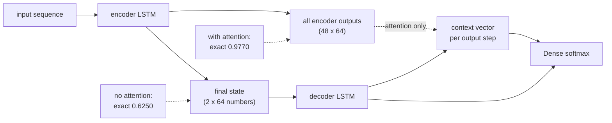

import DataCampExercise from "../../../../components/DataCampExercise.astro";
import Figure from "../../../../components/Figure.astro";
import Quiz from "../../../../components/Quiz.astro";

Every model so far has read a sequence and produced a **label**. Translation,
summarisation and normalisation produce a **sequence** — of a different length, in a
different vocabulary, with a different order. That needs two networks: an encoder that
reads and a decoder that writes.

The task here is date normalisation with the date buried in filler:
`order 21 item 45 07/02/1993 id seq` → `1993-02-07`. Real translation corpora are large
downloads; this one is generated, so the alignment is known exactly and an attention map
can be checked rather than admired.

| Model | Parameters | Teacher-forced | Free-running character | **Free-running exact** |
| --- | --- | --- | --- | --- |
| encoder–decoder | 70,156 | 0.9616 | 0.9217 | **0.6250** |
| **+ attention** | 70,924 | 0.9979 | 0.9957 | **0.9770** |

768 extra parameters — 1.1% — took exact match from 0.6250 to 0.9770.

## What you'll learn

- The encoder–decoder shape, and why the decoder needs its own input.
- **Teacher forcing**, and the gap it hides: **0.0399** character accuracy for the
  attention-free model against 0.0022 with attention.
- Why a single fixed-size state is a bottleneck, measured by input length: exact match
  falls **0.6921 → 0.5291** without attention and **0.9934 → 0.9612** with it.
- How to read an attention matrix when you know the true alignment.
- Greedy decoding, and where beam search would help.

## The shape

```python title="Encoder to decoder, with the state as the bridge"
encoder_inputs = keras.layers.Input((INPUT_LENGTH,))
embedded = keras.layers.Embedding(input_alphabet, WIDTH, mask_zero=True)(encoder_inputs)
encoder_sequence, state_h, state_c = keras.layers.LSTM(
    WIDTH, return_sequences=True, return_state=True)(embedded)

decoder_inputs = keras.layers.Input((OUTPUT_LENGTH,))
decoder_embedded = keras.layers.Embedding(output_alphabet, WIDTH)(decoder_inputs)
decoder_sequence = keras.layers.LSTM(WIDTH, return_sequences=True)(
    decoder_embedded, initial_state=[state_h, state_c])          # <- the bridge

outputs = keras.layers.Dense(output_alphabet, activation="softmax")(decoder_sequence)
```

Without attention, **everything the decoder knows about the input is those two state
vectors** — 64 numbers each. The input can be 48 characters long. That is the bottleneck
the rest of this page measures.

## Teacher forcing, and what it hides

During training the decoder is fed the *correct* previous character, not its own
prediction:

```text
input:   \t 1 9 9 3 - 0 2 - 0
target:   1 9 9 3 - 0 2 - 0 7
```

This is **teacher forcing**, and it exists because it makes training parallel — every
output position is computed at once, from known inputs. At inference there is no correct
previous character, so the decoder consumes its own output and any error compounds. That
mismatch is **exposure bias**.

| Model | Teacher-forced | Free-running character | Cost of the mismatch |
| --- | --- | --- | --- |
| encoder–decoder | 0.9616 | 0.9217 | **−0.0399** |
| + attention | 0.9979 | 0.9957 | −0.0022 |

<Figure
  src="/images/dl/phase-05-nlp/seq2seq-translation/teacher-forcing"
  alt="Two panels. Left: grouped bars for both models showing teacher-forced accuracy, free-running character accuracy and free-running exact match — the attention-free model reads 0.962, 0.922 and 0.625 while the attention model reads 0.998, 0.996 and 0.977. Right: teacher-forced validation accuracy per epoch, where the attention model rises quickly above 0.99 and the attention-free one plateaus near 0.96."
  title="2,000 held-out dates, 12 epochs"
  caption="The three bars per model are the same predictions scored three ways, and the spread between them is the point. Teacher-forced accuracy flatters both models — it is measured with the correct history handed to the decoder at every step. Free-running character accuracy is the honest per-character number, and exact match is what a user experiences: one wrong character makes the whole date wrong, so 0.9217 character accuracy becomes 0.6250 exact."
/>

Note how much worse **exact match** is than character accuracy: 0.9217 per character
becomes 0.6250 per date. With ten output characters, even independent errors compound —
$0.9217^{10} \approx 0.44$ — and the measured 0.6250 is better than that only because the
errors are correlated.

## The bottleneck, by input length

| Input length | Rows | Encoder–decoder | + attention |
| --- | --- | --- | --- |
| 0–15 | 302 | 0.6921 | **0.9934** |
| 16–23 | 685 | 0.6569 | 0.9883 |
| 24–31 | 652 | 0.6135 | 0.9663 |
| **32–48** | 361 | **0.5291** | **0.9612** |

<Figure
  src="/images/dl/phase-05-nlp/seq2seq-translation/attention-effect"
  alt="Grouped bars of free-running exact-match rate by input length. Without attention the rate falls steadily from 0.6921 for short inputs to 0.5291 for the longest. With attention it stays between 0.9934 and 0.9612 across all four length bands."
  title="Exact match by input length"
  caption="The attention-free model loses 0.1630 from the shortest band to the longest; the attention model loses 0.0322. This is the fixed-size bottleneck made visible — two 64-number vectors have to carry a 48-character input, and the longer the input the less of it survives. Attention removes the constraint by letting the decoder look back at every encoder position directly, which is why the 1980s encoder-decoder became the 2015 attention model and then the transformer."
/>

## Reading the alignment

The task has a known alignment: the `1993` in the output comes from the `1993` in the
input, and the day and month are reordered around it. So the attention matrix is
checkable.

<Figure
  src="/images/dl/phase-05-nlp/seq2seq-translation/alignment"
  alt="A heat map with input characters of 'order 21 item 45 07/02/1993 id seq' along the x axis and output characters of '1993-02-07' down the y axis. Bright cells appear where each output digit is generated: the year digits attend to the 1993 region, the month digits to the 02, and the day digits to the 07, with the filler words almost entirely dark."
  title="Attention for one held-out example"
  caption="Every bright cell is where it should be. The year characters attend to '1993', the month characters to '02', the day characters to '07' — and the filler words 'order', 'item', 'id', 'seq' are almost completely dark, including the distractor numbers 21 and 45. The two hyphens attend to the start of the input, which is a reasonable place to put 'I am emitting punctuation now'. This is the clearest interpretability result in the module, and it is only checkable because the corpus was generated with a known alignment."
/>

Compare that with the [Grad-CAM
page](/deep-learning/phase-03---computer-vision-with-cnns/interpreting-what-convnets-learn-grad-cam/),
where the trained and untrained heat maps still correlated at 0.6729. Here the alignment
is verifiable against ground truth, so the attention map is evidence rather than
decoration.

## Greedy decoding, and its limits

```python title="Free-running decode, one character at a time"
decoder_input = np.zeros((rows, OUTPUT_LENGTH), "int32")
decoder_input[:, 0] = start_token
for position in range(OUTPUT_LENGTH - 1):
    predictions = model.predict([x, decoder_input], verbose=0)
    decoder_input[:, position + 1] = predictions[:, position].argmax(axis=-1)
```

This takes the most likely character at each step and never reconsiders. It is what
produced every number on this page, and it has a known weakness: an early high-confidence
mistake cannot be undone, because the model conditions on it forever afterwards.

**Beam search** keeps the *k* best partial sequences instead of one, so a locally
attractive wrong turn can lose to a globally better path. It costs *k* times the compute
and matters most where this task is easy: long outputs with many plausible continuations —
translation, summarisation — rather than a ten-character date with rigid grammar.



```p5 title="The bottleneck and the fix" desc="Drag the input length. Without attention the decoder sees a fixed-size summary; with attention it sees every position. The exact-match numbers are the measured ones." height="340"
let length = 24;
let attention = false;
let dragging = false;
const MEASURED = {
  none: [[15, 0.6921], [23, 0.6569], [31, 0.6135], [48, 0.5291]],
  attention: [[15, 0.9934], [23, 0.9883], [31, 0.9663], [48, 0.9612]],
};
function scoreFor(len, mode) {
  const table = MEASURED[mode];
  for (const [limit, value] of table) {
    if (len <= limit) return value;
  }
  return table[table.length - 1][1];
}
function setup() {
  createCanvas(620, 340);
  textFont("monospace");
}
function draw() {
  background(13, 17, 23);
  noStroke();
  fill(230);
  textSize(11.5);
  textAlign(LEFT, TOP);
  text("input: " + length + " characters", 28, 20);
  const cell = Math.min(11, 520 / length);
  for (let i = 0; i < length; i++) {
    fill(46, 96, 140);
    rect(28 + i * cell, 44, cell - 1, 22, 2);
  }
  // encoder state or full sequence
  if (attention) {
    stroke(165, 214, 164, 120);
    for (let i = 0; i < length; i++) {
      line(28 + i * cell + cell / 2, 68, 300, 150);
    }
    noStroke();
    fill(165, 214, 164);
    textSize(10.5);
    text("every position is visible to the decoder", 28, 96);
  } else {
    stroke(255, 211, 67, 160);
    strokeWeight(2);
    line(28 + (length * cell) / 2, 68, 300, 150);
    strokeWeight(1);
    noStroke();
    fill(255, 211, 67);
    textSize(10.5);
    text("one fixed-size state: 2 x 64 numbers, whatever the length", 28, 96);
  }
  fill(60, 70, 84);
  rect(268, 150, 64, 26, 4);
  fill(220);
  textSize(9.5);
  textAlign(CENTER, CENTER);
  text("decoder", 300, 163);
  textAlign(LEFT, TOP);
  for (let i = 0; i < 10; i++) {
    fill(197, 153, 255);
    rect(380 + i * 20, 152, 18, 22, 2);
  }
  fill(150);
  textSize(9.5);
  text("yyyy-mm-dd", 380, 178);

  const score = scoreFor(length, attention ? "attention" : "none");
  fill(attention ? 165 : 255, attention ? 214 : 211, attention ? 164 : 67);
  textSize(20);
  textAlign(LEFT, TOP);
  text("exact match " + score.toFixed(4), 28, 214);
  fill(150);
  textSize(10.5);
  text("measured without attention: 0.6921 at <=15 chars falling to 0.5291", 28, 250);
  text("with attention: 0.9934 falling only to 0.9612", 28, 266);
  fill(60, 70, 84);
  rect(28, 300, 380, 4, 2);
  fill(255, 255, 255);
  circle(28 + ((length - 10) / 38) * 380, 302, 12);
  fill(60, 70, 84);
  rect(430, 292, 160, 26, 4);
  fill(220);
  textAlign(CENTER, CENTER);
  textSize(10.5);
  text(attention ? "attention: on" : "attention: off", 510, 305);
}
function mousePressed() {
  if (mouseX > 430 && mouseY > 292 && mouseY < 318) { attention = !attention; return; }
  if (Math.abs(mouseY - 302) < 12) dragging = true;
}
function mouseDragged() {
  if (dragging) {
    const fraction = Math.min(Math.max((mouseX - 28) / 380, 0), 1);
    length = Math.round(10 + fraction * 38);
  }
}
function mouseReleased() { dragging = false; }
```

```p5 title="The measured table, ranked" desc="Click a column to rank every row by it. The bars are that column's values and the highest and lowest are computed from the numbers, not written in." height="254"
let metric = 0;
const COLUMNS = ["Rows", "Encoder–decoder", "+ attention"];
const ROWS = [
  ["0–15", 302, 0.6921, 0.9934],
  ["16–23", 685, 0.6569, 0.9883],
  ["24–31", 652, 0.6135, 0.9663],
  ["32–48", 361, 0.5291, 0.9612]
];
function setup() {
  createCanvas(620, 254);
  textFont("monospace");
}
function fmt(v) {
  if (v === 0) { return "0"; }
  const a = Math.abs(v);
  if (a >= 1000 || a < 0.001) { return v.toExponential(2); }
  if (a >= 100) { return v.toFixed(1); }
  return v.toFixed(4);
}
function draw() {
  background(13, 17, 23);
  noStroke();
  fill(230);
  textSize(12);
  textAlign(LEFT, TOP);
  text("Sequence-to-Sequence Learning (Mac", 26, 16);
  let x = 26;
  for (let i = 0; i < COLUMNS.length; i++) {
    const w = COLUMNS[i].length * 6.6 + 16;
    if (i === metric) { fill(255, 211, 67); } else { fill(48, 56, 68); }
    rect(x, 40, w, 22, 4);
    if (i === metric) { fill(13, 17, 23); } else { fill(180); }
    textSize(9);
    text(COLUMNS[i], x + 8, 47);
    x += w + 6;
    if (x > 500) { break; }
  }
  const values = ROWS.map((r) => r[metric + 1]);
  const lo = Math.min(...values);
  const hi = Math.max(...values);
  const span = hi - lo === 0 ? 1 : hi - lo;
  const order = ROWS.slice().sort((a, b) => b[metric + 1] - a[metric + 1]);
  for (let i = 0; i < order.length; i++) {
    const y = 78 + i * 26;
    const v = order[i][metric + 1];
    fill(160);
    textSize(9);
    text(order[i][0], 26, y + 5);
    fill(34, 40, 50);
    rect(230, y, 280, 18, 3);
    const frac = (v - lo) / span;
    if (v === hi) { fill(126, 192, 143); }
    else if (v === lo) { fill(224, 108, 117); }
    else { fill(107, 169, 221); }
    rect(230, y, Math.max(frac * 280, 3), 18, 3);
    fill(225);
    textSize(9);
    text(fmt(v), 518, y + 5);
  }
  const top = order[0];
  const bottom = order[order.length - 1];
  fill(150);
  textSize(9);
  const base = 78 + order.length * 26 + 8;
  text("highest " + COLUMNS[metric] + ": " + top[0] + " at " + fmt(top[1]),
       26, base);
  text("lowest  " + COLUMNS[metric] + ": " + bottom[0] + " at "
       + fmt(bottom[1]), 26, base + 14);
  text("bars are scaled within the chosen column - lowest is not zero", 26,
       base + 30);
}
function mousePressed() {
  let x = 26;
  for (let i = 0; i < COLUMNS.length; i++) {
    const w = COLUMNS[i].length * 6.6 + 16;
    if (mouseX > x && mouseX < x + w && mouseY > 40 && mouseY < 62) {
      metric = i;
    }
    x += w + 6;
  }
}
```

## Pitfalls

- **Reporting teacher-forced accuracy as the model's accuracy.** It was 0.9616 against a
  free-running 0.9217 — and 0.6250 exact.
- **Reporting character accuracy for a task with a whole-output answer.** 0.9217 per
  character is 0.6250 per date.
- **Omitting attention on any input longer than a few tokens.** 768 extra parameters
  bought +0.3520 exact match.
- **Testing only on short inputs.** The attention-free model lost 0.1630 from the shortest
  band to the longest; a short-input benchmark would have hidden it.
- **Forgetting the start token.** The decoder input is the target shifted right behind a
  start symbol; get the shift wrong and the model learns to copy its input.
- **Trusting an attention map without a known alignment.** Here it is checkable; on real
  data it usually is not.
- **Reaching for beam search first.** It costs *k*× the compute and would not fix a
  bottleneck — attention would.

## Recap

- An encoder–decoder passes its final state as the bridge: without attention that is
  64+64 numbers for an input up to 48 characters.
- Teacher forcing makes training parallel and hides exposure bias — measured at 0.0399
  character accuracy for the attention-free model, 0.0022 with attention.
- Attention took free-running exact match from **0.6250 to 0.9770** for 768 extra
  parameters.
- Exact match by input length: 0.6921 → 0.5291 without attention, 0.9934 → 0.9612 with.
- The attention map matches the known alignment exactly — year to year, month to month,
  filler dark.
- Greedy decoding cannot revisit an early mistake; beam search can, at *k*× the cost.

## Next

That closes the NLP phase. The same encoder–decoder shape reappears immediately in
generative modelling, this time with a probabilistic middle:
[Phase 6 — Generative Deep Learning](/deep-learning/phase-06---generative-deep-learning/phase-6---generative-deep-learning/).

<Quiz
  questions={[
    {
      q: "The attention-free model scored 0.9616 teacher-forced, 0.9217 free-running per character, and 0.6250 exact. Which number should be reported?",
      options: [
        "The teacher-forced accuracy, since that is what training optimised",
        "The exact-match rate — it is what a user experiences, and the other two flatter the model: teacher forcing hands the decoder the correct history, and per-character accuracy ignores that one wrong character ruins the whole date",
        "The character accuracy, as it uses the most data",
        "All three are equivalent",
      ],
      answer: 1,
      explain: "With ten output characters, 0.9217 per character would give about 0.44 exact if errors were independent; the measured 0.6250 is higher only because they are correlated.",
    },
    {
      q: "What is exposure bias, and how large was it here?",
      options: [
        "Overfitting to frequent examples",
        "The mismatch between training on correct previous characters and inferring from its own outputs — measured at 0.0399 character accuracy without attention and 0.0022 with it",
        "Bias from unbalanced classes",
        "The gap between training and validation loss",
      ],
      answer: 1,
      explain: "Attention shrinks it because the decoder can re-read the input at every step instead of relying on a state that its own earlier mistakes have corrupted.",
    },
    {
      q: "Adding attention cost 768 parameters (1.1%) and raised exact match from 0.6250 to 0.9770. What was the bottleneck it removed?",
      options: [
        "Insufficient decoder capacity",
        "Everything the decoder knew about the input was two 64-number state vectors, regardless of whether the input was 10 or 48 characters — attention lets it read every encoder position directly",
        "The vocabulary was too small",
        "Greedy decoding",
      ],
      answer: 1,
      explain: "The length breakdown shows it: the attention-free model lost 0.1630 from the shortest band to the longest, the attention model 0.0322.",
    },
    {
      q: "Why is this page's attention map stronger evidence than a Grad-CAM heat map?",
      options: [
        "Because attention weights are exact probabilities",
        "Because the corpus was generated with a known alignment, so the map can be checked against ground truth — the year characters really should attend to the year digits",
        "Because attention is applied to text rather than images",
        "Because there are fewer positions to inspect",
      ],
      answer: 1,
      explain: "The Grad-CAM page measured a 0.6729 correlation between trained and untrained maps. Here the filler words and distractor numbers are dark and the date regions are bright, which is a verifiable claim.",
    },
    {
      q: "When is beam search worth its k-times compute cost?",
      options: [
        "Always — greedy decoding is strictly worse",
        "When outputs are long and many continuations are plausible, so an early locally-attractive mistake can lose to a globally better path — not on a ten-character date with rigid grammar",
        "Only when attention is unavailable",
        "When the vocabulary is very large",
      ],
      answer: 1,
      explain: "Beam search would not have fixed the bottleneck measured here; attention did. Fix the architecture before the search.",
    },
  ]}
/>

## 🧪 Try It Yourself

<DataCampExercise
  lang="python"
  hint={`The decoder input is the target shifted one place right behind a start token; the decoder target is the target itself.`}
  code={`# Task: Exercise 1 - Build the training pair a decoder needs
import numpy as np

OUTPUT_ALPHABET = "\\t0123456789-"
OUTPUT_INDEX = {c: i for i, c in enumerate(OUTPUT_ALPHABET)}
OUTPUT_LENGTH = 11

targets = ["1993-02-07", "2026-09-01"]
decoder_input = np.zeros((len(targets), OUTPUT_LENGTH), "int32")
decoder_target = np.zeros((len(targets), OUTPUT_LENGTH), "int32")
for row, iso in enumerate(targets):
    sequence = [OUTPUT_INDEX["\\t"]] + [OUTPUT_INDEX[c] for c in iso]
    decoder_input[row] = sequence[:OUTPUT_LENGTH]
    decoder_target[row] = (sequence[1:] + [___])[:OUTPUT_LENGTH]
    # replace ___ with 0

chars = list(OUTPUT_ALPHABET)
for row, iso in enumerate(targets):
    shown_in = "".join(chars[i] for i in decoder_input[row]).replace("\\t", "^")
    shown_out = "".join(chars[i] for i in decoder_target[row])
    print(f"target        {iso}")
    print(f"decoder input {shown_in}")
    print(f"decoder target{shown_out}")
print("the input is the target shifted right behind a start symbol: at every")
print("position the decoder is asked to predict the next character given the")
print("correct previous ones - which is teacher forcing")

# -- Expected Output -------------------------------------------
# target        1993-02-07
# decoder input ^1993-02-0
# decoder target1993-02-07
# target        2026-09-01
# decoder input ^2026-09-0
# decoder target2026-09-01
# the input is the target shifted right behind a start symbol: at every
# position the decoder is asked to predict the next character given the
# correct previous ones - which is teacher forcing
# --------------------------------------------------------------`}
/>

<DataCampExercise
  lang="python"
  hint={`Return the encoder's states and pass them as initial_state to the decoder. With attention, also keep the encoder's full output sequence.`}
  code={`# Task: Exercise 2 - Encoder-decoder, with and without attention
import numpy as np
from tensorflow import keras

INPUT_LENGTH, OUTPUT_LENGTH, WIDTH = 48, 11, 64
INPUT_SIZE, OUTPUT_SIZE = 39, 12


def build(attention):
    keras.utils.set_random_seed(0)
    encoder_inputs = keras.layers.Input((INPUT_LENGTH,))
    embedded = keras.layers.Embedding(INPUT_SIZE + 1, WIDTH,
                                      mask_zero=True)(encoder_inputs)
    encoder_sequence, state_h, state_c = keras.layers.LSTM(
        WIDTH, return_sequences=True, return_state=True,
        name="encoder_lstm")(embedded)

    decoder_inputs = keras.layers.Input((OUTPUT_LENGTH,))
    decoder_embedded = keras.layers.Embedding(OUTPUT_SIZE, WIDTH)(decoder_inputs)
    decoder_sequence = keras.layers.LSTM(
        WIDTH, return_sequences=True, name="decoder_lstm")(
        decoder_embedded, initial_state=[state_h, ___])
    # replace ___ with state_c
    if attention:
        context = keras.layers.Attention()([decoder_sequence,
                                            encoder_sequence])
        merged = keras.layers.Concatenate()([decoder_sequence, context])
    else:
        merged = decoder_sequence
    outputs = keras.layers.Dense(OUTPUT_SIZE, activation="softmax")(merged)
    model = keras.Model([encoder_inputs, decoder_inputs], outputs)
    model.compile(keras.optimizers.Adam(2e-3),
                  "sparse_categorical_crossentropy", metrics=["accuracy"])
    return model


for attention in (False, True):
    model = build(attention)
    label = "with attention" if attention else "no attention"
    print(f"{label:16s} {model.count_params():7,} parameters")
print("attention adds 768 parameters - one Dense over the concatenation - and")
print("removes the constraint that the whole input fit in two state vectors")

# -- Expected Output -------------------------------------------
# no attention      70,156 parameters
# with attention    70,924 parameters
# attention adds 768 parameters - one Dense over the concatenation - and
# removes the constraint that the whole input fit in two state vectors
# --------------------------------------------------------------`}
/>

<DataCampExercise
  lang="python"
  hint={`Feed the model its own argmax one position at a time, starting from the start token, and compare against the teacher-forced score.`}
  code={`# Task: Exercise 3 - Teacher forcing against free running
import numpy as np

# (a trained 'model', the encoder inputs 'x_test' and decoder arrays)

OUTPUT_LENGTH = 11
START = 0


def greedy_decode(model, x):
    decoder_input = np.zeros((len(x), OUTPUT_LENGTH), "int32")
    decoder_input[:, 0] = START
    for position in range(OUTPUT_LENGTH - 1):
        predictions = model.predict([x, decoder_input], verbose=0)
        decoder_input[:, position + 1] = predictions[:, position].argmax(
            axis=___)                            # replace ___ with -1
    return decoder_input[:, 1:]


forced = model.evaluate([x_test, decoder_input_test], decoder_target_test,
                        verbose=0)[1]
decoded = greedy_decode(model, x_test)
truth = decoder_target_test[:, :OUTPUT_LENGTH - 1]
character = float((decoded == truth).mean())
exact = float((decoded == truth).all(axis=1).mean())
print(f"teacher-forced accuracy      {forced:.4f}")
print(f"free-running character       {character:.4f}")
print(f"free-running exact match     {exact:.4f}")
print(f"exposure bias costs          {forced - character:+.4f}")
print(f"if the {OUTPUT_LENGTH - 1} character errors were independent, exact "
      f"would be {character ** (OUTPUT_LENGTH - 1):.4f}")
print("the measured exact rate is higher than that, so the errors are")
print("correlated - one bad character usually means a bad neighbour too")

# -- Expected Output -------------------------------------------
# (for the attention-free model: 0.9616 teacher-forced, 0.9217 free-running
#  character, 0.6250 exact, exposure bias +0.0399. With attention: 0.9979,
#  0.9957, 0.9770 and +0.0022)
# --------------------------------------------------------------`}
/>

<DataCampExercise
  lang="python"
  hint={`Bucket the test rows by their input length and score exact match within each bucket.`}
  code={`# Task: Exercise 4 - Where the fixed-size bottleneck bites
import numpy as np

# (greedy_decode() from Exercise 3, both trained models, and the input lengths)

print(f"{'length':>10} {'rows':>7} {'no attention':>14} {'with attention':>15}")
for low, high in ((0, 16), (16, 24), (24, 32), (32, 49)):
    mask = (lengths >= low) & (lengths < high)
    if not mask.sum():
        continue
    row = []
    for model in (plain_model, attention_model):
        decoded = greedy_decode(model, x_test[mask])
        truth = decoder_target_test[mask][:, :OUTPUT_LENGTH - 1]
        row.append(float((decoded == truth).all(axis=___).mean()))
        # replace ___ with 1
    print(f"{f'{low}-{high - 1}':>10} {int(mask.sum()):7,} {row[0]:14.4f} "
          f"{row[1]:15.4f}")
print("the attention-free model degrades with length because two 64-number")
print("vectors have to carry the whole input; attention re-reads it instead")

# -- Expected Output -------------------------------------------
#     length    rows   no attention  with attention
#       0-15     302         0.6921          0.9934
#      16-23     685         0.6569          0.9883
#      24-31     652         0.6135          0.9663
#      32-48     361         0.5291          0.9612
# the attention-free model degrades with length because two 64-number
# vectors have to carry the whole input; attention re-reads it instead
# --------------------------------------------------------------`}
/>

<DataCampExercise
  lang="python"
  hint={`Score the decoder states against the encoder states, mask the padding, and normalise each output row.`}
  code={`# Task: Exercise 5 - Check the attention against the known alignment
import numpy as np
from tensorflow import keras

# (the trained attention model, one test row, and its source/target strings)

probe = keras.Model(attention_model.inputs,
                    [attention_model.get_layer("encoder_lstm").output[0],
                     attention_model.get_layer("decoder_lstm").output])
encoded, decoded = probe.predict([x_row, decoder_input_row], verbose=0)
scores = decoded[0] @ encoded[0].___                 # replace ___ with T
scores = scores - scores.max(axis=-1, keepdims=True)
weights = np.exp(scores) * (x_row[0] != 0)
weights = weights / (weights.sum(axis=-1, keepdims=True) + 1e-9)

print(f"source {source!r}  ->  target {target!r}")
print(f"{'output':>8} {'attends to':>28} {'weight':>8}")
for position, character in enumerate(target):
    best = int(weights[position].argmax())
    print(f"{character:>8} {source[best]!r:>28} "
          f"{float(weights[position, best]):8.4f}")
print("the year characters should point at the year digits and the filler")
print("words should be dark - which is checkable only because this corpus")
print("was generated with a known alignment")

# -- Expected Output -------------------------------------------
# (each output digit's strongest input character falls inside the matching
#  part of the date, and the filler words and distractor numbers receive
#  almost no weight)
# --------------------------------------------------------------`}
/>
