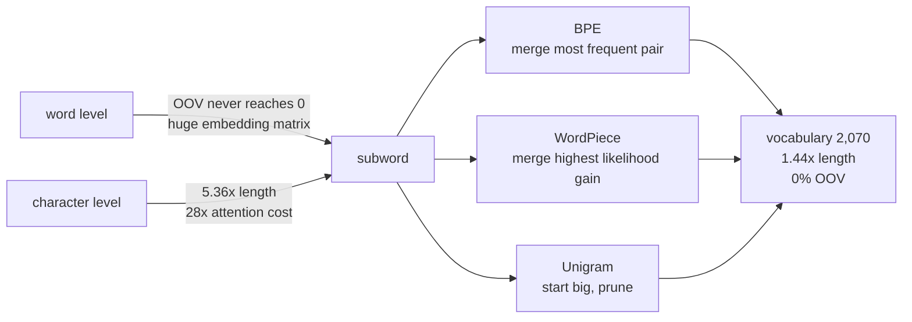

The [previous page](/deep-learning/phase-05---nlp--transformers/text-preprocessing-tokenization-stemming-lemmatization/)
ended on an unavoidable trade: a 10,000-word vocabulary discards **5.5%** of the text,
and a 20,000-word one doubles the embedding matrix to get that down to 2.4%. Both
numbers are bad, and both are consequences of insisting that the unit of text is a word.

**Subword tokenization removes the choice.** Build a vocabulary of *pieces* — frequent
words stay whole, rare words split into parts, and anything unseen is spelled out of
characters. Measured on 39,563 IMDB word types:

| Tokenization | Vocabulary | Tokens per review | OOV rate |
| --- | --- | --- | --- |
| character | 83 | 1,211.3 | **0.0000** |
| **BPE (2,000 merges)** | **2,070** | **324.7** | **0.0000** |
| word | 39,563 | 226.0 | 0.0293 at 20,000 words |

A 2,070-piece vocabulary — 5% the size of the word vocabulary — represents **every**
word ever written, for 1.44× the sequence length.

## What you'll learn

- The BPE algorithm in full, and why it is about forty lines.
- What the first merges actually learn: `'e' + '</w>'`, then `'s' + '</w>'`, then
  `'t' + 'h'`.
- How the vocabulary/length trade moves with merges: **5.2155 pieces per word at 1 merge,
  1.4651 at 2,000**.
- Why the OOV rate is exactly zero rather than merely small.
- How BPE splits words it has never seen — including
  `antidisestablishmentarianism`.
- The difference between BPE, WordPiece, Unigram and SentencePiece.
- The implementation trap that made the first version of this page time out.

## The algorithm

1. Split every word into characters, plus an end-of-word marker `</w>`.
2. Count every adjacent pair of pieces across the corpus, weighted by word frequency.
3. Merge the most frequent pair everywhere; that merged symbol joins the vocabulary.
4. Repeat for as many merges as you want vocabulary entries.

```python title="Byte-pair encoding, the whole idea"
splits = {word: tuple(list(word) + ["</w>"]) for word in counts}
for step in range(merges):
    pairs = Counter()
    for word, pieces in splits.items():
        for pair in zip(pieces, pieces[1:]):
            pairs[pair] += counts[word]          # weight by word frequency
    pair, frequency = pairs.most_common(1)[0]
    if frequency < 2:
        break
    splits = {word: apply(pieces, pair) for word, pieces in splits.items()}
```

The end-of-word marker matters more than it looks. Without it, `est` in `establish` and
`est` in `fastest` are the same piece, and the tokenizer cannot tell a prefix from a
suffix.

Learned on this corpus, the first fifteen merges are:

| # | Merge | # | Merge | # | Merge |
| --- | --- | --- | --- | --- | --- |
| 1 | `e` + `</w>` | 6 | `i` + `n` | 11 | `o` + `n` |
| 2 | `s` + `</w>` | 7 | `r` + `</w>` | 12 | `e` + `n` |
| 3 | `t` + `h` | 8 | `a` + `n` | 13 | `o` + `</w>` |
| 4 | `t` + `</w>` | 9 | `y` + `</w>` | 14 | `e` + `r` |
| 5 | `d` + `</w>` | 10 | `th` + `e</w>` | 15 | `i` + `s</w>` |

BPE has discovered, in order: English words end in *e* and *s*; `th` is the most common
digraph; and by merge 10 it has built the word `the`. Nobody told it any of that — it is
counting.

## Vocabulary against sequence length

<Figure
  src="/images/dl/phase-05-nlp/subword-tokenization/merge-growth"
  alt="Two panels. Left: pieces in use against merges learned, rising almost linearly from 84 at one merge to 2,070 at two thousand. Right: average pieces per word falling from 5.2155 at one merge to 2.4994 at 200, 2.0020 at 500, 1.7026 at 1,000 and 1.4651 at 2,000, approaching but not reaching a dashed line at 1.0."
  title="Every merge adds one symbol and shortens the sequence"
  caption="The left panel is nearly a straight line — one merge, one new symbol — which is what makes the vocabulary size a dial you turn rather than a property of the corpus. The right panel is the payoff, and it has diminishing returns: the first 200 merges cut pieces per word from 5.22 to 2.50, the next 1,800 only get to 1.47. Real tokenizers use 30,000-50,000 merges to push that close to 1 for common text."
/>

| Merges | Pieces in use | Pieces per word | Words kept whole |
| --- | --- | --- | --- |
| 1 | 84 | 5.2155 | 60 |
| 200 | 279 | 2.4994 | 1,284 |
| 500 | 579 | 2.0020 | 2,878 |
| 1,000 | 1,078 | 1.7026 | 5,043 |
| 2,000 | **2,070** | **1.4651** | **8,367** |

"Pieces per word" is token-weighted, so it answers the question you actually care about:
how much longer does my sequence get? At 2,000 merges the answer is 1.47× — and 8,367 of
the 39,563 word types are single pieces, which will be the common ones.

## The measurement that settles it

<Figure
  src="/images/dl/phase-05-nlp/subword-tokenization/oov-elimination"
  alt="Two panels. Left: out-of-vocabulary rate on test tokens against word vocabulary size — the word-level line falls from 0.2276 at 1,000 words to 0.0293 at 20,000, while the subword line sits flat on zero. Right: a monospace listing showing rare and unseen words split into pieces, such as tokenization becoming 'to k en i z ation'."
  title="458,707 test tokens"
  caption="The word-level curve never reaches zero, and it cannot: Heaps' law guarantees the test set contains words the training set did not. The subword line is exactly zero at a vocabulary of 2,070 — twenty times smaller than the 20,000-word vocabulary it is beating. That is not a better trade-off along the same curve; it is a different curve."
/>

| Word vocabulary | Word-level OOV | BPE OOV |
| --- | --- | --- |
| 1,000 | 0.2276 | **0.0000** |
| 5,000 | 0.0944 | **0.0000** |
| 10,000 | 0.0550 | **0.0000** |
| 20,000 | 0.0293 | **0.0000** |

The zero is exact, not rounded, and the reason is structural: the vocabulary contains
every character in the corpus, so the worst case for any word is that it is spelled out.

```text title="Words BPE has never seen as a whole"
                tokenization -> to k en i z ation</w>
             unbelievability -> un believ ab ility</w>
        supercalifragilistic -> super c ali f ra g ili stic</w>
antidisestablishmentarianism -> an ti di se st ab li sh m ent ari an ism</w>
```

Read those splits carefully, because they show both the strength and the limit:

- `un believ ab ility` is close to a morphological analysis, and it was learned from
  frequency counts alone.
- `to k en i z ation` is **not**. BPE is greedy and frequency-driven, not linguistic; it
  found `ation` but mangled the stem.
- `antidisestablishmentarianism` becomes 13 pieces. A word the tokenizer has never seen
  costs sequence length, which is the price of never failing.

## The length trade

<Figure
  src="/images/dl/phase-05-nlp/subword-tokenization/length-tradeoff"
  alt="Three bars of average tokens per review: character tokenization at 1,211.3 tokens with an 83-symbol vocabulary, BPE at 324.7 tokens with 2,070 pieces, and word at 226.0 tokens with 39,563 words."
  title="The same 400 reviews under three tokenizations"
  caption="Characters need no vocabulary at all and pay 5.36x the sequence length — fatal for attention, whose cost grows with the square of the token count. Words are the shortest and cannot handle anything new. BPE sits between them at 1.44x the word length with 5% of the vocabulary, which is why every modern model is somewhere on that middle ground."
/>

For a transformer this trade is sharper than it looks, because attention cost grows with
the **square** of the token count. Character tokenization at 5.36× the length is
**28.73×** the attention cost; BPE at 1.44× is **2.06×**. Exercise 5 works the whole
table, including the embedding matrices: 21,248 parameters for characters against
10,128,128 for words at 256 dimensions.



## The four you will meet

| Algorithm | Merge/keep criterion | Used by |
| --- | --- | --- |
| **BPE** | most frequent adjacent pair | GPT-2, RoBERTa, most LLMs |
| **WordPiece** | pair maximising $\frac{P(xy)}{P(x)P(y)}$ — likelihood gain, not raw count | BERT, DistilBERT |
| **Unigram** | start with a large vocabulary, prune the pieces that cost least likelihood | T5, ALBERT |
| **SentencePiece** | not an algorithm — a wrapper that treats the input as raw bytes, so no pre-tokenizer is needed | multilingual models |

The difference between BPE and WordPiece is one line of the algorithm. BPE takes the
pair that occurs most; WordPiece takes the pair whose merger most increases the corpus
likelihood, which favours pairs that are common *together* relative to how common they
are apart. In practice their outputs are similar, and the marker convention differs more
visibly: BPE typically marks word ends (`ation</w>`), WordPiece marks continuations
(`##ation`).

## The implementation trap

The obvious BPE implementation recounts every pair after every merge. That is quadratic,
and on this corpus — 39,563 words, 2,000 merges — it never finished; the module timed out
at ten minutes.

Only the words containing the merged pair can change, so keeping a `pair → words` index
and updating locally turns it into **5.1 seconds for 200 merges**. The second trap is at
encoding time: replaying all 2,000 merges for each of ~100,000 tokens is another 2×10⁸
operations, when training has *already* computed the final split for every word in the
corpus. Look it up; only genuinely unseen words need the replay.

```p5 title="Learn BPE merges by hand" desc="Click 'merge' to apply the most frequent adjacent pair to this tiny corpus, and watch the vocabulary grow as the sequences shorten." height="360"
const WORDS = [["l", "o", "w", "</w>", 5], ["l", "o", "w", "e", "r", "</w>", 2],
  ["n", "e", "w", "e", "s", "t", "</w>", 6],
  ["w", "i", "d", "e", "s", "t", "</w>", 3]];
let splits = [];
let counts = [];
let merges = [];
function setup() {
  createCanvas(620, 360);
  textFont("monospace");
  reset();
}
function reset() {
  splits = WORDS.map((w) => w.slice(0, w.length - 1));
  counts = WORDS.map((w) => w[w.length - 1]);
  merges = [];
}
function bestPair() {
  const pairs = {};
  splits.forEach((pieces, index) => {
    for (let i = 0; i < pieces.length - 1; i++) {
      const key = pieces[i] + "\0" + pieces[i + 1];
      pairs[key] = (pairs[key] || 0) + counts[index];
    }
  });
  let best = null;
  let bestCount = 0;
  for (const key in pairs) {
    if (pairs[key] > bestCount) { bestCount = pairs[key]; best = key; }
  }
  return best ? { pair: best.split("\0"), count: bestCount } : null;
}
function applyMerge() {
  const found = bestPair();
  if (!found) return;
  merges.push(found);
  splits = splits.map((pieces) => {
    const out = [];
    let i = 0;
    while (i < pieces.length) {
      if (i < pieces.length - 1 && pieces[i] === found.pair[0]
        && pieces[i + 1] === found.pair[1]) {
        out.push(found.pair[0] + found.pair[1]);
        i += 2;
      } else { out.push(pieces[i]); i += 1; }
    }
    return out;
  });
}
function draw() {
  background(13, 17, 23);
  noStroke();
  fill(230);
  textSize(11.5);
  textAlign(LEFT, TOP);
  text("corpus (word x frequency)", 24, 20);
  splits.forEach((pieces, index) => {
    fill(150);
    textSize(10.5);
    text("x" + counts[index], 24, 46 + index * 30);
    let x = 62;
    for (const piece of pieces) {
      const w = piece.length * 9 + 12;
      fill(46, 96, 140);
      rect(x, 42 + index * 30, w, 22, 3);
      fill(235);
      textAlign(CENTER, CENTER);
      textSize(11);
      text(piece, x + w / 2, 53 + index * 30);
      textAlign(LEFT, TOP);
      x += w + 4;
    }
  });
  const vocabulary = new Set();
  splits.forEach((pieces) => pieces.forEach((p) => vocabulary.add(p)));
  const total = splits.reduce((a, pieces, i) => a + pieces.length * counts[i], 0);
  const words = counts.reduce((a, b) => a + b, 0);
  fill(255, 211, 67);
  textSize(11);
  text("pieces in use: " + vocabulary.size
    + "    pieces per word: " + (total / words).toFixed(3), 24, 176);
  const next = bestPair();
  fill(200);
  textSize(10.5);
  text(next ? "next merge: " + next.pair[0] + " + " + next.pair[1]
    + "  (appears " + next.count + " times)" : "nothing left to merge",
    24, 198);
  fill(150);
  text("merges so far: " + (merges.length
    ? merges.map((m) => m.pair[0] + m.pair[1]).join(", ") : "none"), 24, 218);
  fill(60, 70, 84);
  rect(24, 250, 120, 30, 4);
  rect(160, 250, 120, 30, 4);
  fill(220);
  textAlign(CENTER, CENTER);
  textSize(11);
  text("merge", 84, 265);
  text("reset", 220, 265);
  textAlign(LEFT, TOP);
  fill(150);
  textSize(10.5);
  text("on the real corpus the first merges were e+</w>, s+</w>, t+h —",
    24, 300);
  text("English word endings, then the commonest digraph, then 'the'", 24, 316);
}
function mousePressed() {
  if (mouseY > 250 && mouseY < 280) {
    if (mouseX > 24 && mouseX < 144) applyMerge();
    if (mouseX > 160 && mouseX < 280) reset();
  }
}
```

```p5 title="The measured table, ranked" desc="Click a column to rank every row by it. The bars are that column's values and the highest and lowest are computed from the numbers, not written in." height="280"
let metric = 0;
const COLUMNS = ["Pieces in use", "Pieces per word", "Words kept whole"];
const ROWS = [
  ["1", 84, 5.2155, 60],
  ["200", 279, 2.4994, 1284],
  ["500", 579, 2.002, 2878],
  ["1,000", 1078, 1.7026, 5043],
  ["2,000", 2070, 1.4651, 8367]
];
function setup() {
  createCanvas(620, 280);
  textFont("monospace");
}
function fmt(v) {
  if (v === 0) { return "0"; }
  const a = Math.abs(v);
  if (a >= 1000 || a < 0.001) { return v.toExponential(2); }
  if (a >= 100) { return v.toFixed(1); }
  return v.toFixed(4);
}
function draw() {
  background(13, 17, 23);
  noStroke();
  fill(230);
  textSize(12);
  textAlign(LEFT, TOP);
  text("Subword Tokenization (BPE and Word", 26, 16);
  let x = 26;
  for (let i = 0; i < COLUMNS.length; i++) {
    const w = COLUMNS[i].length * 6.6 + 16;
    if (i === metric) { fill(255, 211, 67); } else { fill(48, 56, 68); }
    rect(x, 40, w, 22, 4);
    if (i === metric) { fill(13, 17, 23); } else { fill(180); }
    textSize(9);
    text(COLUMNS[i], x + 8, 47);
    x += w + 6;
    if (x > 500) { break; }
  }
  const values = ROWS.map((r) => r[metric + 1]);
  const lo = Math.min(...values);
  const hi = Math.max(...values);
  const span = hi - lo === 0 ? 1 : hi - lo;
  const order = ROWS.slice().sort((a, b) => b[metric + 1] - a[metric + 1]);
  for (let i = 0; i < order.length; i++) {
    const y = 78 + i * 26;
    const v = order[i][metric + 1];
    fill(160);
    textSize(9);
    text(order[i][0], 26, y + 5);
    fill(34, 40, 50);
    rect(230, y, 280, 18, 3);
    const frac = (v - lo) / span;
    if (v === hi) { fill(126, 192, 143); }
    else if (v === lo) { fill(224, 108, 117); }
    else { fill(107, 169, 221); }
    rect(230, y, Math.max(frac * 280, 3), 18, 3);
    fill(225);
    textSize(9);
    text(fmt(v), 518, y + 5);
  }
  const top = order[0];
  const bottom = order[order.length - 1];
  fill(150);
  textSize(9);
  const base = 78 + order.length * 26 + 8;
  text("highest " + COLUMNS[metric] + ": " + top[0] + " at " + fmt(top[1]),
       26, base);
  text("lowest  " + COLUMNS[metric] + ": " + bottom[0] + " at "
       + fmt(bottom[1]), 26, base + 14);
  text("bars are scaled within the chosen column - lowest is not zero", 26,
       base + 30);
}
function mousePressed() {
  let x = 26;
  for (let i = 0; i < COLUMNS.length; i++) {
    const w = COLUMNS[i].length * 6.6 + 16;
    if (mouseX > x && mouseX < x + w && mouseY > 40 && mouseY < 62) {
      metric = i;
    }
    x += w + 6;
  }
}
```

## Pitfalls

- **Forgetting the end-of-word marker.** Without it the tokenizer cannot distinguish a
  suffix from a prefix, and `est` in `fastest` merges with `est` in `establish`.
- **Recounting all pairs after every merge.** Quadratic; it did not finish on 39,563
  words. Keep a `pair → words` index.
- **Replaying every merge to encode a known word.** Training already produced its split.
- **Assuming subword splits are morphemes.** `un believ ab ility` looks linguistic;
  `to k en i z ation` shows it is frequency, not grammar.
- **Ignoring the sequence-length cost.** 1.44× the tokens is 2.1× the attention cost,
  and character level's 5.36× is 28×.
- **Training the tokenizer on the test set.** It is a model fitted to a corpus, with the
  same leakage rules as any other.
- **Comparing models across different tokenizers.** Perplexity per token is not
  comparable when the tokens are different sizes — a point the
  [evaluation page](/deep-learning/phase-05---nlp--transformers/evaluating-language-models-perplexity-and-bleu/)
  returns to.

## Recap

- BPE: split into characters, repeatedly merge the most frequent adjacent pair. About
  forty lines.
- The first merges learned on this corpus were `e</w>`, `s</w>`, `th`, and by merge 10
  the word `the`.
- 2,000 merges gave 2,070 pieces, 1.4651 pieces per word, and 8,367 of 39,563 word types
  kept whole.
- OOV rate on 458,707 test tokens: **0.0000** for BPE at 2,070 pieces, against 0.0293 for
  a 20,000-word vocabulary.
- Sequence length per review: character 1,211.3, BPE 324.7, word 226.0.
- BPE merges by frequency, WordPiece by likelihood gain, Unigram prunes downward,
  SentencePiece removes the pre-tokenizer.

## Next

With a tokenization that never fails, the question becomes how to turn those tokens into
features. The oldest answer still beats a lot of neural models:
[Bag of Words (BoW) & TF-IDF](/deep-learning/phase-05---nlp--transformers/bag-of-words-bow--tf-idf/).

<Quiz
  questions={[
    {
      q: "A BPE vocabulary of 2,070 pieces had an OOV rate of exactly 0.0000, while a 20,000-word vocabulary had 0.0293. Why is the zero exact rather than merely small?",
      options: [
        "Because the test set happened to contain no rare words",
        "Because the vocabulary contains every character in the corpus, so the worst case for an unknown word is that it is spelled out piece by piece",
        "Because unknown words are dropped",
        "Because BPE was trained on the test set too",
      ],
      answer: 1,
      explain: "It is a structural guarantee, not a lucky measurement — which is why subword tokenization replaced word-level tokenization everywhere.",
    },
    {
      q: "The first merges learned were 'e'+'</w>', then 's'+'</w>', then 't'+'h'. What does that show?",
      options: [
        "The algorithm was seeded with English grammar rules",
        "Nothing was taught — BPE counts adjacent pairs, and English word endings and the 'th' digraph are simply the most frequent pairs in the corpus",
        "The end-of-word marker is unnecessary",
        "The corpus was sorted alphabetically",
      ],
      answer: 1,
      explain: "By merge 10 it had assembled 'the'. The structure it finds is statistical, which is also why 'tokenization' splits as 'to k en i z ation'.",
    },
    {
      q: "Character tokenization needs only 83 symbols and never has an OOV. Why is it not the obvious choice for a transformer?",
      options: [
        "Characters cannot be embedded",
        "It produced 5.36x the sequence length, and attention cost grows with the square of the token count — about 28x the attention compute",
        "Character models cannot learn word meanings at all",
        "The vocabulary is too small to train",
      ],
      answer: 1,
      explain: "BPE's 1.44x length is only 2.1x attention cost, which is why the middle ground won.",
    },
    {
      q: "What is the difference between BPE and WordPiece?",
      options: [
        "WordPiece works on characters, BPE on words",
        "The merge criterion: BPE takes the most frequent adjacent pair, WordPiece takes the pair whose merger most increases corpus likelihood",
        "WordPiece cannot handle unseen words",
        "BPE requires a pre-tokenizer and WordPiece does not",
      ],
      answer: 1,
      explain: "One line of the algorithm. The visible difference is usually the marker convention: 'ation</w>' against '##ation'.",
    },
    {
      q: "The first implementation of this page's BPE timed out after ten minutes. What was wrong?",
      options: [
        "The corpus was too large to tokenize",
        "It recounted every pair in the corpus after every merge — but only the words containing the merged pair can change, so a pair-to-words index makes it fast",
        "Python is too slow for BPE at any scale",
        "The end-of-word marker doubled the work",
      ],
      answer: 1,
      explain: "With the index it runs 200 merges in 5.1 seconds. The second trap is encoding: reuse the splits training already computed rather than replaying all merges per token.",
    },
  ]}
/>

## 🧪 Try It Yourself

<DataCampExercise
  lang="python"
  hint={`Count each adjacent pair weighted by how often the word occurs, then replace that pair everywhere it appears.`}
  code={`# Task: Exercise 1 - BPE on a corpus you can check by hand
from collections import Counter

CORPUS = {"low": 5, "lower": 2, "newest": 6, "widest": 3}
END = "</w>"
splits = {word: tuple(list(word) + [END]) for word in CORPUS}


def pair_counts(splits, counts):
    pairs = Counter()
    for word, pieces in splits.items():
        for pair in zip(pieces, pieces[1:]):
            pairs[pair] += counts[___]           # replace ___ with word
    return pairs


def apply(pieces, pair):
    out, index = [], 0
    while index < len(pieces):
        if (index < len(pieces) - 1 and pieces[index] == pair[0]
                and pieces[index + 1] == pair[1]):
            out.append(pair[0] + pair[1])
            index += 2
        else:
            out.append(pieces[index])
            index += 1
    return tuple(out)


print(f"{'step':>5} {'merge':>14} {'count':>6}  splits")
for step in range(1, 7):
    pairs = pair_counts(splits, CORPUS)
    pair, count = pairs.most_common(1)[0]
    splits = {word: apply(pieces, pair) for word, pieces in splits.items()}
    shown = "  ".join("".join(f"[{p}]" for p in splits[w]) for w in CORPUS)
    print(f"{step:5d} {pair[0] + '+' + pair[1]:>14} {count:6d}  {shown}")
pieces = sum(len(p) for p in splits.values())
print(f"pieces per word (unweighted): {pieces / len(splits):.4f}")
print("frequency decides everything: 'est' forms because 'newest' and")
print("'widest' share it nine times between them")

# -- Expected Output -------------------------------------------
#  step          merge  count  splits
#     1            e+s      9  [l][o][w][</w>]  [l][o][w][e][r][</w>]  [n][e][w][es][t][</w>]  [w][i][d][es][t][</w>]
#     2           es+t      9  [l][o][w][</w>]  [l][o][w][e][r][</w>]  [n][e][w][est][</w>]  [w][i][d][est][</w>]
#     3       est+</w>      9  [l][o][w][</w>]  [l][o][w][e][r][</w>]  [n][e][w][est</w>]  [w][i][d][est</w>]
#     4            l+o      7  [lo][w][</w>]  [lo][w][e][r][</w>]  [n][e][w][est</w>]  [w][i][d][est</w>]
#     5           lo+w      7  [low][</w>]  [low][e][r][</w>]  [n][e][w][est</w>]  [w][i][d][est</w>]
#     6            n+e      6  [low][</w>]  [low][e][r][</w>]  [ne][w][est</w>]  [w][i][d][est</w>]
# pieces per word (unweighted): 3.2500
# frequency decides everything: 'est' forms because 'newest' and
# 'widest' share it nine times between them
# --------------------------------------------------------------`}
  solution={`# Task: Exercise 1 - BPE on a corpus you can check by hand
from collections import Counter

CORPUS = {"low": 5, "lower": 2, "newest": 6, "widest": 3}
END = "</w>"
splits = {word: tuple(list(word) + [END]) for word in CORPUS}


def pair_counts(splits, counts):
    pairs = Counter()
    for word, pieces in splits.items():
        for pair in zip(pieces, pieces[1:]):
            pairs[pair] += counts[word]
    return pairs


def apply(pieces, pair):
    out, index = [], 0
    while index < len(pieces):
        if (index < len(pieces) - 1 and pieces[index] == pair[0]
                and pieces[index + 1] == pair[1]):
            out.append(pair[0] + pair[1])
            index += 2
        else:
            out.append(pieces[index])
            index += 1
    return tuple(out)


print(f"{'step':>5} {'merge':>14} {'count':>6}  splits")
for step in range(1, 7):
    pairs = pair_counts(splits, CORPUS)
    pair, count = pairs.most_common(1)[0]
    splits = {word: apply(pieces, pair) for word, pieces in splits.items()}
    shown = "  ".join("".join(f"[{p}]" for p in splits[w]) for w in CORPUS)
    print(f"{step:5d} {pair[0] + '+' + pair[1]:>14} {count:6d}  {shown}")
pieces = sum(len(p) for p in splits.values())
print(f"pieces per word (unweighted): {pieces / len(splits):.4f}")
print("frequency decides everything: 'est' forms because 'newest' and")
print("'widest' share it nine times between them")

# -- Expected Output -------------------------------------------
#  step          merge  count  splits
#     1            e+s      9  [l][o][w][</w>]  [l][o][w][e][r][</w>]  [n][e][w][es][t][</w>]  [w][i][d][es][t][</w>]
#     2           es+t      9  [l][o][w][</w>]  [l][o][w][e][r][</w>]  [n][e][w][est][</w>]  [w][i][d][est][</w>]
#     3       est+</w>      9  [l][o][w][</w>]  [l][o][w][e][r][</w>]  [n][e][w][est</w>]  [w][i][d][est</w>]
#     4            l+o      7  [lo][w][</w>]  [lo][w][e][r][</w>]  [n][e][w][est</w>]  [w][i][d][est</w>]
#     5           lo+w      7  [low][</w>]  [low][e][r][</w>]  [n][e][w][est</w>]  [w][i][d][est</w>]
#     6            n+e      6  [low][</w>]  [low][e][r][</w>]  [ne][w][est</w>]  [w][i][d][est</w>]
# pieces per word (unweighted): 3.2500
# frequency decides everything: 'est' forms because 'newest' and
# 'widest' share it nine times between them
# --------------------------------------------------------------`}
  sct={`test_output_contains("pieces per word (unweighted): 3.2500", pattern=False)
success_msg("Each merge joins the most frequent adjacent pair, weighted by word frequency, so shared endings like est form first.")`}
  height={400}
/>

<DataCampExercise
  lang="python"
  hint={`Build a dict from each pair to the set of words containing it. After a merge, only rescan those words.`}
  code={`# Task: Exercise 2 - Why the naive implementation does not finish
from collections import Counter
import numpy as np

rng = np.random.default_rng(0)
letters = list("abcdefghijklmnopqrstuvwxyz")
vocabulary = ["".join(rng.choice(letters, int(rng.integers(3, 9))))
              for _ in range(3000)]
weights = 1 / np.arange(1, len(vocabulary) + 1)
tokens = rng.choice(vocabulary, 20000, p=weights / weights.sum())
counts = Counter(str(t) for t in tokens)
print(f"{len(counts):,} distinct words")

END = "</w>"
splits = {word: tuple(list(word) + [END]) for word in counts}
pairs = Counter()
for word, pieces in splits.items():
    for pair in zip(pieces, pieces[1:]):
        pairs[pair] += counts[word]

# an index from each pair to the words that contain it
index = {}
for word, pieces in splits.items():
    for pair in zip(pieces, pieces[1:]):
        index.setdefault(pair, set()).add(___)   # the word that contains the pair

top = max(pairs.items(), key=lambda item: item[1])[0]
share = len(index[top]) / len(splits)
print(f"the most frequent pair appears in {len(index[top])} of {len(splits)} words")
print("a merge touches less than half of the corpus:", share < 0.5)
print("every word in the index really contains the pair:",
      all(top in set(zip(splits[w], splits[w][1:])) for w in index[top]))`}
  solution={`# Task: Exercise 2 - Why the naive implementation does not finish
from collections import Counter
import numpy as np

rng = np.random.default_rng(0)
letters = list("abcdefghijklmnopqrstuvwxyz")
vocabulary = ["".join(rng.choice(letters, int(rng.integers(3, 9))))
              for _ in range(3000)]
weights = 1 / np.arange(1, len(vocabulary) + 1)
tokens = rng.choice(vocabulary, 20000, p=weights / weights.sum())
counts = Counter(str(t) for t in tokens)
print(f"{len(counts):,} distinct words")

END = "</w>"
splits = {word: tuple(list(word) + [END]) for word in counts}
pairs = Counter()
for word, pieces in splits.items():
    for pair in zip(pieces, pieces[1:]):
        pairs[pair] += counts[word]

# an index from each pair to the words that contain it
index = {}
for word, pieces in splits.items():
    for pair in zip(pieces, pieces[1:]):
        index.setdefault(pair, set()).add(word)   # the word that contains the pair

top = max(pairs.items(), key=lambda item: item[1])[0]
share = len(index[top]) / len(splits)
print(f"the most frequent pair appears in {len(index[top])} of {len(splits)} words")
print("a merge touches less than half of the corpus:", share < 0.5)
print("every word in the index really contains the pair:",
      all(top in set(zip(splits[w], splits[w][1:])) for w in index[top]))`}
  sct={`test_output_contains("a merge touches less than half of the corpus: True", pattern=False)
test_output_contains("every word in the index really contains the pair: True", pattern=False)
success_msg("An inverted index means a merge only revisits the words that contain the pair, not the whole corpus.")`}
  height={400}
/>

<DataCampExercise
  lang="python"
  hint={`Apply the learned merges in the order they were learned. Anything not covered by a merge stays as a single character.`}
  code={`# Task: Exercise 3 - Encoding a word BPE has never seen
END = "</w>"
# A few merges learned earlier, in order.
MERGES = [("e", END), ("s", END), ("t", "h"), ("t", END), ("d", END),
          ("i", "n"), ("r", END), ("a", "n"), ("th", "e" + END),
          ("e", "r"), ("i", "n" + "g"), ("in", "g"), ("a", "t"),
          ("at", "i"), ("ati", "on")]


def apply(pieces, pair):
    out, index = [], 0
    while index < len(pieces):
        if (index < len(pieces) - 1 and pieces[index] == pair[0]
                and pieces[index + 1] == pair[1]):
            out.append(pair[0] + pair[1])
            index += 2
        else:
            out.append(pieces[index])
            index += 1
    return tuple(out)


def encode(word):
    pieces = tuple(list(word) + [END])
    for pair in ___:                             # replace ___ with MERGES
        pieces = apply(pieces, pair)
    return pieces


for word in ("the", "there", "rating", "quantization", "zzzz"):
    pieces = encode(word)
    print(f"{word:>14} -> {' '.join(pieces):40s} ({len(pieces)} pieces)")
print("no word can fail: the worst case is one piece per character, which is")
print("why the out-of-vocabulary rate is exactly zero rather than small")

# -- Expected Output -------------------------------------------
#            the -> the</w>                                  (1 pieces)
#          there -> th er e</w>                              (3 pieces)
#         rating -> r at ing </w>                            (4 pieces)
#   quantization -> q u an t i z ati o n </w>                (10 pieces)
#           zzzz -> z z z z </w>                             (5 pieces)
# no word can fail: the worst case is one piece per character, which is
# why the out-of-vocabulary rate is exactly zero rather than small
# --------------------------------------------------------------`}
  solution={`# Task: Exercise 3 - Encoding a word BPE has never seen
END = "</w>"
# A few merges learned earlier, in order.
MERGES = [("e", END), ("s", END), ("t", "h"), ("t", END), ("d", END),
          ("i", "n"), ("r", END), ("a", "n"), ("th", "e" + END),
          ("e", "r"), ("i", "n" + "g"), ("in", "g"), ("a", "t"),
          ("at", "i"), ("ati", "on")]


def apply(pieces, pair):
    out, index = [], 0
    while index < len(pieces):
        if (index < len(pieces) - 1 and pieces[index] == pair[0]
                and pieces[index + 1] == pair[1]):
            out.append(pair[0] + pair[1])
            index += 2
        else:
            out.append(pieces[index])
            index += 1
    return tuple(out)


def encode(word):
    pieces = tuple(list(word) + [END])
    for pair in MERGES:
        pieces = apply(pieces, pair)
    return pieces


for word in ("the", "there", "rating", "quantization", "zzzz"):
    pieces = encode(word)
    print(f"{word:>14} -> {' '.join(pieces):40s} ({len(pieces)} pieces)")
print("no word can fail: the worst case is one piece per character, which is")
print("why the out-of-vocabulary rate is exactly zero rather than small")

# -- Expected Output -------------------------------------------
#            the -> the</w>                                  (1 pieces)
#          there -> th er e</w>                              (3 pieces)
#         rating -> r at ing </w>                            (4 pieces)
#   quantization -> q u an t i z ati o n </w>                (10 pieces)
#           zzzz -> z z z z </w>                             (5 pieces)
# no word can fail: the worst case is one piece per character, which is
# why the out-of-vocabulary rate is exactly zero rather than small
# --------------------------------------------------------------`}
  sct={`test_output_contains("zzzz -> z z z z </w>", pattern=False)
test_output_contains("(5 pieces)", pattern=False)
success_msg("Encoding replays the learned merges in order, and an unseen word simply falls back to characters, so nothing is ever out of vocabulary.")`}
  height={400}
/>

<DataCampExercise
  lang="python"
  hint={`Coverage is the share of test tokens whose word is in the training vocabulary. A subword vocabulary that contains every character can never miss.`}
  code={`# Task: Exercise 4 - The out-of-vocabulary rate, both ways
from collections import Counter
import numpy as np

rng = np.random.default_rng(1)
letters = list("abcdefghijklmnopqrstuvwxyz")
vocabulary = ["".join(rng.choice(letters, int(rng.integers(3, 9))))
              for _ in range(6000)]
weights = 1 / np.arange(1, len(vocabulary) + 1)
weights = weights / weights.sum()
train_tokens = [str(t) for t in rng.choice(vocabulary, 20000, p=weights)]
test_tokens = [str(t) for t in rng.choice(vocabulary, 10000, p=weights)]

train_counts = Counter(train_tokens)
ordered = [word for word, _ in train_counts.most_common()]
alphabet = {character for word in train_counts for character in word}
print(f"the character alphabet has {len(alphabet)} symbols")
word_rates, char_rates = [], []
for cap in (500, 1000, 2000, 4000):
    allowed = set(ordered[:cap])
    missing = sum(1 for token in test_tokens if token not in allowed)
    char_missing = sum(1 for token in test_tokens
                       if not set(token) <= ___)   # the character alphabet
    word_rates.append(missing / len(test_tokens))
    char_rates.append(char_missing / len(test_tokens))
    print(f"{cap:6d} words: OOV {word_rates[-1]:.4f}, char OOV {char_rates[-1]:.4f}")
print("the word-level rate never reaches zero:", min(word_rates) > 0)
print("the character-level rate is exactly zero:", max(char_rates) == 0)`}
  solution={`# Task: Exercise 4 - The out-of-vocabulary rate, both ways
from collections import Counter
import numpy as np

rng = np.random.default_rng(1)
letters = list("abcdefghijklmnopqrstuvwxyz")
vocabulary = ["".join(rng.choice(letters, int(rng.integers(3, 9))))
              for _ in range(6000)]
weights = 1 / np.arange(1, len(vocabulary) + 1)
weights = weights / weights.sum()
train_tokens = [str(t) for t in rng.choice(vocabulary, 20000, p=weights)]
test_tokens = [str(t) for t in rng.choice(vocabulary, 10000, p=weights)]

train_counts = Counter(train_tokens)
ordered = [word for word, _ in train_counts.most_common()]
alphabet = {character for word in train_counts for character in word}
print(f"the character alphabet has {len(alphabet)} symbols")
word_rates, char_rates = [], []
for cap in (500, 1000, 2000, 4000):
    allowed = set(ordered[:cap])
    missing = sum(1 for token in test_tokens if token not in allowed)
    char_missing = sum(1 for token in test_tokens
                       if not set(token) <= alphabet)   # the character alphabet
    word_rates.append(missing / len(test_tokens))
    char_rates.append(char_missing / len(test_tokens))
    print(f"{cap:6d} words: OOV {word_rates[-1]:.4f}, char OOV {char_rates[-1]:.4f}")
print("the word-level rate never reaches zero:", min(word_rates) > 0)
print("the character-level rate is exactly zero:", max(char_rates) == 0)`}
  sct={`test_output_contains("the word-level rate never reaches zero: True", pattern=False)
test_output_contains("the character-level rate is exactly zero: True", pattern=False)
success_msg("A word vocabulary always meets words it has not seen; a character alphabet cannot, which is why subwords fall back to characters.")`}
  height={400}
/>

<DataCampExercise
  lang="python"
  hint={`Attention compares every token with every other, so its cost is proportional to the square of the sequence length.`}
  code={`# Task: Exercise 5 - What the extra length costs a transformer
MEASURED = {"character": (83, 1211.3), "BPE": (2070, 324.7),
            "word": (39563, 226.0)}
EMBEDDING = 256

print(f"{'tokenization':14s} {'vocabulary':>11} {'tokens':>9} "
      f"{'length vs word':>15} {'attention vs word':>18} "
      f"{'embedding params':>17}")
base = MEASURED["word"][1]
for label, (vocabulary, tokens) in MEASURED.items():
    length_ratio = tokens / base
    attention_ratio = length_ratio ** ___        # replace ___ with 2
    print(f"{label:14s} {vocabulary:11,} {tokens:9.1f} "
          f"{length_ratio:14.2f}x {attention_ratio:17.2f}x "
          f"{vocabulary * EMBEDDING:17,}")
print("characters save 39,480 vocabulary entries and pay 28x the attention")
print("cost; BPE gives up a little length to keep both bills small")

# -- Expected Output -------------------------------------------
# tokenization    vocabulary    tokens  length vs word  attention vs word  embedding params
# character               83    1211.3           5.36x             28.73x            21,248
# BPE                  2,070     324.7           1.44x              2.06x           529,920
# word                39,563     226.0           1.00x              1.00x        10,128,128
# characters save 39,480 vocabulary entries and pay 28x the attention
# cost; BPE gives up a little length to keep both bills small
# --------------------------------------------------------------`}
  solution={`# Task: Exercise 5 - What the extra length costs a transformer
MEASURED = {"character": (83, 1211.3), "BPE": (2070, 324.7),
            "word": (39563, 226.0)}
EMBEDDING = 256

print(f"{'tokenization':14s} {'vocabulary':>11} {'tokens':>9} "
      f"{'length vs word':>15} {'attention vs word':>18} "
      f"{'embedding params':>17}")
base = MEASURED["word"][1]
for label, (vocabulary, tokens) in MEASURED.items():
    length_ratio = tokens / base
    attention_ratio = length_ratio ** 2
    print(f"{label:14s} {vocabulary:11,} {tokens:9.1f} "
          f"{length_ratio:14.2f}x {attention_ratio:17.2f}x "
          f"{vocabulary * EMBEDDING:17,}")
print("characters save 39,480 vocabulary entries and pay 28x the attention")
print("cost; BPE gives up a little length to keep both bills small")

# -- Expected Output -------------------------------------------
# tokenization    vocabulary    tokens  length vs word  attention vs word  embedding params
# character               83    1211.3           5.36x             28.73x            21,248
# BPE                  2,070     324.7           1.44x              2.06x           529,920
# word                39,563     226.0           1.00x              1.00x        10,128,128
# characters save 39,480 vocabulary entries and pay 28x the attention
# cost; BPE gives up a little length to keep both bills small
# --------------------------------------------------------------`}
  sct={`test_output_contains("28.73x", pattern=False)
success_msg("Attention cost grows with the square of the sequence length, so characters pay about 29 times the attention bill while BPE stays small.")`}
  height={400}
/>
