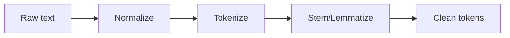

## In plain words

Before any neural network can "read" text, the text has to become numbers. That's
the whole job of preprocessing: chop a sentence into pieces, clean those pieces up,
and give each one an ID. Everything downstream — embeddings, RNNs, attention,
Transformers — starts from this step.

## Why preprocessing exists

Text is messy:

- punctuation
- capitalization
- emojis
- spelling variations

Preprocessing reduces noise and makes feature extraction more consistent.

## Tokenization

Tokenization splits text into units (tokens):

- words
- subwords
- characters

Example:

"I love NLP!" → ["I", "love", "NLP"]

## Stemming

Stemming cuts words down to a root form:

- "running" → "run"
- "studies" → "studi" (can be rough)

Pros:

- simple, fast

Cons:

- can create non-words

## Lemmatization

Lemmatization converts to the dictionary form (lemma):

- "better" → "good"
- "running" → "run"

Pros:

- more accurate than stemming

Cons:

- slower, needs language rules

## Common steps

- lowercasing
- removing extra spaces
- removing/keeping punctuation depending on task
- stop word removal (sometimes)



## Two levels of tokenization (from the book)

*Hands-On Machine Learning* builds its Char-RNN using Keras's `Tokenizer` class
with `char_level=True`, so every **character** — not word — gets its own ID:

```python title="Character-level vs word-level tokenizers" showLineNumbers{1}
import tensorflow as tf

text = "First we tokenize"

# Character-level tokenizer (used for the book's Shakespeare Char-RNN)
char_tokenizer = tf.keras.preprocessing.text.Tokenizer(char_level=True)
char_tokenizer.fit_on_texts([text])
print("Char IDs:", char_tokenizer.texts_to_sequences(["First"]))
print("Distinct characters:", len(char_tokenizer.word_index))

# Word-level tokenizer (the default, used for IMDb sentiment analysis)
word_tokenizer = tf.keras.preprocessing.text.Tokenizer(char_level=False)
word_tokenizer.fit_on_texts([text])
print("Word IDs:", word_tokenizer.texts_to_sequences(["First we tokenize"]))
print("Distinct words:", len(word_tokenizer.word_index))
```

```
Char IDs: [[6, 3, 1, 7, 2]]
Distinct characters: 9
Word IDs: [[3, 4, 1]]
Distinct words: 4
```

:::tip[From the book]
The book notes that a word-level `Tokenizer` "filters out a lot of characters,
including most punctuation, line breaks, and tabs" and "uses spaces to identify word
boundaries." That works for English, but not every language uses spaces this way —
Chinese doesn't use spaces between words at all, and German often glues words
together. This is exactly why modern pipelines (SentencePiece, WordPiece, byte pair
encoding) tokenize at the **subword** level instead: a model that has seen "smart"
and the suffix "est" can still make a reasonable guess at "smartest," even if it
never saw that exact word during training.
:::

## The three steps every vectorizer follows

Whichever library you reach for, turning text into numbers always follows the
same three-step template:

1. **Standardize** — lowercase it, strip punctuation, so "Sunset" and "sunset"
   don't end up as two different tokens.
2. **Tokenize** — split the standardized text into units (words, subwords, or
   characters).
3. **Index** — assign each distinct token an integer ID, using a vocabulary
   built from the training data.

Keras bundles all three steps into a single layer: `TextVectorization`. It
standardizes, tokenizes, and indexes text in one call, and — because it's a
real Keras layer — it can live directly inside a `tf.data` pipeline or inside
the model itself.

```python title="The Keras TextVectorization layer" showLineNumbers{1}
from tensorflow.keras.layers import TextVectorization

text_vectorization = TextVectorization(output_mode="int")

dataset = [
    "I write, erase, rewrite",
    "Erase again, and then",
    "A poppy blooms.",
]
text_vectorization.adapt(dataset)   # builds the vocabulary from the dataset

test_sentence = "I write, rewrite, and still rewrite again"
encoded_sentence = text_vectorization(test_sentence)
print("Encoded:", encoded_sentence.numpy())

vocabulary = text_vectorization.get_vocabulary()
inverse_vocab = dict(enumerate(vocabulary))
decoded_sentence = " ".join(inverse_vocab[int(i)] for i in encoded_sentence)
print("Decoded:", decoded_sentence)
```

```
Encoded: [ 7  3  5  9  1  5 10]
Decoded: i write rewrite and [UNK] rewrite again
```

Two vocabulary slots are always reserved before any real word gets an ID:

- **index 0** — the **mask** token, used to pad shorter sequences so a batch
  can be one contiguous tensor; it means "ignore me, I'm not a real word."
- **index 1** — the **`[UNK]`** (out-of-vocabulary) token, a catch-all for any
  word the vectorizer never saw during `adapt()` — like `"rewrite"`'s cousin
  `"still"` above, which got mapped to `[UNK]` because it wasn't common enough
  to make the vocabulary.

:::tip[From the book]
Chollet points out *why* index 1 and not 0 is used for unknown words: "0 is
already taken" by the mask token. Both are reserved before you ever see a real
word, which is a detail worth remembering the first time you're confused about
why your vocabulary's word IDs start at 2 instead of 0.
:::

## Visualize it

Here's how raw text moves through the preprocessing pipeline before it reaches a model.

```mermaid title="NLP preprocessing pipeline" desc="How raw text is tokenized, cleaned, and reduced to root forms before modeling."
flowchart LR
  A["Raw text"] --> B["Tokenize \(split into words\)"]
  B --> C["Lowercase + remove stopwords"]
  C --> D["Stem or lemmatize \(reduce to root form\)"]
  D --> E["Clean tokens ready for a model"]
```

## Mini-checkpoint

Should you always remove stop words?

- Not always. For sentiment tasks, words like "not" are critical.

import DataCampExercise from "../../../../components/DataCampExercise.astro";

## 🧪 Try It Yourself

### Exercise 1 – Tokenize a Sentence

<DataCampExercise
  lang="python"
  hint={`Use \`text.lower().split()\` to tokenize on whitespace after lowercasing.`}
  code={`# Task: Exercise 1 – Tokenize a Sentence
text = "I LOVE Natural Language Processing!"

tokens = text.___().split()   # replace ___ with lower
print("Tokens:", tokens)

# ── Expected Output ───────────────────────────────────────────
# Tokens: ['i', 'love', 'natural', 'language', 'processing!']
# ──────────────────────────────────────────────────────────────`}
  solution={`text = "I LOVE Natural Language Processing!"
tokens = text.lower().split()
print("Tokens:", tokens)`}
  sct={`test_output_contains("Tokens:")
success_msg("Text tokenized correctly!")`}
  height={140}
/>

### Exercise 2 – Strip Punctuation Before Tokenizing

<DataCampExercise
  lang="python"
  hint={`\`re.sub(r"[^a-zA-Z\\s]", "", text)\` removes anything that isn't a letter or whitespace.`}
  code={`# Task: Exercise 2 – Strip Punctuation Before Tokenizing
import re

text = "Well, I can't believe it!!!"

cleaned = re.___(r"[^a-zA-Z\\s']", "", text)  # replace ___ with sub
print("Cleaned:", cleaned)
print("Tokens:", cleaned.split())

# ── Expected Output ───────────────────────────────────────────
# Cleaned: Well I can't believe it
# Tokens: ['Well', 'I', "can't", 'believe', 'it']
# ──────────────────────────────────────────────────────────────`}
  solution={`import re

text = "Well, I can't believe it!!!"
cleaned = re.sub(r"[^a-zA-Z\\s']", "", text)
print("Cleaned:", cleaned)
print("Tokens:", cleaned.split())`}
  sct={`test_output_contains("Cleaned:")
success_msg("Punctuation removed and text tokenized!")`}
  height={150}
/>

### Exercise 3 – A Tiny Stemmer

<DataCampExercise
  lang="python"
  hint={`Use \`word[:-len(suffix)]\` (a slice) to chop the suffix off the end of the word.`}
  code={`# Task: Exercise 3 – A Tiny Stemmer
def naive_stem(word):
    for suffix in ("ing", "ed", "es", "s"):
        if word.endswith(suffix):
            return word[: -___(suffix)]   # replace ___ with len
    return word

words = ["running", "studies", "played", "cats"]
stems = [naive_stem(w) for w in words]
print("Stems:", stems)

# ── Expected Output ───────────────────────────────────────────
# Stems: ['runn', 'studi', 'play', 'cat']
# ──────────────────────────────────────────────────────────────`}
  solution={`def naive_stem(word):
    for suffix in ("ing", "ed", "es", "s"):
        if word.endswith(suffix):
            return word[: -len(suffix)]
    return word

words = ["running", "studies", "played", "cats"]
stems = [naive_stem(w) for w in words]
print("Stems:", stems)`}
  sct={`test_output_contains("Stems:")
success_msg("You built a (very naive) stemmer!")`}
  height={160}
/>

## Next

Continue to **Bag of Words (BoW) & TF-IDF** — turn these clean tokens into the
numeric vectors a model can actually train on.
