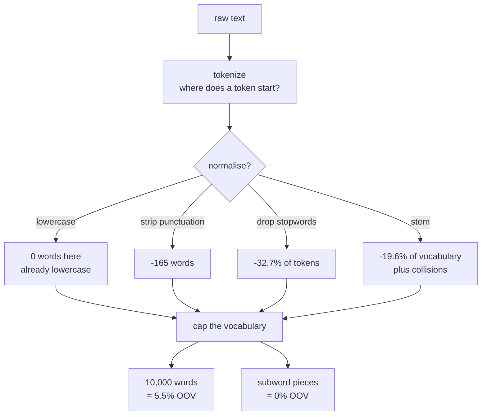

A network takes numbers. Text is not numbers, and every decision on the way from one to
the other — where a token starts, what counts as the same word, which words to keep — is
made *before* the model sees anything and cannot be undone by training.

This page counts those decisions on 5,000 IMDB reviews decoded back into words:
**1,219,106 tokens, 43,783 distinct ones**. It opens with an uncomfortable observation
about that corpus, because it is the most common way this material misleads people.

## The decisions were already made for you

`keras.datasets.imdb` ships integer ids, not text. Somebody already tokenized,
lowercased and stripped punctuation. Apply those steps yourself and watch nothing
happen:

| Step | Distinct words | Tokens |
| --- | --- | --- |
| raw (as shipped) | 43,783 | 1,219,106 |
| lowercased | **43,783** | 1,219,106 |
| punctuation stripped | 43,618 | 1,218,706 |
| 27 stopwords removed | 43,591 | **820,241** |
| suffixes stripped | **35,215** | 820,241 |

Lowercasing changes the vocabulary by **zero words**. Stripping punctuation removes 165.
If you benchmark preprocessing on this dataset you will conclude that preprocessing does
not matter, and you will be measuring the previous engineer's work rather than your own.

The evidence that the cleanup was imperfect sits at rank 7 of the frequency table:

| Rank | Token | Uses | Share of all tokens |
| --- | --- | --- | --- |
| 1 | `the` | 68,738 | 0.0564 |
| 2 | `and` | 33,462 | 0.0274 |
| 3 | `a` | 33,325 | 0.0273 |
| … | | | |
| **7** | **`br`** | **20,864** | **0.0171** |

`br` is the remains of `<br />` tags. It is the seventh most common "word" in the
corpus — ahead of *in*, *it* and *i* — and it carries no meaning at all. Every model in
this phase spends capacity on it.

## What you'll learn

- Why the vocabulary never stops growing: **Heaps' exponent 0.573** on this corpus.
- Zipf's law, measured: **slope −1.0731** over the first 2,000 ranks.
- What a vocabulary cap costs: 10,000 words cover **0.9450** of tokens, so 5.5% of the
  text becomes `<oov>`.
- Why **42.9% of the vocabulary is words seen exactly once**, and they are 1.54% of the
  text.
- What each normalisation step buys and what it destroys.
- Where classic preprocessing ends and subword tokenization begins.

## The two laws that shape every vocabulary

<Figure
  src="/images/dl/phase-05-nlp/text-preprocessing/vocabulary-growth"
  alt="Two panels. Left: distinct words seen against documents read — a curve rising steeply then flattening but never levelling off, reaching 43,783 words at 5,000 reviews, titled with Heaps' exponent 0.573. Right: bars showing 18,762 words seen once at 42.9%, 6,333 seen twice at 14.5%, and 18,688 seen three or more times at 42.7%."
  title="5,000 IMDB reviews"
  caption="The left curve is Heaps' law: distinct words grow as tokens^0.573, so reading twice as much text still turns up about 49% more new words. It never saturates, which is why 'just use the whole vocabulary' is not a strategy. The right panel says what those extra words are — 42.9% of the vocabulary appeared exactly once, and no model learns anything from a single occurrence."
/>

$$
V(n) = k\,n^{\beta}, \quad \beta = 0.573
\qquad\qquad
f(r) \propto r^{-s}, \quad s = 1.0731
$$

Heaps' law says the vocabulary grows without bound. Zipf's law says the extra words are
nearly worthless: frequency falls as roughly $1/r$, so a few thousand words are almost
all of the text.

<Figure
  src="/images/dl/phase-05-nlp/text-preprocessing/zipf-and-coverage"
  alt="Two panels. Left: log-log rank against frequency, a near-straight line with a fitted dashed slope of -1.073, deviating at the head and stepping down to a floor of one at the tail. Right: cumulative token coverage against vocabulary size on a log axis, marked at 1,000 words covering 0.7624, 5,000 covering 0.9013, 10,000 covering 0.9450 and 20,000 covering 0.9764."
  title="Zipf's law and what it means for a vocabulary cap"
  caption="The straight line on log-log axes is the law. The right panel is the practical consequence, and the reason 10,000 is such a common default: it covers 94.5% of tokens with a quarter of the words. The flat tail on the left — the step down to frequency 1 — is those 18,762 once-seen words, and it is also why the slope is fitted over the first 2,000 ranks only."
/>

| Vocabulary | Token coverage | OOV rate |
| --- | --- | --- |
| 1,000 | 0.7624 | 0.2376 |
| 5,000 | 0.9013 | 0.0987 |
| **10,000** | **0.9450** | **0.0550** |
| 20,000 | 0.9764 | 0.0236 |

Every OOV rate there is text your model never sees. Doubling the vocabulary from 10,000
to 20,000 halves the loss — and doubles the embedding matrix. The
[next page](/deep-learning/phase-05---nlp--transformers/subword-tokenization-bpe-and-wordpiece/)
gets the OOV rate to exactly zero without either cost.

## Normalisation: what it buys, what it destroys

<Figure
  src="/images/dl/phase-05-nlp/text-preprocessing/normalisation-effects"
  alt="Two panels. Left: horizontal bars for five cumulative normalisation steps, all near 43,700 distinct words except the last, suffix stripping, which drops to 35,215. Right: a monospace list of word groups a crude suffix stripper merges, such as 'affect' from affect, affected, affectedly, affecting, affectingly and affects."
  title="Each step shrinks the vocabulary — and merges words that were different"
  caption="Only the last step does real work on this corpus, cutting the vocabulary by 19.6%. The right panel is the price: 'affectingly' and 'affects' become one token, and so do 'car' and 'caring' — a collision no dictionary-based lemmatizer would make. Removing 27 stopwords left the vocabulary almost unchanged (43,618 to 43,591) while deleting 32.7% of all tokens, which is exactly what stopwords are: a handful of types carrying enormous mass."
/>

| Technique | What it does | Cost |
| --- | --- | --- |
| **lowercasing** | `The` → `the` | loses `US` vs `us`, `Apple` vs `apple` |
| **punctuation stripping** | `don't` → `dont` | splits or merges contractions inconsistently |
| **stopword removal** | drops `the`, `a`, `of`… | 32.7% of tokens gone; destroys negation and phrasing |
| **stemming** | `affecting` → `affect` | rule-based; merges words that differ |
| **lemmatization** | `better` → `good` | dictionary-based, slower, needs a POS tagger |

Two of these deserve a warning rather than a description:

- **Stopword removal deleted 32.7% of the corpus.** For a bag-of-words model that is
  usually harmless. For anything that reads word order it is destructive — "not good"
  and "good" become identical once `not` is dropped, and plenty of published stopword
  lists contain `not`.
- **Stemming merges words a reader would not.** The measured collisions include
  `car`, `cared`, `cares`, `caring` → `car`. It buys a 19.6% smaller vocabulary; whether
  that is worth it depends on whether your model has enough data to learn the inflections
  separately.

Modern practice is to do **less** of this, not more. Subword tokenization removes the
vocabulary pressure that made aggressive normalisation attractive, and a model with
enough data learns that "affects" and "affecting" are related without being told.



```p5 title="Zipf, coverage and the cap you choose" desc="Drag the vocabulary cap. The bars follow the measured Zipf slope; the readout is what that cap covers and what it throws away." height="330"
let cap = 40;
let dragging = false;
const N = 120;
const frequencies = [];
function setup() {
  createCanvas(620, 330);
  textFont("monospace");
  let total = 0;
  for (let r = 1; r <= N; r++) {
    const f = Math.pow(r, -1.0731);
    frequencies.push(f);
    total += f;
  }
  for (let r = 0; r < N; r++) frequencies[r] /= total;
}
function draw() {
  background(13, 17, 23);
  const left = 40;
  const width = 540;
  const w = width / N;
  let covered = 0;
  for (let r = 0; r < cap; r++) covered += frequencies[r];
  noStroke();
  for (let r = 0; r < N; r++) {
    const h = Math.pow(frequencies[r] / frequencies[0], 0.45) * 170;
    if (r < cap) fill(165, 214, 164);
    else fill(70, 80, 96);
    rect(left + r * w, 210 - h, w - 1, h);
  }
  stroke(255, 211, 67);
  strokeWeight(2);
  line(left + cap * w, 30, left + cap * w, 214);
  noStroke();
  fill(230);
  textSize(11.5);
  textAlign(LEFT, TOP);
  text("rank-frequency, measured Zipf slope -1.0731", left, 20);
  fill(255, 211, 67);
  text("vocabulary cap: top " + cap + " of " + N + " ranks", left, 228);
  fill(165, 214, 164);
  text("covers " + (covered * 100).toFixed(1) + "% of tokens", left, 246);
  fill(230, 90, 90);
  text("throws away " + ((1 - covered) * 100).toFixed(1)
    + "% — every one becomes <oov>", left, 264);
  fill(150);
  textSize(10.5);
  text("on the real corpus: 1,000 words cover 76.2%, 10,000 cover 94.5%",
    left, 290);
  fill(60, 70, 84);
  rect(left, 312, width, 4, 2);
  fill(255, 211, 67);
  circle(left + (cap / N) * width, 314, 12);
}
function mousePressed() { if (Math.abs(mouseY - 314) < 12) dragging = true; }
function mouseDragged() {
  if (dragging) {
    cap = Math.max(1, Math.round(Math.min(Math.max((mouseX - 40) / 540, 0), 1)
      * N));
  }
}
function mouseReleased() { dragging = false; }
```

```p5 title="The measured table, ranked" desc="Click a column to rank every row by it. The bars are that column's values and the highest and lowest are computed from the numbers, not written in." height="280"
let metric = 0;
const COLUMNS = ["Distinct words", "Tokens"];
const ROWS = [
  ["raw (as shipped)", 43783, 1219106],
  ["lowercased", 43783, 1219106],
  ["punctuation stripped", 43618, 1218706],
  ["27 stopwords removed", 43591, 820241],
  ["suffixes stripped", 35215, 820241]
];
function setup() {
  createCanvas(620, 280);
  textFont("monospace");
}
function fmt(v) {
  if (v === 0) { return "0"; }
  const a = Math.abs(v);
  if (a >= 1000 || a < 0.001) { return v.toExponential(2); }
  if (a >= 100) { return v.toFixed(1); }
  return v.toFixed(4);
}
function draw() {
  background(13, 17, 23);
  noStroke();
  fill(230);
  textSize(12);
  textAlign(LEFT, TOP);
  text("Text Preprocessing (Tokenization, ", 26, 16);
  let x = 26;
  for (let i = 0; i < COLUMNS.length; i++) {
    const w = COLUMNS[i].length * 6.6 + 16;
    if (i === metric) { fill(255, 211, 67); } else { fill(48, 56, 68); }
    rect(x, 40, w, 22, 4);
    if (i === metric) { fill(13, 17, 23); } else { fill(180); }
    textSize(9);
    text(COLUMNS[i], x + 8, 47);
    x += w + 6;
    if (x > 500) { break; }
  }
  const values = ROWS.map((r) => r[metric + 1]);
  const lo = Math.min(...values);
  const hi = Math.max(...values);
  const span = hi - lo === 0 ? 1 : hi - lo;
  const order = ROWS.slice().sort((a, b) => b[metric + 1] - a[metric + 1]);
  for (let i = 0; i < order.length; i++) {
    const y = 78 + i * 26;
    const v = order[i][metric + 1];
    fill(160);
    textSize(9);
    text(order[i][0], 26, y + 5);
    fill(34, 40, 50);
    rect(230, y, 280, 18, 3);
    const frac = (v - lo) / span;
    if (v === hi) { fill(126, 192, 143); }
    else if (v === lo) { fill(224, 108, 117); }
    else { fill(107, 169, 221); }
    rect(230, y, Math.max(frac * 280, 3), 18, 3);
    fill(225);
    textSize(9);
    text(fmt(v), 518, y + 5);
  }
  const top = order[0];
  const bottom = order[order.length - 1];
  fill(150);
  textSize(9);
  const base = 78 + order.length * 26 + 8;
  text("highest " + COLUMNS[metric] + ": " + top[0] + " at " + fmt(top[1]),
       26, base);
  text("lowest  " + COLUMNS[metric] + ": " + bottom[0] + " at "
       + fmt(bottom[1]), 26, base + 14);
  text("bars are scaled within the chosen column - lowest is not zero", 26,
       base + 30);
}
function mousePressed() {
  let x = 26;
  for (let i = 0; i < COLUMNS.length; i++) {
    const w = COLUMNS[i].length * 6.6 + 16;
    if (mouseX > x && mouseX < x + w && mouseY > 40 && mouseY < 62) {
      metric = i;
    }
    x += w + 6;
  }
}
```

## Pitfalls

- **Benchmarking preprocessing on a pre-processed corpus.** Lowercasing IMDB changes the
  vocabulary by 0 words; you are measuring somebody else's pipeline.
- **Trusting the cleanup.** `br` is the 7th most frequent token here, at 20,864 uses.
- **Removing stopwords before a sequence model.** It deleted 32.7% of tokens, and many
  stopword lists include `not`.
- **Calling a rule-based suffix stripper a lemmatizer.** `caring` → `car` is a measured
  collision, not a hypothetical one.
- **Choosing a vocabulary cap without measuring coverage.** 1,000 words sounds
  reasonable and discards 23.8% of the text.
- **Assuming a bigger vocabulary is free.** It is a bigger embedding matrix, and 42.9%
  of the words it adds appear exactly once.
- **Fitting the vocabulary on train *and* test.** The cap is learned from training data
  only, exactly like a scaler.

## Recap

- 5,000 IMDB reviews decode to 1,219,106 tokens and 43,783 distinct words; the shipped
  index has 88,584 entries.
- Heaps' law with exponent 0.573 — the vocabulary never stops growing.
- Zipf's law with slope −1.0731 — 10,000 words cover 0.9450 of tokens, 1,000 cover
  0.7624.
- 18,762 words (42.9% of the vocabulary) appear exactly once and make up 1.54% of the
  text.
- Lowercasing this corpus changed nothing; stopword removal deleted 32.7% of tokens;
  suffix stripping cut the vocabulary 19.6% and merged `car` with `caring`.
- `br`, an HTML remnant, is the 7th most common token.

## Next

Classic preprocessing manages the vocabulary. Subword tokenization removes the problem
instead, and it is what every modern model actually uses:
[Subword Tokenization (BPE and WordPiece)](/deep-learning/phase-05---nlp--transformers/subword-tokenization-bpe-and-wordpiece/).

<Quiz
  questions={[
    {
      q: "Lowercasing the decoded IMDB corpus changed the vocabulary from 43,783 words to 43,783 words. What does that tell you?",
      options: [
        "Lowercasing never helps",
        "This corpus was already lowercased before it shipped — benchmarking preprocessing on it measures the previous engineer's pipeline, not yours",
        "The measurement is wrong",
        "IMDB reviews contain no capital letters",
      ],
      answer: 1,
      explain: "keras.datasets.imdb ships integer ids. Tokenization, lowercasing and punctuation stripping all happened before you loaded it — imperfectly, since 'br' survived as the 7th most frequent token.",
    },
    {
      q: "A vocabulary of 10,000 words covers 0.9450 of tokens on this corpus. What happens to the rest?",
      options: [
        "They are dropped from the documents entirely",
        "They collapse to a single <oov> id — 5.5% of every review becomes one meaningless token, and no amount of training recovers it",
        "They are split into characters",
        "They are mapped to their nearest neighbour in the vocabulary",
      ],
      answer: 1,
      explain: "This is exactly the failure subword tokenization removes: any word can be built from a small set of pieces, so the OOV rate is zero.",
    },
    {
      q: "42.9% of the vocabulary appears exactly once, but those words are only 1.54% of the tokens. What follows for the embedding matrix?",
      options: [
        "Those words should get larger embeddings",
        "Their embedding rows receive one gradient update each in the entire corpus — they cost memory and learn essentially nothing",
        "They should be duplicated to balance the data",
        "Nothing; embeddings handle rare words automatically",
      ],
      answer: 1,
      explain: "Heaps' law guarantees it gets worse with scale: the vocabulary grows as tokens^0.573, so more text brings proportionally more once-seen words.",
    },
    {
      q: "Removing 27 stopwords deleted 32.7% of all tokens but only 27 distinct words. When is that a bad trade?",
      options: [
        "Whenever the corpus is large",
        "Whenever word order matters — 'not good' becomes 'good' if 'not' is on the list, and many published lists include it",
        "Only for languages other than English",
        "Never; stopword removal is always safe",
      ],
      answer: 1,
      explain: "For bag-of-words it is usually harmless. For a sequence model it destroys exactly the structure the model exists to read.",
    },
    {
      q: "A crude suffix stripper merged 'car', 'cared', 'cares' and 'caring' into 'car'. What is the honest summary of stemming?",
      options: [
        "It is a strictly better version of lemmatization",
        "It trades vocabulary size for precision — 19.6% fewer words here, at the cost of collisions a dictionary-based lemmatizer would not make",
        "It is required before any neural model",
        "It has no effect on model accuracy",
      ],
      answer: 1,
      explain: "Modern practice is less normalisation, not more: subword tokenization removes the vocabulary pressure that made stemming attractive.",
    },
  ]}
/>

## 🧪 Try It Yourself

<DataCampExercise
  lang="python"
  hint={`Flatten the documents into one list of tokens, hand it to collections.Counter, and use most_common to get the words ranked by frequency.`}
  code={`# Task: Exercise 1 - Generate the corpus and count it
from collections import Counter
import numpy as np

rng = np.random.default_rng(0)
letters = list("abcdefghijklmnopqrstuvwxyz")
lexicon = ["".join(rng.choice(letters, int(rng.integers(3, 9))))
           for _ in range(4000)]
weights = 1 / np.arange(1, len(lexicon) + 1)
weights = weights / weights.sum()
documents = [[str(t) for t in rng.choice(lexicon, int(rng.integers(30, 120)),
                                         p=weights)]
             for _ in range(300)]
tokens = [token for document in documents for token in document]

counter = Counter(___)                       # count every token
print(f"{len(documents)} documents -> {len(tokens)} tokens, {len(counter)} distinct words")
lengths = np.array([len(d) for d in documents])
print(f"length: min {lengths.min()}  median {int(np.median(lengths))}  max {lengths.max()}")
print(f"{'rank':>5} {'token':12s} {'uses':>7} {'share':>8}")
for rank, (word, count) in enumerate(counter.most_common(5), start=1):
    print(f"{rank:5d} {word:12s} {count:7d} {count / len(tokens):8.4f}")
print("the most common word is", counter.most_common(1)[0][0] == lexicon[0], "the first lexicon entry")
print("counts add up to the token total:", sum(counter.values()) == len(tokens))`}
  solution={`# Task: Exercise 1 - Generate the corpus and count it
from collections import Counter
import numpy as np

rng = np.random.default_rng(0)
letters = list("abcdefghijklmnopqrstuvwxyz")
lexicon = ["".join(rng.choice(letters, int(rng.integers(3, 9))))
           for _ in range(4000)]
weights = 1 / np.arange(1, len(lexicon) + 1)
weights = weights / weights.sum()
documents = [[str(t) for t in rng.choice(lexicon, int(rng.integers(30, 120)),
                                         p=weights)]
             for _ in range(300)]
tokens = [token for document in documents for token in document]

counter = Counter(tokens)                       # count every token
print(f"{len(documents)} documents -> {len(tokens)} tokens, {len(counter)} distinct words")
lengths = np.array([len(d) for d in documents])
print(f"length: min {lengths.min()}  median {int(np.median(lengths))}  max {lengths.max()}")
print(f"{'rank':>5} {'token':12s} {'uses':>7} {'share':>8}")
for rank, (word, count) in enumerate(counter.most_common(5), start=1):
    print(f"{rank:5d} {word:12s} {count:7d} {count / len(tokens):8.4f}")
print("the most common word is", counter.most_common(1)[0][0] == lexicon[0], "the first lexicon entry")
print("counts add up to the token total:", sum(counter.values()) == len(tokens))`}
  sct={`test_output_contains("counts add up to the token total: True", pattern=False)
success_msg("Counter turns the token list into word frequencies, the starting point for every vocabulary decision.")`}
  height={400}
/>

<DataCampExercise
  lang="python"
  hint={`Sort the frequencies in descending order and take a cumulative sum. Divide by the total for coverage; the OOV rate is one minus that.`}
  code={`# Task: Exercise 2 - What a vocabulary cap costs
from collections import Counter
import numpy as np

rng = np.random.default_rng(0)
letters = list("abcdefghijklmnopqrstuvwxyz")
lexicon = ["".join(rng.choice(letters, int(rng.integers(3, 9))))
           for _ in range(4000)]
weights = 1 / np.arange(1, len(lexicon) + 1)
weights = weights / weights.sum()
documents = [[str(t) for t in rng.choice(lexicon, int(rng.integers(30, 120)),
                                         p=weights)]
             for _ in range(300)]
tokens = [token for document in documents for token in document]
counter = Counter(tokens)

frequencies = np.array([count for _, count in counter.most_common()])
total = frequencies.sum()
coverage = np.cumsum(frequencies) / ___          # the total number of tokens
print(f"{'vocabulary':>11} {'token coverage':>15} {'OOV rate':>9}")
for cap in (100, 500, 1000, 2000):
    value = float(coverage[cap - 1])
    print(f"{cap:11d} {value:15.4f} {1 - value:9.4f}")
ranks = np.arange(1, len(frequencies) + 1)
slope, intercept = np.polyfit(np.log(ranks[:500]), np.log(frequencies[:500]), 1)
print("coverage grows with the cap:", bool(coverage[999] > coverage[99]))
print("Zipf slope is negative:", bool(slope < 0))`}
  solution={`# Task: Exercise 2 - What a vocabulary cap costs
from collections import Counter
import numpy as np

rng = np.random.default_rng(0)
letters = list("abcdefghijklmnopqrstuvwxyz")
lexicon = ["".join(rng.choice(letters, int(rng.integers(3, 9))))
           for _ in range(4000)]
weights = 1 / np.arange(1, len(lexicon) + 1)
weights = weights / weights.sum()
documents = [[str(t) for t in rng.choice(lexicon, int(rng.integers(30, 120)),
                                         p=weights)]
             for _ in range(300)]
tokens = [token for document in documents for token in document]
counter = Counter(tokens)

frequencies = np.array([count for _, count in counter.most_common()])
total = frequencies.sum()
coverage = np.cumsum(frequencies) / total          # the total number of tokens
print(f"{'vocabulary':>11} {'token coverage':>15} {'OOV rate':>9}")
for cap in (100, 500, 1000, 2000):
    value = float(coverage[cap - 1])
    print(f"{cap:11d} {value:15.4f} {1 - value:9.4f}")
ranks = np.arange(1, len(frequencies) + 1)
slope, intercept = np.polyfit(np.log(ranks[:500]), np.log(frequencies[:500]), 1)
print("coverage grows with the cap:", bool(coverage[999] > coverage[99]))
print("Zipf slope is negative:", bool(slope < 0))`}
  sct={`test_output_contains("coverage grows with the cap: True", pattern=False)
test_output_contains("Zipf slope is negative: True", pattern=False)
success_msg("Frequency falls roughly as 1/rank, so a small vocabulary covers most of the text and the tail is nearly free to drop.")`}
  height={400}
/>

<DataCampExercise
  lang="python"
  hint={`Track the set of words seen as you read, then fit a line to log(types) against log(tokens). The slope is Heaps' exponent.`}
  code={`# Task: Exercise 3 - Heaps law, and the once-seen words
from collections import Counter
import numpy as np

rng = np.random.default_rng(0)
letters = list("abcdefghijklmnopqrstuvwxyz")
lexicon = ["".join(rng.choice(letters, int(rng.integers(3, 9))))
           for _ in range(4000)]
weights = 1 / np.arange(1, len(lexicon) + 1)
weights = weights / weights.sum()
documents = [[str(t) for t in rng.choice(lexicon, int(rng.integers(30, 120)),
                                         p=weights)]
             for _ in range(300)]
tokens = [token for document in documents for token in document]
counter = Counter(tokens)

seen = set()
tokens_read, types_seen = [], []
running = 0
for document in documents:
    running += len(document)
    seen.update(document)
    tokens_read.append(running)
    types_seen.append(len(seen))
slope, intercept = np.polyfit(np.log(tokens_read), np.log(types_seen), ___)  # a straight line
print(f"fitted beta is between 0 and 1: {0 < slope < 1}")
hapax = sum(1 for count in counter.values() if count == 1)
twice = sum(1 for count in counter.values() if count == 2)
print(f"words seen once: {hapax / len(counter):.0%} of the vocabulary")
print("most of the vocabulary is seen at most twice:", (hapax + twice) / len(counter) > 0.5)
print("vocabulary keeps growing as more text is read:", types_seen[-1] > types_seen[len(types_seen) // 2])`}
  solution={`# Task: Exercise 3 - Heaps law, and the once-seen words
from collections import Counter
import numpy as np

rng = np.random.default_rng(0)
letters = list("abcdefghijklmnopqrstuvwxyz")
lexicon = ["".join(rng.choice(letters, int(rng.integers(3, 9))))
           for _ in range(4000)]
weights = 1 / np.arange(1, len(lexicon) + 1)
weights = weights / weights.sum()
documents = [[str(t) for t in rng.choice(lexicon, int(rng.integers(30, 120)),
                                         p=weights)]
             for _ in range(300)]
tokens = [token for document in documents for token in document]
counter = Counter(tokens)

seen = set()
tokens_read, types_seen = [], []
running = 0
for document in documents:
    running += len(document)
    seen.update(document)
    tokens_read.append(running)
    types_seen.append(len(seen))
slope, intercept = np.polyfit(np.log(tokens_read), np.log(types_seen), 1)  # a straight line
print(f"fitted beta is between 0 and 1: {0 < slope < 1}")
hapax = sum(1 for count in counter.values() if count == 1)
twice = sum(1 for count in counter.values() if count == 2)
print(f"words seen once: {hapax / len(counter):.0%} of the vocabulary")
print("most of the vocabulary is seen at most twice:", (hapax + twice) / len(counter) > 0.5)
print("vocabulary keeps growing as more text is read:", types_seen[-1] > types_seen[len(types_seen) // 2])`}
  sct={`test_output_contains("fitted beta is between 0 and 1: True", pattern=False)
test_output_contains("vocabulary keeps growing as more text is read: True", pattern=False)
success_msg("Heaps law: the number of distinct words keeps growing with the text, and most of them are seen only once or twice.")`}
  height={400}
/>

<DataCampExercise
  lang="python"
  hint={`Apply the steps cumulatively and count distinct words and total tokens after each. Group words by their stem to find the collisions.`}
  code={`# Task: Exercise 4 - What each normalisation step actually does
import re

STOPWORDS = {"the", "a", "an", "and", "of", "to", "in", "is", "it", "were"}
text = ("The Movies were GREAT, truly great! Watching movies is fun; "
        "I loved it... Loving films, and watched films.")
tokens = text.split()


def strip_suffix(word):
    for suffix in ("ingly", "edly", "ing", "ed", "ly", "es", "s"):
        if word.endswith(suffix) and len(word) - len(suffix) >= 3:
            return word[: -len(suffix)]
    return word


steps = [("raw tokens", tokens)]
lowered = [t.lower() for t in tokens]
steps.append(("lowercased", lowered))
depunctuated = [t for t in (re.sub(r"[^a-z0-9']", "", t) for t in lowered) if t]
steps.append(("punctuation stripped", depunctuated))
stopped = [t for t in depunctuated if t not in STOPWORDS]
steps.append(("stopwords removed", stopped))
stemmed = [strip_suffix(t) for t in ___]         # the stopword-free tokens
steps.append(("suffixes stripped", stemmed))
print(f"{'step':22s} {'types':>6} {'tokens':>7}")
for label, rows in steps:
    print(f"{label:22s} {len(set(rows)):6d} {len(rows):7d}")
print("stemmed types:", sorted(set(stemmed)))`}
  solution={`# Task: Exercise 4 - What each normalisation step actually does
import re

STOPWORDS = {"the", "a", "an", "and", "of", "to", "in", "is", "it", "were"}
text = ("The Movies were GREAT, truly great! Watching movies is fun; "
        "I loved it... Loving films, and watched films.")
tokens = text.split()


def strip_suffix(word):
    for suffix in ("ingly", "edly", "ing", "ed", "ly", "es", "s"):
        if word.endswith(suffix) and len(word) - len(suffix) >= 3:
            return word[: -len(suffix)]
    return word


steps = [("raw tokens", tokens)]
lowered = [t.lower() for t in tokens]
steps.append(("lowercased", lowered))
depunctuated = [t for t in (re.sub(r"[^a-z0-9']", "", t) for t in lowered) if t]
steps.append(("punctuation stripped", depunctuated))
stopped = [t for t in depunctuated if t not in STOPWORDS]
steps.append(("stopwords removed", stopped))
stemmed = [strip_suffix(t) for t in stopped]         # the stopword-free tokens
steps.append(("suffixes stripped", stemmed))
print(f"{'step':22s} {'types':>6} {'tokens':>7}")
for label, rows in steps:
    print(f"{label:22s} {len(set(rows)):6d} {len(rows):7d}")
print("stemmed types:", sorted(set(stemmed)))`}
  sct={`test_output_contains("suffixes stripped", pattern=False)
test_output_contains("'great'", pattern=False)
success_msg("Each step shrinks the vocabulary, and the crude suffix stripper merges movies/movie and films/film into one type.")`}
  height={400}
/>

<DataCampExercise
  lang="python"
  hint={`A vectoriser learns its vocabulary from the training texts. Index 0 is padding and index 1 is the out-of-vocabulary bucket, so a cap of N leaves N-2 real words.`}
  code={`# Task: Exercise 5 - A tiny text vectoriser on real strings
import string
from collections import Counter

corpus = ["The film was GREAT -- truly great!",
          "Don't watch this; it isn't good.",
          "A quiet, careful film about caring."]
TABLE = str.maketrans("", "", string.punctuation)


def standardise(text):
    return text.lower().translate(TABLE).split()


def adapt(texts):
    counts = Counter(word for text in texts for word in standardise(text))
    ordered = sorted(counts, key=lambda w: (-counts[w], w))
    return ["", "[UNK]"] + ordered


vocabulary = adapt(___)                       # learn from the corpus
index = {word: i for i, word in enumerate(vocabulary)}


def encode(text, length=8):
    ids = [index.get(word, 1) for word in standardise(text)][:length]
    return ids + [0] * (length - len(ids))


print(f"vocabulary has {len(vocabulary)} entries, index 0 is padding, index 1 is [UNK]")
for text in corpus:
    print(f"  {text[:34]:34s} -> {encode(text)}")
print("GREAT and great! became one token:", "great" in index)
print("an unseen sentence encodes to", encode("a completely unseen sentence")[:5])`}
  solution={`# Task: Exercise 5 - A tiny text vectoriser on real strings
import string
from collections import Counter

corpus = ["The film was GREAT -- truly great!",
          "Don't watch this; it isn't good.",
          "A quiet, careful film about caring."]
TABLE = str.maketrans("", "", string.punctuation)


def standardise(text):
    return text.lower().translate(TABLE).split()


def adapt(texts):
    counts = Counter(word for text in texts for word in standardise(text))
    ordered = sorted(counts, key=lambda w: (-counts[w], w))
    return ["", "[UNK]"] + ordered


vocabulary = adapt(corpus)                       # learn from the corpus
index = {word: i for i, word in enumerate(vocabulary)}


def encode(text, length=8):
    ids = [index.get(word, 1) for word in standardise(text)][:length]
    return ids + [0] * (length - len(ids))


print(f"vocabulary has {len(vocabulary)} entries, index 0 is padding, index 1 is [UNK]")
for text in corpus:
    print(f"  {text[:34]:34s} -> {encode(text)}")
print("GREAT and great! became one token:", "great" in index)
print("an unseen sentence encodes to", encode("a completely unseen sentence")[:5])`}
  sct={`test_output_contains("GREAT and great! became one token: True", pattern=False)
success_msg("Standardising before counting merges GREAT and great! into one token, and every unknown word shares the [UNK] index.")`}
  height={400}
/>
