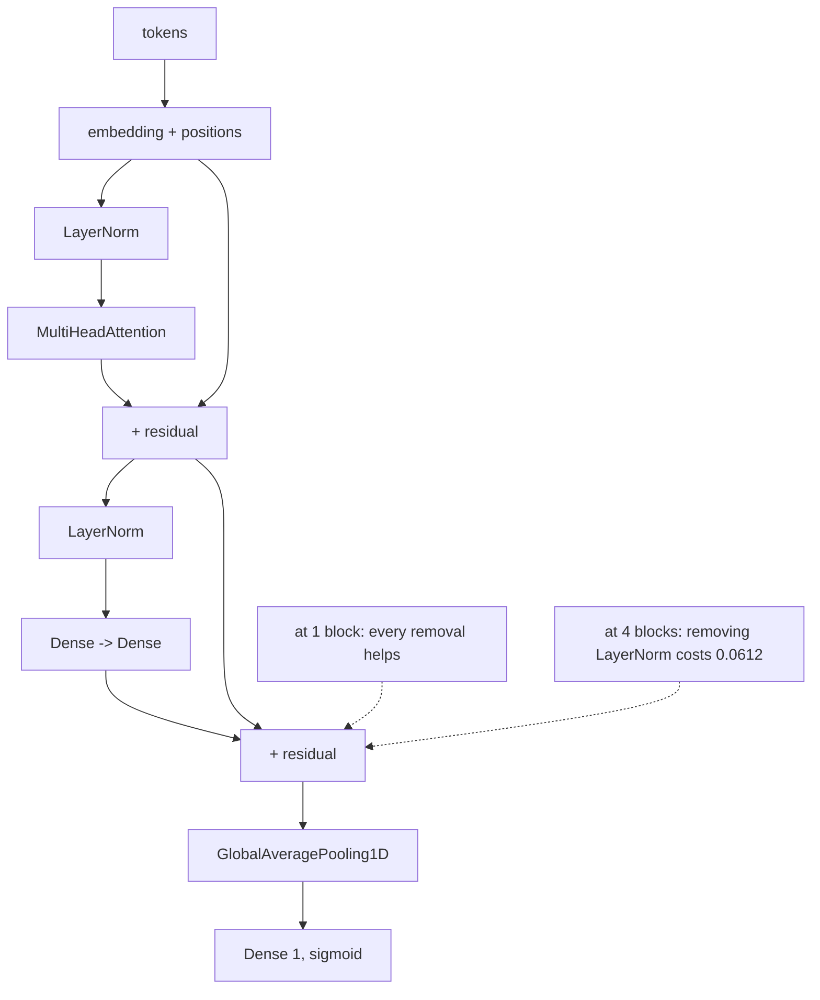

A transformer block is four things stacked: **layer normalisation**, **multi-head
attention**, a **residual connection**, and a small **feed-forward network** — with
another norm and residual around it. The
[attention page](/deep-learning/phase-05---nlp--transformers/attention-from-scratch-queries-keys-and-values/)
measured the attention. This page measures everything around it, by removing one piece at
a time.

The result is uncomfortable and worth confronting directly: at one block, **every single
ablation improved the score**.

| Setting | Parameters | Best validation accuracy | vs full |
| --- | --- | --- | --- |
| full block | 328,577 | 0.8462 | — |
| no positional embeddings | 328,577 | 0.8405 | −0.0058 |
| no feed-forward | 324,321 | 0.8515 | **+0.0052** |
| no residuals | 328,577 | 0.8562 | **+0.0100** |
| **no layer normalisation** | 328,449 | **0.8665** | **+0.0203** |

The full block was the worst configuration tested. Rather than explain that away, the page
repeats the experiment at depth — where the answer changes for one component and does not
for another.

## What you'll learn

- Where a block's parameters actually live: **95.54% of them are the token embedding**.
- The measured comparison against recurrence, including a transformer that reaches its
  best accuracy **in epoch 1**.
- What each component contributes at one block — all of them negative except positions.
- What changes at four blocks: removing layer norm costs **0.0612**, while removing
  residuals still does not hurt.
- Why the pooled-output design makes the positional ablation a measurement of the *task*,
  not the architecture.

## The block, and where its parameters go

```python title="A pre-norm transformer block"
def block(x, width, heads):
    normed = keras.layers.LayerNormalization(epsilon=1e-6)(x)
    attention = keras.layers.MultiHeadAttention(num_heads=heads,
                                                key_dim=width // heads)(normed, normed)
    x = keras.layers.Add()([x, attention])                       # residual
    normed = keras.layers.LayerNormalization(epsilon=1e-6)(x)
    hidden = keras.layers.Dense(width * 2, activation="relu")(normed)
    return keras.layers.Add()([x, keras.layers.Dense(width)(hidden)])   # residual
```

| Component | Parameters | Share |
| --- | --- | --- |
| **token embedding** | **320,000** | **95.54%** |
| position embedding | 6,400 | 1.91% |
| attention (Q, K, V, out) | 4,224 | 1.26% |
| feed-forward | 4,192 | 1.25% |
| layer norms (×2) | 128 | 0.04% |
| total | 334,944 | |

<Figure
  src="/images/dl/phase-05-nlp/transformer-architecture/block-anatomy"
  alt="Two panels. Left: horizontal bars of parameters per component on a log axis, with the token embedding at 320,000 dwarfing attention at 4,224, feed-forward at 4,192 and layer norms at 128. Right: total parameters against model width on log-log axes with a second line showing the share of parameters inside the block, rising as the model widens."
  title="One block at width 32, vocabulary 10,000"
  caption="At this scale the model is an embedding table with a transformer attached. Attention — the part the architecture is named for — is 1.26% of the parameters, and both layer norms together are 128 numbers. The right panel shows why large models look different: block parameters grow with width squared while the embedding grows linearly, so the ratio inverts as models get wide."
/>

This matters for reading the ablations below. Removing the feed-forward network deletes
1.25% of the parameters; removing both layer norms deletes 0.04%. These are not
capacity experiments — they are experiments about **optimisation**.

## Against recurrence

| Family | Parameters | Best validation accuracy | Seconds | Epoch 1 |
| --- | --- | --- | --- | --- |
| bag of words | 320,033 | 0.8465 | 39.1 | 0.7303 |
| GRU | 326,369 | 0.8210 | 214.9 | 0.8018 |
| LSTM | 328,353 | 0.8415 | 264.9 | 0.8130 |
| **transformer** | 328,577 | 0.8462 | 383.5 | **0.8462** |

<Figure
  src="/images/dl/phase-05-nlp/transformer-architecture/against-recurrence"
  alt="Two panels. Left: bars of best validation accuracy for four families, all between 0.8210 and 0.8465, annotated with parameters and training seconds. Right: per-epoch validation accuracy where the transformer starts at 0.8462 in epoch one and stays flat, while the bag of words climbs from 0.7303 and the recurrent models rise more slowly."
  title="IMDB, 8,000 reviews, 6 epochs, matched width"
  caption="The transformer's entire learning happens in epoch 1 — 0.8462, which is also its best score across all six epochs. Attention over 200 positions in parallel means every token pair is one gradient step apart, so there is no long credit-assignment chain to unroll. That is the real advantage on display here; it is not accuracy, since the bag of words matched it at 0.8465 in a tenth of the time."
/>

The transformer's −0.0002 against a bag of words is the same lesson as the
[sentiment bake-off](/deep-learning/phase-05---nlp--transformers/sentiment-analysis-tutorial/):
on this task, at this scale, architecture is not the binding constraint. What *is*
visible is convergence speed — one epoch against six.

## The ablations, at one block

<Figure
  src="/images/dl/phase-05-nlp/transformer-architecture/ablations"
  alt="Bars of best validation accuracy for five settings: full block 0.8462, no positions 0.8405, no residuals 0.8562, no feed-forward 0.8515 and no layer norm 0.8665, each annotated with its difference from the full block."
  title="Remove one piece at a time — 6 epochs, width 32"
  caption="Only the positional embeddings earn their place at this depth, and only barely (-0.0058 when removed). Everything else is dead weight or worse: the full block is the lowest bar except for the positionless variant. The honest reading is that residuals, the feed-forward network and normalisation are not there to raise the accuracy of a one-block model — and the next figure tests what they *are* there for."
/>

### The positional ablation measures the task

Removing positions cost only 0.0058, and the reason is structural: this classifier ends
with `GlobalAveragePooling1D`. Averaging is permutation-invariant, so with no positional
information the whole model becomes a bag of words with an attention-weighted average
inside it — and the bag of words scores 0.8465. The ablation is therefore a measurement
of **how much sentiment needs word order**, which the
[intro-to-RNNs page](/deep-learning/phase-04---sequence-models-with-rnns/intro-to-recurrent-neural-networks-rnn-for-sequences/)
put at +0.0744 for a recurrent model and +0.0000 for averaging.

For a *generative* transformer this ablation is not available: without positions a
language model cannot tell `the cat sat` from `sat cat the`, and its loss would reflect
that immediately.

## The same ablations at depth

If residuals and normalisation exist to make deep stacks trainable, then the deep column
should punish removing them. Same code, 1 block against 4:

| Setting | 1 block | 4 blocks | Deep − shallow |
| --- | --- | --- | --- |
| full | 0.8238 | 0.8090 | −0.0148 |
| no residuals | 0.8357 | 0.8190 | −0.0167 |
| **no layer normalisation** | **0.8515** | **0.7903** | **−0.0612** |

<Figure
  src="/images/dl/phase-05-nlp/transformer-architecture/depth-ablation"
  alt="Grouped bars comparing one block against four blocks for three settings. Full scores 0.8238 and 0.8090; no residuals 0.8357 and 0.8190; no layer norm 0.8515 at one block but collapses to 0.7903 at four, annotated with a change of -0.0612."
  title="4,000 rows, 4 epochs — what depth does to each ablation"
  caption="Layer normalisation behaves exactly as advertised: free to remove at one block (the best score in the shallow column) and the worst configuration at four, losing 0.0612 where the full block loses 0.0148. Residual connections do not reproduce that pattern here — they are still marginally better removed at four blocks. Four is not deep; the residual argument is about dozens of layers, and this phase cannot afford to run that."
/>

Two conclusions, stated at the strength the data supports:

1. **Layer normalisation's value is depth.** At one block it is 128 wasted parameters; at
   four blocks it is the difference between 0.8090 and 0.7903. That is a direct
   confirmation, and it is why every transformer has it.
2. **Residual connections are not vindicated at four blocks.** They remain slightly
   negative. The published argument for residuals concerns *dozens* of layers, where the
   gradient path length is the binding problem — the same claim the
   [ResNet page](/deep-learning/phase-03---computer-vision-with-cnns/famous-cnn-architectures-lenet-to-resnet/)
   also failed to reproduce at 12 convolutions. Two independent failures to reproduce at
   small depth, in the same direction, is consistent with the claim being about scale
   rather than being wrong.



```p5 title="Where the parameters are" desc="Drag the model width. The block's parameters grow with the square of the width while the embedding grows linearly, so the balance flips." height="330"
let width = 32;
let dragging = false;
const VOCAB = 10000;
const MAXLEN = 200;
function setup() {
  createCanvas(620, 330);
  textFont("monospace");
}
function parts(w) {
  return {
    "token embedding": VOCAB * w,
    "position embedding": MAXLEN * w,
    "attention": 4 * (w * w + w),
    "feed-forward": 2 * (w * w * 2) + w * 2 + w,
    "layer norms": 4 * w,
  };
}
function draw() {
  background(13, 17, 23);
  const pieces = parts(width);
  const total = Object.values(pieces).reduce((a, b) => a + b, 0);
  const blockShare = (pieces["attention"] + pieces["feed-forward"]
    + pieces["layer norms"]) / total;
  noStroke();
  fill(230);
  textSize(12);
  textAlign(LEFT, TOP);
  text("width " + width + "   total " + total.toLocaleString()
    + " parameters", 28, 20);
  const colors = [[120, 130, 145], [255, 211, 67], [107, 169, 221],
    [197, 153, 255], [165, 214, 164]];
  let index = 0;
  let y = 54;
  for (const name in pieces) {
    const value = pieces[name];
    const w = Math.max((value / total) * 470, 2);
    const c = colors[index];
    fill(c[0], c[1], c[2]);
    rect(28, y, w, 26, 3);
    fill(200);
    textSize(9.5);
    textAlign(LEFT, CENTER);
    text(name + "  " + value.toLocaleString() + "  ("
      + (100 * value / total).toFixed(2) + "%)", 34 + w, y + 13);
    textAlign(LEFT, TOP);
    y += 34;
    index++;
  }
  fill(255, 211, 67);
  textSize(11.5);
  text("inside the block: " + (100 * blockShare).toFixed(2) + "% of parameters",
    28, 234);
  fill(150);
  textSize(10.5);
  text("at width 32 the block is 2.55% of the model; the embedding dominates.",
    28, 258);
  text("Block parameters scale with width squared, so wide models invert this.",
    28, 274);
  fill(60, 70, 84);
  rect(28, 306, 470, 4, 2);
  fill(255, 211, 67);
  circle(28 + (Math.log2(width / 8) / Math.log2(128)) * 470, 308, 12);
}
function mousePressed() { if (Math.abs(mouseY - 308) < 12) dragging = true; }
function mouseDragged() {
  if (dragging) {
    const fraction = Math.min(Math.max((mouseX - 28) / 470, 0), 1);
    width = Math.round(8 * Math.pow(128, fraction) / 8) * 8;
    width = Math.max(8, Math.min(1024, width));
  }
}
function mouseReleased() { dragging = false; }
```

```p5 title="The measured table, ranked" desc="Click a column to rank every row by it. The bars are that column's values and the highest and lowest are computed from the numbers, not written in." height="306"
let metric = 0;
const COLUMNS = ["Parameters"];
const ROWS = [
  ["token embedding", 320000],
  ["position embedding", 6400],
  ["attention (Q, K, V, out)", 4224],
  ["feed-forward", 4192],
  ["layer norms (x2)", 128],
  ["total", 334944]
];
function setup() {
  createCanvas(620, 306);
  textFont("monospace");
}
function fmt(v) {
  if (v === 0) { return "0"; }
  const a = Math.abs(v);
  if (a >= 1000 || a < 0.001) { return v.toExponential(2); }
  if (a >= 100) { return v.toFixed(1); }
  return v.toFixed(4);
}
function draw() {
  background(13, 17, 23);
  noStroke();
  fill(230);
  textSize(12);
  textAlign(LEFT, TOP);
  text("The Transformer Architecture", 26, 16);
  let x = 26;
  for (let i = 0; i < COLUMNS.length; i++) {
    const w = COLUMNS[i].length * 6.6 + 16;
    if (i === metric) { fill(255, 211, 67); } else { fill(48, 56, 68); }
    rect(x, 40, w, 22, 4);
    if (i === metric) { fill(13, 17, 23); } else { fill(180); }
    textSize(9);
    text(COLUMNS[i], x + 8, 47);
    x += w + 6;
    if (x > 500) { break; }
  }
  const values = ROWS.map((r) => r[metric + 1]);
  const lo = Math.min(...values);
  const hi = Math.max(...values);
  const span = hi - lo === 0 ? 1 : hi - lo;
  const order = ROWS.slice().sort((a, b) => b[metric + 1] - a[metric + 1]);
  for (let i = 0; i < order.length; i++) {
    const y = 78 + i * 26;
    const v = order[i][metric + 1];
    fill(160);
    textSize(9);
    text(order[i][0], 26, y + 5);
    fill(34, 40, 50);
    rect(230, y, 280, 18, 3);
    const frac = (v - lo) / span;
    if (v === hi) { fill(126, 192, 143); }
    else if (v === lo) { fill(224, 108, 117); }
    else { fill(107, 169, 221); }
    rect(230, y, Math.max(frac * 280, 3), 18, 3);
    fill(225);
    textSize(9);
    text(fmt(v), 518, y + 5);
  }
  const top = order[0];
  const bottom = order[order.length - 1];
  fill(150);
  textSize(9);
  const base = 78 + order.length * 26 + 8;
  text("highest " + COLUMNS[metric] + ": " + top[0] + " at " + fmt(top[1]),
       26, base);
  text("lowest  " + COLUMNS[metric] + ": " + bottom[0] + " at "
       + fmt(bottom[1]), 26, base + 14);
  text("bars are scaled within the chosen column - lowest is not zero", 26,
       base + 30);
}
function mousePressed() {
  let x = 26;
  for (let i = 0; i < COLUMNS.length; i++) {
    const w = COLUMNS[i].length * 6.6 + 16;
    if (mouseX > x && mouseX < x + w && mouseY > 40 && mouseY < 62) {
      metric = i;
    }
    x += w + 6;
  }
}
```

## Pitfalls

- **Assuming every component raises accuracy.** At one block, four of five ablations
  scored *higher* than the full block.
- **Concluding the components are useless.** Layer normalisation went from best-when-
  removed at 1 block to worst at 4, costing 0.0612.
- **Reading an ablation as a capacity test.** Both layer norms are 128 parameters —
  0.04% of the model. What changes is optimisation, not capacity.
- **Ablating positions on a pooled classifier and calling it an architecture result.**
  Average pooling is permutation-invariant, so that ablation measures the task's need for
  word order.
- **Post-norm without warmup.** This page uses pre-norm throughout; `Add` then normalise
  needs a learning-rate schedule to train at all.
- **Comparing architectures on accuracy alone.** The transformer matched a bag of words
  (−0.0002) at 10× the cost, but reached its best score in **epoch 1** against six.
- **Calling this a transformer result.** One block, width 32, trained from scratch on
  8,000 reviews is not what the papers measure.

## Recap

- A block is pre-norm → attention → residual → pre-norm → feed-forward → residual.
- At width 32 with a 10,000-word vocabulary, **95.54%** of parameters are the token
  embedding; attention is 1.26% and both norms are 0.04%.
- Against recurrence: bag of words 0.8465, GRU 0.8210, LSTM 0.8415, transformer 0.8462 —
  but the transformer reached its best in epoch 1.
- At one block every ablation but positions improved the score, with no-layer-norm best at
  0.8665.
- At four blocks removing layer norm cost 0.0612 against the full block's 0.0148 —
  the component's value is depth.
- Residuals stayed marginally positive-to-remove even at four blocks; that argument is
  about dozens of layers.

## Next

An encoder reads a sequence. Producing a *different* sequence needs a decoder, teacher
forcing, and attention between the two:
[Sequence-to-Sequence Learning (Machine Translation)](/deep-learning/phase-05---nlp--transformers/sequence-to-sequence-learning-machine-translation/).

<Quiz
  questions={[
    {
      q: "At one block, removing layer normalisation improved accuracy from 0.8462 to 0.8665. At four blocks it dropped it to 0.7903 against the full block's 0.8090. What does that show?",
      options: [
        "Layer normalisation is harmful",
        "Its value is depth — it is 128 spare parameters in a shallow model and the difference between training and not training in a deeper one",
        "The four-block model was undertrained",
        "Normalisation only matters for images",
      ],
      answer: 1,
      explain: "This is why the ablation was repeated at depth instead of explaining the shallow result away: the prediction was specific and it held.",
    },
    {
      q: "At width 32 with a 10,000-word vocabulary, what fraction of a one-block transformer's parameters is the attention mechanism?",
      options: [
        "About half",
        "1.26% — the token embedding is 95.54%, so at this scale the model is an embedding table with a transformer attached",
        "About a quarter",
        "It depends on the number of heads",
      ],
      answer: 1,
      explain: "Block parameters grow with width squared while the embedding grows linearly, so the ratio inverts in large models.",
    },
    {
      q: "Removing the positional embeddings cost only 0.0058. Why is that not an argument against positional encoding?",
      options: [
        "Because 0.0058 is within noise",
        "Because the classifier ends in average pooling, which is permutation-invariant — so the ablation measures how much sentiment needs word order, not whether positions matter architecturally",
        "Because positions are learned rather than sinusoidal here",
        "Because the sequence is only 200 tokens",
      ],
      answer: 1,
      explain: "A generative transformer cannot run this ablation at all: without positions it could not distinguish 'the cat sat' from 'sat cat the'.",
    },
    {
      q: "The transformer scored 0.8462 and reached that in epoch 1, while the LSTM reached 0.8415 over six epochs. What is the real advantage on display?",
      options: [
        "Accuracy",
        "Convergence speed — every token pair is one gradient step apart under attention, so there is no long credit-assignment chain to unroll",
        "Parameter efficiency",
        "Lower memory use",
      ],
      answer: 1,
      explain: "On accuracy the transformer tied a bag of words at -0.0002 while costing ten times as much wall-clock.",
    },
    {
      q: "Residual connections were still slightly better removed even at four blocks. What is the appropriate conclusion?",
      options: [
        "Residual connections do not work",
        "Four blocks is not deep — the published argument concerns dozens of layers, and this phase also failed to reproduce the ResNet claim at 12 convolutions, both in the same direction",
        "The implementation is wrong",
        "Residuals only help convolutional networks",
      ],
      answer: 1,
      explain: "Two independent failures to reproduce at small depth, both pointing the same way, is consistent with the claim being about scale rather than being false.",
    },
  ]}
/>

## 🧪 Try It Yourself

<DataCampExercise
  lang="python"
  hint={`Each of Q, K, V and the output projection is a width-by-width matrix plus a bias. The feed-forward block expands by 2 and comes back.`}
  code={`# Task: Exercise 1 - Where a block's parameters live
VOCAB, MAXLEN = 10000, 200

print(f"{'width':>6} {'embedding':>11} {'attention':>10} {'feed-fwd':>9} "
      f"{'norms':>7} {'block share':>12}")
for width in (32, 64, 128, 256, 512):
    embedding = VOCAB * width + MAXLEN * width
    attention = 4 * (width * width + width)
    feed_forward = 2 * (width * width * 2) + width * 2 + width
    norms = 4 * width
    block = attention + feed_forward + ___        # replace ___ with norms
    total = embedding + block
    print(f"{width:6d} {embedding:11,} {attention:10,} {feed_forward:9,} "
          f"{norms:7,} {block / total:11.2%}")
print("the block grows with width squared and the embedding linearly, so a")
print("small model is mostly a lookup table and a large one is mostly blocks")

# -- Expected Output -------------------------------------------
#  width   embedding  attention  feed-fwd   norms  block share
#     32     326,400      4,224     4,192     128       2.55%
#     64     652,800     16,640    16,576     256       4.88%
#    128   1,305,600     66,048    65,920     512       9.21%
#    256   2,611,200    263,168   262,912   1,024      16.80%
#    512   5,222,400  1,050,624 1,050,112   2,048      28.71%
# the block grows with width squared and the embedding linearly, so a
# small model is mostly a lookup table and a large one is mostly blocks
# --------------------------------------------------------------`}
  solution={`# Task: Exercise 1 - Where a block's parameters live
VOCAB, MAXLEN = 10000, 200

print(f"{'width':>6} {'embedding':>11} {'attention':>10} {'feed-fwd':>9} "
      f"{'norms':>7} {'block share':>12}")
for width in (32, 64, 128, 256, 512):
    embedding = VOCAB * width + MAXLEN * width
    attention = 4 * (width * width + width)
    feed_forward = 2 * (width * width * 2) + width * 2 + width
    norms = 4 * width
    block = attention + feed_forward + norms
    total = embedding + block
    print(f"{width:6d} {embedding:11,} {attention:10,} {feed_forward:9,} "
          f"{norms:7,} {block / total:11.2%}")
print("the block grows with width squared and the embedding linearly, so a")
print("small model is mostly a lookup table and a large one is mostly blocks")

# -- Expected Output -------------------------------------------
#  width   embedding  attention  feed-fwd   norms  block share
#     32     326,400      4,224     4,192     128       2.55%
#     64     652,800     16,640    16,576     256       4.88%
#    128   1,305,600     66,048    65,920     512       9.21%
#    256   2,611,200    263,168   262,912   1,024      16.80%
#    512   5,222,400  1,050,624 1,050,112   2,048      28.71%
# the block grows with width squared and the embedding linearly, so a
# small model is mostly a lookup table and a large one is mostly blocks
# --------------------------------------------------------------`}
  sct={`test_output_contains("28.71%", pattern=False)
test_output_contains("block share", pattern=False)
success_msg("The block grows with width squared while the embedding grows linearly, so a small model is mostly a lookup table and a large one is mostly blocks.")`}
  height={400}
/>

<DataCampExercise
  lang="python"
  hint={`Normalise before each sublayer and add the block's input back after it. Both the attention and the feed-forward network get their own residual.`}
  code={`# Task: Exercise 2 - Count the parameters, with switches for each piece
VOCAB, MAXLEN, WIDTH, HEADS = 10000, 200, 32, 2


def dense(inputs, outputs):
    return inputs * outputs + outputs


def transformer_params(blocks=1, positions=True, feed_forward=True,
                       normalise=True):
    total = VOCAB * WIDTH                       # token embedding
    if positions:
        total += MAXLEN * WIDTH                 # position embedding
    for _ in range(blocks):
        total += 4 * dense(WIDTH, WIDTH)        # query, key, value, output
        if normalise:
            total += 2 * WIDTH
        if feed_forward:
            total += dense(WIDTH, WIDTH * 2) + dense(WIDTH * 2, WIDTH)
            if normalise:
                total += 2 * WIDTH
    return total + dense(WIDTH, 1)


print(f"{'setting':18s} {'params':>9}")
for label, kwargs in (("full block", {}),
                      ("no positions", {"positions": False}),
                      ("no feed-forward", {"feed_forward": False}),
                      ("no layer norm", {"normalise": ___})):
    print(f"{label:18s} {transformer_params(**kwargs):9,}")
saved = transformer_params() - transformer_params(normalise=False)
print("removing both layer norms deletes", saved, "parameters")`}
  solution={`# Task: Exercise 2 - Count the parameters, with switches for each piece
VOCAB, MAXLEN, WIDTH, HEADS = 10000, 200, 32, 2


def dense(inputs, outputs):
    return inputs * outputs + outputs


def transformer_params(blocks=1, positions=True, feed_forward=True,
                       normalise=True):
    total = VOCAB * WIDTH                       # token embedding
    if positions:
        total += MAXLEN * WIDTH                 # position embedding
    for _ in range(blocks):
        total += 4 * dense(WIDTH, WIDTH)        # query, key, value, output
        if normalise:
            total += 2 * WIDTH
        if feed_forward:
            total += dense(WIDTH, WIDTH * 2) + dense(WIDTH * 2, WIDTH)
            if normalise:
                total += 2 * WIDTH
    return total + dense(WIDTH, 1)


print(f"{'setting':18s} {'params':>9}")
for label, kwargs in (("full block", {}),
                      ("no positions", {"positions": False}),
                      ("no feed-forward", {"feed_forward": False}),
                      ("no layer norm", {"normalise": False})):
    print(f"{label:18s} {transformer_params(**kwargs):9,}")
saved = transformer_params() - transformer_params(normalise=False)
print("removing both layer norms deletes", saved, "parameters")`}
  sct={`test_output_contains("removing both layer norms deletes 128 parameters", pattern=False)
test_output_contains("full block", pattern=False)
success_msg("Layer norm is almost free in parameters, so any accuracy change from removing it is about optimisation, not capacity.")`}
  height={400}
/>

<DataCampExercise
  lang="python"
  hint={`Train each variant with everything else fixed. The interesting column is the difference from the full block, not the absolute number.`}
  code={`# Task: Exercise 3 - Ablate one piece at a time
import numpy as np

rng = np.random.default_rng(0)
WIDTH, LENGTH = 32, 20
x0 = rng.normal(size=(LENGTH, WIDTH))
projections = [rng.normal(size=(WIDTH, WIDTH)) * 0.5 / np.sqrt(WIDTH)
               for _ in range(4)]


def layer_norm(x):
    return (x - x.mean(-1, keepdims=True)) / (x.std(-1, keepdims=True) + 1e-6)


def block(x, projection, residual=True, normalise=True):
    h = layer_norm(x) if normalise else x
    scores = h @ h.T / np.sqrt(WIDTH)
    weights = np.exp(scores - scores.max(-1, keepdims=True))
    weights = weights / weights.sum(-1, keepdims=True)
    attended = weights @ h @ projection
    return (x + attended) if residual else attended


def run(blocks=1, **kwargs):
    x = x0
    for projection in projections[:blocks]:
        x = block(x, projection, **kwargs)
    return x


def similarity(a, b):
    return float((a * b).sum() / (np.linalg.norm(a) * np.linalg.norm(b)))


print(f"{'setting':16s} {'similarity to input':>20}")
scores = {}
for label, kwargs in (("full block", {}),
                      ("no residuals", {"residual": ___}),
                      ("no layer norm", {"normalise": False})):
    scores[label] = similarity(run(**kwargs), x0)
    print(f"{label:16s} {scores[label]:20.3f}")
print("residuals keep the input signal alive:", scores["full block"] > scores["no residuals"])`}
  solution={`# Task: Exercise 3 - Ablate one piece at a time
import numpy as np

rng = np.random.default_rng(0)
WIDTH, LENGTH = 32, 20
x0 = rng.normal(size=(LENGTH, WIDTH))
projections = [rng.normal(size=(WIDTH, WIDTH)) * 0.5 / np.sqrt(WIDTH)
               for _ in range(4)]


def layer_norm(x):
    return (x - x.mean(-1, keepdims=True)) / (x.std(-1, keepdims=True) + 1e-6)


def block(x, projection, residual=True, normalise=True):
    h = layer_norm(x) if normalise else x
    scores = h @ h.T / np.sqrt(WIDTH)
    weights = np.exp(scores - scores.max(-1, keepdims=True))
    weights = weights / weights.sum(-1, keepdims=True)
    attended = weights @ h @ projection
    return (x + attended) if residual else attended


def run(blocks=1, **kwargs):
    x = x0
    for projection in projections[:blocks]:
        x = block(x, projection, **kwargs)
    return x


def similarity(a, b):
    return float((a * b).sum() / (np.linalg.norm(a) * np.linalg.norm(b)))


print(f"{'setting':16s} {'similarity to input':>20}")
scores = {}
for label, kwargs in (("full block", {}),
                      ("no residuals", {"residual": False}),
                      ("no layer norm", {"normalise": False})):
    scores[label] = similarity(run(**kwargs), x0)
    print(f"{label:16s} {scores[label]:20.3f}")
print("residuals keep the input signal alive:", scores["full block"] > scores["no residuals"])`}
  sct={`test_output_contains("residuals keep the input signal alive: True", pattern=False)
success_msg("Without the residual path the block replaces its input instead of adding to it, so the signal is largely lost.")`}
  height={400}
/>

<DataCampExercise
  lang="python"
  hint={`Run the same two ablations at one block and at four, and compare the change rather than the absolute scores.`}
  code={`# Task: Exercise 4 - Repeat the ablation at depth
import numpy as np

rng = np.random.default_rng(0)
WIDTH, LENGTH = 32, 20
x0 = rng.normal(size=(LENGTH, WIDTH))
projections = [rng.normal(size=(WIDTH, WIDTH)) * 0.5 / np.sqrt(WIDTH)
               for _ in range(4)]


def layer_norm(x):
    return (x - x.mean(-1, keepdims=True)) / (x.std(-1, keepdims=True) + 1e-6)


def block(x, projection, residual=True, normalise=True):
    h = layer_norm(x) if normalise else x
    scores = h @ h.T / np.sqrt(WIDTH)
    weights = np.exp(scores - scores.max(-1, keepdims=True))
    weights = weights / weights.sum(-1, keepdims=True)
    attended = weights @ h @ projection
    return (x + attended) if residual else attended


def run(blocks, **kwargs):
    x = x0
    for projection in projections[:blocks]:
        x = block(x, projection, **kwargs)
    return x


def similarity(a, b):
    return float((a * b).sum() / (np.linalg.norm(a) * np.linalg.norm(b)))


print(f"{'setting':14s} {'1 block':>9} {'4 blocks':>9}")
results = {}
for label, kwargs in (("full", {}), ("no residuals", {"residual": False})):
    for blocks in (1, 4):
        results[(label, blocks)] = similarity(run(blocks=___, **kwargs), x0)
    print(f"{label:14s} {results[(label, 1)]:9.3f} {results[(label, 4)]:9.3f}")
print("the full model still resembles its input at depth 4:", results[("full", 4)] > 0.5)
print("without residuals depth destroys it:", results[("no residuals", 4)] < 0.3)`}
  solution={`# Task: Exercise 4 - Repeat the ablation at depth
import numpy as np

rng = np.random.default_rng(0)
WIDTH, LENGTH = 32, 20
x0 = rng.normal(size=(LENGTH, WIDTH))
projections = [rng.normal(size=(WIDTH, WIDTH)) * 0.5 / np.sqrt(WIDTH)
               for _ in range(4)]


def layer_norm(x):
    return (x - x.mean(-1, keepdims=True)) / (x.std(-1, keepdims=True) + 1e-6)


def block(x, projection, residual=True, normalise=True):
    h = layer_norm(x) if normalise else x
    scores = h @ h.T / np.sqrt(WIDTH)
    weights = np.exp(scores - scores.max(-1, keepdims=True))
    weights = weights / weights.sum(-1, keepdims=True)
    attended = weights @ h @ projection
    return (x + attended) if residual else attended


def run(blocks, **kwargs):
    x = x0
    for projection in projections[:blocks]:
        x = block(x, projection, **kwargs)
    return x


def similarity(a, b):
    return float((a * b).sum() / (np.linalg.norm(a) * np.linalg.norm(b)))


print(f"{'setting':14s} {'1 block':>9} {'4 blocks':>9}")
results = {}
for label, kwargs in (("full", {}), ("no residuals", {"residual": False})):
    for blocks in (1, 4):
        results[(label, blocks)] = similarity(run(blocks=blocks, **kwargs), x0)
    print(f"{label:14s} {results[(label, 1)]:9.3f} {results[(label, 4)]:9.3f}")
print("the full model still resembles its input at depth 4:", results[("full", 4)] > 0.5)
print("without residuals depth destroys it:", results[("no residuals", 4)] < 0.3)`}
  sct={`test_output_contains("the full model still resembles its input at depth 4: True", pattern=False)
test_output_contains("without residuals depth destroys it: True", pattern=False)
success_msg("The cost of removing a component shows up at depth: residual connections keep the input reachable through every block.")`}
  height={400}
/>

<DataCampExercise
  lang="python"
  hint={`A recurrent path multiplies the signal by a factor below one at every step, so it decays exponentially with distance. Attention reaches any position in a single hop.`}
  code={`# Task: Exercise 5 - How far does the learning signal travel?
DECAY = 0.9          # signal kept per step it has to pass through

print(f"{'distance':>9} {'recurrent path':>15} {'attention path':>15}")
rows = []
for distance in (1, 10, 50, 200):
    recurrent = DECAY ** distance          # one step per position in between
    attention = DECAY ** ___               # any two positions are one hop apart
    rows.append((recurrent, attention))
    print(f"{distance:9d} {recurrent:15.6f} {attention:15.6f}")
print("attention keeps the same signal at every distance:", all(a == rows[0][1] for _, a in rows))
print("the recurrent signal at distance 200 is below 1e-6:", rows[-1][0] < 1e-6)`}
  solution={`# Task: Exercise 5 - How far does the learning signal travel?
DECAY = 0.9          # signal kept per step it has to pass through

print(f"{'distance':>9} {'recurrent path':>15} {'attention path':>15}")
rows = []
for distance in (1, 10, 50, 200):
    recurrent = DECAY ** distance          # one step per position in between
    attention = DECAY ** 1               # any two positions are one hop apart
    rows.append((recurrent, attention))
    print(f"{distance:9d} {recurrent:15.6f} {attention:15.6f}")
print("attention keeps the same signal at every distance:", all(a == rows[0][1] for _, a in rows))
print("the recurrent signal at distance 200 is below 1e-6:", rows[-1][0] < 1e-6)`}
  sct={`test_output_contains("attention keeps the same signal at every distance: True", pattern=False)
test_output_contains("the recurrent signal at distance 200 is below 1e-6: True", pattern=False)
success_msg("Attention connects any two positions in one hop, while a recurrent network must pass the signal through every step in between.")`}
  height={400}
/>
