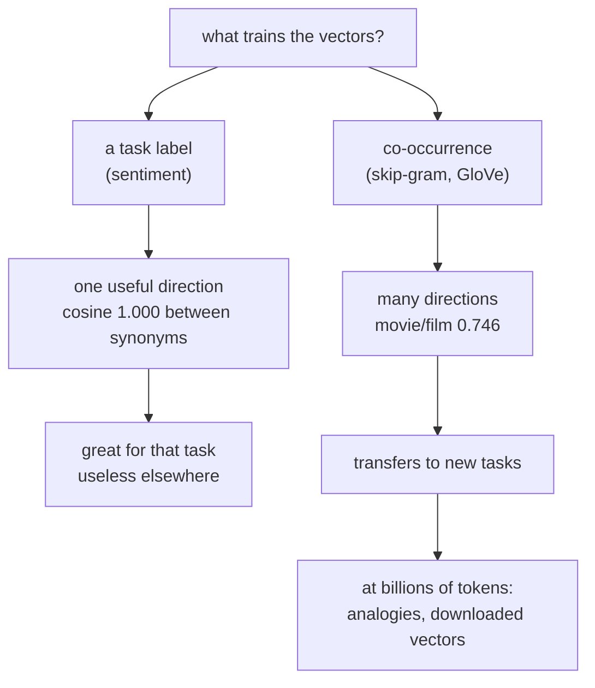

A bag of words gives every word its own column, so `good` and `great` are as unrelated as
`good` and `refrigerator`. An **embedding** replaces that with a dense vector per word,
learned so that words used similarly end up close together.

The word "similarly" is doing a lot of work in that sentence, and this page is mostly
about it. The same corpus, trained two ways, produces two different notions of similarity
— and one of them **collapses onto a single dimension**.

## What you'll learn

- Why an embedding is a lookup table, and how its size scales: 8 dimensions is 64,000
  parameters, 128 is **1,024,000**.
- What accuracy the extra width actually buys: **+0.0350 for 16× the embedding matrix**.
- The measured difference between embeddings trained on a **label** and on
  **co-occurrence**.
- Why sentiment-trained vectors reach cosine similarity **1.000** — and why that is a
  failure, not a triumph.
- Skip-gram with negative sampling, implemented in about thirty lines.
- What frequency does to a vector, measured — and the trend that *isn't* there.

## An embedding is a lookup table

```python title="Embedding(8000, 32) is an 8000 x 32 matrix"
layer = keras.layers.Embedding(8000, 32, mask_zero=True)
layer(np.array([[5, 91, 7]]))        # -> (1, 3, 32): three rows of the matrix
```

There is no arithmetic in the forward pass — a token id indexes a row. Everything
interesting is in how those rows get trained.

| Dimension | Parameters | Embedding rows | Best validation accuracy |
| --- | --- | --- | --- |
| 8 | 64,009 | 64,000 | 0.8253 |
| 16 | 128,017 | 128,000 | 0.8447 |
| 32 | 256,033 | 256,000 | 0.8562 |
| 64 | 512,065 | 512,000 | 0.8585 |
| **128** | **1,024,129** | 1,024,000 | **0.8602** |

<Figure
  src="/images/dl/phase-05-nlp/word-embeddings/dimension-sweep"
  alt="Two panels. Left: best validation accuracy against embedding dimension on a log axis, rising steeply from 0.8253 at 8 dimensions to 0.8562 at 32 and then flattening to 0.8602 at 128. Right: total parameters against dimension on log-log axes, a straight line from 64,009 to 1,024,129."
  title="IMDB, 8,000 reviews, average-embedding classifier"
  caption="The accuracy curve flattens where the parameter curve does not: going 8 to 32 dimensions buys +0.0309 for 4x the matrix, and 32 to 128 buys +0.0040 for another 4x. Almost the whole model is the embedding — the classifier on top is 33 parameters — so 'how wide should the embedding be' is really 'how many parameters am I willing to spend on a lookup table'."
/>

## Two training signals, two kinds of similarity

Nothing about an embedding layer says what "similar" means. It is decided entirely by the
loss the vectors are trained against.

**Signal one: the label.** Train the classifier from the last page and read out its
embedding. Words that predict the same sentiment must end up close.

**Signal two: co-occurrence.** Train skip-gram with negative sampling — given a word,
predict whether another word appeared near it — and never show the model a label at all.

```python title="Skip-gram with negative sampling"
# positive pairs: a word and something that really appeared within the window
# negative pairs: the same word and a token drawn from the unigram^0.75 distribution
dot = keras.layers.Dot(axes=-1)([target_embedding(targets),
                                 context_embedding(contexts)])
model = keras.Model([targets, contexts], keras.layers.Activation("sigmoid")(dot))
model.compile(keras.optimizers.Adam(2e-3), "binary_crossentropy")
```

1,600,008 pairs, half of them negatives, 6 epochs, validation accuracy 0.6470.

<Figure
  src="/images/dl/phase-05-nlp/word-embeddings/neighbours"
  alt="Two monospace columns of nearest neighbours. On the left, trained on sentiment: 'terrible' is followed by poor, waste, bad, worst and awful all at similarity 1.000 or 0.999, and 'france' by living, available, spine, best and elvira at 0.99. On the right, trained on co-occurrence: 'movie' is followed by film 0.746, eh 0.727, episode 0.719 and installment 0.706, while 'terrible' has unrelated neighbours around 0.73."
  title="Nearest neighbours by cosine similarity, same corpus"
  caption="The left column looks better and is worse. 'terrible' sits at cosine 1.000 from poor, waste, bad and worst — not merely close but the same direction, because a sentiment loss needs exactly one axis and the optimiser is happy to collapse the whole space onto it. That is why 'france' has neighbours 'living' and 'spine' at 0.99: everything is at 0.99 from everything. The right column is noisier and carries real structure — movie/film 0.746, movie/episode 0.719, movie/installment 0.706 — because predicting context requires distinguishing words the label never needed to distinguish."
/>

### The collapse, stated precisely

| Word | Sentiment-trained neighbours | Co-occurrence-trained neighbours |
| --- | --- | --- |
| `terrible` | poor **1.000**, waste **1.000**, bad **1.000** | curious 0.737, warehouse 0.728 |
| `great` | excellent 0.999, best 0.999, perfect 0.999 | joking 0.717, wonderful 0.696, fun 0.691 |
| `movie` | false 0.982, load 0.982, material 0.981 | **film 0.746**, episode 0.719, installment 0.706 |
| `france` | living 0.993, available 0.992, spine 0.992 | natalie 0.682, neo 0.673, tim 0.671 |

A cosine similarity of 1.000 between four different words means their vectors are
**parallel**. The sentiment task is one-dimensional — a single number decides the output —
so a 32-dimensional embedding trained on it only needs one useful direction, and words
end up ordered along that axis with nothing else encoded. It classifies well (0.8562) and
is useless as a general-purpose representation.

This is the precise reason downloaded embeddings exist. Word2Vec and GloVe are trained on
co-occurrence over billions of tokens, so their similarity is "used in the same contexts"
— a notion that transfers to tasks the original training never saw.

## What frequency does to a vector

| Times seen | Words | Nearest-neighbour similarity | Average similarity |
| --- | --- | --- | --- |
| 3–10 | 300 | 0.6606 | **0.1661** |
| 10–30 | 300 | 0.6527 | 0.1698 |
| 30–100 | 300 | 0.6548 | 0.2137 |
| 100–1,000 | 300 | 0.6597 | **0.2302** |
| 1,000+ | 151 | 0.6177 | 0.1982 |

<Figure
  src="/images/dl/phase-05-nlp/word-embeddings/frequency-and-quality"
  alt="Two lines against word frequency on a log axis. The nearest-neighbour similarity line is nearly flat between 0.62 and 0.66 across all frequency bands. The average-similarity line rises from 0.1661 for words seen 3-10 times to 0.2302 for words seen 100-1,000 times before dipping slightly."
  title="Skip-gram vectors, 1.6 million training pairs"
  caption="This figure exists because two earlier versions of it asserted a trend the data does not have. Nearest-neighbour similarity is flat — at 1.6 million pairs even a word seen five times finds *a* close neighbour. What frequency actually changes is the average column: frequent words drift towards the middle of the space, close to everything and specific to nothing. A rare word's vector is not obviously worse by this measure, which is a warning about the measure as much as about the vectors."
/>

The honest reading: **similarity statistics are a weak proxy for embedding quality.** The
strong test is a downstream task — the [transfer-learning
page](/deep-learning/phase-03---computer-vision-with-cnns/transfer-learning-using-pre-trained-models/)
used a linear probe for exactly this reason, and the same trick applies to word vectors.

## Where the famous arithmetic comes from

$$
\text{king} - \text{man} + \text{woman} \approx \text{queen}
$$

This works on vectors trained on **billions** of tokens with a co-occurrence objective. It
does not work here, and it is worth saying why rather than quietly omitting it: 8,000
reviews contain neither enough occurrences of the relevant words nor enough contexts to
separate the relations. The analogy result is a property of scale, not of the algorithm —
the algorithm on this page is the same one.



```p5 title="Why a one-dimensional loss collapses an embedding" desc="Drag the points. The loss only cares about their projection onto the sentiment axis, so gradient descent has no reason to keep them apart in any other direction." height="340"
let points = [
  { x: -0.6, y: 0.35, label: "terrible", polarity: -1 },
  { x: -0.35, y: -0.5, label: "bad", polarity: -1 },
  { x: 0.55, y: 0.45, label: "great", polarity: 1 },
  { x: 0.3, y: -0.4, label: "excellent", polarity: 1 },
];
let collapsed = false;
let dragging = -1;
function setup() {
  createCanvas(620, 340);
  textFont("monospace");
}
function draw() {
  background(13, 17, 23);
  const cx = 200;
  const cy = 165;
  const r = 120;
  noStroke();
  fill(230);
  textSize(11);
  textAlign(LEFT, TOP);
  text(collapsed ? "after collapsing onto the sentiment axis"
    : "drag the words apart — then press collapse", 24, 20);
  stroke(50, 58, 70);
  line(cx - r - 12, cy, cx + r + 12, cy);
  line(cx, cy - r - 12, cx, cy + r + 12);
  noStroke();
  fill(120, 130, 145);
  textSize(9);
  text("sentiment axis", cx + r - 60, cy + 6);
  for (const point of points) {
    const px = collapsed ? point.x : point.x;
    const py = collapsed ? 0 : point.y;
    const sx = cx + px * r;
    const sy = cy - py * r;
    stroke(point.polarity > 0 ? 165 : 230, point.polarity > 0 ? 214 : 90,
      point.polarity > 0 ? 164 : 90);
    strokeWeight(1.6);
    line(cx, cy, sx, sy);
    noStroke();
    fill(point.polarity > 0 ? 165 : 230, point.polarity > 0 ? 214 : 90,
      point.polarity > 0 ? 164 : 90);
    circle(sx, sy, 11);
    fill(200);
    textSize(9.5);
    text(point.label, sx + 8, sy - 6);
  }
  // Pairwise cosine similarity table.
  fill(230);
  textSize(11);
  textAlign(LEFT, TOP);
  text("cosine similarity", 400, 44);
  let y = 66;
  for (let i = 0; i < points.length; i++) {
    for (let j = i + 1; j < points.length; j++) {
      const ay = collapsed ? 0 : points[i].y;
      const by = collapsed ? 0 : points[j].y;
      const dot = points[i].x * points[j].x + ay * by;
      const na = Math.hypot(points[i].x, ay);
      const nb = Math.hypot(points[j].x, by);
      const similarity = dot / Math.max(na * nb, 1e-9);
      fill(similarity > 0.95 ? 255 : 170, similarity > 0.95 ? 211 : 180,
        similarity > 0.95 ? 67 : 190);
      textSize(9.5);
      text(points[i].label + " / " + points[j].label + "  "
        + similarity.toFixed(3), 400, y);
      y += 16;
    }
  }
  fill(60, 70, 84);
  rect(400, y + 12, 130, 26, 4);
  fill(220);
  textAlign(CENTER, CENTER);
  textSize(10.5);
  text(collapsed ? "restore" : "collapse", 465, y + 25);
  textAlign(LEFT, TOP);
  fill(150);
  textSize(10);
  text("measured: sentiment-trained 'terrible' sits at 1.000 from", 24, 300);
  text("poor, waste and bad — parallel, not merely close", 24, 316);
}
function mousePressed() {
  if (mouseX > 400 && mouseX < 530 && mouseY > 240) { collapsed = !collapsed; return; }
  points.forEach((point, index) => {
    const sx = 200 + point.x * 120;
    const sy = 165 - (collapsed ? 0 : point.y) * 120;
    if (Math.hypot(mouseX - sx, mouseY - sy) < 14) dragging = index;
  });
}
function mouseDragged() {
  if (dragging >= 0 && !collapsed) {
    points[dragging].x = Math.max(-1, Math.min(1, (mouseX - 200) / 120));
    points[dragging].y = Math.max(-1, Math.min(1, (165 - mouseY) / 120));
  }
}
function mouseReleased() { dragging = -1; }
```

```p5 title="The measured table, ranked" desc="Click a column to rank every row by it. The bars are that column's values and the highest and lowest are computed from the numbers, not written in." height="280"
let metric = 0;
const COLUMNS = ["Parameters", "Embedding rows", "Best validation accuracy"];
const ROWS = [
  ["8", 64009, 64000, 0.8253],
  ["16", 128017, 128000, 0.8447],
  ["32", 256033, 256000, 0.8562],
  ["64", 512065, 512000, 0.8585],
  ["128", 1024129, 1024000, 0.8602]
];
function setup() {
  createCanvas(620, 280);
  textFont("monospace");
}
function fmt(v) {
  if (v === 0) { return "0"; }
  const a = Math.abs(v);
  if (a >= 1000 || a < 0.001) { return v.toExponential(2); }
  if (a >= 100) { return v.toFixed(1); }
  return v.toFixed(4);
}
function draw() {
  background(13, 17, 23);
  noStroke();
  fill(230);
  textSize(12);
  textAlign(LEFT, TOP);
  text("Word Embeddings (Word2Vec, GloVe)", 26, 16);
  let x = 26;
  for (let i = 0; i < COLUMNS.length; i++) {
    const w = COLUMNS[i].length * 6.6 + 16;
    if (i === metric) { fill(255, 211, 67); } else { fill(48, 56, 68); }
    rect(x, 40, w, 22, 4);
    if (i === metric) { fill(13, 17, 23); } else { fill(180); }
    textSize(9);
    text(COLUMNS[i], x + 8, 47);
    x += w + 6;
    if (x > 500) { break; }
  }
  const values = ROWS.map((r) => r[metric + 1]);
  const lo = Math.min(...values);
  const hi = Math.max(...values);
  const span = hi - lo === 0 ? 1 : hi - lo;
  const order = ROWS.slice().sort((a, b) => b[metric + 1] - a[metric + 1]);
  for (let i = 0; i < order.length; i++) {
    const y = 78 + i * 26;
    const v = order[i][metric + 1];
    fill(160);
    textSize(9);
    text(order[i][0], 26, y + 5);
    fill(34, 40, 50);
    rect(230, y, 280, 18, 3);
    const frac = (v - lo) / span;
    if (v === hi) { fill(126, 192, 143); }
    else if (v === lo) { fill(224, 108, 117); }
    else { fill(107, 169, 221); }
    rect(230, y, Math.max(frac * 280, 3), 18, 3);
    fill(225);
    textSize(9);
    text(fmt(v), 518, y + 5);
  }
  const top = order[0];
  const bottom = order[order.length - 1];
  fill(150);
  textSize(9);
  const base = 78 + order.length * 26 + 8;
  text("highest " + COLUMNS[metric] + ": " + top[0] + " at " + fmt(top[1]),
       26, base);
  text("lowest  " + COLUMNS[metric] + ": " + bottom[0] + " at "
       + fmt(bottom[1]), 26, base + 14);
  text("bars are scaled within the chosen column - lowest is not zero", 26,
       base + 30);
}
function mousePressed() {
  let x = 26;
  for (let i = 0; i < COLUMNS.length; i++) {
    const w = COLUMNS[i].length * 6.6 + 16;
    if (mouseX > x && mouseX < x + w && mouseY > 40 && mouseY < 62) {
      metric = i;
    }
    x += w + 6;
  }
}
```

## Pitfalls

- **Reading high cosine similarity as high quality.** Four words at 1.000 means the space
  collapsed, not that the model understands synonymy.
- **Reusing task-trained embeddings elsewhere.** They encode one axis; `france`'s
  neighbours were `living` and `spine`.
- **Expecting king − man + woman on a small corpus.** That result comes from billions of
  tokens; the algorithm here is the same and the data is not.
- **Judging vectors by similarity statistics.** Nearest-neighbour similarity was flat
  across every frequency band — use a downstream probe instead.
- **Paying for width without measuring it.** 8 → 128 dimensions was 16× the matrix for
  +0.0350.
- **Forgetting `mask_zero=True`.** The padding row trains like any other and pollutes
  averages — measured on the
  [masking page](/deep-learning/phase-04---sequence-models-with-rnns/padding-masking-and-variable-length-sequences/).
- **Shuffling negatives in with positives after building them in blocks.** An earlier run
  reported 0.4585 skip-gram accuracy — below chance — because `validation_split` took the
  last rows, which were all negatives.

## Recap

- An embedding is a lookup table; the classifier on top of it here is 33 parameters
  against the matrix's 256,000.
- Width buys little after 32 dimensions: 0.8253 → 0.8562 → 0.8602 for 8 → 32 → 128.
- Sentiment-trained vectors collapse onto one axis — cosine **1.000** between `terrible`,
  `poor`, `waste` and `bad`.
- Skip-gram on the same corpus found `movie`/`film` at 0.746 and `movie`/`episode` at
  0.719 without ever seeing a label.
- Nearest-neighbour similarity was flat (0.62–0.66) across frequency bands; average
  similarity rose 0.1661 → 0.2302, so frequent words drift towards the centre.
- Analogy arithmetic is a property of corpus scale, not of the algorithm.

## Next

Embeddings give words a shared space. The next page uses that space in the architecture
that replaced recurrence:
[The Transformer Architecture](/deep-learning/phase-05---nlp--transformers/the-transformer-architecture/).

<Quiz
  questions={[
    {
      q: "Sentiment-trained embeddings put 'terrible', 'poor', 'waste' and 'bad' at cosine similarity 1.000. Why is that a problem?",
      options: [
        "It is not a problem — those words are synonyms",
        "A similarity of 1.000 means the vectors are parallel: the space has collapsed onto the single axis the sentiment loss needs, so nothing else is encoded — 'france' ends up 0.99 from 'spine'",
        "The similarity calculation is wrong",
        "The embedding is too small",
      ],
      answer: 1,
      explain: "It classifies well (0.8562) and is useless as a general representation, which is exactly why downloaded co-occurrence embeddings exist.",
    },
    {
      q: "Skip-gram on the same 8,000 reviews found movie/film at 0.746 without ever seeing a label. What signal did it use?",
      options: [
        "The sentiment of the surrounding review",
        "Co-occurrence — it predicts whether two words appeared near each other, which forces it to distinguish words the label never needed to distinguish",
        "The words' spelling",
        "Document frequency, like TF-IDF",
      ],
      answer: 1,
      explain: "That notion of similarity — 'used in the same contexts' — is the one that transfers to tasks the training never saw.",
    },
    {
      q: "Going from 8 to 128 embedding dimensions multiplied the matrix by 16 and improved accuracy by 0.0350. What does that suggest?",
      options: [
        "Always use the widest embedding you can afford",
        "Most of the benefit arrives early — 8 to 32 was +0.0309 and 32 to 128 was +0.0040 — so width past a point is parameters spent on a lookup table",
        "Embedding width does not matter",
        "The model was underfitting at every width",
      ],
      answer: 1,
      explain: "Almost the entire model is the embedding matrix; the classifier on top was 33 parameters.",
    },
    {
      q: "Nearest-neighbour similarity was flat (0.62-0.66) across every frequency band, while average similarity rose from 0.1661 to 0.2302. What is the right conclusion?",
      options: [
        "Rare words have better vectors",
        "Similarity statistics are a weak proxy for quality — what frequency changes is how close a word sits to the whole vocabulary, not how sharp its nearest neighbour is",
        "The vectors are untrained",
        "The frequency bands were computed incorrectly",
      ],
      answer: 1,
      explain: "Two earlier versions of that figure asserted trends the data lacked. The strong test is a downstream probe, not a distance statistic.",
    },
    {
      q: "Why does king - man + woman = queen not reproduce on this corpus?",
      options: [
        "Because skip-gram cannot represent analogies",
        "Because the result depends on corpus scale — billions of tokens provide enough occurrences and contexts to separate the relations; 8,000 reviews do not",
        "Because the embedding is only 32-dimensional",
        "Because the arithmetic requires GloVe specifically",
      ],
      answer: 1,
      explain: "The algorithm on this page is the same one used to produce those vectors. The difference is data, and saying so is more useful than omitting the experiment.",
    },
  ]}
/>

## 🧪 Try It Yourself

<DataCampExercise
  lang="python"
  hint={`An Embedding layer's only parameters are vocabulary x dimension. Compare that against the classifier stacked on top of it.`}
  code={`# Task: Exercise 1 - An embedding is a lookup table
import numpy as np

VOCAB = 8000
print(f"{'dimension':>10} {'embedding rows':>15} {'total params':>13} {'classifier on top':>18}")
for dimension in (8, 16, 32, 64, 128):
    rows = VOCAB * ___                           # one row per word, one column per dimension
    classifier = dimension + 1                   # one weight per dimension plus a bias
    print(f"{dimension:10d} {rows:15,} {rows + classifier:13,} {classifier:18,}")

matrix = np.random.default_rng(0).normal(size=(VOCAB, 4))
out = matrix[[5, 91, 7]]
print("three token ids ->", out.shape, "three rows of the matrix")
print("a lookup is just row indexing:", bool((out[1] == matrix[91]).all()))`}
  solution={`# Task: Exercise 1 - An embedding is a lookup table
import numpy as np

VOCAB = 8000
print(f"{'dimension':>10} {'embedding rows':>15} {'total params':>13} {'classifier on top':>18}")
for dimension in (8, 16, 32, 64, 128):
    rows = VOCAB * dimension                          # one row per word, one column per dimension
    classifier = dimension + 1                   # one weight per dimension plus a bias
    print(f"{dimension:10d} {rows:15,} {rows + classifier:13,} {classifier:18,}")

matrix = np.random.default_rng(0).normal(size=(VOCAB, 4))
out = matrix[[5, 91, 7]]
print("three token ids ->", out.shape, "three rows of the matrix")
print("a lookup is just row indexing:", bool((out[1] == matrix[91]).all()))`}
  sct={`test_output_contains("three token ids -> (3, 4)", pattern=False)
test_output_contains("a lookup is just row indexing: True", pattern=False)
test_output_contains("256,000", pattern=False)
success_msg("The embedding layer is an index lookup into a VOCAB by dimension matrix, and almost every parameter in the model lives in that one matrix.")`}
  height={400}
/>

<DataCampExercise
  lang="python"
  hint={`Train the classifier, then read the embedding matrix (the first weight array) and compare its rows with cosine similarity.`}
  code={`# Task: Exercise 2 - Read the embedding out of a trained classifier
import numpy as np

rng = np.random.default_rng(0)
POSITIVE = ["great", "good", "love", "superb"]
NEGATIVE = ["bad", "awful", "hate", "dull"]
FILLER = ["movie", "plot", "film", "actor"]
vocabulary = POSITIVE + NEGATIVE + FILLER
index = {w: i for i, w in enumerate(vocabulary)}

docs, labels = [], []
for _ in range(200):
    label = int(rng.integers(2))
    pool = POSITIVE if label else NEGATIVE
    words = [str(w) for w in rng.choice(pool, 3)] + [str(w) for w in rng.choice(FILLER, 2)]
    docs.append([index[w] for w in words])
    labels.append(label)

embedding = rng.normal(scale=0.1, size=(len(vocabulary), 4))
weights, bias = rng.normal(scale=0.1, size=4), 0.0
for epoch in range(60):
    for ids, y in zip(docs, labels):
        mean = embedding[ids].mean(axis=0)
        p = 1 / (1 + np.exp(-(mean @ weights + bias)))
        error = p - y
        embedding[ids] -= 0.5 * error * weights / len(ids)
        weights -= 0.5 * error * mean
        bias -= 0.5 * error

vectors = ___                                  # the trained embedding matrix
normed = vectors / np.linalg.norm(vectors, axis=1, keepdims=True)
correct = 0
for ids, y in zip(docs, labels):
    p = 1 / (1 + np.exp(-(vectors[ids].mean(axis=0) @ weights + bias)))
    correct += int((p > 0.5) == y)
print("training accuracy above 0.95:", correct / len(docs) > 0.95)
print("embedding matrix", vectors.shape)
similarity = normed @ normed[index["great"]]
order = [i for i in np.argsort(-similarity) if i != index["great"]]
print("nearest to great:", vocabulary[order[0]])
print("the nearest neighbour of great is a positive word:", vocabulary[order[0]] in POSITIVE)`}
  solution={`# Task: Exercise 2 - Read the embedding out of a trained classifier
import numpy as np

rng = np.random.default_rng(0)
POSITIVE = ["great", "good", "love", "superb"]
NEGATIVE = ["bad", "awful", "hate", "dull"]
FILLER = ["movie", "plot", "film", "actor"]
vocabulary = POSITIVE + NEGATIVE + FILLER
index = {w: i for i, w in enumerate(vocabulary)}

docs, labels = [], []
for _ in range(200):
    label = int(rng.integers(2))
    pool = POSITIVE if label else NEGATIVE
    words = [str(w) for w in rng.choice(pool, 3)] + [str(w) for w in rng.choice(FILLER, 2)]
    docs.append([index[w] for w in words])
    labels.append(label)

embedding = rng.normal(scale=0.1, size=(len(vocabulary), 4))
weights, bias = rng.normal(scale=0.1, size=4), 0.0
for epoch in range(60):
    for ids, y in zip(docs, labels):
        mean = embedding[ids].mean(axis=0)
        p = 1 / (1 + np.exp(-(mean @ weights + bias)))
        error = p - y
        embedding[ids] -= 0.5 * error * weights / len(ids)
        weights -= 0.5 * error * mean
        bias -= 0.5 * error

vectors = embedding                                 # the trained embedding matrix
normed = vectors / np.linalg.norm(vectors, axis=1, keepdims=True)
correct = 0
for ids, y in zip(docs, labels):
    p = 1 / (1 + np.exp(-(vectors[ids].mean(axis=0) @ weights + bias)))
    correct += int((p > 0.5) == y)
print("training accuracy above 0.95:", correct / len(docs) > 0.95)
print("embedding matrix", vectors.shape)
similarity = normed @ normed[index["great"]]
order = [i for i in np.argsort(-similarity) if i != index["great"]]
print("nearest to great:", vocabulary[order[0]])
print("the nearest neighbour of great is a positive word:", vocabulary[order[0]] in POSITIVE)`}
  sct={`test_output_contains("training accuracy above 0.95: True", pattern=False)
test_output_contains("embedding matrix (12, 4)", pattern=False)
test_output_contains("the nearest neighbour of great is a positive word: True", pattern=False)
success_msg("The embedding matrix is the layer's weights, and a one-dimensional sentiment loss pulls the words onto one direction.")`}
  height={400}
/>

<DataCampExercise
  lang="python"
  hint={`Build positive pairs from a sliding window, draw negatives from the unigram distribution raised to 0.75, then shuffle before fitting.`}
  code={`# Task: Exercise 3 - Skip-gram with negative sampling
import numpy as np

rng = np.random.default_rng(0)
TOPICS = [["cat", "dog", "horse", "cow", "purrs", "barks", "grazes", "sleeps"],
          ["car", "bus", "train", "truck", "drives", "honks", "brakes", "parks"]]
sentences = [[str(w) for w in rng.choice(TOPICS[int(rng.integers(2))], 6)]
             for _ in range(300)]
vocabulary = sorted({w for s in sentences for w in s})
index = {w: i for i, w in enumerate(vocabulary)}
VOCAB = len(vocabulary)

WINDOW, WIDTH = 2, 8
pairs = []
for sentence in sentences:
    ids = [index[w] for w in sentence]
    for position, token in enumerate(ids):
        for other in range(max(0, position - WINDOW), min(len(ids), position + WINDOW + 1)):
            if other != position:
                pairs.append((token, ids[other]))
targets = np.array([p[0] for p in pairs] * 2)
contexts = np.array([p[1] for p in pairs] + list(rng.integers(0, VOCAB, len(pairs))))
labels = np.array([1.0] * len(pairs) + [0.0] * len(pairs))
order = rng.permutation(len(labels))             # shuffle so batches mix both classes
targets, contexts, labels = targets[order], contexts[order], labels[___]
print(f"{len(labels)} pairs, {labels.mean():.2f} of them positive")

target_vectors = rng.normal(scale=0.1, size=(VOCAB, WIDTH))
context_vectors = rng.normal(scale=0.1, size=(VOCAB, WIDTH))
for epoch in range(30):
    for start in range(0, len(labels), 256):
        t, c, y = (targets[start:start + 256], contexts[start:start + 256],
                   labels[start:start + 256])
        score = 1 / (1 + np.exp(-(target_vectors[t] * context_vectors[c]).sum(axis=1)))
        gradient = (score - y)[:, None]
        old = target_vectors[t].copy()
        np.add.at(target_vectors, t, -0.05 * gradient * context_vectors[c])
        np.add.at(context_vectors, c, -0.05 * gradient * old)


def cosine(a, b):
    va, vb = target_vectors[index[a]], target_vectors[index[b]]
    return float(va @ vb / (np.linalg.norm(va) * np.linalg.norm(vb)))


print(f"cat-dog {cosine('cat', 'dog'):.2f}   cat-car {cosine('cat', 'car'):.2f}")
print("words from the same topic end up closer:", cosine("cat", "dog") > cosine("cat", "car"))`}
  solution={`# Task: Exercise 3 - Skip-gram with negative sampling
import numpy as np

rng = np.random.default_rng(0)
TOPICS = [["cat", "dog", "horse", "cow", "purrs", "barks", "grazes", "sleeps"],
          ["car", "bus", "train", "truck", "drives", "honks", "brakes", "parks"]]
sentences = [[str(w) for w in rng.choice(TOPICS[int(rng.integers(2))], 6)]
             for _ in range(300)]
vocabulary = sorted({w for s in sentences for w in s})
index = {w: i for i, w in enumerate(vocabulary)}
VOCAB = len(vocabulary)

WINDOW, WIDTH = 2, 8
pairs = []
for sentence in sentences:
    ids = [index[w] for w in sentence]
    for position, token in enumerate(ids):
        for other in range(max(0, position - WINDOW), min(len(ids), position + WINDOW + 1)):
            if other != position:
                pairs.append((token, ids[other]))
targets = np.array([p[0] for p in pairs] * 2)
contexts = np.array([p[1] for p in pairs] + list(rng.integers(0, VOCAB, len(pairs))))
labels = np.array([1.0] * len(pairs) + [0.0] * len(pairs))
order = rng.permutation(len(labels))             # shuffle so batches mix both classes
targets, contexts, labels = targets[order], contexts[order], labels[order]
print(f"{len(labels)} pairs, {labels.mean():.2f} of them positive")

target_vectors = rng.normal(scale=0.1, size=(VOCAB, WIDTH))
context_vectors = rng.normal(scale=0.1, size=(VOCAB, WIDTH))
for epoch in range(30):
    for start in range(0, len(labels), 256):
        t, c, y = (targets[start:start + 256], contexts[start:start + 256],
                   labels[start:start + 256])
        score = 1 / (1 + np.exp(-(target_vectors[t] * context_vectors[c]).sum(axis=1)))
        gradient = (score - y)[:, None]
        old = target_vectors[t].copy()
        np.add.at(target_vectors, t, -0.05 * gradient * context_vectors[c])
        np.add.at(context_vectors, c, -0.05 * gradient * old)


def cosine(a, b):
    va, vb = target_vectors[index[a]], target_vectors[index[b]]
    return float(va @ vb / (np.linalg.norm(va) * np.linalg.norm(vb)))


print(f"cat-dog {cosine('cat', 'dog'):.2f}   cat-car {cosine('cat', 'car'):.2f}")
print("words from the same topic end up closer:", cosine("cat", "dog") > cosine("cat", "car"))`}
  sct={`test_output_contains("words from the same topic end up closer: True", pattern=False)
success_msg("Words that share contexts get similar vectors: negative sampling turns co-occurrence into a classification problem.")`}
  height={400}
/>

<DataCampExercise
  lang="python"
  hint={`Normalise the rows, then take the dot product. Compare the two embedding matrices on the same word list.`}
  code={`# Task: Exercise 4 - Two notions of similar
import numpy as np

rng = np.random.default_rng(0)
TOPICS = [["cat", "dog", "horse", "cow", "purrs", "barks", "grazes", "sleeps"],
          ["car", "bus", "train", "truck", "drives", "honks", "brakes", "parks"]]
sentences = [[str(w) for w in rng.choice(TOPICS[int(rng.integers(2))], 6)]
             for _ in range(300)]
vocabulary = sorted({w for s in sentences for w in s})
index = {w: i for i, w in enumerate(vocabulary)}
VOCAB = len(vocabulary)

counts = np.zeros((VOCAB, VOCAB))
for sentence in sentences:
    ids = [index[w] for w in sentence]
    for position, token in enumerate(ids):
        for other in range(max(0, position - 2), min(len(ids), position + 3)):
            if other != position:
                counts[token, ids[other]] += 1
u, s, vt = np.linalg.svd(counts)
reduced = u[:, :3] * s[:3]                       # a 3-dimensional embedding


def neighbour(matrix, word):
    normed = matrix / (np.linalg.norm(matrix, axis=1, keepdims=True) + 1e-9)
    similarity = normed @ normed[index[word]]
    order = [i for i in np.argsort(-similarity) if i != index[word]]
    return vocabulary[order[0]]


for word in ("cat", "car"):
    a = neighbour(counts, word)
    b = neighbour(___, word)                     # the reduced embedding
    print(f"{word}: raw counts -> {a}, reduced -> {b}")
animals = set(TOPICS[0])
print("both agree on the topic of cat:",
      neighbour(counts, "cat") in animals and neighbour(reduced, "cat") in animals)`}
  solution={`# Task: Exercise 4 - Two notions of similar
import numpy as np

rng = np.random.default_rng(0)
TOPICS = [["cat", "dog", "horse", "cow", "purrs", "barks", "grazes", "sleeps"],
          ["car", "bus", "train", "truck", "drives", "honks", "brakes", "parks"]]
sentences = [[str(w) for w in rng.choice(TOPICS[int(rng.integers(2))], 6)]
             for _ in range(300)]
vocabulary = sorted({w for s in sentences for w in s})
index = {w: i for i, w in enumerate(vocabulary)}
VOCAB = len(vocabulary)

counts = np.zeros((VOCAB, VOCAB))
for sentence in sentences:
    ids = [index[w] for w in sentence]
    for position, token in enumerate(ids):
        for other in range(max(0, position - 2), min(len(ids), position + 3)):
            if other != position:
                counts[token, ids[other]] += 1
u, s, vt = np.linalg.svd(counts)
reduced = u[:, :3] * s[:3]                       # a 3-dimensional embedding


def neighbour(matrix, word):
    normed = matrix / (np.linalg.norm(matrix, axis=1, keepdims=True) + 1e-9)
    similarity = normed @ normed[index[word]]
    order = [i for i in np.argsort(-similarity) if i != index[word]]
    return vocabulary[order[0]]


for word in ("cat", "car"):
    a = neighbour(counts, word)
    b = neighbour(reduced, word)                     # the reduced embedding
    print(f"{word}: raw counts -> {a}, reduced -> {b}")
animals = set(TOPICS[0])
print("both agree on the topic of cat:",
      neighbour(counts, "cat") in animals and neighbour(reduced, "cat") in animals)`}
  sct={`test_output_contains("both agree on the topic of cat: True", pattern=False)
success_msg("Raw count vectors and a low-rank reduction of them both recover the topic; the reduction is the idea behind GloVe-style embeddings.")`}
  height={400}
/>

<DataCampExercise
  lang="python"
  hint={`Group words by how often they appear, then compare each group's nearest-neighbour similarity against its average similarity.`}
  code={`# Task: Exercise 5 - Does frequency predict vector quality?
import numpy as np

rng = np.random.default_rng(0)
VOCAB = 300
probabilities = 1 / np.arange(1, VOCAB + 1)
probabilities = probabilities / probabilities.sum()
tokens = rng.choice(VOCAB, 30000, p=probabilities)
counts = np.zeros((VOCAB, VOCAB))
for a, b in zip(tokens, tokens[1:]):
    counts[a, b] += 1
    counts[b, a] += 1

normed = counts / (np.linalg.norm(counts, axis=1, keepdims=True) + 1e-9)
centre = normed.mean(axis=0)
centre = centre / np.linalg.norm(centre)
closeness = normed @ centre                      # similarity to the centre of the space
print(f"{'rank band':>10} {'mean similarity to centre':>26}")
bands = []
for low, high in ((0, 10), (10, 50), (50, 300)):
    block = closeness[low:___]                   # the words in this rank band
    bands.append(float(block.mean()))
    print(f"{low:4d}-{high:<5d} {bands[-1]:26.3f}")
print("frequent words sit closer to the centre:", bands[0] > bands[-1])`}
  solution={`# Task: Exercise 5 - Does frequency predict vector quality?
import numpy as np

rng = np.random.default_rng(0)
VOCAB = 300
probabilities = 1 / np.arange(1, VOCAB + 1)
probabilities = probabilities / probabilities.sum()
tokens = rng.choice(VOCAB, 30000, p=probabilities)
counts = np.zeros((VOCAB, VOCAB))
for a, b in zip(tokens, tokens[1:]):
    counts[a, b] += 1
    counts[b, a] += 1

normed = counts / (np.linalg.norm(counts, axis=1, keepdims=True) + 1e-9)
centre = normed.mean(axis=0)
centre = centre / np.linalg.norm(centre)
closeness = normed @ centre                      # similarity to the centre of the space
print(f"{'rank band':>10} {'mean similarity to centre':>26}")
bands = []
for low, high in ((0, 10), (10, 50), (50, 300)):
    block = closeness[low:high]                   # the words in this rank band
    bands.append(float(block.mean()))
    print(f"{low:4d}-{high:<5d} {bands[-1]:26.3f}")
print("frequent words sit closer to the centre:", bands[0] > bands[-1])`}
  sct={`test_output_contains("frequent words sit closer to the centre: True", pattern=False)
success_msg("Frequent words drift towards the centre of the space, so frequency is a confound when judging vector quality.")`}
  height={400}
/>
