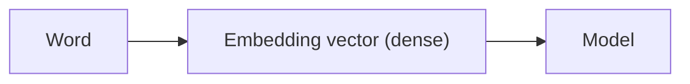

## In plain words

BoW and TF-IDF give every word its own slot in a giant, mostly-empty vector — they
have no idea that "great" and "fantastic" mean almost the same thing. **Embeddings**
fix that: every word becomes a short, dense vector, learned so that words used in
similar contexts end up with similar vectors.

## What embeddings are

Embeddings map words to dense vectors:

- similar words have similar vectors

Example intuition:

- king and queen vectors are close
- dog and puppy vectors are close

## Why embeddings are better than BoW (sometimes)

BoW/TF-IDF are sparse and don’t capture similarity.

Embeddings capture:

- semantic relationships
- analogies (to some extent)



## Word2Vec

Word2Vec doesn't need labeled data at all — the sentence itself provides the
"labels." It comes in two flavors, and both are trained the same way a
classifier would be, just on a task invented purely from raw text:

- **CBOW (Continuous Bag of Words)** predicts a missing word from its
  surrounding context: given `["the", ___, "sat", "down"]`, predict `"cat"`.
- **Skip-gram** runs the same idea backwards: given `"cat"`, predict the
  words likely to appear near it (`"the"`, `"sat"`, `"down"`).

Either direction pushes two words toward similar vectors whenever they show
up in similar contexts — which is exactly why "cat" and "kitten" end up
close together despite never being told they're related.

## GloVe

Word2Vec learns by sliding a small window over text and looking at *local*
context. **GloVe** (Global Vectors) instead starts from a big table of
**global word co-occurrence counts** — how often every pair of words appears
together across the *entire* corpus — and fits vectors so that the dot
product between two word vectors approximates the log of how often those
words co-occur. In practice, both approaches converge on embedding spaces
with very similar properties (synonym clustering, the analogy directions
below), and both ship as free, pretrained downloads for English.

## Using pretrained vectors instead of training your own

Training good embeddings from scratch needs a lot of text. When your dataset
is small, it's usually better to download vectors someone already trained on
billions of words and copy them straight into your model. The pattern is
always the same three steps: parse the pretrained file into a `{word: vector}`
lookup, build a matrix indexed by *your* vocabulary, then hand that matrix to
an `Embedding` layer as its starting weights.

```python title="Building an embedding matrix from pretrained GloVe vectors" showLineNumbers{1}
import numpy as np

# a couple of toy vectors, standing in for lines parsed from glove.6B.100d.txt
glove_vectors = {
    "cat": np.array([0.23, -0.15, 0.88]),
    "dog": np.array([0.21, -0.11, 0.91]),
    "car": np.array([-0.60, 0.44, 0.02]),
}

vocabulary = {"cat": 1, "dog": 2, "car": 3}   # word -> row index (0 stays reserved for padding)
embedding_dim = 3
embedding_matrix = np.zeros((len(vocabulary) + 1, embedding_dim))

for word, i in vocabulary.items():
    vector = glove_vectors.get(word)
    if vector is not None:
        embedding_matrix[i] = vector

print(embedding_matrix)
```

```
[[ 0.    0.    0.  ]
 [ 0.23 -0.15  0.88]
 [ 0.21 -0.11  0.91]
 [-0.6   0.44  0.02]]
```

Then plug that matrix straight into an `Embedding` layer as its starting
weights, and freeze it so training doesn't overwrite the pretrained vectors:

```python title="Plugging a pretrained embedding matrix into Keras" showLineNumbers{1}
import tensorflow as tf

embedding_layer = tf.keras.layers.Embedding(
    input_dim=embedding_matrix.shape[0],
    output_dim=embedding_matrix.shape[1],
    embeddings_initializer=tf.keras.initializers.Constant(embedding_matrix),
    trainable=False,   # keep GloVe's vectors frozen instead of fine-tuning them
)
```

:::tip[From the book]
Chollet notes pretrained embeddings like this pay off most "when you have so
little training data available that you can't use your data alone to learn
an appropriate task-specific embedding." With plenty of training data, a
plain trainable `Embedding` layer learned from scratch on your own task
usually ends up outperforming generic pretrained vectors anyway — the
pretrained route is a head start for small datasets, not a universal upgrade.
:::

## Learning embeddings inside a Keras model

You rarely train Word2Vec by hand anymore — most deep models simply start with a
`keras.layers.Embedding` layer and let it learn word vectors as part of training:

```python title="An Embedding layer inside a Keras model" showLineNumbers{1}
import tensorflow as tf

vocab_size = 1000   # number of distinct words (+ OOV buckets)
embed_size = 16      # size of each word's dense vector

model = tf.keras.Sequential([
    # mask_zero=True tells every downstream layer to ignore padding tokens (ID 0)
    tf.keras.layers.Embedding(vocab_size, embed_size, mask_zero=True, input_shape=[None]),
    tf.keras.layers.GRU(32, return_sequences=True),
    tf.keras.layers.GRU(32),
    tf.keras.layers.Dense(1, activation="sigmoid"),
])

model.summary()
```

The `Embedding` layer's output shape is `[batch size, time steps, embed_size]` — it
turns each 2D batch of word IDs into a 3D stack of word vectors, one per token.

:::tip[From the book]
Géron describes watching word embeddings train inside TensorBoard: "it is
fascinating to see words like 'awesome' and 'amazing' gradually cluster on one
side of the embedding space, while words like 'awful' and 'terrible' cluster on
the other side." The model was never told which words are positive or negative —
it discovered the grouping purely from how the words were *used* in movie reviews.
The book also notes you don't have to train embeddings from scratch: TensorFlow
Hub's `nnlm-en-dim50` module ships **pretrained** word embeddings (trained on the
7-billion-word Google News corpus) that you can drop straight into a
`hub.KerasLayer` and fine-tune.
:::

## Visualize it

Word embeddings live in a high-dimensional space, but if you squash them down to 2
dimensions (say, with PCA or t-SNE), similar words cluster together. Click to
reshuffle and watch semantically related words stay near each other while unrelated
clusters drift apart:

```p5 title="Word embeddings in 2D space" desc="Each dot is a word's embedding vector projected to 2D, continuously drifting around its cluster. Similar words stay near each other. Click to reshuffle." height="300"
let clusters = [
  { center: [0.28, 0.3], color: [255, 211, 67], words: ["king", "queen", "prince", "royal"] },
  { center: [0.72, 0.28], color: [75, 139, 190], words: ["dog", "puppy", "cat", "kitten"] },
  { center: [0.3, 0.75], color: [107, 169, 221], words: ["awesome", "amazing", "great"] },
  { center: [0.75, 0.75], color: [214, 93, 93], words: ["awful", "terrible", "bad"] },
];
let points = [];

function layout() {
  points = [];
  for (const c of clusters) {
    for (const w of c.words) {
      points.push({
        word: w,
        color: c.color,
        cx: c.center[0],
        cy: c.center[1],
        phaseX: random(TWO_PI),
        phaseY: random(TWO_PI),
        speedX: random(0.006, 0.014),
        speedY: random(0.006, 0.014),
        radius: random(0.05, 0.09),
      });
    }
  }
}

function setup() {
  createCanvas(600, 300);
  textFont("monospace");
  textAlign(CENTER, CENTER);
  layout();
}

function draw() {
  background(13, 17, 23);
  fill(107, 169, 221);
  noStroke();
  textSize(13);
  text("word embeddings drifting in 2D space (click to reshuffle)", width / 2, 20);

  for (const p of points) {
    // each point continuously drifts around its cluster center -- similar
    // words never collapse to one spot, but they never wander apart either
    const x = p.cx + p.radius * cos(frameCount * p.speedX + p.phaseX);
    const y = p.cy + p.radius * sin(frameCount * p.speedY + p.phaseY);
    const px = 40 + x * (width - 80);
    const py = 50 + y * (height - 90);
    fill(p.color[0], p.color[1], p.color[2]);
    ellipse(px, py, 10, 10);
    fill(230, 230, 230);
    textSize(11);
    text(p.word, px, py - 14);
  }
}

function mousePressed() {
  layout();
}
```

## Geometric relationships, not just distances

Embeddings aren't just "similar words are close together" — specific
**directions** in the embedding space can carry meaning too. The classic
example: the vector you'd add to go from "man" to "woman" is roughly the same
vector that takes you from "king" to "queen" — a reusable "gender" direction.
That means simple vector arithmetic can answer analogies:

```python title="Vector arithmetic: king - man + woman ≈ queen" showLineNumbers{1}
import numpy as np

king  = np.array([0.90, 0.10, 0.40])
man   = np.array([0.85, 0.05, 0.35])
woman = np.array([0.75, 0.20, 0.45])
queen = np.array([0.85, 0.15, 0.42])   # the embedding the model actually learned

predicted_queen = king - man + woman

def cosine_sim(a, b):
    return np.dot(a, b) / (np.linalg.norm(a) * np.linalg.norm(b))

print("Predicted vector:", np.round(predicted_queen, 2))
print("Similarity to real 'queen' vector:", round(cosine_sim(predicted_queen, queen), 2))
```

```
Predicted vector: [0.8  0.25 0.5 ]
Similarity to real 'queen' vector: 0.99
```

Nobody tells the model that gender is a concept — a well-trained embedding
space just ends up organized this way because "king" and "queen" (and "man"
and "woman") show up in structurally similar contexts.

:::tip[From the book]
Chollet describes the same idea with animals instead of royalty: in a toy 2D
embedding space with "cat," "dog," "wolf," and "tiger," the *same* vector that
takes you from "cat" to "tiger" also takes you from "dog" to "wolf" — a
reusable "pet to wild animal" direction. Real embedding spaces trained on
large corpora "typically feature thousands of such interpretable and
potentially useful vectors," not just one or two.
:::

## Practical note

In modern NLP, embeddings are often learned as part of a deep model (Transformers). But Word2Vec/GloVe are great for understanding the concept.

## Mini-checkpoint

What does it mean if two words have a high cosine similarity between embeddings?

- they appear in similar contexts and are semantically related.

import DataCampExercise from "../../../../components/DataCampExercise.astro";

## 🧪 Try It Yourself

### Exercise 1 – Cosine Similarity Between Vectors

<DataCampExercise
  lang="python"
  hint={`Cosine similarity is \`dot(a, b) / (norm(a) * norm(b))\`. Use \`np.dot\` and \`np.linalg.norm\`.`}
  code={`# Task: Exercise 1 – Cosine Similarity Between Vectors
import numpy as np

king = np.array([0.9, 0.1, 0.4])
queen = np.array([0.85, 0.15, 0.42])
bicycle = np.array([0.05, 0.9, 0.1])

def cosine_sim(a, b):
    return np.dot(a, b) / (np.linalg.norm(a) * np.___(b))  # replace ___ with linalg.norm

print("king vs queen:", round(cosine_sim(king, queen), 2))
print("king vs bicycle:", round(cosine_sim(king, bicycle), 2))

# ── Expected Output ───────────────────────────────────────────
# king vs queen: 1.0
# king vs bicycle: 0.44
# ──────────────────────────────────────────────────────────────`}
  solution={`import numpy as np

king = np.array([0.9, 0.1, 0.4])
queen = np.array([0.85, 0.15, 0.42])
bicycle = np.array([0.05, 0.9, 0.1])

def cosine_sim(a, b):
    return np.dot(a, b) / (np.linalg.norm(a) * np.linalg.norm(b))

print("king vs queen:", round(cosine_sim(king, queen), 2))
print("king vs bicycle:", round(cosine_sim(king, bicycle), 2))`}
  sct={`test_output_contains("king vs queen:")
test_output_contains("king vs bicycle:")
success_msg("You just measured semantic similarity with vectors!")`}
  height={170}
/>

### Exercise 2 – An Embedding Layer's Output Shape

<DataCampExercise
  lang="python"
  hint={`An Embedding layer turns [batch, time steps] into [batch, time steps, embed_size].`}
  code={`# Task: Exercise 2 – An Embedding Layer's Output Shape
import tensorflow as tf
import numpy as np

vocab_size, embed_size = 50, 8
embedding = tf.keras.layers.Embedding(vocab_size, ___)  # replace ___ with embed_size

word_ids = np.array([[3, 7, 1], [2, 0, 0]])
output = embedding(word_ids)
print("Output shape:", output.shape)

# ── Expected Output ───────────────────────────────────────────
# Output shape: (2, 3, 8)
# ──────────────────────────────────────────────────────────────`}
  solution={`import tensorflow as tf
import numpy as np

vocab_size, embed_size = 50, 8
embedding = tf.keras.layers.Embedding(vocab_size, embed_size)

word_ids = np.array([[3, 7, 1], [2, 0, 0]])
output = embedding(word_ids)
print("Output shape:", output.shape)`}
  sct={`test_output_contains("Output shape: (2, 3, 8)")
success_msg("Now you know why embeddings add a dimension!")`}
  height={160}
/>

### Exercise 3 – Analogies with Vector Arithmetic

<DataCampExercise
  lang="python"
  hint={`The "gender" direction is \`woman - man\`. Add it to \`king\` to predict where "queen" should sit.`}
  code={`# Task: Exercise 3 – Analogies with Vector Arithmetic
import numpy as np

king  = np.array([0.90, 0.10, 0.40])
man   = np.array([0.85, 0.05, 0.35])
woman = np.array([0.75, 0.20, 0.45])
queen = np.array([0.85, 0.15, 0.42])

predicted_queen = king - man + ___   # replace ___ with woman

def cosine_sim(a, b):
    return np.dot(a, b) / (np.linalg.norm(a) * np.linalg.norm(b))

print("Similarity to real queen:", round(cosine_sim(predicted_queen, queen), 2))

# ── Expected Output ───────────────────────────────────────────
# Similarity to real queen: 0.99
# ──────────────────────────────────────────────────────────────`}
  solution={`import numpy as np

king  = np.array([0.90, 0.10, 0.40])
man   = np.array([0.85, 0.05, 0.35])
woman = np.array([0.75, 0.20, 0.45])
queen = np.array([0.85, 0.15, 0.42])

predicted_queen = king - man + woman

def cosine_sim(a, b):
    return np.dot(a, b) / (np.linalg.norm(a) * np.linalg.norm(b))

print("Similarity to real queen:", round(cosine_sim(predicted_queen, queen), 2))`}
  sct={`test_output_contains("Similarity to real queen: 0.99")
success_msg("king - man + woman really does land almost exactly on queen!")`}
  height={190}
/>

## Next

Continue to **Sentiment Analysis Tutorial** — put embeddings (or TF-IDF) to work
on a real classification task.
