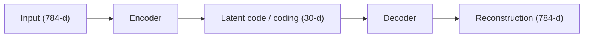

## What you'll learn

- what an autoencoder actually is, and why "just copy the input to the output" is
  a harder task than it sounds once you add constraints
- how an **undercomplete** linear autoencoder performs PCA, and how a **stacked**
  autoencoder learns richer, non-linear codings
- how to halve the parameter count with **tied weights**
- how **denoising** and **sparse** autoencoders force useful features in different
  ways
- how a **convolutional** autoencoder handles images properly
- how autoencoders enable **unsupervised pretraining** when you have lots of
  unlabeled data but few labels

## The idea: copy the input, but through a bottleneck

An autoencoder is always made of two parts: an **encoder** that compresses the
input into a **latent representation** (the *coding*), and a **decoder** that
expands that coding back out into a **reconstruction** that should look like the
original input. Both halves are trained together, using the input itself as the
target — there are no labels involved, which is why autoencoders are unsupervised
(or "self-supervised": the labels are just the inputs).

If the coding layer is smaller than the input, the autoencoder is **undercomplete**.
It physically cannot copy the input straight through, so it's forced to learn which
features actually matter and discard the rest — much like memorizing "the even
numbers from 50 down to 14" is easier than memorizing ten random numbers, because
you only need to remember the *pattern*.



## Undercomplete linear autoencoder = PCA

If every layer is linear and the loss is MSE, an undercomplete autoencoder ends up
performing **Principal Component Analysis** — it finds the best lower-dimensional
plane to project the data onto:

```python title="A linear autoencoder performing PCA" showLineNumbers{1}
import numpy as np
import tensorflow as tf

# A toy 3D dataset that mostly lies on a 2D plane
rng = np.random.default_rng(42)
angles = rng.uniform(0, 2 * np.pi, 200)
X_train = np.c_[
    np.cos(angles) + rng.normal(0, 0.05, 200),
    np.sin(angles) * 0.6 + rng.normal(0, 0.05, 200),
    np.cos(angles) * 0.3 + np.sin(angles) * 0.3 + rng.normal(0, 0.05, 200),
].astype("float32")

encoder = tf.keras.models.Sequential([tf.keras.layers.Dense(2, input_shape=[3])])
decoder = tf.keras.models.Sequential([tf.keras.layers.Dense(3, input_shape=[2])])
autoencoder = tf.keras.models.Sequential([encoder, decoder])

autoencoder.compile(loss="mse", optimizer=tf.keras.optimizers.SGD(learning_rate=0.1))
history = autoencoder.fit(X_train, X_train, epochs=20, verbose=0)

codings = encoder.predict(X_train, verbose=0)
print("3D input shape:", X_train.shape)
print("2D codings shape:", codings.shape)
print("final training loss:", round(history.history["loss"][-1], 4))
```

Notice the target passed to `fit()` is `X_train` itself — the autoencoder's job is
to reconstruct its own input.

## Stacked autoencoders

Add more hidden layers on both sides and you get a **stacked** (or *deep*)
autoencoder. The architecture is typically symmetrical around the coding layer —
like a sandwich. Here's one for Fashion MNIST, with a 784 → 100 → 30 → 100 → 784
shape:

```python title="Stacked autoencoder for Fashion MNIST" showLineNumbers{1}
import tensorflow as tf

(X_train_full, _), (X_test, _) = tf.keras.datasets.fashion_mnist.load_data()
X_train_full = X_train_full.astype("float32") / 255.0
X_valid, X_train = X_train_full[:5000], X_train_full[5000:]

stacked_encoder = tf.keras.models.Sequential([
    tf.keras.layers.Flatten(input_shape=[28, 28]),
    tf.keras.layers.Dense(100, activation="selu"),
    tf.keras.layers.Dense(30, activation="selu"),
])
stacked_decoder = tf.keras.models.Sequential([
    tf.keras.layers.Dense(100, activation="selu", input_shape=[30]),
    tf.keras.layers.Dense(28 * 28, activation="sigmoid"),
    tf.keras.layers.Reshape([28, 28]),
])
stacked_ae = tf.keras.models.Sequential([stacked_encoder, stacked_decoder])
stacked_ae.compile(loss="binary_crossentropy", optimizer=tf.keras.optimizers.SGD(learning_rate=1.5))

history = stacked_ae.fit(X_train, X_train, epochs=5, validation_data=(X_valid, X_valid), verbose=0)

reconstructions = stacked_ae.predict(X_valid[:3], verbose=0)
print("input shape:", X_valid[:3].shape, "reconstruction shape:", reconstructions.shape)
print("final val loss:", round(history.history["val_loss"][-1], 4))
```

We use **binary cross-entropy** instead of MSE here because each pixel intensity is
treated as the probability that the pixel should be "on" — framing reconstruction
as a multilabel classification problem tends to converge faster than plain
regression.

## Tying weights

When the architecture is symmetrical, you can **tie** the decoder's weights to the
encoder's — the decoder reuses the encoder's weight matrices, transposed, and only
keeps its own bias vector. This roughly halves the number of parameters and reduces
overfitting:

```python title="Tying encoder/decoder weights" showLineNumbers{1}
import tensorflow as tf

class DenseTranspose(tf.keras.layers.Layer):
    def __init__(self, dense, activation=None, **kwargs):
        super().__init__(**kwargs)
        self.dense = dense
        self.activation = tf.keras.activations.get(activation)

    def build(self, batch_input_shape):
        self.biases = self.add_weight(
            name="bias", shape=[self.dense.input_shape[-1]], initializer="zeros"
        )
        super().build(batch_input_shape)

    def call(self, inputs):
        z = tf.matmul(inputs, self.dense.weights[0], transpose_b=True)
        return self.activation(z + self.biases)

dense_1 = tf.keras.layers.Dense(100, activation="selu")
dense_2 = tf.keras.layers.Dense(30, activation="selu")

tied_encoder = tf.keras.models.Sequential([
    tf.keras.layers.Flatten(input_shape=[28, 28]), dense_1, dense_2,
])
tied_decoder = tf.keras.models.Sequential([
    DenseTranspose(dense_2, activation="selu"),
    DenseTranspose(dense_1, activation="sigmoid"),
    tf.keras.layers.Reshape([28, 28]),
])
tied_ae = tf.keras.models.Sequential([tied_encoder, tied_decoder])
print("tied AE trainable params:", tied_ae.count_params())
```

## Denoising and sparse autoencoders

**Denoising autoencoders** add noise (Gaussian noise, or randomly zeroed-out
inputs via `Dropout`) to the input, then train the network to recover the
*clean* version. It cannot cheat by copying — it has to learn what the data
actually looks like:

```python title="Denoising autoencoder with Dropout" showLineNumbers{1}
import tensorflow as tf

dropout_encoder = tf.keras.models.Sequential([
    tf.keras.layers.Flatten(input_shape=[28, 28]),
    tf.keras.layers.Dropout(0.5),
    tf.keras.layers.Dense(100, activation="selu"),
    tf.keras.layers.Dense(30, activation="selu"),
])
dropout_decoder = tf.keras.models.Sequential([
    tf.keras.layers.Dense(100, activation="selu", input_shape=[30]),
    tf.keras.layers.Dense(28 * 28, activation="sigmoid"),
    tf.keras.layers.Reshape([28, 28]),
])
dropout_ae = tf.keras.models.Sequential([dropout_encoder, dropout_decoder])
print("layers with Dropout active only during training:",
      [type(l).__name__ for l in dropout_encoder.layers])
```

**Sparse autoencoders** take the opposite approach: keep the coding layer *large*,
but penalize the model unless most of its neurons stay near zero. This pushes each
active neuron to represent something genuinely useful:

```python title="Sparse autoencoder with an activity penalty" showLineNumbers{1}
import tensorflow as tf

sparse_encoder = tf.keras.models.Sequential([
    tf.keras.layers.Flatten(input_shape=[28, 28]),
    tf.keras.layers.Dense(100, activation="selu"),
    tf.keras.layers.Dense(300, activation="sigmoid"),
    tf.keras.layers.ActivityRegularization(l1=1e-3),  # penalizes non-zero codings
])
sparse_decoder = tf.keras.models.Sequential([
    tf.keras.layers.Dense(100, activation="selu", input_shape=[300]),
    tf.keras.layers.Dense(28 * 28, activation="sigmoid"),
    tf.keras.layers.Reshape([28, 28]),
])
sparse_ae = tf.keras.models.Sequential([sparse_encoder, sparse_decoder])
print("coding layer size:", sparse_encoder.layers[-2].units)
```

## Convolutional autoencoders

Dense layers ignore spatial structure, so for real images a **convolutional**
autoencoder works far better: the encoder downsamples with strided convolutions,
and the decoder upsamples back with transpose convolutions:

```python title="Convolutional autoencoder for Fashion MNIST" showLineNumbers{1}
import tensorflow as tf

conv_encoder = tf.keras.models.Sequential([
    tf.keras.layers.Reshape([28, 28, 1], input_shape=[28, 28]),
    tf.keras.layers.Conv2D(16, kernel_size=3, padding="same", activation="selu"),
    tf.keras.layers.MaxPool2D(pool_size=2),
    tf.keras.layers.Conv2D(32, kernel_size=3, padding="same", activation="selu"),
    tf.keras.layers.MaxPool2D(pool_size=2),
    tf.keras.layers.Conv2D(64, kernel_size=3, padding="same", activation="selu"),
    tf.keras.layers.MaxPool2D(pool_size=2),
])
conv_decoder = tf.keras.models.Sequential([
    tf.keras.layers.Conv2DTranspose(32, kernel_size=3, strides=2, padding="valid",
                                     activation="selu", input_shape=[3, 3, 64]),
    tf.keras.layers.Conv2DTranspose(16, kernel_size=3, strides=2, padding="same", activation="selu"),
    tf.keras.layers.Conv2DTranspose(1, kernel_size=3, strides=2, padding="same", activation="sigmoid"),
    tf.keras.layers.Reshape([28, 28]),
])
conv_ae = tf.keras.models.Sequential([conv_encoder, conv_decoder])
print("bottleneck shape:", conv_encoder.output_shape)
```

## Unsupervised pretraining

If you have a huge pile of unlabeled data but only a few thousand labeled
examples, train a stacked autoencoder on **all** of it first, then reuse the
encoder's layers as the base of your real classifier — optionally freezing them —
and fine-tune on your small labeled set. The autoencoder never sees a single label;
it just learns generally useful feature detectors that your classifier can build
on top of.

## Visualize it

Watch a bottleneck squeeze a wide input signal down to just a few latent values,
then expand it back out. As "training" progresses, the reconstruction (right)
gradually converges onto the original input (left) — that's the bottleneck being
forced to learn which features actually matter:

```p5 title="Autoencoder: compress through a bottleneck, then reconstruct" desc="An input signal is compressed to 3 latent values in the bottleneck, then decoded back out. The reconstruction slowly converges to the input as training progresses." height="300"
let input = [];
let recon = [];
let latent = [];
let t = 0;
const N = 12;
function genInput() {
  input = [];
  for (let i = 0; i < N; i++) input.push(0.15 + 0.7 * noise(i * 0.7, 5.2));
  recon = input.map(() => 0.5);
  latent = [0.5, 0.5, 0.5];
  t = 0;
}
function setup() {
  createCanvas(600, 300);
  textFont("monospace");
  textAlign(CENTER, CENTER);
  genInput();
}
function barX(i, n, x0, w) { return x0 + (i + 0.5) * (w / n); }
function draw() {
  background(13, 17, 23);
  const barW = 22;
  const baseY = height - 40;
  const maxH = 170;

  // left: input bars
  noStroke();
  for (let i = 0; i < N; i++) {
    const x = barX(i, N, 40, 150);
    fill(75, 139, 190);
    rect(x - barW / 2, baseY - input[i] * maxH, barW, input[i] * maxH, 3);
  }
  fill(107, 169, 221);
  textSize(12);
  text("input", 115, 22);

  // middle: bottleneck (3 latent values)
  for (let i = 0; i < 3; i++) {
    const x = barX(i, 3, 260, 80);
    fill(255, 211, 67);
    rect(x - barW / 2, baseY - latent[i] * maxH, barW, latent[i] * maxH, 3);
  }
  fill(255, 211, 67);
  textSize(12);
  text("bottleneck (3-d)", 300, 22);

  // right: reconstruction bars
  for (let i = 0; i < N; i++) {
    const x = barX(i, N, 410, 150);
    const err = Math.abs(input[i] - recon[i]);
    fill(120, 200, 120 - err * 260);
    rect(x - barW / 2, baseY - recon[i] * maxH, barW, recon[i] * maxH, 3);
  }
  fill(140, 210, 140);
  textSize(12);
  text("reconstruction", 485, 22);

  // arrows
  stroke(90, 100, 112);
  strokeWeight(1.5);
  line(195, baseY - maxH / 2, 250, baseY - maxH / 2);
  line(350, baseY - maxH / 2, 405, baseY - maxH / 2);
  noStroke();

  // "training": nudge latent + recon toward compressing/reconstructing input
  if (t % 2 === 0) {
    for (let k = 0; k < 3; k++) {
      let target = 0;
      for (let i = 0; i < N; i++) target += input[i] * Math.sin(i * (k + 1) * 0.9 + 1);
      target = 0.5 + 0.5 * Math.tanh(target / N);
      latent[k] += 0.05 * (target - latent[k]);
    }
    for (let i = 0; i < N; i++) recon[i] += 0.05 * (input[i] - recon[i]);
  }

  t++;
  const mse = recon.reduce((s, r, i) => s + (r - input[i]) ** 2, 0) / N;
  fill(150, 160, 172);
  textSize(12);
  textAlign(CENTER, CENTER);
  text("reconstruction error: " + mse.toFixed(4), width / 2, height - 12);
  if (t > 260) genInput();
}
function mousePressed() { genInput(); }
```

:::tip[From the book]
Géron frames this whole chapter as **self-supervised learning** — "using a
supervised learning technique with automatically generated labels, in this case
simply equal to the inputs." The codings are a *byproduct* of the autoencoder
learning the identity function under some constraint: shrink the bottleneck
(undercomplete), add noise (denoising), or penalize activity (sparse). Whatever
the constraint, the network is forced to discover the pattern instead of just
memorizing the data.
:::

## Mini-checkpoint

If an autoencoder reconstructs its training data *perfectly*, is that necessarily a
good sign?

- Not always — an overly powerful autoencoder can learn to map each input to an
  arbitrary unique code (basically memorizing an index), reconstruct perfectly,
  and still have learned nothing useful about the data's structure.

import DataCampExercise from "../../../../components/DataCampExercise.astro";

## 🧪 Try It Yourself

### Exercise 1 – Build an Undercomplete Autoencoder

<DataCampExercise
  lang="python"
  hint={`The coding layer must be smaller than the input. Both \`Dense\` layers should use 2 units to match the coding size.`}
  code={`# Task: Exercise 1 - Build an Undercomplete Autoencoder
import tensorflow as tf

encoder = tf.keras.models.Sequential([tf.keras.layers.Dense(___, input_shape=[3])])   # replace ___ with 2
decoder = tf.keras.models.Sequential([tf.keras.layers.Dense(3, input_shape=[___])])    # replace ___ with 2

print("encoder output units:", encoder.layers[-1].units)
print("decoder input dim:", decoder.layers[-1].input_shape[-1])

# ── Expected Output ───────────────────────────────────────────
# encoder output units: 2
# decoder input dim: 2
# ──────────────────────────────────────────────────────────────`}
  solution={`import tensorflow as tf

encoder = tf.keras.models.Sequential([tf.keras.layers.Dense(2, input_shape=[3])])
decoder = tf.keras.models.Sequential([tf.keras.layers.Dense(3, input_shape=[2])])

print("encoder output units:", encoder.layers[-1].units)
print("decoder input dim:", decoder.layers[-1].input_shape[-1])`}
  sct={`test_output_contains("encoder output units: 2")
test_output_contains("decoder input dim: 2")
success_msg("Undercomplete autoencoder built correctly!")`}
  height={150}
/>

### Exercise 2 – Train on the Input Itself

<DataCampExercise
  lang="python"
  hint={`An autoencoder's target is always its own input — call \`fit(X, X)\`.`}
  code={`# Task: Exercise 2 - Train on the Input Itself
import numpy as np
import tensorflow as tf

X = np.random.rand(20, 10).astype("float32")

encoder = tf.keras.models.Sequential([tf.keras.layers.Dense(4, input_shape=[10])])
decoder = tf.keras.models.Sequential([tf.keras.layers.Dense(10, input_shape=[4])])
autoencoder = tf.keras.models.Sequential([encoder, decoder])
autoencoder.compile(loss="mse", optimizer="sgd")

# An autoencoder reconstructs its OWN input, so the target is the input itself
history = autoencoder.fit(X, ___, epochs=3, verbose=0)   # replace ___ with X
print("epochs trained:", len(history.history["loss"]))

# ── Expected Output ───────────────────────────────────────────
# epochs trained: 3
# ──────────────────────────────────────────────────────────────`}
  solution={`import numpy as np
import tensorflow as tf

X = np.random.rand(20, 10).astype("float32")

encoder = tf.keras.models.Sequential([tf.keras.layers.Dense(4, input_shape=[10])])
decoder = tf.keras.models.Sequential([tf.keras.layers.Dense(10, input_shape=[4])])
autoencoder = tf.keras.models.Sequential([encoder, decoder])
autoencoder.compile(loss="mse", optimizer="sgd")

history = autoencoder.fit(X, X, epochs=3, verbose=0)
print("epochs trained:", len(history.history["loss"]))`}
  sct={`test_output_contains("epochs trained: 3")
success_msg("Correct — the input is its own target!")`}
  height={160}
/>

### Exercise 3 – Add a Denoising Dropout Layer

<DataCampExercise
  lang="python"
  hint={`Randomly zeroing out inputs before the encoder is done with a \`Dropout\` layer.`}
  code={`# Task: Exercise 3 - Add a Denoising Dropout Layer
import tensorflow as tf

dropout_encoder = tf.keras.models.Sequential([
    tf.keras.layers.Flatten(input_shape=[28, 28]),
    tf.keras.layers.___(0.5),     # replace ___ with Dropout
    tf.keras.layers.Dense(30, activation="selu"),
])
print("layer 2 type:", type(dropout_encoder.layers[1]).__name__)

# ── Expected Output ───────────────────────────────────────────
# layer 2 type: Dropout
# ──────────────────────────────────────────────────────────────`}
  solution={`import tensorflow as tf

dropout_encoder = tf.keras.models.Sequential([
    tf.keras.layers.Flatten(input_shape=[28, 28]),
    tf.keras.layers.Dropout(0.5),
    tf.keras.layers.Dense(30, activation="selu"),
])
print("layer 2 type:", type(dropout_encoder.layers[1]).__name__)`}
  sct={`test_output_contains("layer 2 type: Dropout")
success_msg("That's a denoising autoencoder!")`}
  height={150}
/>

## Next

Continue to **Variational Autoencoders (VAEs)** — turn that latent code into a
proper probability distribution you can sample from to generate brand-new data.
