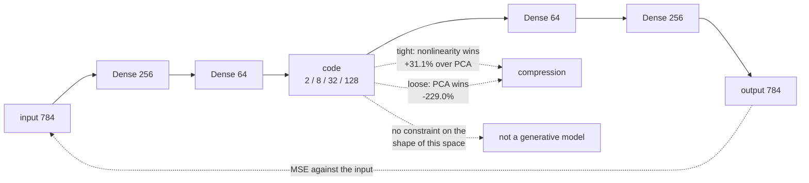

An autoencoder learns to copy its input through a bottleneck. The encoder compresses,
the decoder reconstructs, and the loss is how badly the copy came out. Nothing labels
the data, so it is unsupervised — and the compression is supposed to be the useful part.

There is an exact baseline for that claim, and it is rarely run. **A linear autoencoder
trained with squared error learns the same subspace as PCA.** So a nonlinear autoencoder
has to beat PCA at the same number of components, or its training time bought nothing.

| Bottleneck | Autoencoder MSE | PCA MSE | Autoencoder vs PCA |
| --- | --- | --- | --- |
| 2 | **0.0456** | 0.0542 | **+16.0%** |
| 8 | **0.0254** | 0.0368 | **+31.1%** |
| 32 | 0.0155 | 0.0159 | +2.3% |
| **128** | 0.0114 | **0.0035** | **−229.0%** |

The nonlinearity pays at a tight bottleneck and loses badly at a loose one — where PCA
reconstructs more than three times better than the trained network.

## What you'll learn

- The encoder–bottleneck–decoder shape, and why the bottleneck is the whole design.
- Why PCA is the correct baseline, and where the autoencoder beats it.
- What reconstructions actually look like at 2, 8, 32 and 128 dimensions.
- Why a 128-dimensional autoencoder **lost** to a closed-form method.
- Denoising autoencoders, and the 3×3 blur baseline that halves the error for free.
- Why none of this makes an autoencoder a generative model.

## The shape

```python title="Encoder, bottleneck, decoder"
inputs = keras.layers.Input((784,))
x = keras.layers.Dense(256, activation="relu")(inputs)
x = keras.layers.Dense(64, activation="relu")(x)
code = keras.layers.Dense(bottleneck, activation="relu", name="code")(x)   # <- the whole point
x = keras.layers.Dense(64, activation="relu")(code)
x = keras.layers.Dense(256, activation="relu")(x)
outputs = keras.layers.Dense(784, activation="sigmoid")(inputs)
model.compile("adam", "mse")            # the target IS the input
```

The only thing stopping the network learning the identity function is that the code layer
is narrower than the input. Everything interesting follows from that constraint: with a
wide enough bottleneck the task is trivial and the representation is useless.

## PCA is the baseline

$$
\min_{W, W'} \; \lVert X - X W W' \rVert_F^2
$$

With linear activations and squared error, that is exactly the problem PCA solves in
closed form. Adding nonlinearity means the autoencoder *can* represent curved manifolds
PCA cannot — but it also has to find them by gradient descent.

<Figure
  src="/images/dl/phase-06-generative/autoencoders/bottleneck-sweep"
  alt="Two panels. Left: test reconstruction MSE against bottleneck size on a log x-axis for the autoencoder and for PCA. The autoencoder is lower at 2 and 8 dimensions (0.0456 vs 0.0542, 0.0254 vs 0.0368), they cross near 32 (0.0155 vs 0.0159), and PCA is far lower at 128 (0.0035 vs 0.0114). Right: the error reduction against PCA as bars — positive 16.0% and 31.1% at 2 and 8 dimensions, 2.3% at 32, and minus 229.0% at 128."
  title="MNIST, 12,000 images, 20 epochs"
  caption="Two regimes, and the crossover is the interesting part. At a tight bottleneck the nonlinearity earns its keep: 8 components of PCA keep 44.7% of the variance while the autoencoder's 8 numbers reconstruct 31.1% better. At 128 components PCA keeps 93.9% of the variance and reconstructs 3.3x better than the network — because at that width the problem is nearly linear, PCA solves it exactly, and gradient descent on 452,112 parameters simply does not get as close in 20 epochs."
/>

That −229.0% deserves stating plainly: **the closed-form method beat the neural network by
a factor of 3.3**. Not because autoencoders are bad, but because at 128 dimensions there
is little curvature left to exploit, PCA is optimal for squared error, and an
optimiser working on a non-convex objective with a fixed budget lands somewhere worse.

<Figure
  src="/images/dl/phase-06-generative/autoencoders/reconstructions"
  alt="A grid of digit reconstructions. The top row is four original MNIST digits. Below it, alternating rows show the autoencoder and PCA reconstructions at bottleneck sizes 2, 8, 32 and 128, each labelled with its per-image MSE. At 2 dimensions both are blurry blobs that often show the wrong digit; by 32 both are recognisable; at 128 the PCA row is visibly sharper than the autoencoder row."
  title="The same four digits at every bottleneck"
  caption="At 2 dimensions neither method reconstructs the digit — they reconstruct the average digit that lands in that region of the code space, which is why the numbers are often wrong rather than merely blurry. The 128-dimensional rows are where the numeric result becomes visible: the PCA reconstructions have sharper strokes because they are the exact least-squares projection, while the autoencoder's are smoothed by an optimiser that stopped early."
/>

## Denoising

Change one thing — feed corrupted input and ask for the clean image — and the autoencoder
stops learning compression and starts learning the data distribution's structure.

```python title="The only change is the training pair"
model.fit(noisy_train, clean_train, ...)      # input != target
```

| Method | MSE against the clean image |
| --- | --- |
| do nothing (the noisy input) | 0.0798 |
| **3×3 blur** | **0.0446** |
| denoising autoencoder | **0.0237** |

<Figure
  src="/images/dl/phase-06-generative/autoencoders/denoising"
  alt="Left: four columns of digits shown in four rows — noisy input, 3x3 blurred, denoising autoencoder output, and clean original. The blurred row is smeared but readable; the autoencoder row is close to the clean row. Right: bars of MSE against the clean image — noisy input 0.0798, 3x3 blur 0.0446, denoising autoencoder 0.0237."
  title="Gaussian noise, standard deviation 0.4"
  caption="The blur is the baseline that makes the autoencoder's number meaningful. Averaging nine neighbouring pixels removes almost half the error for free, with no training and no parameters, because the noise is independent per pixel and the signal is not. The autoencoder halves the error again — that remaining factor of 1.9 is what learning the digit distribution actually bought."
/>

Without the blur baseline, "0.0237 MSE" is unanchored. With it, the claim becomes
specific: the network is worth **1.9× a three-line convolution**, on this noise level.

## What an autoencoder is not

An autoencoder is not a generative model, and the reason is worth being precise about.
Nothing in the training objective constrains what the code space *looks like* — only that
the decoder can invert the encoder on points the encoder actually produces. So:

- Sampling a random code vector and decoding it produces nothing meaningful, because
  random points are nowhere near the region the encoder uses.
- With a ReLU code layer, most of the space is unreachable by construction — codes are
  non-negative.
- The code distribution has no reason to be smooth or connected, so interpolating between
  two codes can pass through empty regions.

Fixing exactly this — by forcing the code distribution towards a known prior — is what
the [next page](/deep-learning/phase-06---generative-deep-learning/variational-autoencoders-vae/)
is about, and it is the difference between compression and generation.



```p5 title="What a bottleneck can carry" desc="Drag the bottleneck size. The bar shows how much of MNIST's variance PCA keeps at that many components, with the measured autoencoder and PCA errors alongside." height="330"
let size = 8;
let dragging = false;
const MEASURED = {
  2: { ae: 0.0456, pca: 0.0542, variance: 0.176 },
  8: { ae: 0.0254, pca: 0.0368, variance: 0.447 },
  32: { ae: 0.0155, pca: 0.0159, variance: 0.751 },
  128: { ae: 0.0114, pca: 0.0035, variance: 0.939 },
};
const KEYS = [2, 8, 32, 128];
function nearest(value) {
  return KEYS.reduce((best, key) =>
    Math.abs(key - value) < Math.abs(best - value) ? key : best, KEYS[0]);
}
function setup() {
  createCanvas(620, 330);
  textFont("monospace");
}
function draw() {
  background(13, 17, 23);
  const key = nearest(size);
  const info = MEASURED[key];
  noStroke();
  fill(230);
  textSize(12);
  textAlign(LEFT, TOP);
  text("bottleneck " + key + " of 784 dimensions", 30, 22);
  fill(150);
  textSize(10.5);
  text("compression ratio " + (784 / key).toFixed(0) + ":1", 30, 44);

  fill(60, 70, 84);
  rect(30, 76, 540, 26, 3);
  fill(107, 169, 221);
  rect(30, 76, 540 * info.variance, 26, 3);
  fill(235);
  textSize(11);
  textAlign(LEFT, CENTER);
  text("PCA keeps " + (100 * info.variance).toFixed(1) + "% of the variance",
    38, 89);
  textAlign(LEFT, TOP);

  const scale = 0.06;
  fill(165, 214, 164);
  rect(30, 140, (info.ae / scale) * 540, 26, 3);
  fill(235);
  textSize(10.5);
  textAlign(LEFT, CENTER);
  text("autoencoder MSE " + info.ae.toFixed(4), 38, 153);
  textAlign(LEFT, TOP);
  fill(255, 211, 67);
  rect(30, 176, (info.pca / scale) * 540, 26, 3);
  fill(20);
  textAlign(LEFT, CENTER);
  text("PCA MSE " + info.pca.toFixed(4), 38, 189);
  textAlign(LEFT, TOP);

  const gain = (info.pca - info.ae) / info.pca;
  fill(gain > 0 ? 165 : 230, gain > 0 ? 214 : 90, gain > 0 ? 164 : 90);
  textSize(15);
  text(gain > 0
    ? "the autoencoder is " + (100 * gain).toFixed(1) + "% better"
    : "PCA is " + (info.ae / info.pca).toFixed(1) + "x better", 30, 224);
  fill(150);
  textSize(10.5);
  text("a tight bottleneck rewards nonlinearity; a loose one is nearly", 30, 256);
  text("linear, and a closed-form solution wins", 30, 272);
  fill(60, 70, 84);
  rect(30, 306, 540, 4, 2);
  fill(255, 211, 67);
  circle(30 + (Math.log2(size / 2) / Math.log2(64)) * 540, 308, 12);
}
function mousePressed() { if (Math.abs(mouseY - 308) < 12) dragging = true; }
function mouseDragged() {
  if (dragging) {
    const fraction = Math.min(Math.max((mouseX - 30) / 540, 0), 1);
    size = 2 * Math.pow(64, fraction);
  }
}
function mouseReleased() { dragging = false; }
```

```p5 title="The measured table, ranked" desc="Click a column to rank every row by it. The bars are that column's values and the highest and lowest are computed from the numbers, not written in." height="254"
let metric = 0;
const COLUMNS = ["Autoencoder MSE", "PCA MSE"];
const ROWS = [
  ["2", 0.0456, 0.0542],
  ["8", 0.0254, 0.0368],
  ["32", 0.0155, 0.0159],
  ["128", 0.0114, 0.0035]
];
function setup() {
  createCanvas(620, 254);
  textFont("monospace");
}
function fmt(v) {
  if (v === 0) { return "0"; }
  const a = Math.abs(v);
  if (a >= 1000 || a < 0.001) { return v.toExponential(2); }
  if (a >= 100) { return v.toFixed(1); }
  return v.toFixed(4);
}
function draw() {
  background(13, 17, 23);
  noStroke();
  fill(230);
  textSize(12);
  textAlign(LEFT, TOP);
  text("Autoencoders", 26, 16);
  let x = 26;
  for (let i = 0; i < COLUMNS.length; i++) {
    const w = COLUMNS[i].length * 6.6 + 16;
    if (i === metric) { fill(255, 211, 67); } else { fill(48, 56, 68); }
    rect(x, 40, w, 22, 4);
    if (i === metric) { fill(13, 17, 23); } else { fill(180); }
    textSize(9);
    text(COLUMNS[i], x + 8, 47);
    x += w + 6;
    if (x > 500) { break; }
  }
  const values = ROWS.map((r) => r[metric + 1]);
  const lo = Math.min(...values);
  const hi = Math.max(...values);
  const span = hi - lo === 0 ? 1 : hi - lo;
  const order = ROWS.slice().sort((a, b) => b[metric + 1] - a[metric + 1]);
  for (let i = 0; i < order.length; i++) {
    const y = 78 + i * 26;
    const v = order[i][metric + 1];
    fill(160);
    textSize(9);
    text(order[i][0], 26, y + 5);
    fill(34, 40, 50);
    rect(230, y, 280, 18, 3);
    const frac = (v - lo) / span;
    if (v === hi) { fill(126, 192, 143); }
    else if (v === lo) { fill(224, 108, 117); }
    else { fill(107, 169, 221); }
    rect(230, y, Math.max(frac * 280, 3), 18, 3);
    fill(225);
    textSize(9);
    text(fmt(v), 518, y + 5);
  }
  const top = order[0];
  const bottom = order[order.length - 1];
  fill(150);
  textSize(9);
  const base = 78 + order.length * 26 + 8;
  text("highest " + COLUMNS[metric] + ": " + top[0] + " at " + fmt(top[1]),
       26, base);
  text("lowest  " + COLUMNS[metric] + ": " + bottom[0] + " at "
       + fmt(bottom[1]), 26, base + 14);
  text("bars are scaled within the chosen column - lowest is not zero", 26,
       base + 30);
}
function mousePressed() {
  let x = 26;
  for (let i = 0; i < COLUMNS.length; i++) {
    const w = COLUMNS[i].length * 6.6 + 16;
    if (mouseX > x && mouseX < x + w && mouseY > 40 && mouseY < 62) {
      metric = i;
    }
    x += w + 6;
  }
}
```

## Pitfalls

- **Not running PCA.** It is two lines, needs no training, and beat the autoencoder by
  3.3× at 128 components.
- **Claiming an autoencoder "learns features" without a downstream test.** Reconstruction
  error measures reconstruction; use a linear probe if you care about the features.
- **Using a wide bottleneck.** At 128 of 784 dimensions the task is nearly linear and the
  representation is barely compressed.
- **Sampling random codes and expecting digits.** Nothing constrains the code
  distribution; with a ReLU code layer most of the space is unreachable.
- **Reporting a denoiser without a blur baseline.** A 3×3 average removed 44% of the
  error for free.
- **Comparing MSE across noise levels or datasets.** The number is only meaningful
  against a baseline on the same data.
- **Expecting sharp reconstructions from squared error.** MSE's optimum is the conditional
  *mean*, which is why every reconstruction on this page is smooth.

## Recap

- An autoencoder minimises reconstruction error through a bottleneck; the bottleneck is
  the only thing preventing the identity function.
- A linear autoencoder with squared error is PCA, so PCA at the same component count is
  the baseline.
- Measured: autoencoder better by 16.0% at 2 components and 31.1% at 8; PCA better by
  3.3× at 128.
- PCA's explained variance at those widths: 17.6%, 44.7%, 75.1%, 93.9%.
- Denoising: noisy input 0.0798, 3×3 blur 0.0446, denoising autoencoder 0.0237.
- An autoencoder is not generative — nothing shapes the code distribution, which is
  exactly what a VAE adds.

## Next

Add one constraint — that the code distribution match a known prior — and the same
architecture becomes able to generate:
[Variational Autoencoders (VAE)](/deep-learning/phase-06---generative-deep-learning/variational-autoencoders-vae/).

<Quiz
  questions={[
    {
      q: "Why is PCA the right baseline for an autoencoder?",
      options: [
        "Because it is faster",
        "Because a linear autoencoder trained with squared error learns the same subspace as PCA — so the nonlinear version must beat PCA at the same component count to have earned anything",
        "Because PCA also uses gradient descent",
        "Because PCA works only on images",
      ],
      answer: 1,
      explain: "Measured: the autoencoder won by 31.1% at 8 components and lost by a factor of 3.3 at 128.",
    },
    {
      q: "At a 128-dimensional bottleneck, PCA reached MSE 0.0035 against the autoencoder's 0.0114. What explains that?",
      options: [
        "The autoencoder was implemented incorrectly",
        "At that width the problem is nearly linear — PCA keeps 93.9% of the variance and solves least squares exactly, while gradient descent on 452,112 parameters lands somewhere worse in 20 epochs",
        "PCA is always better than autoencoders",
        "MSE is the wrong metric for PCA",
      ],
      answer: 1,
      explain: "The nonlinearity only pays where there is curvature to exploit, which is at a tight bottleneck — +16.0% at 2 dimensions and +31.1% at 8.",
    },
    {
      q: "A denoising autoencoder scored MSE 0.0237 against the clean images. Why is that number not interpretable on its own?",
      options: [
        "Because MSE is not a valid metric for images",
        "Because a 3x3 average blur — no training, no parameters — already scores 0.0446 against the noisy input's 0.0798, so the network's real contribution is a further factor of 1.9",
        "Because the noise level was too low",
        "Because denoising is not a learning problem",
      ],
      answer: 1,
      explain: "Independent per-pixel noise is exactly what local averaging removes, so the blur is the baseline that anchors the claim.",
    },
    {
      q: "Why can't you generate new digits by sampling a random code vector and decoding it?",
      options: [
        "Because the decoder is not invertible",
        "Because nothing in the loss constrains the code distribution — random points are far from the region the encoder actually produces, and with a ReLU code layer most of the space is unreachable",
        "Because the bottleneck is too small",
        "Because MSE cannot generate images",
      ],
      answer: 1,
      explain: "Forcing the code distribution towards a known prior is precisely the change a VAE makes, and it is the difference between compression and generation.",
    },
    {
      q: "At a 2-dimensional bottleneck the reconstructions often show the wrong digit rather than a blurry right one. Why?",
      options: [
        "The model is undertrained",
        "Two numbers cannot identify a digit, so the decoder outputs the average image for that region of the code space — and the average of several digit classes is a different digit",
        "The sigmoid output saturates",
        "MNIST digits are ambiguous at low resolution",
      ],
      answer: 1,
      explain: "Squared error's optimum is the conditional mean, so a bottleneck too tight to disambiguate produces a mean over classes.",
    },
  ]}
/>

## 🧪 Try It Yourself

<DataCampExercise
  lang="python"
  hint={`The target of an autoencoder is its own input. The code layer is whatever you name it — its width is the only thing constraining the model.`}
  code={`# Task: Exercise 1 - An autoencoder is trained against its own input
import numpy as np
from sklearn.datasets import load_digits

digits = load_digits()
x_train = digits.data[:1200] / 16.0
x_test = digits.data[1200:] / 16.0


def train_autoencoder(inputs, targets, bottleneck, relu=False, epochs=600, lr=0.1, seed=0):
    rng = np.random.default_rng(seed)
    w1 = rng.normal(0, 0.1, (64, bottleneck)); b1 = np.zeros(bottleneck)
    w2 = rng.normal(0, 0.1, (bottleneck, 64)); b2 = np.zeros(64)
    for _ in range(epochs):
        z = inputs @ w1 + b1
        code = np.maximum(z, 0) if relu else z
        error = (code @ w2 + b2 - targets) / len(inputs)
        gcode = error @ w2.T
        if relu:
            gcode = gcode * (z > 0)
        w2 -= lr * code.T @ error; b2 -= lr * error.sum(0)
        w1 -= lr * inputs.T @ gcode; b1 -= lr * gcode.sum(0)
    return w1, b1, w2, b2


def reconstruct(params, inputs, relu=False):
    w1, b1, w2, b2 = params
    z = inputs @ w1 + b1
    return (np.maximum(z, 0) if relu else z) @ w2 + b2


params = train_autoencoder(x_train, ___, 8, relu=True)   # the target is the input itself
reconstructed = reconstruct(params, x_test, relu=True)
mse = float(np.mean((reconstructed - x_test) ** 2))
baseline = float(np.mean((x_train.mean(axis=0) - x_test) ** 2))
print(f"input {x_test.shape} -> code (8,) -> output {reconstructed.shape}")
print(f"compression ratio {64 / 8:.0f}:1")
print(f"test MSE {mse:.4f}, predicting the mean image {baseline:.4f}")
print("the autoencoder beats the mean image:", mse < baseline)`}
  solution={`# Task: Exercise 1 - An autoencoder is trained against its own input
import numpy as np
from sklearn.datasets import load_digits

digits = load_digits()
x_train = digits.data[:1200] / 16.0
x_test = digits.data[1200:] / 16.0


def train_autoencoder(inputs, targets, bottleneck, relu=False, epochs=600, lr=0.1, seed=0):
    rng = np.random.default_rng(seed)
    w1 = rng.normal(0, 0.1, (64, bottleneck)); b1 = np.zeros(bottleneck)
    w2 = rng.normal(0, 0.1, (bottleneck, 64)); b2 = np.zeros(64)
    for _ in range(epochs):
        z = inputs @ w1 + b1
        code = np.maximum(z, 0) if relu else z
        error = (code @ w2 + b2 - targets) / len(inputs)
        gcode = error @ w2.T
        if relu:
            gcode = gcode * (z > 0)
        w2 -= lr * code.T @ error; b2 -= lr * error.sum(0)
        w1 -= lr * inputs.T @ gcode; b1 -= lr * gcode.sum(0)
    return w1, b1, w2, b2


def reconstruct(params, inputs, relu=False):
    w1, b1, w2, b2 = params
    z = inputs @ w1 + b1
    return (np.maximum(z, 0) if relu else z) @ w2 + b2


params = train_autoencoder(x_train, x_train, 8, relu=True)   # the target is the input itself
reconstructed = reconstruct(params, x_test, relu=True)
mse = float(np.mean((reconstructed - x_test) ** 2))
baseline = float(np.mean((x_train.mean(axis=0) - x_test) ** 2))
print(f"input {x_test.shape} -> code (8,) -> output {reconstructed.shape}")
print(f"compression ratio {64 / 8:.0f}:1")
print(f"test MSE {mse:.4f}, predicting the mean image {baseline:.4f}")
print("the autoencoder beats the mean image:", mse < baseline)`}
  sct={`test_output_contains("compression ratio 8:1", pattern=False)
test_output_contains("the autoencoder beats the mean image: True", pattern=False)
success_msg("An autoencoder is trained against its own input, and squeezing 64 pixels through 8 numbers still beats predicting the average image.")`}
  height={400}
/>

<DataCampExercise
  lang="python"
  hint={`PCA's inverse_transform reconstructs from the components. Compare it against the autoencoder at the same number of components.`}
  code={`# Task: Exercise 2 - The baseline: PCA at the same width
import numpy as np
from sklearn.datasets import load_digits
from sklearn.decomposition import PCA

digits = load_digits()
x_train = digits.data[:1200] / 16.0
x_test = digits.data[1200:] / 16.0


def linear_autoencoder(inputs, bottleneck, epochs=600, lr=0.1):
    rng = np.random.default_rng(0)
    w1 = rng.normal(0, 0.1, (64, bottleneck)); w2 = rng.normal(0, 0.1, (bottleneck, 64))
    for _ in range(epochs):
        code = inputs @ w1
        error = (code @ w2 - inputs) / len(inputs)
        gcode = error @ w2.T
        w2 -= lr * code.T @ error
        w1 -= lr * inputs.T @ gcode
    return w1, w2


print(f"{'bottleneck':>11} {'AE MSE':>9} {'PCA MSE':>9} {'AE vs PCA':>10}")
ae_scores, pca_scores = [], []
for bottleneck in (2, 8, 16):
    w1, w2 = linear_autoencoder(x_train, bottleneck)
    ae = float(np.mean((x_test @ w1 @ w2 - x_test) ** 2))
    pca = PCA(n_components=bottleneck).fit(x_train)
    pca_mse = float(np.mean((pca.inverse_transform(pca.transform(x_test)) - x_test) ** 2))
    gain = (pca_mse - ae) / ___                  # relative to the PCA error
    ae_scores.append(ae); pca_scores.append(pca_mse)
    print(f"{bottleneck:11d} {ae:9.4f} {pca_mse:9.4f} {gain:+9.1%}")
print("PCA error falls as the bottleneck widens:", pca_scores[0] > pca_scores[1] > pca_scores[2])
print("autoencoder error falls as the bottleneck widens:", ae_scores[0] > ae_scores[1] > ae_scores[2])`}
  solution={`# Task: Exercise 2 - The baseline: PCA at the same width
import numpy as np
from sklearn.datasets import load_digits
from sklearn.decomposition import PCA

digits = load_digits()
x_train = digits.data[:1200] / 16.0
x_test = digits.data[1200:] / 16.0


def linear_autoencoder(inputs, bottleneck, epochs=600, lr=0.1):
    rng = np.random.default_rng(0)
    w1 = rng.normal(0, 0.1, (64, bottleneck)); w2 = rng.normal(0, 0.1, (bottleneck, 64))
    for _ in range(epochs):
        code = inputs @ w1
        error = (code @ w2 - inputs) / len(inputs)
        gcode = error @ w2.T
        w2 -= lr * code.T @ error
        w1 -= lr * inputs.T @ gcode
    return w1, w2


print(f"{'bottleneck':>11} {'AE MSE':>9} {'PCA MSE':>9} {'AE vs PCA':>10}")
ae_scores, pca_scores = [], []
for bottleneck in (2, 8, 16):
    w1, w2 = linear_autoencoder(x_train, bottleneck)
    ae = float(np.mean((x_test @ w1 @ w2 - x_test) ** 2))
    pca = PCA(n_components=bottleneck).fit(x_train)
    pca_mse = float(np.mean((pca.inverse_transform(pca.transform(x_test)) - x_test) ** 2))
    gain = (pca_mse - ae) / pca_mse                 # relative to the PCA error
    ae_scores.append(ae); pca_scores.append(pca_mse)
    print(f"{bottleneck:11d} {ae:9.4f} {pca_mse:9.4f} {gain:+9.1%}")
print("PCA error falls as the bottleneck widens:", pca_scores[0] > pca_scores[1] > pca_scores[2])
print("autoencoder error falls as the bottleneck widens:", ae_scores[0] > ae_scores[1] > ae_scores[2])`}
  sct={`test_output_contains("PCA error falls as the bottleneck widens: True", pattern=False)
test_output_contains("autoencoder error falls as the bottleneck widens: True", pattern=False)
success_msg("PCA is the closed-form baseline any autoencoder has to beat at the same width, and both improve as the bottleneck widens.")`}
  height={400}
/>

<DataCampExercise
  lang="python"
  hint={`Feed the noisy images as input and the clean ones as target. The blur baseline is a 3x3 average, which you can compute with padding and slicing.`}
  code={`# Task: Exercise 3 - Denoising, against the baseline nobody runs
import numpy as np
from sklearn.datasets import load_digits

digits = load_digits()
x_train = digits.data[:1200] / 16.0
x_test = digits.data[1200:] / 16.0
rng = np.random.default_rng(0)
NOISE = 0.3
noisy_train = np.clip(x_train + rng.normal(0, NOISE, x_train.shape), 0, 1)
noisy_test = np.clip(x_test + rng.normal(0, NOISE, x_test.shape), 0, 1)


def train(inputs, targets, bottleneck=16, epochs=600, lr=0.1):
    gen = np.random.default_rng(1)
    w1 = gen.normal(0, 0.1, (64, bottleneck)); w2 = gen.normal(0, 0.1, (bottleneck, 64))
    for _ in range(epochs):
        code = inputs @ w1
        error = (code @ w2 - targets) / len(inputs)
        gcode = error @ w2.T
        w2 -= lr * code.T @ error
        w1 -= lr * inputs.T @ gcode
    return w1, w2


w1, w2 = train(noisy_train, ___)                 # noisy input, CLEAN target
cleaned = noisy_test @ w1 @ w2

images = noisy_test.reshape(-1, 8, 8)
padded = np.pad(images, ((0, 0), (1, 1), (1, 1)), mode="edge")
blurred = sum(padded[:, i:i + 8, j:j + 8] for i in range(3) for j in range(3)) / 9.0
blurred = blurred.reshape(len(images), -1)

scores = {}
print(f"{'method':14s} {'MSE against clean':>18}")
for label, prediction in (("noisy input", noisy_test), ("3x3 blur", blurred),
                          ("denoising AE", cleaned)):
    scores[label] = float(np.mean((prediction - x_test) ** 2))
    print(f"{label:14s} {scores[label]:18.4f}")
print("the denoising AE beats the noisy input:", scores["denoising AE"] < scores["noisy input"])`}
  solution={`# Task: Exercise 3 - Denoising, against the baseline nobody runs
import numpy as np
from sklearn.datasets import load_digits

digits = load_digits()
x_train = digits.data[:1200] / 16.0
x_test = digits.data[1200:] / 16.0
rng = np.random.default_rng(0)
NOISE = 0.3
noisy_train = np.clip(x_train + rng.normal(0, NOISE, x_train.shape), 0, 1)
noisy_test = np.clip(x_test + rng.normal(0, NOISE, x_test.shape), 0, 1)


def train(inputs, targets, bottleneck=16, epochs=600, lr=0.1):
    gen = np.random.default_rng(1)
    w1 = gen.normal(0, 0.1, (64, bottleneck)); w2 = gen.normal(0, 0.1, (bottleneck, 64))
    for _ in range(epochs):
        code = inputs @ w1
        error = (code @ w2 - targets) / len(inputs)
        gcode = error @ w2.T
        w2 -= lr * code.T @ error
        w1 -= lr * inputs.T @ gcode
    return w1, w2


w1, w2 = train(noisy_train, x_train)                 # noisy input, CLEAN target
cleaned = noisy_test @ w1 @ w2

images = noisy_test.reshape(-1, 8, 8)
padded = np.pad(images, ((0, 0), (1, 1), (1, 1)), mode="edge")
blurred = sum(padded[:, i:i + 8, j:j + 8] for i in range(3) for j in range(3)) / 9.0
blurred = blurred.reshape(len(images), -1)

scores = {}
print(f"{'method':14s} {'MSE against clean':>18}")
for label, prediction in (("noisy input", noisy_test), ("3x3 blur", blurred),
                          ("denoising AE", cleaned)):
    scores[label] = float(np.mean((prediction - x_test) ** 2))
    print(f"{label:14s} {scores[label]:18.4f}")
print("the denoising AE beats the noisy input:", scores["denoising AE"] < scores["noisy input"])`}
  sct={`test_output_contains("the denoising AE beats the noisy input: True", pattern=False)
success_msg("Training on noisy inputs against clean targets teaches the network to remove noise, and the blur is a parameter-free baseline to compare with.")`}
  height={400}
/>

<DataCampExercise
  lang="python"
  hint={`Sample codes from a normal distribution and from the encoder's actual output range, decode both, and compare against real digits.`}
  code={`# Task: Exercise 4 - Why this is not a generative model
import numpy as np
from sklearn.datasets import load_digits

digits = load_digits()
x_train = digits.data[:1200] / 16.0
rng = np.random.default_rng(0)
BOTTLENECK = 8
w1 = rng.normal(0, 0.1, (64, BOTTLENECK)); b1 = np.zeros(BOTTLENECK)
w2 = rng.normal(0, 0.1, (BOTTLENECK, 64)); b2 = np.zeros(64)
for _ in range(400):
    z = x_train @ w1 + b1
    code = np.maximum(z, 0)
    error = (code @ w2 + b2 - x_train) / len(x_train)
    gcode = (error @ w2.T) * (z > 0)
    w2 -= 0.5 * code.T @ error; b2 -= 0.5 * error.sum(0)
    w1 -= 0.5 * x_train.T @ gcode; b1 -= 0.5 * gcode.sum(0)

real_codes = np.maximum(x_train[:200] @ w1 + b1, 0)
gaussian = rng.normal(0, 1, (200, BOTTLENECK))
reference = x_train[200:600]


def distance_to_nearest_digit(codes):
    decoded = codes @ w2 + b2
    gaps = np.linalg.norm(decoded[:, None, :] - reference[None, :, :], axis=___)
    return float(gaps.min(axis=1).mean())        # distance to the closest real image


real = distance_to_nearest_digit(real_codes)
random = distance_to_nearest_digit(gaussian)
print(f"real codes: {real:.3f}   random normal codes: {random:.3f}")
print("codes are non-negative because of the ReLU:", bool(real_codes.min() >= 0))
print("random codes decode further from real digits:", random > real)`}
  solution={`# Task: Exercise 4 - Why this is not a generative model
import numpy as np
from sklearn.datasets import load_digits

digits = load_digits()
x_train = digits.data[:1200] / 16.0
rng = np.random.default_rng(0)
BOTTLENECK = 8
w1 = rng.normal(0, 0.1, (64, BOTTLENECK)); b1 = np.zeros(BOTTLENECK)
w2 = rng.normal(0, 0.1, (BOTTLENECK, 64)); b2 = np.zeros(64)
for _ in range(400):
    z = x_train @ w1 + b1
    code = np.maximum(z, 0)
    error = (code @ w2 + b2 - x_train) / len(x_train)
    gcode = (error @ w2.T) * (z > 0)
    w2 -= 0.5 * code.T @ error; b2 -= 0.5 * error.sum(0)
    w1 -= 0.5 * x_train.T @ gcode; b1 -= 0.5 * gcode.sum(0)

real_codes = np.maximum(x_train[:200] @ w1 + b1, 0)
gaussian = rng.normal(0, 1, (200, BOTTLENECK))
reference = x_train[200:600]


def distance_to_nearest_digit(codes):
    decoded = codes @ w2 + b2
    gaps = np.linalg.norm(decoded[:, None, :] - reference[None, :, :], axis=2)
    return float(gaps.min(axis=1).mean())        # distance to the closest real image


real = distance_to_nearest_digit(real_codes)
random = distance_to_nearest_digit(gaussian)
print(f"real codes: {real:.3f}   random normal codes: {random:.3f}")
print("codes are non-negative because of the ReLU:", bool(real_codes.min() >= 0))
print("random codes decode further from real digits:", random > real)`}
  sct={`test_output_contains("codes are non-negative because of the ReLU: True", pattern=False)
test_output_contains("random codes decode further from real digits: True", pattern=False)
success_msg("Nothing in the objective made the code space dense or connected, so decoding points the encoder never produces gives images unlike real digits.")`}
  height={400}
/>

<DataCampExercise
  lang="python"
  hint={`A linear autoencoder has no activation functions. Compare the subspace it finds against PCA's by reconstruction error, not by the weights themselves.`}
  code={`# Task: Exercise 5 - A linear autoencoder is PCA
import numpy as np
from sklearn.datasets import load_digits
from sklearn.decomposition import PCA

digits = load_digits()
x_train = digits.data[:1200] / 16.0
x_test = digits.data[1200:] / 16.0
COMPONENTS = 8
centre = x_train.mean(axis=0)
rng = np.random.default_rng(0)
w1 = rng.normal(0, 0.1, (64, COMPONENTS)); w2 = rng.normal(0, 0.1, (COMPONENTS, 64))
ACTIVATION_IS_LINEAR = ___                        # no nonlinearity in this autoencoder
for _ in range(600):
    code = (x_train - centre) @ w1
    if not ACTIVATION_IS_LINEAR:
        code = np.maximum(code, 0)
    error = (code @ w2 - (x_train - centre)) / len(x_train)
    w2 -= 0.8 * code.T @ error
    w1 -= 0.8 * (x_train - centre).T @ (error @ w2.T)

linear_mse = float(np.mean((((x_test - centre) @ w1) @ w2 + centre - x_test) ** 2))
pca = PCA(n_components=COMPONENTS).fit(x_train)
pca_mse = float(np.mean((pca.inverse_transform(pca.transform(x_test)) - x_test) ** 2))
print(f"linear autoencoder MSE {linear_mse:.4f}")
print(f"PCA MSE                {pca_mse:.4f}")
print("PCA is the floor - the autoencoder cannot beat it:", linear_mse >= pca_mse - 1e-6)
print("the autoencoder gets within 10% of PCA:", linear_mse < pca_mse * 1.10)`}
  solution={`# Task: Exercise 5 - A linear autoencoder is PCA
import numpy as np
from sklearn.datasets import load_digits
from sklearn.decomposition import PCA

digits = load_digits()
x_train = digits.data[:1200] / 16.0
x_test = digits.data[1200:] / 16.0
COMPONENTS = 8
centre = x_train.mean(axis=0)
rng = np.random.default_rng(0)
w1 = rng.normal(0, 0.1, (64, COMPONENTS)); w2 = rng.normal(0, 0.1, (COMPONENTS, 64))
ACTIVATION_IS_LINEAR = True                        # no nonlinearity in this autoencoder
for _ in range(600):
    code = (x_train - centre) @ w1
    if not ACTIVATION_IS_LINEAR:
        code = np.maximum(code, 0)
    error = (code @ w2 - (x_train - centre)) / len(x_train)
    w2 -= 0.8 * code.T @ error
    w1 -= 0.8 * (x_train - centre).T @ (error @ w2.T)

linear_mse = float(np.mean((((x_test - centre) @ w1) @ w2 + centre - x_test) ** 2))
pca = PCA(n_components=COMPONENTS).fit(x_train)
pca_mse = float(np.mean((pca.inverse_transform(pca.transform(x_test)) - x_test) ** 2))
print(f"linear autoencoder MSE {linear_mse:.4f}")
print(f"PCA MSE                {pca_mse:.4f}")
print("PCA is the floor - the autoencoder cannot beat it:", linear_mse >= pca_mse - 1e-6)
print("the autoencoder gets within 10% of PCA:", linear_mse < pca_mse * 1.10)`}
  sct={`test_output_contains("PCA is the floor - the autoencoder cannot beat it: True", pattern=False)
test_output_contains("the autoencoder gets within 10% of PCA: True", pattern=False)
success_msg("A linear autoencoder solves the same optimisation problem as PCA, by gradient descent instead of in closed form, so any gap is optimisation error.")`}
  height={400}
/>
