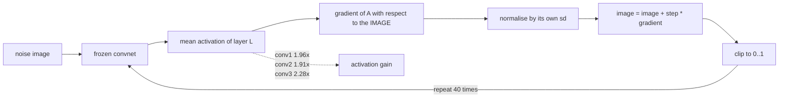

import DataCampExercise from "../../../../components/DataCampExercise.astro";
import Figure from "../../../../components/Figure.astro";
import Quiz from "../../../../components/Quiz.astro";

Every technique so far has trained a generator: an autoencoder's decoder, a VAE, a GAN's
generator, a diffusion denoiser. DeepDream trains nothing. It takes a network that already
exists, picks a layer, and changes the **input image** to make that layer's activation larger.

That is one line different from ordinary training:

$$
\text{training:} \quad \theta \leftarrow \theta - \eta \nabla_\theta \mathcal{L}
\qquad\qquad
\text{dreaming:} \quad x \leftarrow x + \eta \nabla_x a_\ell(x)
$$

The weights are frozen, the image is the variable, and the sign is flipped — ascent, not
descent. There is no loss and no target, only "more of whatever this layer responds to".

:::note[No pretrained weights here]
Published DeepDream images amplify ImageNet features, which is why they are full of dog faces
and eyes. There are no cached pretrained weights on this machine, so the features below come
from a small convnet trained here on Fashion-MNIST — 23,946 parameters, 12 epochs, **0.7767**
validation accuracy. The mechanism and every number are real; the visual vocabulary is garment
texture rather than dog faces, and a stronger feature network would produce more legible dreams.
:::

## What you'll learn

- Why gradient ascent on an activation is the whole algorithm, and why the gradient must be
  **normalised** before each step.
- What each layer dreams, with the measured activation gain: **1.96×**, **1.91×**, **2.28×**
  from the first convolution to the third.
- Why the largest step size is not the best one — the gain peaks at 2.41× and then *falls*.
- The **octave** trick, and what it measurably changes: fine-scale roughness halves, 0.2035 →
  0.1001.

## The algorithm

```python title="One ascent step"
with tf.GradientTape() as tape:
    tape.watch(image)
    activation = tf.reduce_mean(extractor(image))     # the thing to maximise

gradient = tape.gradient(activation, image).numpy()
gradient /= (np.abs(gradient).std() + 1e-8)           # <- not optional
image = np.clip(image + step_size * gradient, 0, 1)
```

The normalisation line is what makes the method usable. Raw gradient magnitudes differ by orders
of magnitude between layers — a deep layer's activation is larger and its gradient scales with
it — so without normalisation a single `step_size` would be a tiny nudge at one depth and a
saturated image at another. Dividing by the gradient's own standard deviation makes the step size
a *fraction of the image's dynamic range*, which is comparable across layers. That is why the
numbers in the next two sections can be compared at all.

Two other details matter:

- **Start from noise, not flat grey.** A constant image has a near-zero gradient in most
  directions, so the ascent has nothing to amplify. These runs start from mid grey plus Gaussian
  noise at sd 0.05.
- **Clip after every step.** Pixels have a valid range, and letting the image leave it produces
  gains that cannot be displayed.



## What each layer dreams

<Figure
  src="/images/dl/phase-06-generative/deepdream/layer-depth"
  alt="Top: three 56 by 56 dreamed images side by side, from conv1, conv2 and conv3. The first is fine high-frequency texture, the second has larger repeating blobs, the third has coarse garment-like patches. Bottom: a bar chart of activation gain, 1.96x for conv1, 1.91x for conv2 and 2.28x for conv3, each annotated with the before and after activation."
  title="The same noise image, 40 ascent steps at step size 0.05"
  caption="The three panels start from identical noise and differ only in which layer was maximised. conv1 produces fine texture because a first-layer unit sees a 3x3 patch; conv3 produces coarse structure because its receptive field, after two pooling layers, covers a large fraction of the image. The gain is mean activation after divided by before: 0.5019 to 0.9840, 1.4643 to 2.8025, and 2.4411 to 5.5707."
/>

| Layer | Activation before | After | Gain | Mean pixel change |
| --- | --- | --- | --- | --- |
| `conv1` | 0.5019 | 0.9840 | 1.96× | 0.5015 |
| `conv2` | 1.4643 | 2.8025 | 1.91× | 0.5008 |
| `conv3` | 2.4411 | 5.5707 | **2.28×** | 0.4547 |

The **receptive field** is what changes across those rows. A `conv1` unit sees a 3×3 pixel patch,
so the only thing it can ask for is a favourable arrangement of nine pixels — repeated
everywhere, which reads as texture. After two `MaxPooling2D` layers a `conv3` unit sees a large
region, so it can ask for a whole shape.

Note the last column: `conv3` achieved the *largest* activation gain with the *smallest* pixel
change (0.4547 against 0.5015). Deeper features are more specific, so satisfying them requires
less indiscriminate rearranging.

## Step size

<Figure
  src="/images/dl/phase-06-generative/deepdream/step-size"
  alt="Top: five dreamed images at step sizes 0.005, 0.02, 0.05, 0.2 and 0.5, progressing from faint texture to a heavily saturated high-contrast image. Bottom: activation gain rising from 1.62x to a peak of 2.41x at step 0.2 and then falling to 2.36x at 0.5, with a second dashed line showing mean pixel change flattening from 0.4800 to 0.4887."
  title="conv3, 40 steps at each setting"
  caption="Gain improves steeply from 0.005 to 0.05 and then flattens, peaking at 2.41x at step 0.2 before falling back to 2.36x at 0.5. The dashed line explains it: mean pixel change is already 0.4800 at step 0.2 and only reaches 0.4887 at 0.5, because the clip absorbs everything extra. Past that point a larger step does not move the image further, it just moves it more coarsely."
/>

| Step size | Activation after | Gain | Mean pixel change |
| --- | --- | --- | --- |
| 0.005 | 3.9614 | 1.62× | 0.1705 |
| 0.020 | 4.9230 | 2.02× | 0.3581 |
| 0.050 | 5.5707 | 2.28× | 0.4547 |
| **0.200** | **5.8941** | **2.41×** | 0.4800 |
| 0.500 | 5.7537 | 2.36× | 0.4887 |

This is a genuinely non-monotonic result and it is worth being precise about the cause. The
gradient is recomputed at every step from the *current* image, so it is only valid locally. A
step of 0.5 moves half the dynamic range on the strength of that local estimate, overshoots, and
then spends the next step correcting — while the clip discards whatever went out of range. The
measured gain at 0.5 is lower than at 0.2 despite moving the pixels further.

Practically: pick the step size by measuring the gain, not by eye. The visually "strongest" image
here is not the one with the highest activation.

## Octaves

The original DeepDream dreams at several resolutions, starting small and scaling up. The stated
reason is that small images produce large features: at low resolution a fixed receptive field
covers proportionally more of the picture.

<Figure
  src="/images/dl/phase-06-generative/deepdream/octaves"
  alt="Top: three dreamed images produced with 1, 2 and 3 octaves, the single-octave one visibly grainier and the three-octave one smoother with broader shapes. Bottom: bars showing activation reached, 5.5707, 4.8568 and 4.9144, alongside scaled fine-scale roughness falling from 0.2035 to 0.1328 to 0.1001."
  title="conv3, total ascent steps held roughly constant"
  caption="The step budget is divided between octaves rather than added to, so this compares how the steps are spent. Roughness — the mean absolute difference between vertically adjacent pixels — falls steadily, 0.2035 to 0.1328 to 0.1001, so the multi-scale version is measurably less grainy. It also reaches a lower activation (4.9144 against 5.5707), which is the trade: the single-scale run is free to chase pixel-level detail that the objective rewards."
/>

| Octaves | Activation reached | Fine-scale roughness |
| --- | --- | --- |
| 1 | **5.5707** | 0.2035 |
| 2 | 4.8568 | 0.1328 |
| 3 | 4.9144 | **0.1001** |

Be careful about what this does and does not show. Roughness halving is measured, and it means
the multi-scale images contain less pixel-to-pixel noise. The usual claim that octaves produce
*larger structures* is consistent with that but is **not** established by these two numbers — a
smoother image is not automatically an image with bigger shapes, and measuring structure size
properly needs something like a spatial autocorrelation length, which this module does not
compute.

What is established: octaves cost activation and buy smoothness.

```python title="Dreaming across octaves"
size = int(SIZE / OCTAVE_SCALE ** (octaves - 1))
current = tf.image.resize(base, (size, size)).numpy()

for octave in range(octaves):
    current = dream(layer, current, steps=STEPS // octaves)["image"]
    if octave + 1 < octaves:
        size = int(size * OCTAVE_SCALE)
        current = tf.image.resize(current, (size, size)).numpy()
```

Each upscale blurs what the previous octave produced, and the next round of ascent sharpens it
again at the new resolution. The structure that survives is the structure the layer wanted at the
coarser scale.

```p5 title="Gradient ascent against descent" desc="The same landscape, two rules. Click to place the dot, then press any key to take a step. Ascent climbs to a peak; descent runs to a valley." height="360"
let position = -1.6;
let mode = "ascent";
let stepSize = 0.12;
let history = [];
function setup() {
  createCanvas(620, 360);
  textFont("monospace");
  history = [position];
}
function activation(x) {
  return Math.exp(-((x - 1.2) ** 2) / 0.7) * 1.6
    + Math.exp(-((x + 1.4) ** 2) / 0.5) * 1.0;
}
function slope(x) {
  const h = 0.001;
  return (activation(x + h) - activation(x - h)) / (2 * h);
}
function draw() {
  background(13, 17, 23);
  const left = 60;
  const right = 580;
  const baseline = 280;
  noStroke();
  fill(230);
  textSize(12);
  textAlign(LEFT, TOP);
  text("gradient " + mode + " on a layer activation", 30, 20);
  fill(150);
  textSize(10.5);
  text("activation " + activation(position).toFixed(4)
    + "    slope " + slope(position).toFixed(4), 30, 42);
  text("rule: x <- x " + (mode === "ascent" ? "+" : "-")
    + " " + stepSize.toFixed(2) + " * slope", 30, 58);
  stroke(60, 70, 84);
  line(left, baseline, right, baseline);
  noFill();
  stroke(107, 169, 221);
  strokeWeight(2);
  beginShape();
  for (let px = left; px <= right; px += 3) {
    const x = ((px - left) / (right - left)) * 6 - 3;
    vertex(px, baseline - activation(x) * 110);
  }
  endShape();
  strokeWeight(1);
  noStroke();
  fill(80, 90, 105);
  for (const past of history) {
    const px = left + ((past + 3) / 6) * (right - left);
    circle(px, baseline - activation(past) * 110, 5);
  }
  fill(255, 211, 67);
  circle(left + ((position + 3) / 6) * (right - left),
    baseline - activation(position) * 110, 12);
  const buttons = [["ascent", 30], ["descent", 130], ["reset", 230]];
  for (const entry of buttons) {
    const label = entry[0];
    const x = entry[1];
    if (label === mode) { fill(255, 211, 67); } else { fill(60, 70, 84); }
    rect(x, 316, 90, 24, 4);
    if (label === mode) { fill(20); } else { fill(200); }
    textSize(11);
    textAlign(CENTER, CENTER);
    text(label, x + 45, 329);
  }
  textAlign(LEFT, TOP);
  fill(120);
  textSize(9.5);
  text("ascent climbs to a peak: that peak IS the dreamed image", 340, 318);
  text("descent runs to a valley, where the layer sees nothing", 340, 332);
}
function mousePressed() {
  if (mouseY > 310) {
    if (mouseX > 30 && mouseX < 120) { mode = "ascent"; }
    else if (mouseX > 130 && mouseX < 220) { mode = "descent"; }
    else if (mouseX > 230 && mouseX < 320) { position = -1.6; history = [position]; }
    return;
  }
  position = Math.min(Math.max(((mouseX - 60) / 520) * 6 - 3, -3), 3);
  history = [position];
}
function mouseDragged() {
  if (mouseY > 310) { return; }
  position = Math.min(Math.max(((mouseX - 60) / 520) * 6 - 3, -3), 3);
  history = [position];
}
function keyPressed() {
  const direction = mode === "ascent" ? 1 : -1;
  position = Math.min(Math.max(position + direction * stepSize * slope(position),
    -3), 3);
  history.push(position);
  if (history.length > 60) { history.shift(); }
}
```

Ascent from the left-hand starting point climbs the *smaller* peak and stops there — a local
maximum. DeepDream has exactly this property, which is why running it twice from different noise
gives two different images, and why a single dream should not be read as a complete picture of
what a layer detects.

```p5 title="The measured table, ranked" desc="Click a column to rank every row by it. The bars are that column's values and the highest and lowest are computed from the numbers, not written in." height="280"
let metric = 0;
const COLUMNS = ["Activation after", "Gain", "Mean pixel change"];
const ROWS = [
  ["0.005", 3.9614, 1.62, 0.1705],
  ["0.020", 4.923, 2.02, 0.3581],
  ["0.050", 5.5707, 2.28, 0.4547],
  ["0.200", 5.8941, 2.41, 0.48],
  ["0.500", 5.7537, 2.36, 0.4887]
];
function setup() {
  createCanvas(620, 280);
  textFont("monospace");
}
function fmt(v) {
  if (v === 0) { return "0"; }
  const a = Math.abs(v);
  if (a >= 1000 || a < 0.001) { return v.toExponential(2); }
  if (a >= 100) { return v.toFixed(1); }
  return v.toFixed(4);
}
function draw() {
  background(13, 17, 23);
  noStroke();
  fill(230);
  textSize(12);
  textAlign(LEFT, TOP);
  text("DeepDream", 26, 16);
  let x = 26;
  for (let i = 0; i < COLUMNS.length; i++) {
    const w = COLUMNS[i].length * 6.6 + 16;
    if (i === metric) { fill(255, 211, 67); } else { fill(48, 56, 68); }
    rect(x, 40, w, 22, 4);
    if (i === metric) { fill(13, 17, 23); } else { fill(180); }
    textSize(9);
    text(COLUMNS[i], x + 8, 47);
    x += w + 6;
    if (x > 500) { break; }
  }
  const values = ROWS.map((r) => r[metric + 1]);
  const lo = Math.min(...values);
  const hi = Math.max(...values);
  const span = hi - lo === 0 ? 1 : hi - lo;
  const order = ROWS.slice().sort((a, b) => b[metric + 1] - a[metric + 1]);
  for (let i = 0; i < order.length; i++) {
    const y = 78 + i * 26;
    const v = order[i][metric + 1];
    fill(160);
    textSize(9);
    text(order[i][0], 26, y + 5);
    fill(34, 40, 50);
    rect(230, y, 280, 18, 3);
    const frac = (v - lo) / span;
    if (v === hi) { fill(126, 192, 143); }
    else if (v === lo) { fill(224, 108, 117); }
    else { fill(107, 169, 221); }
    rect(230, y, Math.max(frac * 280, 3), 18, 3);
    fill(225);
    textSize(9);
    text(fmt(v), 518, y + 5);
  }
  const top = order[0];
  const bottom = order[order.length - 1];
  fill(150);
  textSize(9);
  const base = 78 + order.length * 26 + 8;
  text("highest " + COLUMNS[metric] + ": " + top[0] + " at " + fmt(top[1]),
       26, base);
  text("lowest  " + COLUMNS[metric] + ": " + bottom[0] + " at "
       + fmt(bottom[1]), 26, base + 14);
  text("bars are scaled within the chosen column - lowest is not zero", 26,
       base + 30);
}
function mousePressed() {
  let x = 26;
  for (let i = 0; i < COLUMNS.length; i++) {
    const w = COLUMNS[i].length * 6.6 + 16;
    if (mouseX > x && mouseX < x + w && mouseY > 40 && mouseY < 62) {
      metric = i;
    }
    x += w + 6;
  }
}
```

## Pitfalls

- **Not normalising the gradient.** Raw magnitudes differ by orders of magnitude between layers,
  so one step size cannot serve all of them.
- **Assuming a bigger step is a stronger dream.** The gain peaked at 2.41× at step 0.2 and fell to
  2.36× at 0.5, while pixel change barely moved (0.4800 → 0.4887).
- **Starting from a flat image.** A constant has almost no gradient to amplify; start from noise.
- **Forgetting to clip.** Out-of-range pixels inflate the activation without producing anything
  displayable.
- **Reading a dream as "what the layer detects".** It shows one local maximum reachable from one
  starting image, not the layer's full preference.
- **Claiming octaves make bigger structures because the image looks smoother.** Roughness fell
  0.2035 → 0.1001, which is smoothness; structure size was not measured here.
- **Expecting published DeepDream imagery from a locally trained network.** These features come
  from a 0.7767-accuracy Fashion-MNIST convnet, not from ImageNet.

## Recap

- DeepDream is gradient **ascent** on a layer's activation with respect to the input image; the
  weights never change.
- Normalising the gradient by its own standard deviation is what makes one step size valid across
  layers.
- Depth selects scale: `conv1` gained 1.96× as fine texture, `conv3` gained 2.28× as coarse
  structure, with a smaller pixel change (0.4547 against 0.5015).
- Gain against step size is non-monotonic — 1.62×, 2.02×, 2.28×, 2.41×, 2.36× — because clipping
  absorbs oversized steps.
- Octaves traded activation for smoothness: 5.5707 → 4.9144 while roughness fell 0.2035 → 0.1001.
- The result is a local maximum, so the starting noise selects the dream.

## Next

The same machinery — a frozen network, an image as the variable, gradient steps on a
differentiable objective — becomes a style transfer engine as soon as the objective compares two
images instead of maximising one number:
[Neural Style Transfer](/deep-learning/phase-06---generative-deep-learning/neural-style-transfer/).

<Quiz
  questions={[
    {
      q: "What is being optimised during DeepDream?",
      options: [
        "The network's weights, to maximise an activation",
        "The input image, with the weights frozen — gradient ascent on a layer's activation with respect to the pixels",
        "A separate generator network",
        "The loss between the image and a target image",
      ],
      answer: 1,
      explain: "Nothing is trained. The gradient is taken with respect to the image, and the sign is positive because the goal is more activation, not less.",
    },
    {
      q: "Why divide the gradient by its own standard deviation before each step?",
      options: [
        "To prevent numerical overflow",
        "Because raw gradient magnitudes differ by orders of magnitude between layers, so without it a single step size would be a tiny nudge at one depth and a saturated image at another",
        "To make the dream symmetric",
        "Because the activation is a mean rather than a sum",
      ],
      answer: 1,
      explain: "Normalising turns the step size into a fraction of the image's dynamic range, which is what makes gains comparable across layers.",
    },
    {
      q: "conv1 produced fine texture while conv3 produced coarse structure. Why?",
      options: [
        "conv3 has more filters",
        "Receptive field — a conv1 unit sees a 3x3 patch, while a conv3 unit sees a large region after two pooling layers, so it can ask for a whole shape",
        "conv3 was trained for longer",
        "The gradient is smoother at depth",
      ],
      answer: 1,
      explain: "Depth selects the spatial scale of what can be requested, which is the mechanism behind the visual difference between early- and late-layer dreams.",
    },
    {
      q: "Activation gain rose from 1.62x to 2.41x as the step size grew from 0.005 to 0.2, then fell to 2.36x at 0.5. What causes the fall?",
      options: [
        "Numerical instability in the gradient tape",
        "The gradient is only valid locally, so a very large step overshoots — and the clip discards whatever leaves the valid range, so the image barely moves further (0.4800 to 0.4887)",
        "The layer saturates and stops responding",
        "Fewer steps were taken at the larger size",
      ],
      answer: 1,
      explain: "The number of steps was identical at every setting, so the step size chosen by measuring gain is not the largest available one.",
    },
    {
      q: "Octaves reduced roughness from 0.2035 to 0.1001 but also reduced the activation reached, from 5.5707 to 4.9144. What is the honest conclusion?",
      options: [
        "Octaves produce larger structures, which these numbers prove",
        "Octaves measurably buy smoothness at the cost of activation; whether they produce larger structures was not measured here",
        "Octaves are strictly worse than single-scale dreaming",
        "The activation metric is invalid across resolutions",
      ],
      answer: 1,
      explain: "A smoother image is not automatically an image with bigger shapes — establishing that would need a measurement of structure size, such as a spatial autocorrelation length.",
    },
  ]}
/>

## 🧪 Try It Yourself

<DataCampExercise
  lang="python"
  hint={`Ascent adds the gradient; descent subtracts it. The only difference between the two rules is that sign.`}
  code={`# Task: Exercise 1 - Ascent and descent on the same function
import numpy as np


def activation(x):
    """A stand-in for a layer's mean activation as a function of one pixel."""
    return np.exp(-((x - 1.2) ** 2) / 0.7) * 1.6 + np.exp(-((x + 1.4) ** 2) / 0.5)


def slope(x, h=1e-4):
    return (activation(x + h) - activation(x - h)) / (2 * h)


def run(start, mode, steps=30, step_size=0.15):
    """Follow the gradient uphill (ascent) or downhill (descent)."""
    sign = 1.0 if mode == "ascent" else ___          # replace ___ with -1.0
    x = start
    for _ in range(steps):
        x = x + sign * step_size * slope(x)
    return x


for start in (-1.6, 0.0, 1.5):
    up = run(start, "ascent")
    down = run(start, "descent")
    print(f"start {start:+.2f}: ascent -> x {up:+.4f} "
          f"(activation {activation(up):.4f}), "
          f"descent -> x {down:+.4f} (activation {activation(down):.4f})")`}
  solution={`import numpy as np


def activation(x):
    """A stand-in for a layer's mean activation as a function of one pixel."""
    return np.exp(-((x - 1.2) ** 2) / 0.7) * 1.6 + np.exp(-((x + 1.4) ** 2) / 0.5)


def slope(x, h=1e-4):
    return (activation(x + h) - activation(x - h)) / (2 * h)


def run(start, mode, steps=30, step_size=0.15):
    """Follow the gradient uphill (ascent) or downhill (descent)."""
    sign = 1.0 if mode == "ascent" else -1.0
    x = start
    for _ in range(steps):
        x = x + sign * step_size * slope(x)
    return x


for start in (-1.6, 0.0, 1.5):
    up = run(start, "ascent")
    down = run(start, "descent")
    print(f"start {start:+.2f}: ascent -> x {up:+.4f} "
          f"(activation {activation(up):.4f}), "
          f"descent -> x {down:+.4f} (activation {activation(down):.4f})")`}
/>

<DataCampExercise
  lang="python"
  hint={`Divide by the gradient's own standard deviation, adding a small epsilon so a flat gradient cannot divide by zero.`}
  code={`# Task: Exercise 2 - Why the gradient has to be normalised
import numpy as np

rng = np.random.default_rng(0)
# Gradients from three layers, with very different natural scales.
GRADIENTS = {
    "conv1": rng.normal(0, 0.0004, 4096),
    "conv2": rng.normal(0, 0.03, 4096),
    "conv3": rng.normal(0, 1.7, 4096),
}
STEP = 0.05


def normalise(gradient):
    """Rescale so the step size means the same thing at every depth."""
    return gradient / (np.abs(gradient).std() + ___)      # replace ___ with 1e-8


print(f"{'layer':8s} {'raw sd':>10} {'raw step':>10} {'normalised step':>17}")
for name, gradient in GRADIENTS.items():
    raw = np.abs(STEP * gradient).mean()
    scaled = np.abs(STEP * normalise(gradient)).mean()
    print(f"{name:8s} {gradient.std():10.5f} {raw:10.5f} {scaled:17.5f}")

print("without normalisation the same step size changes conv1 by almost")
print("nothing and conv3 by more than the whole pixel range")`}
  solution={`import numpy as np

rng = np.random.default_rng(0)
# Gradients from three layers, with very different natural scales.
GRADIENTS = {
    "conv1": rng.normal(0, 0.0004, 4096),
    "conv2": rng.normal(0, 0.03, 4096),
    "conv3": rng.normal(0, 1.7, 4096),
}
STEP = 0.05


def normalise(gradient):
    """Rescale so the step size means the same thing at every depth."""
    return gradient / (np.abs(gradient).std() + 1e-8)


print(f"{'layer':8s} {'raw sd':>10} {'raw step':>10} {'normalised step':>17}")
for name, gradient in GRADIENTS.items():
    raw = np.abs(STEP * gradient).mean()
    scaled = np.abs(STEP * normalise(gradient)).mean()
    print(f"{name:8s} {gradient.std():10.5f} {raw:10.5f} {scaled:17.5f}")

print("without normalisation the same step size changes conv1 by almost")
print("nothing and conv3 by more than the whole pixel range")`}
/>

<DataCampExercise
  lang="python"
  hint={`Roughness is the mean absolute difference between vertically adjacent pixels: np.abs(np.diff(image, axis=0)).mean().`}
  code={`# Task: Exercise 3 - Measure roughness, the way the octave figure did
import numpy as np

rng = np.random.default_rng(0)
size = 56
grid_y, grid_x = np.mgrid[0:size, 0:size]

IMAGES = {
    "fine noise": rng.random((size, size)),
    "smooth gradient": grid_x / size,
    "coarse blobs": 0.5 + 0.5 * np.sin(grid_x / 9.0) * np.cos(grid_y / 9.0),
    "blobs + noise": np.clip(0.5 + 0.5 * np.sin(grid_x / 9.0)
                             * np.cos(grid_y / 9.0)
                             + rng.normal(0, 0.15, (size, size)), 0, 1),
}


def roughness(image):
    """Mean absolute difference between vertically adjacent pixels."""
    return float(np.abs(np.diff(image, axis=___)).mean())     # replace ___ with 0


print(f"{'image':18s} {'roughness':>10}")
for name, image in IMAGES.items():
    print(f"{name:18s} {roughness(image):10.4f}")

print("measured on this page: 1 octave 0.2035, 2 octaves 0.1328,")
print("3 octaves 0.1001 - octaves buy smoothness")`}
  solution={`import numpy as np

rng = np.random.default_rng(0)
size = 56
grid_y, grid_x = np.mgrid[0:size, 0:size]

IMAGES = {
    "fine noise": rng.random((size, size)),
    "smooth gradient": grid_x / size,
    "coarse blobs": 0.5 + 0.5 * np.sin(grid_x / 9.0) * np.cos(grid_y / 9.0),
    "blobs + noise": np.clip(0.5 + 0.5 * np.sin(grid_x / 9.0)
                             * np.cos(grid_y / 9.0)
                             + rng.normal(0, 0.15, (size, size)), 0, 1),
}


def roughness(image):
    """Mean absolute difference between vertically adjacent pixels."""
    return float(np.abs(np.diff(image, axis=0)).mean())


print(f"{'image':18s} {'roughness':>10}")
for name, image in IMAGES.items():
    print(f"{name:18s} {roughness(image):10.4f}")

print("measured on this page: 1 octave 0.2035, 2 octaves 0.1328,")
print("3 octaves 0.1001 - octaves buy smoothness")`}
/>

<DataCampExercise
  lang="python"
  hint={`Call tape.watch(tensor) before using it - without that the tape records nothing for a plain tensor and the gradient comes back as None.`}
  code={`# Task: Exercise 4 - A real ascent step on a real network
import numpy as np
import tensorflow as tf
from tensorflow import keras

keras.utils.set_random_seed(0)
(x_train, y_train), _ = keras.datasets.fashion_mnist.load_data()
x_train = (x_train[:4000, ..., None] / 255.0).astype("float32")

inputs = keras.layers.Input((None, None, 1))
x = keras.layers.Conv2D(16, 3, padding="same", activation="relu",
                        name="conv1")(inputs)
x = keras.layers.MaxPooling2D()(x)
x = keras.layers.Conv2D(32, 3, padding="same", activation="relu",
                        name="conv2")(x)
head = keras.layers.Dense(10, activation="softmax")(
    keras.layers.GlobalAveragePooling2D()(x))
model = keras.Model(inputs, head)
model.compile(keras.optimizers.Adam(1e-3), "sparse_categorical_crossentropy")
model.fit(x_train, y_train[:4000], epochs=3, batch_size=128, verbose=0)

extractor = keras.Model(model.inputs, model.get_layer("conv2").output)
rng = np.random.default_rng(0)
image = np.clip(0.5 + rng.normal(0, 0.05, (1, 56, 56, 1)), 0, 1).astype("float32")
before = float(extractor.predict(image, verbose=0).mean())

for _ in range(30):
    tensor = tf.convert_to_tensor(image)
    with tf.GradientTape() as tape:
        tape.watch(___)                     # replace ___ with tensor
        activation = tf.reduce_mean(extractor(tensor))
    gradient = tape.gradient(activation, tensor).numpy()
    gradient /= (np.abs(gradient).std() + 1e-8)
    image = np.clip(image + 0.05 * gradient, 0, 1).astype("float32")

after = float(extractor.predict(image, verbose=0).mean())
print(f"activation before {before:.4f}, after {after:.4f}, "
      f"gain {after / before:.2f}x")`}
  solution={`import numpy as np
import tensorflow as tf
from tensorflow import keras

keras.utils.set_random_seed(0)
(x_train, y_train), _ = keras.datasets.fashion_mnist.load_data()
x_train = (x_train[:4000, ..., None] / 255.0).astype("float32")

inputs = keras.layers.Input((None, None, 1))
x = keras.layers.Conv2D(16, 3, padding="same", activation="relu",
                        name="conv1")(inputs)
x = keras.layers.MaxPooling2D()(x)
x = keras.layers.Conv2D(32, 3, padding="same", activation="relu",
                        name="conv2")(x)
head = keras.layers.Dense(10, activation="softmax")(
    keras.layers.GlobalAveragePooling2D()(x))
model = keras.Model(inputs, head)
model.compile(keras.optimizers.Adam(1e-3), "sparse_categorical_crossentropy")
model.fit(x_train, y_train[:4000], epochs=3, batch_size=128, verbose=0)

extractor = keras.Model(model.inputs, model.get_layer("conv2").output)
rng = np.random.default_rng(0)
image = np.clip(0.5 + rng.normal(0, 0.05, (1, 56, 56, 1)), 0, 1).astype("float32")
before = float(extractor.predict(image, verbose=0).mean())

for _ in range(30):
    tensor = tf.convert_to_tensor(image)
    with tf.GradientTape() as tape:
        tape.watch(tensor)
        activation = tf.reduce_mean(extractor(tensor))
    gradient = tape.gradient(activation, tensor).numpy()
    gradient /= (np.abs(gradient).std() + 1e-8)
    image = np.clip(image + 0.05 * gradient, 0, 1).astype("float32")

after = float(extractor.predict(image, verbose=0).mean())
print(f"activation before {before:.4f}, after {after:.4f}, "
      f"gain {after / before:.2f}x")`}
/>

<DataCampExercise
  lang="python"
  hint={`Divide the total step budget by the number of octaves so every setting spends the same number of ascent steps in total.`}
  code={`# Task: Exercise 5 - Keep the step budget honest across octaves
TOTAL_STEPS = 40
OCTAVE_SCALE = 1.3
FINAL_SIZE = 56


def plan(octaves, total_steps=TOTAL_STEPS):
    """Sizes and per-octave step counts, spending the SAME total budget."""
    start = int(FINAL_SIZE / OCTAVE_SCALE ** (octaves - 1))
    per_octave = max(1, total_steps // ___)          # replace ___ with octaves
    sizes, size = [], start
    for _ in range(octaves):
        sizes.append(size)
        size = int(size * OCTAVE_SCALE)
    return sizes, per_octave, per_octave * octaves


for octaves in (1, 2, 3, 4):
    sizes, per_octave, spent = plan(octaves)
    print(f"{octaves} octave(s): sizes {sizes}, {per_octave} steps each, "
          f"{spent} total")

print("if the budget were per-octave instead of divided, a 3-octave run")
print("would take three times as many steps and the comparison would be")
print("measuring effort rather than multi-scale structure")`}
  solution={`TOTAL_STEPS = 40
OCTAVE_SCALE = 1.3
FINAL_SIZE = 56


def plan(octaves, total_steps=TOTAL_STEPS):
    """Sizes and per-octave step counts, spending the SAME total budget."""
    start = int(FINAL_SIZE / OCTAVE_SCALE ** (octaves - 1))
    per_octave = max(1, total_steps // octaves)
    sizes, size = [], start
    for _ in range(octaves):
        sizes.append(size)
        size = int(size * OCTAVE_SCALE)
    return sizes, per_octave, per_octave * octaves


for octaves in (1, 2, 3, 4):
    sizes, per_octave, spent = plan(octaves)
    print(f"{octaves} octave(s): sizes {sizes}, {per_octave} steps each, "
          f"{spent} total")

print("if the budget were per-octave instead of divided, a 3-octave run")
print("would take three times as many steps and the comparison would be")
print("measuring effort rather than multi-scale structure")`}
/>

<DataCampExercise
  lang="python"
  hint={`Sweep the step size, run the same number of steps at each setting, and record both the gain and how far the pixels moved from the starting image.`}
  code={`# Task: Exercise 6 - Find the step size that maximises the gain
import numpy as np


def activation(image):
    """A stand-in objective: reward bright, high-contrast vertical edges."""
    edges = np.abs(np.diff(image, axis=1)).mean()
    return float(image.mean() + 3.0 * edges)


def gradient(image, h=1e-3):
    """Numerical gradient, so the whole exercise stays in numpy."""
    out = np.zeros_like(image)
    flat = image.reshape(-1)
    for index in range(0, flat.size, 7):          # sampled, to keep it quick
        original = flat[index]
        flat[index] = original + h
        high = activation(image)
        flat[index] = original - h
        low = activation(image)
        flat[index] = original
        out.reshape(-1)[index] = (high - low) / (2 * h)
    return out


rng = np.random.default_rng(0)
start = np.clip(0.5 + rng.normal(0, 0.05, (28, 28)), 0, 1)

print(f"{'step':>7} {'gain':>8} {'mean pixel change':>18}")
for step in (0.005, 0.02, 0.05, 0.2, 0.5):
    image = start.copy()
    for _ in range(20):
        raw = gradient(image)
        raw /= (np.abs(raw).std() + 1e-8)
        image = np.clip(image + step * raw, 0, 1)
    gain = activation(image) / activation(start)
    travel = np.abs(image - ___).mean()           # replace ___ with start
    print(f"{step:7.3f} {gain:8.2f} {travel:18.4f}")`}
  solution={`import numpy as np


def activation(image):
    """A stand-in objective: reward bright, high-contrast vertical edges."""
    edges = np.abs(np.diff(image, axis=1)).mean()
    return float(image.mean() + 3.0 * edges)


def gradient(image, h=1e-3):
    """Numerical gradient, so the whole exercise stays in numpy."""
    out = np.zeros_like(image)
    flat = image.reshape(-1)
    for index in range(0, flat.size, 7):          # sampled, to keep it quick
        original = flat[index]
        flat[index] = original + h
        high = activation(image)
        flat[index] = original - h
        low = activation(image)
        flat[index] = original
        out.reshape(-1)[index] = (high - low) / (2 * h)
    return out


rng = np.random.default_rng(0)
start = np.clip(0.5 + rng.normal(0, 0.05, (28, 28)), 0, 1)

print(f"{'step':>7} {'gain':>8} {'mean pixel change':>18}")
for step in (0.005, 0.02, 0.05, 0.2, 0.5):
    image = start.copy()
    for _ in range(20):
        raw = gradient(image)
        raw /= (np.abs(raw).std() + 1e-8)
        image = np.clip(image + step * raw, 0, 1)
    gain = activation(image) / activation(start)
    travel = np.abs(image - start).mean()
    print(f"{step:7.3f} {gain:8.2f} {travel:18.4f}")`}
/>
