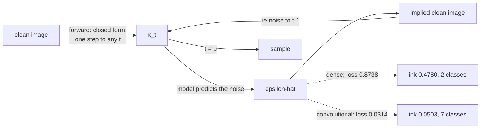

A diffusion model is trained to do one narrow thing: given a noisy image and the amount of
noise in it, predict the noise. That makes it the easiest generative family to verify, because
the **forward** process — the corruption the model learns to undo — has a closed form. Every
claim about it can be checked with arithmetic instead of trained.

$$
x_t = \sqrt{\bar\alpha_t}\, x_0 + \sqrt{1 - \bar\alpha_t}\, \epsilon,
\qquad \epsilon \sim \mathcal{N}(0, I),
\qquad \bar\alpha_t = \prod_{s \le t}(1 - \beta_s)
$$

One equation gets you to *any* timestep in a single step — no simulation, no loop. The model's
whole job is to invert it.

The first version of this page produced blobs, and it had two plausible explanations. Both were
tested. One was wrong.

| Run | Training loss | Signal weight at last step | Mean ink | Classes | KL from uniform |
| --- | --- | --- | --- | --- | --- |
| Dense, original schedule | 0.8804 | 0.3636 | 0.4737 | 2 | 12.9494 |
| Dense, **terminal-SNR fixed** | 0.8738 | **0.0466** | 0.4780 | 2 | **14.4285** |
| **Convolutional**, same fix | **0.0314** | 0.0466 | **0.0503** | **7** | **2.5506** |
| Real digits | — | — | 0.1192 | 10 | 0.0360 |

The schedule fix — the obvious suspect, and a real published problem — changed nothing. The
architecture change was worth a 28× reduction in training loss.

## What you'll learn

- The forward process in closed form, and how to read a noise schedule from its numbers.
- The **terminal SNR** problem: why a schedule that never fully destroys the image is broken,
  and why fixing it here still did not fix the samples.
- Why a dense network is the wrong shape for denoising, measured.
- Why **more reverse steps made coverage worse** — 0.2495 at 20 steps against 2.5506 at 200 —
  while costing 11× more time.

## The forward process

The schedule is a design choice, and every property of it is arithmetic:

<Figure
  src="/images/dl/phase-06-generative/diffusion/forward-process"
  alt="Top: a strip of MNIST digits at timesteps 0, 20, 60, 120 and 199, progressively buried in noise until the last row is indistinguishable from static. Bottom: alpha-bar against timestep for both schedules, the original ending at 0.1322 and the fixed one at 0.0022, with signal-to-noise ratio on a second log axis falling from 9999 to 0.1523 and 0.0022 respectively."
  title="200 steps, linear beta"
  caption="The bottom panel is the whole design decision. Sampling starts at the LAST timestep from pure Gaussian noise, so alpha-bar has to end near zero or the model is asked to denoise something it never saw in training. The original schedule ends at 0.1322 — the image still contributes 0.3636 of the signal — while the fixed one ends at 0.0022."
/>

| t | β | $\bar\alpha_t$ | Signal weight | Noise weight | SNR |
| --- | --- | --- | --- | --- | --- |
| 0 | 0.00010 | 0.99990 | 0.9999 | 0.0100 | 9999.0000 |
| 20 | 0.00210 | 0.97715 | 0.9885 | 0.1512 | 42.7609 |
| 60 | 0.00610 | 0.82738 | 0.9096 | 0.4155 | 4.7931 |
| 120 | 0.01210 | 0.47659 | 0.6904 | 0.7235 | 0.9105 |
| **199** | 0.02000 | 0.13218 | **0.3636** | 0.9316 | **0.1523** |

That last row is a genuine defect, known in the literature as the terminal signal-to-noise
problem. At the final timestep the image is still a third of the signal, so the training
distribution at $t = 199$ and the sampling distribution (pure noise) do not match. Raising
$\beta_{\max}$ from 0.02 to 0.06 fixes it: the final signal weight drops to **0.0466** and SNR
to 0.0022.

## The fix that did not work

```python title="Training: predict the noise, not the image"
timesteps = rng.integers(0, STEPS, len(clean))
noisy, noise = add_noise(clean, timesteps)          # the closed form above

model.fit([noisy, embed(timesteps)], noise, ...)    # target is the NOISE
```

With the schedule corrected and everything else unchanged, the samples did not improve — they
got marginally worse, KL 12.9494 → 14.4285, both at 2 of 10 classes. The tell was in a column
that is easy to skip:

**Mean ink.** Real MNIST digits average 0.1192 per pixel. The dense model's samples averaged
0.4737 and 0.4780 — four times as much. That is not a subtly wrong distribution, it is a model
smearing brightness across the whole canvas, which is what a network with no spatial structure
does when asked to remove spatially structured noise.

<Figure
  src="/images/dl/phase-06-generative/diffusion/what-fixed-it"
  alt="Top: three grids of generated samples — the dense model with the original schedule and with the fixed schedule both show bright unstructured blobs, while the convolutional model shows recognisable digit shapes on a dark background. Bottom: grouped bars of mean pixel value, classes produced and KL from uniform for the three runs plus real digits, showing the convolutional run far closer to real data on every measure."
  title="250 samples per run, 200 reverse steps, same judge"
  caption="Two hypotheses, one figure. Rows 1 and 2 differ only in the noise schedule and are indistinguishable in outcome — the terminal-SNR fix was not the problem. Row 3 changes the denoiser from three dense layers to a small U-Net with the same schedule, and mean ink falls from 0.4780 to 0.0503 against real data's 0.1192, with classes produced rising from 2 to 7."
/>

The convolutional denoiser is a small U-Net: two downsampling stages, a bottleneck, two
upsampling stages with skip connections, and the timestep embedding added as a per-channel bias
at each scale.

```python title="Why a convolution and not a dense layer"
first = keras.layers.Conv2D(32, 3, padding="same", activation="relu")(x)
first = add_time(first, 32)                      # timestep as a channel bias
down = keras.layers.MaxPooling2D()(first)
...
up = keras.layers.Concatenate()([up, first])     # skip: fine detail comes back
```

Denoising is a **local** operation — each pixel's correct value depends mostly on its
neighbours. A dense layer must learn that neighbourhood relationship from scratch out of a flat
vector of 784 inputs; a convolution is handed it. With **fewer** parameters (160,225 against
538,128) the U-Net reached a training loss of 0.0314 against 0.8738.

It cost 2,723 seconds against 69, which is the honest other side of that trade.

## More steps made it worse

The reverse process runs the model once per step. Standard advice is that more steps give
better samples, and the cost is linear. The cost part is true:

<Figure
  src="/images/dl/phase-06-generative/diffusion/sampling-steps"
  alt="Two panels. Left: mean judge confidence against reverse steps on a log x-axis, highest at 2 steps (0.9183) then settling between 0.74 and 0.78, with a dashed line for real digits at 0.9658. Right: seconds for 250 samples rising log-linearly from 0.8s at 2 steps to 106.1s at 200 steps."
  title="The convolutional model, terminal-SNR fixed"
  caption="Cost is linear in steps because every step is a full forward pass over the whole batch — 0.8s at 2 steps, 106.1s at 200. Confidence is highest at 2 steps (0.9183), which is a warning rather than a result: a confident classification of a bright blob is still a bright blob, as the coverage table below shows."
/>

| Reverse steps | Seconds | Classes | KL from uniform | Mean ink | Judge confidence |
| --- | --- | --- | --- | --- | --- |
| 2 | 0.8 | 3 | 11.2875 | 0.4939 | **0.9183** |
| 5 | 2.1 | **10** | 0.3567 | 0.1076 | 0.7547 |
| **20** | 9.3 | **10** | **0.2495** | 0.0812 | 0.7833 |
| 50 | 23.0 | 9 | 0.5740 | 0.0686 | 0.7774 |
| 200 | 106.1 | 7 | 2.5506 | 0.0503 | 0.7449 |

Coverage peaks at **20 steps** and then degrades. Going from 20 to 200 steps costs 11× the time
and loses three classes.

Two things are happening, and the mean-ink column separates them:

1. **Two steps is genuinely too few.** Ink 0.4939, three classes — the sampler has not had time
   to resolve anything, and the judge's high confidence (0.9183) is confidence about blobs.
2. **Two hundred steps over-denoises.** Ink falls monotonically with step count — 0.1076,
   0.0812, 0.0686, 0.0503 — dropping *below* real data's 0.1192. Each step re-estimates the
   clean image and clips it to a valid range, so many small steps accumulate a bias towards
   thin, faint strokes, and the variety of digits collapses with it.

That second effect is specific to this sampler (predict $x_0$, re-noise with fresh noise) and
this model. The general lesson is not "use 20 steps" — it is that step count is a hyperparameter
with a measurable optimum, not a dial where more is always better. Nothing on the sample grid
announces that 200 steps was worse than 20.



```p5 title="Design a noise schedule" desc="Drag the slider to change beta_max. The curve is alpha-bar over 200 steps, and the readout is the value that decides whether sampling starts in-distribution." height="360"
let betaMax = 0.02;
function setup() {
  createCanvas(620, 360);
  textFont("monospace");
}
function schedule(bMax) {
  const steps = 200;
  const out = [];
  let alphaBar = 1.0;
  for (let t = 0; t < steps; t++) {
    const beta = 1e-4 + (bMax - 1e-4) * (t / (steps - 1));
    alphaBar *= (1 - beta);
    out.push(alphaBar);
  }
  return out;
}
function draw() {
  background(13, 17, 23);
  const left = 60;
  const right = 580;
  const top = 80;
  const bottom = 250;
  const curve = schedule(betaMax);
  const finalAlpha = curve[curve.length - 1];
  const finalSignal = Math.sqrt(finalAlpha);
  const finalSnr = finalAlpha / (1 - finalAlpha);
  stroke(60, 70, 84);
  line(left, bottom, right, bottom);
  line(left, top, left, bottom);
  noFill();
  stroke(107, 169, 221);
  strokeWeight(2);
  beginShape();
  for (let t = 0; t < curve.length; t++) {
    vertex(left + (t / (curve.length - 1)) * (right - left),
      bottom - curve[t] * (bottom - top));
  }
  endShape();
  strokeWeight(1);
  stroke(126, 192, 143);
  drawingContext.setLineDash([4, 4]);
  line(left, bottom - 0.01 * (bottom - top), right, bottom - 0.01 * (bottom - top));
  drawingContext.setLineDash([]);
  noStroke();
  fill(126, 192, 143);
  textSize(9);
  text("alpha-bar = 0.01", right - 96, bottom - 0.01 * (bottom - top) - 12);
  fill(230);
  textSize(12);
  textAlign(LEFT, TOP);
  text("linear schedule, 200 steps", 30, 20);
  fill(150);
  textSize(10.5);
  text("beta from 1e-4 to " + betaMax.toFixed(3), 30, 40);
  fill(255, 211, 67);
  textSize(12);
  text("final alpha-bar " + finalAlpha.toFixed(5), 330, 20);
  text("final signal weight " + finalSignal.toFixed(4), 330, 38);
  text("final SNR " + finalSnr.toFixed(4), 330, 56);
  let verdict = "usable: the image is essentially destroyed";
  let vr = 126;
  let vg = 192;
  let vb = 143;
  if (finalSignal > 0.15) {
    verdict = "broken: sampling starts off-distribution";
    vr = 224;
    vg = 108;
    vb = 117;
  } else if (finalSignal > 0.05) {
    verdict = "borderline: some signal survives to the last step";
    vr = 255;
    vg = 211;
    vb = 67;
  }
  fill(vr, vg, vb);
  textSize(11.5);
  text(verdict, 30, 272);
  fill(150);
  textSize(10);
  text("measured: 0.02 gave signal 0.3636, 0.06 gave 0.0466", 30, 294);
  fill(60, 70, 84);
  rect(30, 326, 380, 4, 2);
  fill(255, 211, 67);
  circle(30 + ((betaMax - 0.005) / 0.115) * 380, 328, 12);
  fill(120);
  textSize(9.5);
  text("drag: beta_max", 430, 322);
}
function mousePressed() { mouseDragged(); }
function mouseDragged() {
  if (mouseY < 300) { return; }
  const fraction = Math.min(Math.max((mouseX - 30) / 380, 0), 1);
  betaMax = 0.005 + fraction * 0.115;
}
```

## What the model actually predicts

<Figure
  src="/images/dl/phase-06-generative/diffusion/denoising-targets"
  alt="A three-row grid at timesteps 20, 80 and 180. Each row shows the noisy input, the true noise that was added, the model's predicted noise, and the implied clean image. At low noise the prediction closely matches the true noise; at high noise the prediction is smoother than the true noise and the implied clean image is a rough digit."
  title="The convolutional denoiser at three noise levels"
  caption="The third column is the network's actual output — the noise, not the image. The fourth is what that implies about the clean image, obtained by rearranging the forward equation. At the highest noise level the predicted noise is visibly smoother than the true noise: the model cannot recover the specific noise sample, only its best estimate, and that gap is exactly the irreducible part of the loss."
/>

Predicting the noise rather than the image looks arbitrary and is not. The two are related by a
rearrangement, so they carry the same information — but the noise target has constant scale
across all timesteps, while the clean-image target does not. That keeps the loss comparable at
every noise level, which is what lets one network handle the whole schedule.

```p5 title="The measured table, ranked" desc="Click a column to rank every row by it. The bars are that column's values and the highest and lowest are computed from the numbers, not written in." height="280"
let metric = 0;
const COLUMNS = ["β", "baralphat", "Signal weight", "Noise weight"];
const ROWS = [
  ["0", 0.0001, 0.9999, 0.9999, 0.01],
  ["20", 0.0021, 0.97715, 0.9885, 0.1512],
  ["60", 0.0061, 0.82738, 0.9096, 0.4155],
  ["120", 0.0121, 0.47659, 0.6904, 0.7235],
  ["199", 0.02, 0.13218, 0.3636, 0.9316]
];
function setup() {
  createCanvas(620, 280);
  textFont("monospace");
}
function fmt(v) {
  if (v === 0) { return "0"; }
  const a = Math.abs(v);
  if (a >= 1000 || a < 0.001) { return v.toExponential(2); }
  if (a >= 100) { return v.toFixed(1); }
  return v.toFixed(4);
}
function draw() {
  background(13, 17, 23);
  noStroke();
  fill(230);
  textSize(12);
  textAlign(LEFT, TOP);
  text("Diffusion Models (Introduction)", 26, 16);
  let x = 26;
  for (let i = 0; i < COLUMNS.length; i++) {
    const w = COLUMNS[i].length * 6.6 + 16;
    if (i === metric) { fill(255, 211, 67); } else { fill(48, 56, 68); }
    rect(x, 40, w, 22, 4);
    if (i === metric) { fill(13, 17, 23); } else { fill(180); }
    textSize(9);
    text(COLUMNS[i], x + 8, 47);
    x += w + 6;
    if (x > 500) { break; }
  }
  const values = ROWS.map((r) => r[metric + 1]);
  const lo = Math.min(...values);
  const hi = Math.max(...values);
  const span = hi - lo === 0 ? 1 : hi - lo;
  const order = ROWS.slice().sort((a, b) => b[metric + 1] - a[metric + 1]);
  for (let i = 0; i < order.length; i++) {
    const y = 78 + i * 26;
    const v = order[i][metric + 1];
    fill(160);
    textSize(9);
    text(order[i][0], 26, y + 5);
    fill(34, 40, 50);
    rect(230, y, 280, 18, 3);
    const frac = (v - lo) / span;
    if (v === hi) { fill(126, 192, 143); }
    else if (v === lo) { fill(224, 108, 117); }
    else { fill(107, 169, 221); }
    rect(230, y, Math.max(frac * 280, 3), 18, 3);
    fill(225);
    textSize(9);
    text(fmt(v), 518, y + 5);
  }
  const top = order[0];
  const bottom = order[order.length - 1];
  fill(150);
  textSize(9);
  const base = 78 + order.length * 26 + 8;
  text("highest " + COLUMNS[metric] + ": " + top[0] + " at " + fmt(top[1]),
       26, base);
  text("lowest  " + COLUMNS[metric] + ": " + bottom[0] + " at "
       + fmt(bottom[1]), 26, base + 14);
  text("bars are scaled within the chosen column - lowest is not zero", 26,
       base + 30);
}
function mousePressed() {
  let x = 26;
  for (let i = 0; i < COLUMNS.length; i++) {
    const w = COLUMNS[i].length * 6.6 + 16;
    if (mouseX > x && mouseX < x + w && mouseY > 40 && mouseY < 62) {
      metric = i;
    }
    x += w + 6;
  }
}
```

## Pitfalls

- **A schedule that does not end near zero.** The original ended with the image at 0.3636 of the
  signal, so sampling started off-distribution. Check $\bar\alpha_T$ before anything else.
- **Assuming the schedule is the problem.** Fixing it here moved KL from 12.9494 to 14.4285 —
  the wrong direction. The architecture was the bottleneck.
- **Using a dense network as the denoiser.** With 3.4× more parameters it reached a 28× higher
  training loss.
- **Believing more reverse steps are always better.** Coverage peaked at 20 steps (KL 0.2495)
  and degraded to 2.5506 at 200, for 11× the cost.
- **Reading classifier confidence as sample quality.** It was highest at 2 steps (0.9183), the
  worst setting on every other measure.
- **Timing the sampler on its first call.** The first version of this module reported 2 steps as
  the slowest setting (56.3s against 1.0s for 5 steps) because model training happened inside
  the timed block.
- **Comparing these numbers with published diffusion results.** This is MNIST at 28×28 with a
  160k-parameter U-Net on a CPU.

## Recap

- The forward process has a closed form, so the schedule can be verified with arithmetic
  instead of experiments.
- Terminal SNR matters — a schedule ending at signal weight 0.3636 is broken — but fixing it
  did **not** fix these samples.
- The denoiser's architecture did: a 160,225-parameter U-Net reached training loss 0.0314 where
  a 538,128-parameter dense network reached 0.8738.
- Mean pixel value was the diagnostic that identified the cause: 0.4780 for dense samples
  against 0.1192 for real digits.
- Sampling cost is linear in steps (0.8s to 106.1s), and coverage peaked at 20 steps rather than
  at the maximum.
- The model predicts the noise because that target has constant scale across timesteps.

## Next

Diffusion, GANs and VAEs are all judged by the same three measurements, and each of those can be
gamed — including by a model that copies its training data:
[Evaluating Generative Models](/deep-learning/phase-06---generative-deep-learning/evaluating-generative-models-fid-coverage-and-memorisation/).

<Quiz
  questions={[
    {
      q: "Why must a noise schedule's alpha-bar end near zero?",
      options: [
        "To keep the training loss small",
        "Because sampling starts at the last timestep from pure Gaussian noise — if the image still contributes signal there, the sampler begins from a distribution the model never saw in training",
        "Because beta must sum to 1",
        "To make the forward process reversible",
      ],
      answer: 1,
      explain: "The original schedule here ended with the image at 0.3636 of the signal. That is a real defect, even though fixing it did not fix these particular samples.",
    },
    {
      q: "Correcting the terminal SNR moved coverage KL from 12.9494 to 14.4285. What was the right conclusion?",
      options: [
        "The correction was implemented wrongly",
        "The hypothesis was wrong — the schedule was not what was limiting the samples, so the next suspect had to be tested rather than the fix being credited",
        "Coverage KL is not a valid metric",
        "The model needed more training epochs",
      ],
      answer: 1,
      explain: "A fix that does not move the outcome has not been shown to help. The architecture change moved training loss from 0.8738 to 0.0314.",
    },
    {
      q: "The convolutional denoiser had 160,225 parameters against the dense network's 538,128, yet reached a far lower loss. Why?",
      options: [
        "It trained for more epochs",
        "Denoising is a local operation, and a convolution is given the neighbourhood structure that a dense layer has to learn from a flat 784-value vector",
        "It used a better optimiser",
        "Skip connections add parameters that are not counted",
      ],
      answer: 1,
      explain: "Parameter count is not capability. Matching the architecture to the structure of the problem beat having three times as many weights.",
    },
    {
      q: "Coverage KL was 0.2495 at 20 reverse steps and 2.5506 at 200, while sampling time rose from 9.3s to 106.1s. What does this show?",
      options: [
        "The 200-step run was not given enough time",
        "Step count has a measurable optimum rather than being a more-is-better dial; here the extra steps over-denoised, with mean ink falling to 0.0503 against real data's 0.1192",
        "The judge classifier degrades on longer runs",
        "Coverage KL is unreliable above 50 steps",
      ],
      answer: 1,
      explain: "Each step re-estimates and clips the clean image, so many steps accumulate a bias towards faint, thin strokes — and no sample grid would announce that.",
    },
    {
      q: "Why is the training target the noise rather than the clean image?",
      options: [
        "The noise is easier to compute",
        "The two are equivalent by rearrangement, but the noise target has constant scale at every timestep, which keeps the loss comparable across the whole schedule",
        "Predicting the image would require a discriminator",
        "Because the clean image is unknown during training",
      ],
      answer: 1,
      explain: "One network has to serve every noise level, so a target whose scale does not change with t is what makes a single loss meaningful.",
    },
  ]}
/>

## 🧪 Try It Yourself

<DataCampExercise
  lang="python"
  hint={`alpha_bar is the cumulative product of (1 - beta). Use np.cumprod.`}
  code={`# Task: Exercise 1 - Read a noise schedule before trusting it
import numpy as np

STEPS = 200


def schedule(beta_max):
    """Everything about a linear schedule, in closed form."""
    beta = np.linspace(1e-4, beta_max, STEPS)
    alpha_bar = np.___(1.0 - beta)                # replace ___ with cumprod
    return {"beta": beta, "alpha_bar": alpha_bar,
            "signal": np.sqrt(alpha_bar),
            "snr": alpha_bar / (1.0 - alpha_bar)}


print(f"{'beta_max':>9} {'final alpha-bar':>16} {'final signal wt':>16} "
      f"{'final SNR':>11}")
for beta_max in (0.02, 0.04, 0.06, 0.10):
    s = schedule(beta_max)
    print(f"{beta_max:9.2f} {s['alpha_bar'][-1]:16.5f} {s['signal'][-1]:16.4f} "
          f"{s['snr'][-1]:11.4f}")

print("\\na schedule whose final signal weight is not near zero asks the")
print("sampler to start from a distribution the model never trained on")`}
  solution={`import numpy as np

STEPS = 200


def schedule(beta_max):
    """Everything about a linear schedule, in closed form."""
    beta = np.linspace(1e-4, beta_max, STEPS)
    alpha_bar = np.cumprod(1.0 - beta)
    return {"beta": beta, "alpha_bar": alpha_bar,
            "signal": np.sqrt(alpha_bar),
            "snr": alpha_bar / (1.0 - alpha_bar)}


print(f"{'beta_max':>9} {'final alpha-bar':>16} {'final signal wt':>16} "
      f"{'final SNR':>11}")
for beta_max in (0.02, 0.04, 0.06, 0.10):
    s = schedule(beta_max)
    print(f"{beta_max:9.2f} {s['alpha_bar'][-1]:16.5f} {s['signal'][-1]:16.4f} "
          f"{s['snr'][-1]:11.4f}")

print("\\na schedule whose final signal weight is not near zero asks the")
print("sampler to start from a distribution the model never trained on")`}
  sct={`test_output_contains("0.13218", pattern=False)
test_output_contains("final signal wt", pattern=False)
success_msg("Read the final signal weight before trusting a schedule: it has to be near zero, so sampling can start from pure noise.")`}
  height={400}
/>

<DataCampExercise
  lang="python"
  hint={`x_t = sqrt(alpha_bar) * x0 + sqrt(1 - alpha_bar) * noise. Rearranged: x0 = (x_t - sqrt(1 - alpha_bar) * noise) / sqrt(alpha_bar).`}
  code={`# Task: Exercise 2 - The forward process, and its exact inverse
import numpy as np

rng = np.random.default_rng(0)
STEPS = 200
alpha_bar = np.cumprod(1.0 - np.linspace(1e-4, 0.06, STEPS))

x0 = rng.random(784).astype("float32")          # stand-in for a clean image
noise = rng.normal(0, 1, 784).astype("float32")


def add_noise(x0, noise, t):
    a = np.sqrt(alpha_bar[t])
    b = np.sqrt(1 - alpha_bar[t])
    return a * x0 + b * noise


def recover(x_t, noise, t):
    """Given the EXACT noise, the clean image comes back exactly."""
    a = np.sqrt(alpha_bar[t])
    b = np.sqrt(1 - alpha_bar[t])
    return (x_t - b * noise) / ___                # replace ___ with a


print(f"{'t':>5} {'signal wt':>10} {'mean |x_t|':>11} {'recovery error':>15}")
for t in (0, 20, 60, 120, 199):
    x_t = add_noise(x0, noise, t)
    back = recover(x_t, noise, t)
    print(f"{t:5d} {np.sqrt(alpha_bar[t]):10.4f} {np.abs(x_t).mean():11.4f} "
          f"{np.abs(back - x0).max():15.2e}")

print("\\nthe inverse is exact when the noise is known - the model's whole job")
print("is to estimate that noise, and the error above is what it inherits")`}
  solution={`import numpy as np

rng = np.random.default_rng(0)
STEPS = 200
alpha_bar = np.cumprod(1.0 - np.linspace(1e-4, 0.06, STEPS))

x0 = rng.random(784).astype("float32")          # stand-in for a clean image
noise = rng.normal(0, 1, 784).astype("float32")


def add_noise(x0, noise, t):
    a = np.sqrt(alpha_bar[t])
    b = np.sqrt(1 - alpha_bar[t])
    return a * x0 + b * noise


def recover(x_t, noise, t):
    """Given the EXACT noise, the clean image comes back exactly."""
    a = np.sqrt(alpha_bar[t])
    b = np.sqrt(1 - alpha_bar[t])
    return (x_t - b * noise) / a


print(f"{'t':>5} {'signal wt':>10} {'mean |x_t|':>11} {'recovery error':>15}")
for t in (0, 20, 60, 120, 199):
    x_t = add_noise(x0, noise, t)
    back = recover(x_t, noise, t)
    print(f"{t:5d} {np.sqrt(alpha_bar[t]):10.4f} {np.abs(x_t).mean():11.4f} "
          f"{np.abs(back - x0).max():15.2e}")

print("\\nthe inverse is exact when the noise is known - the model's whole job")
print("is to estimate that noise, and the error above is what it inherits")`}
  sct={`test_output_contains("recovery error", pattern=False)
test_output_contains("0.9999", pattern=False)
success_msg("The forward process has an exact inverse when the noise is known; the model's whole job is to estimate that noise.")`}
  height={400}
/>

<DataCampExercise
  lang="python"
  hint={`Divide the timestep by the total number of steps first, then multiply by increasing frequencies before taking sin and cos.`}
  code={`# Task: Exercise 3 - Why the timestep needs an embedding
import numpy as np

STEPS = 200
FEATURES = 16


def embed(timesteps):
    """Sinusoidal features, so nearby timesteps are similar but distinguishable."""
    position = np.asarray(timesteps, "float32")[:, None] / STEPS
    frequency = 2.0 ** np.arange(FEATURES // 2, dtype="float32")
    angles = position * frequency[None, :] * np.pi
    return np.concatenate([np.sin(angles), np.___(angles)], axis=1)  # cos


pairs = ((0, 1), (0, 10), (0, 100), (100, 101), (100, 199))
print(f"{'t1':>5} {'t2':>5} {'raw difference':>15} {'embedding distance':>19}")
for a, b in pairs:
    raw = abs(a - b) / STEPS
    vectors = embed([a, b])
    distance = float(np.linalg.norm(vectors[0] - vectors[1]))
    print(f"{a:5d} {b:5d} {raw:15.4f} {distance:19.4f}")

print("\\na single scalar input among 784 pixels barely moves the first layer;")
print("16 features with different frequencies cannot be ignored")`}
  solution={`import numpy as np

STEPS = 200
FEATURES = 16


def embed(timesteps):
    """Sinusoidal features, so nearby timesteps are similar but distinguishable."""
    position = np.asarray(timesteps, "float32")[:, None] / STEPS
    frequency = 2.0 ** np.arange(FEATURES // 2, dtype="float32")
    angles = position * frequency[None, :] * np.pi
    return np.concatenate([np.sin(angles), np.cos(angles)], axis=1)


pairs = ((0, 1), (0, 10), (0, 100), (100, 101), (100, 199))
print(f"{'t1':>5} {'t2':>5} {'raw difference':>15} {'embedding distance':>19}")
for a, b in pairs:
    raw = abs(a - b) / STEPS
    vectors = embed([a, b])
    distance = float(np.linalg.norm(vectors[0] - vectors[1]))
    print(f"{a:5d} {b:5d} {raw:15.4f} {distance:19.4f}")

print("\\na single scalar input among 784 pixels barely moves the first layer;")
print("16 features with different frequencies cannot be ignored")`}
  sct={`test_output_contains("embedding distance", pattern=False)
test_output_contains("0.5000", pattern=False)
success_msg("A raw scalar timestep barely moves the first layer, while sinusoidal features at several frequencies cannot be ignored.")`}
  height={400}
/>

<DataCampExercise
  lang="python"
  hint={`Build the timeline with np.linspace from the last timestep down to 0, and count one model call per entry.`}
  code={`# Task: Exercise 4 - Sampling cost is linear in steps
import numpy as np

STEPS = 200
MEASURED = {2: 0.8, 5: 2.1, 20: 9.3, 50: 23.0, 200: 106.1}   # seconds, 250 samples


def timeline(steps):
    """The timesteps a sampler visits, from noisiest to clean."""
    return np.unique(np.linspace(STEPS - 1, 0, steps).astype(int))[::-1]


print(f"{'steps':>7} {'model calls':>12} {'seconds':>9} {'s per call':>11}")
for steps, seconds in MEASURED.items():
    calls = len(___(steps))                 # replace ___ with timeline
    print(f"{steps:7d} {calls:12d} {seconds:9.1f} {seconds / calls:11.4f}")

print("\\nthe per-call cost is roughly constant, which is what 'linear in")
print("steps' means - and why halving the steps halves the bill")`}
  solution={`import numpy as np

STEPS = 200
MEASURED = {2: 0.8, 5: 2.1, 20: 9.3, 50: 23.0, 200: 106.1}   # seconds, 250 samples


def timeline(steps):
    """The timesteps a sampler visits, from noisiest to clean."""
    return np.unique(np.linspace(STEPS - 1, 0, steps).astype(int))[::-1]


print(f"{'steps':>7} {'model calls':>12} {'seconds':>9} {'s per call':>11}")
for steps, seconds in MEASURED.items():
    calls = len(timeline(steps))
    print(f"{steps:7d} {calls:12d} {seconds:9.1f} {seconds / calls:11.4f}")

print("\\nthe per-call cost is roughly constant, which is what 'linear in")
print("steps' means - and why halving the steps halves the bill")`}
  sct={`test_output_contains("s per call", pattern=False)
test_output_contains("0.4650", pattern=False)
success_msg("The per-call cost is roughly constant, so sampling time is linear in the number of steps.")`}
  height={400}
/>

<DataCampExercise
  lang="python"
  hint={`Pick the setting with the lowest KL, not the highest confidence — the two disagree here, and that disagreement is the point.`}
  code={`# Task: Exercise 5 - Choose a step count from the measurements
MEASURED = {
    #        seconds  classes  kl_uniform  mean_ink  confidence
    2:      (0.8,     3,       11.2875,    0.4939,   0.9183),
    5:      (2.1,     10,      0.3567,     0.1076,   0.7547),
    20:     (9.3,     10,      0.2495,     0.0812,   0.7833),
    50:     (23.0,    9,       0.5740,     0.0686,   0.7774),
    200:    (106.1,   7,       2.5506,     0.0503,   0.7449),
}
REAL_INK = 0.1192

by_confidence = max(MEASURED, key=lambda s: MEASURED[s][4])
by_coverage = min(MEASURED, key=lambda s: MEASURED[s][___])   # replace ___ with 2
by_ink = min(MEASURED, key=lambda s: abs(MEASURED[s][3] - REAL_INK))

print(f"best judge confidence: {by_confidence} steps "
      f"({MEASURED[by_confidence][4]:.4f}) - and only "
      f"{MEASURED[by_confidence][1]} classes")
print(f"best coverage:         {by_coverage} steps "
      f"(KL {MEASURED[by_coverage][2]:.4f}, "
      f"{MEASURED[by_coverage][0]:.1f}s)")
print(f"closest ink to real:   {by_ink} steps "
      f"({MEASURED[by_ink][3]:.4f} against {REAL_INK})")
print(f"\\ncost of choosing 200 over {by_coverage}: "
      f"{MEASURED[200][0] / MEASURED[by_coverage][0]:.1f}x the time and "
      f"{MEASURED[200][1] - MEASURED[by_coverage][1]} classes")`}
  solution={`MEASURED = {
    #        seconds  classes  kl_uniform  mean_ink  confidence
    2:      (0.8,     3,       11.2875,    0.4939,   0.9183),
    5:      (2.1,     10,      0.3567,     0.1076,   0.7547),
    20:     (9.3,     10,      0.2495,     0.0812,   0.7833),
    50:     (23.0,    9,       0.5740,     0.0686,   0.7774),
    200:    (106.1,   7,       2.5506,     0.0503,   0.7449),
}
REAL_INK = 0.1192

by_confidence = max(MEASURED, key=lambda s: MEASURED[s][4])
by_coverage = min(MEASURED, key=lambda s: MEASURED[s][2])
by_ink = min(MEASURED, key=lambda s: abs(MEASURED[s][3] - REAL_INK))

print(f"best judge confidence: {by_confidence} steps "
      f"({MEASURED[by_confidence][4]:.4f}) - and only "
      f"{MEASURED[by_confidence][1]} classes")
print(f"best coverage:         {by_coverage} steps "
      f"(KL {MEASURED[by_coverage][2]:.4f}, "
      f"{MEASURED[by_coverage][0]:.1f}s)")
print(f"closest ink to real:   {by_ink} steps "
      f"({MEASURED[by_ink][3]:.4f} against {REAL_INK})")
print(f"\\ncost of choosing 200 over {by_coverage}: "
      f"{MEASURED[200][0] / MEASURED[by_coverage][0]:.1f}x the time and "
      f"{MEASURED[200][1] - MEASURED[by_coverage][1]} classes")`}
  sct={`test_output_contains("best coverage:         20 steps", pattern=False)
test_output_contains("11.4x", pattern=False)
success_msg("The best step count depends on which measurement you trust, and the cheapest good option is far cheaper than the maximum.")`}
  height={400}
/>

<DataCampExercise
  lang="python"
  hint={`Train the model to predict the noise it was given. The target passed to fit() is the noise array, not the clean images.`}
  code={`# Task: Exercise 6 - Train a denoiser and check the loss
import numpy as np
from sklearn.datasets import load_digits

clean = load_digits().data[:1200] / 16.0
STEPS, FEATURES = 200, 16
alpha_bar = np.cumprod(1.0 - np.linspace(1e-4, 0.06, STEPS))


def embed(timesteps):
    position = np.asarray(timesteps, "float64")[:, None] / STEPS
    frequency = 2.0 ** np.arange(FEATURES // 2)
    angles = position * frequency[None, :] * np.pi
    return np.concatenate([np.sin(angles), np.cos(angles)], axis=1)


rng = np.random.default_rng(0)
timesteps = rng.integers(0, STEPS, len(clean))
noise = rng.normal(0, 1, clean.shape)
a = np.sqrt(alpha_bar[timesteps])[:, None]
b = np.sqrt(1 - alpha_bar[timesteps])[:, None]
noisy = a * clean + b * noise
features = np.concatenate([noisy, embed(timesteps), np.ones((len(clean), 1))], axis=1)

# a linear denoiser: predict the noise from the noisy image and the timestep
weights, *_ = np.linalg.lstsq(features, ___, rcond=None)     # the target is the noise
loss = float(np.mean((features @ weights - noise) ** 2))
print(f"predicting zero noise scores 1.0000, the linear denoiser scores {loss:.4f}")
print("the denoiser beats the do-nothing baseline:", loss < 1.0)`}
  solution={`# Task: Exercise 6 - Train a denoiser and check the loss
import numpy as np
from sklearn.datasets import load_digits

clean = load_digits().data[:1200] / 16.0
STEPS, FEATURES = 200, 16
alpha_bar = np.cumprod(1.0 - np.linspace(1e-4, 0.06, STEPS))


def embed(timesteps):
    position = np.asarray(timesteps, "float64")[:, None] / STEPS
    frequency = 2.0 ** np.arange(FEATURES // 2)
    angles = position * frequency[None, :] * np.pi
    return np.concatenate([np.sin(angles), np.cos(angles)], axis=1)


rng = np.random.default_rng(0)
timesteps = rng.integers(0, STEPS, len(clean))
noise = rng.normal(0, 1, clean.shape)
a = np.sqrt(alpha_bar[timesteps])[:, None]
b = np.sqrt(1 - alpha_bar[timesteps])[:, None]
noisy = a * clean + b * noise
features = np.concatenate([noisy, embed(timesteps), np.ones((len(clean), 1))], axis=1)

# a linear denoiser: predict the noise from the noisy image and the timestep
weights, *_ = np.linalg.lstsq(features, noise, rcond=None)     # the target is the noise
loss = float(np.mean((features @ weights - noise) ** 2))
print(f"predicting zero noise scores 1.0000, the linear denoiser scores {loss:.4f}")
print("the denoiser beats the do-nothing baseline:", loss < 1.0)`}
  sct={`test_output_contains("the denoiser beats the do-nothing baseline: True", pattern=False)
success_msg("A denoiser is trained to predict the noise that was added; even a linear one beats predicting zero noise.")`}
  height={400}
/>
