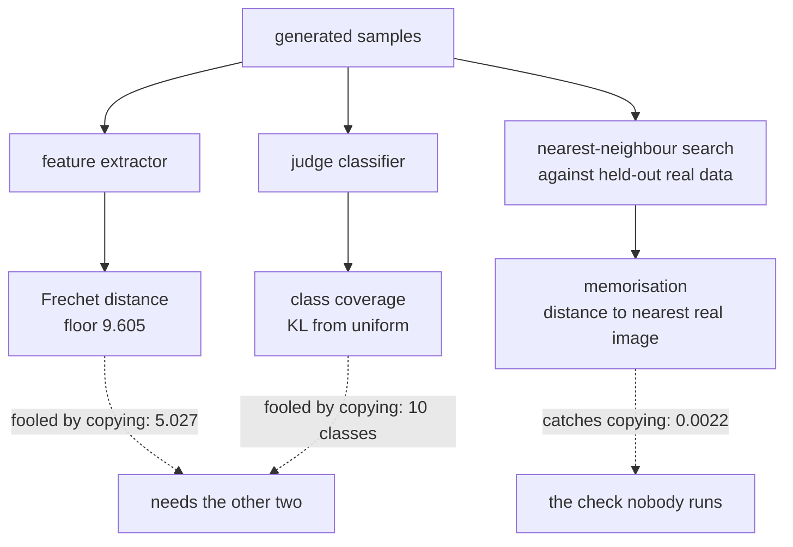

import DataCampExercise from "../../../../components/DataCampExercise.astro";
import Figure from "../../../../components/Figure.astro";
import Quiz from "../../../../components/Quiz.astro";

The [GAN page](/deep-learning/phase-06---generative-deep-learning/generative-adversarial-networks-gans/)
needed an outside measurement to notice that eight of ten digit classes were missing, because
no GAN loss can tell you that. This page builds the three measurements that generative work
actually relies on, and then breaks each one on purpose — because a metric you cannot fool is
a metric you have not tested.

The headline result is the second row from the bottom of this table. A "model" that simply
repeats 200 real training images scores **better than genuinely held-out real data** on the
Fréchet distance:

| Sample source | Fréchet distance | Classes | KL from uniform | Judge confidence | Distance to nearest real image |
| --- | --- | --- | --- | --- | --- |
| Real, held out | 9.605 | 10 | 0.0034 | 0.9942 | 5.3286 |
| Blurred 5×5 | 25.142 | 10 | 0.0090 | 0.9248 | 4.7352 |
| Noise added | 37.717 | 10 | 0.2097 | 0.8802 | 5.0685 |
| Only 5 of 10 classes | 27.245 | **5** | **1.2223** | 0.9783 | 0.0024 |
| **200 images repeated** | **5.027** | 10 | 0.0430 | 0.9886 | **0.0022** |
| Pure noise | 643.959 | 3 | 11.1625 | 0.8239 | 15.1119 |

Read that row carefully: near-perfect distribution match, full class coverage, high classifier
confidence — and it generated nothing. Only the last column notices.

## What you'll learn

- What the Fréchet distance actually computes, and why its floor is **9.605** here rather
  than zero.
- Why every FID number is meaningless without naming its feature extractor.
- **Coverage**, and why it catches the dropped-class failure (KL 1.2223) that the Fréchet
  distance ranks about the same as a blur.
- A **memorisation** check, and why the other two metrics cannot replace it.
- How the VAE and GAN from the previous pages score when all three are applied at once.

## The Fréchet distance

FID fits one multivariate Gaussian to the real features and one to the generated features, then
measures the distance between those two Gaussians in closed form:

$$
d^2 = \lVert \mu_r - \mu_g \rVert^2
+ \operatorname{tr}\!\left(\Sigma_r + \Sigma_g - 2\left(\Sigma_r \Sigma_g\right)^{1/2}\right)
$$

The first term compares the average feature; the second compares how features co-vary. In one
dimension it collapses to something you can check by hand — $(\mu_r - \mu_g)^2 + (\sigma_r -
\sigma_g)^2$ — which is exactly what the sketch below does.

```python title="The Frechet distance between two feature sets"
from scipy import linalg

features_real = extractor.predict(real_images)
features_fake = extractor.predict(generated_images)

mu_r, mu_g = features_real.mean(axis=0), features_fake.mean(axis=0)
cov_r = np.cov(features_real, rowvar=False)
cov_g = np.cov(features_fake, rowvar=False)

covmean, _ = linalg.sqrtm(cov_r @ cov_g, disp=False)
if np.iscomplexobj(covmean):          # sqrtm returns complex from rounding
    covmean = covmean.real

distance = ((mu_r - mu_g) ** 2).sum() + np.trace(cov_r + cov_g - 2 * covmean)
```

Two details matter more than the formula.

**The features are the metric.** Published FID numbers use a specific Inception network trained
on ImageNet. There is no such cached model on this machine, so these features come from a
classifier trained here on the same data, reaching **0.9477** validation accuracy. That is a
legitimate Fréchet distance in *this* feature space, and it is **not comparable** with any
published FID. Neither are two published numbers from different extractors.

**There is a floor, and it is not zero.** Two disjoint samples of real MNIST score **9.605**,
because 2,000 samples cannot estimate a 64-dimensional covariance exactly. A model scoring
9.605 has matched the data as well as the data matches itself. Reporting a distance without
that reference makes any number unreadable.

## Each metric, deliberately broken

<Figure
  src="/images/dl/phase-06-generative/generative-evaluation/metric-behaviour"
  alt="Two panels of horizontal bars for six sample sources. Left: Frechet distance on a log axis — real held-out 9.605, 200 images repeated 5.027, blurred 25.142, five-of-ten-classes 27.245, noise added 37.717, pure noise 643.959. Right: KL from uniform class coverage — near zero for most rows, 1.2223 for the five-class row and 11.1625 for pure noise."
  title="2,000 samples per source, same feature extractor throughout"
  caption="The two panels disagree about which failure is worse, which is the point. The Frechet distance ranks 'only 5 of 10 classes' (27.245) as barely worse than a 5x5 blur (25.142), while coverage separates them by two orders of magnitude — 1.2223 against 0.0090. And the repeated-images row beats real held-out data on the left panel (5.027 against 9.605) while looking perfect on the right."
/>

Working through the rows:

- **Blur** damages every feature a little. The Fréchet distance rises to 25.142 and coverage
  barely moves (0.0090) — a blurred `7` is still classified as a `7`.
- **Added noise** scores *worse* than blur on the Fréchet distance (37.717) and starts to
  disturb coverage (0.2097).
- **Dropping five classes** is the failure GANs actually exhibit. Coverage catches it
  immediately (5 classes, KL 1.2223). The Fréchet distance registers 27.245, which on its own
  would read like a mild quality problem rather than half the dataset missing.
- **Repeating 200 real images** is the adversarial case. Every image is real, so the feature
  statistics are close to correct — 5.027, *below* the held-out floor. Coverage is fine, 10
  classes. Judge confidence is 0.9886.
- **Pure noise** is the sanity check every metric must pass: 643.959, and 3 classes at KL
  11.1625.

Note the confidence column across all of it. The five-class row scores **0.9783**, higher than
real held-out data's own blurred version — because a classifier is confident about the classes
that *are* present and is never asked about the ones that are not. Confidence measures
sharpness, never diversity.

## Coverage

Coverage needs a labeller, not a distance. Classify every sample, then compare the resulting
class distribution against the one you wanted:

$$
D_{\mathrm{KL}}(u \,\|\, p) = \sum_{c} u_c \log \frac{u_c}{p_c},
\qquad u_c = \tfrac{1}{10}
$$

The direction matters, and it is measurable. With uniform $u$ on the left, any class the model
*never* produces sends the term to infinity — so the shares are clipped away from zero, and a
missing class becomes a large finite penalty. Reverse the arguments and the metric **saturates**:

| Class distribution | $D_{\mathrm{KL}}(u \,\|\, p)$ | $D_{\mathrm{KL}}(p \,\|\, u)$ |
| --- | --- | --- |
| Near-uniform | 0.0015 | 0.0015 |
| Five classes, evenly | **8.8638** | 0.6931 = $\log 2$ |
| One class only | **16.3484** | 2.3026 = $\log 10$ |

The reversed direction cannot exceed $\log 10 = 2.3026$ no matter how badly the model collapses,
because a distribution concentrated on one class is perfectly "explained" by itself. The correct
direction grows without bound as classes disappear, which is exactly the behaviour coverage
needs.



## Memorisation

The third measurement is the cheapest and the most often skipped: for each generated sample,
find the nearest real image in a **held-out** split and report the distance.

```python title="Memorisation, in one distance matrix"
squared = (np.sum(samples ** 2, axis=1)[:, None]
           + np.sum(reference ** 2, axis=1)[None, :]
           - 2 * samples @ reference.T)
nearest = np.argmin(squared, axis=1)
distance = np.sqrt(np.maximum(squared[np.arange(len(samples)), nearest], 0))
```

Two things about the reference set are not optional.

It must be **disjoint** from the samples being scored. My first version of this table compared
the real baseline against the split it was drawn from, so every image found *itself* and the
row read **0.0031** — a number that looks like catastrophic copying and is really a self-match.
Scoring every row against the test split instead gives 5.1825 for real data, which is the
honest floor.

And the comparison must be against data the model *trained* on if what you want to detect is
training-set memorisation. Those are two different questions — "is this a copy of something
real" and "is this a copy of something it was shown" — and only the second is a legal or
licensing concern.

<Figure
  src="/images/dl/phase-06-generative/generative-evaluation/memorisation"
  alt="Top: a strip of six GAN samples with the nearest training image beneath each. Bottom: overlapping histograms of nearest-neighbour distance for real held-out data, VAE samples and GAN samples, all centred between roughly 4 and 6, with a dashed vertical line near zero marking the repeated-images case."
  title="Distance to the nearest image in the other split"
  caption="The three distributions overlap, which is the desired result: none of these models is copying. The dashed line is where the repeated-images source lands, at 0.0022 — three orders of magnitude away from every genuine model. This is a check with an unambiguous reading, which is rare among generative metrics."
/>

## The three models, scored together

<Figure
  src="/images/dl/phase-06-generative/generative-evaluation/model-comparison"
  alt="Left: grouped bars showing four metrics for real held-out data, a VAE and a GAN, each metric scaled to its own maximum, with values annotated. Right: sample strips from all three sources, six images each."
  title="Same feature extractor, same judge, same reference split"
  caption="The VAE lands close to the real-data floor on every axis — Frechet 17.165 against 9.605, coverage KL 0.0534 against 0.0034 — while the GAN's 306.752 and KL 13.0709 record the mode collapse the GAN page measured. Both have nearest-neighbour distances in the same range as real held-out data (5.3754 and 4.2331 against 5.1825), so neither is memorising."
/>

| Model | Fréchet | Classes | KL from uniform | Judge confidence | Nearest held-out real image |
| --- | --- | --- | --- | --- | --- |
| Real, held out | **9.605** | 10 | 0.0034 | 0.9942 | 5.1825 |
| VAE | 17.165 | 10 | 0.0534 | 0.8244 | 5.3754 |
| GAN | **306.752** | **2** | **13.0709** | 0.5302 | 4.2331 |

The VAE is 7.560 above the floor and the GAN is 297.147 above it. Stated as a ratio the GAN
looks 18× worse than the VAE, and as a distance above the floor it looks 39× worse — which is
a good reminder that the Fréchet distance is not on a scale where ratios mean anything. What
survives either reading is the ordering, and the ordering agrees with coverage.

```p5 title="The Frechet distance in one dimension" desc="Drag either curve's centre to move its mean, or its slider to change its width. The distance is the closed-form value, so you can see which term is doing the work." height="360"
let meanReal = -0.6;
let meanFake = 0.8;
let sdReal = 1.0;
let sdFake = 1.4;
let dragging = "";
function setup() {
  createCanvas(620, 360);
  textFont("monospace");
}
function bell(x, mean, sd) {
  return Math.exp(-0.5 * ((x - mean) / sd) ** 2) / (sd * Math.sqrt(2 * Math.PI));
}
function draw() {
  background(13, 17, 23);
  const left = 40;
  const right = 580;
  const baseline = 250;
  const unit = (right - left) / 12;
  const centre = (left + right) / 2;
  stroke(60, 70, 84);
  line(left, baseline, right, baseline);
  const curves = [
    [meanReal, sdReal, 126, 192, 143, "real"],
    [meanFake, sdFake, 107, 169, 221, "generated"],
  ];
  for (const [mean, sd, r, g, b] of curves) {
    noFill();
    stroke(r, g, b);
    strokeWeight(2);
    beginShape();
    for (let px = left; px <= right; px += 3) {
      const x = (px - centre) / unit;
      vertex(px, baseline - bell(x, mean, sd) * 260);
    }
    endShape();
    strokeWeight(1);
    noStroke();
    fill(r, g, b);
    circle(centre + mean * unit, baseline, 11);
  }
  const meanTerm = (meanReal - meanFake) ** 2;
  const covTerm = (sdReal - sdFake) ** 2;
  noStroke();
  fill(230);
  textSize(12);
  textAlign(LEFT, TOP);
  text("Frechet distance, one dimension", 30, 20);
  fill(255, 211, 67);
  textSize(14);
  text("d^2 = " + (meanTerm + covTerm).toFixed(4), 30, 44);
  fill(150);
  textSize(10.5);
  text("mean term (mu_r - mu_g)^2 = " + meanTerm.toFixed(4), 30, 70);
  text("spread term (sd_r - sd_g)^2 = " + covTerm.toFixed(4), 30, 86);
  fill(126, 192, 143);
  text("real: mean " + meanReal.toFixed(2) + "  sd " + sdReal.toFixed(2), 340, 70);
  fill(107, 169, 221);
  text("generated: mean " + meanFake.toFixed(2) + "  sd " + sdFake.toFixed(2), 340, 86);
  fill(150);
  textSize(10);
  text("matching the mean is not enough: a model with the right average", 30, 284);
  text("feature and the wrong spread still scores badly", 30, 298);
  const sliders = [[sdReal, 320, 126, 192, 143], [sdFake, 344, 107, 169, 221]];
  for (const [value, y, r, g, b] of sliders) {
    fill(60, 70, 84);
    rect(30, y, 240, 4, 2);
    fill(r, g, b);
    circle(30 + (value / 3) * 240, y + 2, 11);
  }
  fill(120);
  textSize(9);
  text("drag a dot on the axis to move a mean; drag a slider for its width", 300, 340);
}
function mousePressed() {
  if (mouseY > 310 && mouseY < 332) { dragging = "sdReal"; }
  else if (mouseY > 334) { dragging = "sdFake"; }
  else if (Math.abs(mouseY - 250) < 40) {
    const centre = 310;
    const unit = 45;
    dragging = Math.abs(mouseX - (centre + meanReal * unit))
      < Math.abs(mouseX - (centre + meanFake * unit)) ? "meanReal" : "meanFake";
  }
  mouseDragged();
}
function mouseDragged() {
  const value = Math.min(Math.max((mouseX - 30) / 240, 0.05), 1) * 3;
  const position = Math.min(Math.max((mouseX - 310) / 45, -5.5), 5.5);
  if (dragging === "sdReal") { sdReal = value; }
  else if (dragging === "sdFake") { sdFake = value; }
  else if (dragging === "meanReal") { meanReal = position; }
  else if (dragging === "meanFake") { meanFake = position; }
}
function mouseReleased() { dragging = ""; }
```

## What to report

A defensible evaluation of a generative model is short:

1. **The Fréchet distance, with its floor.** Score two disjoint samples of real data through the
   identical pipeline and publish that number next to the model's. Here: 9.605.
2. **Coverage against a stated target.** Classes produced and KL from the target distribution.
   Say what the labeller is and how accurate it is (0.9477 here).
3. **Nearest-neighbour distance to a disjoint real split.** With the same number for real data
   as the reference (5.1825).
4. **The feature extractor, named.** Without it the first number means nothing.
5. **Uncurated samples.** A fixed noise batch, not a selection.

Anything missing from that list is a place a result can hide.

```p5 title="The measured table, ranked" desc="Click a column to rank every row by it. The bars are that column's values and the highest and lowest are computed from the numbers, not written in." height="306"
let metric = 0;
const COLUMNS = ["Fréchet distance", "Classes", "KL from uniform", "Judge confidence"];
const ROWS = [
  ["Real, held out", 9.605, 10, 0.0034, 0.9942],
  ["Blurred 5x5", 25.142, 10, 0.009, 0.9248],
  ["Noise added", 37.717, 10, 0.2097, 0.8802],
  ["Only 5 of 10 classes", 27.245, 5, 1.2223, 0.9783],
  ["200 images repeated", 5.027, 10, 0.043, 0.9886],
  ["Pure noise", 643.959, 3, 11.1625, 0.8239]
];
function setup() {
  createCanvas(620, 306);
  textFont("monospace");
}
function fmt(v) {
  if (v === 0) { return "0"; }
  const a = Math.abs(v);
  if (a >= 1000 || a < 0.001) { return v.toExponential(2); }
  if (a >= 100) { return v.toFixed(1); }
  return v.toFixed(4);
}
function draw() {
  background(13, 17, 23);
  noStroke();
  fill(230);
  textSize(12);
  textAlign(LEFT, TOP);
  text("Evaluating Generative Models (FID,", 26, 16);
  let x = 26;
  for (let i = 0; i < COLUMNS.length; i++) {
    const w = COLUMNS[i].length * 6.6 + 16;
    if (i === metric) { fill(255, 211, 67); } else { fill(48, 56, 68); }
    rect(x, 40, w, 22, 4);
    if (i === metric) { fill(13, 17, 23); } else { fill(180); }
    textSize(9);
    text(COLUMNS[i], x + 8, 47);
    x += w + 6;
    if (x > 500) { break; }
  }
  const values = ROWS.map((r) => r[metric + 1]);
  const lo = Math.min(...values);
  const hi = Math.max(...values);
  const span = hi - lo === 0 ? 1 : hi - lo;
  const order = ROWS.slice().sort((a, b) => b[metric + 1] - a[metric + 1]);
  for (let i = 0; i < order.length; i++) {
    const y = 78 + i * 26;
    const v = order[i][metric + 1];
    fill(160);
    textSize(9);
    text(order[i][0], 26, y + 5);
    fill(34, 40, 50);
    rect(230, y, 280, 18, 3);
    const frac = (v - lo) / span;
    if (v === hi) { fill(126, 192, 143); }
    else if (v === lo) { fill(224, 108, 117); }
    else { fill(107, 169, 221); }
    rect(230, y, Math.max(frac * 280, 3), 18, 3);
    fill(225);
    textSize(9);
    text(fmt(v), 518, y + 5);
  }
  const top = order[0];
  const bottom = order[order.length - 1];
  fill(150);
  textSize(9);
  const base = 78 + order.length * 26 + 8;
  text("highest " + COLUMNS[metric] + ": " + top[0] + " at " + fmt(top[1]),
       26, base);
  text("lowest  " + COLUMNS[metric] + ": " + bottom[0] + " at "
       + fmt(bottom[1]), 26, base + 14);
  text("bars are scaled within the chosen column - lowest is not zero", 26,
       base + 30);
}
function mousePressed() {
  let x = 26;
  for (let i = 0; i < COLUMNS.length; i++) {
    const w = COLUMNS[i].length * 6.6 + 16;
    if (mouseX > x && mouseX < x + w && mouseY > 40 && mouseY < 62) {
      metric = i;
    }
    x += w + 6;
  }
}
```

## Pitfalls

- **Reporting a Fréchet distance without its floor.** 9.605 was as good as real data got here;
  a model at 17.165 is close, not broken.
- **Comparing FID across papers or feature extractors.** These numbers come from a locally
  trained 0.9477-accuracy classifier and are not comparable with Inception-based FID at all.
- **Using the Fréchet distance alone.** Repeating 200 real images scored 5.027, better than the
  real-data floor, while generating nothing.
- **Using coverage alone.** The repeated-images source covered all 10 classes at KL 0.0430.
- **Reading judge confidence as quality.** The five-class source scored 0.9783 while missing
  half the data.
- **Scoring memorisation against the split the samples came from.** That produced 0.0031 for
  real data — a self-match that looks like copying. Use a disjoint split; the honest floor was
  5.1825.
- **Estimating a covariance from too few samples.** The floor rises as the sample count falls,
  so every number in a comparison must use the same count.

## Recap

- The Fréchet distance compares two Gaussians fitted in a feature space; its value depends
  entirely on that feature space, and its floor here is 9.605, not 0.
- Coverage needs a labeller and a stated target; KL from uniform caught the dropped-class
  failure at 1.2223 where the Fréchet distance read 27.245, similar to a blur's 25.142.
- Memorisation needs a nearest-neighbour search against a disjoint real split. Repeated images
  scored 0.0022 against 5.1825 for genuine data.
- Copying the training set defeats both distribution metrics simultaneously — 5.027 and 10
  classes — so the third check is not optional.
- Judge confidence measures sharpness only. It was 0.9886 for the copied set and 0.9783 for the
  half-missing set.
- Scored together: VAE 17.165 / 10 classes / KL 0.0534, GAN 306.752 / 2 classes / KL 13.0709,
  neither memorising.

## Next

With measurement settled, the remaining generative families can be judged rather than admired.
Next is the one that turns a fixed noise schedule into a generator:
[Diffusion Models (Introduction)](/deep-learning/phase-06---generative-deep-learning/diffusion-models-introduction/).

<Quiz
  questions={[
    {
      q: "A source that simply repeats 200 real training images scored a Frechet distance of 5.027, while genuinely held-out real data scored 9.605. What does that show?",
      options: [
        "The repeated images are higher quality than real data",
        "The Frechet distance cannot detect memorisation — copying real data reproduces its feature statistics almost exactly, so the metric rewards it",
        "The feature extractor was broken",
        "2,000 samples is too few to compute the metric",
      ],
      answer: 1,
      explain: "It is a distribution distance, and a subset of the real distribution is a very good match to it. Only a nearest-neighbour check noticed, at 0.0022.",
    },
    {
      q: "Why is the Frechet distance between two disjoint samples of real data 9.605 rather than 0?",
      options: [
        "The metric is miscalibrated",
        "Because 2,000 samples cannot estimate a 64-dimensional mean and covariance exactly, so finite-sample error sets a floor that must be reported alongside any model's score",
        "Because the two samples come from different distributions",
        "Because the feature extractor is only 0.9477 accurate",
      ],
      answer: 1,
      explain: "The floor moves with the sample count, which is why every model in a comparison must be scored with the same number of samples.",
    },
    {
      q: "A source containing only 5 of the 10 digit classes scored 27.245 on the Frechet distance and 1.2223 on coverage KL, while a 5x5 blur scored 25.142 and 0.0090. What is the lesson?",
      options: [
        "Blur is worse than dropping classes",
        "The Frechet distance ranks the two failures as roughly equal while coverage separates them by two orders of magnitude — the metrics answer different questions and you need both",
        "Coverage is the only metric worth computing",
        "The judge classifier was too weak",
      ],
      answer: 1,
      explain: "A distribution distance in feature space is dominated by per-sample quality; whether a whole mode is missing needs an explicit class-level measurement.",
    },
    {
      q: "The memorisation check first reported 0.0031 for real held-out data, suggesting near-perfect copying. What was wrong?",
      options: [
        "The real data was corrupted",
        "The samples were drawn from the same split used as the reference, so every image found itself; scoring against a disjoint split gave the honest floor of 5.1825",
        "The distance formula was missing a square root",
        "The sample count was too low",
      ],
      answer: 1,
      explain: "A nearest-neighbour check is only meaningful against data the scored samples are not part of.",
    },
    {
      q: "Why must a reported FID always name its feature extractor?",
      options: [
        "For reproducibility paperwork only",
        "Because the number is a distance in that network's feature space — the features here come from a locally trained 0.9477-accuracy classifier, so the values are not comparable with published Inception-based FID",
        "Because Inception is proprietary",
        "It does not matter as long as the same data is used",
      ],
      answer: 1,
      explain: "Different extractors give different geometries, so two FID numbers from different pipelines cannot be ranked against each other at all.",
    },
  ]}
/>

## 🧪 Try It Yourself

<DataCampExercise
  lang="python"
  hint={`The one-dimensional Frechet distance is (mu_r - mu_g)**2 + (sd_r - sd_g)**2. Both terms are squared differences.`}
  code={`# Task: Exercise 1 - The Frechet distance, one dimension at a time
import numpy as np


def frechet_1d(mu_r, sd_r, mu_g, sd_g):
    """Frechet distance between two 1-D Gaussians."""
    mean_term = (mu_r - mu_g) ** 2
    spread_term = (sd_r - ___) ** 2          # replace ___ with sd_g
    return mean_term + spread_term


CASES = (
    ("identical", 0.0, 1.0, 0.0, 1.0),
    ("mean off by 1", 0.0, 1.0, 1.0, 1.0),
    ("spread doubled", 0.0, 1.0, 0.0, 2.0),
    ("both wrong", 0.0, 1.0, 1.5, 2.5),
)

print(f"{'case':18s} {'distance':>9}")
for name, mu_r, sd_r, mu_g, sd_g in CASES:
    print(f"{name:18s} {frechet_1d(mu_r, sd_r, mu_g, sd_g):9.4f}")`}
  solution={`import numpy as np


def frechet_1d(mu_r, sd_r, mu_g, sd_g):
    """Frechet distance between two 1-D Gaussians."""
    mean_term = (mu_r - mu_g) ** 2
    spread_term = (sd_r - sd_g) ** 2
    return mean_term + spread_term


CASES = (
    ("identical", 0.0, 1.0, 0.0, 1.0),
    ("mean off by 1", 0.0, 1.0, 1.0, 1.0),
    ("spread doubled", 0.0, 1.0, 0.0, 2.0),
    ("both wrong", 0.0, 1.0, 1.5, 2.5),
)

print(f"{'case':18s} {'distance':>9}")
for name, mu_r, sd_r, mu_g, sd_g in CASES:
    print(f"{name:18s} {frechet_1d(mu_r, sd_r, mu_g, sd_g):9.4f}")`}
  expectedOutput={`case                distance
identical             0.0000
mean off by 1         1.0000
spread doubled        1.0000
both wrong            4.5000`}
/>

<DataCampExercise
  lang="python"
  hint={`Draw two disjoint samples from the SAME distribution and score them against each other. The result is the floor, and it should shrink as the sample count grows.`}
  code={`# Task: Exercise 2 - Find the floor before judging any model
import numpy as np
from scipy import linalg


def frechet(a, b):
    """Frechet distance between two sets of feature vectors."""
    mu_a, mu_b = a.mean(axis=0), b.mean(axis=0)
    cov_a = np.cov(a, rowvar=False)
    cov_b = np.cov(b, rowvar=False)
    covmean, _ = linalg.sqrtm(cov_a @ cov_b, disp=False)
    if np.iscomplexobj(covmean):
        covmean = covmean.real
    return float(((mu_a - mu_b) ** 2).sum()
                 + np.trace(cov_a + cov_b - 2 * covmean))


rng = np.random.default_rng(0)
DIMENSIONS = 64

print(f"{'samples':>9} {'floor (same distribution)':>26}")
for count in (250, 500, 1000, 2000, 4000):
    first = rng.normal(0, 1, (count, DIMENSIONS))
    second = rng.normal(0, 1, (count, ___))     # replace ___ with DIMENSIONS
    print(f"{count:9d} {frechet(first, second):26.4f}")

print("the floor falls as the sample count rises, so every model in a")
print("comparison must be scored with the same number of samples")`}
  solution={`import numpy as np
from scipy import linalg


def frechet(a, b):
    """Frechet distance between two sets of feature vectors."""
    mu_a, mu_b = a.mean(axis=0), b.mean(axis=0)
    cov_a = np.cov(a, rowvar=False)
    cov_b = np.cov(b, rowvar=False)
    covmean, _ = linalg.sqrtm(cov_a @ cov_b, disp=False)
    if np.iscomplexobj(covmean):
        covmean = covmean.real
    return float(((mu_a - mu_b) ** 2).sum()
                 + np.trace(cov_a + cov_b - 2 * covmean))


rng = np.random.default_rng(0)
DIMENSIONS = 64

print(f"{'samples':>9} {'floor (same distribution)':>26}")
for count in (250, 500, 1000, 2000, 4000):
    first = rng.normal(0, 1, (count, DIMENSIONS))
    second = rng.normal(0, 1, (count, DIMENSIONS))
    print(f"{count:9d} {frechet(first, second):26.4f}")

print("the floor falls as the sample count rises, so every model in a")
print("comparison must be scored with the same number of samples")`}
/>

<DataCampExercise
  lang="python"
  hint={`Clip the shares away from zero before taking the log, then sum 0.1 * log(0.1 / share) over the ten classes.`}
  code={`# Task: Exercise 3 - Coverage, and why the KL direction matters
import numpy as np

SOURCES = {
    "real (held out)": [0.098, 0.112, 0.101, 0.103, 0.097,
                        0.090, 0.099, 0.104, 0.096, 0.100],
    "5 of 10 classes": [0.200, 0.200, 0.200, 0.200, 0.200,
                        0.000, 0.000, 0.000, 0.000, 0.000],
    "one mode only": [1.000, 0.000, 0.000, 0.000, 0.000,
                      0.000, 0.000, 0.000, 0.000, 0.000],
}


def coverage_kl(share):
    """KL(uniform || model): a missing class is penalised, not ignored."""
    share = np.clip(np.asarray(share, dtype=float), 1e-9, None)
    uniform = np.full(10, 0.1)
    return float(np.sum(uniform * np.log(uniform / share)))


def reversed_kl(share):
    """KL(model || uniform): the WRONG direction for coverage."""
    share = np.clip(np.asarray(share, dtype=float), 1e-9, None)
    uniform = np.full(10, 0.1)
    return float(np.sum(share * np.log(share / ___)))    # replace ___ with uniform


print(f"{'source':18s} {'KL(uniform||model)':>19} {'KL(model||uniform)':>19}")
for name, share in SOURCES.items():
    print(f"{name:18s} {coverage_kl(share):19.4f} {reversed_kl(share):19.4f}")

print("the reversed direction is bounded and barely reacts to a missing")
print("class, which is exactly the failure coverage exists to catch")`}
  solution={`import numpy as np

SOURCES = {
    "real (held out)": [0.098, 0.112, 0.101, 0.103, 0.097,
                        0.090, 0.099, 0.104, 0.096, 0.100],
    "5 of 10 classes": [0.200, 0.200, 0.200, 0.200, 0.200,
                        0.000, 0.000, 0.000, 0.000, 0.000],
    "one mode only": [1.000, 0.000, 0.000, 0.000, 0.000,
                      0.000, 0.000, 0.000, 0.000, 0.000],
}


def coverage_kl(share):
    """KL(uniform || model): a missing class is penalised, not ignored."""
    share = np.clip(np.asarray(share, dtype=float), 1e-9, None)
    uniform = np.full(10, 0.1)
    return float(np.sum(uniform * np.log(uniform / share)))


def reversed_kl(share):
    """KL(model || uniform): the WRONG direction for coverage."""
    share = np.clip(np.asarray(share, dtype=float), 1e-9, None)
    uniform = np.full(10, 0.1)
    return float(np.sum(share * np.log(share / uniform)))


print(f"{'source':18s} {'KL(uniform||model)':>19} {'KL(model||uniform)':>19}")
for name, share in SOURCES.items():
    print(f"{name:18s} {coverage_kl(share):19.4f} {reversed_kl(share):19.4f}")

print("the reversed direction is bounded and barely reacts to a missing")
print("class, which is exactly the failure coverage exists to catch")`}
/>

<DataCampExercise
  lang="python"
  hint={`Score the copies against a reference set they are NOT part of. Use np.argmin along axis 1 of the squared-distance matrix.`}
  code={`# Task: Exercise 4 - The memorisation check, and the self-match trap
import numpy as np

rng = np.random.default_rng(0)
train = rng.random((300, 64)).astype("float32")
test = rng.random((300, 64)).astype("float32")
copies = train[:100]                     # a "model" that copies its training set
genuine = rng.random((100, 64)).astype("float32")


def nearest_distance(samples, reference):
    """Mean distance from each sample to its nearest neighbour in reference."""
    squared = (np.sum(samples ** 2, axis=1)[:, None]
               + np.sum(reference ** 2, axis=1)[None, :]
               - 2 * samples @ reference.T)
    nearest = np.argmin(squared, axis=___)          # replace ___ with 1
    picked = squared[np.arange(len(samples)), nearest]
    return float(np.sqrt(np.maximum(picked, 0)).mean())


print(f"copies vs the split they came from: "
      f"{nearest_distance(copies, train):.4f}   <- self-match, not a finding")
print(f"copies vs a disjoint split:         "
      f"{nearest_distance(copies, test):.4f}")
print(f"genuine samples vs disjoint split:  "
      f"{nearest_distance(genuine, test):.4f}")
print(f"real train vs disjoint split:       "
      f"{nearest_distance(train[:100], test):.4f}")`}
  solution={`import numpy as np

rng = np.random.default_rng(0)
train = rng.random((300, 64)).astype("float32")
test = rng.random((300, 64)).astype("float32")
copies = train[:100]                     # a "model" that copies its training set
genuine = rng.random((100, 64)).astype("float32")


def nearest_distance(samples, reference):
    """Mean distance from each sample to its nearest neighbour in reference."""
    squared = (np.sum(samples ** 2, axis=1)[:, None]
               + np.sum(reference ** 2, axis=1)[None, :]
               - 2 * samples @ reference.T)
    nearest = np.argmin(squared, axis=1)
    picked = squared[np.arange(len(samples)), nearest]
    return float(np.sqrt(np.maximum(picked, 0)).mean())


print(f"copies vs the split they came from: "
      f"{nearest_distance(copies, train):.4f}   <- self-match, not a finding")
print(f"copies vs a disjoint split:         "
      f"{nearest_distance(copies, test):.4f}")
print(f"genuine samples vs disjoint split:  "
      f"{nearest_distance(genuine, test):.4f}")
print(f"real train vs disjoint split:       "
      f"{nearest_distance(train[:100], test):.4f}")`}
/>

<DataCampExercise
  lang="python"
  hint={`Give each metric a verdict of "pass" or "FAIL" per source, then look for the column that is the only FAIL in its row.`}
  code={`# Task: Exercise 5 - Which metric catches which failure?
MEASURED = {
    #                    frechet  classes  coverage_kl  nearest_real
    "real (held out)":    (9.605,      10,      0.0034,       5.3286),
    "blurred 5x5":       (25.142,      10,      0.0090,       4.7352),
    "5 of 10 classes":   (27.245,       5,      1.2223,       0.0024),
    "200 repeated":       (5.027,      10,      0.0430,       0.0022),
    "pure noise":       (643.959,       3,     11.1625,      15.1119),
}

FLOOR_FRECHET = 9.605
FLOOR_NEAREST = 5.1825


def verdicts(frechet, classes, coverage_kl, nearest):
    """A crude gate per metric, using the measured floors as the reference."""
    return {
        "frechet": "pass" if frechet < FLOOR_FRECHET * 2 else "FAIL",
        "coverage": "pass" if classes == 10 and coverage_kl < 0.5 else "FAIL",
        "memorisation": "pass" if nearest > FLOOR_NEAREST * ___ else "FAIL",
    }                                     # replace ___ with 0.5


print(f"{'source':18s} {'frechet':>8} {'coverage':>9} {'memorisation':>13}")
for name, row in MEASURED.items():
    result = verdicts(*row)
    print(f"{name:18s} {result['frechet']:>8} {result['coverage']:>9} "
          f"{result['memorisation']:>13}")

print("the '200 repeated' row passes two gates and fails only the third,")
print("which is the whole argument for running all three")`}
  solution={`MEASURED = {
    #                    frechet  classes  coverage_kl  nearest_real
    "real (held out)":    (9.605,      10,      0.0034,       5.3286),
    "blurred 5x5":       (25.142,      10,      0.0090,       4.7352),
    "5 of 10 classes":   (27.245,       5,      1.2223,       0.0024),
    "200 repeated":       (5.027,      10,      0.0430,       0.0022),
    "pure noise":       (643.959,       3,     11.1625,      15.1119),
}

FLOOR_FRECHET = 9.605
FLOOR_NEAREST = 5.1825


def verdicts(frechet, classes, coverage_kl, nearest):
    """A crude gate per metric, using the measured floors as the reference."""
    return {
        "frechet": "pass" if frechet < FLOOR_FRECHET * 2 else "FAIL",
        "coverage": "pass" if classes == 10 and coverage_kl < 0.5 else "FAIL",
        "memorisation": "pass" if nearest > FLOOR_NEAREST * 0.5 else "FAIL",
    }


print(f"{'source':18s} {'frechet':>8} {'coverage':>9} {'memorisation':>13}")
for name, row in MEASURED.items():
    result = verdicts(*row)
    print(f"{name:18s} {result['frechet']:>8} {result['coverage']:>9} "
          f"{result['memorisation']:>13}")

print("the '200 repeated' row passes two gates and fails only the third,")
print("which is the whole argument for running all three")`}
  expectedOutput={`source              frechet  coverage  memorisation
real (held out)        pass      pass          pass
blurred 5x5            FAIL      pass          pass
5 of 10 classes        FAIL      FAIL          FAIL
200 repeated           pass      pass          FAIL
pure noise             FAIL      FAIL          pass`}
/>

<DataCampExercise
  lang="python"
  hint={`Train the classifier, take its penultimate layer as the feature space, then score real-vs-real for the floor before scoring anything else.`}
  code={`# Task: Exercise 6 - A full evaluation pipeline
import numpy as np
from scipy import linalg
from tensorflow import keras

keras.utils.set_random_seed(0)
(x_train, y_train), (x_test, y_test) = keras.datasets.mnist.load_data()
x_train = (x_train[:8000].reshape(-1, 784) / 255.0).astype("float32")
x_test = (x_test[:4000].reshape(-1, 784) / 255.0).astype("float32")
y_train, y_test = y_train[:8000], y_test[:4000]

inputs = keras.layers.Input((784,))
hidden = keras.layers.Dense(128, activation="relu")(inputs)
features = keras.layers.Dense(64, activation="relu", name="features")(hidden)
outputs = keras.layers.Dense(10, activation="softmax")(features)
judge = keras.Model(inputs, outputs)
judge.compile(keras.optimizers.Adam(1e-3), "sparse_categorical_crossentropy",
              metrics=["accuracy"])
judge.fit(x_train, y_train, epochs=6, batch_size=128, verbose=0)
extractor = keras.Model(inputs, judge.get_layer("features").output)


def frechet(a, b):
    fa = extractor.predict(a, verbose=0).astype("float64")
    fb = extractor.predict(b, verbose=0).astype("float64")
    cov_a, cov_b = np.cov(fa, rowvar=False), np.cov(fb, rowvar=False)
    covmean, _ = linalg.sqrtm(cov_a @ cov_b, disp=False)
    if np.iscomplexobj(covmean):
        covmean = covmean.real
    return float(((fa.mean(axis=0) - fb.mean(axis=0)) ** 2).sum()
                 + np.trace(cov_a + cov_b - 2 * covmean))


reference = x_test[:2000]
rng = np.random.default_rng(0)
sources = {
    "real (the floor)": x_train[:2000],
    "blurred": np.clip(x_train[:2000] + rng.normal(0, 0.3, (2000, 784)), 0, 1),
    "copies of real": np.tile(reference[:200], (10, 1)),
}

print(f"judge accuracy: "
      f"{judge.evaluate(x_test, y_test, verbose=0)[1]:.4f}")
print(f"{'source':18s} {'frechet':>9} {'classes':>8}")
for name, samples in sources.items():
    predictions = judge.predict(samples.astype("float32"), verbose=0)
    classes = int((np.bincount(predictions.argmax(axis=1),
                               minlength=10) > len(samples) * 0.01).sum())
    print(f"{name:18s} {frechet(reference, samples.astype('float32')):9.3f} "
          f"{classes:8d}")
print("the copies row should score at or below the floor - that is the")
print("failure a distribution metric cannot ___")   # replace ___ with detect`}
  solution={`import numpy as np
from scipy import linalg
from tensorflow import keras

keras.utils.set_random_seed(0)
(x_train, y_train), (x_test, y_test) = keras.datasets.mnist.load_data()
x_train = (x_train[:8000].reshape(-1, 784) / 255.0).astype("float32")
x_test = (x_test[:4000].reshape(-1, 784) / 255.0).astype("float32")
y_train, y_test = y_train[:8000], y_test[:4000]

inputs = keras.layers.Input((784,))
hidden = keras.layers.Dense(128, activation="relu")(inputs)
features = keras.layers.Dense(64, activation="relu", name="features")(hidden)
outputs = keras.layers.Dense(10, activation="softmax")(features)
judge = keras.Model(inputs, outputs)
judge.compile(keras.optimizers.Adam(1e-3), "sparse_categorical_crossentropy",
              metrics=["accuracy"])
judge.fit(x_train, y_train, epochs=6, batch_size=128, verbose=0)
extractor = keras.Model(inputs, judge.get_layer("features").output)


def frechet(a, b):
    fa = extractor.predict(a, verbose=0).astype("float64")
    fb = extractor.predict(b, verbose=0).astype("float64")
    cov_a, cov_b = np.cov(fa, rowvar=False), np.cov(fb, rowvar=False)
    covmean, _ = linalg.sqrtm(cov_a @ cov_b, disp=False)
    if np.iscomplexobj(covmean):
        covmean = covmean.real
    return float(((fa.mean(axis=0) - fb.mean(axis=0)) ** 2).sum()
                 + np.trace(cov_a + cov_b - 2 * covmean))


reference = x_test[:2000]
rng = np.random.default_rng(0)
sources = {
    "real (the floor)": x_train[:2000],
    "blurred": np.clip(x_train[:2000] + rng.normal(0, 0.3, (2000, 784)), 0, 1),
    "copies of real": np.tile(reference[:200], (10, 1)),
}

print(f"judge accuracy: "
      f"{judge.evaluate(x_test, y_test, verbose=0)[1]:.4f}")
print(f"{'source':18s} {'frechet':>9} {'classes':>8}")
for name, samples in sources.items():
    predictions = judge.predict(samples.astype("float32"), verbose=0)
    classes = int((np.bincount(predictions.argmax(axis=1),
                               minlength=10) > len(samples) * 0.01).sum())
    print(f"{name:18s} {frechet(reference, samples.astype('float32')):9.3f} "
          f"{classes:8d}")
print("the copies row should score at or below the floor - that is the")
print("failure a distribution metric cannot detect")`}
/>
