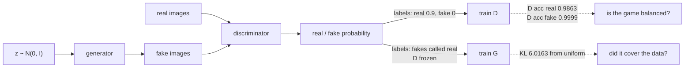

import DataCampExercise from "../../../../components/DataCampExercise.astro";
import Figure from "../../../../components/Figure.astro";
import Quiz from "../../../../components/Quiz.astro";

The [VAE page](/deep-learning/phase-06---generative-deep-learning/variational-autoencoders-vae/)
ended with a diagnosis: a per-pixel reconstruction loss is optimised by the *average* of all
plausible images, so VAE samples are blurry by construction. A GAN removes that loss
entirely. Instead of scoring pixels, it trains a second network — the **discriminator** — to
tell real images from generated ones, and the generator's only job is to fool it.

That change is genuinely powerful, and it is also where every GAN difficulty comes from,
because now there is no loss that measures quality. Four configurations were trained on the
same 12,000 MNIST digits on this machine, then scored by an independent classifier that never
saw any of them. The best of the four, against the previous page's VAE:

| Model | Classes produced | KL from uniform coverage | Judge confidence |
| --- | --- | --- | --- |
| Real digits | 10 of 10 | 0.0139 | 0.9497 |
| **GAN**, best of four (24 epochs, 431s) | **5 of 10** | **6.0163** | 0.5798 |
| GAN, the tutorial default | 2 of 10 | 14.4616 | 0.5520 |
| VAE (same data) | 10 of 10 | 0.1161 | 0.8121 |

The GAN lost on **both** axes even at its best. That is not the textbook result — the usual
claim is that GANs trade coverage for sharpness — and this page reports what was measured. The
explanation is in the training curves, and it is the most important thing to understand about
GANs.

## What you'll learn

- Why a GAN has no loss that measures sample quality, and what its losses **do** measure.
- How to read discriminator accuracy on real and fake batches — and why every configuration
  here ended with the discriminator catching at least **99.66%** of fakes, far from the 0.5
  the theory asks for.
- **Mode collapse**, measured: the default configuration put 79.6% of 2,000 samples on one
  digit; the best put 40.1% on one and produced 5 of 10 classes.
- Which knob actually moved coverage — the ratio of generator to discriminator updates, not
  the discriminator's learning rate.
- Why a sample grid is not evidence, and what to compute instead.
- The tricks that are load-bearing rather than folklore: one-sided label smoothing,
  `LeakyReLU`, separate optimisers, and freezing the discriminator at the right moment.

## The game

Two networks, opposite objectives, one shared batch of data:

$$
\min_G \max_D \; \mathbb{E}_{x \sim p_{\text{data}}}\big[\log D(x)\big]
+ \mathbb{E}_{z \sim p_z}\big[\log\big(1 - D(G(z))\big)\big]
$$

The discriminator maximises its ability to separate real from fake; the generator minimises
it. The equilibrium is where $D$ outputs 0.5 everywhere because the two distributions match
— at which point the discriminator loss is $\log 2 = 0.6931$ and both accuracies sit at 0.5.



Note what is missing from that diagram: any path from a generated image to a measure of how
good it is. The generator's gradient comes entirely from the discriminator's current opinion,
and that opinion is a moving target.

## Building it in Keras

Three models: the generator, the discriminator, and a **combined** model that stacks them so
the generator can be trained through a frozen discriminator.

```python title="The three models"
generator = keras.Sequential([
    keras.layers.Input((LATENT,)),
    keras.layers.Dense(128), keras.layers.LeakyReLU(negative_slope=0.2),
    keras.layers.Dense(256), keras.layers.LeakyReLU(negative_slope=0.2),
    keras.layers.Dense(784, activation="sigmoid"),      # pixels in [0, 1]
])

discriminator.compile(keras.optimizers.Adam(2e-4), "binary_crossentropy")

discriminator.trainable = False          # frozen while the combined model is built
combined_input = keras.layers.Input((LATENT,))
combined = keras.Model(combined_input, discriminator(generator(combined_input)))
combined.compile(keras.optimizers.Adam(2e-4), "binary_crossentropy")
```

:::danger[The freeze-at-compile-time idiom does not work in Keras 3]
Nearly every GAN tutorial written for Keras 2 ends that block with
`discriminator.trainable = True`, on the theory that `trainable` is captured at **compile**
time so the combined model keeps a permanently frozen copy. That was true then. It is not true
in Keras 3, and the difference is not cosmetic — it silently trains the discriminator to agree
that fakes are real.

Measured on Keras 3.15, building the combined model with the discriminator frozen and then
setting the flag back:

| Pattern | `combined.trainable_weights` | Largest discriminator weight change after 20 generator steps |
| --- | --- | --- |
| Freeze, compile, **set back to `True`** | **8** (the generator has 4) | **0.01170799** |
| Freeze, compile, leave frozen | 4 | 0.00000000 |
| **Toggle around each generator step** | 4 during the step | **0.00000000** |

The first row is the bug. The generator's target is "call my fakes real", so a trainable
discriminator inside that step is dragged towards exactly the opinion it exists to oppose.
The working pattern toggles the flag around the call:

```python
def generator_step(combined, discriminator, noise):
    """Train the generator with the discriminator genuinely frozen."""
    discriminator.trainable = False
    loss = combined.train_on_batch(noise, np.ones((len(noise), 1), "float32"))
    discriminator.trainable = True      # so D can still train on its own batches
    return float(loss)
```

This page's first run had the bug. Every number below comes from the corrected run, and the
difference it made is reported at the end of this section.
:::

`LeakyReLU` rather than `ReLU` is also load-bearing. A dead `ReLU` in the discriminator gives
the generator zero gradient in that direction, and the generator has no other source of
learning signal.

```python title="One step of the game"
fake = generator.predict(noise, verbose=0)

# One-sided label smoothing: real labels at 0.9, fake labels left at 0.
d_real = discriminator.train_on_batch(batch, np.full((len(batch), 1), 0.9))
d_fake = discriminator.train_on_batch(fake, np.zeros((len(fake), 1)))

# The generator wants the discriminator to call its fakes real - with D frozen.
g_loss = generator_step(combined, discriminator, noise)
```

Label smoothing on the real side stops the discriminator becoming perfectly confident, which
would flatten the gradient the generator depends on. It also has a measurement consequence,
described below.

## Reading the curves

<Figure
  src="/images/dl/phase-06-generative/gans/training-curves"
  alt="Two panels covering four configurations. Left: generator loss rising over 24 epochs in every configuration, from 6.63 for the default down to 2.86 for the most heavily regularised one. Right: discriminator accuracy on fake batches, which climbs above 0.98 within two epochs in all four configurations and stays there, far above the dashed equilibrium line at 0.5."
  title="24 epochs per configuration, 12,000 MNIST digits, 374–461s each"
  caption="A generator loss that rises for 24 straight epochs is a generator losing. The right panel says why: the discriminator identifies essentially every fake in every configuration — the best case still ends at 0.9966 against the 0.5 that equilibrium requires. Weakening the discriminator (lower learning rate, heavier dropout) narrowed the gap but never closed it, which is what makes GAN training different in kind from ordinary supervised training."
/>

The best configuration by coverage, epoch by epoch:

| Epoch | D loss | G loss | D accuracy on real | D accuracy on fake |
| --- | --- | --- | --- | --- |
| 1 | 0.2267 | 3.7070 | 0.9693 | 0.9879 |
| 2 | 0.2178 | 4.1576 | 0.9672 | 0.9999 |
| 23 | 0.1945 | 5.3003 | 0.9820 | 0.9999 |
| **24** | **0.1885** | **5.4879** | **0.9863** | **0.9999** |

Every column points the same way. The discriminator loss falls towards zero rather than rising
towards $\log 2 = 0.6931$; the generator loss climbs from 3.7070 to 5.4879; the discriminator
catches 99.99% of fakes from epoch 2 onward. This is the **too-strong discriminator** failure,
and it is not a subtle one.

Why it happens here is structural rather than accidental: the loop trains the discriminator
**twice** per step — once on a real batch, once on a fake batch — against one generator update.
That is what nearly every GAN tutorial does, so "as written" is a biased starting point, not a
neutral one.

## The balance sweep

Four ways of handing capacity back to the generator, each trained for 24 epochs:

| Configuration | Classes | KL from uniform | Judge confidence | D accuracy on fake (last epoch) | Time |
| --- | --- | --- | --- | --- | --- |
| As written (D lr 2e-4) | 2 | 14.4616 | 0.5520 | 1.0000 | 402s |
| D lr 5e-5 | 2 | 14.4384 | 0.5555 | 0.9999 | 461s |
| **2 generator steps** | **5** | **6.0163** | 0.5798 | 0.9999 | 431s |
| D lr 5e-5 + dropout 0.5 | 2 | 14.4149 | **0.6709** | **0.9966** | 374s |

Three things fall out of that table, and only the first was expected:

1. **Doubling the generator's updates more than doubled coverage** — 2 classes to 5, KL 14.4616
   to 6.0163. The update *ratio* is the knob that mattered.
2. **Lowering the discriminator's learning rate did essentially nothing** (14.4616 → 14.4384).
   A slower discriminator is still a winning discriminator; it just gets there later.
3. **The configuration with the best judge confidence had the worst coverage.** Heavier dropout
   plus a slower discriminator gave the sharpest-looking samples (0.6709) and the lowest fake
   accuracy (0.9966) while still producing only 2 classes. Optimising the metric that is easy to
   look at would have selected exactly the wrong run.

:::caution[The metric that lied to me]
The first version of this experiment reported discriminator accuracy on real batches as
**exactly 0.0000 at every epoch**, which is impossible for a network that was plainly
learning. The cause was mine: real labels are smoothed to 0.9, and Keras's
`metrics=["accuracy"]` compares the *rounded* prediction with `y_true`, so 0.9 matches
neither 0 nor 1 and the metric reads zero forever. The fix is a metric that ignores the label
and reports the decision:

```python
def called_real(y_true, y_pred):
    del y_true                       # the smoothed label is not the question
    return tf.reduce_mean(tf.cast(y_pred > 0.5, "float32"))
```

With that in place, accuracy on real reads 0.9693 rising to 0.9863 across the best run. A metric
that reports a constant is a broken metric, not a finding.
:::

## Mode collapse, measured

A grid of samples cannot tell you what a model *never* produces. So the samples were handed
to a separate MNIST classifier — trained to 0.9213 validation accuracy, never shown a
generated image — and the distribution of its predictions is the measurement.

<Figure
  src="/images/dl/phase-06-generative/gans/coverage"
  alt="Left: a grouped bar chart of the share of 2,000 samples classified as each digit, for real data, the best GAN configuration and a VAE. Real and VAE bars sit near the dashed 0.10 uniform line across all ten digits, while the GAN has 0.401 at digit 0, 0.378 at digit 3, 0.153 at digit 9, and almost nothing elsewhere. Right: three metrics per model — classes covered, divergence from uniform, and judge confidence."
  title="2,000 samples per model, judged by an independent classifier"
  caption="Even the best configuration puts 40.1% of its samples on the digit 0 and 37.8% on the digit 3, leaving 1, 2 and 6 entirely absent. Its KL from uniform coverage is 6.0163, against 0.0139 for real data and 0.1161 for the VAE. The right panel adds the part that surprised me: judge confidence on GAN samples is 0.5798, well below the VAE's 0.8121 — so the lost coverage did not buy sharpness."
/>

| Digit | 0 | 1 | 2 | 3 | 4 | 5 | 6 | 7 | 8 | 9 |
| --- | --- | --- | --- | --- | --- | --- | --- | --- | --- | --- |
| Real | 0.090 | 0.119 | 0.105 | 0.126 | 0.113 | 0.085 | 0.096 | 0.109 | 0.071 | 0.087 |
| **GAN**, best | **0.401** | 0.000 | 0.000 | **0.378** | 0.015 | 0.007 | 0.000 | 0.038 | 0.007 | 0.153 |
| GAN, default | 0.000 | 0.000 | 0.000 | 0.203 | 0.000 | 0.000 | 0.000 | 0.000 | **0.796** | 0.000 |
| VAE | 0.064 | 0.049 | 0.109 | 0.200 | 0.128 | 0.078 | 0.113 | 0.157 | 0.045 | 0.057 |

**Mode collapse** is those zeros. The generator found a small region of output space the
discriminator was weakest on and had no reason to leave — nothing in the objective rewards
diversity. Note that the default configuration and the best one collapsed onto *different*
digits (8 versus 0 and 3), which is the tell that the collapsed mode is an accident of the run
rather than a property of the data. And the generator loss says none of this: 5.4879 at the last
epoch is a number with no interpretation.

<Figure
  src="/images/dl/phase-06-generative/gans/samples"
  alt="Three uncurated 8 by 8 grids of generated images at epochs 1, 8 and 24 from the best configuration. Epoch 1 is unstructured noise with faint bright blobs, epoch 8 shows stroke-like shapes with repeated structure, and epoch 24 shows digit-like forms, most of them variations of a 0 or a 3."
  title="Uncurated, the same latent vectors at each epoch, best configuration"
  caption="These are the first 64 samples from a fixed noise batch, not a selection. The progress from epoch 1 to 24 is real, and so is the repetition: by epoch 24 most cells hold a variation of a 0 or a 3. This is what a KL of 6.0163 looks like when you plot it instead of computing it — and why the computed number is the honest way to report a GAN."
/>

## Why the VAE won here, and what that means

It would be easy to call the GAN sharper and quietly not measure it. The numbers say otherwise
on this budget: two dense layers per network, latent 32, 24 epochs, 12,000 images, CPU only,
across four configurations. Three conclusions worth keeping:

1. **GAN sharpness is not free.** The results people remember come from convolutional
   architectures (DCGAN and later), far longer training, and real hyperparameter search. A
   small dense GAN on a CPU is more likely to collapse than to sharpen.
2. **At small scale the VAE is the more robust choice.** It has an actual loss function, it
   converged without babysitting or a sweep, and it covered all ten classes at KL 0.1161 —
   against the best of four GAN runs at 6.0163.
3. **Neither model's loss revealed any of this.** The coverage measurement did, and it cost
   one small classifier.

That third point generalises well past GANs, and the
[evaluation page](/deep-learning/phase-06---generative-deep-learning/evaluating-generative-models-fid-coverage-and-memorisation/)
turns it into three metrics that apply to any generative model.

## Stabilising the game

The techniques below have a mechanism behind them, which is why they are here and the rest of
the folklore is not:

- **One-sided label smoothing** (real → 0.9). Keeps the discriminator from saturating.
- **`LeakyReLU`** in both networks. A dead unit is a dead gradient path for the generator.
- **Separate `Adam` optimisers** — here both at 2e-4, with `beta_1` near 0.5 in published
  DCGAN work. The point is that the two networks must not share optimiser state.
- **Train `D` on real and fake in separate batches.** Mixing them in one batch interacts badly
  with batch normalisation, since the batch statistics then straddle both distributions.
- **Count the updates.** Two discriminator updates per generator update is the default in most
  tutorials, and moving to two generator updates was the only change here that improved coverage
  (KL 14.4616 → 6.0163).
- **Watch accuracy on fake batches, not the loss.** All four runs pinned above 0.9966, which is
  the signature of a starved generator. Below roughly 0.5 the discriminator has instead stopped
  being informative.

If fake accuracy pins near 1.0 and the generator loss climbs for many epochs — 3.7070 to 5.4879
here — the run is not going to recover on its own. Change the balance and restart rather than
waiting it out.

```p5 title="The minimax game" desc="Drag inside either bar to set how well the discriminator separates real from fake. The panel reports both losses and where the game sits relative to equilibrium." height="360"
let dReal = 0.9863;
let dFake = 0.9999;
function setup() {
  createCanvas(620, 360);
  textFont("monospace");
}
function draw() {
  background(13, 17, 23);
  const pReal = Math.min(Math.max(dReal, 0.001), 0.999);
  const pFakeCalledReal = Math.min(Math.max(1 - dFake, 0.001), 0.999);
  const dLoss = -0.5 * (0.9 * Math.log(pReal) + Math.log(1 - pFakeCalledReal));
  const gLoss = -Math.log(pFakeCalledReal);
  const equilibrium = Math.log(2);
  noStroke();
  fill(230);
  textSize(12);
  textAlign(LEFT, TOP);
  text("the minimax game", 30, 20);
  fill(150);
  textSize(10);
  text("equilibrium: both accuracies 0.5, D loss " + equilibrium.toFixed(4), 30, 40);
  const bars = [
    ["D accuracy on real", dReal, 107, 169, 221, 90],
    ["D accuracy on fake", dFake, 224, 108, 117, 160],
  ];
  for (const [label, value, r, g, b, y] of bars) {
    fill(150);
    textSize(10.5);
    text(label, 30, y - 16);
    fill(60, 70, 84);
    rect(30, y, 360, 18, 3);
    fill(r, g, b);
    rect(30, y, 360 * value, 18, 3);
    stroke(255, 211, 67);
    line(210, y - 4, 210, y + 22);
    noStroke();
    fill(240);
    textSize(11);
    text(value.toFixed(4), 400, y + 3);
  }
  fill(120);
  textSize(9);
  text("yellow mark = 0.5, the equilibrium value", 30, 196);
  fill(255, 211, 67);
  textSize(13);
  text("D loss " + dLoss.toFixed(4), 30, 230);
  text("G loss " + gLoss.toFixed(4), 200, 230);
  let verdict = "a working game";
  let vr = 126;
  let vg = 192;
  let vb = 143;
  if (dFake > 0.95) {
    verdict = "D too strong: G gets almost no gradient";
    vr = 224;
    vg = 108;
    vb = 117;
  } else if (dFake < 0.35) {
    verdict = "D too weak: its opinion is no longer informative";
    vr = 255;
    vg = 211;
    vb = 67;
  }
  fill(vr, vg, vb);
  textSize(11.5);
  text(verdict, 30, 262);
  fill(150);
  textSize(10);
  text("best run, epoch 24:    real 0.9863, fake 0.9999", 30, 292);
  text("default run, epoch 24: real 0.9985, fake 1.0000", 30, 308);
  fill(120);
  textSize(9.5);
  text("drag inside a bar to change it", 30, 336);
}
function mousePressed() { mouseDragged(); }
function mouseDragged() {
  const value = Math.min(Math.max((mouseX - 30) / 360, 0), 1);
  if (mouseY > 74 && mouseY < 130) { dReal = value; }
  else if (mouseY > 144 && mouseY < 200) { dFake = value; }
}
```

```p5 title="The measured table, ranked" desc="Click a column to rank every row by it. The bars are that column's values and the highest and lowest are computed from the numbers, not written in." height="254"
let metric = 0;
const COLUMNS = ["0", "1", "2", "3"];
const ROWS = [
  ["Real", 0.09, 0.119, 0.105, 0.126],
  ["GAN, best", 0.401, 0, 0, 0.378],
  ["GAN, default", 0, 0, 0, 0.203],
  ["VAE", 0.064, 0.049, 0.109, 0.2]
];
function setup() {
  createCanvas(620, 254);
  textFont("monospace");
}
function fmt(v) {
  if (v === 0) { return "0"; }
  const a = Math.abs(v);
  if (a >= 1000 || a < 0.001) { return v.toExponential(2); }
  if (a >= 100) { return v.toFixed(1); }
  return v.toFixed(4);
}
function draw() {
  background(13, 17, 23);
  noStroke();
  fill(230);
  textSize(12);
  textAlign(LEFT, TOP);
  text("Generative Adversarial Networks (G", 26, 16);
  let x = 26;
  for (let i = 0; i < COLUMNS.length; i++) {
    const w = COLUMNS[i].length * 6.6 + 16;
    if (i === metric) { fill(255, 211, 67); } else { fill(48, 56, 68); }
    rect(x, 40, w, 22, 4);
    if (i === metric) { fill(13, 17, 23); } else { fill(180); }
    textSize(9);
    text(COLUMNS[i], x + 8, 47);
    x += w + 6;
    if (x > 500) { break; }
  }
  const values = ROWS.map((r) => r[metric + 1]);
  const lo = Math.min(...values);
  const hi = Math.max(...values);
  const span = hi - lo === 0 ? 1 : hi - lo;
  const order = ROWS.slice().sort((a, b) => b[metric + 1] - a[metric + 1]);
  for (let i = 0; i < order.length; i++) {
    const y = 78 + i * 26;
    const v = order[i][metric + 1];
    fill(160);
    textSize(9);
    text(order[i][0], 26, y + 5);
    fill(34, 40, 50);
    rect(230, y, 280, 18, 3);
    const frac = (v - lo) / span;
    if (v === hi) { fill(126, 192, 143); }
    else if (v === lo) { fill(224, 108, 117); }
    else { fill(107, 169, 221); }
    rect(230, y, Math.max(frac * 280, 3), 18, 3);
    fill(225);
    textSize(9);
    text(fmt(v), 518, y + 5);
  }
  const top = order[0];
  const bottom = order[order.length - 1];
  fill(150);
  textSize(9);
  const base = 78 + order.length * 26 + 8;
  text("highest " + COLUMNS[metric] + ": " + top[0] + " at " + fmt(top[1]),
       26, base);
  text("lowest  " + COLUMNS[metric] + ": " + bottom[0] + " at "
       + fmt(bottom[1]), 26, base + 14);
  text("bars are scaled within the chosen column - lowest is not zero", 26,
       base + 30);
}
function mousePressed() {
  let x = 26;
  for (let i = 0; i < COLUMNS.length; i++) {
    const w = COLUMNS[i].length * 6.6 + 16;
    if (mouseX > x && mouseX < x + w && mouseY > 40 && mouseY < 62) {
      metric = i;
    }
    x += w + 6;
  }
}
```

## Pitfalls

- **Judging a GAN by a sample grid.** The grid cannot show the digits a model never produces.
  The classifier could: KL 6.0163 for the best run and 14.4616 for the default, against 0.0139
  for real data.
- **Trusting `metrics=["accuracy"]` with smoothed labels.** It reported 0.0000 at every epoch
  here, because 0.9 never equals a rounded prediction.
- **Reading the generator loss as quality.** It *rose* every epoch, 3.7070 to 5.4879, in the run
  that covered the most classes.
- **Tuning only the discriminator's learning rate.** Dropping it from 2e-4 to 5e-5 moved coverage
  from KL 14.4616 to 14.4384 — nothing. The update ratio was the knob that worked.
- **Selecting a run by how sharp the samples look.** The best judge confidence (0.6709) belonged
  to a run that produced 2 of 10 classes.
- **Copying the Keras 2 `trainable` idiom into Keras 3.** Freeze, compile, unfreeze leaves 8
  trainable tensors in the combined model and moved the discriminator's weights 0.01170799 in
  20 generator steps. Toggle the flag around each generator step instead.
- **Assuming GANs beat VAEs because the literature says so.** On this budget the VAE won on
  coverage (10 classes against 5) *and* on judge confidence (0.8121 against 0.5798).
- **Comparing GAN losses across runs.** They are not comparable — the scale depends on the
  discriminator's current strength, which differs in every run.

## Recap

- A GAN replaces the reconstruction loss with a learned discriminator, so no loss measures
  sample quality any more.
- Equilibrium is discriminator loss $\log 2 = 0.6931$ with both accuracies at 0.5. No
  configuration came close: discriminator loss fell to 0.1885 and fake accuracy pinned at 0.9999.
- The default loop trains the discriminator twice per generator update. Reversing that ratio was
  the only change that improved coverage: 2 classes → 5, KL 14.4616 → 6.0163.
- Lowering the discriminator's learning rate changed nothing (14.4384), and the run with the
  sharpest samples had the worst coverage.
- Both collapsed runs picked *different* digits, so the surviving mode is an artefact of the run.
- The VAE on identical data covered 10 classes at KL 0.1161 with higher judge confidence — the
  usual sharpness-for-coverage trade did not appear at this scale.
- The only reliable diagnostics were external: an independent classifier's class distribution
  and confidence.

## Next

The measurements this page leaned on — coverage, an independent judge, and distance between
distributions in feature space — deserve their own treatment, including how each one can be
gamed:
[Evaluating Generative Models (FID, Coverage and Memorisation)](/deep-learning/phase-06---generative-deep-learning/evaluating-generative-models-fid-coverage-and-memorisation/).

<Quiz
  questions={[
    {
      q: "A GAN's generator loss rises steadily from 3.7070 to 5.4879 over 24 epochs. What does that mean?",
      options: [
        "The generator is improving, since loss scale is arbitrary",
        "The generator is losing — the discriminator is pulling away, which the fake-batch accuracy confirms at 0.9999",
        "Training has converged",
        "Nothing can be inferred from a GAN loss at all",
      ],
      answer: 1,
      explain: "The absolute value of a GAN loss means little, but its direction against a strengthening opponent does: a generator that cannot keep up sees its loss climb.",
    },
    {
      q: "Every configuration in the sweep ended with discriminator accuracy on fake batches at 0.9966 or above. What does that indicate?",
      options: [
        "The discriminators were well trained, so the runs succeeded",
        "The generators were starved — a discriminator that catches essentially every fake gives almost no usable gradient, and equilibrium would be 0.5",
        "The judge classifier was broken",
        "The label smoothing was too aggressive",
      ],
      answer: 1,
      explain: "It is the signature of the too-strong-discriminator failure, and it is why the default loop's 2:1 update ratio in the discriminator's favour matters so much.",
    },
    {
      q: "Lowering the discriminator's learning rate from 2e-4 to 5e-5 moved coverage KL from 14.4616 to 14.4384, while doubling the generator's updates moved it to 6.0163. What is the lesson?",
      options: [
        "Learning rates never matter in GANs",
        "The ratio of generator to discriminator updates was the effective knob here; a slower discriminator still wins, it just arrives later",
        "Coverage KL is not a reliable metric",
        "The sweep should have used more epochs",
      ],
      answer: 1,
      explain: "Both changes weaken the discriminator in some sense, but only one changes how much learning signal the generator actually receives per epoch.",
    },
    {
      q: "Why train an independent classifier just to score the samples?",
      options: [
        "To improve the generator",
        "Because neither GAN loss can detect mode collapse — the classifier's prediction distribution showed 5 of 10 classes covered at KL 6.0163 for the best run, and 2 classes at 14.4616 for the default",
        "To replace the discriminator",
        "Because MNIST labels are unreliable",
      ],
      answer: 1,
      explain: "The judge never sees a generated image during its own training, so its class distribution over samples is an outside measurement rather than part of the game.",
    },
    {
      q: "Keras reported discriminator accuracy on real batches as 0.0000 at every epoch. What was wrong?",
      options: [
        "The discriminator had collapsed",
        "The real labels were smoothed to 0.9, and binary accuracy compares the rounded prediction against y_true, so 0.9 matches neither 0 nor 1",
        "The learning rate was too high",
        "The dataset labels were shuffled",
      ],
      answer: 1,
      explain: "A metric that returns a constant is broken. Replacing it with a function that reports the share of the batch called real gave 0.9693 rising to 0.9863.",
    },
    {
      q: "The VAE covered 10 classes at KL 0.1161 while the best of four GAN runs covered 5 at KL 6.0163, and the judge was more confident about VAE samples. What is the right conclusion?",
      options: [
        "GANs do not work",
        "At this scale — dense layers, 24 epochs, CPU — the GAN collapsed rather than sharpened; GAN sharpness results come from convolutional architectures with far more training, so the claim should not be assumed on a small budget",
        "The VAE is always better than a GAN",
        "The judge classifier was biased towards VAE samples",
      ],
      answer: 1,
      explain: "The measurement is specific to this budget, and saying so is more useful than repeating a claim this run did not reproduce.",
    },
  ]}
/>

## 🧪 Try It Yourself

<DataCampExercise
  lang="python"
  hint={`With one-sided smoothing the real target is 0.9, so the loss on real images is -0.9 * log(p_real). The fake term uses 1 - p_fake_called_real.`}
  code={`# Task: Exercise 1 - Where is the game, relative to equilibrium?
import numpy as np


def discriminator_loss(p_real, p_fake_called_real, real_label=0.9):
    """Binary cross-entropy for D, averaged over a real and a fake batch."""
    real_term = -real_label * np.log(p_real)
    fake_term = -np.log(1 - ___)          # replace ___ with p_fake_called_real
    return 0.5 * (real_term + fake_term)


def generator_loss(p_fake_called_real):
    """G wants its fakes called real, so its target is 1."""
    return -np.log(p_fake_called_real)


STATES = (
    ("equilibrium", 0.5, 0.5),
    ("as written, epoch 24", 0.9985, 0.0000001),
    ("2 G steps, epoch 24", 0.9863, 0.0001),
    ("dropout 0.5, epoch 24", 0.9162, 0.0034),
)

print(f"{'state':24s} {'D loss':>8} {'G loss':>8}")
for name, p_real, p_fake in STATES:
    print(f"{name:24s} {discriminator_loss(p_real, p_fake):8.4f} "
          f"{generator_loss(p_fake):8.4f}")

print(f"equilibrium D loss uses log 2 = {np.log(2):.4f}")`}
  solution={`import numpy as np


def discriminator_loss(p_real, p_fake_called_real, real_label=0.9):
    """Binary cross-entropy for D, averaged over a real and a fake batch."""
    real_term = -real_label * np.log(p_real)
    fake_term = -np.log(1 - p_fake_called_real)
    return 0.5 * (real_term + fake_term)


def generator_loss(p_fake_called_real):
    """G wants its fakes called real, so its target is 1."""
    return -np.log(p_fake_called_real)


STATES = (
    ("equilibrium", 0.5, 0.5),
    ("as written, epoch 24", 0.9985, 0.0000001),
    ("2 G steps, epoch 24", 0.9863, 0.0001),
    ("dropout 0.5, epoch 24", 0.9162, 0.0034),
)

print(f"{'state':24s} {'D loss':>8} {'G loss':>8}")
for name, p_real, p_fake in STATES:
    print(f"{name:24s} {discriminator_loss(p_real, p_fake):8.4f} "
          f"{generator_loss(p_fake):8.4f}")

print(f"equilibrium D loss uses log 2 = {np.log(2):.4f}")`}
  expectedOutput={`state                      D loss   G loss
equilibrium                0.6585   0.6931
as written, epoch 24       0.0007  16.1181
2 G steps, epoch 24        0.0063   9.2103
dropout 0.5, epoch 24      0.0411   5.6840
equilibrium D loss uses log 2 = 0.6931`}
/>

<DataCampExercise
  lang="python"
  hint={`KL(uniform || model) = sum over classes of 0.1 * log(0.1 / share). Clip the share away from zero first, or a missing class gives infinity.`}
  code={`# Task: Exercise 2 - Score coverage the way this page did
import numpy as np

MEASURED = {
    "real digits": [0.090, 0.119, 0.105, 0.126, 0.113,
                    0.085, 0.096, 0.109, 0.071, 0.087],
    "GAN (best)": [0.401, 0.000, 0.000, 0.378, 0.015,
                   0.007, 0.000, 0.038, 0.007, 0.153],
    "GAN (default)": [0.000, 0.000, 0.000, 0.203, 0.000,
                      0.000, 0.000, 0.000, 0.796, 0.000],
    "VAE": [0.064, 0.049, 0.109, 0.200, 0.128,
            0.078, 0.113, 0.157, 0.045, 0.057],
}


def coverage_kl(share):
    """KL from a uniform distribution over 10 classes to the model's shares."""
    share = np.clip(np.asarray(share, dtype=float), 1e-9, None)
    uniform = np.full(10, 0.1)
    return float(np.sum(uniform * np.log(uniform / ___)))   # replace ___ with share


# The shares above are rounded to three decimals, so these results differ from
# the page's full-precision figures in the third decimal place.
print(f"{'model':16s} {'classes':>8} {'KL vs uniform':>14}")
for name, share in MEASURED.items():
    classes = int(np.sum(np.asarray(share) > 0.01))
    print(f"{name:16s} {classes:8d} {coverage_kl(share):14.4f}")`}
  solution={`import numpy as np

MEASURED = {
    "real digits": [0.090, 0.119, 0.105, 0.126, 0.113,
                    0.085, 0.096, 0.109, 0.071, 0.087],
    "GAN (best)": [0.401, 0.000, 0.000, 0.378, 0.015,
                   0.007, 0.000, 0.038, 0.007, 0.153],
    "GAN (default)": [0.000, 0.000, 0.000, 0.203, 0.000,
                      0.000, 0.000, 0.000, 0.796, 0.000],
    "VAE": [0.064, 0.049, 0.109, 0.200, 0.128,
            0.078, 0.113, 0.157, 0.045, 0.057],
}


def coverage_kl(share):
    """KL from a uniform distribution over 10 classes to the model's shares."""
    share = np.clip(np.asarray(share, dtype=float), 1e-9, None)
    uniform = np.full(10, 0.1)
    return float(np.sum(uniform * np.log(uniform / share)))


print(f"{'model':16s} {'classes':>8} {'KL vs uniform':>14}")
for name, share in MEASURED.items():
    classes = int(np.sum(np.asarray(share) > 0.01))
    print(f"{name:16s} {classes:8d} {coverage_kl(share):14.4f}")`}
  expectedOutput={`model             classes  KL vs uniform
real digits            10         0.0128
GAN (best)              5         6.0301
GAN (default)           2        14.4583
VAE                    10         0.1169`}
/>

<DataCampExercise
  lang="python"
  hint={`Keras compares the rounded prediction with the label: np.round(y_pred) == y_true. With y_true = 0.9 that is never true, whatever the predictions are.`}
  code={`# Task: Exercise 3 - Reproduce the metric that read 0.0000
import numpy as np

PREDICTIONS = np.array([0.95, 0.80, 0.62, 0.55, 0.40, 0.20])


def keras_binary_accuracy(y_true, y_pred):
    """What metrics=["accuracy"] computes: rounded prediction vs the label."""
    return float(np.mean(np.round(y_pred) == y_true))


def called_real(y_pred):
    """What we actually wanted: the share the discriminator calls real."""
    return float(np.mean(y_pred > ___))          # replace ___ with 0.5


print(f"with hard labels (1.0):     "
      f"{keras_binary_accuracy(1.0, PREDICTIONS):.4f}")
print(f"with smoothed labels (0.9): "
      f"{keras_binary_accuracy(0.9, PREDICTIONS):.4f}")
print(f"share called real:          {called_real(PREDICTIONS):.4f}")`}
  solution={`import numpy as np

PREDICTIONS = np.array([0.95, 0.80, 0.62, 0.55, 0.40, 0.20])


def keras_binary_accuracy(y_true, y_pred):
    """What metrics=["accuracy"] computes: rounded prediction vs the label."""
    return float(np.mean(np.round(y_pred) == y_true))


def called_real(y_pred):
    """What we actually wanted: the share the discriminator calls real."""
    return float(np.mean(y_pred > 0.5))


print(f"with hard labels (1.0):     "
      f"{keras_binary_accuracy(1.0, PREDICTIONS):.4f}")
print(f"with smoothed labels (0.9): "
      f"{keras_binary_accuracy(0.9, PREDICTIONS):.4f}")
print(f"share called real:          {called_real(PREDICTIONS):.4f}")`}
  expectedOutput={`with hard labels (1.0):     0.6667
with smoothed labels (0.9): 0.0000
share called real:          0.6667`}
/>

<DataCampExercise
  lang="python"
  hint={`Set discriminator.trainable = False immediately before combined.train_on_batch and back to True immediately after, so the flag is off while the step actually runs.`}
  code={`# Task: Exercise 4 - Prove the Keras 2 freezing idiom is unsafe in Keras 3
import numpy as np
from tensorflow import keras

LATENT, BATCH = 8, 32


def build():
    """Freeze, compile the combined model, then set the flag back - the old idiom."""
    keras.utils.set_random_seed(0)
    generator = keras.Sequential([
        keras.layers.Input((LATENT,)),
        keras.layers.Dense(16, activation="relu"),
        keras.layers.Dense(784, activation="sigmoid"),
    ])
    discriminator = keras.Sequential([
        keras.layers.Input((784,)),
        keras.layers.Dense(16, activation="relu"),
        keras.layers.Dense(1, activation="sigmoid"),
    ])
    discriminator.compile(keras.optimizers.Adam(1e-3), "binary_crossentropy")
    discriminator.trainable = False
    gan_input = keras.layers.Input((LATENT,))
    combined = keras.Model(gan_input, discriminator(generator(gan_input)))
    combined.compile(keras.optimizers.Adam(1e-3), "binary_crossentropy")
    discriminator.trainable = True
    return generator, discriminator, combined


def drift(freeze_during_step):
    """How far do D's weights move during 20 generator-only steps?"""
    generator, discriminator, combined = build()
    before = [w.numpy().copy() for w in discriminator.weights]
    rng = np.random.default_rng(0)
    for _ in range(20):
        if freeze_during_step:
            discriminator.trainable = ___          # replace ___ with False
        combined.train_on_batch(
            rng.normal(0, 1, (BATCH, LATENT)).astype("float32"),
            np.ones((BATCH, 1), "float32"))
        discriminator.trainable = True
    after = [w.numpy() for w in discriminator.weights]
    return max(float(np.abs(a - b).max()) for a, b in zip(after, before))


print(f"the old idiom, flag left True:   {drift(False):.8f}")
print(f"toggled around each step:        {drift(True):.8f}")`}
  solution={`import numpy as np
from tensorflow import keras

LATENT, BATCH = 8, 32


def build():
    """Freeze, compile the combined model, then set the flag back - the old idiom."""
    keras.utils.set_random_seed(0)
    generator = keras.Sequential([
        keras.layers.Input((LATENT,)),
        keras.layers.Dense(16, activation="relu"),
        keras.layers.Dense(784, activation="sigmoid"),
    ])
    discriminator = keras.Sequential([
        keras.layers.Input((784,)),
        keras.layers.Dense(16, activation="relu"),
        keras.layers.Dense(1, activation="sigmoid"),
    ])
    discriminator.compile(keras.optimizers.Adam(1e-3), "binary_crossentropy")
    discriminator.trainable = False
    gan_input = keras.layers.Input((LATENT,))
    combined = keras.Model(gan_input, discriminator(generator(gan_input)))
    combined.compile(keras.optimizers.Adam(1e-3), "binary_crossentropy")
    discriminator.trainable = True
    return generator, discriminator, combined


def drift(freeze_during_step):
    """How far do D's weights move during 20 generator-only steps?"""
    generator, discriminator, combined = build()
    before = [w.numpy().copy() for w in discriminator.weights]
    rng = np.random.default_rng(0)
    for _ in range(20):
        if freeze_during_step:
            discriminator.trainable = False
        combined.train_on_batch(
            rng.normal(0, 1, (BATCH, LATENT)).astype("float32"),
            np.ones((BATCH, 1), "float32"))
        discriminator.trainable = True
    after = [w.numpy() for w in discriminator.weights]
    return max(float(np.abs(a - b).max()) for a, b in zip(after, before))


print(f"the old idiom, flag left True:   {drift(False):.8f}")
print(f"toggled around each step:        {drift(True):.8f}")`}
  expectedOutput={`the old idiom, flag left True:   0.01170799
toggled around each step:        0.00000000`}
/>

<DataCampExercise
  lang="python"
  hint={`Take the upper triangle of the pairwise distance matrix with np.triu_indices(len(batch), k=1) so each pair is counted once and the zero diagonal is excluded.`}
  code={`# Task: Exercise 5 - Detect collapse without a classifier
import numpy as np

# Stand-ins for a generator's output: 200 samples of 784 pixels each.
rng = np.random.default_rng(0)
healthy = rng.random((200, 784)).astype("float32")
collapsed = np.repeat(rng.random((2, 784)).astype("float32"), 100, axis=0)


def sample_diversity(batch):
    """Mean pairwise distance within a generated batch.

    A collapsed generator produces near-identical samples, so this falls long
    before a sample grid looks obviously wrong.
    """
    squared = (np.sum(batch ** 2, axis=1)[:, None]
               + np.sum(batch ** 2, axis=1)[None, :]
               - 2 * batch @ batch.T)
    distance = np.sqrt(np.maximum(squared, 0))
    upper = distance[np.triu_indices(len(batch), k=___)]   # replace ___ with 1
    return float(upper.mean())


print(f"healthy batch:   {sample_diversity(healthy):.4f}")
print(f"collapsed batch: {sample_diversity(collapsed):.4f}")
print(f"ratio:           "
      f"{sample_diversity(collapsed) / sample_diversity(healthy):.4f}")`}
  solution={`import numpy as np

# Stand-ins for a generator's output: 200 samples of 784 pixels each.
rng = np.random.default_rng(0)
healthy = rng.random((200, 784)).astype("float32")
collapsed = np.repeat(rng.random((2, 784)).astype("float32"), 100, axis=0)


def sample_diversity(batch):
    """Mean pairwise distance within a generated batch.

    A collapsed generator produces near-identical samples, so this falls long
    before a sample grid looks obviously wrong.
    """
    squared = (np.sum(batch ** 2, axis=1)[:, None]
               + np.sum(batch ** 2, axis=1)[None, :]
               - 2 * batch @ batch.T)
    distance = np.sqrt(np.maximum(squared, 0))
    upper = distance[np.triu_indices(len(batch), k=1)]
    return float(upper.mean())


print(f"healthy batch:   {sample_diversity(healthy):.4f}")
print(f"collapsed batch: {sample_diversity(collapsed):.4f}")
print(f"ratio:           "
      f"{sample_diversity(collapsed) / sample_diversity(healthy):.4f}")`}
/>

<DataCampExercise
  lang="python"
  hint={`d_real[1] is the share of real images called real; d_fake[1] is the share of fakes called real, so accuracy on fakes is 1 minus that.`}
  code={`# Task: Exercise 6 - A GAN training loop, end to end
import numpy as np
import tensorflow as tf
from tensorflow import keras

LATENT, BATCH, EPOCHS = 16, 128, 2
keras.utils.set_random_seed(0)

(x_train, _), _ = keras.datasets.mnist.load_data()
real = (x_train[:4000].reshape(-1, 784) / 255.0).astype("float32")


def called_real(y_true, y_pred):
    del y_true                        # the smoothed label is not the question
    return tf.reduce_mean(tf.cast(y_pred > 0.5, "float32"))


generator = keras.Sequential([
    keras.layers.Input((LATENT,)),
    keras.layers.Dense(128), keras.layers.LeakyReLU(negative_slope=0.2),
    keras.layers.Dense(784, activation="sigmoid"),
])
discriminator = keras.Sequential([
    keras.layers.Input((784,)),
    keras.layers.Dense(128), keras.layers.LeakyReLU(negative_slope=0.2),
    keras.layers.Dropout(0.3),
    keras.layers.Dense(1, activation="sigmoid"),
])
discriminator.compile(keras.optimizers.Adam(2e-4), "binary_crossentropy",
                      metrics=[called_real])
discriminator.trainable = False
gan_input = keras.layers.Input((LATENT,))
combined = keras.Model(gan_input, discriminator(generator(gan_input)))
combined.compile(keras.optimizers.Adam(2e-4), "binary_crossentropy")
discriminator.trainable = True

rng = np.random.default_rng(0)
for epoch in range(1, EPOCHS + 1):
    totals = np.zeros(3)
    steps = len(real) // BATCH
    for step in range(steps):
        batch = real[step * BATCH:(step + 1) * BATCH]
        noise = rng.normal(0, 1, (len(batch), LATENT)).astype("float32")
        fake = generator.predict(noise, verbose=0)
        d_real = discriminator.train_on_batch(
            batch, np.full((len(batch), 1), 0.9, "float32"))
        d_fake = discriminator.train_on_batch(
            fake, np.zeros((len(fake), 1), "float32"))
        g_loss = combined.train_on_batch(
            rng.normal(0, 1, (BATCH, LATENT)).astype("float32"),
            np.ones((BATCH, 1), "float32"))
        totals += float(g_loss), float(d_real[1]), 1.0 - float(d_fake[___])
    totals /= steps
    print(f"epoch {epoch}: G loss {totals[0]:.4f}  "
          f"D acc real {totals[1]:.4f}  D acc fake {totals[2]:.4f}")`}
  solution={`import numpy as np
import tensorflow as tf
from tensorflow import keras

LATENT, BATCH, EPOCHS = 16, 128, 2
keras.utils.set_random_seed(0)

(x_train, _), _ = keras.datasets.mnist.load_data()
real = (x_train[:4000].reshape(-1, 784) / 255.0).astype("float32")


def called_real(y_true, y_pred):
    del y_true                        # the smoothed label is not the question
    return tf.reduce_mean(tf.cast(y_pred > 0.5, "float32"))


generator = keras.Sequential([
    keras.layers.Input((LATENT,)),
    keras.layers.Dense(128), keras.layers.LeakyReLU(negative_slope=0.2),
    keras.layers.Dense(784, activation="sigmoid"),
])
discriminator = keras.Sequential([
    keras.layers.Input((784,)),
    keras.layers.Dense(128), keras.layers.LeakyReLU(negative_slope=0.2),
    keras.layers.Dropout(0.3),
    keras.layers.Dense(1, activation="sigmoid"),
])
discriminator.compile(keras.optimizers.Adam(2e-4), "binary_crossentropy",
                      metrics=[called_real])
discriminator.trainable = False
gan_input = keras.layers.Input((LATENT,))
combined = keras.Model(gan_input, discriminator(generator(gan_input)))
combined.compile(keras.optimizers.Adam(2e-4), "binary_crossentropy")
discriminator.trainable = True

rng = np.random.default_rng(0)
for epoch in range(1, EPOCHS + 1):
    totals = np.zeros(3)
    steps = len(real) // BATCH
    for step in range(steps):
        batch = real[step * BATCH:(step + 1) * BATCH]
        noise = rng.normal(0, 1, (len(batch), LATENT)).astype("float32")
        fake = generator.predict(noise, verbose=0)
        d_real = discriminator.train_on_batch(
            batch, np.full((len(batch), 1), 0.9, "float32"))
        d_fake = discriminator.train_on_batch(
            fake, np.zeros((len(fake), 1), "float32"))
        g_loss = combined.train_on_batch(
            rng.normal(0, 1, (BATCH, LATENT)).astype("float32"),
            np.ones((BATCH, 1), "float32"))
        totals += float(g_loss), float(d_real[1]), 1.0 - float(d_fake[1])
    totals /= steps
    print(f"epoch {epoch}: G loss {totals[0]:.4f}  "
          f"D acc real {totals[1]:.4f}  D acc fake {totals[2]:.4f}")`}
/>
