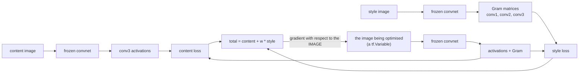

[DeepDream](/deep-learning/phase-06---generative-deep-learning/deepdream/) optimised an image to
maximise one number. Style transfer keeps that machinery — frozen network, image as the variable —
and replaces the objective with a comparison against **two** reference images:

$$
\mathcal{L} = \underbrace{\sum_{\ell \in C} \lVert F^\ell(x) - F^\ell(c) \rVert^2}_{\text{content}}
+ w \cdot \underbrace{\sum_{\ell \in S} \lVert G^\ell(x) - G^\ell(s) \rVert^2}_{\text{style}}
$$

Content is compared **activation by activation**, so layout is preserved. Style is compared through
the **Gram matrix** $G$, which throws away position and keeps only how features co-occur — which is
precisely why it transfers texture without transferring the subject.

The weight $w$ between those terms is the only interesting hyperparameter, and it trades one term
against the other exactly as you would hope, measured over 120 optimisation steps:

| Style weight | Content loss | Style loss | Total objective |
| --- | --- | --- | --- |
| 0 | **0.00000** | 34.46199 | 0.00000 |
| 1 | 2.07898 | 0.65903 | 2.73801 |
| 100 | 4.32142 | 0.05325 | 9.64647 |
| 10000 | 4.51310 | **0.05092** | 513.73618 |

(The totals come from the run's full-precision losses; recomputing them from the rounded columns
above gives 9.64642 and 513.71310.)

Style loss falls by a factor of **677** across that sweep while content loss rises from zero to
4.51310. There is no setting that improves both.

:::note[No pretrained weights here]
Published style transfer uses VGG19 trained on ImageNet. Nothing pretrained is cached on this
machine, so the features come from a small fully convolutional network trained here on
Fashion-MNIST — 23,946 parameters, **0.7767** validation accuracy. The mechanism, the losses and
every number are real; the transferable "style" is garment texture rather than brushwork, and a
deeper feature network is what makes the famous results look the way they do.
:::

## What you'll learn

- Why content uses raw activations and style uses the Gram matrix, and what discarding position
  buys.
- The measured trade across four style weights, including why weight 0 has a content loss of
  exactly zero.
- Why the **starting image** is a real hyperparameter: starting from noise ended up worse on
  *both* terms (content 15.97160 against 4.32142).
- What "nothing is trained" means in code — one `tf.Variable` holding the image, and an optimiser
  applied to it.

## The Gram matrix

For one layer's activation of shape (height, width, channels), flatten the spatial dimensions and
take the correlation between channels:

$$
G_{ij} = \frac{1}{HW} \sum_{p} F_{pi} F_{pj}
$$

Every spatial position $p$ is summed over, so the result says *how often channel $i$ fires where
channel $j$ fires* and says nothing about **where**. A texture is exactly that: a statistical
relationship between features, repeated across an image without a fixed layout.

```python title="Style is a correlation, not a picture"
def gram(activation):
    shape = tf.shape(activation)
    flat = tf.reshape(activation, (shape[0], -1, shape[3]))   # positions x channels
    return tf.matmul(flat, flat, transpose_a=True) / tf.cast(shape[1] * shape[2],
                                                            "float32")
```

Dividing by the number of positions matters more than it looks: without it the Gram matrix scales
with image area, so the style loss would depend on resolution and a weight tuned at one size would
be wrong at another.

<Figure
  src="/images/dl/phase-06-generative/style-transfer/gram-matrix"
  alt="Three heatmaps of 64 by 64 Gram matrices from the conv3 layer — one for the style image, one for the content image, and one for the transferred result. The style and result matrices share a visibly similar pattern of bright diagonal and off-diagonal blocks, while the content image's matrix is distinctly different."
  title="conv3 channel correlations, MSE against the style image"
  caption="These are the actual quantities the style loss compares. The result's Gram matrix has been optimised towards the style image's, and the middle panel shows how different the content image's correlations were to begin with — that difference is what the 34.46199 starting style loss measures."
/>



## Nothing is trained

The only variable is the image. This is worth writing out, because it is the part that surprises
people who have only ever called `model.fit`:

```python title="The image is the parameter"
variable = tf.Variable(initial_image)              # <- the only trainable thing
optimizer = keras.optimizers.Adam(0.02)

for _ in range(STEPS):
    with tf.GradientTape() as tape:
        named = dict(zip(names, extractor(variable)))
        content_loss = tf.reduce_mean((named["conv3"] - content_target) ** 2)
        style_loss = tf.add_n([tf.reduce_mean((gram(named[layer]) - target) ** 2)
                               for layer, target in style_targets.items()])
        loss = content_loss + style_weight * style_loss

    optimizer.apply_gradients([(tape.gradient(loss, variable), variable)])
    variable.assign(tf.clip_by_value(variable, 0.0, 1.0))   # keep pixels legal
```

The `assign` after each step is the equivalent of DeepDream's clip: an optimiser will happily walk
pixels outside the valid range, and the resulting image cannot be displayed even though its loss
looks fine.

## The style weight

<Figure
  src="/images/dl/phase-06-generative/style-transfer/weight-sweep"
  alt="Top: a strip showing the content image, the style image, and four results at style weights 0, 1, 100 and 10000. The weight-0 result is identical to the content image; weight 1 keeps the garment shape with added texture; weights 100 and 10000 look increasingly like pure texture. Bottom: content loss rising from 0 to 4.51310 across the four weights, with style loss on a log axis falling from 34.46199 to 0.05092."
  title="120 optimisation steps per setting"
  caption="At weight 0 the objective ignores style entirely, so the optimum is the content image itself and the content loss is exactly 0.00000 — that is the floor the other settings are measured against. The interesting region is narrow: between weight 1 and weight 100 the style loss falls from 0.65903 to 0.05325 while content loss doubles from 2.07898 to 4.32142, and past that, weight 10000 buys a further 0.00233 of style loss for 0.19168 more content loss."
/>

Reading the sweep as an engineering decision rather than a picture:

- **Weight 0 is the control.** The objective is content-only, the starting image is the content
  image, and the optimum is therefore to change nothing — content loss 0.00000, and a style loss of
  34.46199, which is simply how far apart the two images' correlations are to begin with.
- **Weight 1 is where the trade is efficient.** 94% of the available style-loss reduction
  (34.46199 → 0.65903) for 2.07898 of content loss.
- **Weight 100 is past the knee.** A further 0.60578 of style loss costs another 2.24244 of content.
- **Weight 10000 is wasted.** 0.00233 more style loss reduction for 0.19168 more content loss. The
  total objective is dominated so completely by the style term that the content gradient is
  effectively noise.

The diminishing returns are the point. Style loss is bounded below by zero and the run is already
close to it at weight 100; content loss has no such limit, so it absorbs everything the larger
weight demands.

## Where you start from

Style transfer is a **non-convex** optimisation over a 3,136-dimensional image, so the starting
point does not merely affect how long it takes — it selects which solution is found.

<Figure
  src="/images/dl/phase-06-generative/style-transfer/optimisation"
  alt="Left: content and style loss per optimisation step on a log axis, for a run started from the content image and one started from noise. The content-image run's content loss starts near zero and rises slightly, while the noise run's starts very high and falls but never catches up. Right: the two final images side by side — the content-started one retains a recognisable garment shape, the noise-started one is textured but structureless."
  title="Both at style weight 100, 120 steps each"
  caption="Starting from noise is worse on BOTH terms at the same budget: content loss 15.97160 against 4.32142, and style loss 0.21332 against 0.05325. That is not a speed difference that more steps would erase — the two runs are descending into different basins, and the one that starts at the content image begins inside the region where the content term is already satisfied."
/>

| Starting image | Content loss | Style loss |
| --- | --- | --- |
| The content image | **4.32142** | **0.05325** |
| Noise | 15.97160 | 0.21332 |

The noise-started run is 3.70× worse on content and 4.01× worse on style. Published style transfer
implementations almost always initialise from the content image, and this is why — it is not a
convenience, it is a better optimum at equal cost.

```p5 title="Content against style" desc="Drag the slider to set the style weight. The bars show the two loss terms measured on this page, and the total the optimiser actually minimises." height="340"
let weightIndex = 1;
const WEIGHTS = [0, 1, 100, 10000];
const CONTENT = [0.0, 2.07898, 4.32142, 4.51310];
const STYLE = [34.46199, 0.65903, 0.05325, 0.05092];
function setup() {
  createCanvas(620, 340);
  textFont("monospace");
}
function draw() {
  background(13, 17, 23);
  const weight = WEIGHTS[weightIndex];
  const content = CONTENT[weightIndex];
  const style = STYLE[weightIndex];
  const total = content + weight * style;
  noStroke();
  fill(230);
  textSize(12);
  textAlign(LEFT, TOP);
  text("style weight " + weight, 30, 20);
  fill(150);
  textSize(10.5);
  text("measured over 120 optimisation steps", 30, 40);
  const bars = [
    ["content loss", content, 5.0, 107, 169, 221, 90],
    ["style loss", style, 35.0, 255, 211, 67, 160],
  ];
  for (const entry of bars) {
    const label = entry[0];
    const value = entry[1];
    const scale = entry[2];
    const y = entry[6];
    fill(150);
    textSize(10.5);
    text(label, 30, y - 16);
    fill(60, 70, 84);
    rect(30, y, 380, 18, 3);
    fill(entry[3], entry[4], entry[5]);
    rect(30, y, 380 * Math.min(value / scale, 1), 18, 3);
    fill(240);
    textSize(11);
    text(value.toFixed(5), 420, y + 3);
  }
  fill(126, 192, 143);
  textSize(13);
  text("total minimised = " + total.toFixed(5), 30, 210);
  fill(150);
  textSize(10);
  let note = "the efficient setting: most of the style gain, modest content cost";
  if (weight === 0) {
    note = "content only: the optimum is the content image, unchanged";
  } else if (weight === 100) {
    note = "past the knee: style loss nearly floored, content still rising";
  } else if (weight === 10000) {
    note = "wasted: 0.00233 more style for 0.19168 more content";
  }
  text(note, 30, 234);
  fill(60, 70, 84);
  rect(30, 290, 380, 4, 2);
  fill(255, 211, 67);
  circle(30 + (weightIndex / (WEIGHTS.length - 1)) * 380, 292, 12);
  fill(120);
  textSize(9.5);
  text("drag the slider through the four measured weights", 30, 310);
}
function mousePressed() { mouseDragged(); }
function mouseDragged() {
  const fraction = Math.min(Math.max((mouseX - 30) / 380, 0), 1);
  weightIndex = Math.round(fraction * (WEIGHTS.length - 1));
}
```

```p5 title="The measured table, ranked" desc="Click a column to rank every row by it. The bars are that column's values and the highest and lowest are computed from the numbers, not written in." height="254"
let metric = 0;
const COLUMNS = ["Content loss", "Style loss", "Total objective"];
const ROWS = [
  ["0", 0, 34.46199, 0],
  ["1", 2.07898, 0.65903, 2.73801],
  ["100", 4.32142, 0.05325, 9.64647],
  ["10000", 4.5131, 0.05092, 513.73618]
];
function setup() {
  createCanvas(620, 254);
  textFont("monospace");
}
function fmt(v) {
  if (v === 0) { return "0"; }
  const a = Math.abs(v);
  if (a >= 1000 || a < 0.001) { return v.toExponential(2); }
  if (a >= 100) { return v.toFixed(1); }
  return v.toFixed(4);
}
function draw() {
  background(13, 17, 23);
  noStroke();
  fill(230);
  textSize(12);
  textAlign(LEFT, TOP);
  text("Neural Style Transfer", 26, 16);
  let x = 26;
  for (let i = 0; i < COLUMNS.length; i++) {
    const w = COLUMNS[i].length * 6.6 + 16;
    if (i === metric) { fill(255, 211, 67); } else { fill(48, 56, 68); }
    rect(x, 40, w, 22, 4);
    if (i === metric) { fill(13, 17, 23); } else { fill(180); }
    textSize(9);
    text(COLUMNS[i], x + 8, 47);
    x += w + 6;
    if (x > 500) { break; }
  }
  const values = ROWS.map((r) => r[metric + 1]);
  const lo = Math.min(...values);
  const hi = Math.max(...values);
  const span = hi - lo === 0 ? 1 : hi - lo;
  const order = ROWS.slice().sort((a, b) => b[metric + 1] - a[metric + 1]);
  for (let i = 0; i < order.length; i++) {
    const y = 78 + i * 26;
    const v = order[i][metric + 1];
    fill(160);
    textSize(9);
    text(order[i][0], 26, y + 5);
    fill(34, 40, 50);
    rect(230, y, 280, 18, 3);
    const frac = (v - lo) / span;
    if (v === hi) { fill(126, 192, 143); }
    else if (v === lo) { fill(224, 108, 117); }
    else { fill(107, 169, 221); }
    rect(230, y, Math.max(frac * 280, 3), 18, 3);
    fill(225);
    textSize(9);
    text(fmt(v), 518, y + 5);
  }
  const top = order[0];
  const bottom = order[order.length - 1];
  fill(150);
  textSize(9);
  const base = 78 + order.length * 26 + 8;
  text("highest " + COLUMNS[metric] + ": " + top[0] + " at " + fmt(top[1]),
       26, base);
  text("lowest  " + COLUMNS[metric] + ": " + bottom[0] + " at "
       + fmt(bottom[1]), 26, base + 14);
  text("bars are scaled within the chosen column - lowest is not zero", 26,
       base + 30);
}
function mousePressed() {
  let x = 26;
  for (let i = 0; i < COLUMNS.length; i++) {
    const w = COLUMNS[i].length * 6.6 + 16;
    if (mouseX > x && mouseX < x + w && mouseY > 40 && mouseY < 62) {
      metric = i;
    }
    x += w + 6;
  }
}
```

## Pitfalls

- **Not normalising the Gram matrix by the number of positions.** It would then scale with image
  area, so a style weight tuned at one resolution would be wrong at another.
- **Expecting one weight to improve both terms.** Style loss fell 677× across the sweep and content
  loss rose monotonically; there is no free setting.
- **Pushing the style weight higher and expecting more style.** From 100 to 10000, style loss
  improved by 0.00233 while content loss rose 0.19168.
- **Starting from noise.** At equal budget it was worse on both terms — 15.97160 and 0.21332 against
  4.32142 and 0.05325.
- **Forgetting to clip the variable after each step.** The optimiser will move pixels out of range
  and the loss will not complain.
- **Comparing loss values across implementations.** These depend on the feature network (0.7767
  accuracy here), which layers were chosen, and the Gram normalisation.
- **Using a single style layer.** Style is a multi-scale property; the three layers used here
  contribute correlations at three different receptive-field sizes.

## Recap

- Style transfer optimises the **image** against a frozen network — nothing is trained.
- Content loss compares activations directly; style loss compares Gram matrices, which discard
  position and keep feature co-occurrence.
- The measured trade over 120 steps: style loss 34.46199 → 0.05092 while content loss 0.00000 →
  4.51310.
- Weight 0 gives content loss exactly 0.00000, because the content image is both the start and the
  optimum — the floor everything else is measured against.
- Returns diminish sharply: weight 1 captured 94% of the available style reduction, and weight
  10000 bought 0.00233 more for 0.19168 of content loss.
- The starting image selects the basin: from noise, both terms ended worse (15.97160 and 0.21332).

## Next

That completes the generative phase — six families, all measured against baselines rather than
admired. The phase summary collects what each one cost and what it actually produced:
[Phase 6 - Generative Deep Learning](/deep-learning/phase-06---generative-deep-learning/phase-6---generative-deep-learning/).

<Quiz
  questions={[
    {
      q: "Why does style loss use the Gram matrix rather than comparing activations directly?",
      options: [
        "Because it is cheaper to compute",
        "Because summing over all spatial positions discards WHERE features fired and keeps only how they co-occur — which is what a texture is, and what lets style transfer without transferring the subject",
        "Because activations are too noisy",
        "Because the Gram matrix is differentiable and activations are not",
      ],
      answer: 1,
      explain: "Content loss deliberately does the opposite: it compares activations position by position, which is what preserves layout.",
    },
    {
      q: "At style weight 0 the content loss was exactly 0.00000. Why?",
      options: [
        "The optimiser failed to run",
        "The objective was content-only and the run started from the content image, so the optimum is to change nothing — which makes it the floor that every other weight is measured against",
        "The content loss is always zero at the first step",
        "The style image happened to match the content image",
      ],
      answer: 1,
      explain: "Its style loss of 34.46199 is also informative: that is how far apart the two images' feature correlations are before any optimisation.",
    },
    {
      q: "Raising the style weight from 100 to 10000 reduced style loss by 0.00233 and raised content loss by 0.19168. What does that indicate?",
      options: [
        "The higher weight is better because style is the goal",
        "Diminishing returns — style loss is bounded below by zero and was already near it, while content loss has no such bound, so the extra weight buys almost nothing at real cost",
        "The optimisation diverged",
        "The Gram matrix was not normalised",
      ],
      answer: 1,
      explain: "The total objective at weight 10000 is dominated so heavily by the style term that the content gradient is effectively noise.",
    },
    {
      q: "Starting from noise instead of the content image gave content loss 15.97160 against 4.32142 and style loss 0.21332 against 0.05325, at the same step budget. What is the conclusion?",
      options: [
        "The noise run just needs more steps to catch up",
        "The optimisation is non-convex, so the starting point selects which solution is found — the two runs descended into different basins, and the noise run was worse on both terms",
        "Noise initialisation always fails",
        "The style weight was too low for the noise run",
      ],
      answer: 1,
      explain: "Being worse on both terms at once is the signature of a different basin rather than of slower progress along the same path.",
    },
    {
      q: "What is actually being trained during style transfer?",
      options: [
        "The last layer of the feature network",
        "Nothing — the image itself is a tf.Variable and the optimiser updates its pixels, while the network's weights stay frozen",
        "A small generator network",
        "The Gram matrices",
      ],
      answer: 1,
      explain: "This is the same pattern as DeepDream: a frozen network, an image as the parameter, and gradient steps on a differentiable objective.",
    },
  ]}
/>

## 🧪 Try It Yourself

<DataCampExercise
  lang="python"
  hint={`Flatten the spatial dimensions so the matrix multiply contracts over positions, then divide by the number of positions.`}
  code={`# Task: Exercise 1 - The Gram matrix, and what it discards
import numpy as np


def gram(activation):
    """Channel correlations, averaged over spatial positions."""
    height, width, channels = activation.shape
    flat = activation.reshape(height * width, channels)
    return (flat.T @ flat) / (height * ___)          # replace ___ with width


rng = np.random.default_rng(0)
base = rng.random((8, 8, 3)).astype("float32")

# The same activation, with its spatial layout scrambled and flipped.
shuffled = base.reshape(64, 3)[rng.permutation(64)].reshape(8, 8, 3)
flipped = base[::-1, ::-1, :]

print("Gram of the original:")
print(np.round(gram(base), 4))
print(f"\\nmax difference after shuffling positions: "
      f"{np.abs(gram(base) - gram(shuffled)).max():.6f}")
print(f"max difference after flipping the image:   "
      f"{np.abs(gram(base) - gram(flipped)).max():.6f}")
print("\\nthe Gram matrix cannot see position at all - that is the point")`}
  solution={`import numpy as np


def gram(activation):
    """Channel correlations, averaged over spatial positions."""
    height, width, channels = activation.shape
    flat = activation.reshape(height * width, channels)
    return (flat.T @ flat) / (height * width)


rng = np.random.default_rng(0)
base = rng.random((8, 8, 3)).astype("float32")

# The same activation, with its spatial layout scrambled and flipped.
shuffled = base.reshape(64, 3)[rng.permutation(64)].reshape(8, 8, 3)
flipped = base[::-1, ::-1, :]

print("Gram of the original:")
print(np.round(gram(base), 4))
print(f"\\nmax difference after shuffling positions: "
      f"{np.abs(gram(base) - gram(shuffled)).max():.6f}")
print(f"max difference after flipping the image:   "
      f"{np.abs(gram(base) - gram(flipped)).max():.6f}")
print("\\nthe Gram matrix cannot see position at all - that is the point")`}
  sct={`test_output_contains("max difference after shuffling positions: 0.000000", pattern=False)
test_output_contains("max difference after flipping the image:   0.000000", pattern=False)
success_msg("The Gram matrix sums over positions, so shuffling or flipping the image cannot change it: it records which features co-occur, not where.")`}
  height={400}
/>

<DataCampExercise
  lang="python"
  hint={`Compute the total as content + weight * style, then look at what share of the total each term contributes.`}
  expectedOutput={`  weight   content     style        total  style share of total
       0   0.00000  34.46199      0.00000                0.0000
       1   2.07898   0.65903      2.73801                0.2407
     100   4.32142   0.05325      9.64642                0.5520
   10000   4.51310   0.05092    513.71310                0.9912

at weight 10000 the style term is 99% of the objective, so the
content gradient is effectively noise`}
  code={`# Task: Exercise 2 - Read the measured trade-off
MEASURED = (
    #  weight  content    style
    (       0, 0.00000, 34.46199),
    (       1, 2.07898,  0.65903),
    (     100, 4.32142,  0.05325),
    (   10000, 4.51310,  0.05092),
)

print(f"{'weight':>8} {'content':>9} {'style':>9} {'total':>12} "
      f"{'style share of total':>21}")
for weight, content, style in MEASURED:
    total = content + weight * ___                # replace ___ with style
    share = (weight * style / total) if total else 0.0
    print(f"{weight:8d} {content:9.5f} {style:9.5f} {total:12.5f} "
          f"{share:21.4f}")

print("\\nat weight 10000 the style term is 99% of the objective, so the")
print("content gradient is effectively noise")`}
  solution={`MEASURED = (
    #  weight  content    style
    (       0, 0.00000, 34.46199),
    (       1, 2.07898,  0.65903),
    (     100, 4.32142,  0.05325),
    (   10000, 4.51310,  0.05092),
)

print(f"{'weight':>8} {'content':>9} {'style':>9} {'total':>12} "
      f"{'style share of total':>21}")
for weight, content, style in MEASURED:
    total = content + weight * style
    share = (weight * style / total) if total else 0.0
    print(f"{weight:8d} {content:9.5f} {style:9.5f} {total:12.5f} "
          f"{share:21.4f}")

print("\\nat weight 10000 the style term is 99% of the objective, so the")
print("content gradient is effectively noise")`}
  sct={`test_output_contains("style share of total", pattern=False)
test_output_contains("0.9912", pattern=False)
success_msg("A huge style weight makes the style term almost the whole objective, so the content gradient is effectively noise.")`}
  height={400}
/>

<DataCampExercise
  lang="python"
  hint={`Divide by height * width inside the gram function. Without it, the same texture at a larger size returns a larger matrix.`}
  code={`# Task: Exercise 3 - Why the Gram matrix must be normalised
import numpy as np

rng = np.random.default_rng(0)


def gram_raw(activation):
    """Unnormalised: scales with image area."""
    height, width, channels = activation.shape
    flat = activation.reshape(height * width, channels)
    return flat.T @ flat


def gram_normalised(activation):
    """Divided by the number of positions, so it is resolution independent."""
    height, width, channels = activation.shape
    flat = activation.reshape(height * width, channels)
    return (flat.T @ flat) / (height * ___)          # replace ___ with width


print(f"{'size':>8} {'raw Gram[0,0]':>15} {'normalised Gram[0,0]':>22}")
for size in (8, 16, 32, 64):
    # Same statistical texture, four resolutions.
    texture = rng.random((size, size, 3)).astype("float32")
    print(f"{size:8d} {gram_raw(texture)[0, 0]:15.4f} "
          f"{gram_normalised(texture)[0, 0]:22.4f}")

print("\\nwithout the division, a style weight tuned at 28x28 is wrong at 56x56")`}
  solution={`import numpy as np

rng = np.random.default_rng(0)


def gram_raw(activation):
    """Unnormalised: scales with image area."""
    height, width, channels = activation.shape
    flat = activation.reshape(height * width, channels)
    return flat.T @ flat


def gram_normalised(activation):
    """Divided by the number of positions, so it is resolution independent."""
    height, width, channels = activation.shape
    flat = activation.reshape(height * width, channels)
    return (flat.T @ flat) / (height * width)


print(f"{'size':>8} {'raw Gram[0,0]':>15} {'normalised Gram[0,0]':>22}")
for size in (8, 16, 32, 64):
    # Same statistical texture, four resolutions.
    texture = rng.random((size, size, 3)).astype("float32")
    print(f"{size:8d} {gram_raw(texture)[0, 0]:15.4f} "
          f"{gram_normalised(texture)[0, 0]:22.4f}")

print("\\nwithout the division, a style weight tuned at 28x28 is wrong at 56x56")`}
  sct={`test_output_contains("normalised Gram[0,0]", pattern=False)
test_output_contains("25.1525", pattern=False)
success_msg("Dividing by the number of positions makes the Gram matrix independent of image size, so one style weight works at every resolution.")`}
  height={400}
/>

<DataCampExercise
  lang="python"
  hint={`The gradient of the mean squared error with respect to each pixel is 2 * (image - target) / size. Step against it and clip the image back into [0, 1].`}
  code={`# Task: Exercise 4 - Optimise an image, not a network
import numpy as np

target = np.zeros((16, 16))
target[4:12, 4:12] = 1.0                  # a white square on black
rng = np.random.default_rng(0)
image = np.clip(0.5 + rng.normal(0, 0.1, (16, 16)), 0, 1)

print(f"{'step':>6} {'loss':>10}")
losses = []
for step in range(1, 61):
    loss = np.mean((image - target) ** 2)
    gradient = 2 * (image - ___) / image.size    # d loss / d pixel
    image = np.clip(image - 4.0 * gradient, 0.0, 1.0)
    losses.append(loss)
    if step % 20 == 0 or step == 1:
        print(f"{step:6d} {loss:10.6f}")
print(f"final mean absolute error: {np.mean(np.abs(image - target)):.4f}")
print("the loss fell at every stage:", losses[0] > losses[19] > losses[39] > losses[59])
print("no model, no weights - the image itself was the parameter")`}
  solution={`# Task: Exercise 4 - Optimise an image, not a network
import numpy as np

target = np.zeros((16, 16))
target[4:12, 4:12] = 1.0                  # a white square on black
rng = np.random.default_rng(0)
image = np.clip(0.5 + rng.normal(0, 0.1, (16, 16)), 0, 1)

print(f"{'step':>6} {'loss':>10}")
losses = []
for step in range(1, 61):
    loss = np.mean((image - target) ** 2)
    gradient = 2 * (image - target) / image.size    # d loss / d pixel
    image = np.clip(image - 4.0 * gradient, 0.0, 1.0)
    losses.append(loss)
    if step % 20 == 0 or step == 1:
        print(f"{step:6d} {loss:10.6f}")
print(f"final mean absolute error: {np.mean(np.abs(image - target)):.4f}")
print("the loss fell at every stage:", losses[0] > losses[19] > losses[39] > losses[59])
print("no model, no weights - the image itself was the parameter")`}
  sct={`test_output_contains("the loss fell at every stage: True", pattern=False)
test_output_contains("no model, no weights", pattern=False)
success_msg("The pixels are the parameters here: the gradient of the loss with respect to each pixel is all that is needed.")`}
  height={400}
/>

<DataCampExercise
  lang="python"
  hint={`Run the same optimisation from two different starting points and compare the final losses, not just the number of steps taken.`}
  code={`# Task: Exercise 5 - The starting point selects the solution
import numpy as np

# A deliberately non-convex objective with two basins of different depth.
def objective(x, y):
    return (1.4 * np.exp(-((x - 1.1) ** 2 + (y - 0.9) ** 2) / 0.6)
            + 0.8 * np.exp(-((x + 1.2) ** 2 + (y + 1.0) ** 2) / 0.4))


def gradient(x, y, h=1e-4):
    dx = (objective(x + h, y) - objective(x - h, y)) / (2 * h)
    dy = (objective(x, y + h) - objective(x, y - h)) / (2 * h)
    return dx, dy


STARTS = {
    "near the deep basin": (0.4, 0.3),
    "near the shallow basin": (-0.6, -0.5),
    "far away": (-2.4, 2.2),
}

for name, (x, y) in STARTS.items():
    for _ in range(200):
        dx, dy = gradient(x, y)
        x, y = x + 0.05 * dx, y + 0.05 * ___        # replace ___ with dy
    print(f"{name:24s} -> ({x:+.4f}, {y:+.4f}), "
          f"objective {objective(x, y):.4f}")

print("\\nsame rule, same step count, three different answers - which is why")
print("style transfer starts from the content image rather than from noise")`}
  solution={`import numpy as np

# A deliberately non-convex objective with two basins of different depth.
def objective(x, y):
    return (1.4 * np.exp(-((x - 1.1) ** 2 + (y - 0.9) ** 2) / 0.6)
            + 0.8 * np.exp(-((x + 1.2) ** 2 + (y + 1.0) ** 2) / 0.4))


def gradient(x, y, h=1e-4):
    dx = (objective(x + h, y) - objective(x - h, y)) / (2 * h)
    dy = (objective(x, y + h) - objective(x, y - h)) / (2 * h)
    return dx, dy


STARTS = {
    "near the deep basin": (0.4, 0.3),
    "near the shallow basin": (-0.6, -0.5),
    "far away": (-2.4, 2.2),
}

for name, (x, y) in STARTS.items():
    for _ in range(200):
        dx, dy = gradient(x, y)
        x, y = x + 0.05 * dx, y + 0.05 * dy
    print(f"{name:24s} -> ({x:+.4f}, {y:+.4f}), "
          f"objective {objective(x, y):.4f}")

print("\\nsame rule, same step count, three different answers - which is why")
print("style transfer starts from the content image rather than from noise")`}
  sct={`test_output_contains("near the deep basin      -> (+1.1000, +0.9000)", pattern=False)
test_output_contains("far away                 -> (-2.4000, +2.2000)", pattern=False)
success_msg("Same rule and same step count give three different answers, which is why style transfer starts from the content image rather than from noise.")`}
  height={400}
/>

<DataCampExercise
  lang="python"
  hint={`Add the content loss to the weighted style loss, where the style loss compares Gram matrices. The weight scales how much the style term counts.`}
  code={`# Task: Exercise 6 - A full style transfer, end to end
import numpy as np

rng = np.random.default_rng(0)
SIZE, CHANNELS = 16, 8
content = np.zeros((SIZE, SIZE)); content[4:12, 4:12] = 1.0
style = np.tile([0.0, 1.0], (SIZE, SIZE // 2))          # vertical stripes
weights = rng.normal(0, 1, CHANNELS)
bias = rng.normal(0, 0.3, CHANNELS)


def features(image):
    z = image.reshape(-1, 1) * weights[None, :] + bias
    return np.maximum(z, 0), z


def gram(f):
    return f.T @ f / len(f)


gram_target = gram(features(style)[0])
content_target = features(content)[0]
STYLE_WEIGHT, LEARNING_RATE = 20.0, 0.5
image = 0.25 + 0.5 * content                # start inside the range so clipping cannot stall
history = []
for step in range(1, 201):
    f, z = features(image)
    g = gram(f)
    content_loss = np.mean((f - content_target) ** 2)
    style_loss = np.mean((g - gram_target) ** 2)
    loss = content_loss + STYLE_WEIGHT * ___          # the weighted style term
    history.append((content_loss, style_loss, loss))
    d_f = 2 * (f - content_target) / f.size
    d_f += STYLE_WEIGHT * 4 * f @ (g - gram_target) / (g.size * len(f))
    d_image = ((d_f * (z > 0)) * weights[None, :]).sum(axis=1).reshape(SIZE, SIZE)
    image = np.clip(image - LEARNING_RATE * d_image, 0, 1)
    if step % 50 == 0:
        print(f"step {step:3d}: content {content_loss:.5f}  style {style_loss:.5f}")
print("the style loss fell:", history[-1][1] < history[0][1])
print("the total loss fell:", history[-1][2] < history[0][2])`}
  solution={`# Task: Exercise 6 - A full style transfer, end to end
import numpy as np

rng = np.random.default_rng(0)
SIZE, CHANNELS = 16, 8
content = np.zeros((SIZE, SIZE)); content[4:12, 4:12] = 1.0
style = np.tile([0.0, 1.0], (SIZE, SIZE // 2))          # vertical stripes
weights = rng.normal(0, 1, CHANNELS)
bias = rng.normal(0, 0.3, CHANNELS)


def features(image):
    z = image.reshape(-1, 1) * weights[None, :] + bias
    return np.maximum(z, 0), z


def gram(f):
    return f.T @ f / len(f)


gram_target = gram(features(style)[0])
content_target = features(content)[0]
STYLE_WEIGHT, LEARNING_RATE = 20.0, 0.5
image = 0.25 + 0.5 * content                # start inside the range so clipping cannot stall
history = []
for step in range(1, 201):
    f, z = features(image)
    g = gram(f)
    content_loss = np.mean((f - content_target) ** 2)
    style_loss = np.mean((g - gram_target) ** 2)
    loss = content_loss + STYLE_WEIGHT * style_loss          # the weighted style term
    history.append((content_loss, style_loss, loss))
    d_f = 2 * (f - content_target) / f.size
    d_f += STYLE_WEIGHT * 4 * f @ (g - gram_target) / (g.size * len(f))
    d_image = ((d_f * (z > 0)) * weights[None, :]).sum(axis=1).reshape(SIZE, SIZE)
    image = np.clip(image - LEARNING_RATE * d_image, 0, 1)
    if step % 50 == 0:
        print(f"step {step:3d}: content {content_loss:.5f}  style {style_loss:.5f}")
print("the style loss fell:", history[-1][1] < history[0][1])
print("the total loss fell:", history[-1][2] < history[0][2])`}
  sct={`test_output_contains("the style loss fell: True", pattern=False)
test_output_contains("the total loss fell: True", pattern=False)
success_msg("Style transfer optimises the image against a content loss on features and a style loss on Gram matrices at the same time.")`}
  height={400}
/>
