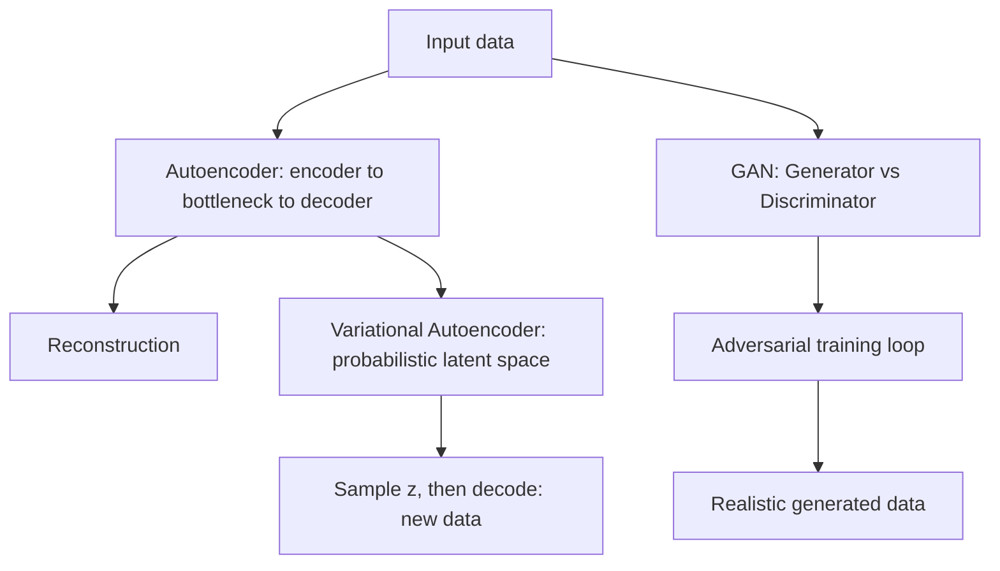

## Why this phase exists

Every model so far has learned to **predict** something — a class, a number, the
next word in a sentence. This phase flips the question around: can a network learn
to **generate** brand-new data that looks like it belongs to the training set?

Two very different families answer that question:

- **Autoencoders** learn to copy their input to their output through a narrow
  bottleneck. That constraint forces them to discover a compact, meaningful
  representation of the data — the **latent code** (or *coding*).
- **GANs** (Generative Adversarial Networks) pit two networks against each other: a
  **generator** that fakes data, and a **discriminator** that tries to catch the
  fakes. Neither one ever "solves" the problem alone — they get better by
  competing.

In this phase, you'll learn:

- how undercomplete, stacked, denoising, sparse, and convolutional autoencoders
  work, and how they're used for dimensionality reduction and unsupervised
  pretraining
- how a **variational autoencoder (VAE)** turns the latent space into a smooth,
  samplable probability distribution so you can generate brand-new data
- how a GAN's generator and discriminator are trained in two competing phases, why
  that training is famously unstable, and how DCGANs stabilize it with convolutions

## Phase 6 flow

## Suggested practice dataset

**Fashion MNIST** is the perfect sandbox for this phase — it's exactly what Géron
uses in the book. It's small and grayscale, so an autoencoder or a small GAN trains
in minutes on a laptop CPU, yet it's rich enough that you can actually *see*
meaningful reconstructions and generations.

:::tip[From the book]
*Hands-On Machine Learning* (Géron) contrasts these two families in one line:
autoencoders "simply learn to copy their inputs to their outputs" under a
constraint that forces useful learning, while GANs are "composed of two neural
networks... [that] compete against each other during training." Both are
unsupervised, both learn dense representations, and both can act as generative
models — they just get there in very different ways.
:::

## Next

Start with **Autoencoders** — the encoder/decoder bottleneck that everything else
in this phase builds on.
