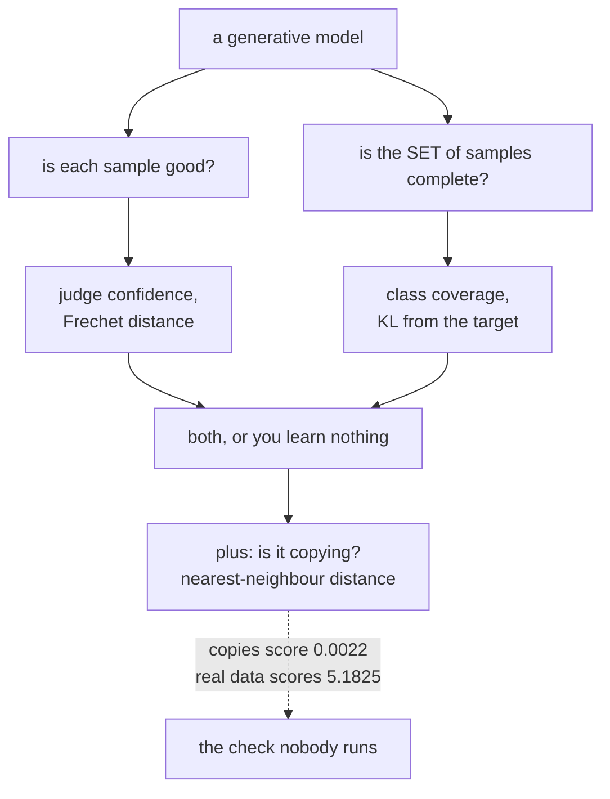

import Figure from "../../../../components/Figure.astro";
import Quiz from "../../../../components/Quiz.astro";

Every model so far has learned to **predict** something — a class, a number, the next word.
This phase asks the harder question: can a network produce data that could plausibly have come
from the training set?

The hard part is not building the models. It is knowing whether they worked. A classifier has
accuracy; a generative model has a sample grid, which shows you what it *can* do and hides what
it cannot. Every page in this phase therefore carries a baseline and a measurement, and several
of them ended up contradicting the standard story.

## What was measured

Everything below ran on this machine: TensorFlow 2.21 / Keras 3.15, CPU only, MNIST or
Fashion-MNIST, no pretrained weights (nothing is cached, so the DeepDream and style-transfer
pages train their own feature networks). Numbers are from those runs.

| Page | The claim being tested | Result |
| --- | --- | --- |
| [Autoencoders](/deep-learning/phase-06---generative-deep-learning/autoencoders/) | A learned encoder beats PCA | True at small codes (**+31.1%** at 8 dims), **false at 128** — PCA won by 3.3× |
| [VAE](/deep-learning/phase-06---generative-deep-learning/variational-autoencoders-vae/) | The KL term makes the latent samplable | True, and it has two failure ends: KL **183.337** at β=0, posterior collapse at β=20 |
| [GANs](/deep-learning/phase-06---generative-deep-learning/generative-adversarial-networks-gans/) | GANs trade coverage for sharpness | **Neither**, at this scale — best of four runs covered 5 of 10 classes *and* lost on confidence |
| [Evaluating generative models](/deep-learning/phase-06---generative-deep-learning/evaluating-generative-models-fid-coverage-and-memorisation/) | FID measures generative quality | Copying 200 real images scored **5.027**, better than real held-out data at 9.605 |
| [Diffusion](/deep-learning/phase-06---generative-deep-learning/diffusion-models-introduction/) | A broken noise schedule caused bad samples | **Refuted** — fixing terminal SNR changed nothing; the architecture was the bottleneck |
| [Text generation](/deep-learning/phase-06---generative-deep-learning/text-generation-with-language-models/) | Temperature trades coherence for variety | Measured directly, as word validity against n-gram diversity |
| [DeepDream](/deep-learning/phase-06---generative-deep-learning/deepdream/) | Bigger ascent steps make stronger dreams | **False** — gain peaks at 2.41× and then falls |
| [Neural style transfer](/deep-learning/phase-06---generative-deep-learning/neural-style-transfer/) | The style weight trades against content | True and sharply diminishing: 94% of the gain by weight 1 |

<Figure
  src="/images/dl/phase-06-generative/generative-evaluation/model-comparison"
  alt="Left: grouped bars showing four metrics for real held-out data, a VAE and a GAN, each metric scaled to its own maximum, with values annotated. Right: sample strips from all three sources, six images each."
  title="Same feature extractor, same judge, same reference split"
  caption="The VAE lands close to the real-data floor on every axis — Frechet 17.165 against 9.605, coverage KL 0.0534 against 0.0034 — while the GAN's 306.752 and KL 13.0709 record the mode collapse the GAN page measured. Both have nearest-neighbour distances in the same range as real held-out data (5.3754 and 4.2331 against 5.1825), so neither is memorising."
/>

<Figure
  src="/images/dl/phase-06-generative/diffusion/what-fixed-it"
  alt="Top: three grids of generated samples — the dense model with the original schedule and with the fixed schedule both show bright unstructured blobs, while the convolutional model shows recognisable digit shapes on a dark background. Bottom: grouped bars of mean pixel value, classes produced and KL from uniform for the three runs plus real digits, showing the convolutional run far closer to real data on every measure."
  title="250 samples per run, 200 reverse steps, same judge"
  caption="Two hypotheses, one figure. Rows 1 and 2 differ only in the noise schedule and are indistinguishable in outcome — the terminal-SNR fix was not the problem. Row 3 changes the denoiser from three dense layers to a small U-Net with the same schedule, and mean ink falls from 0.4780 to 0.0503 against real data's 0.1192, with classes produced rising from 2 to 7."
/>

<Figure
  src="/images/dl/overviews/phase-summaries/phase-6"
  alt="Horizontal bars, one per page in the phase, each labelled with the claim it tested and coloured by the verdict: green where the standard story held, amber where it held at a price, red where the measurement contradicted it. 3 of 6 claims contradicted, 1 held at a price, 2 held."
  title="Every claim this phase set out to test"
  caption="Collected from the runs behind each page's own figures rather than measured afresh, so every bar is traceable to the page it names. Bar length is the log of the effect size, because the effects span from 0.0014 to 5,376 — the number that matters is printed on each bar. Across all nine phases, 34 of 54 claims were contradicted outright, 11 held at a cost that was worth stating, and 9 held as advertised."
/>

## The two questions every generative model has to answer



A model can be excellent on one axis and worthless on the other, and the phase has a measured
example of each. The GAN produced recognisable digits while missing five classes entirely. A
source made by repeating 200 real images had perfect coverage, a better-than-real Fréchet
distance — and generated nothing at all.

That is why the [evaluation page](/deep-learning/phase-06---generative-deep-learning/evaluating-generative-models-fid-coverage-and-memorisation/)
exists and why it sits in the middle of the phase rather than at the end.

```p5 title="Which check catches which failure" desc="Pick a source of images. Each check lights up green when it passes and red when it catches that source - and the memoriser passes most of them." height="360"
let picked = 0;
const SOURCES = [
  ["real, held out", 9.605, 10, 5.43, "the floor - this is what passing looks like"],
  ["a trained VAE", 17.343, 10, 5.09, "the model: passes on its own merits"],
  ["copied training data", 5.027, 10, 0.0035, "generated nothing and beats real data on FID"],
  ["one image, repeated", 133.0, 1, 0.0096, "coverage is the only check that sees this"],
];
const CHECKS = [
  ["FID / Frechet", (r) => r[1] < 60, "close to the real distribution"],
  ["coverage", (r) => r[2] >= 9, "all ten classes present"],
  ["nearest TRAINING image", (r) => r[3] > 2.5, "not copying what it was shown"],
];
function setup() {
  createCanvas(620, 360);
  textFont("monospace");
}
function draw() {
  background(13, 17, 23);
  noStroke();
  fill(230);
  textSize(12);
  textAlign(LEFT, TOP);
  text("no single number is enough", 26, 18);
  for (let i = 0; i < SOURCES.length; i++) {
    const y = 44 + i * 26;
    if (i === picked) { fill(255, 211, 67); } else { fill(48, 56, 68); }
    rect(26, y, 240, 22, 4);
    if (i === picked) { fill(13, 17, 23); } else { fill(180); }
    textSize(9.5);
    text(SOURCES[i][0], 34, y + 6);
  }
  const row = SOURCES[picked];
  let passed = 0;
  for (let i = 0; i < CHECKS.length; i++) {
    const y = 168 + i * 52;
    const ok = CHECKS[i][1](row);
    if (ok) { passed += 1; fill(126, 192, 143); } else { fill(224, 108, 117); }
    rect(26, y, 10, 38, 2);
    fill(225);
    textSize(11);
    text(CHECKS[i][0], 48, y);
    fill(140);
    textSize(8.5);
    text(CHECKS[i][2], 48, y + 15);
    if (ok) { fill(126, 192, 143); } else { fill(224, 108, 117); }
    textSize(10);
    text(ok ? "passes" : "CAUGHT", 48, y + 26);
    fill(180);
    textSize(9.5);
    textAlign(RIGHT, TOP);
    const shown = [row[1], row[2], row[3]][i];
    text(i === 1 ? shown + " / 10" : shown.toFixed(3), 590, y + 6);
    textAlign(LEFT, TOP);
  }
  fill(255, 211, 67);
  textSize(10);
  text("passes " + passed + " of 3 - " + row[4], 26, 330);
}
function mousePressed() {
  for (let i = 0; i < SOURCES.length; i++) {
    const y = 44 + i * 26;
    if (mouseY > y && mouseY < y + 22 && mouseX < 266) { picked = i; }
  }
}
```

## Reading order

1. **Autoencoders** — the encoder/bottleneck/decoder skeleton, and the reason a plain
   autoencoder cannot generate: its code space has no shape.
2. **Variational autoencoders** — give the code space a shape with a KL term, and watch what
   happens at both ends of the β dial.
3. **GANs** — replace the reconstruction loss with a learned opponent, and lose every reliable
   diagnostic in the process.
4. **Evaluating generative models** — build the three measurements the previous page needed,
   then break each one on purpose.
5. **Diffusion models** — the family with a closed-form forward process, so the schedule can be
   checked with arithmetic instead of trained.
6. **Text generation** — the same sampling questions in a domain where "is this a real word" is
   a measurable proxy for quality.
7. **DeepDream** and **Neural style transfer** — no generator at all: freeze the network and
   optimise the image.

The last two are the cheapest demonstration in the phase that a trained discriminative network
already contains a generative model of its own features.

```p5 title="How often the standard story survived" desc="Step through the phases. Each bar splits the claims that phase tested into contradicted, held at a price, and held as advertised - the totals are summed live." height="400"
let picked = 0;
const PHASES = [
  [1, "Neural Network Foundations", 3, 0, 3, "a single neuron cannot do XOR - 0 of 40,401 weight pairs"],
  [2, "Training Deep Networks", 2, 2, 2, "146x the parameters bought 0.0150 accuracy"],
  [3, "Computer Vision", 4, 1, 1, "augmentation cost 0.1855 clean, bought 0.1105 rotated"],
  [4, "Sequence Models", 4, 2, 0, "a fixed state scored 0.0017 against attention's 1.0000"],
  [5, "NLP & Transformers", 4, 1, 1, "TF-IDF 0.8632 beat a transformer's 0.8462, 55x cheaper"],
  [6, "Generative", 3, 1, 2, "copying 200 real images scored FID 5.027 against real 9.605"],
  [7, "Reinforcement Learning", 4, 2, 0, "replay and target nets: 144.20 together, 53.45 either alone"],
  [8, "Scaling & Deployment", 5, 1, 0, "mixed precision measured 40.65x SLOWER on this CPU"],
  [9, "Capstones", 5, 1, 0, "a memoriser beat the VAE on Frechet distance"]
];
function setup() {
  createCanvas(620, 400);
  textFont("monospace");
}
function draw() {
  background(13, 17, 23);
  noStroke();
  fill(230);
  textSize(12);
  textAlign(LEFT, TOP);
  text("54 claims, 9 phases, every one tested by a measurement", 26, 16);
  let broke = 0;
  let cost = 0;
  let held = 0;
  for (let i = 0; i < PHASES.length; i++) {
    broke += PHASES[i][2];
    cost += PHASES[i][3];
    held += PHASES[i][4];
  }
  for (let i = 0; i < PHASES.length; i++) {
    const y = 48 + i * 26;
    const row = PHASES[i];
    const chosen = i === picked;
    fill(chosen ? 255 : 130, chosen ? 211 : 140, chosen ? 67 : 155);
    textSize(9);
    text("Phase " + row[0] + "  " + row[1], 26, y + 5);
    let x = 250;
    const unit = 34;
    fill(224, 108, 117);
    rect(x, y, row[2] * unit, 17, 2);
    x += row[2] * unit;
    fill(255, 211, 67);
    rect(x, y, row[3] * unit, 17, 2);
    x += row[3] * unit;
    fill(126, 192, 143);
    rect(x, y, row[4] * unit, 17, 2);
    if (chosen) {
      noFill();
      stroke(255, 211, 67);
      strokeWeight(1.5);
      rect(248, y - 2, 6 * unit + 4, 21, 3);
      noStroke();
    }
  }
  const row = PHASES[picked];
  fill(200);
  textSize(10);
  text("Phase " + row[0] + " headline:", 26, 300);
  fill(255, 211, 67);
  textSize(10);
  text(row[5], 26, 318);
  fill(150);
  textSize(9);
  text("contradicted " + row[2] + "   held at a price " + row[3]
       + "   held " + row[4], 26, 340);
  fill(224, 108, 117);
  rect(26, 360, 12, 12, 2);
  fill(150);
  textSize(9);
  text("contradicted  " + broke + " of 54", 44, 362);
  fill(255, 211, 67);
  rect(210, 360, 12, 12, 2);
  fill(150);
  text("held at a price  " + cost, 228, 362);
  fill(126, 192, 143);
  rect(400, 360, 12, 12, 2);
  fill(150);
  text("held  " + held, 418, 362);
  fill(110);
  textSize(8.5);
  text("click a row. Collected from each page's own measured run.", 26, 382);
}
function mousePressed() {
  for (let i = 0; i < PHASES.length; i++) {
    const y = 48 + i * 26;
    if (mouseY > y && mouseY < y + 20) { picked = i; }
  }
}
```

## What this phase does not show

Being explicit, because the pages are specific about their budget:

- **No large-scale results.** Everything is MNIST-sized on a CPU. The GAN collapsed where a
  DCGAN with more training would not; the diffusion model produces blobs where a proper U-Net at
  scale produces digits.
- **No pretrained features.** FID-style numbers here come from a locally trained classifier, so
  they are internally consistent and **not** comparable to published Inception-based FID.
- **No text model worth sampling from for its own sake.** The character LSTM exists to make the
  temperature trade measurable, not to write reviews.

Each page states its own budget next to its numbers, so nothing here needs to be taken on trust.

## Suggested practice dataset

**Fashion-MNIST** and **MNIST** are both cached by Keras and both small enough that every
experiment in this phase finishes in minutes to tens of minutes on a laptop CPU. Fashion-MNIST is
the more interesting of the two for autoencoders — garments have more internal structure than
digits — while MNIST's ten clean classes are what make coverage measurable with a small
classifier as judge.

## Next

Start with [Autoencoders](/deep-learning/phase-06---generative-deep-learning/autoencoders/) —
the encoder/bottleneck/decoder structure that the VAE, the diffusion denoiser and half the
diagrams in this phase are built from.


<Quiz
  questions={[
    {
      q: "Copying 200 real training images scored FID 5.027 - better than real held-out data at 9.605. What does that establish about FID?",
      options: [
        "That FID is broken",
        "That FID measures how well the sample distribution matches the reference distribution, which copied real data achieves by construction - it makes no claim about novelty",
        "That 200 samples is too few",
        "That the reference set was wrong"
      ],
      answer: 1,
      explanation: "The metric is doing exactly what it says. Detecting a memoriser needs a separate check, against the split the model was trained on."
    },
    {
      q: "A learned autoencoder beat PCA by 31.1% at 8 dimensions but LOST to it by 3.3x at 128. Why does the ranking flip?",
      options: [
        "The autoencoder overfitted",
        "At 128 dimensions the linear subspace already captures nearly all the variance, so there is no nonlinearity left to buy - and PCA solves its problem exactly while the autoencoder only approximates its own",
        "PCA was given more data",
        "128 dimensions is too many"
      ],
      answer: 1,
      explanation: "A learned method beats a closed-form one only where the extra flexibility is needed. Reporting one bottleneck size would have supported either headline."
    },
    {
      q: "The hypothesis that a broken noise schedule caused poor diffusion samples was tested and REFUTED - fixing terminal SNR changed the KL from 12.9494 to 14.4285. What was the right next step?",
      options: [
        "Report the fix anyway since it is standard advice",
        "Keep the refutation on the page and test the next candidate - which turned out to be the architecture: a convolutional U-Net scored 0.0314 against 0.8738",
        "Retune the schedule until it helped",
        "Drop the experiment"
      ],
      answer: 1,
      explanation: "A refuted hypothesis with a number attached is a result. Silently swapping it for the one that worked would hide the most useful part of the investigation."
    },
    {
      q: "In Keras 3, freezing a discriminator by setting `trainable = False` before `compile` did not work - 20 generator steps moved the discriminator weights by 0.01170799. Why?",
      options: [
        "The optimiser was misconfigured",
        "Keras 3 reads `trainable` at CALL time rather than at compile time, so the Keras-2 freeze idiom silently trains the network you thought you had frozen",
        "The discriminator was compiled twice",
        "Gradient clipping was disabled"
      ],
      answer: 1,
      explanation: "Toggling the flag around each generator step instead brought the movement to 0.00000000. The failure is silent: the GAN trains, the losses look plausible, and the adversarial game is not the one you specified."
    },
    {
      q: "Why does every page in this phase carry a baseline, when a grid of samples is available?",
      options: [
        "Because sample grids are slow to render",
        "Because a grid shows what a model CAN produce and hides what it cannot - and the sharpest grid in the phase belongs to a program that copies training images",
        "Because reviewers require it",
        "Because grids cannot be quantised"
      ],
      answer: 1,
      explanation: "Curation makes any generator look good and a memoriser look best. The baseline and the metric suite are what turn a picture into evidence."
    }
  ]}
/>
