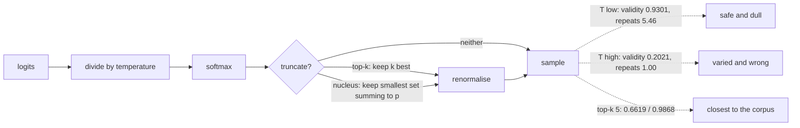

A character-level language model predicts one distribution over the next character, and
generation is just sampling from it repeatedly. Every interesting decision is in *how* you
sample, and that decision is usually explained with three printed samples and an assertion about
which looks best.

It can be measured instead. The corpus is real English, so **word validity** — the share of
produced tokens that are dictionary words — is a quality proxy you can compute, and **distinct
n-grams** measures diversity. Both move, in opposite directions:

| Temperature | Word validity | Distinct words | Distinct bigrams | Longest repeated run |
| --- | --- | --- | --- | --- |
| 0.2 | **0.9301** | 0.2358 | 0.4899 | 5.46 |
| 0.5 | 0.7780 | 0.5675 | 0.9349 | 2.33 |
| 0.8 | 0.5449 | 0.8014 | 0.9942 | 1.71 |
| 1.0 | 0.3947 | 0.9052 | 0.9981 | 1.12 |
| 1.5 | 0.2021 | **0.9881** | 1.0000 | 1.00 |
| *the corpus itself* | *1.0000* | *0.8139* | *0.9782* | *1.46* |

Note the last row. Real text is not at either extreme — it sits at 0.8139 distinct words, close
to temperature 0.8, while scoring validity 1.0000 that no sampling temperature reaches.

:::note[This model is small on purpose]
90,643 parameters, a 40-character window, 36,000 training windows thinned evenly from the 515,595
available, 10 epochs, 372 seconds on a CPU. It produces word-shaped fragments, not sentences —
the samples below are real output and they are not good. That is fine for this page: the
temperature trade is visible in a weak model exactly as it is in a strong one, and pretending
otherwise would require a GPU and several hours.
:::

## What you'll learn

- What temperature does to a softmax, and the measured trade it produces.
- Why **greedy decoding scored a perfect 1.0000 word validity** and is still the worst setting
  here.
- How **top-k** and **nucleus** sampling differ from temperature, measured on the same axes.
- Why validation loss kept falling after the text stopped improving.

## Temperature

Temperature divides the logits before the softmax:

$$
p_i = \frac{\exp(z_i / T)}{\sum_j \exp(z_j / T)}
$$

$T < 1$ sharpens the distribution towards the argmax; $T > 1$ flattens it towards uniform; $T =
1$ leaves the model's own distribution alone. It is a single number that moves the sampler
between "always the most likely character" and "ignore the model".

```python title="Temperature, then optionally top-k or nucleus"
scaled = np.log(np.clip(probabilities, 1e-12, None)) / temperature
scaled = np.exp(scaled - scaled.max())
scaled /= scaled.sum()

if top_k:                                  # keep the k most likely, renormalise
    keep = np.argsort(scaled)[-top_k:]
    mask = np.zeros_like(scaled); mask[keep] = scaled[keep]
    scaled = mask / mask.sum()

if top_p:                                  # keep the smallest set summing to p
    order = np.argsort(scaled)[::-1]
    cut = int(np.searchsorted(np.cumsum(scaled[order]), top_p)) + 1
    mask = np.zeros_like(scaled); mask[order[:cut]] = scaled[order[:cut]]
    scaled = mask / mask.sum()
```

The `+ 1` in the nucleus cut is not a rounding detail — without it, a step where one character
already exceeds $p$ would keep nothing at all.

<Figure
  src="/images/dl/phase-06-generative/text-generation/temperature-sweep"
  alt="Two panels. Left: word validity falling from 0.9301 at temperature 0.2 to 0.2021 at 1.5, with error bars, against a dashed line at 1.0000 for the corpus itself. Right: distinct word bigrams rising from 0.4899 to 1.0000 and distinct words rising from 0.2358 to 0.9881 across the same range, with the corpus bigram level at 0.9782 marked."
  title="24 samples of 240 characters at each setting"
  caption="The two panels are mirror images, which is the whole point: there is no temperature that is best on both axes. The corpus reference lines matter more than the curves — real text scores 1.0000 validity and 0.9782 distinct bigrams simultaneously, and no sampling temperature gets close to both, because the model is not good enough. Temperature cannot fix a weak model, only choose which way it fails."
/>

## Greedy decoding scores perfectly and is useless

Setting temperature to zero — always take the most likely character — produced this:

```text title="greedy, 220 characters"
the the the the the the the the the the the the the the the the the the the the the the the
the the the the the the the the the the the the the the the the the the the the the the the
```

Its measured scores:

| Strategy | Word validity | Distinct words | Distinct bigrams | Longest repeated run |
| --- | --- | --- | --- | --- |
| **greedy** | **1.0000** | 0.0171 | 0.0174 | **58.33** |
| T = 0.5 | 0.7780 | 0.5675 | 0.9349 | 2.33 |
| T = 1.0 | 0.3947 | 0.9052 | 0.9981 | 1.12 |
| top-k = 5, T = 1.0 | 0.6619 | 0.6894 | 0.9868 | 1.62 |
| nucleus p = 0.9, T = 1.0 | 0.4912 | 0.8255 | 0.9966 | 1.17 |

**Word validity 1.0000 — a perfect score.** `the` is a dictionary word, so a model that writes
nothing else is, by that metric alone, flawless. The longest-repeat column is what exposes it:
58.33 consecutive repetitions against 1.46 for real English.

This is the same failure the
[evaluation page](/deep-learning/phase-06---generative-deep-learning/evaluating-generative-models-fid-coverage-and-memorisation/)
found when 200 copied images beat real data on the Fréchet distance. A single generative metric
is not a score to maximise — it is one of several constraints, and the degenerate solution
usually maxes exactly one of them.

<Figure
  src="/images/dl/phase-06-generative/text-generation/sampling-strategies"
  alt="Left: grouped bars of word validity and distinct bigrams for five strategies, with greedy showing validity 1.0 and near-zero diversity, and dotted lines marking the corpus values. Right: horizontal bars of the longest repeated run, dominated by greedy at 58.33 against roughly 1 to 2.3 for every sampling method and 1.46 for the corpus."
  title="Same model, same number of characters, five decoding rules"
  caption="Greedy is off the scale on the right panel and perfect on the left — the clearest demonstration in this phase that a metric with a degenerate optimum will find it. Among the real strategies, top-k = 5 lands closest to the corpus on both axes: validity 0.6619 with 0.9868 distinct bigrams, against the corpus's 1.0000 and 0.9782."
/>

**Top-k** and **nucleus** sampling both attack the same problem from a different direction than
temperature. Temperature reweights *every* character, including ones the model considers
absurd; top-k and nucleus **delete** the tail first and then sample normally from what remains.
That is why top-k = 5 at T = 1.0 (validity 0.6619) beats plain T = 1.0 (0.3947) while keeping
almost all its diversity — 0.9868 distinct bigrams against 0.9981.



```p5 title="Temperature, top-k and nucleus on one distribution" desc="Drag the temperature slider and click a truncation rule. The bars are the resulting sampling distribution, with the measured validity and diversity for that temperature." height="380"
let temperature = 1.0;
let rule = "none";
const BASE = [0.40, 0.22, 0.14, 0.09, 0.06, 0.04, 0.03, 0.02];
const LABELS = ["e", "t", "a", "o", "h", "s", "r", "q"];
const MEASURED = {
  "0.2": [0.9301, 0.2358],
  "0.5": [0.7780, 0.5675],
  "0.8": [0.5449, 0.8014],
  "1.0": [0.3947, 0.9052],
  "1.5": [0.2021, 0.9881],
};
function setup() {
  createCanvas(620, 380);
  textFont("monospace");
}
function shape() {
  let out = BASE.map((p) => Math.exp(Math.log(p) / temperature));
  let total = out.reduce((a, b) => a + b, 0);
  out = out.map((v) => v / total);
  if (rule === "topk") {
    const order = out.map((v, i) => [v, i]).sort((a, b) => b[0] - a[0]);
    const keep = new Set(order.slice(0, 3).map((entry) => entry[1]));
    out = out.map((v, i) => (keep.has(i) ? v : 0));
  } else if (rule === "nucleus") {
    const order = out.map((v, i) => [v, i]).sort((a, b) => b[0] - a[0]);
    const keep = new Set();
    let running = 0;
    for (const entry of order) {
      keep.add(entry[1]);
      running += entry[0];
      if (running >= 0.9) { break; }
    }
    out = out.map((v, i) => (keep.has(i) ? v : 0));
  }
  total = out.reduce((a, b) => a + b, 0);
  return out.map((v) => v / total);
}
function nearestMeasured() {
  let best = "1.0";
  let gap = 99;
  for (const key of Object.keys(MEASURED)) {
    const distance = Math.abs(parseFloat(key) - temperature);
    if (distance < gap) { gap = distance; best = key; }
  }
  return best;
}
function draw() {
  background(13, 17, 23);
  const values = shape();
  noStroke();
  fill(230);
  textSize(12);
  textAlign(LEFT, TOP);
  text("next-character distribution", 30, 20);
  fill(150);
  textSize(10.5);
  text("temperature " + temperature.toFixed(2) + "   rule: " + rule, 30, 40);
  const baseY = 250;
  const width = 52;
  for (let i = 0; i < values.length; i++) {
    const x = 40 + i * (width + 14);
    const height = values[i] * 170;
    fill(values[i] > 0 ? color(107, 169, 221) : color(50, 58, 70));
    rect(x, baseY - height, width, height, 3);
    fill(200);
    textSize(11);
    textAlign(CENTER, TOP);
    text(LABELS[i], x + width / 2, baseY + 6);
    fill(150);
    textSize(8.5);
    text(values[i].toFixed(3), x + width / 2, baseY + 22);
  }
  textAlign(LEFT, TOP);
  const key = nearestMeasured();
  fill(255, 211, 67);
  textSize(11);
  text("measured at T=" + key + ":  word validity "
    + MEASURED[key][0].toFixed(4) + "   distinct words "
    + MEASURED[key][1].toFixed(4), 30, 292);
  const buttons = [["none", 30], ["topk", 130], ["nucleus", 230]];
  for (const entry of buttons) {
    const label = entry[0];
    const x = entry[1];
    if (label === rule) { fill(255, 211, 67); } else { fill(60, 70, 84); }
    rect(x, 340, 92, 24, 4);
    if (label === rule) { fill(20); } else { fill(200); }
    textSize(10.5);
    textAlign(CENTER, CENTER);
    text(label === "topk" ? "top-k=3" : label, x + 46, 353);
  }
  textAlign(LEFT, TOP);
  fill(60, 70, 84);
  rect(360, 350, 200, 4, 2);
  fill(255, 211, 67);
  circle(360 + ((temperature - 0.1) / 1.9) * 200, 352, 12);
  fill(120);
  textSize(9);
  text("drag: temperature", 360, 330);
}
function mousePressed() {
  if (mouseY > 336 && mouseY < 366 && mouseX < 330) {
    if (mouseX > 30 && mouseX < 122) { rule = "none"; }
    else if (mouseX > 130 && mouseX < 222) { rule = "topk"; }
    else if (mouseX > 230 && mouseX < 322) { rule = "nucleus"; }
    return;
  }
  mouseDragged();
}
function mouseDragged() {
  if (mouseX < 350 || mouseY < 330) { return; }
  const fraction = Math.min(Math.max((mouseX - 360) / 200, 0), 1);
  temperature = 0.1 + fraction * 1.9;
}
```

## Loss keeps falling after the text stops improving

<Figure
  src="/images/dl/phase-06-generative/text-generation/training-progress"
  alt="Left: training and validation cross-entropy per character both falling smoothly from about 2.90 and 2.62 to 2.07 over ten epochs. Right: word validity of a sample at temperature 0.5, rising unevenly from 0.5122 to 0.8571 with large fluctuations between epochs."
  title="10 epochs, 90,643 parameters, 372s"
  caption="The left panel is the smooth curve everyone reports. The right one is what it buys, and it is far noisier — validity moves 0.7222, 0.7778, 0.8333, 0.7838 across consecutive epochs while the loss falls monotonically. A single sample scored at one checkpoint is a noisy measurement, which is why the temperature table above averages 24 samples per setting."
/>

| Epoch | Loss | Validation loss | Sample validity |
| --- | --- | --- | --- |
| 1 | 2.9012 | 2.6169 | 0.5122 |
| 3 | 2.3618 | 2.3139 | 0.8333 |
| 6 | 2.2051 | 2.1791 | 0.8333 |
| 10 | 2.0727 | 2.0677 | 0.8571 |

Cross-entropy per character fell 2.9012 → 2.0727 with no sign of overfitting — validation
tracks training within 0.005 at the end, which says the model is *under*-fitting and would
benefit from more capacity and more data rather than from regularisation.

What the samples look like at each stage is the more honest progress report:

```text title="epoch 1, T=0.5"
o te te are te aie te wte hes aor t rh toie thh tlo ta tot f tos aort so t torn eo t taihe
```

```text title="epoch 10, T=0.5"
 at rore the fill br how of the the macter the br the br the of of the the prove the the reack
```

By epoch 10 the model has learned English *letter statistics* and a handful of very common words
(`the`, `of`, `and`, `in`), and nothing about meaning. `br` appears constantly because the corpus
is IMDB reviews decoded from token ids, where `br` — from the HTML line breaks in the original
reviews — survived tokenisation as a frequent word.

```p5 title="The measured table, ranked" desc="Click a column to rank every row by it. The bars are that column's values and the highest and lowest are computed from the numbers, not written in." height="306"
let metric = 0;
const COLUMNS = ["Word validity", "Distinct words", "Distinct bigrams", "Longest repeated run"];
const ROWS = [
  ["0.2", 0.9301, 0.2358, 0.4899, 5.46],
  ["0.5", 0.778, 0.5675, 0.9349, 2.33],
  ["0.8", 0.5449, 0.8014, 0.9942, 1.71],
  ["1.0", 0.3947, 0.9052, 0.9981, 1.12],
  ["1.5", 0.2021, 0.9881, 1, 1],
  ["the corpus itself", 1, 0.8139, 0.9782, 1.46]
];
function setup() {
  createCanvas(620, 306);
  textFont("monospace");
}
function fmt(v) {
  if (v === 0) { return "0"; }
  const a = Math.abs(v);
  if (a >= 1000 || a < 0.001) { return v.toExponential(2); }
  if (a >= 100) { return v.toFixed(1); }
  return v.toFixed(4);
}
function draw() {
  background(13, 17, 23);
  noStroke();
  fill(230);
  textSize(12);
  textAlign(LEFT, TOP);
  text("Text Generation with Language Mode", 26, 16);
  let x = 26;
  for (let i = 0; i < COLUMNS.length; i++) {
    const w = COLUMNS[i].length * 6.6 + 16;
    if (i === metric) { fill(255, 211, 67); } else { fill(48, 56, 68); }
    rect(x, 40, w, 22, 4);
    if (i === metric) { fill(13, 17, 23); } else { fill(180); }
    textSize(9);
    text(COLUMNS[i], x + 8, 47);
    x += w + 6;
    if (x > 500) { break; }
  }
  const values = ROWS.map((r) => r[metric + 1]);
  const lo = Math.min(...values);
  const hi = Math.max(...values);
  const span = hi - lo === 0 ? 1 : hi - lo;
  const order = ROWS.slice().sort((a, b) => b[metric + 1] - a[metric + 1]);
  for (let i = 0; i < order.length; i++) {
    const y = 78 + i * 26;
    const v = order[i][metric + 1];
    fill(160);
    textSize(9);
    text(order[i][0], 26, y + 5);
    fill(34, 40, 50);
    rect(230, y, 280, 18, 3);
    const frac = (v - lo) / span;
    if (v === hi) { fill(126, 192, 143); }
    else if (v === lo) { fill(224, 108, 117); }
    else { fill(107, 169, 221); }
    rect(230, y, Math.max(frac * 280, 3), 18, 3);
    fill(225);
    textSize(9);
    text(fmt(v), 518, y + 5);
  }
  const top = order[0];
  const bottom = order[order.length - 1];
  fill(150);
  textSize(9);
  const base = 78 + order.length * 26 + 8;
  text("highest " + COLUMNS[metric] + ": " + top[0] + " at " + fmt(top[1]),
       26, base);
  text("lowest  " + COLUMNS[metric] + ": " + bottom[0] + " at "
       + fmt(bottom[1]), 26, base + 14);
  text("bars are scaled within the chosen column - lowest is not zero", 26,
       base + 30);
}
function mousePressed() {
  let x = 26;
  for (let i = 0; i < COLUMNS.length; i++) {
    const w = COLUMNS[i].length * 6.6 + 16;
    if (mouseX > x && mouseX < x + w && mouseY > 40 && mouseY < 62) {
      metric = i;
    }
    x += w + 6;
  }
}
```

## Pitfalls

- **Reporting one sample per temperature.** Validity varies by ±0.03 to ±0.07 across samples at
  a fixed setting; the tables here average 24.
- **Maximising a single text metric.** Greedy decoding scored 1.0000 word validity by repeating
  one word 58 times.
- **Reading validation loss as sample quality.** Loss fell monotonically while sample validity
  moved 0.7222 → 0.7778 → 0.8333 → 0.7838 between consecutive epochs.
- **Confusing temperature with truncation.** Temperature reweights the whole distribution;
  top-k and nucleus delete the tail. Top-k = 5 at T = 1.0 scored 0.6619 against plain T = 1.0's
  0.3947, at almost the same diversity.
- **Forgetting the `+ 1` in the nucleus cut.** A step where one character already exceeds `p`
  would otherwise keep no characters at all.
- **Generating one sample at a time.** A forward pass costs the same for 1 row as for 24, so
  batch the samples — generating them serially multiplies the wall-clock for nothing.
- **Expecting sentences from a character model this size.** 90,643 parameters and ten epochs buy
  letter statistics and common short words.

## Recap

- Temperature divides the logits before the softmax, trading validity against diversity: 0.9301
  validity at T = 0.2 down to 0.2021 at T = 1.5, with distinct words moving 0.2358 → 0.9881 the
  other way.
- The corpus itself scores 1.0000 validity *and* 0.9782 distinct bigrams — no temperature setting
  reaches both, because temperature cannot repair a weak model.
- Greedy decoding is the degenerate optimum of word validity: a perfect 1.0000, with a
  58.33-token repeated run.
- Truncation beats reweighting here: top-k = 5 at T = 1.0 gave 0.6619 validity with 0.9868
  distinct bigrams.
- Loss and sample quality decouple — validation loss fell smoothly while validity bounced.
- Always average several samples per setting, and always report a corpus baseline.

## Next

Two techniques that generate without a generator at all — freeze a trained network and optimise
the input instead:
[DeepDream](/deep-learning/phase-06---generative-deep-learning/deepdream/).

<Quiz
  questions={[
    {
      q: "Greedy decoding scored a perfect 1.0000 word validity. Why is it still the worst strategy measured here?",
      options: [
        "Because greedy decoding is slower",
        "Because it produced one word repeated 58 times — 'the' is a dictionary word, so a degenerate output maximises that single metric while scoring 0.0171 on distinct words",
        "Because validity is measured incorrectly",
        "Because it needs a higher temperature to work",
      ],
      answer: 1,
      explain: "This is the same shape of failure as copied images beating real data on FID: any single generative metric has a degenerate optimum, so you need at least two that pull in opposite directions.",
    },
    {
      q: "What does raising the sampling temperature do to the softmax?",
      options: [
        "It removes unlikely characters from consideration",
        "It divides the logits before the softmax, flattening the distribution towards uniform — which raised distinct words from 0.2358 to 0.9881 and dropped validity from 0.9301 to 0.2021",
        "It increases the model's confidence",
        "It changes the model's weights",
      ],
      answer: 1,
      explain: "Temperature reweights every character including the implausible ones, which is exactly why very high temperatures produce diverse nonsense.",
    },
    {
      q: "How does top-k sampling differ from simply lowering the temperature?",
      options: [
        "It is mathematically identical",
        "It deletes the unlikely tail entirely and then samples normally, rather than reweighting everything — which gave 0.6619 validity at T=1.0 against 0.3947 for plain T=1.0, at nearly the same diversity",
        "It always produces the most likely token",
        "It only applies to word-level models",
      ],
      answer: 1,
      explain: "Truncation removes the characters the model considers absurd while leaving the relative probabilities of the plausible ones untouched.",
    },
    {
      q: "Validation loss fell smoothly from 2.6169 to 2.0677 while sample validity moved 0.7222, 0.7778, 0.8333, 0.7838 across consecutive epochs. What follows?",
      options: [
        "The validity measurement is broken",
        "Loss and sample quality are only loosely coupled, and a single sample per checkpoint is a noisy measurement — which is why the temperature results average 24 samples per setting",
        "The model is overfitting",
        "The learning rate is too high",
      ],
      answer: 1,
      explain: "Validation loss also tracked training loss to within 0.005, which indicates under-fitting rather than overfitting.",
    },
    {
      q: "The corpus itself scored validity 1.0000 and distinct bigrams 0.9782, while no temperature achieved both. What does that tell you?",
      options: [
        "The metrics are on incomparable scales",
        "Temperature only chooses how a weak model fails — it cannot move the model onto the corpus's operating point, which would require a better model",
        "The corpus baseline is computed wrongly",
        "A temperature between 0.8 and 1.0 does achieve both",
      ],
      answer: 1,
      explain: "That is why reporting a corpus baseline matters: without it, temperature 0.2's 0.9301 validity looks like near-perfect text rather than repetitive fragments.",
    },
  ]}
/>

## 🧪 Try It Yourself

<DataCampExercise
  lang="python"
  hint={`Divide the log-probabilities by the temperature, then re-normalise with a softmax. Subtract the max before exponentiating for numerical safety.`}
  expectedOutput={`    T      e      a      t      o      h      z   entropy
  0.2  0.993  0.006  0.000  0.000  0.000  0.000    0.0429
  0.5  0.832  0.110  0.040  0.013  0.004  0.001    0.6134
  1.0  0.550  0.200  0.120  0.070  0.040  0.020    1.2983
  1.5  0.415  0.211  0.150  0.105  0.072  0.046    1.5459
  3.0  0.280  0.200  0.169  0.141  0.117  0.093    1.7267

low temperature concentrates on 'e'; high temperature approaches
uniform, which is why validity collapsed to 0.2021 at T=1.5`}
  code={`# Task: Exercise 1 - What temperature does to a distribution
import numpy as np

# A plausible next-character distribution from a small model.
PROBABILITIES = np.array([0.55, 0.20, 0.12, 0.07, 0.04, 0.02])
LABELS = ("e", "a", "t", "o", "h", "z")


def apply_temperature(probabilities, temperature):
    scaled = np.log(np.clip(probabilities, 1e-12, None)) / ___   # replace ___
    scaled = np.exp(scaled - scaled.max())
    return scaled / scaled.sum()


print(f"{'T':>5} " + " ".join(f"{label:>6}" for label in LABELS)
      + f" {'entropy':>9}")
for temperature in (0.2, 0.5, 1.0, 1.5, 3.0):
    row = apply_temperature(PROBABILITIES, temperature)
    entropy = float(-np.sum(row * np.log(row)))
    print(f"{temperature:5.1f} " + " ".join(f"{value:6.3f}" for value in row)
          + f" {entropy:9.4f}")

print("\\nlow temperature concentrates on 'e'; high temperature approaches")
print("uniform, which is why validity collapsed to 0.2021 at T=1.5")`}
  solution={`import numpy as np

# A plausible next-character distribution from a small model.
PROBABILITIES = np.array([0.55, 0.20, 0.12, 0.07, 0.04, 0.02])
LABELS = ("e", "a", "t", "o", "h", "z")


def apply_temperature(probabilities, temperature):
    scaled = np.log(np.clip(probabilities, 1e-12, None)) / temperature
    scaled = np.exp(scaled - scaled.max())
    return scaled / scaled.sum()


print(f"{'T':>5} " + " ".join(f"{label:>6}" for label in LABELS)
      + f" {'entropy':>9}")
for temperature in (0.2, 0.5, 1.0, 1.5, 3.0):
    row = apply_temperature(PROBABILITIES, temperature)
    entropy = float(-np.sum(row * np.log(row)))
    print(f"{temperature:5.1f} " + " ".join(f"{value:6.3f}" for value in row)
          + f" {entropy:9.4f}")

print("\\nlow temperature concentrates on 'e'; high temperature approaches")
print("uniform, which is why validity collapsed to 0.2021 at T=1.5")`}
  sct={`test_output_contains("entropy", pattern=False)
test_output_contains("0.993", pattern=False)
success_msg("Low temperature concentrates the distribution on the most likely character; high temperature approaches uniform and entropy rises.")`}
  height={400}
/>

<DataCampExercise
  lang="python"
  hint={`Count how many of the inner tokens appear in the dictionary, and separately how many distinct tokens there are. A degenerate output scores well on the first and badly on the second.`}
  expectedOutput={`sample         validity  distinct  longest run
greedy           1.0000    0.0833           12
reasonable       1.0000    0.7273            1
gibberish        0.0909    1.0000            1

greedy wins on validity and loses on everything else - exactly what
the measured model did, at 1.0000 validity and a 58-token run`}
  code={`# Task: Exercise 2 - Why one metric is never enough
WORDS = {"the", "and", "of", "a", "is", "film", "good", "story", "was"}

SAMPLES = {
    "greedy": "the the the the the the the the the the the the",
    "reasonable": "the film was a good story and the story is good",
    "gibberish": "trh flim wsa a godo styro nad teh yrots si doog",
}


def validity(text):
    tokens = text.split()
    return sum(1 for token in tokens if token in WORDS) / len(tokens)


def distinct_words(text):
    tokens = text.split()
    return len(___(tokens)) / len(tokens)        # replace ___ with set


def longest_repeat(text):
    tokens = text.split()
    longest = run = 1
    for previous, current in zip(tokens, tokens[1:]):
        run = run + 1 if current == previous else 1
        longest = max(longest, run)
    return longest


print(f"{'sample':13s} {'validity':>9} {'distinct':>9} {'longest run':>12}")
for name, text in SAMPLES.items():
    print(f"{name:13s} {validity(text):9.4f} {distinct_words(text):9.4f} "
          f"{longest_repeat(text):12d}")

print("\\ngreedy wins on validity and loses on everything else - exactly what")
print("the measured model did, at 1.0000 validity and a 58-token run")`}
  solution={`WORDS = {"the", "and", "of", "a", "is", "film", "good", "story", "was"}

SAMPLES = {
    "greedy": "the the the the the the the the the the the the",
    "reasonable": "the film was a good story and the story is good",
    "gibberish": "trh flim wsa a godo styro nad teh yrots si doog",
}


def validity(text):
    tokens = text.split()
    return sum(1 for token in tokens if token in WORDS) / len(tokens)


def distinct_words(text):
    tokens = text.split()
    return len(set(tokens)) / len(tokens)


def longest_repeat(text):
    tokens = text.split()
    longest = run = 1
    for previous, current in zip(tokens, tokens[1:]):
        run = run + 1 if current == previous else 1
        longest = max(longest, run)
    return longest


print(f"{'sample':13s} {'validity':>9} {'distinct':>9} {'longest run':>12}")
for name, text in SAMPLES.items():
    print(f"{name:13s} {validity(text):9.4f} {distinct_words(text):9.4f} "
          f"{longest_repeat(text):12d}")

print("\\ngreedy wins on validity and loses on everything else - exactly what")
print("the measured model did, at 1.0000 validity and a 58-token run")`}
  sct={`test_output_contains("greedy           1.0000    0.0833", pattern=False)
test_output_contains("gibberish        0.0909    1.0000", pattern=False)
success_msg("Greedy wins on validity and loses on diversity, gibberish is the opposite: no single metric is enough.")`}
  height={400}
/>

<DataCampExercise
  lang="python"
  hint={`For nucleus sampling, sort descending, take the cumulative sum, and cut at the first index where it reaches p — then add one so at least one token always survives.`}
  code={`# Task: Exercise 3 - Truncation: top-k against nucleus
import numpy as np

PROBABILITIES = np.array([0.40, 0.25, 0.15, 0.10, 0.05, 0.03, 0.02])


def top_k(probabilities, k):
    keep = np.argsort(probabilities)[-k:]
    mask = np.zeros_like(probabilities)
    mask[keep] = probabilities[keep]
    return mask / mask.sum()


def nucleus(probabilities, p):
    order = np.argsort(probabilities)[::-1]
    cumulative = np.cumsum(probabilities[order])
    # The +1 keeps at least one token when the first already exceeds p.
    cut = int(np.searchsorted(cumulative, p)) + ___     # replace ___ with 1
    mask = np.zeros_like(probabilities)
    mask[order[:cut]] = probabilities[order[:cut]]
    return mask / mask.sum()


print("original      " + " ".join(f"{v:5.3f}" for v in PROBABILITIES))
for k in (1, 3, 5):
    print(f"top-k={k}       " + " ".join(f"{v:5.3f}" for v in top_k(PROBABILITIES, k)))
for p in (0.5, 0.9, 0.99):
    kept = int((nucleus(PROBABILITIES, p) > 0).sum())
    print(f"nucleus p={p:<4} " + " ".join(f"{v:5.3f}"
                                          for v in nucleus(PROBABILITIES, p))
          + f"   ({kept} kept)")

print("\\ntop-k keeps a FIXED number; nucleus keeps a fixed probability MASS,")
print("so it adapts to how confident the model is at each step")`}
  solution={`import numpy as np

PROBABILITIES = np.array([0.40, 0.25, 0.15, 0.10, 0.05, 0.03, 0.02])


def top_k(probabilities, k):
    keep = np.argsort(probabilities)[-k:]
    mask = np.zeros_like(probabilities)
    mask[keep] = probabilities[keep]
    return mask / mask.sum()


def nucleus(probabilities, p):
    order = np.argsort(probabilities)[::-1]
    cumulative = np.cumsum(probabilities[order])
    # The +1 keeps at least one token when the first already exceeds p.
    cut = int(np.searchsorted(cumulative, p)) + 1
    mask = np.zeros_like(probabilities)
    mask[order[:cut]] = probabilities[order[:cut]]
    return mask / mask.sum()


print("original      " + " ".join(f"{v:5.3f}" for v in PROBABILITIES))
for k in (1, 3, 5):
    print(f"top-k={k}       " + " ".join(f"{v:5.3f}" for v in top_k(PROBABILITIES, k)))
for p in (0.5, 0.9, 0.99):
    kept = int((nucleus(PROBABILITIES, p) > 0).sum())
    print(f"nucleus p={p:<4} " + " ".join(f"{v:5.3f}"
                                          for v in nucleus(PROBABILITIES, p))
          + f"   ({kept} kept)")

print("\\ntop-k keeps a FIXED number; nucleus keeps a fixed probability MASS,")
print("so it adapts to how confident the model is at each step")`}
  sct={`test_output_contains("nucleus p=0.9  0.444 0.278 0.167 0.111", pattern=False)
test_output_contains("(2 kept)", pattern=False)
success_msg("Top-k keeps a fixed number of tokens, nucleus keeps a fixed probability mass, so it adapts to how confident the model is.")`}
  height={400}
/>

<DataCampExercise
  lang="python"
  hint={`Generate the whole batch together: one model call per character for all rows at once, rather than one call per character per sample.`}
  expectedOutput={` samples   serial (s)   batched (s)   speed-up
       1          0.5           0.5        1.0x
       4          1.9           0.5        4.0x
      24         11.5           0.5       24.0x
     100         48.0           0.5      100.0x

the temperature table on this page needed 24 samples at each of 5
settings - serially that is 12 seconds of pure overhead per setting`}
  code={`# Task: Exercise 4 - Batch the samples, not the characters
FORWARD_PASS_MS = 2.0        # a forward pass costs about this, batched or not
LENGTH = 240


def serial_cost(samples):
    """One sample at a time: a forward pass per character per sample."""
    return samples * LENGTH * FORWARD_PASS_MS / 1000.0


def batched_cost(samples):
    """All samples together: a forward pass per character, for the whole batch."""
    del samples                      # the batch size barely changes the cost
    return LENGTH * ___ / 1000.0     # replace ___ with FORWARD_PASS_MS


print(f"{'samples':>8} {'serial (s)':>12} {'batched (s)':>13} {'speed-up':>10}")
for samples in (1, 4, 24, 100):
    serial = serial_cost(samples)
    batched = batched_cost(samples)
    print(f"{samples:8d} {serial:12.1f} {batched:13.1f} "
          f"{serial / batched:10.1f}x")

print("\\nthe temperature table on this page needed 24 samples at each of 5")
print(f"settings - serially that is {serial_cost(24):.0f} seconds of pure overhead per setting")`}
  solution={`FORWARD_PASS_MS = 2.0        # a forward pass costs about this, batched or not
LENGTH = 240


def serial_cost(samples):
    """One sample at a time: a forward pass per character per sample."""
    return samples * LENGTH * FORWARD_PASS_MS / 1000.0


def batched_cost(samples):
    """All samples together: a forward pass per character, for the whole batch."""
    del samples                      # the batch size barely changes the cost
    return LENGTH * FORWARD_PASS_MS / 1000.0


print(f"{'samples':>8} {'serial (s)':>12} {'batched (s)':>13} {'speed-up':>10}")
for samples in (1, 4, 24, 100):
    serial = serial_cost(samples)
    batched = batched_cost(samples)
    print(f"{samples:8d} {serial:12.1f} {batched:13.1f} "
          f"{serial / batched:10.1f}x")

print("\\nthe temperature table on this page needed 24 samples at each of 5")
print(f"settings - serially that is {serial_cost(24):.0f} seconds of pure overhead per setting")`}
  sct={`test_output_contains("speed-up", pattern=False)
test_output_contains("100.0x", pattern=False)
success_msg("Batching the samples turns N serial model calls into one, so the speed-up equals the number of samples.")`}
  height={400}
/>

<DataCampExercise
  lang="python"
  hint={`Train on windows of characters predicting the next one. The target is the character immediately after each window.`}
  code={`# Task: Exercise 5 - A character model, end to end
import numpy as np
from collections import Counter, defaultdict

TEXT = ("the film was a good story and the story was good " * 200
        + "a good film is a good story ") * 3
chars = sorted(set(TEXT))
index = {c: i for i, c in enumerate(chars)}
lookup = {i: c for c, i in index.items()}
encoded = np.array([index[c] for c in TEXT], "int32")
WINDOW = 6
starts = np.arange(0, len(encoded) - WINDOW - 1)
x = np.stack([encoded[s:s + WINDOW] for s in starts])
y = encoded[starts + ___]                       # the character after each window

# a count-based model: what usually follows each window of characters?
table = defaultdict(Counter)
for window, target in zip(x, y):
    table[tuple(window)][int(target)] += 1

context = encoded[:WINDOW].copy()
out = []
for _ in range(60):
    counts = table[tuple(context)]
    token = counts.most_common(1)[0][0]         # greedy, to show the failure
    out.append(lookup[token])
    context = np.append(context[1:], token)
sample = "".join(out)
print("greedy sample:", sample)
pieces = [sample[i:i + 12] for i in range(len(sample) - 12)]
print("greedy decoding fell into a loop:", len(set(pieces)) < len(pieces))`}
  solution={`# Task: Exercise 5 - A character model, end to end
import numpy as np
from collections import Counter, defaultdict

TEXT = ("the film was a good story and the story was good " * 200
        + "a good film is a good story ") * 3
chars = sorted(set(TEXT))
index = {c: i for i, c in enumerate(chars)}
lookup = {i: c for c, i in index.items()}
encoded = np.array([index[c] for c in TEXT], "int32")
WINDOW = 6
starts = np.arange(0, len(encoded) - WINDOW - 1)
x = np.stack([encoded[s:s + WINDOW] for s in starts])
y = encoded[starts + WINDOW]                       # the character after each window

# a count-based model: what usually follows each window of characters?
table = defaultdict(Counter)
for window, target in zip(x, y):
    table[tuple(window)][int(target)] += 1

context = encoded[:WINDOW].copy()
out = []
for _ in range(60):
    counts = table[tuple(context)]
    token = counts.most_common(1)[0][0]         # greedy, to show the failure
    out.append(lookup[token])
    context = np.append(context[1:], token)
sample = "".join(out)
print("greedy sample:", sample)
pieces = [sample[i:i + 12] for i in range(len(sample) - 12)]
print("greedy decoding fell into a loop:", len(set(pieces)) < len(pieces))`}
  sct={`test_output_contains("greedy decoding fell into a loop: True", pattern=False)
success_msg("Greedy decoding always picks the single most likely character, so even a good model falls into a loop.")`}
  height={400}
/>

<DataCampExercise
  lang="python"
  hint={`Average the per-sample scores rather than scoring one long sample, and report the standard deviation alongside the mean.`}
  expectedOutput={`    T     mean       sd  std error           95% interval
  0.2   0.9301   0.0313     0.0064       [0.9173, 0.9429]
  0.5   0.7780   0.0525     0.0107       [0.7566, 0.7994]
  0.8   0.5449   0.0463     0.0095       [0.5260, 0.5638]
  1.0   0.3947   0.0676     0.0138       [0.3671, 0.4223]
  1.5   0.2021   0.0638     0.0130       [0.1761, 0.2281]

the intervals do not overlap between neighbouring temperatures, so
the trend is real rather than sampling noise`}
  code={`# Task: Exercise 6 - Report a mean and a spread, not one sample
import numpy as np

# Per-sample word validity, as measured at each temperature on this page.
MEASURED_SD = {0.2: 0.0313, 0.5: 0.0525, 0.8: 0.0463, 1.0: 0.0676, 1.5: 0.0638}
MEASURED_MEAN = {0.2: 0.9301, 0.5: 0.7780, 0.8: 0.5449, 1.0: 0.3947,
                 1.5: 0.2021}
SAMPLES = 24


def standard_error(sd, samples):
    """How precise the mean is - the spread shrinks with the sample count."""
    return sd / np.sqrt(___)                     # replace ___ with samples


print(f"{'T':>5} {'mean':>8} {'sd':>8} {'std error':>10} "
      f"{'95% interval':>22}")
for temperature in MEASURED_MEAN:
    mean = MEASURED_MEAN[temperature]
    sd = MEASURED_SD[temperature]
    error = standard_error(sd, SAMPLES)
    print(f"{temperature:5.1f} {mean:8.4f} {sd:8.4f} {error:10.4f} "
          f"{f'[{mean - 2 * error:.4f}, {mean + 2 * error:.4f}]':>22}")

print("\\nthe intervals do not overlap between neighbouring temperatures, so")
print("the trend is real rather than sampling noise")`}
  solution={`import numpy as np

# Per-sample word validity, as measured at each temperature on this page.
MEASURED_SD = {0.2: 0.0313, 0.5: 0.0525, 0.8: 0.0463, 1.0: 0.0676, 1.5: 0.0638}
MEASURED_MEAN = {0.2: 0.9301, 0.5: 0.7780, 0.8: 0.5449, 1.0: 0.3947,
                 1.5: 0.2021}
SAMPLES = 24


def standard_error(sd, samples):
    """How precise the mean is - the spread shrinks with the sample count."""
    return sd / np.sqrt(samples)


print(f"{'T':>5} {'mean':>8} {'sd':>8} {'std error':>10} "
      f"{'95% interval':>22}")
for temperature in MEASURED_MEAN:
    mean = MEASURED_MEAN[temperature]
    sd = MEASURED_SD[temperature]
    error = standard_error(sd, SAMPLES)
    print(f"{temperature:5.1f} {mean:8.4f} {sd:8.4f} {error:10.4f} "
          f"{f'[{mean - 2 * error:.4f}, {mean + 2 * error:.4f}]':>22}")

print("\\nthe intervals do not overlap between neighbouring temperatures, so")
print("the trend is real rather than sampling noise")`}
  sct={`test_output_contains("95% interval", pattern=False)
test_output_contains("[0.9173, 0.9429]", pattern=False)
success_msg("Report a mean and a spread: the intervals for neighbouring temperatures do not overlap, so the trend is real.")`}
  height={400}
/>
