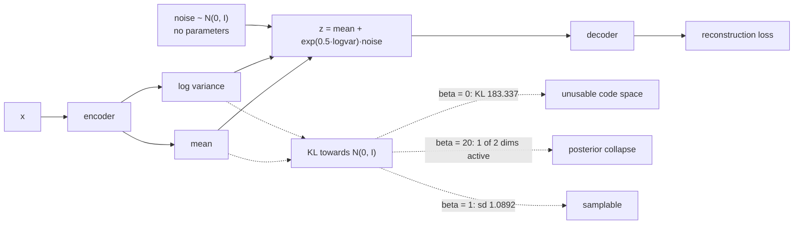

import DataCampExercise from "../../../../components/DataCampExercise.astro";
import Figure from "../../../../components/Figure.astro";
import Quiz from "../../../../components/Quiz.astro";

The [previous page](/deep-learning/phase-06---generative-deep-learning/autoencoders/)
ended on a specific failure: an autoencoder's code space has no shape, so sampling a
random code and decoding it produces nothing. A VAE fixes that with two changes — the
encoder outputs a **distribution** instead of a point, and the loss adds a term pulling
those distributions towards a standard normal.

Both changes have a dial, and the dial has two failure modes at its ends. Measured on
MNIST with a 2-dimensional latent:

| β (weight on KL) | Reconstruction MSE | KL (nats) | Spread of the means | Mean posterior variance | Active dimensions |
| --- | --- | --- | --- | --- | --- |
| **0** | **0.0433** | **183.337** | 10.6794 | 0.0001 | 2 of 2 |
| 0.5 | 0.0447 | 6.033 | 1.1980 | 0.0057 | 2 of 2 |
| **1** | 0.0450 | **5.366** | **1.0892** | 0.0104 | 2 of 2 |
| 4 | 0.0477 | 3.236 | 0.8950 | 0.0401 | 2 of 2 |
| **20** | **0.0617** | **0.318** | 0.4519 | **0.7459** | **1 of 2** |

At β = 0 it is an autoencoder with a noisy encoder and a latent 10× wider than the prior.
At β = 20 the latent carries almost nothing. The useful range is narrow and the ends fail
in opposite directions.

## What you'll learn

- Why the encoder outputs a mean and a log-variance, and what the **reparameterisation
  trick** is for.
- The two loss terms, and the measured trade between them: reconstruction 0.0433 → 0.0617
  as KL falls 183.337 → 0.318.
- **Posterior collapse**, measured: at β = 20 only 1 of 2 latent dimensions stays active
  and the posterior variance rises to 0.7459 (the prior's is 1.0).
- Why β = 1 produces an aggregate posterior that actually matches the prior — mean
  distance from the origin **1.2674** against **1.2533** expected.
- What the latent space looks like, and why interpolation works here and not in a plain
  autoencoder.

## Two changes to an autoencoder

$$
\mathcal{L} = \underbrace{\mathbb{E}_{q(z|x)}\left[-\log p(x|z)\right]}_{\text{reconstruction}}
+ \beta \cdot \underbrace{D_{\mathrm{KL}}\!\left(q(z|x)\;\|\;\mathcal{N}(0, I)\right)}_{\text{keep the code space usable}}
$$

The second term is the whole difference. It penalises encoders whose output distribution
strays from a standard normal, which makes the code space **dense** — every point near the
origin decodes to something plausible, because the encoder was pushed to use exactly that
region.

```python title="The encoder returns a distribution, not a point"
mean = keras.layers.Dense(latent)(x)
log_variance = keras.layers.Dense(latent)(x)

class Sampler(keras.layers.Layer):
    def call(self, inputs):
        mean, log_variance = inputs
        noise = tf.random.normal(tf.shape(mean))
        return mean + tf.exp(0.5 * log_variance) * noise      # <- reparameterisation
```

Sampling is not differentiable, but *this* form of it is: the randomness sits in `noise`,
which has no parameters, and the gradient flows through `mean` and `log_variance` as
ordinary tensors. That is the **reparameterisation trick**, and without it the encoder
could not be trained by backpropagation at all.

The KL term has a closed form for a diagonal Gaussian against a standard normal, which is
why it is one line rather than a Monte-Carlo estimate:

$$
D_{\mathrm{KL}} = -\tfrac{1}{2}\sum_{j}\left(1 + \log\sigma_j^2 - \mu_j^2 - \sigma_j^2\right)
$$

## The trade-off, measured

<Figure
  src="/images/dl/phase-06-generative/variational-autoencoders/beta-sweep"
  alt="Two panels. Left: reconstruction MSE against the KL weight, rising from 0.0433 at beta 0 to 0.0617 at beta 20. Right: KL divergence falling steeply from 183.337 at beta 0 to 0.318 at beta 20, with a second line showing the spread of the encoder means collapsing from 10.68 to 0.45."
  title="MNIST, 2-D latent, 25 epochs"
  caption="Reconstruction gets monotonically worse as the KL weight rises — that is the price of a usable code space, and at beta 1 it costs 0.0017 MSE against the unregularised version. The right panel shows what is being bought: at beta 0 the KL is 183.337 nats and the encoder means have a standard deviation of 10.68, so the codes live in a region the prior never visits. Sampling from the prior there is meaningless, exactly as on the previous page."
/>

The interesting column is **mean posterior variance**. At β = 0 it is 0.0001 — the encoder
has learned to make its distributions nearly deterministic, because noise only hurts
reconstruction. As β rises, the variances grow towards the prior's 1.0, and at β = 20 they
reach 0.7459: the encoder is now emitting nearly the prior regardless of its input, which
is what **posterior collapse** means. One of the two latent dimensions has stopped varying
with the input at all.

## Does the latent actually match the prior?

<Figure
  src="/images/dl/phase-06-generative/variational-autoencoders/latent-structure"
  alt="Two panels. Left: a scatter plot of 3,000 encoder means in two dimensions, coloured by digit class, forming a roughly circular cloud centred near the origin with visible class regions — 1s at the top right, 0s at the left. Right: histograms of distance from the origin for the encoder means and for samples from a standard normal, which overlap closely."
  title="beta = 1"
  caption="The right panel is the check that matters and is usually skipped: the aggregate posterior — the distribution of all encoder means together — should look like the prior, and here it does. Mean distance from the origin is 1.2674 against 1.2533 expected for a 2-D standard normal, and the aggregate standard deviation is 1.0892 against 1.0. That agreement is why sampling from the prior produces digits rather than mush."
/>

Per-digit centres from the same run show the structure the KL term buys:

| Digit | Centre | Spread |
| --- | --- | --- |
| 1 | (+2.29, −1.05) | 1.83 |
| 0 | (−1.58, +0.42) | 1.22 |
| 7 | (+0.83, +1.69) | 1.03 |
| 6 | (−1.06, −0.88) | 0.78 |
| 3 | (+0.03, +0.04) | **0.35** |

Digits `1` and `0` — the most visually distinctive — get pushed to the edges, while `3`,
`5` and `8` cluster near the origin with tiny spreads, which is precisely where the
decoder's samples are most ambiguous. A 2-dimensional latent cannot separate ten classes,
and this table shows exactly how it fails.

## Sampling and interpolation

<Figure
  src="/images/dl/phase-06-generative/variational-autoencoders/samples-and-interpolation"
  alt="Top: a 12 by 12 grid of decoded digits spanning the latent space from -2.5 to 2.5 in both dimensions, with recognisable digit types occupying contiguous regions and smooth morphing between them. Bottom: a strip of ten images interpolating between two encoded digits, each intermediate frame a plausible digit-like shape."
  title="The decoder over the prior, and a walk between two digits"
  caption="Every cell of the grid is a point sampled from the prior and decoded — no encoder involved. That works only because the KL term forced the encoder to use this region. The bottom strip is the property a plain autoencoder lacks: interpolating between two codes passes through plausible images rather than through empty space, because the code distribution is dense and connected."
/>

## Why VAE samples are blurry

Every VAE sample on this page is smooth, and it is not a bug in the implementation:

- The reconstruction term is a **per-pixel** likelihood. Its optimum is the conditional
  mean of all plausible images given the code, and an average of several sharp digits is a
  blurry digit.
- The 2-dimensional latent cannot carry enough information to disambiguate, so the
  conditional distribution is genuinely broad — the table above shows five digit classes
  sharing the region near the origin.
- The KL term *further* pushes codes together, which increases that overlap.

GANs replace the per-pixel likelihood with a learned discriminator and produce sharp
samples instead — along with a completely different set of failure modes, measured on the
[next page](/deep-learning/phase-06---generative-deep-learning/generative-adversarial-networks-gans/).



```p5 title="The reparameterisation trick" desc="Drag the mean and the log-variance. The blue cloud is what the encoder emits for one input; the dashed circle is the prior the KL term pulls it towards." height="340"
let meanX = 1.4;
let meanY = 0.6;
let logVariance = -1.2;
let dragging = "";
const POINTS = 220;
let noise = [];
function setup() {
  createCanvas(620, 340);
  textFont("monospace");
  let seed = 3;
  const rnd = () => {
    seed = (seed * 1103515245 + 12345) % 2147483648;
    return seed / 2147483648;
  };
  for (let i = 0; i < POINTS; i++) {
    const u1 = Math.max(rnd(), 1e-6);
    const u2 = rnd();
    const r = Math.sqrt(-2 * Math.log(u1));
    noise.push([r * Math.cos(2 * Math.PI * u2), r * Math.sin(2 * Math.PI * u2)]);
  }
}
function draw() {
  background(13, 17, 23);
  const cx = 210;
  const cy = 170;
  const unit = 52;
  const sd = Math.exp(0.5 * logVariance);
  stroke(70, 80, 96);
  noFill();
  drawingContext.setLineDash([5, 5]);
  circle(cx, cy, 2 * unit);
  circle(cx, cy, 4 * unit);
  drawingContext.setLineDash([]);
  noStroke();
  fill(120, 130, 145);
  textSize(9);
  text("prior sd 1", cx + unit + 4, cy - 6);
  for (const [a, b] of noise) {
    const x = meanX + sd * a;
    const y = meanY + sd * b;
    fill(107, 169, 221, 120);
    circle(cx + x * unit, cy - y * unit, 4);
  }
  fill(255, 211, 67);
  circle(cx + meanX * unit, cy - meanY * unit, 12);
  noStroke();
  fill(230);
  textSize(11);
  textAlign(LEFT, TOP);
  text("q(z|x) = N(mean, sd^2)", 30, 20);
  fill(200);
  textSize(10.5);
  text("mean (" + meanX.toFixed(2) + ", " + meanY.toFixed(2) + ")   sd "
    + sd.toFixed(3), 30, 40);
  // KL for a 2-D diagonal Gaussian against N(0, I)
  const variance = sd * sd;
  const kl = -0.5 * (2 * (1 + logVariance) - (meanX * meanX + meanY * meanY)
    - 2 * variance);
  fill(255, 211, 67);
  textSize(13);
  textAlign(LEFT, TOP);
  text("KL = " + kl.toFixed(3) + " nats", 400, 24);
  fill(150);
  textSize(9.5);
  text("0 only when mean = 0", 400, 46);
  text("and sd = 1", 400, 60);
  fill(60, 70, 84);
  rect(400, 100, 180, 24, 3);
  fill(107, 169, 221);
  rect(400, 100, 180 * Math.min(kl / 12, 1), 24, 3);
  fill(150);
  textSize(10);
  textAlign(LEFT, TOP);
  text("drag the yellow point to move the mean", 30, 286);
  text("drag the slider to change the variance", 30, 302);
  fill(60, 70, 84);
  rect(330, 300, 250, 4, 2);
  fill(255, 211, 67);
  circle(330 + ((logVariance + 6) / 8) * 250, 302, 12);
  fill(120);
  textSize(9);
  text("log variance " + logVariance.toFixed(2), 330, 312);
}
function mousePressed() {
  if (Math.abs(mouseY - 302) < 12 && mouseX > 320) { dragging = "slider"; return; }
  dragging = "mean";
}
function mouseDragged() {
  if (dragging === "slider") {
    logVariance = Math.min(Math.max((mouseX - 330) / 250, 0), 1) * 8 - 6;
  } else if (dragging === "mean") {
    meanX = Math.max(-3.4, Math.min(3.4, (mouseX - 210) / 52));
    meanY = Math.max(-2.6, Math.min(2.6, (170 - mouseY) / 52));
  }
}
function mouseReleased() { dragging = ""; }
```

```p5 title="The measured table, ranked" desc="Click a column to rank every row by it. The bars are that column's values and the highest and lowest are computed from the numbers, not written in." height="280"
let metric = 0;
const COLUMNS = ["Reconstruction MSE", "KL (nats)", "Spread of the means", "Mean posterior variance"];
const ROWS = [
  ["0", 0.0433, 183.337, 10.6794, 0.0001],
  ["0.5", 0.0447, 6.033, 1.198, 0.0057],
  ["1", 0.045, 5.366, 1.0892, 0.0104],
  ["4", 0.0477, 3.236, 0.895, 0.0401],
  ["20", 0.0617, 0.318, 0.4519, 0.7459]
];
function setup() {
  createCanvas(620, 280);
  textFont("monospace");
}
function fmt(v) {
  if (v === 0) { return "0"; }
  const a = Math.abs(v);
  if (a >= 1000 || a < 0.001) { return v.toExponential(2); }
  if (a >= 100) { return v.toFixed(1); }
  return v.toFixed(4);
}
function draw() {
  background(13, 17, 23);
  noStroke();
  fill(230);
  textSize(12);
  textAlign(LEFT, TOP);
  text("Variational Autoencoders (VAE)", 26, 16);
  let x = 26;
  for (let i = 0; i < COLUMNS.length; i++) {
    const w = COLUMNS[i].length * 6.6 + 16;
    if (i === metric) { fill(255, 211, 67); } else { fill(48, 56, 68); }
    rect(x, 40, w, 22, 4);
    if (i === metric) { fill(13, 17, 23); } else { fill(180); }
    textSize(9);
    text(COLUMNS[i], x + 8, 47);
    x += w + 6;
    if (x > 500) { break; }
  }
  const values = ROWS.map((r) => r[metric + 1]);
  const lo = Math.min(...values);
  const hi = Math.max(...values);
  const span = hi - lo === 0 ? 1 : hi - lo;
  const order = ROWS.slice().sort((a, b) => b[metric + 1] - a[metric + 1]);
  for (let i = 0; i < order.length; i++) {
    const y = 78 + i * 26;
    const v = order[i][metric + 1];
    fill(160);
    textSize(9);
    text(order[i][0], 26, y + 5);
    fill(34, 40, 50);
    rect(230, y, 280, 18, 3);
    const frac = (v - lo) / span;
    if (v === hi) { fill(126, 192, 143); }
    else if (v === lo) { fill(224, 108, 117); }
    else { fill(107, 169, 221); }
    rect(230, y, Math.max(frac * 280, 3), 18, 3);
    fill(225);
    textSize(9);
    text(fmt(v), 518, y + 5);
  }
  const top = order[0];
  const bottom = order[order.length - 1];
  fill(150);
  textSize(9);
  const base = 78 + order.length * 26 + 8;
  text("highest " + COLUMNS[metric] + ": " + top[0] + " at " + fmt(top[1]),
       26, base);
  text("lowest  " + COLUMNS[metric] + ": " + bottom[0] + " at "
       + fmt(bottom[1]), 26, base + 14);
  text("bars are scaled within the chosen column - lowest is not zero", 26,
       base + 30);
}
function mousePressed() {
  let x = 26;
  for (let i = 0; i < COLUMNS.length; i++) {
    const w = COLUMNS[i].length * 6.6 + 16;
    if (mouseX > x && mouseX < x + w && mouseY > 40 && mouseY < 62) {
      metric = i;
    }
    x += w + 6;
  }
}
```

## Pitfalls

- **Setting β = 0 and calling it a VAE.** KL 183.337 and encoder means with sd 10.68 —
  the prior is irrelevant and sampling from it fails.
- **Setting β too high.** At 20 the KL fell to 0.318, one of two dimensions went inactive
  and reconstruction lost 0.0184 MSE.
- **Not checking the aggregate posterior.** The per-example KL can look fine while the
  *combined* distribution of means does not match the prior; here it did, at sd 1.0892
  against 1.0.
- **Sampling without the reparameterisation trick.** `tf.random.normal(mean, sd)` is not
  differentiable with respect to `mean`; `mean + exp(0.5·logvar)·noise` is.
- **Expecting sharp samples from a per-pixel likelihood.** Its optimum is the conditional
  mean, so blur is the objective working correctly.
- **Using a 2-D latent for ten classes and blaming the model.** Five digit classes shared
  the region near the origin with spreads under 0.5.
- **Overriding `metrics` or naming a method `_losses` in a Keras 3 subclass.** Both are
  taken; the second fails at the first training step with `'TrackedList' object is not
  callable`.

## Recap

- A VAE adds a distributional encoder plus a KL term; the reparameterisation trick is what
  makes the sampling differentiable.
- Measured trade: reconstruction MSE 0.0433 → 0.0617 as β goes 0 → 20, with KL falling
  183.337 → 0.318.
- β = 0 leaves encoder means at sd 10.68 — an autoencoder with a noisy encoder.
- β = 20 collapses the posterior: 1 of 2 dimensions active, mean posterior variance 0.7459
  against the prior's 1.0.
- At β = 1 the aggregate posterior matches the prior — mean distance 1.2674 against 1.2533
  expected — which is why prior samples decode to digits.
- Samples are blurry because a per-pixel likelihood's optimum is the conditional mean.

## Next

Replace the per-pixel likelihood with a learned discriminator and the samples get sharp —
along with a new set of ways to fail:
[Generative Adversarial Networks (GANs)](/deep-learning/phase-06---generative-deep-learning/generative-adversarial-networks-gans/).

<Quiz
  questions={[
    {
      q: "What does the reparameterisation trick solve?",
      options: [
        "It makes the KL term differentiable",
        "It makes sampling differentiable — writing z = mean + exp(0.5·logvar)·noise puts the randomness in a parameter-free tensor, so gradients flow through the mean and variance",
        "It reduces the variance of the reconstruction loss",
        "It removes the need for a decoder",
      ],
      answer: 1,
      explain: "Sampling directly from N(mean, sd) gives no gradient path back to mean or sd, so the encoder could not be trained by backpropagation.",
    },
    {
      q: "At beta = 0 the KL divergence was 183.337 nats and the encoder means had standard deviation 10.68. What kind of model is that?",
      options: [
        "A well-trained VAE",
        "An autoencoder with a noisy encoder — nothing pulls the codes towards the prior, so sampling from the prior lands nowhere near the region the encoder uses",
        "A model suffering posterior collapse",
        "A denoising autoencoder",
      ],
      answer: 1,
      explain: "Its reconstruction is the best of the sweep (0.0433) precisely because it ignores the constraint that makes generation possible.",
    },
    {
      q: "At beta = 20, one of two latent dimensions became inactive and the mean posterior variance rose to 0.7459. What is that called and why does it happen?",
      options: [
        "Overfitting — the model memorised the data",
        "Posterior collapse — the KL term dominates, so the cheapest solution is for the encoder to output the prior regardless of its input, and the latent stops carrying information",
        "Mode collapse — the decoder produces one output",
        "Vanishing gradients in the encoder",
      ],
      answer: 1,
      explain: "The prior's variance is 1.0, so a posterior variance approaching it means the encoder has stopped distinguishing inputs. Reconstruction rose to 0.0617 as a result.",
    },
    {
      q: "Why check the aggregate posterior — the distribution of all encoder means together — rather than just the loss?",
      options: [
        "Because the loss is not comparable across models",
        "Because prior sampling only works if the combined distribution of codes matches the prior; here mean distance from the origin was 1.2674 against 1.2533 expected for a 2-D standard normal",
        "Because the KL term is computed incorrectly by Keras",
        "Because it measures reconstruction quality",
      ],
      answer: 1,
      explain: "Per-example KL can be small while the aggregate distribution still has gaps or the wrong scale — and it is the aggregate that determines whether decoded prior samples look real.",
    },
    {
      q: "Why are VAE samples blurry?",
      options: [
        "The decoder is too small",
        "A per-pixel reconstruction likelihood is optimised by the conditional mean of all plausible images for that code — and averaging several sharp digits gives a blurry one",
        "The KL term smooths the output",
        "MNIST is low resolution",
      ],
      answer: 1,
      explain: "The 2-D latent makes it worse by leaving genuine ambiguity: five digit classes shared the region near the origin with spreads under 0.5.",
    },
  ]}
/>

## 🧪 Try It Yourself

<DataCampExercise
  lang="python"
  hint={`The KL for a diagonal Gaussian against a standard normal is -0.5 * sum(1 + logvar - mean^2 - exp(logvar)). It is zero only at mean 0 and variance 1.`}
  code={`# Task: Exercise 1 - The KL term, by hand
import numpy as np


def kl_divergence(mean, log_variance):
    """KL(N(mean, exp(logvar)) || N(0, I)), summed over dimensions."""
    return -0.5 * np.sum(1 + log_variance - mean ** 2
                         - np.exp(___), axis=-1)     # replace ___ with log_variance


CASES = (
    ("exactly the prior", [0.0, 0.0], [0.0, 0.0]),
    ("shifted mean", [1.0, 0.0], [0.0, 0.0]),
    ("far mean", [3.0, 0.0], [0.0, 0.0]),
    ("too narrow", [0.0, 0.0], [-4.0, -4.0]),
    ("too wide", [0.0, 0.0], [2.0, 2.0]),
    ("beta=0 regime", [10.0, 10.0], [-9.0, -9.0]),
)
print(f"{'case':20s} {'mean':>14} {'sd':>14} {'KL (nats)':>11}")
for label, mean, log_variance in CASES:
    mean = np.array(mean)
    log_variance = np.array(log_variance)
    sd = np.exp(0.5 * log_variance)
    print(f"{label:20s} {str(np.round(mean, 2).tolist()):>14} "
          f"{str(np.round(sd, 3).tolist()):>14} "
          f"{float(kl_divergence(mean, log_variance)):11.3f}")
print("the KL is zero only at mean 0 and variance 1, and it grows quadratically")
print("in the mean - which is why it pulls codes towards the origin")

# -- Expected Output -------------------------------------------
# case                           mean             sd   KL (nats)
# exactly the prior        [0.0, 0.0]     [1.0, 1.0]      -0.000
# shifted mean             [1.0, 0.0]     [1.0, 1.0]       0.500
# far mean                 [3.0, 0.0]     [1.0, 1.0]       4.500
# too narrow               [0.0, 0.0] [0.135, 0.135]       3.018
# too wide                 [0.0, 0.0] [2.718, 2.718]       4.389
# beta=0 regime          [10.0, 10.0] [0.011, 0.011]     108.000
# the KL is zero only at mean 0 and variance 1, and it grows quadratically
# in the mean - which is why it pulls codes towards the origin
# --------------------------------------------------------------`}
/>

<DataCampExercise
  lang="python"
  hint={`Put the randomness in a parameter-free tensor and scale it. Compare the gradient you get with and without doing so.`}
  code={`# Task: Exercise 2 - Why the trick is necessary
import tensorflow as tf

mean = tf.Variable([1.0, -0.5])
log_variance = tf.Variable([0.0, 0.0])

# The reparameterised sample: randomness in a constant, parameters outside it.
with tf.GradientTape() as tape:
    noise = tf.random.normal(tf.shape(mean), seed=0)
    z = mean + tf.exp(0.5 * log_variance) * ___   # replace ___ with noise
    loss = tf.reduce_sum(z ** 2)
gradients = tape.gradient(loss, [mean, log_variance])
print(f"reparameterised: gradient wrt mean {gradients[0].numpy()}")
print(f"reparameterised: gradient wrt log variance "
      f"{gradients[1].numpy()}")

# Sampling directly from the distribution: no path back to the parameters.
with tf.GradientTape() as tape:
    z = tf.random.normal(tf.shape(mean), mean=mean,
                         stddev=tf.exp(0.5 * log_variance), seed=0)
    loss = tf.reduce_sum(z ** 2)
direct = tape.gradient(loss, [mean, log_variance])
print(f"direct sampling: gradient wrt mean {direct[0]}")
print("None means the graph has no differentiable path: the encoder would")
print("never receive a gradient, which is exactly what the trick fixes")

# -- Expected Output -------------------------------------------
# reparameterised: gradient wrt mean [ ... two finite numbers ... ]
# reparameterised: gradient wrt log variance [ ... two finite numbers ... ]
# direct sampling: gradient wrt mean None
# None means the graph has no differentiable path: the encoder would
# never receive a gradient, which is exactly what the trick fixes
# --------------------------------------------------------------`}
/>

<DataCampExercise
  lang="python"
  hint={`Weight the KL term by beta in the training loss and watch both terms move in opposite directions.`}
  code={`# Task: Exercise 3 - The beta sweep, and posterior collapse
import numpy as np
import tensorflow as tf
from tensorflow import keras

(x_train, _), (x_test, _) = keras.datasets.mnist.load_data()
x_train = x_train[:12000].reshape(-1, 784).astype("float32") / 255.0
x_test = x_test[:3000].reshape(-1, 784).astype("float32") / 255.0
LATENT = 2


def build(beta, seed=0):
    keras.utils.set_random_seed(seed)

    class Sampler(keras.layers.Layer):
        def call(self, pair):
            mu, log_var = pair
            return mu + tf.exp(0.5 * log_var) * tf.random.normal(tf.shape(mu))

    inputs = keras.layers.Input((784,))
    h = keras.layers.Dense(256, activation="relu")(inputs)
    h = keras.layers.Dense(64, activation="relu")(h)
    mean = keras.layers.Dense(LATENT)(h)
    log_variance = keras.layers.Dense(LATENT)(h)
    encoder = keras.Model(inputs, [mean, log_variance,
                                   Sampler()([mean, log_variance])])
    latent_inputs = keras.layers.Input((LATENT,))
    d = keras.layers.Dense(64, activation="relu")(latent_inputs)
    d = keras.layers.Dense(256, activation="relu")(d)
    decoder = keras.Model(latent_inputs,
                          keras.layers.Dense(784, activation="sigmoid")(d))

    class VAE(keras.Model):
        def __init__(self):
            super().__init__()
            self.encoder, self.decoder, self.beta = encoder, decoder, beta

        def call(self, x):
            return self.decoder(self.encoder(x)[2])

        def train_step(self, batch):
            x = batch[0] if isinstance(batch, tuple) else batch
            with tf.GradientTape() as tape:
                mu, log_var, z = self.encoder(x)
                reconstruction = self.decoder(z)
                recon = tf.reduce_mean(
                    keras.losses.binary_crossentropy(x, reconstruction)) * 784
                kl = -0.5 * tf.reduce_mean(tf.reduce_sum(
                    1 + log_var - tf.square(mu) - tf.exp(log_var), axis=1))
                loss = recon + self.beta * ___     # replace ___ with kl
            self.optimizer.apply_gradients(
                zip(tape.gradient(loss, self.trainable_weights),
                    self.trainable_weights))
            return {"recon": recon, "kl": kl}

    model = VAE()
    model.compile(optimizer=keras.optimizers.Adam(1e-3))
    return model


print(f"{'beta':>6} {'recon MSE':>10} {'KL':>9} {'sd of means':>12} "
      f"{'posterior var':>14} {'active dims':>12}")
for beta in (0.0, 1.0, 20.0):
    model = build(beta)
    model.fit(x_train, epochs=15, batch_size=128, verbose=0)
    mean, log_variance, code = model.encoder.predict(x_test, verbose=0)
    reconstruction = model.decoder.predict(code, verbose=0)
    mse = float(np.mean((reconstruction - x_test) ** 2))
    kl = float(np.mean(-0.5 * np.sum(1 + log_variance - mean ** 2
                                     - np.exp(log_variance), axis=1)))
    print(f"{beta:6g} {mse:10.4f} {kl:9.3f} {mean.std():12.4f} "
          f"{float(np.exp(log_variance).mean()):14.4f} "
          f"{int((mean.std(axis=0) > 0.1).sum()):12d} of {LATENT}")
print("beta 0 leaves the codes far from the prior; beta 20 makes the encoder")
print("emit the prior regardless of input - posterior collapse")

# -- Expected Output -------------------------------------------
# (the page's 25-epoch run gave beta 0: MSE 0.0433, KL 183.337, sd 10.68;
#  beta 1: 0.0450, 5.366, 1.09; beta 20: 0.0617, 0.318, 0.45 with 1 of 2
#  dimensions active. Fifteen epochs will be close)
# --------------------------------------------------------------`}
/>

<DataCampExercise
  lang="python"
  hint={`Compare the distribution of all the encoder means against samples from a standard normal — the aggregate posterior, not the per-example one.`}
  code={`# Task: Exercise 4 - Does the aggregate posterior match the prior?
import numpy as np

# (a trained beta=1 'model' from Exercise 3, and x_test)

mean, log_variance, _ = model.encoder.predict(x_test, verbose=0)
prior = np.random.default_rng(0).standard_normal(mean.shape)

print(f"{'quantity':28s} {'encoder means':>14} {'standard normal':>16}")
print(f"{'mean':28s} {mean.mean():14.4f} {prior.mean():16.4f}")
print(f"{'standard deviation':28s} {mean.std():14.4f} {prior.std():16.4f}")
print(f"{'mean |z|':28s} "
      f"{np.linalg.norm(mean, axis=1).mean():14.4f} "
      f"{np.linalg.norm(prior, axis=___).mean():16.4f}")   # replace ___ with 1
print(f"{'per-dimension sd':28s} "
      f"{str(np.round(mean.std(axis=0), 3).tolist()):>14} "
      f"{str(np.round(prior.std(axis=0), 3).tolist()):>16}")
print("for a 2-D standard normal the expected distance from the origin is")
print(f"sqrt(pi/2) = {np.sqrt(np.pi / 2):.4f}")
print("if these columns disagree, prior samples will decode to nonsense even")
print("when the per-example KL looks small")

# -- Expected Output -------------------------------------------
# (on the page's run: encoder means had sd 1.0892 against 1.0, and mean
#  distance from the origin 1.2674 against 1.2533 — close agreement, which is
#  why decoding prior samples works)
# --------------------------------------------------------------`}
/>

<DataCampExercise
  lang="python"
  hint={`Decode a grid of points from the prior, then decode a straight line between two encoded digits. Both only work if the code space is dense.`}
  code={`# Task: Exercise 5 - Sampling and interpolation
import numpy as np

# (a trained beta=1 'model' and x_test)

GRID = 8
span = np.linspace(-2.5, 2.5, GRID)
codes = np.array([[a, b] for b in span[::-1] for a in span], "float32")
decoded = model.decoder.predict(codes, verbose=0)
print(f"decoded {len(codes)} points sampled from the prior")
print(f"mean ink per image {decoded.mean():.4f}  "
      f"mean peak {decoded.max(axis=1).mean():.4f}")
print(f"real digits for comparison: mean ink {x_test.mean():.4f}  "
      f"mean peak {x_test.max(axis=1).mean():.4f}")

mean, _, _ = model.encoder.predict(x_test[:2], verbose=0)
steps = np.linspace(0, 1, 10)[:, None]
path = ((1 - steps) * mean[0] + steps * ___).astype("float32")
# replace ___ with mean[1]
walk = model.decoder.predict(path, verbose=0)
differences = np.abs(np.diff(walk, axis=0)).mean(axis=1)
print(f"interpolation: mean change between consecutive frames "
      f"{differences.mean():.4f}")
print(f"largest jump {differences.max():.4f} at step "
      f"{int(differences.argmax()) + 1}")
print("a smooth walk means the code space has no holes between these two")
print("digits - the property the KL term bought and a plain autoencoder lacks")

# -- Expected Output -------------------------------------------
# (the decoded prior samples have ink and peak statistics close to real
#  digits, and the interpolation changes gradually with no single large jump)
# --------------------------------------------------------------`}
/>
