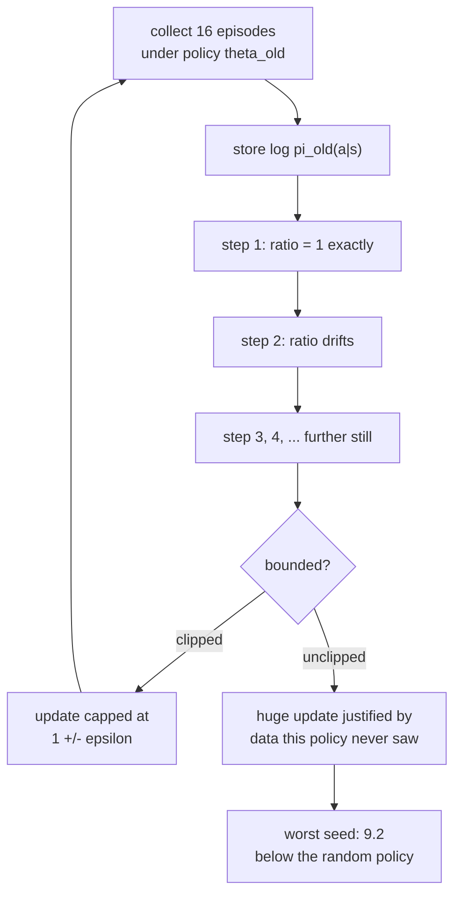

[Policy gradients](/deep-learning/phase-07---reinforcement-learning/policy-gradients-intro/)
ended with a working method and an unflattering number: REINFORCE's baseline cut the
gradient norm 35× and moved the final score by 0.27. Variance reduction that changes
nothing is a strange result to leave standing.

This page takes the two standard next steps and measures both. **Actor-critic** replaces
the batch-mean baseline with a learned value function. **PPO** attacks a different axis
entirely — not the variance of each update, but how many updates you can extract from
each batch of experience.

One of them makes a large difference here and the other does not.

## What you'll learn

- Why a learned critic is a better baseline than a batch mean, and what it cost here.
- The PPO clipped objective derived, and what the ratio $r_t(\theta)$ actually measures.
- The measured result: **170 episodes to target against 544**, a 3.2× sample-efficiency win.
- When the clip matters — measured by sweeping until it does.
- Why "PPO is more stable" is a claim about the **worst seed**, not the average.

## The four methods

All on the same CartPole, the same 16-episode batches, the same 120 updates, three seeds
each. The environment is the hand-written vectorised one from `_rl.py`; a random policy
survives 23.09 steps and the episode cap is 200.

| Method | Weight on each log-probability |
| --- | --- |
| REINFORCE | the raw discounted return $G_t$ |
| + batch-mean baseline | $(G_t - \bar{G}) / \sigma_G$ |
| + learned critic | $(G_t - V_\phi(s_t))$, whitened |
| PPO | the same advantage, but four clipped gradient steps per batch |

<Figure
  src="/images/dl/phase-07-rl/actor-critic-and-ppo/learning-curves"
  alt="Mean episode length against update number for four methods, each with a shaded min-to-max band across three seeds. All four rise from about 20 toward the 200 cap. PPO's curve rises fastest, crossing the dashed target line at 150 well before the other three, which stay close together."
  title="CartPole, 3 seeds, band is min to max"
  caption="All four methods solve CartPole — final scores 193.9, 194.2, 195.0 and 199.9 — which is the first thing to say plainly. On a task this easy, the ranking by final score is nearly meaningless: the gap between best and worst is 6.0 against an episode cap of 200. What separates them is how fast they get there, and PPO's curve is the only one that is clearly different."
/>

| Method | Final score | Episodes to reach 150 | Seeds solved | Seconds |
| --- | --- | --- | --- | --- |
| REINFORCE (raw returns) | 193.9 | 544 | 3/3 | 30.2 |
| + batch-mean baseline | 194.2 | 624 | 3/3 | 35.7 |
| + learned critic | 195.0 | 613 | 3/3 | 43.0 |
| **PPO (4 steps per batch)** | **199.9** | **170** | 3/3 | 52.4 |

:::caution[The critic did not pay for itself here]
A learned baseline scored 195.0 against the batch mean's 194.2 and reached the target in
613 episodes against 624 — inside the noise, for 43.0 seconds against 35.7 and a second
network to train. On CartPole the batch mean is already a good baseline, because episode
returns within a batch are similar and the state-dependence a critic adds has little to
predict. Reporting this as "actor-critic improves on REINFORCE" would be reading a 0.8
difference on a scale where the seeds spread further than that.
:::

That leaves PPO, whose win is not on the score axis at all.

## Sample efficiency is the axis that moved

<Figure
  src="/images/dl/phase-07-rl/actor-critic-and-ppo/sample-efficiency"
  alt="Left: bars of episodes needed to first reach mean length 150, showing REINFORCE at 544, batch-mean baseline at 624, learned critic at 613 and PPO far lower at 170. Right: bars of wall-clock seconds for 120 updates, rising from 30.2 for REINFORCE to 52.4 for PPO."
  title="3 seeds each, mean over the seeds that reached the target"
  caption="PPO needed 170 episodes of environment interaction against REINFORCE's 544 — 3.2x fewer — while costing 1.7x the wall clock. That trade is the entire argument. On CartPole, where an episode costs microseconds, it is a bad trade; on a robot, a simulator that runs slower than real time, or anything where interaction is the expensive part, it is the only trade that matters."
/>

Every method here consumed exactly **1,920 episodes** over 120 updates, because the batch
size is fixed. The difference is where they were on the curve when they had spent 170 of
them.

The mechanism is direct: REINFORCE takes **one** gradient step per batch and then throws
the data away. PPO takes **four**. Four times the learning from the same experience, if
the four steps are all valid — and the reason they are not all valid by default is the
whole reason PPO exists.

## Why you cannot just take four steps

The policy-gradient estimator is only correct for the policy that *collected* the data.
After one gradient step the policy has changed, so the second step is computed on
experience from a policy that no longer exists. PPO makes that explicit with a
probability ratio:

$$
r_t(\theta) = \frac{\pi_\theta(a_t \mid s_t)}{\pi_{\theta_{\text{old}}}(a_t \mid s_t)}
$$

At the first gradient step $\theta = \theta_{\text{old}}$, so $r_t = 1$ exactly. As the
steps accumulate, $r_t$ drifts away from 1 — and an advantage multiplied by a large ratio
produces an enormous update justified by data the current policy would never have
generated.

The clipped objective bounds that:

$$
L^{\text{CLIP}}(\theta) = \mathbb{E}_t\left[\min\Bigl(r_t(\theta)\,\hat{A}_t,\;
\operatorname{clip}\bigl(r_t(\theta),\, 1-\epsilon,\, 1+\epsilon\bigr)\,\hat{A}_t\Bigr)\right]
$$

The $\min$ is what makes it a bound rather than a rescaling. When $\hat{A}_t > 0$ and the
ratio has already climbed past $1 + \epsilon$, the clipped term is smaller and gets
chosen — there is no further gradient for making an already-favoured action more likely.
When $\hat{A}_t < 0$ and the ratio has fallen below $1 - \epsilon$, the same logic applies
in reverse. Improvements outside the trust region are simply not counted.

```python
ratio = tf.exp(log_probability - old_log)
clipped = tf.clip_by_value(ratio, 1 - clip, 1 + clip)
loss = -tf.reduce_mean(tf.minimum(ratio * advantages, clipped * advantages))
```



## When the clip actually matters

The obvious experiment is to remove the clip and watch PPO fail. It was run at the
page's default of four gradient steps per batch, and it did not fail: **199.9 with the
clip against 199.4 without**. That is a null result, and the reason is measurable — after
four steps the policy has barely moved, so there is nothing for a trust region to bound.

So the sweep was extended until there was:

<Figure
  src="/images/dl/phase-07-rl/actor-critic-and-ppo/clipping"
  alt="Left: grouped bars of final episode length at 1, 4, 16 and 32 gradient steps per batch, with and without the clip. The two are equal at 1 and 4 steps; at 16 the unclipped bar drops to 129.3 and at 32 to 70.2 while the clipped bars stay near 195. Right: mean and worst-seed lines for both, showing the unclipped worst seed falling to 9.2 at 16 steps and 9.4 at 32, below the dotted random-policy line at 23.09."
  title="Same episode budget, only the number of gradient steps per batch changes"
  caption="At 1 and 4 steps the clip is measurably worthless — 198.3 against 198.3, and 199.9 against 199.4. At 16 it is the difference between 194.7 and 129.3, and the right panel shows where that average comes from: the unclipped worst seed scored 9.2, which is below the 23.09 a random policy gets. The clip does not make the average better; it stops one run in three from destroying itself."
/>

| Gradient steps per batch | Clipped | Clipped, worst seed | Unclipped | Unclipped, worst seed |
| --- | --- | --- | --- | --- |
| 1 | 198.3 | 197.3 | 198.3 | 197.3 |
| 4 | 199.9 | 199.7 | 199.4 | 198.5 |
| 16 | 194.7 | 185.0 | **129.3** | **9.2** |
| 32 | 196.6 | 191.5 | **70.2** | 9.4 |

Three things worth stating precisely:

**At one step the two are byte-for-byte equivalent.** The ratio is exactly 1 for every
sample, the clip never binds, and both columns read 198.3. That is a correctness check on
the implementation as much as a result.

**The failure is a variance failure.** At 16 steps the unclipped mean of 129.3 is not
three mediocre runs; it is two runs near 190 and one at 9.2 — worse than acting at
random. The clip's contribution is bounding the worst case, which is exactly what the
word "proximal" is about and exactly what a mean-only report would hide.

**More steps is not monotonically better even with the clip.** 199.9 at four steps,
194.7 at sixteen, 196.6 at thirty-two. Past a point the extra steps are extracting
increasingly stale signal, and the clip prevents disaster rather than delivering gains.

:::note[A drift measurement that did not work]
The natural diagnostic is the share of samples whose ratio leaves the trust region, and
it was measured: 0.0000, 0.0000, 0.0000 and 0.1325 at 1, 4, 16 and 32 steps. That column
is nearly useless, and the reason is instructive — it is taken on the *final* batch of
the run, and a policy that has already collapsed to near-deterministic produces ratios
back near 1. The diagnostic only reports drift while learning is still happening, so it
misses the exact runs it was meant to catch. The worst-seed column replaced it.
:::

## What actor-critic is still for

The critic earned nothing on CartPole, so it is worth being explicit about the condition
under which it does, rather than leaving the impression that it never does.

A batch-mean baseline subtracts the same number from every state's return. It therefore
cannot express "this state was always going to score badly, so a below-average return
here is not the action's fault". A learned $V_\phi(s)$ can. That distinction is worth
nothing when all states in a batch have similar value — which on CartPole they do, since
every non-terminal state is worth roughly the same — and worth a great deal when they do
not, as in any task with distinct good and bad regions.

The measured cost of carrying it: **43.0 s against 35.7 s**, a second network, and one
more learning rate to get wrong.

```p5 title="How far can one batch be reused?" desc="Drag to set the gradient steps per batch, then toggle the clip. The bars are the measured mean and the worst of three seeds." height="380"
let index = 1;
let clipped = true;
const STEPS = [1, 4, 16, 32];
const CLIP_MEAN = [198.3, 199.9, 194.7, 196.6];
const CLIP_WORST = [197.3, 199.7, 185.0, 191.5];
const OPEN_MEAN = [198.3, 199.4, 129.3, 70.2];
const OPEN_WORST = [197.3, 198.5, 9.2, 9.4];
const RANDOM = 23.09;
const CAP = 200;
function setup() {
  createCanvas(620, 380);
  textFont("monospace");
}
function draw() {
  background(13, 17, 23);
  noStroke();
  fill(230);
  textSize(12);
  textAlign(LEFT, TOP);
  text("PPO on CartPole - same 1,920 episodes either way", 26, 18);
  fill(150);
  textSize(10);
  text("gradient steps per batch: " + STEPS[index], 26, 44);
  fill(48, 56, 68);
  rect(26, 68, 360, 5, 2);
  for (let i = 0; i < STEPS.length; i++) {
    const x = 26 + (i / (STEPS.length - 1)) * 360;
    if (i === index) { fill(255, 211, 67); } else { fill(90, 102, 118); }
    circle(x, 70, i === index ? 14 : 9);
  }
  if (clipped) { fill(126, 192, 143); } else { fill(48, 56, 68); }
  rect(430, 58, 44, 22, 11);
  fill(13, 17, 23);
  circle(clipped ? 463 : 441, 69, 16);
  fill(clipped ? 230 : 130);
  textSize(10);
  text(clipped ? "clip 0.2 ON" : "clip OFF", 484, 64);
  const mean = clipped ? CLIP_MEAN[index] : OPEN_MEAN[index];
  const worst = clipped ? CLIP_WORST[index] : OPEN_WORST[index];
  const rows = [["mean of 3 seeds", mean], ["worst seed", worst]];
  for (let i = 0; i < 2; i++) {
    const y = 116 + i * 68;
    fill(190);
    textSize(11);
    text(rows[i][0], 26, y);
    fill(40, 47, 58);
    rect(26, y + 20, 460, 26, 3);
    const v = rows[i][1];
    if (v < RANDOM) { fill(224, 108, 117); }
    else if (v > 150) { fill(126, 192, 143); }
    else { fill(255, 211, 67); }
    rect(26, y + 20, (v / CAP) * 460, 26, 3);
    fill(238);
    textSize(11);
    text(v.toFixed(1), 496, y + 26);
  }
  stroke(150);
  strokeWeight(1);
  const rx = 26 + (RANDOM / CAP) * 460;
  line(rx, 130, rx, 250);
  noStroke();
  fill(150);
  textSize(8.5);
  text("random 23.09", rx + 4, 252);
  fill(150);
  textSize(9.5);
  if (index < 2) {
    text("the clip changes nothing here - after this few steps the policy", 26, 286);
    text("has barely moved, so there is no trust region to enforce.", 26, 300);
  } else if (clipped) {
    text("held together. The clip costs a little average performance and", 26, 286);
    text("buys a worst case that is still a working policy.", 26, 300);
  } else {
    text("one seed in three destroyed itself - below a random policy -", 26, 286);
    text("because a large ratio scaled an advantage computed from data", 26, 300);
    text("this policy would never have generated.", 26, 314);
  }
  fill(110);
  textSize(9);
  text("PPO at 4 steps reached the target in 170 episodes; REINFORCE needed 544.", 26, 344);
}
function mousePressed() {
  if (mouseX > 430 && mouseX < 474 && mouseY > 58 && mouseY < 80) {
    clipped = !clipped;
    return;
  }
  mouseDragged();
}
function mouseDragged() {
  if (mouseY < 52 || mouseY > 92 || mouseX > 400) { return; }
  const t = Math.min(Math.max((mouseX - 26) / 360, 0), 1);
  index = Math.round(t * (STEPS.length - 1));
}
```

```p5 title="The measured table, ranked" desc="Click a column to rank every row by it. The bars are that column's values and the highest and lowest are computed from the numbers, not written in." height="254"
let metric = 0;
const COLUMNS = ["Clipped", "Clipped, worst seed", "Unclipped", "Unclipped, worst seed"];
const ROWS = [
  ["1", 198.3, 197.3, 198.3, 197.3],
  ["4", 199.9, 199.7, 199.4, 198.5],
  ["16", 194.7, 185, 129.3, 9.2],
  ["32", 196.6, 191.5, 70.2, 9.4]
];
function setup() {
  createCanvas(620, 254);
  textFont("monospace");
}
function fmt(v) {
  if (v === 0) { return "0"; }
  const a = Math.abs(v);
  if (a >= 1000 || a < 0.001) { return v.toExponential(2); }
  if (a >= 100) { return v.toFixed(1); }
  return v.toFixed(4);
}
function draw() {
  background(13, 17, 23);
  noStroke();
  fill(230);
  textSize(12);
  textAlign(LEFT, TOP);
  text("Actor-Critic and PPO (Intro)", 26, 16);
  let x = 26;
  for (let i = 0; i < COLUMNS.length; i++) {
    const w = COLUMNS[i].length * 6.6 + 16;
    if (i === metric) { fill(255, 211, 67); } else { fill(48, 56, 68); }
    rect(x, 40, w, 22, 4);
    if (i === metric) { fill(13, 17, 23); } else { fill(180); }
    textSize(9);
    text(COLUMNS[i], x + 8, 47);
    x += w + 6;
    if (x > 500) { break; }
  }
  const values = ROWS.map((r) => r[metric + 1]);
  const lo = Math.min(...values);
  const hi = Math.max(...values);
  const span = hi - lo === 0 ? 1 : hi - lo;
  const order = ROWS.slice().sort((a, b) => b[metric + 1] - a[metric + 1]);
  for (let i = 0; i < order.length; i++) {
    const y = 78 + i * 26;
    const v = order[i][metric + 1];
    fill(160);
    textSize(9);
    text(order[i][0], 26, y + 5);
    fill(34, 40, 50);
    rect(230, y, 280, 18, 3);
    const frac = (v - lo) / span;
    if (v === hi) { fill(126, 192, 143); }
    else if (v === lo) { fill(224, 108, 117); }
    else { fill(107, 169, 221); }
    rect(230, y, Math.max(frac * 280, 3), 18, 3);
    fill(225);
    textSize(9);
    text(fmt(v), 518, y + 5);
  }
  const top = order[0];
  const bottom = order[order.length - 1];
  fill(150);
  textSize(9);
  const base = 78 + order.length * 26 + 8;
  text("highest " + COLUMNS[metric] + ": " + top[0] + " at " + fmt(top[1]),
       26, base);
  text("lowest  " + COLUMNS[metric] + ": " + bottom[0] + " at "
       + fmt(bottom[1]), 26, base + 14);
  text("bars are scaled within the chosen column - lowest is not zero", 26,
       base + 30);
}
function mousePressed() {
  let x = 26;
  for (let i = 0; i < COLUMNS.length; i++) {
    const w = COLUMNS[i].length * 6.6 + 16;
    if (mouseX > x && mouseX < x + w && mouseY > 40 && mouseY < 62) {
      metric = i;
    }
    x += w + 6;
  }
}
```

## Pitfalls

- **Reading the final scores.** All four methods land between 193.9 and 199.9 on a task
  capped at 200. The ranking there is noise; the sample-efficiency column is the result.
- **Claiming the critic helped.** 195.0 against 194.2, for 43.0 s against 35.7 s and a
  second network. On CartPole it did not.
- **Testing the clip at four steps.** It measured 199.9 against 199.4 — a null result that
  would wrongly suggest the clip is decorative. It binds from 16 steps.
- **Reporting only the mean when the failure is variance.** Unclipped at 16 steps averages
  129.3; its worst seed is 9.2, below random. Those are different findings.
- **Assuming more reuse is better.** 199.9 at 4 steps, 194.7 at 16, 196.6 at 32, even with
  the clip.
- **Forgetting to store the old log-probabilities.** $r_t$ needs
  $\pi_{\theta_{\text{old}}}$, captured *before* the first step. Recomputing it inside the
  loop makes every ratio exactly 1 and silently turns PPO back into repeated REINFORCE.
- **Using `model.predict` in the rollout.** ~470 ms per call against ~1.2 ms for a traced
  `tf.function`, and this page makes one call per environment frame.

## Recap

- All four methods solved CartPole — 193.9, 194.2, 195.0 and 199.9 — so the final score
  separates nothing on this task.
- **PPO reached mean length 150 in 170 episodes against REINFORCE's 544**, a 3.2×
  sample-efficiency win, for 1.7× the wall clock.
- The mechanism is reuse: four gradient steps per batch instead of one, made valid by
  bounding the probability ratio $r_t(\theta)$ inside $1 \pm 0.2$.
- **A learned critic bought 0.8 points and 613 episodes against 624** — nothing, on a task
  where every state has roughly the same value. It is worth carrying where state values
  genuinely differ.
- **The clip is worthless at 4 steps and decisive at 16**: 194.7 against 129.3, with the
  unclipped worst seed at 9.2, below the random policy's 23.09.
- At one gradient step per batch the clipped and unclipped runs are identical (198.3 both),
  because $r_t = 1$ exactly — which doubles as a correctness check.

## Next

That is the reinforcement-learning phase.
[Phase 8 — Scaling & Deploying Deep Models](/deep-learning/phase-08---scaling--deploying-deep-models/phase-8---scaling--deploying-deep-models/)
turns to getting any of these models out of a notebook.

<Quiz
  questions={[
    {
      q: "All four methods finished between 193.9 and 199.9 on a task capped at 200. What does that make the final-score column?",
      options: [
        "The main result",
        "Nearly uninformative — the task is saturated, so the methods have to be separated on another axis, which here is episodes to reach the target",
        "Evidence that PPO is best",
        "A sign the environment is broken"
      ],
      answer: 1,
      explanation: "A metric with a ceiling stops discriminating once everything reaches it. PPO's 170 episodes against 544 is the finding; its 199.9 against 193.9 is not."
    },
    {
      q: "Removing PPO's clip at four gradient steps per batch gave 199.4 against 199.9 — no measurable difference. Why?",
      options: [
        "The clip is decorative",
        "After four steps the policy has barely moved from the one that collected the data, so the ratio stays near 1 and the trust region never binds",
        "The clip was implemented incorrectly",
        "CartPole is too simple for PPO"
      ],
      answer: 1,
      explanation: "The clip bounds drift, and at four steps there is almost none. Sweeping to 16 steps produces 194.7 against 129.3, which is where the mechanism starts doing work."
    },
    {
      q: "Unclipped PPO at 16 steps averaged 129.3, with individual seeds at roughly 190, 190 and 9.2. What does the clip actually provide?",
      options: [
        "A higher average score",
        "A bounded worst case — it stops one run in three from destroying itself, which is what 'proximal' refers to and what a mean-only report hides",
        "Faster convergence",
        "Lower memory use"
      ],
      answer: 1,
      explanation: "The clipped mean at 16 steps (194.7) is actually below the clipped mean at 4 steps (199.9). The clip is insurance, and insurance shows up in the tail rather than the average."
    },
    {
      q: "A learned critic scored 195.0 against a batch-mean baseline's 194.2, for 43.0 s against 35.7 s. Under what condition would the critic be worth it?",
      options: [
        "Always — a learned baseline is strictly better",
        "When states in a batch have genuinely different values, so that a single subtracted number cannot express 'this state was always going to score badly'",
        "When the learning rate is higher",
        "When episodes are shorter"
      ],
      answer: 1,
      explanation: "On CartPole every non-terminal state is worth roughly the same, so the state-dependence a critic adds has nothing to predict. The mechanism is sound; this task cannot show it."
    },
    {
      q: "At one gradient step per batch, the clipped and unclipped runs both scored exactly 198.3. Why is that worth reporting?",
      options: [
        "It fills a row in the table",
        "Because at one step r_t = 1 for every sample by construction, so the clip cannot bind — an identical result is a correctness check on the implementation",
        "It shows one step is optimal",
        "It proves the seeds were fixed correctly"
      ],
      answer: 1,
      explanation: "If those two numbers had differed, something in the ratio computation or the stored old log-probabilities would be wrong. The check costs one extra run."
    },
    {
      q: "What happens if you recompute the old log-probabilities inside the inner loop instead of storing them before the first step?",
      options: [
        "Nothing — it is equivalent",
        "Every ratio becomes exactly 1, the clip never binds, and PPO silently degrades into taking several plain policy-gradient steps on stale data",
        "The loss becomes negative",
        "Training crashes"
      ],
      answer: 1,
      explanation: "The bug is silent: training runs, the loss looks reasonable, and the mechanism that made multi-step reuse safe is simply absent. The 16-step unclipped column shows what that costs."
    }
  ]}
/>

## 🧪 Try It Yourself

<DataCampExercise
  lang="python"
  hint={`The clipped objective takes the minimum of the raw and clipped terms, and the sign of the advantage decides which side binds.`}
  code={`# Task: Exercise 1 - What the clipped objective does to a ratio
import numpy as np

CLIP = 0.2
ratios = np.array([0.5, 0.8, 0.95, 1.0, 1.05, 1.2, 1.5, 3.0])

print(f"{'ratio':>7} {'A = +1':>10} {'A = -1':>10} {'binds?':>9}")
for ratio in ratios:
    clipped = np.clip(ratio, 1 - CLIP, 1 + ___)      # replace ___ with CLIP
    positive = min(ratio * 1.0, clipped * 1.0)
    negative = min(ratio * -1.0, clipped * -1.0)
    binds = "yes" if abs(ratio - clipped) > 1e-9 else "no"
    print(f"{ratio:7.2f} {positive:10.3f} {negative:10.3f} {binds:>9}")

print("\\nwith a POSITIVE advantage the objective stops rising past 1.2 - there")
print("is no more reward for making an already-favoured action likelier.")
print("With a NEGATIVE advantage it stops falling below 0.8. Outside the")
print("band the gradient is exactly zero, which is what bounds the step")`}
  solution={`import numpy as np

CLIP = 0.2
ratios = np.array([0.5, 0.8, 0.95, 1.0, 1.05, 1.2, 1.5, 3.0])

print(f"{'ratio':>7} {'A = +1':>10} {'A = -1':>10} {'binds?':>9}")
for ratio in ratios:
    clipped = np.clip(ratio, 1 - CLIP, 1 + CLIP)
    positive = min(ratio * 1.0, clipped * 1.0)
    negative = min(ratio * -1.0, clipped * -1.0)
    binds = "yes" if abs(ratio - clipped) > 1e-9 else "no"
    print(f"{ratio:7.2f} {positive:10.3f} {negative:10.3f} {binds:>9}")

print("\\nwith a POSITIVE advantage the objective stops rising past 1.2 - there")
print("is no more reward for making an already-favoured action likelier.")
print("With a NEGATIVE advantage it stops falling below 0.8. Outside the")
print("band the gradient is exactly zero, which is what bounds the step")`}
  sct={`test_output_contains("ratio     A = +1     A = -1    binds?", pattern=False)
test_output_contains("1.50      1.200     -1.500       yes", pattern=False)
success_msg("Outside the 0.8 to 1.2 band the clipped objective stops rewarding a bigger ratio, which is what bounds the policy step.")`}
  height={400}
/>

<DataCampExercise
  lang="python"
  hint={`Subtract a constant from every return, then subtract a per-state prediction, and compare the spread of what is left.`}
  code={`# Task: Exercise 2 - What a learned baseline can express that a mean cannot
import numpy as np

rng = np.random.default_rng(0)
# Two kinds of state: one where every action does well, one where none do.
good = rng.normal(180, 8, 400)
bad = rng.normal(40, 8, 400)
returns = np.concatenate([good, bad])
values = np.concatenate([np.full(400, 180.0), np.full(400, 40.0)])

mean_baseline = returns - returns.mean()
critic_baseline = returns - ___                    # replace ___ with values

for label, advantages in (("batch mean", mean_baseline),
                          ("learned critic", critic_baseline)):
    print(f"{label:16s} sd {advantages.std():8.3f}  "
          f"mean |A| {np.abs(advantages).mean():8.3f}")

wrong = int((mean_baseline[400:] < -50).sum())
print(f"\\nwith a batch mean, {wrong} of 400 actions in the bad state get an")
print("advantage below -50 purely for being in that state - the action may")
print("have been the best available one. The critic gives those a spread")
print("around zero, which is the signal you actually wanted")
print("\\non CartPole every state is worth about the same, so the two columns")
print("nearly coincide - which is why the critic bought 0.8 points there")`}
  solution={`import numpy as np

rng = np.random.default_rng(0)
good = rng.normal(180, 8, 400)
bad = rng.normal(40, 8, 400)
returns = np.concatenate([good, bad])
values = np.concatenate([np.full(400, 180.0), np.full(400, 40.0)])

mean_baseline = returns - returns.mean()
critic_baseline = returns - values

for label, advantages in (("batch mean", mean_baseline),
                          ("learned critic", critic_baseline)):
    print(f"{label:16s} sd {advantages.std():8.3f}  "
          f"mean |A| {np.abs(advantages).mean():8.3f}")

wrong = int((mean_baseline[400:] < -50).sum())
print(f"\\nwith a batch mean, {wrong} of 400 actions in the bad state get an")
print("advantage below -50 purely for being in that state - the action may")
print("have been the best available one. The critic gives those a spread")
print("around zero, which is the signal you actually wanted")
print("\\non CartPole every state is worth about the same, so the two columns")
print("nearly coincide - which is why the critic bought 0.8 points there")`}
  sct={`test_output_contains("learned critic   sd    8.002", pattern=False)
test_output_contains("400 of 400 actions", pattern=False)
success_msg("A learned critic gives a state-dependent baseline, so actions are judged against what was expected in their own state rather than against the batch mean.")`}
  height={400}
/>

<DataCampExercise
  lang="python"
  hint={`Simulate the policy drifting a little on each gradient step and track how many samples leave the band.`}
  code={`# Task: Exercise 3 - How fast does a batch go stale?
import numpy as np

rng = np.random.default_rng(0)
CLIP, SAMPLES = 0.2, 2000
DRIFT = 0.035                # log-probability change per gradient step

log_old = np.log(rng.uniform(0.3, 0.9, SAMPLES))
print(f"{'step':>6} {'mean ratio':>12} {'largest ratio':>15} {'outside band':>14}")
for step in range(1, 33):
    log_new = log_old + rng.normal(0, DRIFT, SAMPLES) * np.sqrt(step)
    ratio = np.exp(log_new - ___)               # replace ___ with log_old
    outside = float((np.abs(ratio - 1) > CLIP).mean())
    if step in (1, 2, 4, 8, 16, 32):
        print(f"{step:6d} {ratio.mean():12.4f} {ratio.max():15.4f} "
              f"{outside:14.2%}")

print("\\nthe share outside the trust region grows with the square root of")
print("the step count, and the LARGEST ratio grows much faster than the mean.")
print("That tail is the problem: one sample with a ratio of 2 and a large")
print("advantage contributes an update no single trajectory has earned")`}
  solution={`import numpy as np

rng = np.random.default_rng(0)
CLIP, SAMPLES = 0.2, 2000
DRIFT = 0.035

log_old = np.log(rng.uniform(0.3, 0.9, SAMPLES))
print(f"{'step':>6} {'mean ratio':>12} {'largest ratio':>15} {'outside band':>14}")
for step in range(1, 33):
    log_new = log_old + rng.normal(0, DRIFT, SAMPLES) * np.sqrt(step)
    ratio = np.exp(log_new - log_old)
    outside = float((np.abs(ratio - 1) > CLIP).mean())
    if step in (1, 2, 4, 8, 16, 32):
        print(f"{step:6d} {ratio.mean():12.4f} {ratio.max():15.4f} "
              f"{outside:14.2%}")

print("\\nthe share outside the trust region grows with the square root of")
print("the step count, and the LARGEST ratio grows much faster than the mean.")
print("That tail is the problem: one sample with a ratio of 2 and a large")
print("advantage contributes an update no single trajectory has earned")`}
  sct={`test_output_contains("outside band", pattern=False)
test_output_contains("30.05%", pattern=False)
success_msg("The share of samples outside the trust region grows with every step on the same batch, and the largest ratio grows much faster than the mean.")`}
  height={400}
/>

<DataCampExercise
  lang="python"
  hint={`Mean and worst-case rank the configurations differently - compute both and compare the orderings.`}
  code={`# Task: Exercise 4 - Mean or worst case?
import numpy as np

# Measured on this page: (mean of 3 seeds, worst of 3 seeds).
RESULTS = {
    "clip, 1 step":    (198.3, 197.3),
    "clip, 4 steps":   (199.9, 199.7),
    "clip, 16 steps":  (194.7, 185.0),
    "clip, 32 steps":  (196.6, 191.5),
    "no clip, 4":      (199.4, 198.5),
    "no clip, 16":     (129.3, 9.2),
    "no clip, 32":     (70.2, 9.4),
}
RANDOM = 23.09

print(f"{'configuration':18s} {'mean':>8} {'worst':>8} {'gap':>8} "
      f"{'worst beats random?':>21}")
for name, (mean, worst) in RESULTS.items():
    safe = "yes" if worst > ___ else "NO"        # replace ___ with RANDOM
    print(f"{name:18s} {mean:8.1f} {worst:8.1f} {mean - worst:8.1f} "
          f"{safe:>21}")

by_mean = sorted(RESULTS, key=lambda k: -RESULTS[k][0])
by_worst = sorted(RESULTS, key=lambda k: -RESULTS[k][1])
for name in ("no clip, 4", "clip, 16 steps", "no clip, 16"):
    print(f"\\n{name:16s} ranks {by_mean.index(name) + 1} of 7 by mean, "
          f"{by_worst.index(name) + 1} of 7 by worst case")
print("\\nthe two unclipped failures have gaps of 120.1 and 60.8 between mean")
print("and worst - every clipped configuration is inside 9.7. A mean-only")
print("table would rank 'no clip, 4' above 'clip, 16' and say nothing about")
print("the seed that scored below a random policy")`}
  solution={`import numpy as np

RESULTS = {
    "clip, 1 step":    (198.3, 197.3),
    "clip, 4 steps":   (199.9, 199.7),
    "clip, 16 steps":  (194.7, 185.0),
    "clip, 32 steps":  (196.6, 191.5),
    "no clip, 4":      (199.4, 198.5),
    "no clip, 16":     (129.3, 9.2),
    "no clip, 32":     (70.2, 9.4),
}
RANDOM = 23.09

print(f"{'configuration':18s} {'mean':>8} {'worst':>8} {'gap':>8} "
      f"{'worst beats random?':>21}")
for name, (mean, worst) in RESULTS.items():
    safe = "yes" if worst > RANDOM else "NO"
    print(f"{name:18s} {mean:8.1f} {worst:8.1f} {mean - worst:8.1f} "
          f"{safe:>21}")

by_mean = sorted(RESULTS, key=lambda k: -RESULTS[k][0])
by_worst = sorted(RESULTS, key=lambda k: -RESULTS[k][1])
for name in ("no clip, 4", "clip, 16 steps", "no clip, 16"):
    print(f"\\n{name:16s} ranks {by_mean.index(name) + 1} of 7 by mean, "
          f"{by_worst.index(name) + 1} of 7 by worst case")
print("\\nthe two unclipped failures have gaps of 120.1 and 60.8 between mean")
print("and worst - every clipped configuration is inside 9.7. A mean-only")
print("table would rank 'no clip, 4' above 'clip, 16' and say nothing about")
print("the seed that scored below a random policy")`}
  sct={`test_output_contains("no clip, 16", pattern=False)
test_output_contains("worst beats random?", pattern=False)
success_msg("A mean-only table hides the seeds that failed: the worst case shows why clipping matters.")`}
  height={400}
/>

<DataCampExercise
  lang="python"
  hint={`Write the clipped surrogate as min(unclipped, clipped), where clipped uses the bounded ratio, and check the gradient is zero once the ratio leaves the band.`}
  code={`# Task: Exercise 5 - The clipped loss and its gradient
import numpy as np

CLIP = 0.2


def clipped_loss_and_gradient(log_new, log_old, advantage):
    ratio = np.exp(log_new - log_old)
    bounded = np.clip(ratio, 1 - CLIP, 1 + CLIP)
    unclipped = ratio * advantage
    clipped = ___ * advantage                      # the bounded ratio times the advantage
    loss = -min(unclipped, clipped)
    # the gradient flows through ratio only when the unclipped term is the smaller one
    gradient = -advantage * ratio if unclipped <= clipped else 0.0
    return loss, gradient


log_old = -0.7
print(f"{'ratio':>7} {'advantage':>10} {'loss':>10} {'gradient':>11}")
for target_ratio in (0.7, 0.9, 1.0, 1.1, 1.3, 2.0):
    for advantage in (1.0, -1.0):
        loss, grad = clipped_loss_and_gradient(log_old + np.log(target_ratio), log_old, advantage)
        print(f"{target_ratio:7.2f} {advantage:10.1f} {loss:10.4f} {grad:11.6f}")
loss, grad = clipped_loss_and_gradient(log_old + np.log(1.3), log_old, 1.0)
print("at ratio 1.3 with a positive advantage the gradient is exactly zero:", grad == 0.0)
loss, grad = clipped_loss_and_gradient(log_old + np.log(1.3), log_old, -1.0)
print("at ratio 1.3 with a negative advantage it is not zero:", grad != 0.0)`}
  solution={`# Task: Exercise 5 - The clipped loss and its gradient
import numpy as np

CLIP = 0.2


def clipped_loss_and_gradient(log_new, log_old, advantage):
    ratio = np.exp(log_new - log_old)
    bounded = np.clip(ratio, 1 - CLIP, 1 + CLIP)
    unclipped = ratio * advantage
    clipped = bounded * advantage                      # the bounded ratio times the advantage
    loss = -min(unclipped, clipped)
    # the gradient flows through ratio only when the unclipped term is the smaller one
    gradient = -advantage * ratio if unclipped <= clipped else 0.0
    return loss, gradient


log_old = -0.7
print(f"{'ratio':>7} {'advantage':>10} {'loss':>10} {'gradient':>11}")
for target_ratio in (0.7, 0.9, 1.0, 1.1, 1.3, 2.0):
    for advantage in (1.0, -1.0):
        loss, grad = clipped_loss_and_gradient(log_old + np.log(target_ratio), log_old, advantage)
        print(f"{target_ratio:7.2f} {advantage:10.1f} {loss:10.4f} {grad:11.6f}")
loss, grad = clipped_loss_and_gradient(log_old + np.log(1.3), log_old, 1.0)
print("at ratio 1.3 with a positive advantage the gradient is exactly zero:", grad == 0.0)
loss, grad = clipped_loss_and_gradient(log_old + np.log(1.3), log_old, -1.0)
print("at ratio 1.3 with a negative advantage it is not zero:", grad != 0.0)`}
  sct={`test_output_contains("with a positive advantage the gradient is exactly zero: True", pattern=False)
test_output_contains("with a negative advantage it is not zero: True", pattern=False)
success_msg("The clip is one-sided per sample: it only removes the gradient on the side where the ratio has already gone far enough.")`}
  height={400}
/>

<DataCampExercise
  lang="python"
  hint={`Sample efficiency is episodes to a target; wall clock is seconds. Which one is scarce depends on what an episode costs.`}
  code={`# Task: Exercise 6 - When is PPO worth it?
import numpy as np

# Measured on this page.
METHODS = {
    "REINFORCE":    (544, 30.2),
    "batch mean":   (624, 35.7),
    "critic":       (613, 43.0),
    "PPO":          (170, 52.4),
}
# What one episode costs in different settings, in seconds.
SETTINGS = {"CartPole here": 0.016, "a slow simulator": 2.0,
            "a physical robot": 90.0}

for setting, per_episode in SETTINGS.items():
    print(f"\\n=== {setting}: {per_episode}s per episode ===")
    print(f"{'method':12s} {'episodes':>9} {'interaction':>13} "
          f"{'compute':>9} {'total':>10}")
    best, best_total = None, 1e18
    for name, (episodes, seconds) in METHODS.items():
        interaction = episodes * per_episode
        total = interaction + ___                 # replace ___ with seconds
        if total < best_total:
            best, best_total = name, total
        print(f"{name:12s} {episodes:9,} {interaction:12.1f}s "
              f"{seconds:8.1f}s {total:9.1f}s")
    print(f"cheapest: {best}")

print("\\nPPO loses on CartPole, where an episode is almost free, and wins by")
print("a widening margin as interaction gets expensive. The method did not")
print("change - the thing that was scarce did")`}
  solution={`import numpy as np

METHODS = {
    "REINFORCE":    (544, 30.2),
    "batch mean":   (624, 35.7),
    "critic":       (613, 43.0),
    "PPO":          (170, 52.4),
}
SETTINGS = {"CartPole here": 0.016, "a slow simulator": 2.0,
            "a physical robot": 90.0}

for setting, per_episode in SETTINGS.items():
    print(f"\\n=== {setting}: {per_episode}s per episode ===")
    print(f"{'method':12s} {'episodes':>9} {'interaction':>13} "
          f"{'compute':>9} {'total':>10}")
    best, best_total = None, 1e18
    for name, (episodes, seconds) in METHODS.items():
        interaction = episodes * per_episode
        total = interaction + seconds
        if total < best_total:
            best, best_total = name, total
        print(f"{name:12s} {episodes:9,} {interaction:12.1f}s "
              f"{seconds:8.1f}s {total:9.1f}s")
    print(f"cheapest: {best}")

print("\\nPPO loses on CartPole, where an episode is almost free, and wins by")
print("a widening margin as interaction gets expensive. The method did not")
print("change - the thing that was scarce did")`}
  sct={`test_output_contains("cheapest: REINFORCE", pattern=False)
test_output_contains("a physical robot", pattern=False)
test_output_contains("cheapest: PPO", pattern=False)
success_msg("PPO loses where an episode is almost free and wins by a widening margin as interaction gets expensive.")`}
  height={400}
/>
