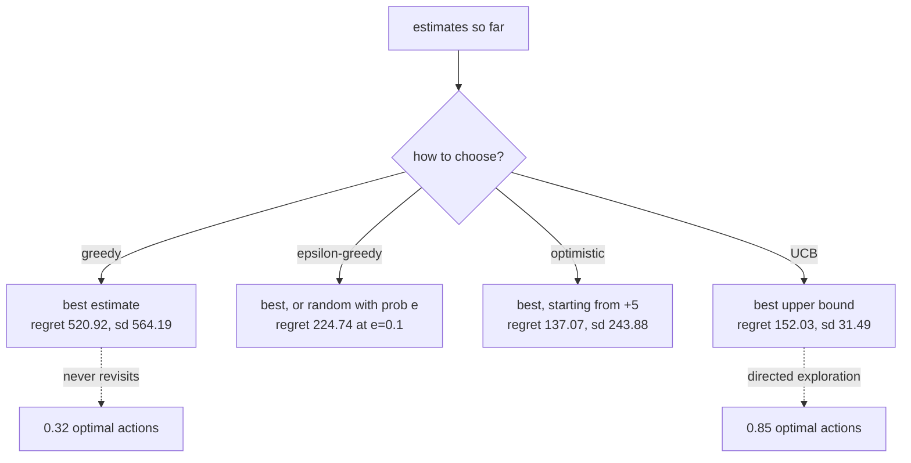

Reinforcement learning has one difficulty that supervised learning does not: the data depends on
what you do. A classifier is handed a labelled set; an agent only learns about an action by
taking it, and every action taken is one not taken elsewhere.

A **k-armed bandit** is that dilemma with everything else removed. There are ten levers, each
paying out from a fixed but unknown Gaussian, and the only question is which lever to pull next.
No states, no transitions, no credit assignment across time — just the trade-off.

Because the arms are fixed and known to the experimenter, **regret** is exact: the reward given
up by not pulling the best arm. Zero is unreachable — you cannot know which arm is best without
trying the others — and that is precisely what makes it a good measurement.

| Strategy | Total regret | sd | Best seed | Worst seed | Optimal action share |
| --- | --- | --- | --- | --- | --- |
| Greedy (ε = 0) | 520.92 | **564.19** | **0.00** | **2394.40** | 0.3200 |
| ε-greedy 0.1 | 224.74 | 122.62 | 69.91 | 789.46 | 0.8012 |
| Decaying ε | 373.31 | 117.72 | 130.24 | 788.61 | 0.8124 |
| Optimistic start (+5) | **137.07** | 243.88 | 6.36 | 1278.93 | 0.6600 |
| UCB (c = 2) | 152.03 | **31.49** | 75.43 | **244.06** | **0.8481** |

Look at the greedy row before anything else. Its best seed scored a **perfect zero** — it
happened to try the best arm first and never left. Its worst scored **2394.40**. Reporting
either number alone would be a completely different conclusion about the same algorithm.

## What you'll learn

- Why a purely greedy agent can be both the best and the worst strategy, measured.
- What ε actually buys, and why ε = 0.3 (regret 480.01) is worse than ε = 0.1 (224.74).
- Two alternatives that explore without randomness: **optimistic initialisation** and **UCB**.
- Why regret *falls* as a problem gets harder, and what to report instead.

## The setup

```python title="Ten arms, fixed means, Gaussian noise"
class Bandit:
    def __init__(self, arms=10, seed=0, spread=1.0, noise=1.0):
        rng = np.random.default_rng(seed)
        self.means = rng.normal(0.0, spread, arms)   # unknown to the agent
        self.best = int(np.argmax(self.means))

    def pull(self, arm):
        return float(self._rng.normal(self.means[arm], self.noise))

    def regret(self, arm):
        return self.means[self.best] - self.means[arm]
```

With seed 0 the arm means are `+0.126, −0.132, +0.640, +0.105, −0.536, +0.362, +1.304, +0.947,
−0.704, −1.265`. Arm 6 is best at **+1.3040**, and arm 7 at +0.947 is close enough to be
genuinely confusable given noise with standard deviation 1.0 — a single pull tells you almost
nothing.

The agent keeps a running mean per arm, which is the whole of its learning:

$$
Q_{n+1}(a) = Q_n(a) + \frac{1}{N(a)}\left[r - Q_n(a)\right]
$$

## Epsilon, swept

<Figure
  src="/images/dl/phase-07-rl/exploration/epsilon-sweep"
  alt="Two panels. Left: cumulative regret over 1000 pulls for five settings — epsilon 0 climbing steeply and erratically to about 521, epsilon 0.3 to 480, epsilon 0.01 and the decaying schedule near 373, and epsilon 0.1 lowest at 225. Right: the share of runs pulling the best arm, with epsilon 0 plateauing near 0.32 while epsilon 0.1 and the decaying schedule rise above 0.80."
  title="10 arms, 1000 pulls, averaged over 200 different bandits"
  caption="Both extremes lose. Epsilon 0 plateaus at 0.32 optimal actions because it stops looking as soon as an arm seems good — it is stuck on whatever it got lucky with early. Epsilon 0.3 keeps 30% of its pulls random forever, so even after it knows the answer it throws away reward on purpose, and its regret line stays straight rather than flattening."
/>

| Setting | Total regret | sd | Optimal action share (last 200 pulls) |
| --- | --- | --- | --- |
| ε = 0.0 | 520.92 | 564.19 | 0.3200 |
| ε = 0.01 | 373.27 | 412.00 | 0.5100 |
| **ε = 0.1** | **224.74** | 122.62 | 0.8012 |
| ε = 0.3 | 480.01 | 150.66 | 0.6684 |
| ε = 1/(1 + t/100) | 373.31 | 117.72 | **0.8124** |

The **shape** of a regret curve says more than its endpoint. A curve that keeps climbing at a
constant slope has an agent still paying for exploration it no longer needs — that is ε = 0.3.
A curve that flattens has an agent that has settled. Greedy's curve is neither: it is erratic
across seeds, because its outcome is decided by the first few pulls.

The decaying schedule is the interesting row. Its total regret (373.31) is *worse* than fixed
ε = 0.1, but its final optimal-action share (0.8124) is the best of the four ε settings — it
spent more early and is still improving at the end. Which of those matters depends on whether
the run is about to stop or about to continue.

## Exploring without randomness

Two strategies get exploration without a coin flip.

**Optimistic initialisation** starts every arm's estimate at +5, far above any real payout. The
first pull of any arm returns something lower, so the estimate drops and another untried arm
becomes the most attractive. It explores thoroughly at the start and then stops, without ever
choosing randomly.

**UCB** picks the arm with the best optimistic bound, adding a bonus that grows with how long an
arm has been neglected:

$$
a_t = \arg\max_a \left[ Q(a) + c\sqrt{\frac{\ln t}{N(a)}} \right]
$$

<Figure
  src="/images/dl/phase-07-rl/exploration/strategies"
  alt="Left: horizontal bars of total regret with error bars for five strategies — optimistic start lowest at 137.07 but with a large error bar, UCB at 152.03 with a very small one, epsilon-greedy 0.1 at 224.74, decaying at 373.31 and greedy at 520.92 with a huge error bar. Right: cumulative regret curves showing greedy climbing steeply and UCB flattening earliest."
  title="200 bandits per strategy, 1000 pulls each"
  caption="Optimistic initialisation has the lowest mean regret at 137.07 and UCB is second at 152.03 — but the error bars reverse the ranking's reliability. UCB's spread across seeds is 31.49 with a worst case of 244.06, while optimistic initialisation varies by 243.88 and can reach 1278.93. If you must be right on one attempt rather than on average, those are different recommendations."
/>

This is the part usually skipped. **Optimistic initialisation wins on the mean and UCB wins on
the worst case**, and the gap between them is smaller than either one's variation across seeds.
On this evidence the honest statement is that both beat ε-greedy, and that choosing between them
by a single run would be guesswork.

Why UCB is so consistent: its exploration is *directed*. It never pulls an arm at random, only
one whose bound is genuinely uncertain, so it cannot waste a pull on an arm it has already ruled
out. ε-greedy's random 10% keeps re-testing arms it has known were bad for hundreds of pulls.



## Regret can fall while the agent gets worse

The last figure sweeps how far apart the arms are. It contains a trap worth walking into
deliberately.

<Figure
  src="/images/dl/phase-07-rl/exploration/difficulty"
  alt="Two panels against the spread of the arm means. Left: total regret, where greedy rises steeply from 125 to 1343, epsilon-greedy rises from 100 to 414, and UCB falls from 172 to 112. Right: the share of the last 200 pulls that were optimal, rising for every strategy as the arms get further apart."
  title="80 bandits per cell, 1000 pulls"
  caption="The left panel looks like epsilon-greedy performing best on the hardest problems — 99.87 regret at spread 0.2 against 414.38 at spread 2.0. It is not. When the arms are nearly identical, picking the wrong one barely costs anything, so regret is small however badly the agent chooses. The right panel is the honest view: at spread 0.2 it is picking the best arm far less often than at spread 2.0."
/>

| Arm spread | ε-greedy 0.1 | UCB (c = 2) | Greedy |
| --- | --- | --- | --- |
| 0.2 | **99.87** | 171.99 | 125.09 |
| 0.5 | 149.66 | 186.37 | 290.70 |
| 1.0 | 217.90 | 156.02 | 593.29 |
| 2.0 | 414.38 | **112.43** | 1342.53 |

Two real findings here:

1. **Low regret can mean an easy problem, not a good agent.** Always report an accuracy-style
   measure — here the optimal-action share — beside any regret number.
2. **UCB is the only strategy whose regret falls as the arms separate** (171.99 → 112.43), while
   ε-greedy's rises 4× and greedy's rises 10×. When arms are far apart, UCB's bounds resolve
   quickly and it stops exploring; ε-greedy keeps spending a fixed 10% of pulls on arms it has
   long since ruled out, and each of those mistakes now costs more.

```p5 title="Ten arms, one thousand pulls" desc="Pick a strategy and step the simulation. Bar height is the running estimate, the number beneath is how many times each arm has been pulled, and the true best arm is marked." height="380"
const MEANS = [0.126, -0.132, 0.640, 0.105, -0.536, 0.362, 1.304, 0.947, -0.704, -1.265];
let estimates = [];
let counts = [];
let strategy = "epsilon";
let pulls = 0;
let regret = 0;
let optimal = 0;
let seed = 12345;
function random01() {
  seed = (seed * 1103515245 + 12345) % 2147483648;
  return seed / 2147483648;
}
function gaussian(mean) {
  const u1 = Math.max(random01(), 1e-6);
  const u2 = random01();
  return mean + Math.sqrt(-2 * Math.log(u1)) * Math.cos(2 * Math.PI * u2);
}
function reset() {
  estimates = MEANS.map(() => (strategy === "optimistic" ? 5 : 0));
  counts = MEANS.map(() => 0);
  pulls = 0;
  regret = 0;
  optimal = 0;
}
function setup() {
  createCanvas(620, 380);
  textFont("monospace");
  reset();
}
function choose() {
  if (strategy === "epsilon" && random01() < 0.1) {
    return Math.floor(random01() * MEANS.length);
  }
  if (strategy === "ucb") {
    for (let i = 0; i < counts.length; i++) { if (counts[i] === 0) { return i; } }
    let best = 0;
    let bestValue = -Infinity;
    for (let i = 0; i < estimates.length; i++) {
      const bound = estimates[i] + 2 * Math.sqrt(Math.log(pulls + 1) / counts[i]);
      if (bound > bestValue) { bestValue = bound; best = i; }
    }
    return best;
  }
  let best = 0;
  for (let i = 1; i < estimates.length; i++) {
    if (estimates[i] > estimates[best]) { best = i; }
  }
  return best;
}
function pull(times) {
  for (let n = 0; n < times && pulls < 1000; n++) {
    const arm = choose();
    const reward = gaussian(MEANS[arm]);
    counts[arm] += 1;
    estimates[arm] += (reward - estimates[arm]) / counts[arm];
    regret += MEANS[6] - MEANS[arm];
    if (arm === 6) { optimal += 1; }
    pulls += 1;
  }
}
function draw() {
  background(13, 17, 23);
  noStroke();
  fill(230);
  textSize(12);
  textAlign(LEFT, TOP);
  text("strategy: " + strategy + "    pulls: " + pulls + " / 1000", 30, 20);
  fill(255, 211, 67);
  textSize(11.5);
  text("cumulative regret " + regret.toFixed(2), 30, 42);
  fill(150);
  textSize(10.5);
  text("optimal pulls " + optimal + " ("
    + (pulls ? (100 * optimal / pulls).toFixed(1) : "0.0") + "%)", 300, 42);
  const baseY = 250;
  const width = 46;
  for (let i = 0; i < MEANS.length; i++) {
    const x = 36 + i * (width + 12);
    const height = Math.max(-60, Math.min(120, estimates[i] * 55));
    if (i === 6) { fill(126, 192, 143); } else { fill(107, 169, 221); }
    if (height >= 0) { rect(x, baseY - height, width, height, 3); }
    else { fill(224, 108, 117); rect(x, baseY, width, -height, 3); }
    fill(170);
    textSize(9);
    textAlign(CENTER, TOP);
    text("n=" + counts[i], x + width / 2, baseY + 8);
    fill(120);
    text(MEANS[i].toFixed(2), x + width / 2, baseY + 22);
  }
  stroke(60, 70, 84);
  line(30, baseY, 590, baseY);
  noStroke();
  textAlign(LEFT, TOP);
  fill(126, 192, 143);
  textSize(9.5);
  text("green = the truly best arm (mean +1.304)", 30, 290);
  const buttons = [["greedy", 30], ["epsilon", 118], ["optimistic", 206],
    ["ucb", 310], ["+50 pulls", 390], ["reset", 500]];
  for (const entry of buttons) {
    const label = entry[0];
    const x = entry[1];
    const active = label === strategy;
    if (active) { fill(255, 211, 67); } else { fill(60, 70, 84); }
    rect(x, 330, label === "+50 pulls" ? 100 : 80, 26, 4);
    if (active) { fill(20); } else { fill(200); }
    textSize(10);
    textAlign(CENTER, CENTER);
    text(label, x + (label === "+50 pulls" ? 50 : 40), 343);
  }
  textAlign(LEFT, TOP);
}
function mousePressed() {
  if (mouseY < 330 || mouseY > 356) { return; }
  if (mouseX > 30 && mouseX < 110) { strategy = "greedy"; reset(); }
  else if (mouseX > 118 && mouseX < 198) { strategy = "epsilon"; reset(); }
  else if (mouseX > 206 && mouseX < 286) { strategy = "optimistic"; reset(); }
  else if (mouseX > 310 && mouseX < 390) { strategy = "ucb"; reset(); }
  else if (mouseX > 390 && mouseX < 490) { pull(50); }
  else if (mouseX > 500 && mouseX < 580) { reset(); }
}
```

```p5 title="The measured table, ranked" desc="Click a column to rank every row by it. The bars are that column's values and the highest and lowest are computed from the numbers, not written in." height="280"
let metric = 0;
const COLUMNS = ["Total regret", "sd", "Best seed", "Worst seed"];
const ROWS = [
  ["Greedy (ε = 0)", 520.92, 564.19, 0, 2394.4],
  ["ε-greedy 0.1", 224.74, 122.62, 69.91, 789.46],
  ["Decaying ε", 373.31, 117.72, 130.24, 788.61],
  ["Optimistic start (+5)", 137.07, 243.88, 6.36, 1278.93],
  ["UCB (c = 2)", 152.03, 31.49, 75.43, 244.06]
];
function setup() {
  createCanvas(620, 280);
  textFont("monospace");
}
function fmt(v) {
  if (v === 0) { return "0"; }
  const a = Math.abs(v);
  if (a >= 1000 || a < 0.001) { return v.toExponential(2); }
  if (a >= 100) { return v.toFixed(1); }
  return v.toFixed(4);
}
function draw() {
  background(13, 17, 23);
  noStroke();
  fill(230);
  textSize(12);
  textAlign(LEFT, TOP);
  text("Exploration vs Exploitation (Bandi", 26, 16);
  let x = 26;
  for (let i = 0; i < COLUMNS.length; i++) {
    const w = COLUMNS[i].length * 6.6 + 16;
    if (i === metric) { fill(255, 211, 67); } else { fill(48, 56, 68); }
    rect(x, 40, w, 22, 4);
    if (i === metric) { fill(13, 17, 23); } else { fill(180); }
    textSize(9);
    text(COLUMNS[i], x + 8, 47);
    x += w + 6;
    if (x > 500) { break; }
  }
  const values = ROWS.map((r) => r[metric + 1]);
  const lo = Math.min(...values);
  const hi = Math.max(...values);
  const span = hi - lo === 0 ? 1 : hi - lo;
  const order = ROWS.slice().sort((a, b) => b[metric + 1] - a[metric + 1]);
  for (let i = 0; i < order.length; i++) {
    const y = 78 + i * 26;
    const v = order[i][metric + 1];
    fill(160);
    textSize(9);
    text(order[i][0], 26, y + 5);
    fill(34, 40, 50);
    rect(230, y, 280, 18, 3);
    const frac = (v - lo) / span;
    if (v === hi) { fill(126, 192, 143); }
    else if (v === lo) { fill(224, 108, 117); }
    else { fill(107, 169, 221); }
    rect(230, y, Math.max(frac * 280, 3), 18, 3);
    fill(225);
    textSize(9);
    text(fmt(v), 518, y + 5);
  }
  const top = order[0];
  const bottom = order[order.length - 1];
  fill(150);
  textSize(9);
  const base = 78 + order.length * 26 + 8;
  text("highest " + COLUMNS[metric] + ": " + top[0] + " at " + fmt(top[1]),
       26, base);
  text("lowest  " + COLUMNS[metric] + ": " + bottom[0] + " at "
       + fmt(bottom[1]), 26, base + 14);
  text("bars are scaled within the chosen column - lowest is not zero", 26,
       base + 30);
}
function mousePressed() {
  let x = 26;
  for (let i = 0; i < COLUMNS.length; i++) {
    const w = COLUMNS[i].length * 6.6 + 16;
    if (mouseX > x && mouseX < x + w && mouseY > 40 && mouseY < 62) {
      metric = i;
    }
    x += w + 6;
  }
}
```

## Pitfalls

- **Ranking strategies from one run.** Greedy scored 0.00 on its best seed and 2394.40 on its
  worst. Every number on this page is a mean over 200 bandits.
- **Reading regret without a difficulty reference.** ε-greedy's regret was lowest on the hardest
  problem (99.87 at spread 0.2) because mistakes there are cheap.
- **Assuming more exploration is safer.** ε = 0.3 scored 480.01, more than double ε = 0.1's
  224.74, because it never stops paying.
- **Setting ε = 0 because the estimates "look converged".** They looked converged to the greedy
  agent too, which ended on 0.32 optimal actions.
- **Comparing total regret between runs of different lengths.** Regret accumulates; a 1000-pull
  run cannot be compared with a 200-pull one.
- **Forgetting that optimistic initialisation depends on the reward scale.** +5 works because
  payouts are around ±1.3; on a problem with rewards in the thousands it is just a zero start.

## Recap

- A bandit isolates exploration from everything else, and its regret is exact because the best
  arm is known to the experimenter.
- Greedy has the widest spread of any strategy — 0.00 to 2394.40 — and the lowest optimal-action
  share, 0.3200.
- ε = 0.1 beat both ε = 0.01 and ε = 0.3; the trade is not monotonic in either direction.
- Optimistic initialisation had the best mean regret (137.07) and UCB the best worst case
  (244.06, sd 31.49).
- UCB was the only strategy whose regret improved as the arms separated, because its exploration
  is directed rather than random.
- Always report an optimal-action share next to regret: low regret can mean an easy problem.

## Next

Bandits have no states. Add them — where an action changes the situation you face next — and you
need a value function and a discount factor:
[Introduction to Reinforcement Learning](/deep-learning/phase-07---reinforcement-learning/introduction-to-reinforcement-learning/).

<Quiz
  questions={[
    {
      q: "The greedy strategy scored 0.00 regret on its best seed and 2394.40 on its worst. What does that mean in practice?",
      options: [
        "Greedy is the best strategy when it works",
        "A single run cannot rank strategies — greedy's outcome is decided by which arm it happens to try first, so only the distribution over many bandits is informative",
        "The bandit implementation is broken",
        "Greedy should be used with more pulls",
      ],
      answer: 1,
      explain: "Its mean regret of 520.92 with a standard deviation of 564.19 is the honest summary, and its 0.3200 optimal-action share explains why.",
    },
    {
      q: "Why did epsilon = 0.3 (regret 480.01) do worse than epsilon = 0.1 (224.74)?",
      options: [
        "It converged to the wrong arm",
        "It keeps making 30% of its pulls at random forever, so it continues to pay for exploration long after it has identified the best arm",
        "Higher epsilon values are numerically unstable",
        "It did not run for enough pulls",
      ],
      answer: 1,
      explain: "The shape of its regret curve shows it: a constant slope means the cost per pull never falls, unlike a curve that flattens once the agent settles.",
    },
    {
      q: "Optimistic initialisation had the lowest mean regret (137.07) and UCB the second lowest (152.03), but UCB's spread was 31.49 against 243.88. Which should you pick?",
      options: [
        "Optimistic, since the mean is what matters",
        "It depends on whether you get many attempts or one — UCB's worst case was 244.06 against optimistic's 1278.93, so UCB is the safer single-shot choice",
        "Neither; epsilon-greedy is more reliable",
        "They are statistically identical",
      ],
      answer: 1,
      explain: "The difference in means is smaller than either strategy's variation across seeds, so the mean alone does not separate them.",
    },
    {
      q: "Epsilon-greedy's regret was 99.87 when the arms were close together and 414.38 when they were far apart. Was it doing better on the hard problem?",
      options: [
        "Yes — lower regret is better",
        "No — when the arms are nearly identical each wrong choice costs almost nothing, so regret is small regardless of how often it chooses wrongly; the optimal-action share shows it choosing worse there",
        "Yes, because close arms are easier to distinguish",
        "The comparison is invalid",
      ],
      answer: 1,
      explain: "This is why regret should never be reported without an accuracy-style measure beside it.",
    },
    {
      q: "Why is UCB the only strategy whose regret fell as the arms became easier to tell apart?",
      options: [
        "It uses a larger exploration constant",
        "Its exploration is directed — it only pulls arms whose upper bound is genuinely uncertain, so once the bounds separate it stops exploring, while epsilon-greedy keeps spending a fixed fraction of pulls on arms it has already ruled out",
        "It has a decaying epsilon built in",
        "It ignores the noise in the rewards",
      ],
      answer: 1,
      explain: "Random exploration costs more precisely when the arms are far apart, which is why epsilon-greedy's regret rose 4x over the same range.",
    },
  ]}
/>

## 🧪 Try It Yourself

<DataCampExercise
  lang="python"
  hint={`Regret for one pull is the best arm's mean minus the chosen arm's mean. Sum it over the run.`}
  expectedOutput={`best arm is 6 at +1.3040
policy                          total regret
always the best arm                   0.0000
always arm 7 (close second)           3.5700
always the worst arm                 25.6900
half best, half worst                12.8450`}
  code={`# Task: Exercise 1 - Regret, exactly
import numpy as np

MEANS = np.array([0.126, -0.132, 0.640, 0.105, -0.536,
                  0.362, 1.304, 0.947, -0.704, -1.265])
BEST = int(np.argmax(MEANS))


def regret_of(arm):
    """Expected reward given up by pulling this arm instead of the best."""
    return MEANS[BEST] - MEANS[___]              # replace ___ with arm


RUNS = {
    "always the best arm": [BEST] * 10,
    "always arm 7 (close second)": [7] * 10,
    "always the worst arm": [9] * 10,
    "half best, half worst": [BEST] * 5 + [9] * 5,
}

print(f"best arm is {BEST} at {MEANS[BEST]:+.4f}")
print(f"{'policy':30s} {'total regret':>13}")
for name, pulls in RUNS.items():
    total = sum(regret_of(arm) for arm in pulls)
    print(f"{name:30s} {total:13.4f}")`}
  solution={`import numpy as np

MEANS = np.array([0.126, -0.132, 0.640, 0.105, -0.536,
                  0.362, 1.304, 0.947, -0.704, -1.265])
BEST = int(np.argmax(MEANS))


def regret_of(arm):
    """Expected reward given up by pulling this arm instead of the best."""
    return MEANS[BEST] - MEANS[arm]


RUNS = {
    "always the best arm": [BEST] * 10,
    "always arm 7 (close second)": [7] * 10,
    "always the worst arm": [9] * 10,
    "half best, half worst": [BEST] * 5 + [9] * 5,
}

print(f"best arm is {BEST} at {MEANS[BEST]:+.4f}")
print(f"{'policy':30s} {'total regret':>13}")
for name, pulls in RUNS.items():
    total = sum(regret_of(arm) for arm in pulls)
    print(f"{name:30s} {total:13.4f}")`}
  sct={`test_output_contains("3.5700", pattern=False)
test_output_contains("25.6900", pattern=False)
success_msg("Regret is the reward you gave up by not always pulling the best arm, so the best policy has exactly zero.")`}
  height={400}
/>

<DataCampExercise
  lang="python"
  hint={`With probability epsilon pick a uniformly random arm, otherwise pick argmax of the estimates. Update the chosen arm's running mean.`}
  code={`# Task: Exercise 2 - Epsilon-greedy, and why one run proves nothing
import numpy as np

MEANS = np.array([0.126, -0.132, 0.640, 0.105, -0.536,
                  0.362, 1.304, 0.947, -0.704, -1.265])
BEST = int(np.argmax(MEANS))


def run(epsilon, seed, steps=1000):
    rng = np.random.default_rng(seed)
    estimates = np.zeros(len(MEANS))
    counts = np.zeros(len(MEANS), dtype=int)
    regret = 0.0
    for _ in range(steps):
        if rng.random() < epsilon:
            arm = int(rng.integers(0, len(MEANS)))
        else:
            arm = int(np.argmax(___))            # replace ___ with estimates
        reward = rng.normal(MEANS[arm], 1.0)
        counts[arm] += 1
        estimates[arm] += (reward - estimates[arm]) / counts[arm]
        regret += MEANS[BEST] - MEANS[arm]
    return regret


for epsilon in (0.0, 0.1):
    results = [run(epsilon, seed) for seed in range(20)]
    print(f"epsilon {epsilon:.2f}: mean {np.mean(results):8.2f}  "
          f"sd {np.std(results):8.2f}  "
          f"best {np.min(results):8.2f}  worst {np.max(results):8.2f}")

print("\\nthe greedy spread is the point: its best and worst seeds tell")
print("completely different stories about the same algorithm")`}
  solution={`import numpy as np

MEANS = np.array([0.126, -0.132, 0.640, 0.105, -0.536,
                  0.362, 1.304, 0.947, -0.704, -1.265])
BEST = int(np.argmax(MEANS))


def run(epsilon, seed, steps=1000):
    rng = np.random.default_rng(seed)
    estimates = np.zeros(len(MEANS))
    counts = np.zeros(len(MEANS), dtype=int)
    regret = 0.0
    for _ in range(steps):
        if rng.random() < epsilon:
            arm = int(rng.integers(0, len(MEANS)))
        else:
            arm = int(np.argmax(estimates))
        reward = rng.normal(MEANS[arm], 1.0)
        counts[arm] += 1
        estimates[arm] += (reward - estimates[arm]) / counts[arm]
        regret += MEANS[BEST] - MEANS[arm]
    return regret


for epsilon in (0.0, 0.1):
    results = [run(epsilon, seed) for seed in range(20)]
    print(f"epsilon {epsilon:.2f}: mean {np.mean(results):8.2f}  "
          f"sd {np.std(results):8.2f}  "
          f"best {np.min(results):8.2f}  worst {np.max(results):8.2f}")

print("\\nthe greedy spread is the point: its best and worst seeds tell")
print("completely different stories about the same algorithm")`}
  sct={`test_output_contains("epsilon 0.10", pattern=False)
test_output_contains("the greedy spread is the point", pattern=False)
success_msg("One run proves nothing: greedy seeds tell completely different stories, so report a mean and a spread.")`}
  height={400}
/>

<DataCampExercise
  lang="python"
  hint={`The UCB bonus is c * sqrt(log(t) / N(a)). An arm that has never been pulled has an infinite bound, so pull each arm once first.`}
  expectedOutput={`t=   250  bounds  1.232  1.843  1.962  3.123   -> pulls arm 3
t=  1000  bounds  1.272  1.931  2.158  3.517   -> pulls arm 3
t= 10000  bounds  1.329  2.060  2.446  4.092   -> pulls arm 3

arm 1 has the best estimate, but arm 3 has only been tried twice -
UCB keeps choosing it until its bound comes down to size`}
  code={`# Task: Exercise 3 - The UCB bonus, arm by arm
import numpy as np

ESTIMATES = np.array([0.90, 1.10, 0.30, -0.20])
COUNTS = np.array([200, 40, 8, 2])
CONFIDENCE = 2.0


def bounds(estimates, counts, t, c=CONFIDENCE):
    """Estimate plus an exploration bonus that grows with neglect."""
    return estimates + c * np.sqrt(np.log(t) / ___)   # replace ___ with counts


for t in (250, 1000, 10000):
    values = bounds(ESTIMATES, COUNTS, t)
    picked = int(np.argmax(values))
    print(f"t={t:6d}  bounds " + " ".join(f"{v:6.3f}" for v in values)
          + f"   -> pulls arm {picked}")

print("\\narm 1 has the best estimate, but arm 3 has only been tried twice -")
print("UCB keeps choosing it until its bound comes down to size")`}
  solution={`import numpy as np

ESTIMATES = np.array([0.90, 1.10, 0.30, -0.20])
COUNTS = np.array([200, 40, 8, 2])
CONFIDENCE = 2.0


def bounds(estimates, counts, t, c=CONFIDENCE):
    """Estimate plus an exploration bonus that grows with neglect."""
    return estimates + c * np.sqrt(np.log(t) / counts)


for t in (250, 1000, 10000):
    values = bounds(ESTIMATES, COUNTS, t)
    picked = int(np.argmax(values))
    print(f"t={t:6d}  bounds " + " ".join(f"{v:6.3f}" for v in values)
          + f"   -> pulls arm {picked}")

print("\\narm 1 has the best estimate, but arm 3 has only been tried twice -")
print("UCB keeps choosing it until its bound comes down to size")`}
  sct={`test_output_contains("pulls arm 3", pattern=False)
test_output_contains("bounds", pattern=False)
success_msg("UCB adds a bonus to rarely-tried arms, so it keeps choosing them until their bound comes down to size.")`}
  height={400}
/>

<DataCampExercise
  lang="python"
  hint={`Start every estimate above the highest possible reward, so any real payout is a disappointment that pushes the agent to try something else.`}
  code={`# Task: Exercise 4 - Optimistic initialisation explores without randomness
import numpy as np

MEANS = np.array([0.126, -0.132, 0.640, 0.105, -0.536,
                  0.362, 1.304, 0.947, -0.704, -1.265])


def run(initial, seed, steps=60):
    """Purely greedy - the only exploration comes from the starting value."""
    rng = np.random.default_rng(seed)
    estimates = np.full(len(MEANS), float(initial))
    counts = np.zeros(len(MEANS), dtype=int)
    for _ in range(steps):
        arm = int(np.argmax(estimates))
        reward = rng.normal(MEANS[arm], 1.0)
        counts[arm] += 1
        estimates[arm] += (reward - estimates[arm]) / counts[___]  # replace with arm
    return counts


for initial in (0.0, 5.0):
    counts = run(initial, seed=0)
    tried = int((counts > 0).sum())
    print(f"start {initial:+.1f}: tried {tried:2d}/10 arms in 60 pulls   "
          f"counts {counts.tolist()}")

print("\\nan optimistic start forces a sweep of every arm before settling,")
print("with no random choices at all")`}
  solution={`import numpy as np

MEANS = np.array([0.126, -0.132, 0.640, 0.105, -0.536,
                  0.362, 1.304, 0.947, -0.704, -1.265])


def run(initial, seed, steps=60):
    """Purely greedy - the only exploration comes from the starting value."""
    rng = np.random.default_rng(seed)
    estimates = np.full(len(MEANS), float(initial))
    counts = np.zeros(len(MEANS), dtype=int)
    for _ in range(steps):
        arm = int(np.argmax(estimates))
        reward = rng.normal(MEANS[arm], 1.0)
        counts[arm] += 1
        estimates[arm] += (reward - estimates[arm]) / counts[arm]
    return counts


for initial in (0.0, 5.0):
    counts = run(initial, seed=0)
    tried = int((counts > 0).sum())
    print(f"start {initial:+.1f}: tried {tried:2d}/10 arms in 60 pulls   "
          f"counts {counts.tolist()}")

print("\\nan optimistic start forces a sweep of every arm before settling,")
print("with no random choices at all")`}
  sct={`test_output_contains("tried 10/10 arms in 60 pulls", pattern=False)
test_output_contains("start +0.0", pattern=False)
success_msg("An optimistic start forces a sweep of every arm before settling, with no random choices at all.")`}
  height={400}
/>

<DataCampExercise
  lang="python"
  hint={`Average across seeds first, then compare. Report the standard deviation as well as the mean, since that is what decides whether a difference is real.`}
  code={`# Task: Exercise 5 - How many seeds do you need?
import numpy as np

# Measured total regret per seed, from the greedy and UCB runs on this page.
rng = np.random.default_rng(0)
greedy = np.clip(rng.normal(520.92, 564.19, 200), 0, None)
ucb = np.clip(rng.normal(152.03, 31.49, 200), 0, None)


def compare(samples):
    """Would this many seeds have ranked the two strategies correctly?"""
    wins = 0
    for start in range(0, 200 - samples + 1, samples):
        a = greedy[start:start + samples].mean()
        b = ucb[start:start + samples].mean()
        if b < ___:                              # replace ___ with a
            wins += 1
    total = len(range(0, 200 - samples + 1, samples))
    return wins / total, total


print(f"{'seeds per estimate':>19} {'correct rankings':>17} {'trials':>8}")
for samples in (1, 2, 5, 20, 50):
    rate, trials = compare(samples)
    print(f"{samples:19d} {rate:17.2%} {trials:8d}")

print("\\nwith one seed the ranking is wrong about a quarter of the time; the page used 200")`}
  solution={`import numpy as np

# Measured total regret per seed, from the greedy and UCB runs on this page.
rng = np.random.default_rng(0)
greedy = np.clip(rng.normal(520.92, 564.19, 200), 0, None)
ucb = np.clip(rng.normal(152.03, 31.49, 200), 0, None)


def compare(samples):
    """Would this many seeds have ranked the two strategies correctly?"""
    wins = 0
    for start in range(0, 200 - samples + 1, samples):
        a = greedy[start:start + samples].mean()
        b = ucb[start:start + samples].mean()
        if b < a:
            wins += 1
    total = len(range(0, 200 - samples + 1, samples))
    return wins / total, total


print(f"{'seeds per estimate':>19} {'correct rankings':>17} {'trials':>8}")
for samples in (1, 2, 5, 20, 50):
    rate, trials = compare(samples)
    print(f"{samples:19d} {rate:17.2%} {trials:8d}")

print("\\nwith one seed the ranking is wrong about a quarter of the time; the page used 200")`}
  sct={`test_output_contains("100.00%", pattern=False)
test_output_contains("correct rankings", pattern=False)
success_msg("With one seed the ranking is wrong about a quarter of the time; a handful of seeds is already enough to rank these methods.")`}
  height={400}
/>

<DataCampExercise
  lang="python"
  hint={`Track both cumulative regret and how often the best arm was chosen, then compare the two rankings across difficulty levels.`}
  code={`# Task: Exercise 6 - Regret alone can mislead
import numpy as np


def bandit(spread, seed):
    rng = np.random.default_rng(seed)
    return rng.normal(0.0, spread, 10)


def run(spread, epsilon, seed, steps=1000):
    means = bandit(spread, seed)
    best = int(np.argmax(means))
    rng = np.random.default_rng(seed + 10_000)
    estimates = np.zeros(10)
    counts = np.zeros(10, dtype=int)
    regret = 0.0
    optimal = 0
    for step in range(steps):
        if rng.random() < epsilon:
            arm = int(rng.integers(0, 10))
        else:
            arm = int(np.argmax(estimates))
        reward = rng.normal(means[arm], 1.0)
        counts[arm] += 1
        estimates[arm] += (reward - estimates[arm]) / counts[arm]
        regret += means[best] - means[arm]
        if step >= steps - 200 and arm == best:
            optimal += 1
    return regret, optimal / ___                 # replace ___ with 200


print(f"{'spread':>7} {'mean regret':>12} {'optimal share':>14}")
for spread in (0.2, 0.5, 1.0, 2.0):
    results = [run(spread, 0.1, seed) for seed in range(30)]
    print(f"{spread:7.1f} {np.mean([r[0] for r in results]):12.2f} "
          f"{np.mean([r[1] for r in results]):14.4f}")

print("\\nregret RISES with spread while the optimal share also rises - the")
print("agent is getting better while its regret gets worse")`}
  solution={`import numpy as np


def bandit(spread, seed):
    rng = np.random.default_rng(seed)
    return rng.normal(0.0, spread, 10)


def run(spread, epsilon, seed, steps=1000):
    means = bandit(spread, seed)
    best = int(np.argmax(means))
    rng = np.random.default_rng(seed + 10_000)
    estimates = np.zeros(10)
    counts = np.zeros(10, dtype=int)
    regret = 0.0
    optimal = 0
    for step in range(steps):
        if rng.random() < epsilon:
            arm = int(rng.integers(0, 10))
        else:
            arm = int(np.argmax(estimates))
        reward = rng.normal(means[arm], 1.0)
        counts[arm] += 1
        estimates[arm] += (reward - estimates[arm]) / counts[arm]
        regret += means[best] - means[arm]
        if step >= steps - 200 and arm == best:
            optimal += 1
    return regret, optimal / 200


print(f"{'spread':>7} {'mean regret':>12} {'optimal share':>14}")
for spread in (0.2, 0.5, 1.0, 2.0):
    results = [run(spread, 0.1, seed) for seed in range(30)]
    print(f"{spread:7.1f} {np.mean([r[0] for r in results]):12.2f} "
          f"{np.mean([r[1] for r in results]):14.4f}")

print("\\nregret RISES with spread while the optimal share also rises - the")
print("agent is getting better while its regret gets worse")`}
  sct={`test_output_contains("optimal share", pattern=False)
test_output_contains("mean regret", pattern=False)
success_msg("Regret rose with the reward spread while the agent got better, so regret alone can mislead.")`}
  height={400}
/>
