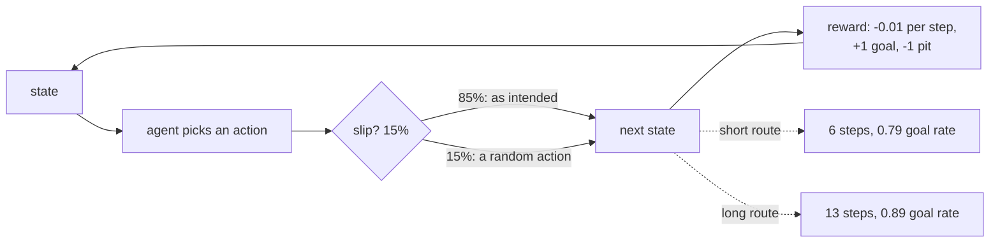

The [bandit page](/deep-learning/phase-07---reinforcement-learning/exploration-vs-exploitation-bandits-and-epsilon-schedules/)
had one decision repeated a thousand times. Reinforcement learning proper adds the thing that
makes it hard: **actions change the situation you face next**. A step towards the goal is also a
step away from somewhere else, and a step into a pit ends the episode.

This page uses a gridworld small enough to solve **exactly**, which matters more than it sounds.
Value iteration gives the true optimal policy, so every learned policy can be scored against the
right answer rather than against a curve that merely goes up.

```text
#########
#S.....G#     <- the short route: 6 steps, directly above the pits
#.XXXXX.#     <- pits: falling in ends the episode at -1
#.......#
#.......#     <- the long route: 12 steps, nowhere near the pits
#########
```

Actions succeed only 85% of the time — with probability 0.15 the agent moves somewhere else
entirely. That single detail is what makes the short route a *gamble* rather than an obvious
choice, and it is why the discount factor and the step cost below change the answer.

| Policy | Mean reward | Mean steps | Reaches the goal | Takes the short route |
| --- | --- | --- | --- | --- |
| Random | −1.0641 | 8.91 | 0.0075 | 0.7575 |
| Q-learning (3,000 episodes) | 0.5497 | 6.53 | 0.8025 | **0.9625** |
| **Value iteration (exact)** | **0.6568** | 13.32 | **0.8900** | **0.0775** |

Read the last column. The exact solution walks the **long way round**, and the agent that
learned from experience did not — it found the shortcut, kept taking it, and ended up 0.1071
reward worse off with a goal rate 0.0875 lower.

## What you'll learn

- The five pieces of an MDP, and why "solvable exactly" is the property that makes a teaching
  environment worth using.
- What the **discount factor** actually decides — measured here as a switch between two routes.
- What the **step cost** decides, measured the same way.
- Why a learned policy that looks like it converged can still be worse than the optimum, and how
  to tell.

## The pieces

An MDP is five things: states, actions, a transition rule, a reward, and a discount factor.

$$
V^*(s) = \max_a \sum_{s'} P(s' \mid s, a)\left[R(s, a, s') + \gamma V^*(s')\right]
$$

That is the Bellman optimality equation, and **value iteration** is what you get by treating it
as an assignment and repeating it until nothing changes. On this world it converges in **29
sweeps** to a start-state value of **0.5904**.

```python title="Value iteration has to model the slip too"
def backup(state, action, values, gamma):
    """Expected value of one action, over where it might actually land."""
    total = 0.0
    for candidate in range(4):
        probability = slip / 4 + (1.0 - slip if candidate == action else 0.0)
        following, reward, done = step(state, candidate)
        total += probability * (reward + (0.0 if done else gamma * values[following]))
    return total
```

The loop over `candidate` is the part that is easy to get wrong. If value iteration assumes the
chosen action always happens, it computes the exact answer to a **different problem** — one
without slip — and then confidently recommends the shortcut. An earlier version of this module
did exactly that.



## Three policies

<Figure
  src="/images/dl/phase-07-rl/intro-to-rl/policy-quality"
  alt="Left: grouped bars comparing random, Q-learning and value iteration on mean reward, mean steps and goal rate, each scaled to the largest value in its group. Random has strongly negative reward and a near-zero goal rate; Q-learning and value iteration are close on reward but differ in steps. Right: a Q-learning curve rising from below zero towards roughly 0.55, with dashed lines marking the value-iteration optimum at 0.6568 and the random baseline at -1.0641."
  title="400 evaluation episodes per policy"
  caption="The random policy reaches the goal 0.75% of the time — with pits adjacent to most of the map and a 15% slip, wandering ends badly fast, in 8.91 steps on average. Q-learning gets most of the way to the optimum and then stops: the dashed line it never reaches is the exact answer, and the gap is 0.1071 of reward."
/>

Q-learning's failure here is worth being precise about, because "the curve went up" would have
hidden it. Its policy takes the short route in **96.25%** of episodes. The optimal policy takes
it in **7.75%**. Both reach the goal often; the shortcut just falls into a pit more.

The cause is exploration, not the update rule. ε-greedy at 0.1 finds the shortcut early, and
from then on the long route is only ever visited by accident — a 12-step corridor requires a
long run of exploratory actions to traverse, and each one is a coin flip. The agent never
gathers enough evidence about a route it does not take. That is the
[bandit problem](/deep-learning/phase-07---reinforcement-learning/exploration-vs-exploitation-bandits-and-epsilon-schedules/)
again, embedded in a world with states.

## The discount factor decides the route

<Figure
  src="/images/dl/phase-07-rl/intro-to-rl/discount-and-cost"
  alt="Left: two lines against the discount factor — the share of episodes taking the short risky route, near 1.0 for gamma 0.8 to 0.95 then collapsing to 0.08 at gamma 0.99, and the goal rate, which rises from 0.79 to 0.89 as that happens. Right: grouped bars against the step cost, showing the short route rising from 0.055 at zero cost to 0.9975 at cost 0.2, with the goal rate falling from 0.8875 to 0.79."
  title="The optimal policy re-solved for each setting"
  caption="Both panels show the same trade from different directions. A low discount or an expensive step makes the distant pit penalty matter less than the immediate saving, so the optimal policy switches to the 6-step gamble — and the goal rate drops from 0.8900 to about 0.79 as a direct consequence. Nothing about the environment changed; only what the agent was told to value."
/>

| γ | Reward | Steps | Goal rate | Short route | Start value | Sweeps |
| --- | --- | --- | --- | --- | --- | --- |
| 0.50 | 0.4641 | **22.59** | 0.8400 | 0.5050 | −0.0223 | 21 |
| 0.80 | 0.5312 | 6.38 | 0.7925 | 0.9975 | 0.0983 | 21 |
| 0.90 | 0.5312 | 6.38 | 0.7925 | 0.9975 | 0.2625 | 23 |
| 0.95 | 0.5497 | 6.53 | 0.8025 | 0.9625 | 0.3914 | 26 |
| **0.99** | **0.6568** | 13.32 | **0.8900** | **0.0775** | 0.5904 | 29 |

Three things in that table are worth separating:

1. **γ between 0.8 and 0.95 takes the gamble.** The pit is several steps away, and at γ = 0.9 a
   penalty six steps ahead is worth $0.9^6 = 0.53$ of its face value. The shortcut's risk is
   discounted; its saving is immediate.
2. **γ = 0.99 takes the detour** and is the only setting that reaches the goal 0.89 of the time.
3. **γ = 0.50 is incoherent.** It wanders for 22.59 steps and takes each route about half the
   time, because at that discount the goal itself is nearly worthless from the start state — the
   start value is *negative* (−0.0223). An agent that cannot see the reward cannot navigate
   towards it.

The step cost does the same job from the other end: free steps buy the safe detour (short route
0.0550), and steps costing 0.2 make the gamble worth it (0.9975), with the goal rate falling from
0.8875 to 0.7900.

## The value map

<Figure
  src="/images/dl/phase-07-rl/intro-to-rl/value-map"
  alt="The gridworld drawn as a heatmap of exact state values, with an arrow in each cell showing the optimal action and the value printed beneath. Values rise towards the goal in the top right; the cells along the bottom corridor carry a clear gradient guiding the agent the long way round, while cells directly above the pits point away from them."
  title="Exact values and the greedy policy, gamma 0.99, step cost -0.01"
  caption="This is what value iteration actually produces: a number per state, from which the policy falls out by taking the best action at each one. Note the arrows in the top row — even standing on the short route, the optimal action often points back down towards the safe corridor, because one slip above the pits ends the episode."
/>

```p5 title="Which route is worth it?" desc="Drag the two sliders. The bars are the discounted value of each route under a simplified model of this world, and the verdict is which one that model prefers." height="360"
let gamma = 0.99;
let stepCost = -0.01;
function setup() {
  createCanvas(620, 360);
  textFont("monospace");
}
function routeValue(steps, success) {
  let walking = 0;
  for (let t = 0; t < steps; t++) { walking += stepCost * Math.pow(gamma, t); }
  const arrival = Math.pow(gamma, steps) * (success * 1.0 + (1 - success) * -1.0);
  return walking + arrival;
}
function draw() {
  background(13, 17, 23);
  const shortValue = routeValue(6, 0.79);
  const longValue = routeValue(13, 0.89);
  noStroke();
  fill(230);
  textSize(12);
  textAlign(LEFT, TOP);
  text("two routes to the same goal", 30, 20);
  fill(150);
  textSize(10.5);
  text("short: 6 steps, reaches the goal 79% of the time", 30, 42);
  text("long:  13 steps, reaches the goal 89% of the time", 30, 58);
  const bars = [
    ["short (the gamble)", shortValue, 224, 108, 117, 110],
    ["long (the detour)", longValue, 126, 192, 143, 170],
  ];
  const zero = 300;
  const scale = 150;
  for (const entry of bars) {
    const label = entry[0];
    const value = entry[1];
    const y = entry[5];
    fill(150);
    textSize(10.5);
    textAlign(LEFT, TOP);
    text(label, 30, y - 16);
    fill(60, 70, 84);
    rect(zero - scale, y, scale * 2, 18, 3);
    fill(entry[2], entry[3], entry[4]);
    const width = Math.max(-scale, Math.min(scale, value * scale));
    if (width >= 0) { rect(zero, y, width, 18, 3); }
    else { rect(zero + width, y, -width, 18, 3); }
    fill(240);
    textSize(11);
    text(value.toFixed(4), zero + scale + 12, y + 3);
  }
  stroke(120);
  line(zero, 100, zero, 200);
  noStroke();
  fill(120);
  textSize(9);
  text("0", zero - 3, 204);
  const winner = shortValue > longValue ? "short (the gamble)" : "long (the detour)";
  fill(255, 211, 67);
  textSize(12.5);
  textAlign(LEFT, TOP);
  text("this model prefers: " + winner, 30, 224);
  fill(150);
  textSize(9.5);
  text("measured: gamma 0.99 with step -0.01 chose long; step -0.04 chose short", 30, 246);
  const sliders = [
    ["gamma " + gamma.toFixed(2), (gamma - 0.5) / 0.5, 300],
    ["step cost " + stepCost.toFixed(3), (stepCost + 0.25) / 0.25, 332],
  ];
  for (const entry of sliders) {
    fill(150);
    textSize(9.5);
    text(entry[0], 30, entry[2] - 12);
    fill(60, 70, 84);
    rect(160, entry[2], 300, 4, 2);
    fill(255, 211, 67);
    circle(160 + entry[1] * 300, entry[2] + 2, 12);
  }
}
function mousePressed() { mouseDragged(); }
function mouseDragged() {
  if (mouseX < 150) { return; }
  const fraction = Math.min(Math.max((mouseX - 160) / 300, 0), 1);
  if (Math.abs(mouseY - 302) < 14) { gamma = 0.5 + fraction * 0.5; }
  else if (Math.abs(mouseY - 334) < 14) { stepCost = -0.25 + fraction * 0.25; }
}
```

```p5 title="The measured table, ranked" desc="Click a column to rank every row by it. The bars are that column's values and the highest and lowest are computed from the numbers, not written in." height="280"
let metric = 0;
const COLUMNS = ["Reward", "Steps", "Goal rate", "Short route"];
const ROWS = [
  ["0.50", 0.4641, 22.59, 0.84, 0.505],
  ["0.80", 0.5312, 6.38, 0.7925, 0.9975],
  ["0.90", 0.5312, 6.38, 0.7925, 0.9975],
  ["0.95", 0.5497, 6.53, 0.8025, 0.9625],
  ["0.99", 0.6568, 13.32, 0.89, 0.0775]
];
function setup() {
  createCanvas(620, 280);
  textFont("monospace");
}
function fmt(v) {
  if (v === 0) { return "0"; }
  const a = Math.abs(v);
  if (a >= 1000 || a < 0.001) { return v.toExponential(2); }
  if (a >= 100) { return v.toFixed(1); }
  return v.toFixed(4);
}
function draw() {
  background(13, 17, 23);
  noStroke();
  fill(230);
  textSize(12);
  textAlign(LEFT, TOP);
  text("Introduction to Reinforcement Lear", 26, 16);
  let x = 26;
  for (let i = 0; i < COLUMNS.length; i++) {
    const w = COLUMNS[i].length * 6.6 + 16;
    if (i === metric) { fill(255, 211, 67); } else { fill(48, 56, 68); }
    rect(x, 40, w, 22, 4);
    if (i === metric) { fill(13, 17, 23); } else { fill(180); }
    textSize(9);
    text(COLUMNS[i], x + 8, 47);
    x += w + 6;
    if (x > 500) { break; }
  }
  const values = ROWS.map((r) => r[metric + 1]);
  const lo = Math.min(...values);
  const hi = Math.max(...values);
  const span = hi - lo === 0 ? 1 : hi - lo;
  const order = ROWS.slice().sort((a, b) => b[metric + 1] - a[metric + 1]);
  for (let i = 0; i < order.length; i++) {
    const y = 78 + i * 26;
    const v = order[i][metric + 1];
    fill(160);
    textSize(9);
    text(order[i][0], 26, y + 5);
    fill(34, 40, 50);
    rect(230, y, 280, 18, 3);
    const frac = (v - lo) / span;
    if (v === hi) { fill(126, 192, 143); }
    else if (v === lo) { fill(224, 108, 117); }
    else { fill(107, 169, 221); }
    rect(230, y, Math.max(frac * 280, 3), 18, 3);
    fill(225);
    textSize(9);
    text(fmt(v), 518, y + 5);
  }
  const top = order[0];
  const bottom = order[order.length - 1];
  fill(150);
  textSize(9);
  const base = 78 + order.length * 26 + 8;
  text("highest " + COLUMNS[metric] + ": " + top[0] + " at " + fmt(top[1]),
       26, base);
  text("lowest  " + COLUMNS[metric] + ": " + bottom[0] + " at "
       + fmt(bottom[1]), 26, base + 14);
  text("bars are scaled within the chosen column - lowest is not zero", 26,
       base + 30);
}
function mousePressed() {
  let x = 26;
  for (let i = 0; i < COLUMNS.length; i++) {
    const w = COLUMNS[i].length * 6.6 + 16;
    if (mouseX > x && mouseX < x + w && mouseY > 40 && mouseY < 62) {
      metric = i;
    }
    x += w + 6;
  }
}
```

## Pitfalls

- **Assuming a learned policy converged to the optimum.** Q-learning here scored 0.5497 against
  0.6568 and took a completely different route, after 3,000 episodes.
- **Modelling the environment's randomness in the simulator but not in the solver.** Value
  iteration must average over where an action might actually land, or its "exact" answer is
  exact for a different problem.
- **Treating the discount factor as a technical detail.** It changed which route is optimal and
  moved the goal rate by 0.0975.
- **Using an environment with only one sensible route.** An earlier version of this world had
  one, and every discount factor produced an identical policy — the sweep looked stable and
  measured nothing.
- **Reporting mean reward alone.** Random scored −1.0641 with 8.91 mean steps, which sounds like
  a short efficient episode; it is a rapid fall into a pit.
- **Forgetting that the step cost is a design choice.** It is not a physical fact about the
  world, and here it decides whether the agent gambles.

## Recap

- An MDP is states, actions, transitions, rewards and a discount; value iteration solves it
  exactly, in 29 sweeps on this world.
- The world has a genuine trade-off — a 6-step route past the pits and a 12-step safe one — and
  slip at 15% is what makes it a trade-off at all.
- The discount factor selects the route: γ ≤ 0.95 gambles (goal rate 0.7925), γ = 0.99 detours
  (0.8900).
- The step cost selects it too: free steps → safe route, 0.2 per step → gamble.
- Tabular Q-learning found the shortcut and stayed there, 96.25% against the optimum's 7.75%,
  losing 0.1071 of reward — an exploration failure, not a learning-rule failure.
- Random scored −1.0641 and reached the goal 0.75% of the time, which is the floor everything is
  measured against.

## Next

Q-learning's failure here was about how it explored and how it updated. Both are tunable, and
scaling the same update rule to a network needs two extra mechanisms:
[Q-Learning and Deep Q-Networks](/deep-learning/phase-07---reinforcement-learning/q-learning--deep-q-networks/).

<Quiz
  questions={[
    {
      q: "Value iteration takes the 13-step route while Q-learning takes the 6-step one 96.25% of the time. What went wrong?",
      options: [
        "Q-learning's update rule is biased",
        "Exploration — epsilon-greedy found the shortcut early, and traversing the 12-step safe corridor requires a long run of exploratory actions it almost never takes, so it never gathered evidence about the better route",
        "The discount factors were different",
        "Q-learning needs more than 3,000 episodes to converge on any problem",
      ],
      answer: 1,
      explain: "The two policies were solved and learned with the same gamma. The gap is entirely about which experience the agent collected.",
    },
    {
      q: "Why must value iteration average over the slip probability rather than assume the chosen action happens?",
      options: [
        "To make it converge faster",
        "Because otherwise it computes the exact optimum for a deterministic world that does not exist — and that world's answer is to take the shortcut, since nothing can go wrong there",
        "Because the rewards are stochastic",
        "It does not matter as long as the simulator has slip",
      ],
      answer: 1,
      explain: "A solver and a simulator that disagree about the transition model produce a confident, wrong recommendation.",
    },
    {
      q: "At gamma 0.90 the optimal policy takes the risky shortcut; at 0.99 it takes the safe detour. Why?",
      options: [
        "Higher gamma makes the agent more cautious by definition",
        "A discount shrinks distant outcomes — at gamma 0.9 a penalty six steps away is worth 0.53 of its face value, so the shortcut's immediate saving outweighs its discounted risk",
        "The transition probabilities change with gamma",
        "Value iteration converges to a different fixed point",
      ],
      answer: 1,
      explain: "The environment is identical in both cases. Only what the agent was told to value changed, and the goal rate moved 0.7925 to 0.8900 as a result.",
    },
    {
      q: "At gamma 0.50 the agent wandered for 22.59 steps and the start state's value was negative (-0.0223). What does a negative start value mean here?",
      options: [
        "Value iteration failed to converge",
        "The discounted goal reward, seen from the start, is worth less than the accumulated step costs of getting there — so the agent has almost no signal pulling it towards the goal",
        "The agent always falls into a pit",
        "The step cost was set too low",
      ],
      answer: 1,
      explain: "It converged in 21 sweeps. A too-small discount makes distant rewards invisible, and an agent that cannot see the reward cannot navigate towards it.",
    },
    {
      q: "The random policy scored -1.0641 with a mean of 8.91 steps. Why is the short episode length not a good sign?",
      options: [
        "It means the agent is efficient",
        "It reached the goal only 0.75% of the time — the episodes are short because they end in a pit, which is exactly why reward and goal rate must be reported together",
        "Random policies always take few steps",
        "The step limit was too low",
      ],
      answer: 1,
      explain: "Steps-per-episode is only interpretable next to the outcome; a fast failure and a fast success look identical in that column alone.",
    },
  ]}
/>

## 🧪 Try It Yourself

<DataCampExercise
  lang="python"
  hint={`Multiply by gamma once per step of delay. A penalty n steps away is worth gamma**n of its face value.`}
  expectedOutput={` gamma          1          6         13         25
  0.50    -0.5000    -0.0156    -0.0001    -0.0000
  0.80    -0.8000    -0.2621    -0.0550    -0.0038
  0.90    -0.9000    -0.5314    -0.2542    -0.0718
  0.95    -0.9500    -0.7351    -0.5133    -0.2774
  0.99    -0.9900    -0.9415    -0.8775    -0.7778
  1.00    -1.0000    -1.0000    -1.0000    -1.0000

a pit 6 steps away costs -0.53 at gamma 0.9 but -0.94 at gamma 0.99 -
which is why the two discounts chose different routes`}
  code={`# Task: Exercise 1 - What a discount factor is actually worth
GAMMAS = (0.5, 0.8, 0.9, 0.95, 0.99, 1.0)
DELAYS = (1, 6, 13, 25)


def present_value(reward, gamma, delay):
    """What a reward that many steps in the future is worth right now."""
    return reward * gamma ** ___                 # replace ___ with delay


print(f"{'gamma':>6} " + " ".join(f"{d:>10}" for d in DELAYS))
for gamma in GAMMAS:
    row = " ".join(f"{present_value(-1.0, gamma, d):10.4f}" for d in DELAYS)
    print(f"{gamma:6.2f} {row}")

print("\\na pit 6 steps away costs -0.53 at gamma 0.9 but -0.94 at gamma 0.99 -")
print("which is why the two discounts chose different routes")`}
  solution={`GAMMAS = (0.5, 0.8, 0.9, 0.95, 0.99, 1.0)
DELAYS = (1, 6, 13, 25)


def present_value(reward, gamma, delay):
    """What a reward that many steps in the future is worth right now."""
    return reward * gamma ** delay


print(f"{'gamma':>6} " + " ".join(f"{d:>10}" for d in DELAYS))
for gamma in GAMMAS:
    row = " ".join(f"{present_value(-1.0, gamma, d):10.4f}" for d in DELAYS)
    print(f"{gamma:6.2f} {row}")

print("\\na pit 6 steps away costs -0.53 at gamma 0.9 but -0.94 at gamma 0.99 -")
print("which is why the two discounts chose different routes")`}
  sct={`test_output_contains("-0.5314", pattern=False)
test_output_contains("-0.9415", pattern=False)
success_msg("A discount factor sets how much a distant pit still costs: 0.53 at gamma 0.9 but 0.94 at gamma 0.99, so the two discounts choose different routes.")`}
  height={400}
/>

<DataCampExercise
  lang="python"
  hint={`With slip s, the intended action happens with probability (1 - s) + s/4, and each of the other three with s/4. They must sum to 1.`}
  expectedOutput={`intending    up: up 0.8875  down 0.0375  left 0.0375  right 0.0375   sums to 1.0000
intending  down: up 0.0375  down 0.8875  left 0.0375  right 0.0375   sums to 1.0000
intending  left: up 0.0375  down 0.0375  left 0.8875  right 0.0375   sums to 1.0000
intending right: up 0.0375  down 0.0375  left 0.0375  right 0.8875   sums to 1.0000

the intended move happens 0.8875 of the time, not 0.85 - the slip
can also pick the action you wanted`}
  code={`# Task: Exercise 2 - The transition model, with slip
SLIP = 0.15
ACTIONS = ("up", "down", "left", "right")


def outcome_probabilities(intended, slip=SLIP):
    """Where an action actually lands, as a distribution over the four moves."""
    out = []
    for index in range(len(ACTIONS)):
        probability = slip / len(ACTIONS)
        if index == intended:
            probability += 1.0 - ___             # replace ___ with slip
        out.append(probability)
    return out


for intended in range(4):
    row = outcome_probabilities(intended)
    print(f"intending {ACTIONS[intended]:>5}: "
          + "  ".join(f"{name} {value:.4f}"
                      for name, value in zip(ACTIONS, row))
          + f"   sums to {sum(row):.4f}")

print("\\nthe intended move happens 0.8875 of the time, not 0.85 - the slip")
print("can also pick the action you wanted")`}
  solution={`SLIP = 0.15
ACTIONS = ("up", "down", "left", "right")


def outcome_probabilities(intended, slip=SLIP):
    """Where an action actually lands, as a distribution over the four moves."""
    out = []
    for index in range(len(ACTIONS)):
        probability = slip / len(ACTIONS)
        if index == intended:
            probability += 1.0 - slip
        out.append(probability)
    return out


for intended in range(4):
    row = outcome_probabilities(intended)
    print(f"intending {ACTIONS[intended]:>5}: "
          + "  ".join(f"{name} {value:.4f}"
                      for name, value in zip(ACTIONS, row))
          + f"   sums to {sum(row):.4f}")

print("\\nthe intended move happens 0.8875 of the time, not 0.85 - the slip")
print("can also pick the action you wanted")`}
  sct={`test_output_contains("up 0.8875  down 0.0375", pattern=False)
test_output_contains("sums to 1.0000", pattern=False)
success_msg("The intended move happens 0.8875 of the time, not 0.85, because the slip can also pick the action you wanted.")`}
  height={400}
/>

<DataCampExercise
  lang="python"
  hint={`Sweep every state, replacing its value with the best action's expected value, until nothing changes by more than a tiny tolerance.`}
  code={`# Task: Exercise 3 - Value iteration on a corridor
import numpy as np

# A five-cell corridor: start at 0, goal at 4 worth +1, a pit at 2 worth -1.
STATES = 5
GOAL, PIT = 4, 2
STEP_COST = -0.01


def reward_of(state):
    if state == GOAL:
        return 1.0
    if state == PIT:
        return -1.0
    return STEP_COST


def solve(gamma, sweeps=500):
    values = np.zeros(STATES)
    for sweep in range(sweeps):
        change = 0.0
        for state in range(STATES):
            if state in (GOAL, PIT):
                continue
            options = []
            for move in (-1, +1):
                following = min(max(state + move, 0), STATES - 1)
                options.append(reward_of(following)
                               + (0.0 if following in (GOAL, PIT)
                                  else gamma * values[following]))
            best = max(options)
            change = max(change, abs(best - values[state]))
            values[state] = best
        if change < ___:                         # replace ___ with 1e-9
            break
    return values, sweep + 1


for gamma in (0.5, 0.9, 0.99):
    values, sweeps = solve(gamma)
    print(f"gamma {gamma:4.2f}: values "
          + " ".join(f"{v:+.4f}" for v in values)
          + f"   ({sweeps} sweeps)")

print("\\nstate 1 sits next to the pit; state 3 sits next to the goal")`}
  solution={`import numpy as np

# A five-cell corridor: start at 0, goal at 4 worth +1, a pit at 2 worth -1.
STATES = 5
GOAL, PIT = 4, 2
STEP_COST = -0.01


def reward_of(state):
    if state == GOAL:
        return 1.0
    if state == PIT:
        return -1.0
    return STEP_COST


def solve(gamma, sweeps=500):
    values = np.zeros(STATES)
    for sweep in range(sweeps):
        change = 0.0
        for state in range(STATES):
            if state in (GOAL, PIT):
                continue
            options = []
            for move in (-1, +1):
                following = min(max(state + move, 0), STATES - 1)
                options.append(reward_of(following)
                               + (0.0 if following in (GOAL, PIT)
                                  else gamma * values[following]))
            best = max(options)
            change = max(change, abs(best - values[state]))
            values[state] = best
        if change < 1e-9:
            break
    return values, sweep + 1


for gamma in (0.5, 0.9, 0.99):
    values, sweeps = solve(gamma)
    print(f"gamma {gamma:4.2f}: values "
          + " ".join(f"{v:+.4f}" for v in values)
          + f"   ({sweeps} sweeps)")

print("\\nstate 1 sits next to the pit; state 3 sits next to the goal")`}
  sct={`test_output_contains("+1.0000", pattern=False)
test_output_contains("gamma 0.50: values -0.0200 -0.0200", pattern=False)
success_msg("Value iteration sweeps the Bellman update until the values stop changing; the state next to the goal settles at 1.")`}
  height={400}
/>

<DataCampExercise
  lang="python"
  hint={`Track how many episodes ended at the goal as well as the mean reward. A short episode that ends in a pit looks efficient in the steps column alone.`}
  expectedOutput={`fewest steps:      Q-learning (6.53 steps, goal rate 0.8025)
best reward:       value iteration (+0.6568)
best goal rate:    value iteration (0.8900)

the fastest policy is the WORST one - its episodes are short
because they end in a pit`}
  code={`# Task: Exercise 4 - Why reward alone is not a report
MEASURED = {
    #                 reward   steps  goal_rate  short_route
    "random":        (-1.0641,  8.91,   0.0075,     0.7575),
    "Q-learning":    ( 0.5497,  6.53,   0.8025,     0.9625),
    "value iteration":(0.6568, 13.32,   0.8900,     0.0775),
}

fastest = min(MEASURED, key=lambda k: MEASURED[k][1])
best_reward = max(MEASURED, key=lambda k: MEASURED[k][0])
best_goal = max(MEASURED, key=lambda k: MEASURED[k][___])   # replace ___ with 2

print(f"fewest steps:      {fastest} ({MEASURED[fastest][1]:.2f} steps, "
      f"goal rate {MEASURED[fastest][2]:.4f})")
print(f"best reward:       {best_reward} ({MEASURED[best_reward][0]:+.4f})")
print(f"best goal rate:    {best_goal} ({MEASURED[best_goal][2]:.4f})")
print(f"\\nthe fastest policy is the WORST one - its episodes are short")
print(f"because they end in a pit")`}
  solution={`MEASURED = {
    #                 reward   steps  goal_rate  short_route
    "random":        (-1.0641,  8.91,   0.0075,     0.7575),
    "Q-learning":    ( 0.5497,  6.53,   0.8025,     0.9625),
    "value iteration":(0.6568, 13.32,   0.8900,     0.0775),
}

fastest = min(MEASURED, key=lambda k: MEASURED[k][1])
best_reward = max(MEASURED, key=lambda k: MEASURED[k][0])
best_goal = max(MEASURED, key=lambda k: MEASURED[k][2])

print(f"fewest steps:      {fastest} ({MEASURED[fastest][1]:.2f} steps, "
      f"goal rate {MEASURED[fastest][2]:.4f})")
print(f"best reward:       {best_reward} ({MEASURED[best_reward][0]:+.4f})")
print(f"best goal rate:    {best_goal} ({MEASURED[best_goal][2]:.4f})")
print(f"\\nthe fastest policy is the WORST one - its episodes are short")
print(f"because they end in a pit")`}
  sct={`test_output_contains("fewest steps:      Q-learning", pattern=False)
test_output_contains("best reward:       value iteration", pattern=False)
success_msg("The fastest policy is the worst one, because its episodes are short when they end in a pit: reward alone is not a report.")`}
  height={400}
/>

<DataCampExercise
  lang="python"
  hint={`Compare the expected value of the two routes directly: a short risky one and a long safe one, each with its own success probability.`}
  code={`# Task: Exercise 5 - When is the gamble worth it?
def route_value(steps, success, gamma, step_cost):
    """Discounted value of a route reaching the goal with probability success."""
    walking = sum(step_cost * gamma ** t for t in range(steps))
    arrival = gamma ** steps * (success * 1.0 + (1 - success) * -1.0)
    return walking + arrival


SHORT = {"steps": 6, "success": 0.79}
LONG = {"steps": 13, "success": 0.89}

print(f"{'gamma':>6} {'step cost':>10} {'short':>9} {'long':>9} {'choice':>8}")
for gamma in (0.90, 0.99):
    for step_cost in (-0.01, -0.04, -0.20):
        short = route_value(SHORT["steps"], SHORT["success"], gamma, step_cost)
        long_route = route_value(LONG["steps"], LONG["success"], gamma,
                                 ___)             # replace ___ with step_cost
        choice = "short" if short > long_route else "long"
        print(f"{gamma:6.2f} {step_cost:10.2f} {short:9.4f} "
              f"{long_route:9.4f} {choice:>8}")

print("\\nthis toy calculation reproduces the measured switch: cheap steps and")
print("a high discount favour the long route, everything else favours the gamble")`}
  solution={`def route_value(steps, success, gamma, step_cost):
    """Discounted value of a route reaching the goal with probability success."""
    walking = sum(step_cost * gamma ** t for t in range(steps))
    arrival = gamma ** steps * (success * 1.0 + (1 - success) * -1.0)
    return walking + arrival


SHORT = {"steps": 6, "success": 0.79}
LONG = {"steps": 13, "success": 0.89}

print(f"{'gamma':>6} {'step cost':>10} {'short':>9} {'long':>9} {'choice':>8}")
for gamma in (0.90, 0.99):
    for step_cost in (-0.01, -0.04, -0.20):
        short = route_value(SHORT["steps"], SHORT["success"], gamma, step_cost)
        long_route = route_value(LONG["steps"], LONG["success"], gamma,
                                 step_cost)
        choice = "short" if short > long_route else "long"
        print(f"{gamma:6.2f} {step_cost:10.2f} {short:9.4f} "
              f"{long_route:9.4f} {choice:>8}")

print("\\nthis toy calculation reproduces the measured switch: cheap steps and")
print("a high discount favour the long route, everything else favours the gamble")`}
  sct={`test_output_contains("long", pattern=False)
test_output_contains("0.4875    0.5620     long", pattern=False)
success_msg("Cheap steps and a high discount favour the long safe route; everything else favours the gamble.")`}
  height={400}
/>

<DataCampExercise
  lang="python"
  hint={`Run the same greedy policy many times and average. With slip in the environment, one episode tells you almost nothing.`}
  code={`# Task: Exercise 6 - How many episodes before the mean settles?
import numpy as np

rng = np.random.default_rng(0)


def episode(success=0.89, steps=13, step_cost=-0.01):
    """One episode of the safe route, reaching the goal with that probability."""
    reached = rng.random() < success
    return steps * step_cost + (1.0 if reached else -1.0)


print(f"{'episodes':>9} {'mean reward':>12} {'std error':>11}")
for count in (1, 10, 50, 200, 1000):
    rewards = [episode() for _ in range(count)]
    error = np.std(rewards) / np.sqrt(___)       # replace ___ with count
    print(f"{count:9d} {np.mean(rewards):12.4f} {error:11.4f}")

print("\\nthe page evaluates every policy over 400 episodes; at one episode")
print("the answer is either +0.87 or -1.13 and nothing in between")`}
  solution={`import numpy as np

rng = np.random.default_rng(0)


def episode(success=0.89, steps=13, step_cost=-0.01):
    """One episode of the safe route, reaching the goal with that probability."""
    reached = rng.random() < success
    return steps * step_cost + (1.0 if reached else -1.0)


print(f"{'episodes':>9} {'mean reward':>12} {'std error':>11}")
for count in (1, 10, 50, 200, 1000):
    rewards = [episode() for _ in range(count)]
    error = np.std(rewards) / np.sqrt(count)
    print(f"{count:9d} {np.mean(rewards):12.4f} {error:11.4f}")

print("\\nthe page evaluates every policy over 400 episodes; at one episode")
print("the answer is either +0.87 or -1.13 and nothing in between")`}
  sct={`test_output_contains("std error", pattern=False)
test_output_contains("1000       0.6900      0.0181", pattern=False)
success_msg("The standard error shrinks as episodes accumulate, so a mean over one episode tells you almost nothing.")`}
  height={400}
/>
