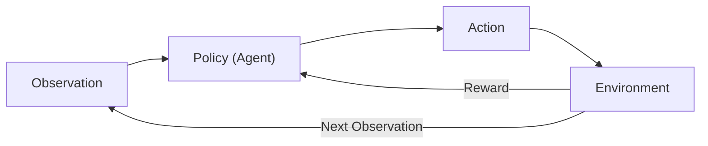

## What you'll learn

- the agent, environment, action, observation, and reward vocabulary
- what a **policy** is, and why some policies are stochastic
- three ways to search for a good policy (brute force, genetic algorithms, gradients)
- how to create and step through an OpenAI Gym environment
- how to hand-code a simple baseline policy for CartPole
- the **explore vs. exploit** trade-off, and why some policies act randomly on purpose

## The agent-environment-reward loop

In Reinforcement Learning, an **agent** observes an **environment**, takes an
**action**, and receives a **reward**. It repeats this over and over, and its
only goal is to maximize the total reward it collects — not to be "correct"
on any single step, the way supervised learning is.

- **agent** — the decision-maker (a robot's controller, a game-playing program, a thermostat)
- **environment** — everything the agent doesn't directly control (the real world, a game simulator)
- **observation** — what the agent perceives about the environment's current state
- **action** — what the agent is allowed to do
- **reward** — a number telling the agent how good or bad that step was

If you don't mind a bit of anthropomorphism, positive rewards feel like
pleasure and negative rewards feel like pain — the agent learns, by trial and
error, to chase the first and avoid the second.



## Policy search

The algorithm an agent uses to pick actions is called its **policy**. A policy
does not have to be a neural network, and it does not have to be
deterministic — a policy that involves randomness is called a **stochastic
policy**.

Take a robot vacuum whose only reward is how much dust it picks up in 30
minutes. A simple stochastic policy could be: move forward with probability
`p` each second, otherwise rotate left or right by a random angle. The only
two parameters are `p` and the rotation range `r`. There are a few ways to
search for good values of `p` and `r`:

- **brute force** — try many combinations, keep the best one (policy search)
- **genetic algorithms** — breed the best-performing policies across generations
- **policy gradients (PG)** — nudge the parameters in the direction that increases reward, using gradients

We'll build up to policy gradients later in this phase. First, we need
something to practice on — an environment.

## OpenAI Gym: CartPole

**OpenAI Gym** is a toolkit that ships many simulated environments (Atari
games, board games, physics simulations) so you can train and compare agents
without writing a simulator yourself. Here's the classic `CartPole`
environment: a cart that can be pushed left or right to balance a pole
standing on top of it.

```python title="explore_cartpole.py" showLineNumbers{1}
import gym
import numpy as np

env = gym.make("CartPole-v1")
obs = env.reset()
print("Initial observation:", obs)
print("Action space:", env.action_space)     # Discrete(2): 0 = left, 1 = right

# obs = [cart position, cart velocity, pole angle, pole angular velocity]
action = 1 if obs[2] > 0 else 0              # push toward the side the pole leans
obs, reward, done, info = env.step(action)
print("New observation:", obs)
print("Reward:", reward, "| Done:", done)
env.close()
```

Every call to `env.step(action)` returns four things:

- `obs` — the new observation
- `reward` — `1.0` for every step in CartPole, so the goal is simply to *survive as long as possible*
- `done` — `True` once the pole has tilted too far, the cart left the screen, or you hit the step limit
- `info` — an environment-specific dictionary, often empty

>>> import gym
>>> env = gym.make("CartPole-v1")
>>> obs = env.reset()
>>> obs
array([-0.0126, -0.0016, 0.0421, -0.0018])
>>> env.action_space
Discrete(2)

## A hardcoded baseline policy

Before reaching for a neural network, try the simplest thing that could
work: push right when the pole leans right, push left when it leans left.

```python title="basic_policy_cartpole.py" showLineNumbers{1}
import gym
import numpy as np

env = gym.make("CartPole-v1")

def basic_policy(obs):
    angle = obs[2]
    return 0 if angle < 0 else 1

totals = []
for episode in range(500):
    episode_rewards = 0
    obs = env.reset()
    for step in range(200):
        action = basic_policy(obs)
        obs, reward, done, info = env.step(action)
        episode_rewards += reward
        if done:
            break
    totals.append(episode_rewards)

print("mean:", np.mean(totals), "std:", np.std(totals))
print("min:", np.min(totals), "max:", np.max(totals))
env.close()
```

Even across 500 tries, this policy rarely balances the pole for more than
~70 steps — the cart oscillates more and more strongly until the pole tips
over. Not great, but it's a useful baseline before we bring in learning
algorithms later in this phase.

## Exploring vs. exploiting

The hardcoded policy above is **deterministic** — give it the same angle
twice, and it makes the same choice both times. That's fine for a two-line
baseline, but it can never discover a rule better than the one you wrote by
hand, because it never tries anything different.

A more capable policy — like the small neural network we'll build in
**Policy Gradients (Intro)** — instead outputs a *probability* for each
action and then **samples** one at random. In CartPole, the network outputs
`p`, the probability of pushing left, so it pushes left with probability `p`
and right with probability `1 - p`, rather than always doing whatever seems
best right now.

Why bother with randomness? It lets the agent balance two competing needs:

- **exploitation** — take the action you currently believe is best, to actually collect reward
- **exploration** — try something else occasionally, in case it turns out to be even better

Géron's analogy: imagine trying a restaurant for the first time. Every dish
looks equally appealing, so you order one at random. If it's great, you'll
probably raise the odds you'll order it again — but not all the way to
100%, or you'll never find out that another dish might have been even
better. Push a policy too far toward "always exploit" too early and it gets
stuck repeating a mediocre habit; keep it too random for too long and it
never settles into acting on what it's learned. We'll meet a concrete,
decaying version of this trade-off — the **ε-greedy policy** — on the next
page.

## Visualize it

Here's the agent-environment-reward loop in action: a simplified CartPole
where the pole tilts, the agent usually nudges the cart the way its policy
suggests (blue), but every so often takes a random exploratory push instead
(amber) — with the exploration rate `epsilon` decaying across episodes. The
reward counter climbs every step it survives, until the pole tips too far
and the episode resets.

```p5 title="Agent-environment-reward loop: explore vs. exploit" desc="Blue = the agent exploits its policy (push toward the side the pole leans). Amber = it explores with a random push instead. The exploration rate epsilon decays across episodes, like an epsilon-greedy policy." height="280"
let angle, angVel, cartX, reward, episode, wasExplore;
function resetEpisode() {
  angle = random(-0.12, 0.12);
  angVel = 0;
  cartX = 0;
  reward = 0;
  wasExplore = false;
  episode = (episode || 0) + 1;
}
function setup() {
  createCanvas(600, 280);
  textFont("monospace");
  resetEpisode();
}
function draw() {
  background(13, 17, 23);
  const groundY = height - 60;
  stroke(60, 70, 84);
  strokeWeight(1);
  line(40, groundY, width - 40, groundY);

  // exploration rate decays across episodes, like an epsilon-greedy policy
  const epsilon = Math.max(0.3 - episode * 0.015, 0.04);
  wasExplore = random() < epsilon;
  const greedyAction = angle > 0 ? 1 : -1;
  const action = wasExplore ? random([1, -1]) : greedyAction;

  const pushForce = 0.006 * action;
  angVel += 0.012 * Math.sin(angle) - pushForce;
  angVel *= 0.995;
  angle += angVel;
  cartX += action * 0.6;
  cartX = constrain(cartX, -140, 140);
  reward++;

  const cx = width / 2 + cartX;
  const cartCol = wasExplore ? color(255, 211, 67) : color(75, 139, 190);
  noStroke();
  fill(cartCol);
  rectMode(CENTER);
  rect(cx, groundY - 14, 70, 28, 6);

  // action arrow above the cart shows which way the policy just pushed
  push();
  translate(cx, groundY - 44);
  const arrowLen = 16;
  stroke(cartCol);
  strokeWeight(3);
  line(-action * arrowLen, 0, action * arrowLen, 0);
  noStroke();
  fill(cartCol);
  triangle(
    action * arrowLen, -5,
    action * arrowLen, 5,
    action * arrowLen + action * 8, 0
  );
  pop();

  const poleLen = 90;
  const tipX = cx + poleLen * Math.sin(angle);
  const tipY = groundY - 14 - poleLen * Math.cos(angle);
  stroke(255, 211, 67);
  strokeWeight(5);
  line(cx, groundY - 14, tipX, tipY);
  noStroke();
  fill(255, 211, 67);
  ellipse(tipX, tipY, 12, 12);

  fill(107, 169, 221);
  textAlign(CENTER, CENTER);
  textSize(13);
  text("episode " + episode + "   reward " + reward, width / 2, 20);

  fill(wasExplore ? color(255, 211, 67) : color(107, 200, 190));
  textSize(12);
  text((wasExplore ? "explore" : "exploit") + "  (epsilon " + epsilon.toFixed(2) + ")", width / 2, 42);

  if (Math.abs(angle) > 0.6 || Math.abs(cartX) >= 140) {
    resetEpisode();
  }
}
function mousePressed() { resetEpisode(); }
```

:::note[From the book]
Géron stresses that CartPole's observations are unusually clean: they
contain the environment's *full* state (position, velocity, angle, angular
velocity), with no noise. That's why a two-line hardcoded policy already
does okay — real environments (robots, Atari pixels) are rarely this kind,
and that's exactly where learned, exploring policies start to pull ahead.
:::

## Mini-checkpoint

If `env.step()` returns `reward = 1.0` on every single step no matter what
the agent does, what should the agent actually be optimizing for?

- Not the reward *value* itself (it never changes) — but the *number of steps* it survives before `done` becomes `True`.

## 🧪 Try It Yourself

import DataCampExercise from "../../../../components/DataCampExercise.astro";

### Exercise 1 – Create and Reset an Environment

<DataCampExercise
  lang="python"
  hint={`Use \`gym.make("CartPole-v1")\` to create the environment, then call \`.reset()\` to get the first observation.`}
  code={`# Task: Exercise 1 - Create and Reset an Environment
import gym

env = gym.___("CartPole-v1")   # replace ___ with make
obs = env.___()                 # replace ___ with reset
print("Observation length:", len(obs))
print("Action space:", env.action_space)

# ── Expected Output ───────────────────────────────────────────
# Observation length: 4
# Action space: Discrete(2)
# ──────────────────────────────────────────────────────────────`}
  solution={`import gym

env = gym.make("CartPole-v1")
obs = env.reset()
print("Observation length:", len(obs))
print("Action space:", env.action_space)`}
  sct={`test_output_contains("Observation length: 4")
test_output_contains("Discrete(2)")
success_msg("Environment created and reset correctly!")`}
  height={140}
/>

### Exercise 2 – Write a Hardcoded Policy

<DataCampExercise
  lang="python"
  hint={`The pole's angle is \`obs[2]\`. Push right (return 1) when it leans right (angle > 0), otherwise push left (return 0).`}
  code={`# Task: Exercise 2 - Write a Hardcoded Policy
import numpy as np

def basic_policy(obs):
    angle = obs[2]
    return 0 if angle ___ 0 else 1   # replace ___ with <

obs = np.array([0.0, 0.0, 0.05, 0.0])
print("Action:", basic_policy(obs))

obs2 = np.array([0.0, 0.0, -0.05, 0.0])
print("Action:", basic_policy(obs2))

# ── Expected Output ───────────────────────────────────────────
# Action: 1
# Action: 0
# ──────────────────────────────────────────────────────────────`}
  solution={`import numpy as np

def basic_policy(obs):
    angle = obs[2]
    return 0 if angle < 0 else 1

obs = np.array([0.0, 0.0, 0.05, 0.0])
print("Action:", basic_policy(obs))

obs2 = np.array([0.0, 0.0, -0.05, 0.0])
print("Action:", basic_policy(obs2))`}
  sct={`test_output_contains("Action: 1")
test_output_contains("Action: 0")
success_msg("Policy correctly reacts to the pole's angle!")`}
  height={160}
/>

### Exercise 3 – Track Episode Rewards

<DataCampExercise
  lang="python"
  hint={`Add each step's \`reward\` to \`episode_rewards\`, and break out of the loop once \`done\` is True.`}
  code={`# Task: Exercise 3 - Track Episode Rewards
rewards_per_step = [1.0, 1.0, 1.0, 1.0, 1.0]
dones = [False, False, False, True, False]

episode_rewards = 0
for reward, done in zip(rewards_per_step, dones):
    episode_rewards ___ reward   # replace ___ with +=
    if done:
        ___                      # replace ___ with break

print("Total reward:", episode_rewards)

# ── Expected Output ───────────────────────────────────────────
# Total reward: 4.0
# ──────────────────────────────────────────────────────────────`}
  solution={`rewards_per_step = [1.0, 1.0, 1.0, 1.0, 1.0]
dones = [False, False, False, True, False]

episode_rewards = 0
for reward, done in zip(rewards_per_step, dones):
    episode_rewards += reward
    if done:
        break

print("Total reward:", episode_rewards)`}
  sct={`test_output_contains("Total reward: 4.0")
success_msg("Episode reward tracked correctly!")`}
  height={160}
/>

## Next

Continue to **Q-Learning & Deep Q-Networks** — learn how Markov decision
processes formalize this loop, and how an agent can learn Q-values without
ever being told the environment's rules.
