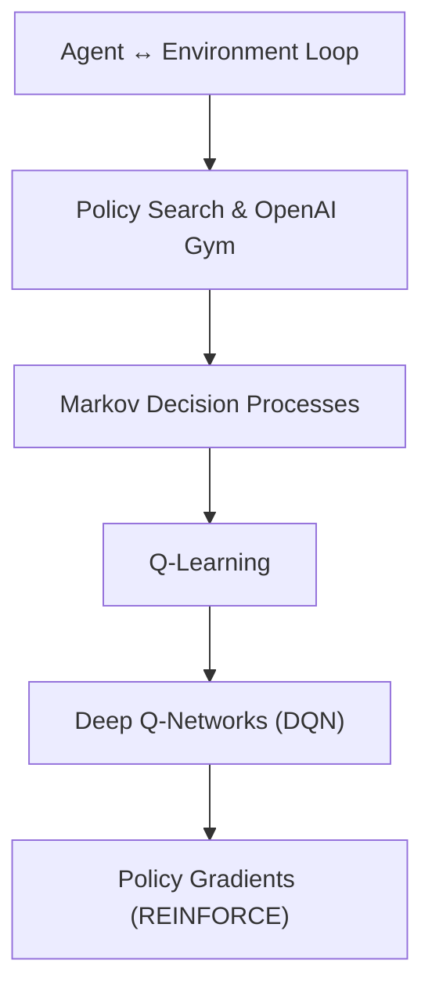

## What Reinforcement Learning is

In **Reinforcement Learning (RL)**, a software **agent** makes observations and
takes **actions** inside an **environment**, and in return it receives
**rewards**. The agent's whole job is to learn a way of acting — a **policy** —
that maximizes its expected reward over time. Nobody hands it labeled
examples; it has to figure out what works through trial and error.

That loop shows up almost everywhere:

- a robot getting closer to (or further from) a target destination
- a game-playing program scoring points
- a thermostat balancing comfort against energy use
- a trading bot buying and selling based on market moves

## Phase 7 flow

## Suggested practice environment

The classic first environment is **CartPole** from OpenAI Gym: balance a pole
on a moving cart by pushing it left or right. It is small enough to reason
about by hand, yet rich enough to show off both value-based methods
(Q-Learning, DQN) and policy-based methods (policy gradients).

:::tip[From the book]
Géron opens this chapter by pointing out that RL is one of the oldest fields
in Machine Learning — going back to the 1950s — yet it stayed a research
curiosity until 2013, when DeepMind combined it with Deep Learning to learn
Atari games from raw pixels alone. That same recipe scaled up to AlphaGo
beating the world's best Go players in 2016–2017. This phase builds the same
foundations DeepMind used: policy search, Markov decision processes,
Q-Learning, and policy gradients.
:::
