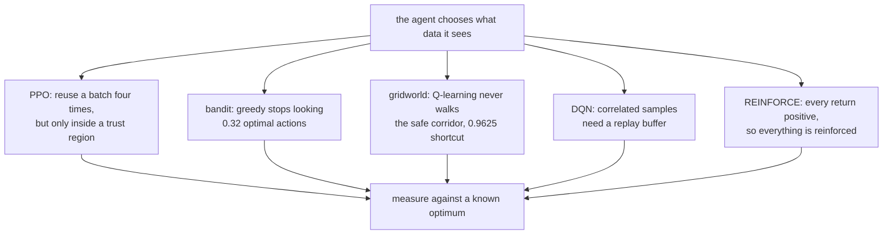

import Figure from "../../../../components/Figure.astro";
import Quiz from "../../../../components/Quiz.astro";

In every phase so far the data arrived first and the model came second. Reinforcement learning
inverts that: the agent's own choices decide what data it ever sees. An action not taken teaches
nothing, and a policy that settles early will keep confirming whatever it settled on.

That single property causes almost every result in this phase, including the ones that
contradict the standard story.

## What was measured

Everything ran on this machine. There is no `gymnasium` installed and nothing may be downloaded,
so all three environments are hand-written in `scripts/figures/dl/_rl.py` — a k-armed bandit, a
stochastic gridworld solvable exactly by value iteration, and a vectorised CartPole using the
same constants as the classic implementation. CartPole validates against it: a random policy
survives **23.09** steps here against the reference's ~22.

| Page | The claim being tested | Result |
| --- | --- | --- |
| [Exploration vs exploitation](/deep-learning/phase-07---reinforcement-learning/exploration-vs-exploitation-bandits-and-epsilon-schedules/) | Greedy is worse than ε-greedy | True on average (520.92 vs 224.74) — but greedy's seeds ranged **0.00 to 2394.40** |
| [Introduction to RL](/deep-learning/phase-07---reinforcement-learning/introduction-to-reinforcement-learning/) | The discount factor is a technical detail | **False** — it switches the optimal route and moves the goal rate 0.7925 → 0.8900 |
| [Q-learning and DQN](/deep-learning/phase-07---reinforcement-learning/q-learning--deep-q-networks/) | Replay and target networks each help | Only **together**: 144.20 against 53.45 for either alone and 48.81 for neither |
| [Policy gradients](/deep-learning/phase-07---reinforcement-learning/policy-gradients-intro/) | A baseline improves learning | It cut the gradient norm **35×** and changed the score by **0.27** |
| [Actor-critic and PPO](/deep-learning/phase-07---reinforcement-learning/actor-critic-and-ppo-intro/) | PPO is more stable than REINFORCE | Only past 4 reuse steps — at 16 the unclipped worst seed scored **9.2**, below random. Sample efficiency: **170 episodes against 544** |

<Figure
  src="/images/dl/phase-07-rl/exploration/strategies"
  alt="Left: horizontal bars of total regret with error bars for five strategies — optimistic start lowest at 137.07 but with a large error bar, UCB at 152.03 with a very small one, epsilon-greedy 0.1 at 224.74, decaying at 373.31 and greedy at 520.92 with a huge error bar. Right: cumulative regret curves showing greedy climbing steeply and UCB flattening earliest."
  title="200 bandits per strategy, 1000 pulls each"
  caption="Optimistic initialisation has the lowest mean regret at 137.07 and UCB is second at 152.03 — but the error bars reverse the ranking's reliability. UCB's spread across seeds is 31.49 with a worst case of 244.06, while optimistic initialisation varies by 243.88 and can reach 1278.93. If you must be right on one attempt rather than on average, those are different recommendations."
/>

<Figure
  src="/images/dl/phase-07-rl/q-learning-and-dqn/dqn-ablation"
  alt="Left: mean episode length against environment frames for four configurations, with replay-plus-target climbing steadily past 140 while the other three plateau near 50, and dashed lines at the random baseline of 23 and the episode cap of 200. Right: horizontal bars of final episode length with error bars across three seeds, showing replay+target at 144.20, replay only and target only both at 53.45, and neither at 48.81."
  title="6,000 frames across 16 parallel environments, 3 seeds each"
  caption="The two mechanisms are not independently useful here — each alone lands at 53.45, barely above the 48.81 of using neither. Together they reach 144.20. The error bars carry the other half of the story: replay-only is remarkably consistent (sd 1.84) because it reliably plateaus, while target-only ranges from 25.47 to 105.12 depending on the seed."
/>

<Figure
  src="/images/dl/overviews/phase-summaries/phase-7"
  alt="Horizontal bars, one per page in the phase, each labelled with the claim it tested and coloured by the verdict: green where the standard story held, amber where it held at a price, red where the measurement contradicted it. 4 of 6 claims contradicted, 2 held at a price, 0 held."
  title="Every claim this phase set out to test"
  caption="Collected from the runs behind each page's own figures rather than measured afresh, so every bar is traceable to the page it names. Bar length is the log of the effect size, because the effects span from 0.0014 to 5,376 — the number that matters is printed on each bar. Across all nine phases, 34 of 54 claims were contradicted outright, 11 held at a cost that was worth stating, and 9 held as advertised."
/>

## The thread running through all four



Each page attacks the same problem at a different scale, and each one needs an **external
reference** to be interpretable:

- The bandit knows its best arm, so regret is exact.
- The gridworld is small enough for value iteration, so the optimal policy is known.
- CartPole has a 200-step cap and a measured random baseline of 23.09 — which is what makes
  the unclipped PPO seed that scored 9.2 legible as a catastrophe rather than a low number.

Without those references, every curve in this phase would merely go up.

```p5 title="How often the standard story survived" desc="Step through the phases. Each bar splits the claims that phase tested into contradicted, held at a price, and held as advertised - the totals are summed live." height="400"
let picked = 0;
const PHASES = [
  [1, "Neural Network Foundations", 3, 0, 3, "a single neuron cannot do XOR - 0 of 40,401 weight pairs"],
  [2, "Training Deep Networks", 2, 2, 2, "146x the parameters bought 0.0150 accuracy"],
  [3, "Computer Vision", 4, 1, 1, "augmentation cost 0.1855 clean, bought 0.1105 rotated"],
  [4, "Sequence Models", 4, 2, 0, "a fixed state scored 0.0017 against attention's 1.0000"],
  [5, "NLP & Transformers", 4, 1, 1, "TF-IDF 0.8632 beat a transformer's 0.8462, 55x cheaper"],
  [6, "Generative", 3, 1, 2, "copying 200 real images scored FID 5.027 against real 9.605"],
  [7, "Reinforcement Learning", 4, 2, 0, "replay and target nets: 144.20 together, 53.45 either alone"],
  [8, "Scaling & Deployment", 5, 1, 0, "mixed precision measured 40.65x SLOWER on this CPU"],
  [9, "Capstones", 5, 1, 0, "a memoriser beat the VAE on Frechet distance"]
];
function setup() {
  createCanvas(620, 400);
  textFont("monospace");
}
function draw() {
  background(13, 17, 23);
  noStroke();
  fill(230);
  textSize(12);
  textAlign(LEFT, TOP);
  text("54 claims, 9 phases, every one tested by a measurement", 26, 16);
  let broke = 0;
  let cost = 0;
  let held = 0;
  for (let i = 0; i < PHASES.length; i++) {
    broke += PHASES[i][2];
    cost += PHASES[i][3];
    held += PHASES[i][4];
  }
  for (let i = 0; i < PHASES.length; i++) {
    const y = 48 + i * 26;
    const row = PHASES[i];
    const chosen = i === picked;
    fill(chosen ? 255 : 130, chosen ? 211 : 140, chosen ? 67 : 155);
    textSize(9);
    text("Phase " + row[0] + "  " + row[1], 26, y + 5);
    let x = 250;
    const unit = 34;
    fill(224, 108, 117);
    rect(x, y, row[2] * unit, 17, 2);
    x += row[2] * unit;
    fill(255, 211, 67);
    rect(x, y, row[3] * unit, 17, 2);
    x += row[3] * unit;
    fill(126, 192, 143);
    rect(x, y, row[4] * unit, 17, 2);
    if (chosen) {
      noFill();
      stroke(255, 211, 67);
      strokeWeight(1.5);
      rect(248, y - 2, 6 * unit + 4, 21, 3);
      noStroke();
    }
  }
  const row = PHASES[picked];
  fill(200);
  textSize(10);
  text("Phase " + row[0] + " headline:", 26, 300);
  fill(255, 211, 67);
  textSize(10);
  text(row[5], 26, 318);
  fill(150);
  textSize(9);
  text("contradicted " + row[2] + "   held at a price " + row[3]
       + "   held " + row[4], 26, 340);
  fill(224, 108, 117);
  rect(26, 360, 12, 12, 2);
  fill(150);
  textSize(9);
  text("contradicted  " + broke + " of 54", 44, 362);
  fill(255, 211, 67);
  rect(210, 360, 12, 12, 2);
  fill(150);
  text("held at a price  " + cost, 228, 362);
  fill(126, 192, 143);
  rect(400, 360, 12, 12, 2);
  fill(150);
  text("held  " + held, 418, 362);
  fill(110);
  textSize(8.5);
  text("click a row. Collected from each page's own measured run.", 26, 382);
}
function mousePressed() {
  for (let i = 0; i < PHASES.length; i++) {
    const y = 48 + i * 26;
    if (mouseY > y && mouseY < y + 20) { picked = i; }
  }
}
```

## What went differently than expected

Three results are worth carrying forward, because they are the kind that a plot alone would
hide.

**Q-learning found a worse policy than the optimum and looked converged.** On the gridworld it
took the risky shortcut in 96.25% of episodes where the exact solution takes it in 7.75%,
scoring 0.5497 against 0.6568. Nothing about its learning curve says so — the failure is that
ε-greedy almost never traverses a 12-step corridor, so the better route was never evaluated.

**Low regret can mean an easy problem.** ε-greedy's regret was *lowest* on the hardest bandit
(99.87 with arms close together, 414.38 with them far apart) because a wrong choice costs little
when the arms are nearly identical. The optimal-action share tells the opposite, correct story.

**Variance reduction is not the same as better learning.** REINFORCE's baseline did exactly what
theory says to the gradient — 1.6992 → 0.0478 — and the final score moved 0.27. Separately,
*smaller* batches beat larger ones at a fixed episode budget (200.00 against 173.04) despite
having measurably noisier gradients.

## Two engineering facts that decide whether any of this runs

Both were measured while building these pages, and both matter more than any hyperparameter
here:

| Way to run a batch through a network | Time per call |
| --- | --- |
| `model.predict(x)` | ~470 ms |
| `model(x)` eager | ~28 ms |
| Traced `tf.function` | **~1.2 ms** |

An RL loop makes several forward passes per environment frame, so that 390× gap is the
difference between a page that runs in minutes and one that does not run at all. The same logic
applies to the environment: stepping 16 CartPoles together costs one model call per timestep
instead of sixteen, measured at roughly 16× faster for REINFORCE's episode collection.

```p5 title="The two mechanisms, toggled" desc="Click either switch. The bar shows the measured final episode length for that combination — the point being that neither switch does much alone." height="330"
let replay = false;
let target = false;
const SCORES = { "00": 48.81, "10": 53.45, "01": 53.45, "11": 144.20 };
const RANDOM = 23.09;
const CAP = 200;
function setup() {
  createCanvas(620, 330);
  textFont("monospace");
}
function key() { return (replay ? "1" : "0") + (target ? "1" : "0"); }
function draw() {
  background(13, 17, 23);
  noStroke();
  fill(230);
  textSize(12);
  textAlign(LEFT, TOP);
  text("DQN on CartPole - 6,000 frames, 3 seeds", 26, 18);
  drawSwitch(26, 52, "replay buffer", replay);
  drawSwitch(240, 52, "target network", target);
  const score = SCORES[key()];
  const y = 130;
  fill(40, 47, 58);
  rect(26, y, 560, 34, 4);
  fill(60, 70, 84);
  rect(26, y, (RANDOM / CAP) * 560, 34, 4);
  const good = score > 100;
  if (good) { fill(126, 192, 143); } else { fill(224, 108, 117); }
  rect(26, y, (score / CAP) * 560, 34, 4);
  fill(240);
  textSize(13);
  text(score.toFixed(2), 34, y + 10);
  fill(150);
  textSize(9);
  text("random policy " + RANDOM, 26, y + 42);
  text("episode cap " + CAP, 520, y + 42);
  fill(150);
  textSize(10);
  const lines = [
    "neither:            48.81",
    "replay only:        53.45",
    "target only:        53.45",
    "both:              144.20",
  ];
  for (let i = 0; i < lines.length; i++) {
    if (i === ["00", "10", "01", "11"].indexOf(key())) {
      fill(255, 211, 67);
    } else {
      fill(110);
    }
    text(lines[i], 26, 200 + i * 18);
  }
  fill(150);
  textSize(9.5);
  text("either switch alone buys 4.64 over neither. Both together buy 95.39.", 26, 290);
  text("the mechanisms are not additive - they are a pair.", 26, 306);
}
function drawSwitch(x, y, label, on) {
  if (on) { fill(126, 192, 143); } else { fill(48, 56, 68); }
  rect(x, y, 44, 22, 11);
  fill(13, 17, 23);
  circle(on ? x + 33 : x + 11, y + 11, 16);
  fill(on ? 230 : 130);
  textSize(11);
  textAlign(LEFT, CENTER);
  text(label, x + 54, y + 11);
  textAlign(LEFT, TOP);
}
function mousePressed() {
  if (mouseY > 52 && mouseY < 74) {
    if (mouseX > 26 && mouseX < 200) { replay = !replay; }
    if (mouseX > 240 && mouseX < 420) { target = !target; }
  }
}
```

## Reading order

1. **Exploration vs exploitation** — the dilemma with everything else stripped away, and the
   reason a single run can never rank two strategies.
2. **Introduction to reinforcement learning** — add states, and a discount factor that decides
   between a gamble and a detour.
3. **Q-learning and deep Q-networks** — the tabular update, why a network breaks it, and an
   ablation of the two mechanisms that repair it.
4. **Policy gradients** — skip the value function entirely and pay for it in variance.
5. **Actor-critic and PPO** — put a learned value function back in as a baseline, then make it
   safe to take four gradient steps on one batch instead of one.

## What this phase does not cover

- **Pixel-based environments.** Everything here uses low-dimensional state vectors, so no
  convolutional encoder is involved and none of the Atari-scale engineering appears.
- **Long-horizon or sparse-reward tasks.** CartPole's reward is dense and its episodes are
  capped at 200 steps, which is precisely why the REINFORCE baseline had no room to show a
  benefit.

Each page states its own budget beside its numbers, so nothing here needs to be taken on trust.

## Next

Start with
[Exploration vs Exploitation](/deep-learning/phase-07---reinforcement-learning/exploration-vs-exploitation-bandits-and-epsilon-schedules/) —
ten levers, a thousand pulls, and the measurement that every later page depends on.

<Quiz
  questions={[
    {
      q: "A DQN with a replay buffer alone reached 53.45 and with a target network alone reached 53.45, against 48.81 for neither and 144.20 for both. What does that pattern mean?",
      options: [
        "The two mechanisms do the same job, so either one is enough",
        "The measurements are too noisy to interpret",
        "Each mechanism only pays off once the other has removed a different failure — their effects are not additive",
        "The target network is redundant"
      ],
      answer: 2,
      explanation: "Replay decorrelates the samples; the target network stops the regression target moving. Fix one and the other still breaks training, which is why the ablation has to test all four cells rather than two."
    },
    {
      q: "Every environment in this phase is hand-written in `_rl.py` rather than imported from a library. Why does the phase check that a random CartPole policy survives 23.09 steps?",
      options: [
        "To confirm the random number generator is seeded",
        "Because a hand-written environment has to be validated against the reference implementation before any result measured in it means anything",
        "Because 23 steps is the target score",
        "To measure how fast the environment runs"
      ],
      answer: 1,
      explanation: "The reference implementation gives about 22. Without that agreement, every later number would be measured in an environment that might simply be a different problem."
    },
    {
      q: "ε-greedy scored its LOWEST regret (99.87) on the bandit whose arms were closest together, and its highest (414.38) when they were far apart. What is going on?",
      options: [
        "Close-together arms are genuinely easier to solve",
        "Regret measures reward lost per wrong choice, and when the arms are nearly identical a wrong choice costs almost nothing — low regret here means low stakes, not good behaviour",
        "The strategy adapts to the difficulty automatically",
        "The measurement is wrong"
      ],
      answer: 1,
      explanation: "The optimal-action share tells the opposite story on the same runs. A metric that conflates 'chose well' with 'the choice did not matter' will rank an easy problem as a success."
    },
    {
      q: "Q-learning on the gridworld took the risky shortcut in 96.25% of episodes where the exact solution takes it in 7.75%, and its learning curve looked converged. What caused it?",
      options: [
        "The learning rate was too high",
        "The discount factor was wrong",
        "ε-greedy almost never strings together the 12 steps needed to traverse the safe corridor, so the better route was never evaluated — the agent's own policy decided what data existed",
        "Not enough episodes"
      ],
      answer: 2,
      explanation: "This is the phase's central property. A supervised model sees the whole dataset; an agent only sees what its own choices generated, so an unexplored option stays unevaluated forever and the curve says nothing about it."
    },
    {
      q: "`model.predict(x)` measured ~470 ms per call, eager `model(x)` ~28 ms, and a traced `tf.function` ~1.2 ms. Why does this decide whether an RL page exists at all?",
      options: [
        "It does not — it only affects the final benchmark table",
        "An RL loop makes several forward passes per environment frame and needs thousands of episodes, so a 390× per-call gap is the difference between minutes and days",
        "Because `predict` gives different answers",
        "Because tracing improves accuracy"
      ],
      answer: 1,
      explanation: "`predict` carries per-call setup designed for large batches and pays it every time. In a loop that calls it once per frame that overhead is the entire runtime."
    }
  ]}
/>
