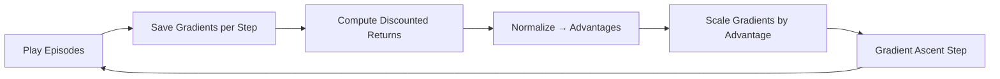

## What you'll learn

- the **credit assignment problem** — why rewards are hard to attribute to specific actions
- discounted returns and the **action advantage**
- the **REINFORCE** policy gradient algorithm, step by step
- how to implement it with a small `tf.keras` neural network policy for CartPole
- why policy gradients are **on-policy**, unlike Q-Learning

## The credit assignment problem

Suppose an agent balances a pole for 100 steps and then it falls. Which of
those 100 actions were actually good, and which were bad? All the agent
knows is that the *last* action came right before failure — but blaming only
that action would be unfair, since earlier actions set up the situation too.
This is the **credit assignment problem**: when a reward finally arrives, it's
hard to know which earlier actions deserve credit (or blame) for it. It's a
bit like a dog getting rewarded hours after it behaved well — will it
understand what it's being rewarded *for*?

The usual fix: evaluate an action by the sum of **all rewards that follow
it**, discounted by a factor `γ` (gamma) at each future step. This sum is
called the action's **return**. If an agent goes right three times and gets
`+10`, then `0`, then `-50`, with `γ = 0.8`, the first action's return is:

```
10 + 0.8 · 0 + 0.8² · (-50) = -22
```

Run enough episodes, normalize all the returns (subtract the mean, divide by
the standard deviation), and you get each action's **advantage** — how much
better or worse it was than average. Positive advantage → probably a good
action; negative advantage → probably a bad one.

## The REINFORCE algorithm

**Policy gradients (PG)** optimize a policy's parameters by following the
gradient toward higher reward. The classic variant, **REINFORCE**, works like
this:

1. Let the policy network play several episodes. At every step, compute the
   gradient that would make the action *actually taken* more likely — but
   don't apply it yet.
2. After a batch of episodes, compute every action's advantage.
3. Multiply each saved gradient by its action's advantage — good actions
   push their gradient through as-is; bad actions get the *opposite* nudge.
4. Average all the resulting gradients and take one Gradient Descent (well,
   *ascent*) step.



This is different from Q-Learning in an important way: PG is **on-policy** —
it only ever learns about the exact policy currently exploring the
environment. Q-Learning is **off-policy**: it can learn the optimal policy
while exploring with a totally different (even random) one.

## A neural network policy

For CartPole, the policy network takes the 4-number observation and outputs
a single probability — the probability of pushing left:

```python title="policy_network.py" showLineNumbers{1}
import tensorflow as tf
from tensorflow import keras

n_inputs = 4  # env.observation_space.shape[0]

model = keras.models.Sequential([
    keras.layers.Dense(5, activation="elu", input_shape=[n_inputs]),
    keras.layers.Dense(1, activation="sigmoid"),
])
```

An action is then *sampled* according to that probability, not just picked
greedily — this lets the agent balance **exploring** new actions against
**exploiting** ones it already knows work well.

## Playing episodes and computing returns

```python title="reinforce_cartpole.py" showLineNumbers{1}
import gym
import numpy as np
import tensorflow as tf
from tensorflow import keras

env = gym.make("CartPole-v1")

def play_one_step(env, obs, model, loss_fn):
    with tf.GradientTape() as tape:
        left_proba = model(obs[np.newaxis])
        action = (tf.random.uniform([1, 1]) > left_proba)
        y_target = tf.constant([[1.]]) - tf.cast(action, tf.float32)
        loss = tf.reduce_mean(loss_fn(y_target, left_proba))
    grads = tape.gradient(loss, model.trainable_variables)
    obs, reward, done, info = env.step(int(action[0, 0].numpy()))
    return obs, reward, done, grads

def play_multiple_episodes(env, n_episodes, n_max_steps, model, loss_fn):
    all_rewards, all_grads = [], []
    for episode in range(n_episodes):
        current_rewards, current_grads = [], []
        obs = env.reset()
        for step in range(n_max_steps):
            obs, reward, done, grads = play_one_step(env, obs, model, loss_fn)
            current_rewards.append(reward)
            current_grads.append(grads)
            if done:
                break
        all_rewards.append(current_rewards)
        all_grads.append(current_grads)
    return all_rewards, all_grads

def discount_rewards(rewards, discount_factor):
    discounted = np.array(rewards, dtype=float)
    for step in range(len(rewards) - 2, -1, -1):
        discounted[step] += discounted[step + 1] * discount_factor
    return discounted

def discount_and_normalize_rewards(all_rewards, discount_factor):
    all_discounted = [discount_rewards(r, discount_factor) for r in all_rewards]
    flat = np.concatenate(all_discounted)
    mean, std = flat.mean(), flat.std()
    return [(dr - mean) / std for dr in all_discounted]
```

>>> discount_rewards([10, 0, -50], discount_factor=0.8)
array([-22., -40., -50.])

## The training loop

```python title="reinforce_training_loop.py" showLineNumbers{1}
n_inputs = 4
model = keras.models.Sequential([
    keras.layers.Dense(5, activation="elu", input_shape=[n_inputs]),
    keras.layers.Dense(1, activation="sigmoid"),
])

n_iterations = 150
n_episodes_per_update = 10
n_max_steps = 200
discount_factor = 0.95

optimizer = keras.optimizers.Adam(learning_rate=0.01)
loss_fn = keras.losses.binary_crossentropy

for iteration in range(n_iterations):
    all_rewards, all_grads = play_multiple_episodes(
        env, n_episodes_per_update, n_max_steps, model, loss_fn)
    all_final_rewards = discount_and_normalize_rewards(all_rewards, discount_factor)

    all_mean_grads = []
    for var_index in range(len(model.trainable_variables)):
        mean_grads = tf.reduce_mean(
            [final_reward * all_grads[ep][step][var_index]
             for ep, final_rewards in enumerate(all_final_rewards)
             for step, final_reward in enumerate(final_rewards)],
            axis=0)
        all_mean_grads.append(mean_grads)
    optimizer.apply_gradients(zip(all_mean_grads, model.trainable_variables))
```

At every iteration, this plays 10 episodes, computes each action's
normalized advantage (called `final_reward` here), then weights the saved
gradients by that advantage before applying the mean gradient with the
optimizer. Trained this way, the mean reward per episode climbs toward 200 —
the maximum for CartPole. Success!

This basic REINFORCE algorithm is *sample inefficient* — it needs many
episodes to get a reliable advantage estimate for each action — but it's the
foundation that more advanced methods, like Actor-Critic algorithms, build
on.

## Visualize it

Rather than a table of Q-values, a policy network's "belief" is a probability
per action for every state it might see. Below, each vertical arrow stands
for one pole angle (labeled underneath), and it points the way the policy
currently prefers to push from that angle. Early in training the arrows are
noisy and half-wrong (dim gray); as training iterations climb, more of them
swing around to agree with the correct correction direction and grow bolder
(amber) — the policy is converging, the same way it does inside the
training loop above:

```p5 title="Policy arrows shifting toward the correct push" desc="One arrow per pole angle (labeled below it), pointing the way the policy currently prefers to push. Early on the arrows are noisy; as training iterations increase, more agree with the correct direction and grow bolder — the policy converging on the right behavior." height="280"
let iter;
function resetRun() {
  iter = 0;
}
function setup() {
  createCanvas(600, 280);
  textFont("monospace");
  resetRun();
}
const SENSORS = 7;
function drawArrow(x, y, dirSign, len, col) {
  stroke(col);
  strokeWeight(3);
  line(x - (dirSign * len) / 2, y, x + (dirSign * len) / 2, y);
  noStroke();
  fill(col);
  const tipX = x + (dirSign * len) / 2;
  triangle(tipX, y - 6, tipX, y + 6, tipX + dirSign * 10, y);
}
function draw() {
  background(13, 17, 23);
  iter++;
  const progress = constrain(iter / 300, 0, 1);
  const reward = constrain(20 + progress * 175, 0, 200);

  noStroke();
  fill(107, 169, 221);
  textAlign(LEFT, CENTER);
  textSize(12);
  text(
    "training iteration " + iter + "    avg reward " + reward.toFixed(0) + " / 200",
    20,
    22
  );

  noStroke();
  fill(90, 100, 114);
  textAlign(CENTER, CENTER);
  textSize(11);
  text("pole angle  ->  preferred push direction", width / 2, 66);

  const baseY = height / 2 + 30;
  const startX = 70, endX = width - 70;
  for (let i = 0; i < SENSORS; i++) {
    const t = i / (SENSORS - 1);
    const angle = lerp(-0.2, 0.2, t);
    const x = lerp(startX, endX, t);
    const correctDir = angle >= 0 ? 1 : -1;
    const wobble = (1 - progress) * 1.4 * Math.sin(frameCount * 0.11 + i * 1.9);
    const dirSign = correctDir + wobble >= 0 ? 1 : -1;
    const confident = dirSign === correctDir;
    const len = 20 + 14 * progress;
    const col = confident ? color(255, 211, 67) : color(90, 100, 114);
    drawArrow(x, baseY, dirSign, len, col);

    noStroke();
    fill(150, 160, 174);
    textAlign(CENTER, CENTER);
    textSize(10);
    text(angle.toFixed(2), x, baseY + 30);
  }

  if (iter > 360) resetRun();
}
function mousePressed() { resetRun(); }
```

:::tip[From the book]
Géron notes you don't have to make the agent discover everything from
scratch — if you already know the pole should stay vertical, you can add a
small negative reward proportional to its angle to make rewards less
sparse, or pretrain the network to imitate a hardcoded policy before
switching to policy gradients. Injecting prior knowledge like this — unless
you're specifically writing a research paper — speeds up training a lot.
:::

## Beyond REINFORCE: Actor-Critic and friends

Plain REINFORCE is *sample inefficient* — it has to play a whole batch of
episodes just to get one noisy advantage estimate per action, which is slow.
Most modern policy-gradient methods fix this by borrowing an idea from
Q-Learning:

- **Actor-Critic** — train two networks together: the **actor** is the
  policy net (same role as before), and the **critic** is a DQN-style
  network that estimates action values. Instead of waiting for whole
  episodes to finish before it knows how good an action was, the actor asks
  the critic — a bit like an athlete (the actor) improving faster with
  live feedback from a coach (the critic), instead of only reviewing game
  tape after the fact.
- **A3C** (Asynchronous Advantage Actor-Critic) — many actor-critic agents
  explore different copies of the environment in parallel, each pushing
  weight updates to a shared network and pulling the latest weights back.
- **A2C** — the same idea as A3C, but synchronous: all agents update
  together in bigger batches, which uses a GPU more efficiently.
- **SAC** (Soft Actor-Critic) — rewards the agent for staying somewhat
  unpredictable (maximizing action *entropy*, not just reward), which keeps
  it exploring longer and tends to be dramatically more sample-efficient.
- **PPO** (Proximal Policy Optimization) — clips how far a single update
  can push the policy, which avoids the training instabilities that come
  from occasional oversized gradient steps. PPO is what OpenAI Five used to
  beat the world champions at Dota 2 in 2019.

You won't implement all of these by hand — in practice, reach for a
maintained library such as **TF-Agents**, which already ships REINFORCE,
DQN, and other algorithms with production-ready replay buffers and
environment wrappers, so you can swap algorithms without rewriting your
training loop.

## Mini-checkpoint

If an episode's total reward turns out to be worse than average, what
happens to the gradients recorded during that episode's steps?

- Their advantage is negative, so the optimizer applies the *opposite* of the saved gradient — making those actions slightly *less* likely next time.

## 🧪 Try It Yourself

import DataCampExercise from "../../../../components/DataCampExercise.astro";

### Exercise 1 – Discount the Rewards

<DataCampExercise
  lang="python"
  hint={`Walk backward through the rewards list, adding \`discount_factor\` times the next discounted value to each step.`}
  code={`# Task: Exercise 1 - Discount the Rewards
import numpy as np

def discount_rewards(rewards, discount_factor):
    discounted = np.array(rewards, dtype=float)
    for step in range(len(rewards) - 2, -1, -1):
        discounted[step] += discounted[step + 1] * ___   # replace ___ with discount_factor
    return discounted

result = discount_rewards([10, 0, -50], discount_factor=0.8)
print(result)

# ── Expected Output ───────────────────────────────────────────
# [-22. -40. -50.]
# ──────────────────────────────────────────────────────────────`}
  solution={`import numpy as np

def discount_rewards(rewards, discount_factor):
    discounted = np.array(rewards, dtype=float)
    for step in range(len(rewards) - 2, -1, -1):
        discounted[step] += discounted[step + 1] * discount_factor
    return discounted

result = discount_rewards([10, 0, -50], discount_factor=0.8)
print(result)`}
  sct={`test_output_contains("-22")
test_output_contains("-50")
success_msg("Rewards discounted correctly!")`}
  height={168}
/>

### Exercise 2 – Normalize the Advantages

<DataCampExercise
  lang="python"
  hint={`Subtract the mean and divide by the standard deviation: \`(x - mean) / std\`.`}
  code={`# Task: Exercise 2 - Normalize the Advantages
import numpy as np

discounted_rewards = np.array([-22.0, -40.0, -50.0, 10.0, 20.0])

mean = discounted_rewards.mean()
std = discounted_rewards.std()
advantages = (discounted_rewards - mean) / ___   # replace ___ with std

print("Mean of advantages ~", round(advantages.mean(), 4))

# ── Expected Output ───────────────────────────────────────────
# Mean of advantages ~ 0.0 or -0.0
# ──────────────────────────────────────────────────────────────`}
  solution={`import numpy as np

discounted_rewards = np.array([-22.0, -40.0, -50.0, 10.0, 20.0])

mean = discounted_rewards.mean()
std = discounted_rewards.std()
advantages = (discounted_rewards - mean) / std

print("Mean of advantages ~", round(advantages.mean(), 4))`}
  sct={`test_output_contains("Mean of advantages")
success_msg("Advantages normalized correctly!")`}
  height={168}
/>

### Exercise 3 – Build the Policy Network

<DataCampExercise
  lang="python"
  hint={`The output layer needs exactly 1 unit with a \`"sigmoid"\` activation, since we only need P(go left).`}
  code={`# Task: Exercise 3 - Build the Policy Network
from tensorflow import keras

n_inputs = 4

model = keras.models.Sequential([
    keras.layers.Dense(5, activation="elu", input_shape=[n_inputs]),
    keras.layers.Dense(___, activation="sigmoid"),   # replace ___ with 1
])

print("Output units:", model.layers[-1].units)

# ── Expected Output ───────────────────────────────────────────
# Output units: 1
# ──────────────────────────────────────────────────────────────`}
  solution={`from tensorflow import keras

n_inputs = 4

model = keras.models.Sequential([
    keras.layers.Dense(5, activation="elu", input_shape=[n_inputs]),
    keras.layers.Dense(1, activation="sigmoid"),
])

print("Output units:", model.layers[-1].units)`}
  sct={`test_output_contains("Output units: 1")
success_msg("Policy network built correctly!")`}
  height={168}
/>

## Next

That wraps up the Reinforcement Learning phase. Continue to **Phase 8 -
Scaling & Deploying Deep Models** to learn how to take trained models like
these out of a notebook and into production.
