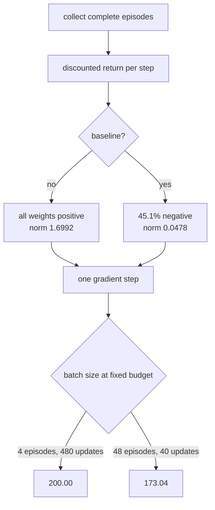

A DQN learns what each action is *worth* and picks the best one. **REINFORCE** skips that
entirely: it adjusts the probability of each action directly, in proportion to how well the
episode that contained it went.

$$
\nabla_\theta J = \mathbb{E}\left[\sum_t \nabla_\theta \log \pi_\theta(a_t \mid s_t)\, G_t\right]
$$

Read it as an instruction: *make the actions you took more likely, weighted by the return that
followed them*. There is no value function, no replay buffer, no target network, and no maximum
being taken over noisy estimates. In exchange there is one large new problem — the gradient is
an average over whole episodes, and it is extremely noisy.

The standard fix is a **baseline**: subtract the mean return before weighting. Measured over
three seeds on CartPole:

| Setting | Final episode length | sd | Mean gradient norm |
| --- | --- | --- | --- |
| No baseline | 193.91 | 6.86 | **1.6992** |
| With baseline | 194.18 | 4.80 | **0.0478** |

The baseline shrank the gradient norm by **35×** and moved the final score by **0.27** — well
inside the seed-to-seed spread. The variance reduction is real and easy to measure; its benefit
on this task is not.

## What you'll learn

- Why every raw return in CartPole is positive, and why that makes the estimator so noisy.
- What a baseline actually changes — measured on the weights and on the gradient.
- Why **more, noisier updates beat fewer, cleaner ones** at a fixed episode budget.
- How REINFORCE compares with the DQN from the previous page, and what each one costs.

## Every weight is positive

CartPole gives +1 per surviving step, so every discounted return is positive. That has a
consequence people usually skip past:

<Figure
  src="/images/dl/phase-07-rl/policy-gradients/variance"
  alt="Left: two overlapping histograms on separate axes — the raw discounted returns spanning roughly 1 to 30 and entirely positive, and the standardised weights centred on zero and spanning about -2 to 3. Right: mean gradient norm against episodes per gradient step, falling from 0.0810 at 4 episodes to 0.0497 at 48, with a second line showing final episode length falling from 200.00 to 173.04."
  title="The weights before and after standardising"
  caption="100.0% of raw returns are positive, with mean 11.3202 and standard deviation 7.7908. Every action taken is therefore made MORE likely, and the only thing distinguishing a good action from a bad one is how much. After subtracting the mean and dividing by the spread, 45.1% of weights are negative — actions that did worse than average are now actively discouraged, which is a different learning signal entirely."
/>

Without a baseline the update says "do more of everything, especially the things that happened
in long episodes". With one it says "do more of what beat the average, less of what didn't". The
second is obviously better reasoning — and on this task it produced 194.18 against 193.91.

```python title="The baseline is two lines"
weights = batch["weights"]                      # discounted returns
if baseline:
    weights = (weights - weights.mean()) / (weights.std() + 1e-8)
```

Subtracting a constant does not bias the gradient. The expected value of
$\nabla_\theta \log \pi_\theta(a|s)$ is zero, so subtracting any quantity that does not depend on
the action leaves the expectation unchanged while reducing the variance. Dividing by the standard
deviation *does* change the effective learning rate, which is why the measured gradient norm falls
so far.

## The baseline, measured

<Figure
  src="/images/dl/phase-07-rl/policy-gradients/baseline"
  alt="Left: learning curves against episodes of experience for three seeds each with and without a baseline, all rising from about 20 towards the 200 cap with the baseline runs slightly tighter together. Right: bars of final episode length for the two settings, nearly identical at 193.91 and 194.18, next to bars of mean gradient norm showing 1.6992 against 0.0478."
  title="120 updates of 16 episodes, 3 seeds each"
  caption="Both settings solve CartPole — the environment caps episodes at 200 and both land within 6 of it. The gradient norms differ by a factor of 35, which is the variance reduction the theory promises, but that reduction had nowhere to show up in the score because the task was already being solved. The seed spread narrowed slightly, 6.86 to 4.80, which is the only visible benefit and is not significant with three seeds."
/>

This is a case where the honest reading needs stating plainly: **the mechanism worked and the
outcome did not move**. The baseline demonstrably did what it is supposed to do to the gradient.
CartPole with a 200-step cap simply is not hard enough for that to matter — both configurations
reach the ceiling. On a longer or sparser task the same 35× reduction would be the difference
between learning and not.

Reporting "the baseline improved the score" here would have been false; reporting "the baseline
does nothing" would be equally false.

## Smaller batches won

The batch size is how many complete episodes go into one gradient. Bigger batches average more
episodes, so the estimate is less noisy. Holding the total experience fixed at 1,920 episodes:

| Episodes per step | Updates | Final length | Gradient norm | Norm sd |
| --- | --- | --- | --- | --- |
| **4** | **480** | **200.00** | 0.0810 | 0.0507 |
| 16 | 120 | 196.68 | 0.0510 | 0.0337 |
| 48 | 40 | 173.04 | **0.0497** | **0.0210** |

The gradient does get cleaner with a bigger batch — norm sd falls from 0.0507 to 0.0210, exactly
as expected. And performance gets **worse**, from a perfect 200.00 down to 173.04.

At a fixed budget, batch size trades *update count* against *update quality*, and here the count
mattered more. Four episodes per step gives 480 chances to improve the policy; 48 episodes gives
40. A noisy step in roughly the right direction, taken twelve times, beat one clean step.

That is not a universal law — it is what this budget and this task produced. The general lesson
is that "reduces variance" and "learns better" are separate claims needing separate measurements,
which is the same conclusion the baseline section reached by a different route.



<Figure
  src="/images/dl/phase-07-rl/policy-gradients/reinforce-settings"
  alt="Horizontal bars of final mean episode length for five REINFORCE configurations, all between 173 and 200, annotated with the episode budget and wall-clock each used, against a dotted line at the random baseline of 23.09 and a dashed line at the 200-step cap."
  title="Every configuration on one axis"
  caption="All five settings solve the task to some degree — the worst is 173.04 against a random baseline of 23.09. The spread between them is the interesting part, and it is driven by update count rather than by gradient quality: the configuration with the noisiest gradients (batch 4, norm sd 0.0507) reached the cap exactly."
/>

## REINFORCE against DQN

Both were run on the same CartPole with the same 200-step cap:

| Algorithm | Best measured score | What it needs |
| --- | --- | --- |
| DQN (replay + target) | 144.20 | A replay buffer, a target network, and both are required |
| REINFORCE (batch 4) | **200.00** | Complete episodes before any update |

REINFORCE won here, and the comparison deserves two caveats rather than a victory lap. First,
REINFORCE consumed 1,920 complete episodes while the DQN used 6,000 frames across 16
environments — different budgets in different units, so this is not a sample-efficiency result.
Second, REINFORCE's advantage is partly that CartPole's episode-return signal is dense and
well-shaped; on a task with sparse rewards the value-based approach has structure that
REINFORCE lacks.

What is fair to conclude: REINFORCE is dramatically simpler to implement — no buffer, no target
network, no ablation needed to make it work — and on a short, dense-reward task that simplicity
costs nothing.

```p5 title="Why the baseline matters" desc="Drag the slider to move the baseline. The bars are per-action weights from a batch of episodes; green pushes the action's probability up, red pushes it down." height="360"
let baseline = 0.0;
const RETURNS = [4.2, 18.6, 11.3, 7.8, 22.1, 9.4, 14.7, 3.1, 16.9, 12.5];
function setup() {
  createCanvas(620, 360);
  textFont("monospace");
}
function draw() {
  background(13, 17, 23);
  const mean = RETURNS.reduce((a, b) => a + b, 0) / RETURNS.length;
  noStroke();
  fill(230);
  textSize(12);
  textAlign(LEFT, TOP);
  text("per-action weights in one REINFORCE batch", 30, 20);
  fill(150);
  textSize(10.5);
  text("baseline " + baseline.toFixed(2) + "   (the batch mean is "
    + mean.toFixed(2) + ")", 30, 42);
  const zero = 210;
  const scale = 9;
  let positive = 0;
  for (let i = 0; i < RETURNS.length; i++) {
    const weight = RETURNS[i] - baseline;
    if (weight > 0) { positive += 1; }
    const x = 46 + i * 54;
    const height = weight * scale;
    if (weight >= 0) { fill(126, 192, 143); rect(x, zero - height, 40, height, 3); }
    else { fill(224, 108, 117); rect(x, zero, 40, -height, 3); }
    fill(170);
    textSize(8.5);
    textAlign(CENTER, TOP);
    text(RETURNS[i].toFixed(1), x + 20, zero + 6);
  }
  stroke(120);
  line(36, zero, 590, zero);
  noStroke();
  textAlign(LEFT, TOP);
  fill(150);
  textSize(10);
  text("green: this action is made MORE likely", 36, 250);
  fill(224, 108, 117);
  text("red: made LESS likely", 330, 250);
  fill(255, 211, 67);
  textSize(11.5);
  text(positive + " of " + RETURNS.length + " actions reinforced", 36, 276);
  fill(150);
  textSize(9.5);
  if (baseline === 0) {
    text("with no baseline every action is reinforced - the update says", 36, 298);
    text("'do more of everything', which is why the gradient norm was 1.6992", 36, 312);
  } else {
    text("with a baseline, below-average actions are discouraged - measured", 36, 298);
    text("gradient norm 0.0478, a 35x reduction", 36, 312);
  }
  fill(60, 70, 84);
  rect(36, 340, 300, 4, 2);
  fill(255, 211, 67);
  circle(36 + (baseline / 25) * 300, 342, 12);
  fill(120);
  textSize(9);
  text("drag: baseline", 350, 336);
}
function mousePressed() { mouseDragged(); }
function mouseDragged() {
  if (mouseY < 320) { return; }
  baseline = Math.min(Math.max((mouseX - 36) / 300, 0), 1) * 25;
}
```

```p5 title="The measured table, ranked" desc="Click a column to rank every row by it. The bars are that column's values and the highest and lowest are computed from the numbers, not written in." height="228"
let metric = 0;
const COLUMNS = ["Updates", "Final length", "Gradient norm", "Norm sd"];
const ROWS = [
  ["4", 480, 200, 0.081, 0.0507],
  ["16", 120, 196.68, 0.051, 0.0337],
  ["48", 40, 173.04, 0.0497, 0.021]
];
function setup() {
  createCanvas(620, 228);
  textFont("monospace");
}
function fmt(v) {
  if (v === 0) { return "0"; }
  const a = Math.abs(v);
  if (a >= 1000 || a < 0.001) { return v.toExponential(2); }
  if (a >= 100) { return v.toFixed(1); }
  return v.toFixed(4);
}
function draw() {
  background(13, 17, 23);
  noStroke();
  fill(230);
  textSize(12);
  textAlign(LEFT, TOP);
  text("Policy Gradients (Intro)", 26, 16);
  let x = 26;
  for (let i = 0; i < COLUMNS.length; i++) {
    const w = COLUMNS[i].length * 6.6 + 16;
    if (i === metric) { fill(255, 211, 67); } else { fill(48, 56, 68); }
    rect(x, 40, w, 22, 4);
    if (i === metric) { fill(13, 17, 23); } else { fill(180); }
    textSize(9);
    text(COLUMNS[i], x + 8, 47);
    x += w + 6;
    if (x > 500) { break; }
  }
  const values = ROWS.map((r) => r[metric + 1]);
  const lo = Math.min(...values);
  const hi = Math.max(...values);
  const span = hi - lo === 0 ? 1 : hi - lo;
  const order = ROWS.slice().sort((a, b) => b[metric + 1] - a[metric + 1]);
  for (let i = 0; i < order.length; i++) {
    const y = 78 + i * 26;
    const v = order[i][metric + 1];
    fill(160);
    textSize(9);
    text(order[i][0], 26, y + 5);
    fill(34, 40, 50);
    rect(230, y, 280, 18, 3);
    const frac = (v - lo) / span;
    if (v === hi) { fill(126, 192, 143); }
    else if (v === lo) { fill(224, 108, 117); }
    else { fill(107, 169, 221); }
    rect(230, y, Math.max(frac * 280, 3), 18, 3);
    fill(225);
    textSize(9);
    text(fmt(v), 518, y + 5);
  }
  const top = order[0];
  const bottom = order[order.length - 1];
  fill(150);
  textSize(9);
  const base = 78 + order.length * 26 + 8;
  text("highest " + COLUMNS[metric] + ": " + top[0] + " at " + fmt(top[1]),
       26, base);
  text("lowest  " + COLUMNS[metric] + ": " + bottom[0] + " at "
       + fmt(bottom[1]), 26, base + 14);
  text("bars are scaled within the chosen column - lowest is not zero", 26,
       base + 30);
}
function mousePressed() {
  let x = 26;
  for (let i = 0; i < COLUMNS.length; i++) {
    const w = COLUMNS[i].length * 6.6 + 16;
    if (mouseX > x && mouseX < x + w && mouseY > 40 && mouseY < 62) {
      metric = i;
    }
    x += w + 6;
  }
}
```

## Pitfalls

- **Claiming a baseline improved the score without measuring.** Here it changed the final result
  by 0.27 while shrinking the gradient norm 35×.
- **Assuming a cleaner gradient learns better.** The noisiest configuration (batch 4) scored
  200.00; the cleanest (batch 48) scored 173.04 on the same experience.
- **Comparing algorithms on different budgets.** REINFORCE used 1,920 episodes and the DQN 6,000
  frames across 16 environments; those units are not interchangeable.
- **Updating before an episode finishes.** REINFORCE weights each action by the return that
  *followed* it, so the episode must complete first.
- **Collecting episodes one at a time.** Running 16 in a vectorised environment costs one model
  call per timestep instead of one per timestep per episode — measured at roughly 16× faster.
- **Forgetting that dividing by the standard deviation changes the step size.** It is a
  normalisation, not just a recentring, and it interacts with the learning rate.

## Recap

- REINFORCE adjusts action probabilities directly, weighted by the return that followed each
  action — no value function, no replay, no target network.
- Every CartPole return is positive (100.0% of them), so without a baseline every action taken is
  reinforced and only the magnitude differs.
- A baseline made 45.1% of weights negative and cut the gradient norm from 1.6992 to 0.0478, a
  35× reduction, with no measurable change in final score on this task.
- At a fixed 1,920-episode budget, 4 episodes per update scored 200.00 and 48 scored 173.04 —
  update count beat update quality.
- REINFORCE's best (200.00) exceeded the DQN's best (144.20) here, on a different budget and a
  task that suits it.
- "Reduces variance" and "learns better" are separate claims and need separate measurements.

## Next

A baseline that cut the gradient norm 35x and moved the score by 0.27 is an odd place to stop.
The next page replaces it with a learned critic, then attacks a different axis entirely and gets a
3.2x sample-efficiency win out of it:
[Actor-Critic and PPO (Intro)](/deep-learning/phase-07---reinforcement-learning/actor-critic-and-ppo-intro/).

<Quiz
  questions={[
    {
      q: "In CartPole, 100% of the raw discounted returns are positive. What does that imply for REINFORCE without a baseline?",
      options: [
        "Learning is impossible",
        "Every action taken is made more likely, and the only thing separating good from bad actions is how much — which is a much weaker and noisier signal than pushing bad actions down",
        "The returns must be computed incorrectly",
        "The policy will converge to a uniform distribution",
      ],
      answer: 1,
      explain: "Subtracting the batch mean made 45.1% of the weights negative, turning 'do more of everything' into 'do more of what beat the average'.",
    },
    {
      q: "A baseline reduced the mean gradient norm from 1.6992 to 0.0478 but changed the final score from 193.91 to 194.18. What is the honest conclusion?",
      options: [
        "The baseline does not work",
        "The variance reduction is real and measurable, but this task was already being solved to the 200-step cap, so there was no room for it to show up in the score",
        "The baseline made performance worse",
        "The gradient norm is not a meaningful measurement",
      ],
      answer: 1,
      explain: "Both readings — 'it improved the score' and 'it does nothing' — would be false. The mechanism worked; the outcome had no headroom.",
    },
    {
      q: "At a fixed budget of 1,920 episodes, 4 episodes per update scored 200.00 and 48 per update scored 173.04, while the gradient noise fell with batch size. Why?",
      options: [
        "Large batches overfit",
        "Batch size trades update count against update quality at a fixed budget — 4 episodes bought 480 updates against 40, and many roughly-right steps beat a few precise ones here",
        "The larger batch had a bug",
        "Gradient noise helps escape local minima",
      ],
      answer: 1,
      explain: "The measured gradient norm sd did fall from 0.0507 to 0.0210, confirming the cleaner estimate. It simply was not what limited learning.",
    },
    {
      q: "Why must REINFORCE wait for an episode to finish before updating?",
      options: [
        "To keep the batch size constant",
        "Because each action is weighted by the discounted return that followed it, which is not known until the episode ends",
        "Because the policy network needs a full batch",
        "It does not have to; that is only a convention",
      ],
      answer: 1,
      explain: "This is the structural difference from Q-learning, which bootstraps from its own estimate of the next state and can update after a single transition.",
    },
    {
      q: "REINFORCE reached 200.00 while the DQN reached 144.20 on the same environment. What can be concluded?",
      options: [
        "Policy gradients are strictly better than value methods",
        "Not much beyond this setup — the two used different budgets in different units, and CartPole's dense episode-return signal happens to suit REINFORCE",
        "The DQN implementation was broken",
        "Value methods cannot solve CartPole",
      ],
      answer: 1,
      explain: "REINFORCE consumed 1,920 complete episodes while the DQN used 6,000 frames across 16 environments; the fair claim is about implementation simplicity, not sample efficiency.",
    },
  ]}
/>

## 🧪 Try It Yourself

<DataCampExercise
  lang="python"
  hint={`Work backwards from the end of the episode, multiplying the running total by gamma before adding the current reward.`}
  expectedOutput={`survived 5 steps     first   4.9010   last 1.0000   mean   2.9603
survived 20 steps    first  18.2093   last 1.0000   mean   9.8639
survived 200 steps   first  86.6020   last 1.0000   mean  57.1320

every weight is positive, and a long episode gives every one of its
actions a bigger weight than a short episode gives any of its own`}
  code={`# Task: Exercise 1 - Discounted return, from the back
def discounted_returns(rewards, gamma=0.99):
    """Reward-to-go: what follows each step, discounted."""
    out = [0.0] * len(rewards)
    running = 0.0
    for index in reversed(range(len(rewards))):
        running = rewards[index] + gamma * ___    # replace ___ with running
        out[index] = running
    return out


EPISODES = {
    "survived 5 steps": [1.0] * 5,
    "survived 20 steps": [1.0] * 20,
    "survived 200 steps": [1.0] * 200,
}

for name, rewards in EPISODES.items():
    returns = discounted_returns(rewards)
    print(f"{name:20s} first {returns[0]:8.4f}   last {returns[-1]:6.4f}   "
          f"mean {sum(returns) / len(returns):8.4f}")

print("\\nevery weight is positive, and a long episode gives every one of its")
print("actions a bigger weight than a short episode gives any of its own")`}
  solution={`def discounted_returns(rewards, gamma=0.99):
    """Reward-to-go: what follows each step, discounted."""
    out = [0.0] * len(rewards)
    running = 0.0
    for index in reversed(range(len(rewards))):
        running = rewards[index] + gamma * running
        out[index] = running
    return out


EPISODES = {
    "survived 5 steps": [1.0] * 5,
    "survived 20 steps": [1.0] * 20,
    "survived 200 steps": [1.0] * 200,
}

for name, rewards in EPISODES.items():
    returns = discounted_returns(rewards)
    print(f"{name:20s} first {returns[0]:8.4f}   last {returns[-1]:6.4f}   "
          f"mean {sum(returns) / len(returns):8.4f}")

print("\\nevery weight is positive, and a long episode gives every one of its")
print("actions a bigger weight than a short episode gives any of its own")`}
  sct={`test_output_contains("survived 200 steps   first  86.6020", pattern=False)
test_output_contains("survived 5 steps", pattern=False)
success_msg("Discounted returns are computed from the back, and every weight is positive, so a long episode gives each action a bigger weight than a short one.")`}
  height={400}
/>

<DataCampExercise
  lang="python"
  hint={`Subtract the mean and divide by the standard deviation, then count how many weights ended up below zero.`}
  code={`# Task: Exercise 2 - What the baseline does to the weights
import numpy as np

rng = np.random.default_rng(0)
# Returns from a batch of episodes of differing lengths.
returns = np.concatenate([np.linspace(length, 1, length)
                          for length in (6, 14, 9, 21, 11)])


def standardise(weights):
    """Centre and scale - the classic REINFORCE baseline."""
    return (weights - weights.mean()) / (weights.___() + 1e-8)   # replace with std


centred = standardise(returns)
print(f"raw:          mean {returns.mean():7.4f}  sd {returns.std():7.4f}  "
      f"{100 * (returns > 0).mean():5.1f}% positive")
print(f"standardised: mean {centred.mean():7.4f}  sd {centred.std():7.4f}  "
      f"{100 * (centred > 0).mean():5.1f}% positive")
print(f"\\nmeasured on the page: 100.0% positive before, 45.1% after")`}
  solution={`import numpy as np

rng = np.random.default_rng(0)
# Returns from a batch of episodes of differing lengths.
returns = np.concatenate([np.linspace(length, 1, length)
                          for length in (6, 14, 9, 21, 11)])


def standardise(weights):
    """Centre and scale - the classic REINFORCE baseline."""
    return (weights - weights.mean()) / (weights.std() + 1e-8)


centred = standardise(returns)
print(f"raw:          mean {returns.mean():7.4f}  sd {returns.std():7.4f}  "
      f"{100 * (returns > 0).mean():5.1f}% positive")
print(f"standardised: mean {centred.mean():7.4f}  sd {centred.std():7.4f}  "
      f"{100 * (centred > 0).mean():5.1f}% positive")
print(f"\\nmeasured on the page: 100.0% positive before, 45.1% after")`}
  sct={`test_output_contains("standardised: mean  0.0000  sd  1.0000", pattern=False)
test_output_contains("100.0% positive", pattern=False)
success_msg("Standardising returns turns an all-positive weight vector into one that pushes roughly half the actions down.")`}
  height={400}
/>

<DataCampExercise
  lang="python"
  hint={`Averaging n independent samples divides the standard error by the square root of n, so the gradient noise falls as 1/sqrt(batch).`}
  expectedOutput={` batch  updates  sqrt(batch)  measured norm sd  final length
     4      480         2.00            0.0507        200.00
    16      120         4.00            0.0337        196.68
    48       40         6.93            0.0210        173.04

noise falls roughly as predicted, and performance falls with it -
at a fixed budget the number of updates mattered more`}
  code={`# Task: Exercise 3 - Batch size against update count
import numpy as np

BUDGET = 1920           # total episodes available
MEASURED = {4: 200.00, 16: 196.68, 48: 173.04}
NOISE_SD = {4: 0.0507, 16: 0.0337, 48: 0.0210}


def plan(batch):
    """Updates available, and the expected noise reduction from averaging."""
    updates = BUDGET // batch
    reduction = np.sqrt(___)                      # replace ___ with batch
    return updates, reduction


print(f"{'batch':>6} {'updates':>8} {'sqrt(batch)':>12} "
      f"{'measured norm sd':>17} {'final length':>13}")
for batch in MEASURED:
    updates, reduction = plan(batch)
    print(f"{batch:6d} {updates:8d} {reduction:12.2f} "
          f"{NOISE_SD[batch]:17.4f} {MEASURED[batch]:13.2f}")

print("\\nnoise falls roughly as predicted, and performance falls with it -")
print("at a fixed budget the number of updates mattered more")`}
  solution={`import numpy as np

BUDGET = 1920           # total episodes available
MEASURED = {4: 200.00, 16: 196.68, 48: 173.04}
NOISE_SD = {4: 0.0507, 16: 0.0337, 48: 0.0210}


def plan(batch):
    """Updates available, and the expected noise reduction from averaging."""
    updates = BUDGET // batch
    reduction = np.sqrt(batch)
    return updates, reduction


print(f"{'batch':>6} {'updates':>8} {'sqrt(batch)':>12} "
      f"{'measured norm sd':>17} {'final length':>13}")
for batch in MEASURED:
    updates, reduction = plan(batch)
    print(f"{batch:6d} {updates:8d} {reduction:12.2f} "
          f"{NOISE_SD[batch]:17.4f} {MEASURED[batch]:13.2f}")

print("\\nnoise falls roughly as predicted, and performance falls with it -")
print("at a fixed budget the number of updates mattered more")`}
  sct={`test_output_contains("sqrt(batch)", pattern=False)
test_output_contains("final length", pattern=False)
success_msg("Bigger batches reduce gradient noise roughly as the square root of the batch size, but at a fixed budget they mean fewer updates.")`}
  height={400}
/>

<DataCampExercise
  lang="python"
  hint={`The gradient of log pi for the chosen action is (1 - p) for that action and -p for the others, scaled by the weight.`}
  expectedOutput={`case                                     gradient on logits
good outcome, likely action                     [ 0.4 -0.4]
good outcome, unlikely action                   [ 1.6 -1.6]
bad outcome, likely action                      [-0.4  0.4]
no baseline: weak signal                      [ 0.02 -0.02]

an unlikely action that worked gets the biggest push - which is how
the policy discovers actions it was not already taking`}
  code={`# Task: Exercise 4 - One REINFORCE step, by hand
import numpy as np


def policy_gradient(probabilities, action, weight):
    """d/dlogits of weight * log pi(action), for a softmax policy."""
    onehot = np.zeros_like(probabilities)
    onehot[action] = 1.0
    return weight * (onehot - ___)               # replace ___ with probabilities


CASES = (
    ("good outcome, likely action", [0.8, 0.2], 0, +2.0),
    ("good outcome, unlikely action", [0.2, 0.8], 0, +2.0),
    ("bad outcome, likely action", [0.8, 0.2], 0, -2.0),
    ("no baseline: weak signal", [0.8, 0.2], 0, +0.1),
)

print(f"{'case':32s} {'gradient on logits':>26}")
for name, probabilities, action, weight in CASES:
    gradient = policy_gradient(np.array(probabilities), action, weight)
    print(f"{name:32s} {str(np.round(gradient, 4)):>26}")

print("\\nan unlikely action that worked gets the biggest push - which is how")
print("the policy discovers actions it was not already taking")`}
  solution={`import numpy as np


def policy_gradient(probabilities, action, weight):
    """d/dlogits of weight * log pi(action), for a softmax policy."""
    onehot = np.zeros_like(probabilities)
    onehot[action] = 1.0
    return weight * (onehot - probabilities)


CASES = (
    ("good outcome, likely action", [0.8, 0.2], 0, +2.0),
    ("good outcome, unlikely action", [0.2, 0.8], 0, +2.0),
    ("bad outcome, likely action", [0.8, 0.2], 0, -2.0),
    ("no baseline: weak signal", [0.8, 0.2], 0, +0.1),
)

print(f"{'case':32s} {'gradient on logits':>26}")
for name, probabilities, action, weight in CASES:
    gradient = policy_gradient(np.array(probabilities), action, weight)
    print(f"{name:32s} {str(np.round(gradient, 4)):>26}")

print("\\nan unlikely action that worked gets the biggest push - which is how")
print("the policy discovers actions it was not already taking")`}
  sct={`test_output_contains("[ 1.6 -1.6]", pattern=False)
test_output_contains("gradient on logits", pattern=False)
success_msg("An unlikely action that worked gets the biggest push, which is how the policy discovers actions it was not already taking.")`}
  height={400}
/>

<DataCampExercise
  lang="python"
  hint={`Collect all episodes in one vectorised environment so each timestep is a single model call for the whole batch.`}
  expectedOutput={` episodes   serial (s)   parallel (s)   speed-up
        4         0.96           0.24        4.0x
       16         3.84           0.24       16.0x
       48        11.52           0.24       48.0x

at 120 updates of 16 episodes, the serial version would spend an
extra 7 minutes per run in interpreter overhead alone`}
  code={`# Task: Exercise 5 - Why episodes must be collected in parallel
FORWARD_PASS_MS = 2.0
MEAN_EPISODE_LENGTH = 120


def serial_seconds(episodes):
    """One episode at a time: a model call per step, per episode."""
    return episodes * MEAN_EPISODE_LENGTH * FORWARD_PASS_MS / 1000.0


def parallel_seconds(episodes):
    """All episodes stepped together: one call per timestep for the batch."""
    del episodes
    return MEAN_EPISODE_LENGTH * ___ / 1000.0    # replace with FORWARD_PASS_MS


print(f"{'episodes':>9} {'serial (s)':>12} {'parallel (s)':>14} {'speed-up':>10}")
for episodes in (4, 16, 48):
    serial = serial_seconds(episodes)
    parallel = parallel_seconds(episodes)
    print(f"{episodes:9d} {serial:12.2f} {parallel:14.2f} "
          f"{serial / parallel:10.1f}x")

saved = (serial_seconds(16) - parallel_seconds(16)) * 120 / 60
print(f"\\nat 120 updates of 16 episodes, the serial version would spend an")
print(f"extra {saved:.0f} minutes per run in interpreter overhead alone")`}
  solution={`FORWARD_PASS_MS = 2.0
MEAN_EPISODE_LENGTH = 120


def serial_seconds(episodes):
    """One episode at a time: a model call per step, per episode."""
    return episodes * MEAN_EPISODE_LENGTH * FORWARD_PASS_MS / 1000.0


def parallel_seconds(episodes):
    """All episodes stepped together: one call per timestep for the batch."""
    del episodes
    return MEAN_EPISODE_LENGTH * FORWARD_PASS_MS / 1000.0


print(f"{'episodes':>9} {'serial (s)':>12} {'parallel (s)':>14} {'speed-up':>10}")
for episodes in (4, 16, 48):
    serial = serial_seconds(episodes)
    parallel = parallel_seconds(episodes)
    print(f"{episodes:9d} {serial:12.2f} {parallel:14.2f} "
          f"{serial / parallel:10.1f}x")

saved = (serial_seconds(16) - parallel_seconds(16)) * 120 / 60
print(f"\\nat 120 updates of 16 episodes, the serial version would spend an")
print(f"extra {saved:.0f} minutes per run in interpreter overhead alone")`}
  sct={`test_output_contains("48.0x", pattern=False)
test_output_contains("speed-up", pattern=False)
success_msg("Collecting episodes in parallel turns N serial rollouts into one batched call, so the speed-up equals the number of episodes.")`}
  height={400}
/>

<DataCampExercise
  lang="python"
  hint={`Weight each action's log-probability by its standardised return, then take a gradient step on the negative of that.`}
  code={`# Task: Exercise 6 - REINFORCE, end to end
import numpy as np

GAMMA, EPISODES, UPDATES = 0.99, 8, 60


class CartPole:
    """The classic dynamics, vectorised over several environments at once."""
    def __init__(self, count, seed=0):
        self.count = count
        self.rng = np.random.default_rng(seed)
        self.reset()

    def reset(self):
        self.state = self.rng.uniform(-0.05, 0.05, (self.count, 4))
        self.steps = np.zeros(self.count, "int32")

    def step(self, actions):
        x, x_dot, theta, theta_dot = self.state.T
        force = np.where(actions == 1, 10.0, -10.0)
        cos, sin = np.cos(theta), np.sin(theta)
        temp = (force + 0.05 * theta_dot ** 2 * sin) / 1.1
        theta_acc = ((9.8 * sin - cos * temp)
                     / (0.5 * (4.0 / 3.0 - 0.1 * cos ** 2 / 1.1)))
        x_acc = temp - 0.05 * theta_acc * cos / 1.1
        self.state = np.stack([x + 0.02 * x_dot, x_dot + 0.02 * x_acc,
                               theta + 0.02 * theta_dot,
                               theta_dot + 0.02 * theta_acc], 1)
        self.steps += 1
        done = ((np.abs(self.state[:, 0]) > 2.4)
                | (np.abs(self.state[:, 2]) > 0.2095) | (self.steps >= 200))
        return self.state.copy(), done


def policy(states, weights, bias):
    logits = states @ weights + bias
    logits = logits - logits.max(axis=1, keepdims=True)
    probabilities = np.exp(logits)
    return probabilities / probabilities.sum(axis=1, keepdims=True)


W, B = np.zeros((4, 2)), np.zeros(2)
env = CartPole(EPISODES, seed=0)
rng = np.random.default_rng(0)
history = []
for update in range(1, UPDATES + 1):
    env.reset()
    alive = np.ones(EPISODES, bool)
    per_env = [[] for _ in range(EPISODES)]
    for _ in range(200):
        state = env.state.copy()
        probabilities = policy(state, W, B)
        chosen = (rng.random(EPISODES) < probabilities[:, 1]).astype("int32")
        _, done = env.step(chosen)
        for i in np.flatnonzero(alive):
            per_env[i].append((state[i], chosen[i]))
        alive &= ~done
        if not alive.any():
            break
    states, actions, returns_all, lengths = [], [], [], []
    for episode in per_env:
        running, returns = 0.0, []
        for _ in episode:
            running = 1.0 + GAMMA * running
            returns.append(running)
        returns = returns[::-1]
        states.extend(s for s, _ in episode)
        actions.extend(a for _, a in episode)
        returns_all.extend(returns)
        lengths.append(len(episode))
    weights = np.array(returns_all)
    weights = (weights - weights.mean()) / (weights.std() + 1e-8)
    states, actions = np.array(states), np.array(actions)
    probabilities = policy(states, W, B)
    one_hot = np.eye(2)[actions]
    # gradient of -mean(log p(chosen) * weight) with respect to the logits
    d_logits = (probabilities - one_hot) * ___[:, None] / len(actions)   # replace ___ with weights
    W -= 1.0 * states.T @ d_logits
    B -= 1.0 * d_logits.sum(axis=0)
    history.append(np.mean(lengths))
    if update % 20 == 0:
        print(f"update {update:3d}: mean episode length {history[-1]:6.1f}")
print("episodes got longer than at the start:", np.mean(history[-10:]) > np.mean(history[:10]))`}
  solution={`# Task: Exercise 6 - REINFORCE, end to end
import numpy as np

GAMMA, EPISODES, UPDATES = 0.99, 8, 60


class CartPole:
    """The classic dynamics, vectorised over several environments at once."""
    def __init__(self, count, seed=0):
        self.count = count
        self.rng = np.random.default_rng(seed)
        self.reset()

    def reset(self):
        self.state = self.rng.uniform(-0.05, 0.05, (self.count, 4))
        self.steps = np.zeros(self.count, "int32")

    def step(self, actions):
        x, x_dot, theta, theta_dot = self.state.T
        force = np.where(actions == 1, 10.0, -10.0)
        cos, sin = np.cos(theta), np.sin(theta)
        temp = (force + 0.05 * theta_dot ** 2 * sin) / 1.1
        theta_acc = ((9.8 * sin - cos * temp)
                     / (0.5 * (4.0 / 3.0 - 0.1 * cos ** 2 / 1.1)))
        x_acc = temp - 0.05 * theta_acc * cos / 1.1
        self.state = np.stack([x + 0.02 * x_dot, x_dot + 0.02 * x_acc,
                               theta + 0.02 * theta_dot,
                               theta_dot + 0.02 * theta_acc], 1)
        self.steps += 1
        done = ((np.abs(self.state[:, 0]) > 2.4)
                | (np.abs(self.state[:, 2]) > 0.2095) | (self.steps >= 200))
        return self.state.copy(), done


def policy(states, weights, bias):
    logits = states @ weights + bias
    logits = logits - logits.max(axis=1, keepdims=True)
    probabilities = np.exp(logits)
    return probabilities / probabilities.sum(axis=1, keepdims=True)


W, B = np.zeros((4, 2)), np.zeros(2)
env = CartPole(EPISODES, seed=0)
rng = np.random.default_rng(0)
history = []
for update in range(1, UPDATES + 1):
    env.reset()
    alive = np.ones(EPISODES, bool)
    per_env = [[] for _ in range(EPISODES)]
    for _ in range(200):
        state = env.state.copy()
        probabilities = policy(state, W, B)
        chosen = (rng.random(EPISODES) < probabilities[:, 1]).astype("int32")
        _, done = env.step(chosen)
        for i in np.flatnonzero(alive):
            per_env[i].append((state[i], chosen[i]))
        alive &= ~done
        if not alive.any():
            break
    states, actions, returns_all, lengths = [], [], [], []
    for episode in per_env:
        running, returns = 0.0, []
        for _ in episode:
            running = 1.0 + GAMMA * running
            returns.append(running)
        returns = returns[::-1]
        states.extend(s for s, _ in episode)
        actions.extend(a for _, a in episode)
        returns_all.extend(returns)
        lengths.append(len(episode))
    weights = np.array(returns_all)
    weights = (weights - weights.mean()) / (weights.std() + 1e-8)
    states, actions = np.array(states), np.array(actions)
    probabilities = policy(states, W, B)
    one_hot = np.eye(2)[actions]
    # gradient of -mean(log p(chosen) * weight) with respect to the logits
    d_logits = (probabilities - one_hot) * weights[:, None] / len(actions)
    W -= 1.0 * states.T @ d_logits
    B -= 1.0 * d_logits.sum(axis=0)
    history.append(np.mean(lengths))
    if update % 20 == 0:
        print(f"update {update:3d}: mean episode length {history[-1]:6.1f}")
print("episodes got longer than at the start:", np.mean(history[-10:]) > np.mean(history[:10]))`}
  sct={`test_output_contains("episodes got longer than at the start: True", pattern=False)
success_msg("Each action is pushed up or down in proportion to how much better than average its return was, and the policy improves.")`}
  height={400}
/>
