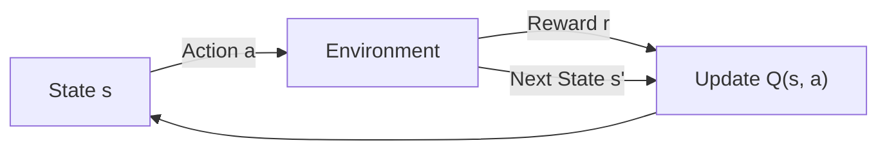

## What you'll learn

- what a **Markov decision process (MDP)** is, and the Bellman Optimality Equation
- the difference between **state values** and **Q-values**
- **Temporal Difference (TD) Learning** and the **Q-Learning** update rule
- why tabular Q-Learning breaks down at scale, and how a **Deep Q-Network (DQN)** fixes it
- replay buffers, target networks, and the epsilon-greedy exploration policy

## Markov decision processes

A **Markov decision process (MDP)** looks like a Markov chain, but at each
step the agent chooses an **action**, and that action determines the
transition probabilities and the reward. Formally, an MDP is described by:

- `T(s, a, s')` — the probability of landing in state `s'` after taking action `a` in state `s`
- `R(s, a, s')` — the reward received for that same transition
- a discount factor `γ` (gamma) that controls how much future rewards matter

Bellman showed that the **optimal value** of a state, `V*(s)`, obeys a
recursive relationship called the **Bellman Optimality Equation**: the value
of the current state equals the best action's expected reward, plus the
discounted value of wherever that action leads. Iterating this equation
(**Value Iteration**) is guaranteed to converge to the optimal state values.

Knowing state values doesn't hand you a policy directly, though — for that
you want **Q-Values** (Quality Values): the value of taking a specific action
`a` in state `s`, before seeing where it leads. Once you have accurate
Q-Values, the optimal policy is simply: *pick the action with the highest
Q-Value*.



## Q-Value iteration on a tiny MDP

Here's a 3-state MDP from the book: each state has up to three possible
actions, with its own transition probabilities and rewards. We can compute
the optimal Q-Values directly with **Q-Value Iteration**, since we already
know `T` and `R` for this toy example:

```python title="q_value_iteration.py" showLineNumbers{1}
import numpy as np

transition_probabilities = [  # shape=[s, a, s']
    [[0.7, 0.3, 0.0], [1.0, 0.0, 0.0], [0.8, 0.2, 0.0]],
    [[0.0, 1.0, 0.0], None, [0.0, 0.0, 1.0]],
    [None, [0.8, 0.1, 0.1], None],
]
rewards = [  # shape=[s, a, s']
    [[+10, 0, 0], [0, 0, 0], [0, 0, 0]],
    [[0, 0, 0], [0, 0, 0], [0, 0, -50]],
    [[0, 0, 0], [+40, 0, 0], [0, 0, 0]],
]
possible_actions = [[0, 1, 2], [0, 2], [1]]

Q_values = np.full((3, 3), -np.inf)
for state, actions in enumerate(possible_actions):
    Q_values[state, actions] = 0.0

gamma = 0.90
for iteration in range(50):
    Q_prev = Q_values.copy()
    for s in range(3):
        for a in possible_actions[s]:
            Q_values[s, a] = np.sum([
                transition_probabilities[s][a][sp] *
                (rewards[s][a][sp] + gamma * np.max(Q_prev[sp]))
                for sp in range(3)
            ])

print(Q_values)
print("Best action per state:", np.argmax(Q_values, axis=1))
```

That prints the optimal action for every state — `[0, 0, 1]` with
`gamma = 0.90` — meaning: in state `s0` choose `a0`, in `s1` stay put with
`a0`, and in `s2` the only choice is `a1`.

## Temporal difference learning and Q-Learning

Value Iteration works great — but only if you already know `T(s, a, s')` and
`R(s, a, s')`. Usually the agent has no idea what those are; it has to
*experience* transitions to learn about them. **Temporal Difference (TD)
Learning** adapts Value Iteration to this partial-knowledge setting by
keeping a running average of observed rewards plus expected future value.
**Q-Learning** does the same thing for Q-Values:

```
Q(s, a)  ←  (1 - α) · Q(s, a)  +  α · (r + γ · max Q(s', a'))
```

`α` is the learning rate. The agent just watches itself act — even
*randomly* — and gradually improves its Q-Value estimates:

```python title="tabular_q_learning.py" showLineNumbers{1}
import numpy as np

def step(state, action):
    probas = transition_probabilities[state][action]
    next_state = np.random.choice([0, 1, 2], p=probas)
    reward = rewards[state][action][next_state]
    return next_state, reward

def exploration_policy(state):
    return np.random.choice(possible_actions[state])

Q_values = np.full((3, 3), -np.inf)
for state, actions in enumerate(possible_actions):
    Q_values[state, actions] = 0.0

alpha0, decay, gamma = 0.05, 0.005, 0.90
state = 0
for iteration in range(10_000):
    action = exploration_policy(state)
    next_state, reward = step(state, action)
    next_value = np.max(Q_values[next_state])
    alpha = alpha0 / (1 + iteration * decay)
    Q_values[state, action] *= 1 - alpha
    Q_values[state, action] += alpha * (reward + gamma * next_value)
    state = next_state

print(Q_values)
```

Q-Learning is called an **off-policy** algorithm: the policy being trained
(always greedy w.r.t. the current Q-Values) is different from the policy
being *executed* to explore (here, pure random). A common middle ground is
the **ε-greedy policy**: act randomly with probability `ε`, and greedily
otherwise — starting with `ε` near `1.0` and decaying it toward `0.05` or so
as training progresses.

## From tables to Deep Q-Networks

A Q-*table* needs one entry per `(state, action)` pair. That's fine for 3
states — but Ms. Pac-Man alone has more possible states than there are atoms
on Earth. The fix is **Approximate Q-Learning**: replace the table with a
parameterized function, and when that function is a neural network, it's
called a **Deep Q-Network (DQN)**.

A DQN takes a state and outputs one Q-Value *per possible action* — much
more efficient than one network call per `(s, a)` pair:

```python title="dqn_cartpole.py" showLineNumbers{1}
import gym
import numpy as np
import tensorflow as tf
from tensorflow import keras
from collections import deque

env = gym.make("CartPole-v0")
input_shape = [4]     # env.observation_space.shape
n_outputs = 2          # env.action_space.n

model = keras.models.Sequential([
    keras.layers.Dense(32, activation="elu", input_shape=input_shape),
    keras.layers.Dense(32, activation="elu"),
    keras.layers.Dense(n_outputs),
])

replay_buffer = deque(maxlen=2000)

def epsilon_greedy_policy(state, epsilon=0):
    if np.random.rand() < epsilon:
        return np.random.randint(n_outputs)
    Q_values = model.predict(state[np.newaxis], verbose=0)
    return np.argmax(Q_values[0])

def play_one_step(env, state, epsilon):
    action = epsilon_greedy_policy(state, epsilon)
    next_state, reward, done, info = env.step(action)
    replay_buffer.append((state, action, reward, next_state, done))
    return next_state, reward, done, info

def sample_experiences(batch_size):
    indices = np.random.randint(len(replay_buffer), size=batch_size)
    batch = [replay_buffer[index] for index in indices]
    return [np.array([exp[i] for exp in batch]) for i in range(5)]

batch_size, discount_factor = 32, 0.95
optimizer = keras.optimizers.Adam(learning_rate=1e-3)
loss_fn = keras.losses.mean_squared_error

def training_step(batch_size):
    states, actions, rewards, next_states, dones = sample_experiences(batch_size)
    next_Q_values = model.predict(next_states, verbose=0)
    max_next_Q_values = np.max(next_Q_values, axis=1)
    target_Q_values = rewards + (1 - dones) * discount_factor * max_next_Q_values
    mask = tf.one_hot(actions, n_outputs)
    with tf.GradientTape() as tape:
        all_Q_values = model(states)
        Q_values = tf.reduce_sum(all_Q_values * mask, axis=1, keepdims=True)
        loss = tf.reduce_mean(loss_fn(target_Q_values, Q_values))
    grads = tape.gradient(loss, model.trainable_variables)
    optimizer.apply_gradients(zip(grads, model.trainable_variables))

for episode in range(600):
    obs = env.reset()
    for step in range(200):
        epsilon = max(1 - episode / 500, 0.01)
        obs, reward, done, info = play_one_step(env, obs, epsilon)
        if done:
            break
    if episode > 50:
        training_step(batch_size)
```

The **replay buffer** stores past experiences so training batches are
sampled randomly rather than from perfectly-correlated consecutive steps —
this stabilizes Gradient Descent considerably. Training a DQN this way is
notoriously unstable: DeepMind's original fix was to add a second, slow-moving
**target network** — a clone of the online model that only supplies the
"next state" Q-Values used to build training targets, and gets its weights
copied from the online model every so often instead of every step.

## Stabilizing DQN even further

The target network above is the first stabilization trick DeepMind needed
to learn Atari games from raw pixels — but it wasn't the only one. A few
more variants of Deep Q-Learning became standard soon after:

- **Double DQN** — the target network tends to *overestimate* Q-values: if
  several actions are equally good, sampling noise makes one of them look
  best purely by chance, and `max()` always grabs it — a bit like judging a
  pool's depth by the height of its tallest random wave. The fix: use the
  **online** model to *choose* the best next action, and the **target**
  model only to *evaluate* how good that chosen action is.

```python title="double_dqn_training_step.py" showLineNumbers{1}
def training_step(batch_size):
    experiences = sample_experiences(batch_size)
    states, actions, rewards, next_states, dones = experiences
    next_Q_values = model.predict(next_states, verbose=0)   # online model picks the action
    best_next_actions = np.argmax(next_Q_values, axis=1)
    next_mask = tf.one_hot(best_next_actions, n_outputs).numpy()
    next_best_Q_values = (target.predict(next_states, verbose=0) * next_mask).sum(axis=1)
    target_Q_values = rewards + (1 - dones) * discount_factor * next_best_Q_values
    # ... the rest (loss, gradients, optimizer step) is identical to before
```

- **Prioritized Experience Replay (PER)** — instead of sampling the replay
  buffer uniformly, sample transitions with a large **TD error** more
  often, since a big surprise usually means there's more to learn from that
  transition. Sampled experiences are then down-weighted during training to
  correct for the bias this introduces.
- **Dueling DQN** — split the network into two heads instead of one: one
  estimates the state's overall value `V(s)`, the other estimates each
  action's **advantage** `A(s, a)` over that state's average action.
  Recombining them as `Q(s, a) = V(s) + A(s, a)` (after centering the
  advantages so the best one is exactly `0`) tends to learn faster,
  especially in states where the choice of action barely matters.

These tricks combine freely — DeepMind's 2017 **Rainbow** agent stacked six
of them together and beat every earlier result. Implementing, debugging,
and tuning all of this from scratch is a lot of work, though, which is
exactly why real projects usually reach for a maintained library like
**TF-Agents** instead of reinventing each variant by hand.

## Visualize it

Here's a small grid world: the agent starts top-left and must reach the
goal, bottom-right, while avoiding the red trap. Cells are shaded by their
current Q-value estimate (brighter = higher expected return) — watch the
shading spread backward from the goal as the agent's path improves. The
agent's dot flips color each step depending on whether it just **exploited**
its Q-values (teal) or **explored** at random (amber), with `epsilon`
decaying as episodes go by — exactly the ε-greedy policy described above:

```p5 title="Grid-world Q-Learning" desc="Cell brightness shows the current Q-value estimate for the best action out of that cell. The dot is teal while exploiting (greedy) and amber while exploring (random) — that mix is what an epsilon-greedy policy looks like in motion." height="300"
const N = 6;
let Q, agent, goal, trap, path, ep, cell, wasExplore, epsNow;
function idx(x, y) { return y * N + x; }
function resetWorld() {
  Q = new Array(N * N).fill(0);
  agent = { x: 0, y: 0 };
  goal = { x: N - 1, y: N - 1 };
  trap = { x: 3, y: 1 };
  path = [];
  ep = 0;
  wasExplore = false;
  epsNow = 0.4;
}
function setup() {
  createCanvas(600, 300);
  textFont("monospace");
  cell = 240 / N;
  resetWorld();
}
function stepAgent() {
  // epsilon-greedy walk that gets greedier as Q fills in
  epsNow = Math.max(0.4 - ep / 400, 0.05);
  const dirs = [[1, 0], [-1, 0], [0, 1], [0, -1]];
  let best = dirs[0], bestVal = -Infinity;
  for (const d of dirs) {
    const nx = agent.x + d[0], ny = agent.y + d[1];
    if (nx < 0 || ny < 0 || nx >= N || ny >= N) continue;
    if (Q[idx(nx, ny)] > bestVal) { bestVal = Q[idx(nx, ny)]; best = d; }
  }
  wasExplore = random() < epsNow;
  const move = wasExplore ? random(dirs) : best;
  const nx = constrain(agent.x + move[0], 0, N - 1);
  const ny = constrain(agent.y + move[1], 0, N - 1);
  let reward = -1;
  if (nx === trap.x && ny === trap.y) reward = -20;
  if (nx === goal.x && ny === goal.y) reward = 50;
  const alpha = 0.3, gamma = 0.9;
  const oldQ = Q[idx(agent.x, agent.y)];
  Q[idx(agent.x, agent.y)] = oldQ + alpha * (reward + gamma * Q[idx(nx, ny)] - oldQ);
  agent.x = nx; agent.y = ny;
  path.push({ x: nx, y: ny });
  if (path.length > 40) path.shift();
  if ((nx === goal.x && ny === goal.y) || (nx === trap.x && ny === trap.y)) {
    ep++;
    agent = { x: 0, y: 0 };
    path = [];
  }
}
function draw() {
  background(13, 17, 23);
  for (let i = 0; i < 3; i++) stepAgent();
  const ox = 30, oy = 30;
  const qmax = Math.max(1, ...Q.map((v) => Math.abs(v)));
  for (let y = 0; y < N; y++) {
    for (let x = 0; x < N; x++) {
      const v = Q[idx(x, y)] / qmax;
      const bright = constrain(map(v, -1, 1, 20, 200), 20, 200);
      noStroke();
      fill(30, bright * 0.5, bright);
      rect(ox + x * cell, oy + y * cell, cell - 3, cell - 3, 4);
    }
  }
  noStroke();
  fill(230, 90, 90);
  rect(ox + trap.x * cell, oy + trap.y * cell, cell - 3, cell - 3, 4);
  fill(255, 211, 67);
  rect(ox + goal.x * cell, oy + goal.y * cell, cell - 3, cell - 3, 4);
  fill(wasExplore ? color(255, 211, 67) : color(75, 200, 190));
  ellipse(ox + agent.x * cell + cell / 2, oy + agent.y * cell + cell / 2, cell * 0.5, cell * 0.5);
  fill(107, 169, 221);
  textAlign(LEFT, CENTER);
  textSize(13);
  text("episodes finished: " + ep, ox, oy + N * cell + 16);
  fill(wasExplore ? color(255, 211, 67) : color(107, 200, 190));
  textSize(12);
  text((wasExplore ? "explore" : "exploit") + "  (epsilon " + epsNow.toFixed(2) + ")", ox, oy + N * cell + 34);
}
function mousePressed() { resetWorld(); }
```

:::tip[From the book]
Géron calls Q-Learning "capable of learning the optimal policy by just
watching an agent act randomly" — like learning golf from a teacher who's a
drunk monkey. It works, but slowly: the book's tiny 3-state MDP takes about
8,000 iterations to converge with tabular Q-Learning, versus fewer than 20
for Value Iteration when the transition probabilities are already known.
That gap only gets wider as the state space grows — which is exactly why
DQNs replace the table with a trainable function.
:::

## Mini-checkpoint

Why is Q-Learning called an **off-policy** algorithm, while policy gradients
(coming up next) are **on-policy**?

- Q-Learning can learn the optimal (greedy) policy while *exploring* with a completely different policy, like a random one. Policy gradients only ever learn about the exact policy that is currently exploring the environment.

## 🧪 Try It Yourself

import DataCampExercise from "../../../../components/DataCampExercise.astro";

### Exercise 1 – Initialize Q-Values

<DataCampExercise
  lang="python"
  hint={`Use \`np.full((3, 3), -np.inf)\` to start every Q-value at negative infinity (impossible), then set possible actions to 0.0.`}
  code={`# Task: Exercise 1 - Initialize Q-Values
import numpy as np

possible_actions = [[0, 1, 2], [0, 2], [1]]

Q_values = np.___((3, 3), -np.inf)   # replace ___ with full
for state, actions in enumerate(possible_actions):
    Q_values[state, actions] = 0.0

print("Impossible action Q-value:", Q_values[1, 1])
print("Possible action Q-value:", Q_values[1, 0])

# ── Expected Output ───────────────────────────────────────────
# Impossible action Q-value: -inf
# Possible action Q-value: 0.0
# ──────────────────────────────────────────────────────────────`}
  solution={`import numpy as np

possible_actions = [[0, 1, 2], [0, 2], [1]]

Q_values = np.full((3, 3), -np.inf)
for state, actions in enumerate(possible_actions):
    Q_values[state, actions] = 0.0

print("Impossible action Q-value:", Q_values[1, 1])
print("Possible action Q-value:", Q_values[1, 0])`}
  sct={`test_output_contains("-inf")
test_output_contains("0.0")
success_msg("Q-value table initialized correctly!")`}
  height={160}
/>

### Exercise 2 – Epsilon-Greedy Policy

<DataCampExercise
  lang="python"
  hint={`With probability \`epsilon\` return a random action index; otherwise return the argmax of \`Q_values[0]\`.`}
  code={`# Task: Exercise 2 - Epsilon-Greedy Policy
import numpy as np
np.random.seed(0)

Q_values = np.array([[1.0, 5.0, 2.0]])

def epsilon_greedy_policy(state_Q, epsilon=0):
    if np.random.rand() < epsilon:
        return np.random.randint(3)
    return np.___(state_Q)   # replace ___ with argmax

action = epsilon_greedy_policy(Q_values[0], epsilon=0)
print("Greedy action:", action)

# ── Expected Output ───────────────────────────────────────────
# Greedy action: 1
# ──────────────────────────────────────────────────────────────`}
  solution={`import numpy as np
np.random.seed(0)

Q_values = np.array([[1.0, 5.0, 2.0]])

def epsilon_greedy_policy(state_Q, epsilon=0):
    if np.random.rand() < epsilon:
        return np.random.randint(3)
    return np.argmax(state_Q)

action = epsilon_greedy_policy(Q_values[0], epsilon=0)
print("Greedy action:", action)`}
  sct={`test_output_contains("Greedy action: 1")
success_msg("Epsilon-greedy policy implemented correctly!")`}
  height={168}
/>

### Exercise 3 – TD Target for Q-Learning

<DataCampExercise
  lang="python"
  hint={`The TD target is \`reward + gamma * max(next Q-values)\`. Use \`np.max(...)\` on \`next_Q_values\`.`}
  code={`# Task: Exercise 3 - TD Target for Q-Learning
import numpy as np

reward = 10
gamma = 0.9
next_Q_values = np.array([2.0, 7.0, 4.0])

target = reward + gamma * np.___(next_Q_values)   # replace ___ with max
print(f"TD target: {target:.1f}")

# ── Expected Output ───────────────────────────────────────────
# TD target: 16.3
# ──────────────────────────────────────────────────────────────`}
  solution={`import numpy as np

reward = 10
gamma = 0.9
next_Q_values = np.array([2.0, 7.0, 4.0])

target = reward + gamma * np.max(next_Q_values)
print(f"TD target: {target:.1f}")`}
  sct={`test_output_contains("TD target: 16.3")
success_msg("TD target computed correctly!")`}
  height={148}
/>

## Next

Continue to **Policy Gradients (Intro)** — instead of estimating Q-values and
acting greedily, learn a policy directly by nudging its parameters toward
higher reward.
