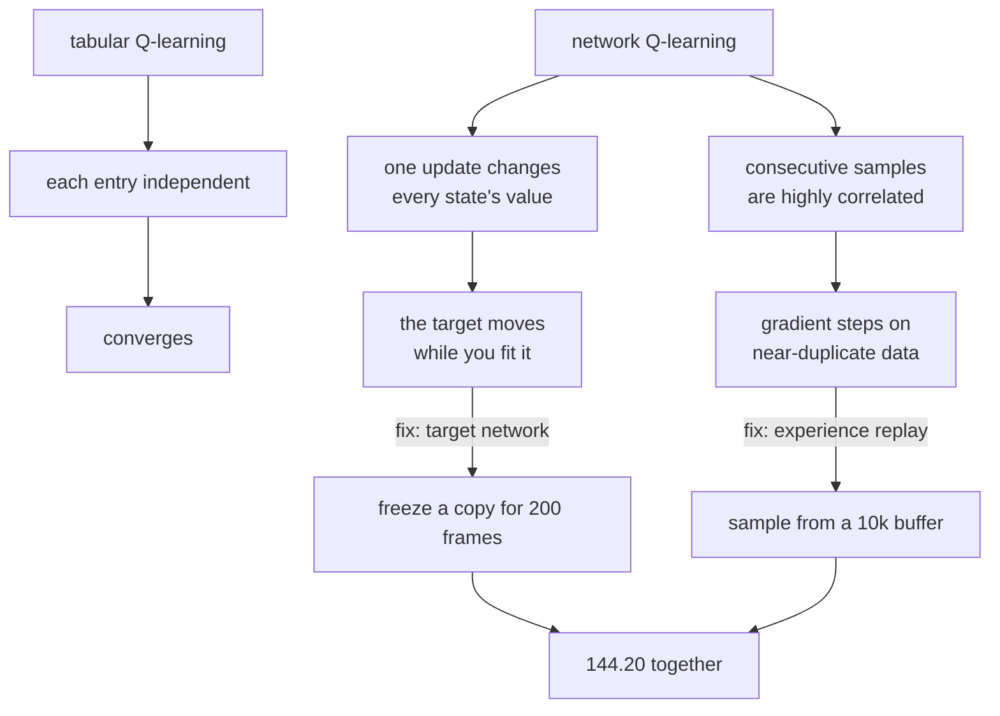

Tabular Q-learning is a lookup table with one number per state-action pair, updated by a rule
that provably converges. A **Deep Q-Network** is the same rule with a neural network in place of
the table — and that substitution breaks the convergence guarantee outright.

Two mechanisms exist to patch it: **experience replay** and a **target network**. Both are
usually presented as sensible ideas. Here they are ablated on CartPole, three seeds each:

| Configuration | Final episode length | sd | Worst seed | Best seed |
| --- | --- | --- | --- | --- |
| **Replay + target** | **144.20** | 7.91 | 136.82 | 155.17 |
| Replay only | 53.45 | 1.84 | 51.98 | 56.05 |
| Target only | 53.45 | **36.58** | **25.47** | 105.12 |
| Neither | 48.81 | 10.50 | 40.32 | 63.60 |
| *Random policy* | *23.09* | — | — | — |

Neither mechanism does much alone — 53.45 either way, against 48.81 for nothing at all. Together
they reach 144.20. The interesting row is **target only**, whose seeds ranged from 25.47 (barely
better than random) to 105.12.

## What you'll learn

- The Q-learning update, and the one property that makes the tabular version safe.
- Why replacing the table with a network breaks it, in two distinct ways.
- What replay and the target network each fix, measured by ablation.
- Why a learning rate of 1.0 destroys tabular learning in a *stochastic* world — reward
  −1.6025, goal rate 0.0100.

## The update

$$
Q(s, a) \leftarrow Q(s, a) + \alpha\Big[\underbrace{r + \gamma \max_{a'} Q(s', a')}_{\text{target}} - Q(s, a)\Big]
$$

The bracket is a **temporal-difference error**: the difference between what we thought this
state-action was worth and what one step of real experience suggests. The tabular version is
safe because each entry is independent — updating $Q(s, a)$ changes nothing else.

That independence is exactly what a network destroys. Every weight update changes the predicted
value of *every* state, including the $s'$ used to compute the target.

### Learning rate and exploration, on the gridworld

Before adding a network, here is the tabular version on the stochastic gridworld from the
[previous page](/deep-learning/phase-07---reinforcement-learning/introduction-to-reinforcement-learning/),
where value iteration scores 0.6849 reward with a 0.9033 goal rate:

<Figure
  src="/images/dl/phase-07-rl/q-learning-and-dqn/tabular"
  alt="Two panels against learning rate on a shared x-axis of 0.05 to 1.0. Left: mean reward for three exploration rates, all reasonable at low learning rates and collapsing to around -1.5 at learning rate 1.0, with a dashed line marking the value-iteration optimum. Right: the share of states whose greedy action matches the optimal policy, peaking near 0.82 and falling to 0.23 at learning rate 1.0."
  title="3,000 episodes per cell, greedy evaluation over 300 episodes"
  caption="A learning rate of 1.0 means each update throws away the old estimate entirely and believes the single most recent transition. In a world where actions slip 15% of the time, that single transition is often unrepresentative, and the table never settles — reward -1.6025 with a goal rate of 0.0100, far worse than random wandering. The best cell measured was alpha 0.05 with epsilon 0.10, at 0.6951."
/>

| α | ε | Reward | Goal rate | Policy match |
| --- | --- | --- | --- | --- |
| 0.05 | 0.10 | **0.6951** | **0.9133** | 0.7273 |
| 0.20 | 0.10 | 0.6872 | 0.9067 | **0.8182** |
| 0.50 | 0.01 | 0.6765 | 0.9033 | 0.7727 |
| 0.50 | 0.10 | **−1.8901** | **0.0200** | 0.5000 |
| 1.00 | 0.01 | −1.6025 | 0.0100 | 0.2273 |
| 1.00 | 0.30 | −1.2294 | 0.1633 | 0.5909 |

Two things worth noticing. First, the **α = 0.50, ε = 0.10** cell scored −1.8901 while its
neighbours at α = 0.50 scored 0.6765 and 0.4990 — a single unlucky combination, which is a
reminder that each cell here is one run, not an average. Second, **policy match never exceeds
0.8182**: even the best runs disagree with the optimal policy on a fifth of states, because
ε-greedy rarely visits the safe corridor.

## Why a network breaks it



**Correlated samples.** Consecutive CartPole states differ by one 0.02-second Euler step. A
network fitted on a stream of them sees a hundred near-duplicates in a row, drifts to fit that
narrow slice, and forgets the rest. Replay fixes this by keeping the last 10,000 transitions and
sampling a random batch of 64.

**A moving target.** The regression target is $r + \gamma \max_{a'} Q(s', a')$, computed with the
same network being updated. Fitting a target that shifts every time you fit it is not regression
in any usual sense. The target network fixes this by scoring $s'$ with a frozen copy, refreshed
every 200 frames.

```python title="The two mechanisms, in the lines that implement them"
# Replay: a random batch from the buffer, not the last few transitions.
batch = rng.integers(0, filled, BATCH) if replay else recent_indices()

# Target network: score the next state with a frozen copy.
scorer = target_q if target_network else online_q
future = scorer(following[batch]).max(axis=1)
wanted = rewards[batch] + GAMMA * future * (1 - finished[batch])

current = online_q(states[batch])
current[np.arange(len(batch)), actions[batch]] = wanted
step(states[batch], current)                    # one gradient step

if target_network and frame % TARGET_SYNC == 0:
    target.set_weights(online.get_weights())
```

## The ablation

<Figure
  src="/images/dl/phase-07-rl/q-learning-and-dqn/dqn-ablation"
  alt="Left: mean episode length against environment frames for four configurations, with replay-plus-target climbing steadily past 140 while the other three plateau near 50, and dashed lines at the random baseline of 23 and the episode cap of 200. Right: horizontal bars of final episode length with error bars across three seeds, showing replay+target at 144.20, replay only and target only both at 53.45, and neither at 48.81."
  title="6,000 frames across 16 parallel environments, 3 seeds each"
  caption="The two mechanisms are not independently useful here — each alone lands at 53.45, barely above the 48.81 of using neither. Together they reach 144.20. The error bars carry the other half of the story: replay-only is remarkably consistent (sd 1.84) because it reliably plateaus, while target-only ranges from 25.47 to 105.12 depending on the seed."
/>

The pattern is worth stating carefully, because "both matter" is the easy reading and it
understates the result. Each mechanism addresses a *different* failure, and fixing one while
leaving the other in place leaves the agent broken by the one that remains:

- With **replay but no target network**, the data is decorrelated but the regression target still
  moves with every gradient step.
- With a **target network but no replay**, the target is stable but the network is being fitted on
  64 near-identical consecutive transitions.

Only removing both obstacles produces learning, which is why DQN is usually described as needing
both — and why the measured 53.45 / 53.45 / 48.81 cluster is more informative than the headline
144.20.

## What the learned values look like

<Figure
  src="/images/dl/phase-07-rl/q-learning-and-dqn/q-values"
  alt="Left: a scatter plot of learned maximum Q-value against the true optimal value for 22 states, clustered around the diagonal but with a visible tendency to fall below it. Right: a histogram of the gap between the best and second-best action per state, concentrated at small values with a mean marked by a dashed line."
  title="Tabular Q-learning against value iteration, gridworld"
  caption="The mean signed error is -0.1273 — the learned values UNDERESTIMATE the true ones. Textbooks predict the opposite, because the max in the update is taken over noisy estimates and so tends to select overestimates. That bias is real, but here it is swamped by a larger effect: epsilon-greedy rarely visits the safe corridor, so those states keep values learned from too few visits."
/>

:::note[When the textbook prediction does not reproduce]
Maximisation bias is the standard motivation for **Double DQN**, which decouples choosing the
best action from evaluating it. The effect is genuine — taking a max over noisy estimates does
select for the ones that happened to be too high — but it is not the dominant error in every
setting. Here, under-exploration produced a net *under*-estimate of −0.1273.

Reporting the measured sign rather than the expected one is the whole point of running the
experiment.
:::

The right-hand histogram matters for a different reason: it shows how *close* the best and
second-best actions usually are. In states where that gap is small, a tiny estimation error
flips the greedy action, which is why policy match tops out at 0.8182 even when the values
themselves are roughly right.

```p5 title="The moving target problem" desc="Step the two fitting processes and watch the difference. On the left the target moves with the estimate; on the right it is frozen and refreshed periodically." height="360"
let chasing = 0.0;
let frozen = 0.0;
let frozenTarget = 1.0;
let steps = 0;
let historyA = [];
let historyB = [];
const RATE = 0.35;
function setup() {
  createCanvas(620, 360);
  textFont("monospace");
  reset();
}
function reset() {
  chasing = 0.0;
  frozen = 0.0;
  frozenTarget = 1.0;
  steps = 0;
  historyA = [0];
  historyB = [0];
}
function advance() {
  for (let n = 0; n < 5; n++) {
    steps += 1;
    // No target network: the target is a function of the current estimate,
    // so chasing it moves it.
    const movingTarget = 1.0 + 0.9 * chasing;
    chasing += RATE * (movingTarget - chasing);
    // With a target network: the target is frozen, refreshed every 20 steps.
    if (steps % 20 === 0) { frozenTarget = 1.0 + 0.9 * frozen; }
    frozen += RATE * (frozenTarget - frozen);
    historyA.push(chasing);
    historyB.push(frozen);
    if (historyA.length > 120) { historyA.shift(); historyB.shift(); }
  }
}
function draw() {
  background(13, 17, 23);
  noStroke();
  fill(230);
  textSize(12);
  textAlign(LEFT, TOP);
  text("fitting a target that depends on your own estimate", 30, 20);
  fill(150);
  textSize(10.5);
  text("step " + steps + "   (the true fixed point is 10.0)", 30, 42);
  const left = 40;
  const right = 580;
  const baseline = 280;
  const scale = 20;
  stroke(60, 70, 84);
  line(left, baseline, right, baseline);
  drawingContext.setLineDash([4, 4]);
  stroke(120);
  line(left, baseline - 10 * scale, right, baseline - 10 * scale);
  drawingContext.setLineDash([]);
  noStroke();
  fill(120);
  textSize(9);
  text("10.0", right - 34, baseline - 10 * scale - 14);
  const series = [[historyA, 224, 108, 117], [historyB, 126, 192, 143]];
  for (const entry of series) {
    const points = entry[0];
    stroke(entry[1], entry[2], entry[3]);
    strokeWeight(2);
    noFill();
    beginShape();
    for (let i = 0; i < points.length; i++) {
      const x = left + (i / 119) * (right - left);
      vertex(x, baseline - Math.min(points[i], 12) * scale);
    }
    endShape();
    strokeWeight(1);
  }
  noStroke();
  fill(224, 108, 117);
  textSize(11);
  text("no target network: " + chasing.toFixed(4), 40, 300);
  fill(126, 192, 143);
  text("frozen target: " + frozen.toFixed(4), 320, 300);
  const buttons = [["+5 steps", 40], ["reset", 160]];
  for (const entry of buttons) {
    fill(60, 70, 84);
    rect(entry[1], 324, 100, 24, 4);
    fill(200);
    textSize(10.5);
    textAlign(CENTER, CENTER);
    text(entry[0], entry[1] + 50, 337);
  }
  textAlign(LEFT, TOP);
  fill(120);
  textSize(9);
  text("both converge here - the point is HOW: one chases, one steps", 290, 331);
}
function mousePressed() {
  if (mouseY < 324 || mouseY > 348) { return; }
  if (mouseX > 40 && mouseX < 140) { advance(); }
  else if (mouseX > 160 && mouseX < 260) { reset(); }
}
```

```p5 title="The measured table, ranked" desc="Click a column to rank every row by it. The bars are that column's values and the highest and lowest are computed from the numbers, not written in." height="306"
let metric = 0;
const COLUMNS = ["ε", "Reward", "Goal rate", "Policy match"];
const ROWS = [
  ["0.05", 0.1, 0.6951, 0.9133, 0.7273],
  ["0.20", 0.1, 0.6872, 0.9067, 0.8182],
  ["0.50", 0.01, 0.6765, 0.9033, 0.7727],
  ["0.50", 0.1, -1.8901, 0.02, 0.5],
  ["1.00", 0.01, -1.6025, 0.01, 0.2273],
  ["1.00", 0.3, -1.2294, 0.1633, 0.5909]
];
function setup() {
  createCanvas(620, 306);
  textFont("monospace");
}
function fmt(v) {
  if (v === 0) { return "0"; }
  const a = Math.abs(v);
  if (a >= 1000 || a < 0.001) { return v.toExponential(2); }
  if (a >= 100) { return v.toFixed(1); }
  return v.toFixed(4);
}
function draw() {
  background(13, 17, 23);
  noStroke();
  fill(230);
  textSize(12);
  textAlign(LEFT, TOP);
  text("Q-Learning & Deep Q-Networks", 26, 16);
  let x = 26;
  for (let i = 0; i < COLUMNS.length; i++) {
    const w = COLUMNS[i].length * 6.6 + 16;
    if (i === metric) { fill(255, 211, 67); } else { fill(48, 56, 68); }
    rect(x, 40, w, 22, 4);
    if (i === metric) { fill(13, 17, 23); } else { fill(180); }
    textSize(9);
    text(COLUMNS[i], x + 8, 47);
    x += w + 6;
    if (x > 500) { break; }
  }
  const values = ROWS.map((r) => r[metric + 1]);
  const lo = Math.min(...values);
  const hi = Math.max(...values);
  const span = hi - lo === 0 ? 1 : hi - lo;
  const order = ROWS.slice().sort((a, b) => b[metric + 1] - a[metric + 1]);
  for (let i = 0; i < order.length; i++) {
    const y = 78 + i * 26;
    const v = order[i][metric + 1];
    fill(160);
    textSize(9);
    text(order[i][0], 26, y + 5);
    fill(34, 40, 50);
    rect(230, y, 280, 18, 3);
    const frac = (v - lo) / span;
    if (v === hi) { fill(126, 192, 143); }
    else if (v === lo) { fill(224, 108, 117); }
    else { fill(107, 169, 221); }
    rect(230, y, Math.max(frac * 280, 3), 18, 3);
    fill(225);
    textSize(9);
    text(fmt(v), 518, y + 5);
  }
  const top = order[0];
  const bottom = order[order.length - 1];
  fill(150);
  textSize(9);
  const base = 78 + order.length * 26 + 8;
  text("highest " + COLUMNS[metric] + ": " + top[0] + " at " + fmt(top[1]),
       26, base);
  text("lowest  " + COLUMNS[metric] + ": " + bottom[0] + " at "
       + fmt(bottom[1]), 26, base + 14);
  text("bars are scaled within the chosen column - lowest is not zero", 26,
       base + 30);
}
function mousePressed() {
  let x = 26;
  for (let i = 0; i < COLUMNS.length; i++) {
    const w = COLUMNS[i].length * 6.6 + 16;
    if (mouseX > x && mouseX < x + w && mouseY > 40 && mouseY < 62) {
      metric = i;
    }
    x += w + 6;
  }
}
```

## Pitfalls

- **Using a high learning rate in a stochastic environment.** α = 1.0 replaces the estimate with
  the latest transition, and scored −1.6025 with a 0.0100 goal rate.
- **Adding replay or a target network alone and concluding it did not help.** Each scored 53.45;
  together they scored 144.20.
- **Reading a single seed.** Target-only ranged from 25.47 to 105.12 across three seeds.
- **Assuming learned Q-values overestimate.** Measured here at −0.1273, because under-exploration
  outweighed maximisation bias.
- **Judging a policy by value accuracy.** Policy match peaked at 0.8182 even where the values were
  close, because many states have a tiny gap between the best and second-best action.
- **Calling `predict()` inside the loop.** Measured at roughly 470ms per call against 1.2ms for a
  traced `tf.function` — an RL loop makes several calls per frame.
- **Treating a time-limit ending as a terminal state.** This implementation does, which is the
  standard simplification, and it slightly under-values states near the 200-step cap.

## Recap

- Q-learning updates towards $r + \gamma \max_{a'} Q(s', a')$; the tabular version is safe because
  entries are independent.
- A network couples every state to every other, which breaks that independence in two ways:
  correlated samples and a moving target.
- Replay and a target network fix one each, and measured alone neither was enough — 53.45 and
  53.45, against 48.81 for neither and 144.20 for both.
- In the tabular world, α = 0.05 with ε = 0.10 was best (0.6951); α = 1.0 collapsed to −1.6025.
- Learned values underestimated the optimum by 0.1273 on average, the opposite of the textbook
  prediction, because exploration was the larger error source.
- Policy match never exceeded 0.8182, since small value errors flip the greedy action wherever
  two actions are close.

## Next

DQN learns a value and derives a policy from it. The alternative is to skip the value function
and adjust the policy directly, which trades one problem for a noisier one:
[Policy Gradients (Intro)](/deep-learning/phase-07---reinforcement-learning/policy-gradients-intro/).

<Quiz
  questions={[
    {
      q: "Replay alone scored 53.45, a target network alone scored 53.45, and both together scored 144.20. What does that show?",
      options: [
        "The two mechanisms are redundant",
        "They fix different failures — correlated samples and a moving regression target — so removing one obstacle while leaving the other still leaves the agent broken by the remaining one",
        "The target network is unnecessary",
        "The measurements are within noise of each other",
      ],
      answer: 1,
      explain: "Both-together is nearly three times either-alone, and either-alone is barely above the 48.81 of using neither.",
    },
    {
      q: "Why does replacing a Q-table with a network break Q-learning's convergence guarantee?",
      options: [
        "Networks are not expressive enough",
        "The table's entries are independent, so updating one changes nothing else; a network's weights are shared, so every update changes the predicted value of every state including the one used to build the target",
        "Gradient descent cannot minimise a temporal-difference error",
        "Because the reward becomes stochastic",
      ],
      answer: 1,
      explain: "That shared-parameter coupling is precisely what the target network works around, by freezing a copy to compute targets with.",
    },
    {
      q: "Tabular Q-learning with a learning rate of 1.0 scored -1.6025 with a goal rate of 0.0100, worse than random. Why?",
      options: [
        "The learning rate caused numerical overflow",
        "Alpha 1.0 discards the running estimate and adopts the single most recent transition — and in a world where actions slip 15% of the time, that transition is frequently unrepresentative, so the table never settles",
        "It converged to a local optimum",
        "It needed more episodes",
      ],
      answer: 1,
      explain: "In a deterministic world alpha 1.0 is harmless. The failure is specific to stochastic transitions.",
    },
    {
      q: "The learned Q-values had a mean signed error of -0.1273 against the exact values, while the textbook predicts overestimation. What is the honest interpretation?",
      options: [
        "The measurement is wrong",
        "Maximisation bias is real but was not the dominant error here — epsilon-greedy rarely visited the safe corridor, so those states retained values learned from too few visits, producing a net underestimate",
        "Double DQN is unnecessary",
        "The exact values were computed incorrectly",
      ],
      answer: 1,
      explain: "Reporting the measured sign rather than the expected one is the reason for running the experiment at all.",
    },
    {
      q: "Even the best tabular run matched the optimal policy in only 0.8182 of states, despite scoring near-optimal reward. How can both be true?",
      options: [
        "The reward measurement is unreliable",
        "Many states have a very small gap between the best and second-best action, so a tiny value error flips the greedy choice without costing much reward",
        "Policy match is computed on terminal states too",
        "The evaluation used too few episodes",
      ],
      answer: 1,
      explain: "The histogram of best-minus-second-best action values is concentrated near zero, which is exactly the condition for this to happen.",
    },
  ]}
/>

## 🧪 Try It Yourself

<DataCampExercise
  lang="python"
  hint={`The new estimate is the old one plus alpha times the temporal-difference error. With alpha 1.0 the old estimate disappears entirely.`}
  expectedOutput={` alpha       1       2       3       4       5       6       7       8
  0.05   0.050  -0.003   0.048   0.095   0.040   0.088   0.134   0.177
  0.20   0.200  -0.040   0.168   0.334   0.068   0.254   0.403   0.523
  0.50   0.500  -0.250   0.375   0.688  -0.156   0.422   0.711   0.855
  1.00   1.000  -1.000   1.000   1.000  -1.000   1.000   1.000   1.000

alpha 1.0 just repeats the last reward - it has no memory at all,
which is why it scored -1.6025 in a world with 15% slip`}
  code={`# Task: Exercise 1 - What the learning rate actually does
REWARDS = (1.0, -1.0, 1.0, 1.0, -1.0, 1.0, 1.0, 1.0)   # a noisy signal, true mean 0.5


def learn(alpha, rewards=REWARDS):
    """Follow the running estimate under a fixed learning rate."""
    estimate = 0.0
    history = []
    for reward in rewards:
        error = reward - estimate
        estimate = estimate + ___ * error        # replace ___ with alpha
        history.append(estimate)
    return history


print(f"{'alpha':>6} " + " ".join(f"{i:>7}" for i in range(1, 9)))
for alpha in (0.05, 0.2, 0.5, 1.0):
    row = " ".join(f"{v:7.3f}" for v in learn(alpha))
    print(f"{alpha:6.2f} {row}")

print("\\nalpha 1.0 just repeats the last reward - it has no memory at all,")
print("which is why it scored -1.6025 in a world with 15% slip")`}
  solution={`REWARDS = (1.0, -1.0, 1.0, 1.0, -1.0, 1.0, 1.0, 1.0)   # a noisy signal, true mean 0.5


def learn(alpha, rewards=REWARDS):
    """Follow the running estimate under a fixed learning rate."""
    estimate = 0.0
    history = []
    for reward in rewards:
        error = reward - estimate
        estimate = estimate + alpha * error
        history.append(estimate)
    return history


print(f"{'alpha':>6} " + " ".join(f"{i:>7}" for i in range(1, 9)))
for alpha in (0.05, 0.2, 0.5, 1.0):
    row = " ".join(f"{v:7.3f}" for v in learn(alpha))
    print(f"{alpha:6.2f} {row}")

print("\\nalpha 1.0 just repeats the last reward - it has no memory at all,")
print("which is why it scored -1.6025 in a world with 15% slip")`}
  sct={`test_output_contains("alpha 1.0 just repeats the last reward", pattern=False)
test_output_contains("0.50   0.500  -0.250", pattern=False)
success_msg("The learning rate sets how much of each new reward replaces the old estimate: alpha 1.0 has no memory at all.")`}
  height={400}
/>

<DataCampExercise
  lang="python"
  hint={`Consecutive states differ by one small integration step, so their correlation is close to 1. A random batch from a large buffer breaks that.`}
  code={`# Task: Exercise 2 - How correlated are consecutive samples?
import numpy as np

# A stand-in for a CartPole trajectory: a smooth path with small steps.
rng = np.random.default_rng(0)
trajectory = np.cumsum(rng.normal(0, 0.02, (2000, 4)), axis=0)


def batch_spread(batch):
    """Mean distance between pairs of samples in a batch.

    Not a correlation: centring each batch first would remove exactly the
    property being measured, which is that consecutive samples are all bunched
    in the same small region of state space.
    """
    squared = (np.sum(batch ** 2, axis=1)[:, None]
               + np.sum(batch ** 2, axis=1)[None, :]
               - 2 * batch @ batch.T)
    distance = np.sqrt(np.maximum(squared, 0))
    return float(distance[np.triu_indices(len(batch), k=1)].mean())


consecutive = trajectory[500:564]
replayed = trajectory[rng.integers(0, len(trajectory), ___)]   # replace with 64

print(f"consecutive batch spread: {batch_spread(consecutive):.4f}")
print(f"replayed batch spread:    {batch_spread(replayed):.4f}")
print(f"ratio: {batch_spread(replayed) / batch_spread(consecutive):.1f}x")
print("\\na batch of consecutive transitions covers a tiny region of state")
print("space, which is what experience replay exists to prevent")`}
  solution={`import numpy as np

# A stand-in for a CartPole trajectory: a smooth path with small steps.
rng = np.random.default_rng(0)
trajectory = np.cumsum(rng.normal(0, 0.02, (2000, 4)), axis=0)


def batch_spread(batch):
    """Mean distance between pairs of samples in a batch.

    Not a correlation: centring each batch first would remove exactly the
    property being measured, which is that consecutive samples are all bunched
    in the same small region of state space.
    """
    squared = (np.sum(batch ** 2, axis=1)[:, None]
               + np.sum(batch ** 2, axis=1)[None, :]
               - 2 * batch @ batch.T)
    distance = np.sqrt(np.maximum(squared, 0))
    return float(distance[np.triu_indices(len(batch), k=1)].mean())


consecutive = trajectory[500:564]
replayed = trajectory[rng.integers(0, len(trajectory), 64)]

print(f"consecutive batch spread: {batch_spread(consecutive):.4f}")
print(f"replayed batch spread:    {batch_spread(replayed):.4f}")
print(f"ratio: {batch_spread(replayed) / batch_spread(consecutive):.1f}x")
print("\\na batch of consecutive transitions covers a tiny region of state")
print("space, which is what experience replay exists to prevent")`}
  sct={`test_output_contains("ratio: 4.1x", pattern=False)
test_output_contains("replayed batch spread", pattern=False)
success_msg("A batch of consecutive transitions covers a tiny region of state space, which is what experience replay exists to prevent.")`}
  height={400}
/>

<DataCampExercise
  lang="python"
  hint={`Without a target network the target is recomputed from the current estimate every step; with one it is refreshed only every sync interval.`}
  code={`# Task: Exercise 3 - Chasing a target that moves when you move
def fit(sync, steps=60, rate=0.35):
    """sync = 1 means no target network; larger values freeze the target."""
    estimate = 0.0
    target = 1.0 + 0.9 * estimate
    path = []
    for step in range(1, steps + 1):
        if step % sync == 0:
            target = 1.0 + 0.9 * ___             # replace ___ with estimate
        estimate += rate * (target - estimate)
        path.append(estimate)
    return path


TRUE_FIXED_POINT = 1.0 / (1.0 - 0.9)
print(f"the fixed point is {TRUE_FIXED_POINT:.2f}")
print(f"{'sync every':>11} {'after 10':>10} {'after 30':>10} {'after 60':>10}")
for sync in (1, 5, 20):
    path = fit(sync)
    print(f"{sync:11d} {path[9]:10.4f} {path[29]:10.4f} {path[59]:10.4f}")

print("\\nboth reach the same place; the frozen version does it in clean")
print("regression steps rather than by chasing a receding target")`}
  solution={`def fit(sync, steps=60, rate=0.35):
    """sync = 1 means no target network; larger values freeze the target."""
    estimate = 0.0
    target = 1.0 + 0.9 * estimate
    path = []
    for step in range(1, steps + 1):
        if step % sync == 0:
            target = 1.0 + 0.9 * estimate
        estimate += rate * (target - estimate)
        path.append(estimate)
    return path


TRUE_FIXED_POINT = 1.0 / (1.0 - 0.9)
print(f"the fixed point is {TRUE_FIXED_POINT:.2f}")
print(f"{'sync every':>11} {'after 10':>10} {'after 30':>10} {'after 60':>10}")
for sync in (1, 5, 20):
    path = fit(sync)
    print(f"{sync:11d} {path[9]:10.4f} {path[29]:10.4f} {path[59]:10.4f}")

print("\\nboth reach the same place; the frozen version does it in clean")
print("regression steps rather than by chasing a receding target")`}
  sct={`test_output_contains("the fixed point is 10.00", pattern=False)
test_output_contains("sync every", pattern=False)
success_msg("Freezing the target turns chasing a moving target into clean regression steps towards the same fixed point.")`}
  height={400}
/>

<DataCampExercise
  lang="python"
  hint={`Build the target as reward + gamma * max(next Q) for non-terminal transitions, and just the reward for terminal ones.`}
  expectedOutput={`  i  reward  done  max next Q   target
  0     1.0     0        4.10   5.0590
  1     1.0     0        5.00   5.9500
  2     1.0     1        0.30   1.0000
  3     1.0     0        6.40   7.3360

only the taken action's value is changed:
[[3.9 4. ]
 [4.6 4.9]
 [1.1 0.7]
 [5.8 6. ]]
[[3.9   5.059]
 [5.95  4.9  ]
 [1.    0.7  ]
 [5.8   7.336]]`}
  code={`# Task: Exercise 4 - Build a DQN target batch by hand
import numpy as np

GAMMA = 0.99
rewards = np.array([1.0, 1.0, 1.0, 1.0], dtype="float32")
finished = np.array([0.0, 0.0, 1.0, 0.0], dtype="float32")
next_q = np.array([[3.2, 4.1], [5.0, 4.4], [0.3, 0.2], [6.1, 6.4]], "float32")
current_q = np.array([[3.9, 4.0], [4.6, 4.9], [1.1, 0.7], [5.8, 6.0]], "float32")
actions = np.array([1, 0, 0, 1], dtype="int32")


def targets(rewards, finished, next_q):
    """A terminal transition has no future, so its target is just the reward."""
    future = next_q.max(axis=1)
    return rewards + GAMMA * future * (1 - ___)     # replace ___ with finished


wanted = targets(rewards, finished, next_q)
updated = current_q.copy()
updated[np.arange(len(actions)), actions] = wanted

print(f"{'i':>3} {'reward':>7} {'done':>5} {'max next Q':>11} {'target':>8}")
for i in range(len(rewards)):
    print(f"{i:3d} {rewards[i]:7.1f} {finished[i]:5.0f} "
          f"{next_q[i].max():11.2f} {wanted[i]:8.4f}")

print("\\nonly the taken action's value is changed:")
print(current_q)
print(updated)`}
  solution={`import numpy as np

GAMMA = 0.99
rewards = np.array([1.0, 1.0, 1.0, 1.0], dtype="float32")
finished = np.array([0.0, 0.0, 1.0, 0.0], dtype="float32")
next_q = np.array([[3.2, 4.1], [5.0, 4.4], [0.3, 0.2], [6.1, 6.4]], "float32")
current_q = np.array([[3.9, 4.0], [4.6, 4.9], [1.1, 0.7], [5.8, 6.0]], "float32")
actions = np.array([1, 0, 0, 1], dtype="int32")


def targets(rewards, finished, next_q):
    """A terminal transition has no future, so its target is just the reward."""
    future = next_q.max(axis=1)
    return rewards + GAMMA * future * (1 - finished)


wanted = targets(rewards, finished, next_q)
updated = current_q.copy()
updated[np.arange(len(actions)), actions] = wanted

print(f"{'i':>3} {'reward':>7} {'done':>5} {'max next Q':>11} {'target':>8}")
for i in range(len(rewards)):
    print(f"{i:3d} {rewards[i]:7.1f} {finished[i]:5.0f} "
          f"{next_q[i].max():11.2f} {wanted[i]:8.4f}")

print("\\nonly the taken action's value is changed:")
print(current_q)
print(updated)`}
  sct={`test_output_contains("5.0590", pattern=False)
test_output_contains("[[3.9   5.059]", pattern=False)
success_msg("Only the value of the action that was taken is changed, and the target is reward plus the discounted best next value.")`}
  height={400}
/>

<DataCampExercise
  lang="python"
  hint={`Take the max over noisy estimates of equal-valued actions and average it over many trials. The max of several noisy zeros is reliably above zero.`}
  code={`# Task: Exercise 5 - Maximisation bias, on its own
import numpy as np

rng = np.random.default_rng(0)
TRIALS = 20000


def bias(actions, noise=1.0):
    """All actions are truly worth 0. How high does the max estimate them?"""
    estimates = rng.normal(0.0, noise, (TRIALS, actions))
    return float(estimates.max(axis=___).mean())    # replace ___ with 1


print(f"{'actions':>8} {'mean of the max':>17}")
for actions in (1, 2, 4, 10, 50):
    print(f"{actions:8d} {bias(actions):17.4f}")

print("\\nevery action is worth exactly 0, yet the max of their estimates is")
print("reliably positive - that is maximisation bias, and it grows with the")
print("number of actions. On the page it was outweighed by under-exploration")`}
  solution={`import numpy as np

rng = np.random.default_rng(0)
TRIALS = 20000


def bias(actions, noise=1.0):
    """All actions are truly worth 0. How high does the max estimate them?"""
    estimates = rng.normal(0.0, noise, (TRIALS, actions))
    return float(estimates.max(axis=1).mean())


print(f"{'actions':>8} {'mean of the max':>17}")
for actions in (1, 2, 4, 10, 50):
    print(f"{actions:8d} {bias(actions):17.4f}")

print("\\nevery action is worth exactly 0, yet the max of their estimates is")
print("reliably positive - that is maximisation bias, and it grows with the")
print("number of actions. On the page it was outweighed by under-exploration")`}
  sct={`test_output_contains("mean of the max", pattern=False)
test_output_contains("50            2.2500", pattern=False)
success_msg("Every action is worth exactly 0, yet the max of their noisy estimates is reliably positive: maximisation bias grows with the number of actions.")`}
  height={400}
/>

<DataCampExercise
  lang="python"
  hint={`Run the loop with replay on and off and compare the final mean episode length. Keep the frame budget small so it finishes quickly.`}
  code={`# Task: Exercise 6 - A DQN loop you can run
import numpy as np

GAMMA, BATCH, FRAMES, ENVS = 0.99, 64, 1500, 8


class CartPole:
    """The classic dynamics, vectorised over several environments at once."""
    def __init__(self, count, seed=0):
        self.count = count
        self.rng = np.random.default_rng(seed)
        self.state = self.rng.uniform(-0.05, 0.05, (count, 4))
        self.steps = np.zeros(count, "int32")

    def step(self, actions):
        x, x_dot, theta, theta_dot = self.state.T
        force = np.where(actions == 1, 10.0, -10.0)
        cos, sin = np.cos(theta), np.sin(theta)
        temp = (force + 0.05 * theta_dot ** 2 * sin) / 1.1
        theta_acc = ((9.8 * sin - cos * temp)
                     / (0.5 * (4.0 / 3.0 - 0.1 * cos ** 2 / 1.1)))
        x_acc = temp - 0.05 * theta_acc * cos / 1.1
        self.state = np.stack([x + 0.02 * x_dot, x_dot + 0.02 * x_acc,
                               theta + 0.02 * theta_dot,
                               theta_dot + 0.02 * theta_acc], 1)
        self.steps += 1
        done = ((np.abs(self.state[:, 0]) > 2.4)
                | (np.abs(self.state[:, 2]) > 0.2095) | (self.steps >= 200))
        return self.state.copy(), np.ones(self.count), done

    def reset(self, mask):
        n = int(mask.sum())
        self.state[mask] = self.rng.uniform(-0.05, 0.05, (n, 4))
        self.steps[mask] = 0


def q_values(weights, states):
    return states @ weights[0] + weights[1]          # a linear Q-function


def run(replay):
    online = [np.zeros((4, 2)), np.zeros(2)]
    target = [online[0].copy(), online[1].copy()]
    env = CartPole(ENVS, seed=0)
    rng = np.random.default_rng(0)
    buffer = {"s": [], "a": [], "r": [], "n": [], "d": []}
    lengths, running, spread = [], np.zeros(ENVS), 0.0
    for frame in range(1, FRAMES + 1):
        state = env.state.copy()
        epsilon = max(0.05, 1.0 - frame / (FRAMES * 0.5))
        q = q_values(online, state)
        chosen = np.where(rng.random(ENVS) < epsilon,
                          rng.integers(0, 2, ENVS), q.argmax(1))
        nxt, reward, done = env.step(chosen)
        running += 1
        for i in range(ENVS):
            for key, value in zip("sarnd", (state[i], chosen[i], reward[i],
                                            nxt[i], float(done[i]))):
                buffer[key].append(value)
        for key in buffer:
            buffer[key] = buffer[key][-5000:]
        if done.any():
            lengths.extend(running[done].tolist())
            running[done] = 0
            env.reset(done)
        if len(buffer["s"]) >= 200 and frame % 4 == 0:
            size = len(buffer["s"])
            index = (rng.integers(0, size, BATCH) if replay
                     else np.arange(size - BATCH, size))
            s = np.array([buffer["s"][i] for i in index])
            n = np.array([buffer["n"][i] for i in index])
            a = np.array([buffer["a"][i] for i in index], "int32")
            r = np.array([buffer["r"][i] for i in index])
            d = np.array([buffer["d"][i] for i in index])
            wanted = r + GAMMA * q_values(target, n).max(1) * (1 - d)
            error = q_values(online, s)[np.arange(BATCH), a] - wanted
            grad_w, grad_b = np.zeros((4, 2)), np.zeros(2)
            for k in range(BATCH):
                grad_w[:, a[k]] += error[k] * s[k] / BATCH
                grad_b[a[k]] += error[k] / BATCH
            online[0] -= 0.05 * grad_w
            online[1] -= 0.05 * grad_b
            spread = float(s.std(axis=0).mean())
        if frame % 200 == 0:
            target = [online[0].copy(), online[1].copy()]
    return (float(np.mean(lengths[-30:])) if lengths else 0.0), spread


spreads = {}
for replay in (True, ___):                       # replay on, then replay off
    length, spreads[replay] = run(replay)
    print(f"replay={replay}: final mean episode length {length:.1f}, "
          f"batch spread {spreads[replay]:.3f}")
print("a replayed batch covers more of the state space:", spreads[True] > spreads[False])`}
  solution={`# Task: Exercise 6 - A DQN loop you can run
import numpy as np

GAMMA, BATCH, FRAMES, ENVS = 0.99, 64, 1500, 8


class CartPole:
    """The classic dynamics, vectorised over several environments at once."""
    def __init__(self, count, seed=0):
        self.count = count
        self.rng = np.random.default_rng(seed)
        self.state = self.rng.uniform(-0.05, 0.05, (count, 4))
        self.steps = np.zeros(count, "int32")

    def step(self, actions):
        x, x_dot, theta, theta_dot = self.state.T
        force = np.where(actions == 1, 10.0, -10.0)
        cos, sin = np.cos(theta), np.sin(theta)
        temp = (force + 0.05 * theta_dot ** 2 * sin) / 1.1
        theta_acc = ((9.8 * sin - cos * temp)
                     / (0.5 * (4.0 / 3.0 - 0.1 * cos ** 2 / 1.1)))
        x_acc = temp - 0.05 * theta_acc * cos / 1.1
        self.state = np.stack([x + 0.02 * x_dot, x_dot + 0.02 * x_acc,
                               theta + 0.02 * theta_dot,
                               theta_dot + 0.02 * theta_acc], 1)
        self.steps += 1
        done = ((np.abs(self.state[:, 0]) > 2.4)
                | (np.abs(self.state[:, 2]) > 0.2095) | (self.steps >= 200))
        return self.state.copy(), np.ones(self.count), done

    def reset(self, mask):
        n = int(mask.sum())
        self.state[mask] = self.rng.uniform(-0.05, 0.05, (n, 4))
        self.steps[mask] = 0


def q_values(weights, states):
    return states @ weights[0] + weights[1]          # a linear Q-function


def run(replay):
    online = [np.zeros((4, 2)), np.zeros(2)]
    target = [online[0].copy(), online[1].copy()]
    env = CartPole(ENVS, seed=0)
    rng = np.random.default_rng(0)
    buffer = {"s": [], "a": [], "r": [], "n": [], "d": []}
    lengths, running, spread = [], np.zeros(ENVS), 0.0
    for frame in range(1, FRAMES + 1):
        state = env.state.copy()
        epsilon = max(0.05, 1.0 - frame / (FRAMES * 0.5))
        q = q_values(online, state)
        chosen = np.where(rng.random(ENVS) < epsilon,
                          rng.integers(0, 2, ENVS), q.argmax(1))
        nxt, reward, done = env.step(chosen)
        running += 1
        for i in range(ENVS):
            for key, value in zip("sarnd", (state[i], chosen[i], reward[i],
                                            nxt[i], float(done[i]))):
                buffer[key].append(value)
        for key in buffer:
            buffer[key] = buffer[key][-5000:]
        if done.any():
            lengths.extend(running[done].tolist())
            running[done] = 0
            env.reset(done)
        if len(buffer["s"]) >= 200 and frame % 4 == 0:
            size = len(buffer["s"])
            index = (rng.integers(0, size, BATCH) if replay
                     else np.arange(size - BATCH, size))
            s = np.array([buffer["s"][i] for i in index])
            n = np.array([buffer["n"][i] for i in index])
            a = np.array([buffer["a"][i] for i in index], "int32")
            r = np.array([buffer["r"][i] for i in index])
            d = np.array([buffer["d"][i] for i in index])
            wanted = r + GAMMA * q_values(target, n).max(1) * (1 - d)
            error = q_values(online, s)[np.arange(BATCH), a] - wanted
            grad_w, grad_b = np.zeros((4, 2)), np.zeros(2)
            for k in range(BATCH):
                grad_w[:, a[k]] += error[k] * s[k] / BATCH
                grad_b[a[k]] += error[k] / BATCH
            online[0] -= 0.05 * grad_w
            online[1] -= 0.05 * grad_b
            spread = float(s.std(axis=0).mean())
        if frame % 200 == 0:
            target = [online[0].copy(), online[1].copy()]
    return (float(np.mean(lengths[-30:])) if lengths else 0.0), spread


spreads = {}
for replay in (True, False):                       # replay on, then replay off
    length, spreads[replay] = run(replay)
    print(f"replay={replay}: final mean episode length {length:.1f}, "
          f"batch spread {spreads[replay]:.3f}")
print("a replayed batch covers more of the state space:", spreads[True] > spreads[False])`}
  sct={`test_output_contains("a replayed batch covers more of the state space: True", pattern=False)
success_msg("Sampling the replay buffer at random breaks the correlation between consecutive transitions, so each batch covers more of the state space.")`}
  height={400}
/>
