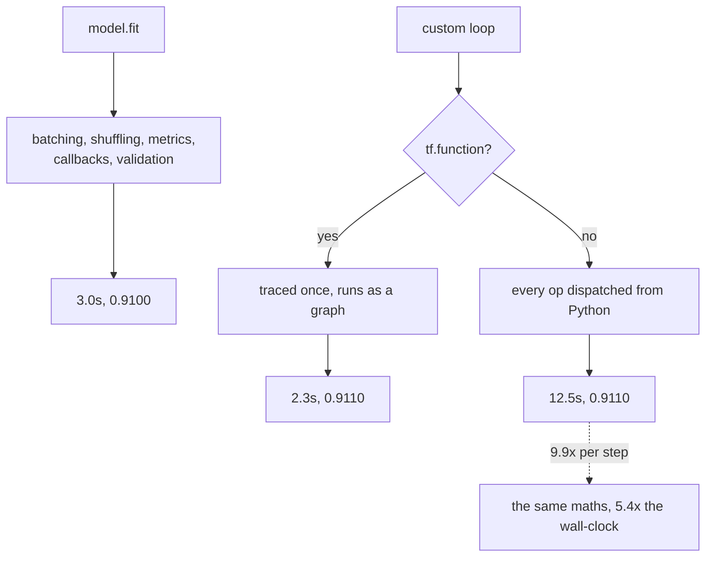

`model.fit()` handles batching, shuffling, metrics, callbacks and validation. When you need
something it does not support — a second optimiser, an adversarial inner loop, a loss that reads
intermediate activations — you write the loop yourself.

That trade is usually described as "flexibility for verbosity". The real cost is different, and
it is measurable:

| Run | Final accuracy | Seconds |
| --- | --- | --- |
| `model.fit` | 0.9100 | 3.0 |
| **Custom loop, `@tf.function`** | **0.9110** | **2.3** |
| Custom loop, eager | 0.9110 | **12.5** |

Same data, same seed, same batches, no shuffling. The hand-written loop is correct — and the only
difference between the fast version and the slow one is a single decorator.

## What you'll learn

- How to check a hand-written loop is equivalent to `fit` before trusting anything it produces.
- Why `tf.function` is worth **9.9× per step**, and what it actually changes.
- Why the custom loop beat `fit` on wall-clock, and why that is not a reason to abandon `fit`.
- How to write a loss and a metric by hand, and the averaging bug that catches people.

## The loop

```python title="Everything fit() does, unrolled"
optimizer = keras.optimizers.Adam(1e-3)
loss_function = keras.losses.SparseCategoricalCrossentropy(from_logits=True)

@tf.function                                   # <- the 9.9x
def step(images, labels):
    with tf.GradientTape() as tape:
        logits = model(images, training=True)  # training=True matters for
        loss = loss_function(labels, logits)   # dropout and batch norm
    gradients = tape.gradient(loss, model.trainable_variables)
    optimizer.apply_gradients(zip(gradients, model.trainable_variables))
    return loss

for epoch in range(EPOCHS):
    for begin in range(0, len(images) - BATCH + 1, BATCH):
        step(images[begin:begin + BATCH], labels[begin:begin + BATCH])
```

Three details in that block are easy to get wrong and hard to notice:

- **`training=True`** switches dropout on and batch normalisation into batch-statistics mode.
  Omit it and the model trains in inference mode, which usually still converges — slightly worse,
  with no error.
- **The tape only records what happens inside it.** A loss computed outside the `with` block has
  no gradient path, and `tape.gradient` returns `None` rather than raising.
- **`apply_gradients` takes pairs**, so a mismatch between the gradient list and the variable list
  fails silently in the sense that it applies *something*, just not what you meant.

## Check the loop before trusting it

<Figure
  src="/images/dl/phase-08-scaling/custom-training/equivalence"
  alt="Left: test accuracy per epoch for model.fit and the custom loop, two nearly overlapping curves rising from about 0.82 to 0.91. Right: bars of the absolute difference between them at each epoch, all at or below 0.0045."
  title="Identical seeds, identical batch boundaries, shuffling disabled"
  caption="The comparison only means something because shuffling is off on both sides — with shuffling the two would see different batches and any difference would be unattributable. The residual gap of 0.0010 to 0.0045 comes from floating-point ordering inside the two implementations, not from the loop being wrong. Establishing this first is what makes the timing comparison that follows interpretable."
/>

| Epoch | `fit` | Custom | Difference |
| --- | --- | --- | --- |
| 1 | 0.8230 | 0.8245 | 0.0015 |
| 2 | 0.8765 | 0.8810 | 0.0045 |
| 3 | 0.8915 | 0.8930 | 0.0015 |
| 6 | 0.9100 | 0.9110 | 0.0010 |

This step is not ceremony. A custom loop that quietly skips the last partial batch, applies
gradients twice, or forgets `training=True` will still produce a curve that goes up — and you
will spend the next week attributing your research result to the wrong cause.

## What `tf.function` does

<Figure
  src="/images/dl/phase-08-scaling/custom-training/graph-mode"
  alt="Left: two bars of milliseconds per training step, 31.21 for eager and 3.14 with tf.function. Right: horizontal bars of total seconds for six epochs — model.fit at 3.0, the compiled custom loop at 2.3, and the eager custom loop at 12.5."
  title="Mean of 60 steps after a warm-up, identical model and batch"
  caption="31.21 ms against 3.14 ms per step. Eager mode dispatches every operation from Python one at a time; tf.function traces the whole step once into a graph and then executes it without returning to the interpreter between operations. On a small model the per-operation Python overhead dominates completely, which is why the ratio is so large here and would shrink on a model whose individual operations are expensive."
/>

Tracing has consequences worth knowing before you rely on it:

- **Python side effects run only during tracing.** A `print()` inside a `tf.function` fires once,
  not every step. Use `tf.print` if you need it every time.
- **A new input shape triggers a re-trace.** A final partial batch of a different size compiles a
  second graph; `reduce_retracing=True` relaxes this.
- **Python conditionals are baked in.** `if training:` on a Python boolean is decided at trace
  time; on a tensor it needs `tf.cond`.

## Why the custom loop beat `fit`

2.3 seconds against 3.0. That is real but it is not a reason to stop using `fit` — the gap is
everything `fit` does that this loop does not: computing running metrics each batch, evaluating on
the validation set every epoch, and running the callback machinery.

The honest framing is that `fit` costs about 0.7 seconds of features over six epochs here, and
those features are ones you would otherwise write yourself — usually less carefully. Write the
loop when you need control, not for speed.



## Custom losses and metrics

A hand-written loss should reproduce the built-in it replaces before you start changing it:

<Figure
  src="/images/dl/phase-08-scaling/custom-training/custom-pieces"
  alt="Left: paired bars comparing built-in and hand-written loss and accuracy on the same predictions, matching to six decimal places. Right: per-batch accuracy for four batches of sizes 512, 512, 512 and 464, with a dashed line for the correct overall accuracy and a dotted line for the mean of the batch means, which sits slightly higher."
  title="Both computed on the same 3,000 predictions"
  caption="The loss matched exactly (difference 0.00e+00) and the accuracy to 1.34e-08, which is float32 summation order. The right panel is the bug worth knowing: averaging four per-batch accuracies gives 0.911116 against the correct 0.911000, because the final batch of 464 is weighted as heavily as the three batches of 512."
/>

```python title="The averaging bug"
# Wrong: every batch counts equally, whatever its size.
accuracy = np.mean([batch_accuracy(b) for b in batches])

# Right: accumulate counts, divide once.
metric = keras.metrics.SparseCategoricalAccuracy()
for images, labels in batches:
    metric.update_state(labels, model(images, training=False))
accuracy = metric.result()
```

The error here is 0.000116 — small, and always in the direction of whichever batches happen to be
short. It is exactly the kind of discrepancy that gets attributed to "evaluation noise" when two
implementations disagree.

Keras metric objects exist to avoid this: they accumulate a numerator and a denominator across
`update_state` calls and divide once at `result()`.

```p5 title="Eager against traced" desc="Drag the operation count. Each block is one operation; eager pays Python dispatch for every one, while a traced graph pays it once." height="340"
let operations = 20;
const DISPATCH_MS = 1.4;
const COMPUTE_MS = 0.16;
function setup() {
  createCanvas(620, 340);
  textFont("monospace");
}
function draw() {
  background(13, 17, 23);
  const eager = operations * (DISPATCH_MS + COMPUTE_MS);
  const traced = DISPATCH_MS + operations * COMPUTE_MS;
  noStroke();
  fill(230);
  textSize(12);
  textAlign(LEFT, TOP);
  text("one training step of " + operations + " operations", 30, 20);
  fill(150);
  textSize(10);
  text("Python dispatch " + DISPATCH_MS.toFixed(2)
    + " ms per call, compute " + COMPUTE_MS.toFixed(2) + " ms per op", 30, 40);
  const rows = [
    ["eager", eager, 100, true],
    ["tf.function", traced, 190, false],
  ];
  const scale = 500 / Math.max(eager, 1);
  for (const row of rows) {
    const label = row[0];
    const total = row[1];
    const y = row[2];
    const perOp = row[3];
    fill(150);
    textSize(10.5);
    text(label, 30, y - 16);
    let x = 40;
    if (!perOp) {
      fill(255, 211, 67);
      rect(x, y, DISPATCH_MS * scale, 24, 2);
      x += DISPATCH_MS * scale;
    }
    for (let i = 0; i < operations; i++) {
      if (perOp) {
        fill(255, 211, 67);
        rect(x, y, DISPATCH_MS * scale, 24, 2);
        x += DISPATCH_MS * scale;
      }
      fill(107, 169, 221);
      rect(x, y, COMPUTE_MS * scale, 24, 2);
      x += COMPUTE_MS * scale;
    }
    fill(240);
    textSize(10.5);
    text(total.toFixed(2) + " ms", 550, y + 6);
  }
  fill(255, 211, 67);
  textSize(10);
  text("Python dispatch", 40, 240);
  fill(107, 169, 221);
  text("actual computation", 190, 240);
  fill(126, 192, 143);
  textSize(13);
  text("speed-up " + (eager / traced).toFixed(1) + "x", 40, 266);
  fill(150);
  textSize(9.5);
  text("measured on this page: 31.21 ms eager against 3.14 ms traced (9.9x)",
    40, 288);
  fill(60, 70, 84);
  rect(40, 318, 300, 4, 2);
  fill(255, 211, 67);
  circle(40 + ((operations - 2) / 58) * 300, 320, 12);
  fill(120);
  textSize(9);
  text("drag: operations per step", 360, 314);
}
function mousePressed() { mouseDragged(); }
function mouseDragged() {
  if (mouseY < 306) { return; }
  operations = Math.round(2 + Math.min(Math.max((mouseX - 40) / 300, 0), 1) * 58);
}
```

```p5 title="The measured table, ranked" desc="Click a column to rank every row by it. The bars are that column's values and the highest and lowest are computed from the numbers, not written in." height="254"
let metric = 0;
const COLUMNS = ["fit", "Custom", "Difference"];
const ROWS = [
  ["1", 0.823, 0.8245, 0.0015],
  ["2", 0.8765, 0.881, 0.0045],
  ["3", 0.8915, 0.893, 0.0015],
  ["6", 0.91, 0.911, 0.001]
];
function setup() {
  createCanvas(620, 254);
  textFont("monospace");
}
function fmt(v) {
  if (v === 0) { return "0"; }
  const a = Math.abs(v);
  if (a >= 1000 || a < 0.001) { return v.toExponential(2); }
  if (a >= 100) { return v.toFixed(1); }
  return v.toFixed(4);
}
function draw() {
  background(13, 17, 23);
  noStroke();
  fill(230);
  textSize(12);
  textAlign(LEFT, TOP);
  text("Custom Models and Training Loops (", 26, 16);
  let x = 26;
  for (let i = 0; i < COLUMNS.length; i++) {
    const w = COLUMNS[i].length * 6.6 + 16;
    if (i === metric) { fill(255, 211, 67); } else { fill(48, 56, 68); }
    rect(x, 40, w, 22, 4);
    if (i === metric) { fill(13, 17, 23); } else { fill(180); }
    textSize(9);
    text(COLUMNS[i], x + 8, 47);
    x += w + 6;
    if (x > 500) { break; }
  }
  const values = ROWS.map((r) => r[metric + 1]);
  const lo = Math.min(...values);
  const hi = Math.max(...values);
  const span = hi - lo === 0 ? 1 : hi - lo;
  const order = ROWS.slice().sort((a, b) => b[metric + 1] - a[metric + 1]);
  for (let i = 0; i < order.length; i++) {
    const y = 78 + i * 26;
    const v = order[i][metric + 1];
    fill(160);
    textSize(9);
    text(order[i][0], 26, y + 5);
    fill(34, 40, 50);
    rect(230, y, 280, 18, 3);
    const frac = (v - lo) / span;
    if (v === hi) { fill(126, 192, 143); }
    else if (v === lo) { fill(224, 108, 117); }
    else { fill(107, 169, 221); }
    rect(230, y, Math.max(frac * 280, 3), 18, 3);
    fill(225);
    textSize(9);
    text(fmt(v), 518, y + 5);
  }
  const top = order[0];
  const bottom = order[order.length - 1];
  fill(150);
  textSize(9);
  const base = 78 + order.length * 26 + 8;
  text("highest " + COLUMNS[metric] + ": " + top[0] + " at " + fmt(top[1]),
       26, base);
  text("lowest  " + COLUMNS[metric] + ": " + bottom[0] + " at "
       + fmt(bottom[1]), 26, base + 14);
  text("bars are scaled within the chosen column - lowest is not zero", 26,
       base + 30);
}
function mousePressed() {
  let x = 26;
  for (let i = 0; i < COLUMNS.length; i++) {
    const w = COLUMNS[i].length * 6.6 + 16;
    if (mouseX > x && mouseX < x + w && mouseY > 40 && mouseY < 62) {
      metric = i;
    }
    x += w + 6;
  }
}
```

## Pitfalls

- **Forgetting `training=True`** in the forward pass. Dropout and batch norm silently run in
  inference mode and the model still trains, slightly worse.
- **Computing the loss outside the `GradientTape` block.** `tape.gradient` returns `None` instead
  of raising.
- **Leaving `tf.function` off.** 31.21 ms against 3.14 ms per step here — 9.9×.
- **Expecting `print` to fire every step inside a traced function.** It runs at trace time only;
  `tf.print` runs every step.
- **Comparing a custom loop with `fit` while shuffling is on.** The two see different batches and
  the comparison means nothing.
- **Averaging per-batch metrics.** 0.911116 against the correct 0.911000, because the short final
  batch is over-weighted.
- **Assuming the speed advantage is the reason to write a loop.** It came from skipping metrics,
  validation and callbacks — features, not overhead.

## Recap

- A custom loop reproduced `fit` to within 0.0010 accuracy with the same seed, batches and no
  shuffling — establish that before concluding anything else.
- `tf.function` traces the step into a graph: 31.21 ms → 3.14 ms per step, 12.5s → 2.3s over six
  epochs.
- Tracing means Python side effects run once, new shapes re-trace, and Python conditionals are
  frozen at trace time.
- The custom loop's 2.3s against `fit`'s 3.0s is the cost of the features `fit` provides, not
  waste.
- A hand-written loss matched the built-in exactly; accuracy matched to 1.34e-08.
- Averaging per-batch accuracies is wrong whenever the last batch is short — 0.911116 against
  0.911000.

## Next

One loop on one device is the simple case. Spreading the same computation across several devices
introduces a different set of problems:
[Distributed Training with tf.distribute](/deep-learning/phase-08---scaling--deploying-deep-models/distributed-training-with-tfdistribute/).

<Quiz
  questions={[
    {
      q: "The custom loop took 12.5s eager and 2.3s with @tf.function, for identical results. What does the decorator change?",
      options: [
        "It uses a faster optimiser",
        "It traces the whole step into a graph once, so operations execute without returning to the Python interpreter between each one — eager mode dispatches every operation individually",
        "It enables multi-threading",
        "It reduces the precision of the computation",
      ],
      answer: 1,
      explain: "Both runs reached 0.9110, so the arithmetic is identical. On a small model the per-operation Python overhead dominates, which is why the ratio is 9.9x here.",
    },
    {
      q: "Why must shuffling be disabled when comparing a custom loop against model.fit?",
      options: [
        "Shuffling is not supported in custom loops",
        "Otherwise the two runs see different batches in different orders, so any difference in accuracy cannot be attributed to the loop implementation",
        "Shuffling makes training slower",
        "It changes the number of steps per epoch",
      ],
      answer: 1,
      explain: "With shuffling off, the remaining 0.0010 to 0.0045 gap is attributable to floating-point summation order rather than to a bug in the loop.",
    },
    {
      q: "Averaging four per-batch accuracies gave 0.911116 while the correct value was 0.911000. What causes the gap?",
      options: [
        "Floating-point rounding",
        "The batches were sizes 512, 512, 512 and 464, and averaging the four means weights the short final batch as heavily as the full ones",
        "The metric was computed in training mode",
        "The test set was shuffled",
      ],
      answer: 1,
      explain: "Keras metric objects avoid this by accumulating a numerator and denominator across update_state calls and dividing once at result().",
    },
    {
      q: "What happens if you forget training=True in the forward pass of a custom loop?",
      options: [
        "TensorFlow raises an error",
        "Dropout is disabled and batch normalisation uses its moving statistics instead of batch statistics — the model still trains and usually converges slightly worse, with no warning",
        "The gradients become None",
        "The model trains identically",
      ],
      answer: 1,
      explain: "It is a silent failure, which is why establishing equivalence with fit before trusting a loop is worth the effort.",
    },
    {
      q: "The custom loop finished in 2.3s against fit's 3.0s. Is that a reason to prefer custom loops generally?",
      options: [
        "Yes, custom loops are simply faster",
        "No — the difference is the work fit does that the loop skips: per-batch metrics, per-epoch validation, and the callback machinery. Write a loop for control, not for speed",
        "Yes, because fit has unavoidable overhead",
        "No, because the difference is within noise",
      ],
      answer: 1,
      explain: "Those are features you would otherwise implement yourself, usually less carefully — as the per-batch averaging bug on this page shows.",
    },
  ]}
/>

## 🧪 Try It Yourself

<DataCampExercise
  lang="python"
  hint={`Everything whose gradient you need must be computed inside the with block, including the loss.`}
  code={`# Task: Exercise 1 - The tape only records what happens inside it
import numpy as np


class Tape:
    """A toy gradient tape: it only knows about values computed while it is active."""
    active = None

    def __enter__(self):
        self.recorded = []
        Tape.active = self
        return self

    def __exit__(self, *args):
        Tape.active = None

    def gradient(self, output, weights):
        if any(output is seen for seen in self.recorded):
            return 2 * weights                    # d/dw of sum(w**2)
        return None


weights = np.array([2.0, 3.0])


def loss_of(w):
    out = np.array(np.sum(w ** 2))
    if Tape.active is not None:
        Tape.active.recorded.append(out)
    return out


with Tape() as tape:
    inside = loss_of(___)                        # the weights
print("gradient from inside the tape: ", tape.gradient(inside, weights))
outside = loss_of(weights)
with Tape() as tape:
    pass
result = tape.gradient(outside, weights)
print("gradient from outside the tape:", result)
print("the second case returns None instead of raising an error")`}
  solution={`# Task: Exercise 1 - The tape only records what happens inside it
import numpy as np


class Tape:
    """A toy gradient tape: it only knows about values computed while it is active."""
    active = None

    def __enter__(self):
        self.recorded = []
        Tape.active = self
        return self

    def __exit__(self, *args):
        Tape.active = None

    def gradient(self, output, weights):
        if any(output is seen for seen in self.recorded):
            return 2 * weights                    # d/dw of sum(w**2)
        return None


weights = np.array([2.0, 3.0])


def loss_of(w):
    out = np.array(np.sum(w ** 2))
    if Tape.active is not None:
        Tape.active.recorded.append(out)
    return out


with Tape() as tape:
    inside = loss_of(weights)                        # the weights
print("gradient from inside the tape: ", tape.gradient(inside, weights))
outside = loss_of(weights)
with Tape() as tape:
    pass
result = tape.gradient(outside, weights)
print("gradient from outside the tape:", result)
print("the second case returns None instead of raising an error")`}
  sct={`test_output_contains("gradient from inside the tape:  [4. 6.]", pattern=False)
test_output_contains("gradient from outside the tape: None", pattern=False)
success_msg("Only computations made inside the tape are recorded; anything computed outside it gives a gradient of None, and a loop built that way never complains.")`}
  height={400}
/>

<DataCampExercise
  lang="python"
  hint={`Accumulate the number correct and the number seen, then divide once at the end.`}
  code={`# Task: Exercise 2 - The per-batch averaging bug
import numpy as np

rng = np.random.default_rng(0)
correct_flags = rng.random(2000) < 0.911          # one bool per test sample
BATCH = 512


def batches(flags, size):
    for begin in range(0, len(flags), size):
        yield flags[begin:begin + size]


def averaged(flags, size):
    """Wrong: every batch counts equally, whatever its size."""
    return float(np.mean([chunk.mean() for chunk in batches(flags, size)]))


def accumulated(flags, size):
    """Right: keep a numerator and a denominator, divide once."""
    numerator = denominator = 0
    for chunk in batches(flags, size):
        numerator += int(chunk.sum())
        denominator += ___                       # replace ___ with len(chunk)
    return numerator / denominator


sizes = [len(chunk) for chunk in batches(correct_flags, BATCH)]
print(f"batch sizes: {sizes}")
print(f"mean of batch means: {averaged(correct_flags, BATCH):.6f}")
print(f"accumulated:         {accumulated(correct_flags, BATCH):.6f}")
print(f"difference:          "
      f"{averaged(correct_flags, BATCH) - accumulated(correct_flags, BATCH):+.6f}")
print("\\nthe two agree only when every batch is the same size")`}
  solution={`import numpy as np

rng = np.random.default_rng(0)
correct_flags = rng.random(2000) < 0.911          # one bool per test sample
BATCH = 512


def batches(flags, size):
    for begin in range(0, len(flags), size):
        yield flags[begin:begin + size]


def averaged(flags, size):
    """Wrong: every batch counts equally, whatever its size."""
    return float(np.mean([chunk.mean() for chunk in batches(flags, size)]))


def accumulated(flags, size):
    """Right: keep a numerator and a denominator, divide once."""
    numerator = denominator = 0
    for chunk in batches(flags, size):
        numerator += int(chunk.sum())
        denominator += len(chunk)
    return numerator / denominator


sizes = [len(chunk) for chunk in batches(correct_flags, BATCH)]
print(f"batch sizes: {sizes}")
print(f"mean of batch means: {averaged(correct_flags, BATCH):.6f}")
print(f"accumulated:         {accumulated(correct_flags, BATCH):.6f}")
print(f"difference:          "
      f"{averaged(correct_flags, BATCH) - accumulated(correct_flags, BATCH):+.6f}")
print("\\nthe two agree only when every batch is the same size")`}
  sct={`test_output_contains("batch sizes: [512, 512, 512, 464]", pattern=False)
test_output_contains("mean of batch means:", pattern=False)
test_output_contains("accumulated:", pattern=False)
success_msg("Keep a numerator and a denominator and divide once: a mean of batch means only agrees when every batch is the same size.")`}
  height={400}
/>

<DataCampExercise
  lang="python"
  hint={`A Python print runs while the function is being traced, not each time the graph executes. A call with a new input shape forces a fresh trace.`}
  code={`# Task: Exercise 3 - Side effects run at trace time
import numpy as np

traces = {"count": 0}
cache = {}


def build_graph(shape):
    traces["count"] += 1                # a Python side effect
    print("PYTHON print: tracing now")  # runs only while tracing
    return lambda x: x * 2              # the "graph": runs on every call


def step(x):
    if x.shape not in cache:            # a new input shape forces a new trace
        cache[x.shape] = build_graph(x.shape)
    return cache[x.shape](x)


print("--- three calls with the same shape ---")
for _ in range(3):
    step(np.array([1.0, 2.0]))
print(f"traces so far: {traces['count']}")
print("--- one call with a NEW shape ---")
step(np.array([1.0, 2.0, ___]))         # a third element makes the shape (3,)
print(f"traces so far: {traces['count']}")
print("a new input shape forces a re-trace")`}
  solution={`# Task: Exercise 3 - Side effects run at trace time
import numpy as np

traces = {"count": 0}
cache = {}


def build_graph(shape):
    traces["count"] += 1                # a Python side effect
    print("PYTHON print: tracing now")  # runs only while tracing
    return lambda x: x * 2              # the "graph": runs on every call


def step(x):
    if x.shape not in cache:            # a new input shape forces a new trace
        cache[x.shape] = build_graph(x.shape)
    return cache[x.shape](x)


print("--- three calls with the same shape ---")
for _ in range(3):
    step(np.array([1.0, 2.0]))
print(f"traces so far: {traces['count']}")
print("--- one call with a NEW shape ---")
step(np.array([1.0, 2.0, 3.0]))         # a third element makes the shape (3,)
print(f"traces so far: {traces['count']}")
print("a new input shape forces a re-trace")`}
  sct={`test_output_contains("traces so far: 1", pattern=False)
test_output_contains("traces so far: 2", pattern=False)
success_msg("Python side effects run only while tracing, and a new input shape forces a re-trace, which is why a short final batch compiles a second graph.")`}
  height={400}
/>

<DataCampExercise
  lang="python"
  hint={`Softmax the logits, pick out the probability of the true class, and take the negative mean log.`}
  code={`# Task: Exercise 4 - Write the loss yourself, then check it
import numpy as np
from scipy.special import softmax
from sklearn.metrics import log_loss

rng = np.random.default_rng(0)
logits = rng.normal(0, 2.0, (500, 10))
labels = rng.integers(0, 10, 500)


def manual_loss(logits, labels):
    """Sparse categorical cross-entropy, from logits, by hand."""
    shifted = logits - logits.max(axis=1, keepdims=True)
    probabilities = np.exp(shifted) / np.exp(shifted).sum(axis=1, keepdims=True)
    picked = probabilities[np.arange(len(labels)), ___]   # the true label of each row
    return float(-np.mean(np.log(np.clip(picked, 1e-12, None))))


reference = float(log_loss(labels, softmax(logits, axis=1), labels=list(range(10))))
mine = manual_loss(logits, labels)
print(f"library:      {reference:.8f}")
print(f"hand-written: {mine:.8f}")
print("the two agree to 6 decimals:", abs(reference - mine) < 1e-6)`}
  solution={`# Task: Exercise 4 - Write the loss yourself, then check it
import numpy as np
from scipy.special import softmax
from sklearn.metrics import log_loss

rng = np.random.default_rng(0)
logits = rng.normal(0, 2.0, (500, 10))
labels = rng.integers(0, 10, 500)


def manual_loss(logits, labels):
    """Sparse categorical cross-entropy, from logits, by hand."""
    shifted = logits - logits.max(axis=1, keepdims=True)
    probabilities = np.exp(shifted) / np.exp(shifted).sum(axis=1, keepdims=True)
    picked = probabilities[np.arange(len(labels)), labels]   # the true label of each row
    return float(-np.mean(np.log(np.clip(picked, 1e-12, None))))


reference = float(log_loss(labels, softmax(logits, axis=1), labels=list(range(10))))
mine = manual_loss(logits, labels)
print(f"library:      {reference:.8f}")
print(f"hand-written: {mine:.8f}")
print("the two agree to 6 decimals:", abs(reference - mine) < 1e-6)`}
  sct={`test_output_contains("the two agree to 6 decimals: True", pattern=False)
success_msg("Reproduce the built-in before changing anything: a custom loss that is subtly wrong still trains, just towards the wrong thing.")`}
  height={400}
/>

<DataCampExercise
  lang="python"
  hint={`Count the interpreter-level operations a Python loop makes and compare them with one vectorised call that computes the same answer.`}
  code={`# Task: Exercise 5 - Measure the overhead yourself
import numpy as np

calls = {"loop": 0, "vectorised": 0}
rng = np.random.default_rng(0)
a, b = rng.random(20000), rng.random(20000)


def loop_dot(a, b):
    total = 0.0
    for i in range(len(a)):
        total += a[i] * ___[i]                   # multiply by the other vector
        calls["loop"] += 1                       # one interpreter-level operation
    return total


def vectorised_dot(a, b):
    calls["vectorised"] += 1                     # one call, the loop runs in C
    return float(a @ b)


first, second = loop_dot(a, b), vectorised_dot(a, b)
print(f"interpreter-level operations: loop {calls['loop']:,}, vectorised {calls['vectorised']}")
print("both give the same answer:", abs(first - second) < 1e-8)
print("the vectorised version makes thousands of times fewer calls:", calls["loop"] > 1000 * calls["vectorised"])`}
  solution={`# Task: Exercise 5 - Measure the overhead yourself
import numpy as np

calls = {"loop": 0, "vectorised": 0}
rng = np.random.default_rng(0)
a, b = rng.random(20000), rng.random(20000)


def loop_dot(a, b):
    total = 0.0
    for i in range(len(a)):
        total += a[i] * b[i]                   # multiply by the other vector
        calls["loop"] += 1                       # one interpreter-level operation
    return total


def vectorised_dot(a, b):
    calls["vectorised"] += 1                     # one call, the loop runs in C
    return float(a @ b)


first, second = loop_dot(a, b), vectorised_dot(a, b)
print(f"interpreter-level operations: loop {calls['loop']:,}, vectorised {calls['vectorised']}")
print("both give the same answer:", abs(first - second) < 1e-8)
print("the vectorised version makes thousands of times fewer calls:", calls["loop"] > 1000 * calls["vectorised"])`}
  sct={`test_output_contains("interpreter-level operations: loop 20,000, vectorised 1", pattern=False)
test_output_contains("both give the same answer: True", pattern=False)
success_msg("Compiling or vectorising removes per-operation interpreter overhead, which is where the time goes in a small step.")`}
  height={400}
/>

<DataCampExercise
  lang="python"
  hint={`Train both ways with the same seed and shuffling disabled, then compare the final accuracies.`}
  code={`# Task: Exercise 6 - Prove your loop matches the reference
import numpy as np
from sklearn.datasets import load_digits

digits = load_digits()
x_train, y_train = digits.data[:1200] / 16.0, digits.target[:1200]
x_test, y_test = digits.data[1200:] / 16.0, digits.target[1200:]
EPOCHS, BATCH = 5, 100


def softmax(z):
    e = np.exp(z - z.max(axis=1, keepdims=True))
    return e / e.sum(axis=1, keepdims=True)


def reference_fit(shuffle):
    """The 'built-in' trainer: minibatch gradient descent on a linear softmax model."""
    rng = np.random.default_rng(0)
    w, b = np.zeros((64, 10)), np.zeros(10)
    for _ in range(EPOCHS):
        order = rng.permutation(len(x_train)) if shuffle else np.arange(len(x_train))
        for begin in range(0, len(order), BATCH):
            idx = order[begin:begin + BATCH]
            error = softmax(x_train[idx] @ w + b) - np.eye(10)[y_train[idx]]
            w -= 0.5 * x_train[idx].T @ error / len(idx)
            b -= 0.5 * error.mean(axis=0)
    return w, b


w_ref, b_ref = reference_fit(shuffle=___)        # no shuffling, so the order is fixed

w, b = np.zeros((64, 10)), np.zeros(10)          # the custom loop, written out by hand
for _ in range(EPOCHS):
    for begin in range(0, len(x_train), BATCH):
        xb, yb = x_train[begin:begin + BATCH], y_train[begin:begin + BATCH]
        probabilities = softmax(xb @ w + b)
        probabilities[np.arange(len(yb)), yb] -= 1
        w -= 0.5 * xb.T @ probabilities / len(yb)
        b -= 0.5 * probabilities.mean(axis=0)

ref_accuracy = float((softmax(x_test @ w_ref + b_ref).argmax(1) == y_test).mean())
custom_accuracy = float((softmax(x_test @ w + b).argmax(1) == y_test).mean())
print(f"reference: {ref_accuracy:.4f}")
print(f"custom:    {custom_accuracy:.4f}")
print("the loops give identical weights:", bool(np.allclose(w, w_ref)))`}
  solution={`# Task: Exercise 6 - Prove your loop matches the reference
import numpy as np
from sklearn.datasets import load_digits

digits = load_digits()
x_train, y_train = digits.data[:1200] / 16.0, digits.target[:1200]
x_test, y_test = digits.data[1200:] / 16.0, digits.target[1200:]
EPOCHS, BATCH = 5, 100


def softmax(z):
    e = np.exp(z - z.max(axis=1, keepdims=True))
    return e / e.sum(axis=1, keepdims=True)


def reference_fit(shuffle):
    """The 'built-in' trainer: minibatch gradient descent on a linear softmax model."""
    rng = np.random.default_rng(0)
    w, b = np.zeros((64, 10)), np.zeros(10)
    for _ in range(EPOCHS):
        order = rng.permutation(len(x_train)) if shuffle else np.arange(len(x_train))
        for begin in range(0, len(order), BATCH):
            idx = order[begin:begin + BATCH]
            error = softmax(x_train[idx] @ w + b) - np.eye(10)[y_train[idx]]
            w -= 0.5 * x_train[idx].T @ error / len(idx)
            b -= 0.5 * error.mean(axis=0)
    return w, b


w_ref, b_ref = reference_fit(shuffle=False)        # no shuffling, so the order is fixed

w, b = np.zeros((64, 10)), np.zeros(10)          # the custom loop, written out by hand
for _ in range(EPOCHS):
    for begin in range(0, len(x_train), BATCH):
        xb, yb = x_train[begin:begin + BATCH], y_train[begin:begin + BATCH]
        probabilities = softmax(xb @ w + b)
        probabilities[np.arange(len(yb)), yb] -= 1
        w -= 0.5 * xb.T @ probabilities / len(yb)
        b -= 0.5 * probabilities.mean(axis=0)

ref_accuracy = float((softmax(x_test @ w_ref + b_ref).argmax(1) == y_test).mean())
custom_accuracy = float((softmax(x_test @ w + b).argmax(1) == y_test).mean())
print(f"reference: {ref_accuracy:.4f}")
print(f"custom:    {custom_accuracy:.4f}")
print("the loops give identical weights:", bool(np.allclose(w, w_ref)))`}
  sct={`test_output_contains("the loops give identical weights: True", pattern=False)
success_msg("A custom loop is trustworthy once it reproduces the built-in trainer exactly; turn shuffling off so the batch order is the same.")`}
  height={400}
/>
