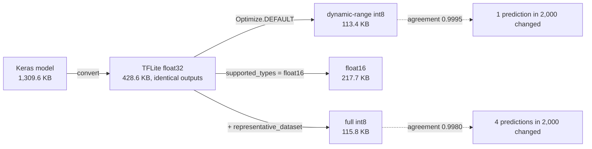

import DataCampExercise from "../../../../components/DataCampExercise.astro";
import Figure from "../../../../components/Figure.astro";
import Quiz from "../../../../components/Quiz.astro";

A trained Keras model is a training artefact. It carries the optimiser state, the full graph, and
float32 weights, and it runs through a framework designed to process large batches efficiently.
A phone needs the opposite of all of that: one sample at a time, minimal memory, no framework.

**TensorFlow Lite** converts between the two, and every claim it makes is checkable. Here is the
same MNIST convnet — 108,618 parameters, 0.9650 validation accuracy — through four conversions,
scored on 2,000 held-out digits:

| Conversion | Size | Shrink | Accuracy | Agreement with float | ms/sample |
| --- | --- | --- | --- | --- | --- |
| Keras (`.keras`) | 1,309.6 KB | 1.00× | 0.9665 | 1.0000 | **1.627** |
| TFLite float32 | 428.6 KB | 3.06× | 0.9665 | 1.0000 | 0.033 |
| **Dynamic-range int8** | **113.4 KB** | **11.54×** | 0.9670 | 0.9995 | **0.021** |
| Float16 weights | 217.7 KB | 6.01× | 0.9665 | 1.0000 | 0.033 |
| Full int8 | 115.8 KB | 11.31× | 0.9670 | 0.9980 | 0.031 |

Two numbers in that table are worth more than the rest. Conversion **alone** — with no
quantisation at all — already shrank the model 3.06×. And single-sample latency dropped from
1.627 ms to 0.021 ms, a **77× speed-up**, before any weights were touched.

## What you'll learn

- What the converter strips out, and why that accounts for the first 3× on its own.
- The three quantisation modes, what each costs in accuracy, and which needs calibration data.
- Why **agreement** is a stricter check than accuracy, and what it caught here.
- Why the accuracy differences in that table should be read as noise, not as improvements.

## Conversion, before any quantisation

```python title="The whole conversion"
converter = tf.lite.TFLiteConverter.from_keras_model(model)
blob = converter.convert()                     # bytes, ready to ship

open("model.tflite", "wb").write(blob)
```

That produced a 428.6 KB file from a 1,309.6 KB Keras one with **identical predictions on all
2,000 test samples** — agreement 1.0000. Nothing was approximated. The saving is everything a
deployed model does not need: optimiser slots, training-only graph nodes, Python metadata, and
the layer configuration needed to reconstruct the model for further training.

The latency result is the more surprising one. Keras took 1.627 ms per sample with `batch_size=1`;
the TFLite interpreter took 0.033 ms. That gap is not the model getting faster — it is
per-call framework overhead disappearing. Keras is built to amortise that cost across a batch, and
at batch size 1 there is nothing to amortise. On a device serving one user's photo at a time, that
overhead **is** the inference cost.



## The three quantisation modes

<Figure
  src="/images/dl/phase-08-scaling/tflite/size-and-accuracy"
  alt="Two panels of horizontal bars for five model variants. Left: size in kilobytes, from 1309.6 for Keras down to 113.4 for dynamic-range int8, each annotated with its shrink factor. Right: accuracy on 2,000 held-out digits, all between 0.9665 and 0.9670, with a dashed reference line at the Keras baseline."
  title="One trained model, four conversions"
  caption="The right-hand panel is almost a flat line, which is the result: an 11.54x size reduction cost 0.0000 to 0.0005 of accuracy. The differences between the bars are one or two predictions out of 2,000 and should not be read as one conversion being more accurate than another — the two quantised models both scored +0.0005, which is a single extra correct answer."
/>

**Dynamic-range quantisation** stores weights as int8 and dequantises them at run time; activations
stay float. One line, no data required, 11.54× smaller. It is the default recommendation and the
measurements support that.

**Float16** halves the weights rather than quartering them — 217.7 KB, 6.01× — and here changed
nothing at all (agreement 1.0000). Its purpose is GPU deployment, where float16 is natively fast;
on CPU it is strictly worse than int8 for size with no compensating speed.

**Full int8** quantises activations too, which requires knowing their range. That is what the
representative dataset provides:

```python title="Full int8 needs calibration data"
def representative():
    for row in x_train[:200]:                  # a few hundred real samples
        yield [row[None, ...].astype("float32")]

converter.optimizations = [tf.lite.Optimize.DEFAULT]
converter.representative_dataset = representative
converter.target_spec.supported_ops = [tf.lite.OpsSet.TFLITE_BUILTINS_INT8]
converter.inference_input_type = tf.int8       # the model now takes int8 IN
converter.inference_output_type = tf.int8
```

Note that full int8 came out **larger** than dynamic-range (115.8 KB against 113.4 KB), which
looks backwards. It is not: quantising activations means storing a scale and zero-point for every
intermediate tensor, and those parameters cost more than the extra weight compression saves on a
model this small. Its purpose is integer-only accelerators that cannot execute float operations
at all — not size.

That last mode also changes the calling convention, which is easy to miss:

```python title="An int8 model does not accept your float array"
scale, zero_point = input_detail["quantization"]
row = np.round(image / scale + zero_point).astype(np.int8)
...
out_scale, out_zero = output_detail["quantization"]
result = (raw_output.astype("float32") - out_zero) * out_scale
```

Feed a float array to an int8 model and it will not error — it will reinterpret your data and
return confident nonsense.

## Latency

<Figure
  src="/images/dl/phase-08-scaling/tflite/latency"
  alt="Left: horizontal bars of milliseconds per sample, with Keras at 1.627 far above the four TFLite variants between 0.021 and 0.033. Right: a scatter of accuracy against size on a log axis, showing all five variants at essentially the same accuracy across a 12x range of sizes."
  title="300 samples, batch of 1, through the TFLite interpreter"
  caption="Every TFLite variant is between 49x and 77x faster than Keras at batch size 1, and the differences among them are small — 0.021 ms for dynamic-range against 0.033 ms for float32. The right-hand panel is the summary of the whole page: a flat accuracy line across a 12x span of model sizes, which is why quantisation is close to free on a task like this."
/>

Dynamic-range int8 was fastest at 0.021 ms, but treat the ordering within TFLite cautiously —
these are sub-millisecond measurements on a busy CPU, and the honest claim is that all four are
roughly 50–77× faster than Keras at batch size 1, not that one is reliably 1.6× faster than
another.

## Agreement is stricter than accuracy

<Figure
  src="/images/dl/phase-08-scaling/tflite/disagreement"
  alt="Left: bars showing the share of predictions that changed relative to the float model — 0.0005 for dynamic-range int8, 0.0000 for float16, and 0.0020 for full int8, annotated with the raw counts out of 2,000. Right: overlapping density histograms of the float model's own confidence, for samples whose prediction changed against those that did not, with the changed ones concentrated at much lower confidence."
  title="Compared against the float model's predictions, not against the labels"
  caption="Full int8 changed 4 predictions out of 2,000 while its accuracy went UP by 0.0005 — some of the changes were corrections. Accuracy alone cannot see that; agreement can. The right-hand panel shows where the changes happen: on samples the float model was already unsure about, which is exactly what a small perturbation to the weights should affect."
/>

This distinction matters in practice. A conversion that keeps accuracy at 0.9665 while changing
which 3.35% it gets wrong is a different model, and if anything downstream depends on specific
predictions — a cached result, a regression test, a user-visible label — accuracy will not warn
you. Comparing against the float model's own outputs will.

The confidence histogram explains the mechanism: the samples whose prediction flipped are drawn
from the low-confidence tail. Quantisation perturbs the logits slightly, and only decisions that
were nearly ties can flip.

```p5 title="Rounding a weight to int8" desc="Drag the weight and the number of bits. The grid shows the available levels and the readout gives the rounding error, which is what quantisation actually costs." height="360"
let weight = 0.37;
let bits = 8;
function setup() {
  createCanvas(620, 360);
  textFont("monospace");
}
function draw() {
  background(13, 17, 23);
  const levels = Math.pow(2, bits);
  const low = -1.0;
  const high = 1.0;
  const scale = (high - low) / (levels - 1);
  const code = Math.round((weight - low) / scale);
  const recovered = low + code * scale;
  const error = recovered - weight;
  noStroke();
  fill(230);
  textSize(12);
  textAlign(LEFT, TOP);
  text("quantising one weight to " + bits + " bits", 30, 20);
  fill(150);
  textSize(10.5);
  text(levels + " levels across [-1, 1], step " + scale.toFixed(6), 30, 42);
  const left = 50;
  const right = 570;
  const axis = 170;
  stroke(60, 70, 84);
  line(left, axis, right, axis);
  const shown = Math.min(levels, 129);
  for (let i = 0; i < shown; i++) {
    const value = low + (i / (shown - 1)) * (high - low);
    const x = left + ((value - low) / (high - low)) * (right - left);
    stroke(60, 70, 84);
    line(x, axis - 6, x, axis + 6);
  }
  const weightX = left + ((weight - low) / (high - low)) * (right - left);
  const recoveredX = left + ((recovered - low) / (high - low)) * (right - left);
  strokeWeight(2);
  stroke(107, 169, 221);
  line(weightX, axis - 40, weightX, axis + 6);
  stroke(255, 211, 67);
  line(recoveredX, axis - 24, recoveredX, axis + 24);
  strokeWeight(1);
  noStroke();
  fill(107, 169, 221);
  textSize(10);
  textAlign(CENTER, BOTTOM);
  text("weight " + weight.toFixed(5), weightX, axis - 44);
  fill(255, 211, 67);
  textAlign(CENTER, TOP);
  text("stored " + recovered.toFixed(5), recoveredX, axis + 28);
  textAlign(LEFT, TOP);
  fill(255, 211, 67);
  textSize(12.5);
  text("int" + bits + " code " + (code - levels / 2), 30, 220);
  fill(224, 108, 117);
  text("rounding error " + error.toFixed(6), 250, 220);
  fill(150);
  textSize(10);
  text("worst possible error at this width: " + (scale / 2).toFixed(6), 30, 244);
  text("8 bits gave 11.54x smaller with 1 changed prediction in 2,000", 30, 262);
  const sliders = [["weight", (weight + 1) / 2, 306],
    ["bits " + bits, (bits - 2) / 14, 336]];
  for (const entry of sliders) {
    fill(150);
    textSize(9.5);
    text(entry[0], 30, entry[2] - 12);
    fill(60, 70, 84);
    rect(140, entry[2], 300, 4, 2);
    fill(255, 211, 67);
    circle(140 + entry[1] * 300, entry[2] + 2, 12);
  }
}
function mousePressed() { mouseDragged(); }
function mouseDragged() {
  if (mouseX < 130) { return; }
  const fraction = Math.min(Math.max((mouseX - 140) / 300, 0), 1);
  if (Math.abs(mouseY - 308) < 14) { weight = fraction * 2 - 1; }
  else if (Math.abs(mouseY - 338) < 14) { bits = Math.round(2 + fraction * 14); }
}
```

```p5 title="The measured table, ranked" desc="Click a column to rank every row by it. The bars are that column's values and the highest and lowest are computed from the numbers, not written in." height="280"
let metric = 0;
const COLUMNS = ["Shrink", "Accuracy", "Agreement with float", "ms/sample"];
const ROWS = [
  ["Keras (.keras)", 1, 0.9665, 1, 1.627],
  ["TFLite float32", 3.06, 0.9665, 1, 0.033],
  ["Dynamic-range int8", 11.54, 0.967, 0.9995, 0.021],
  ["Float16 weights", 6.01, 0.9665, 1, 0.033],
  ["Full int8", 11.31, 0.967, 0.998, 0.031]
];
function setup() {
  createCanvas(620, 280);
  textFont("monospace");
}
function fmt(v) {
  if (v === 0) { return "0"; }
  const a = Math.abs(v);
  if (a >= 1000 || a < 0.001) { return v.toExponential(2); }
  if (a >= 100) { return v.toFixed(1); }
  return v.toFixed(4);
}
function draw() {
  background(13, 17, 23);
  noStroke();
  fill(230);
  textSize(12);
  textAlign(LEFT, TOP);
  text("Deploying to Mobile & Edge with Te", 26, 16);
  let x = 26;
  for (let i = 0; i < COLUMNS.length; i++) {
    const w = COLUMNS[i].length * 6.6 + 16;
    if (i === metric) { fill(255, 211, 67); } else { fill(48, 56, 68); }
    rect(x, 40, w, 22, 4);
    if (i === metric) { fill(13, 17, 23); } else { fill(180); }
    textSize(9);
    text(COLUMNS[i], x + 8, 47);
    x += w + 6;
    if (x > 500) { break; }
  }
  const values = ROWS.map((r) => r[metric + 1]);
  const lo = Math.min(...values);
  const hi = Math.max(...values);
  const span = hi - lo === 0 ? 1 : hi - lo;
  const order = ROWS.slice().sort((a, b) => b[metric + 1] - a[metric + 1]);
  for (let i = 0; i < order.length; i++) {
    const y = 78 + i * 26;
    const v = order[i][metric + 1];
    fill(160);
    textSize(9);
    text(order[i][0], 26, y + 5);
    fill(34, 40, 50);
    rect(230, y, 280, 18, 3);
    const frac = (v - lo) / span;
    if (v === hi) { fill(126, 192, 143); }
    else if (v === lo) { fill(224, 108, 117); }
    else { fill(107, 169, 221); }
    rect(230, y, Math.max(frac * 280, 3), 18, 3);
    fill(225);
    textSize(9);
    text(fmt(v), 518, y + 5);
  }
  const top = order[0];
  const bottom = order[order.length - 1];
  fill(150);
  textSize(9);
  const base = 78 + order.length * 26 + 8;
  text("highest " + COLUMNS[metric] + ": " + top[0] + " at " + fmt(top[1]),
       26, base);
  text("lowest  " + COLUMNS[metric] + ": " + bottom[0] + " at "
       + fmt(bottom[1]), 26, base + 14);
  text("bars are scaled within the chosen column - lowest is not zero", 26,
       base + 30);
}
function mousePressed() {
  let x = 26;
  for (let i = 0; i < COLUMNS.length; i++) {
    const w = COLUMNS[i].length * 6.6 + 16;
    if (mouseX > x && mouseX < x + w && mouseY > 40 && mouseY < 62) {
      metric = i;
    }
    x += w + 6;
  }
}
```

## Pitfalls

- **Reading small accuracy differences as improvements.** The quantised models scored +0.0005,
  which is one extra correct answer out of 2,000.
- **Feeding float data to a fully quantised model.** It takes int8 in and returns int8 out; the
  scale and zero-point must be applied by the caller.
- **Skipping the representative dataset for full int8.** Without it the converter has no ranges
  for activations and the result is unusable.
- **Expecting full int8 to be the smallest.** It was larger than dynamic-range here (115.8 KB
  against 113.4 KB), because activation quantisation parameters cost space.
- **Benchmarking the converted model with Keras.** The 77× latency gap is mostly framework
  overhead at batch size 1; measure through the interpreter you will actually deploy.
- **Comparing a `.keras` file with a `.tflite` file and crediting quantisation.** Conversion alone
  accounted for 3.06× of the 11.54×.
- **Assuming float16 helps on CPU.** It is a GPU optimisation; here it was 6.01× smaller against
  int8's 11.54×, with no speed advantage.

## Recap

- Conversion alone shrank the model 3.06× with identical predictions and made single-sample
  inference 49× faster.
- Dynamic-range int8 is one line, needs no data, and gave 11.54× at a cost of one changed
  prediction in 2,000.
- Float16 gives 6.01× and exists for GPU deployment; on CPU int8 dominates it.
- Full int8 needs a representative dataset, changes the input and output dtypes, and targets
  integer-only hardware rather than size — it was slightly *larger* here.
- Agreement with the float model (0.9980–1.0000) catches changes that accuracy hides.
- Predictions that changed were concentrated among samples the float model was already unsure
  about.

## Next

Quantisation shrinks a finished model. The other two compression families change the model
itself, and both can be measured the same way:
[Model Compression: Pruning, Quantisation and Distillation](/deep-learning/phase-08---scaling--deploying-deep-models/model-compression-pruning-quantisation-and-distillation/).

<Quiz
  questions={[
    {
      q: "Converting to TFLite with no quantisation options shrank the model from 1,309.6 KB to 428.6 KB with identical predictions. Where did the 3.06x go?",
      options: [
        "The weights were compressed",
        "Everything a deployed model does not need — optimiser state, training-only graph nodes, and the configuration required to rebuild the model for further training",
        "The model was pruned automatically",
        "Float32 was silently reduced to float16",
      ],
      answer: 1,
      explain: "Agreement with the original was 1.0000 on all 2,000 samples, so nothing numerical was approximated.",
    },
    {
      q: "Keras took 1.627 ms per sample and the TFLite interpreter 0.033 ms for the same float32 computation. Why?",
      options: [
        "TFLite uses a faster matrix library",
        "It is mostly per-call framework overhead, which Keras is designed to amortise across a batch — at batch size 1 there is nothing to amortise, and on a device serving one input at a time that overhead is the inference cost",
        "The TFLite model skips some layers",
        "The measurement did not include model loading",
      ],
      answer: 1,
      explain: "The two produce identical outputs, so the difference cannot be in the arithmetic being performed.",
    },
    {
      q: "Full int8 produced a LARGER file (115.8 KB) than dynamic-range int8 (113.4 KB). Is that a bug?",
      options: [
        "Yes, the converter failed",
        "No — quantising activations as well as weights requires storing a scale and zero-point for every intermediate tensor, and on a small model those parameters outweigh the extra compression",
        "Yes, the representative dataset was too small",
        "No, but only because the model uses convolutions",
      ],
      answer: 1,
      explain: "Full int8 exists for integer-only accelerators that cannot execute float operations, not primarily for size.",
    },
    {
      q: "Why compare a converted model's predictions against the float model's outputs rather than just checking accuracy?",
      options: [
        "Because accuracy is unreliable on small test sets",
        "Because a conversion can hold accuracy constant while changing WHICH samples it gets right — full int8 changed 4 of 2,000 predictions while its accuracy rose slightly, since some changes were corrections",
        "Because agreement is easier to compute",
        "Because the labels may be wrong",
      ],
      answer: 1,
      explain: "Anything downstream that depends on specific predictions — cached results, regression tests — will not be protected by an unchanged accuracy figure.",
    },
    {
      q: "The samples whose predictions changed under quantisation had noticeably lower float-model confidence. Why is that expected?",
      options: [
        "Low-confidence samples are usually mislabelled",
        "Quantisation perturbs the logits slightly, so only decisions that were already near-ties can flip; a confident prediction has too large a margin to be changed by rounding the weights",
        "The interpreter processes uncertain samples differently",
        "Confidence is not comparable between the two models",
      ],
      answer: 1,
      explain: "It also means the risk of quantisation is concentrated exactly where the model was already unreliable.",
    },
  ]}
/>

## 🧪 Try It Yourself

<DataCampExercise
  lang="python"
  hint={`Quantising to int8 maps a float range onto 256 levels. The scale is the range divided by 255, and the zero point is where 0.0 lands.`}
  code={`# Task: Exercise 1 - What int8 quantisation actually does to a number
import numpy as np


def quantise(values, low, high):
    """Map a float range onto the 256 available int8 levels."""
    scale = (high - low) / 255.0
    zero_point = np.round(-low / scale) - 128
    codes = np.clip(np.round(values / scale + zero_point), -128, 127)
    recovered = (codes - zero_point) * ___          # replace ___ with scale
    return codes.astype(int), recovered


WEIGHTS = np.array([-0.85, -0.20, -0.001, 0.0, 0.004, 0.31, 0.79])
codes, recovered = quantise(WEIGHTS, -1.0, 1.0)

print(f"{'original':>10} {'int8 code':>10} {'recovered':>11} {'error':>10}")
for original, code, back in zip(WEIGHTS, codes, recovered):
    print(f"{original:10.4f} {code:10d} {back:11.4f} {back - original:10.4f}")

print(f"\\nlargest error: {np.abs(recovered - WEIGHTS).max():.6f}")
print(f"the step between levels is {(1.0 - -1.0) / 255.0:.6f}, so no value")
print("can be off by more than half of that")`}
  solution={`import numpy as np


def quantise(values, low, high):
    """Map a float range onto the 256 available int8 levels."""
    scale = (high - low) / 255.0
    zero_point = np.round(-low / scale) - 128
    codes = np.clip(np.round(values / scale + zero_point), -128, 127)
    recovered = (codes - zero_point) * scale
    return codes.astype(int), recovered


WEIGHTS = np.array([-0.85, -0.20, -0.001, 0.0, 0.004, 0.31, 0.79])
codes, recovered = quantise(WEIGHTS, -1.0, 1.0)

print(f"{'original':>10} {'int8 code':>10} {'recovered':>11} {'error':>10}")
for original, code, back in zip(WEIGHTS, codes, recovered):
    print(f"{original:10.4f} {code:10d} {back:11.4f} {back - original:10.4f}")

print(f"\\nlargest error: {np.abs(recovered - WEIGHTS).max():.6f}")
print(f"the step between levels is {(1.0 - -1.0) / 255.0:.6f}, so no value")
print("can be off by more than half of that")`}
/>

<DataCampExercise
  lang="python"
  hint={`Work out the bytes per weight for each dtype, then multiply by the parameter count.`}
  code={`# Task: Exercise 2 - Predict the size before you convert
PARAMETERS = 108_618
MEASURED_KB = {
    "TFLite float32": 428.6,
    "float16 weights": 217.7,
    "dynamic-range int8": 113.4,
}
BYTES_PER_WEIGHT = {"TFLite float32": 4, "float16 weights": 2,
                    "dynamic-range int8": ___}     # replace ___ with 1

print(f"{'conversion':22s} {'predicted KB':>13} {'measured KB':>12} "
      f"{'overhead KB':>12}")
for name, measured in MEASURED_KB.items():
    predicted = PARAMETERS * BYTES_PER_WEIGHT[name] / 1024
    print(f"{name:22s} {predicted:13.1f} {measured:12.1f} "
          f"{measured - predicted:12.1f}")

print("\\nthe gap is the graph itself: operator definitions, tensor shapes and")
print("quantisation parameters, which do not shrink with the weights")`}
  solution={`PARAMETERS = 108_618
MEASURED_KB = {
    "TFLite float32": 428.6,
    "float16 weights": 217.7,
    "dynamic-range int8": 113.4,
}
BYTES_PER_WEIGHT = {"TFLite float32": 4, "float16 weights": 2,
                    "dynamic-range int8": 1}

print(f"{'conversion':22s} {'predicted KB':>13} {'measured KB':>12} "
      f"{'overhead KB':>12}")
for name, measured in MEASURED_KB.items():
    predicted = PARAMETERS * BYTES_PER_WEIGHT[name] / 1024
    print(f"{name:22s} {predicted:13.1f} {measured:12.1f} "
          f"{measured - predicted:12.1f}")

print("\\nthe gap is the graph itself: operator definitions, tensor shapes and")
print("quantisation parameters, which do not shrink with the weights")`}
  expectedOutput={`conversion              predicted KB  measured KB  overhead KB
TFLite float32                 424.3        428.6          4.3
float16 weights                212.1        217.7          5.6
dynamic-range int8             106.1        113.4          7.3

the gap is the graph itself: operator definitions, tensor shapes and
quantisation parameters, which do not shrink with the weights`}
/>

<DataCampExercise
  lang="python"
  hint={`Agreement counts how often two models produce the same prediction; accuracy counts how often each is right. Two models can match on accuracy and differ on agreement.`}
  code={`# Task: Exercise 3 - Accuracy hides what agreement shows
import numpy as np

rng = np.random.default_rng(0)
labels = rng.integers(0, 10, 2000)
float_predictions = labels.copy()
float_predictions[rng.choice(2000, 67, replace=False)] = rng.integers(0, 10, 67)

# A conversion that changes 4 predictions: 2 corrections, 2 new mistakes.
quantised = float_predictions.copy()
wrong = np.flatnonzero(float_predictions != labels)[:2]
right = np.flatnonzero(float_predictions == labels)[:2]
quantised[wrong] = labels[wrong]
quantised[right] = (labels[right] + 1) % 10


def accuracy(predictions):
    return float((predictions == labels).mean())


def agreement(a, b):
    return float((a == ___).mean())                 # replace ___ with b


print(f"float accuracy:     {accuracy(float_predictions):.4f}")
print(f"quantised accuracy: {accuracy(quantised):.4f}")
print(f"difference:         {accuracy(quantised) - accuracy(float_predictions):+.4f}")
print(f"agreement:          {agreement(float_predictions, quantised):.4f}")
print(f"predictions changed: {int((float_predictions != quantised).sum())}")
print("\\naccuracy is unchanged and four predictions are different - only")
print("agreement notices")`}
  solution={`import numpy as np

rng = np.random.default_rng(0)
labels = rng.integers(0, 10, 2000)
float_predictions = labels.copy()
float_predictions[rng.choice(2000, 67, replace=False)] = rng.integers(0, 10, 67)

# A conversion that changes 4 predictions: 2 corrections, 2 new mistakes.
quantised = float_predictions.copy()
wrong = np.flatnonzero(float_predictions != labels)[:2]
right = np.flatnonzero(float_predictions == labels)[:2]
quantised[wrong] = labels[wrong]
quantised[right] = (labels[right] + 1) % 10


def accuracy(predictions):
    return float((predictions == labels).mean())


def agreement(a, b):
    return float((a == b).mean())


print(f"float accuracy:     {accuracy(float_predictions):.4f}")
print(f"quantised accuracy: {accuracy(quantised):.4f}")
print(f"difference:         {accuracy(quantised) - accuracy(float_predictions):+.4f}")
print(f"agreement:          {agreement(float_predictions, quantised):.4f}")
print(f"predictions changed: {int((float_predictions != quantised).sum())}")
print("\\naccuracy is unchanged and four predictions are different - only")
print("agreement notices")`}
/>

<DataCampExercise
  lang="python"
  hint={`Only decisions whose top two logits are closer than the perturbation can flip. Compare the margin against the noise.`}
  code={`# Task: Exercise 4 - Which predictions can quantisation flip?
import numpy as np

rng = np.random.default_rng(0)
logits = rng.normal(0, 2.0, (5000, 10))
NOISE = 0.05                       # the scale of quantisation error on logits


def margin(rows):
    """Gap between the best and second-best logit, per row."""
    ordered = np.sort(rows, axis=1)
    return ordered[:, -1] - ordered[:, ___]         # replace ___ with -2


gaps = margin(logits)
perturbed = logits + rng.normal(0, NOISE, logits.shape)
flipped = perturbed.argmax(axis=1) != logits.argmax(axis=1)

print(f"predictions flipped: {flipped.sum()} of {len(logits)} "
      f"({flipped.mean():.4f})")
print(f"mean margin, flipped:     {gaps[flipped].mean():.4f}")
print(f"mean margin, not flipped: {gaps[~flipped].mean():.4f}")
print(f"largest margin that flipped: {gaps[flipped].max():.4f}")
print(f"\\nnothing with a margin above about {4 * NOISE:.2f} can flip - which is")
print("why quantisation only endangers predictions that were already close")`}
  solution={`import numpy as np

rng = np.random.default_rng(0)
logits = rng.normal(0, 2.0, (5000, 10))
NOISE = 0.05                       # the scale of quantisation error on logits


def margin(rows):
    """Gap between the best and second-best logit, per row."""
    ordered = np.sort(rows, axis=1)
    return ordered[:, -1] - ordered[:, -2]


gaps = margin(logits)
perturbed = logits + rng.normal(0, NOISE, logits.shape)
flipped = perturbed.argmax(axis=1) != logits.argmax(axis=1)

print(f"predictions flipped: {flipped.sum()} of {len(logits)} "
      f"({flipped.mean():.4f})")
print(f"mean margin, flipped:     {gaps[flipped].mean():.4f}")
print(f"mean margin, not flipped: {gaps[~flipped].mean():.4f}")
print(f"largest margin that flipped: {gaps[flipped].max():.4f}")
print(f"\\nnothing with a margin above about {4 * NOISE:.2f} can flip - which is")
print("why quantisation only endangers predictions that were already close")`}
/>

<DataCampExercise
  lang="python"
  hint={`Convert with tf.lite.TFLiteConverter.from_keras_model, then compare len(blob) with and without Optimize.DEFAULT.`}
  code={`# Task: Exercise 5 - Convert and quantise a real model
import numpy as np
import tensorflow as tf
from tensorflow import keras

keras.utils.set_random_seed(0)
(x_train, y_train), (x_test, y_test) = keras.datasets.mnist.load_data()
x_train = (x_train[:8000, ..., None] / 255.0).astype("float32")
x_test = (x_test[:1000, ..., None] / 255.0).astype("float32")

model = keras.Sequential([
    keras.layers.Input((28, 28, 1)),
    keras.layers.Conv2D(16, 3, activation="relu"),
    keras.layers.MaxPooling2D(),
    keras.layers.Flatten(),
    keras.layers.Dense(128, activation="relu"),
    keras.layers.Dense(10, activation="softmax"),
])
model.compile(keras.optimizers.Adam(1e-3), "sparse_categorical_crossentropy",
              metrics=["accuracy"])
model.fit(x_train, y_train[:8000], epochs=3, batch_size=128, verbose=0)

plain = tf.lite.TFLiteConverter.from_keras_model(model).convert()

quantiser = tf.lite.TFLiteConverter.from_keras_model(model)
quantiser.optimizations = [tf.lite.Optimize.___]     # replace ___ with DEFAULT
quantised = quantiser.convert()


def score(blob):
    interpreter = tf.lite.Interpreter(model_content=blob)
    interpreter.allocate_tensors()
    inp = interpreter.get_input_details()[0]
    out = interpreter.get_output_details()[0]
    correct = 0
    for image, label in zip(x_test, y_test[:1000]):
        interpreter.set_tensor(inp["index"], image[None, ...])
        interpreter.invoke()
        correct += int(np.argmax(interpreter.get_tensor(out["index"])[0]) == label)
    return correct / len(x_test)


print(f"float32:   {len(plain) / 1024:8.1f} KB   accuracy {score(plain):.4f}")
print(f"quantised: {len(quantised) / 1024:8.1f} KB   accuracy {score(quantised):.4f}")
print(f"shrink:    {len(plain) / len(quantised):.2f}x")`}
  solution={`import numpy as np
import tensorflow as tf
from tensorflow import keras

keras.utils.set_random_seed(0)
(x_train, y_train), (x_test, y_test) = keras.datasets.mnist.load_data()
x_train = (x_train[:8000, ..., None] / 255.0).astype("float32")
x_test = (x_test[:1000, ..., None] / 255.0).astype("float32")

model = keras.Sequential([
    keras.layers.Input((28, 28, 1)),
    keras.layers.Conv2D(16, 3, activation="relu"),
    keras.layers.MaxPooling2D(),
    keras.layers.Flatten(),
    keras.layers.Dense(128, activation="relu"),
    keras.layers.Dense(10, activation="softmax"),
])
model.compile(keras.optimizers.Adam(1e-3), "sparse_categorical_crossentropy",
              metrics=["accuracy"])
model.fit(x_train, y_train[:8000], epochs=3, batch_size=128, verbose=0)

plain = tf.lite.TFLiteConverter.from_keras_model(model).convert()

quantiser = tf.lite.TFLiteConverter.from_keras_model(model)
quantiser.optimizations = [tf.lite.Optimize.DEFAULT]
quantised = quantiser.convert()


def score(blob):
    interpreter = tf.lite.Interpreter(model_content=blob)
    interpreter.allocate_tensors()
    inp = interpreter.get_input_details()[0]
    out = interpreter.get_output_details()[0]
    correct = 0
    for image, label in zip(x_test, y_test[:1000]):
        interpreter.set_tensor(inp["index"], image[None, ...])
        interpreter.invoke()
        correct += int(np.argmax(interpreter.get_tensor(out["index"])[0]) == label)
    return correct / len(x_test)


print(f"float32:   {len(plain) / 1024:8.1f} KB   accuracy {score(plain):.4f}")
print(f"quantised: {len(quantised) / 1024:8.1f} KB   accuracy {score(quantised):.4f}")
print(f"shrink:    {len(plain) / len(quantised):.2f}x")`}
/>

<DataCampExercise
  lang="python"
  hint={`Apply the input scale and zero point before calling the interpreter, and reverse them on the output.`}
  code={`# Task: Exercise 6 - Talking to a fully quantised model
import numpy as np

# The quantisation parameters a real int8 TFLite model reports.
INPUT_SCALE, INPUT_ZERO = 0.00392157, -128
OUTPUT_SCALE, OUTPUT_ZERO = 0.00390625, -128

image = np.array([0.0, 0.25, 0.5, 0.75, 1.0], dtype="float32")


def to_int8(values, scale, zero_point):
    """What the caller must do before handing data to an int8 model."""
    return np.clip(np.round(values / scale + zero_point), -128, 127).astype(np.int8)


def from_int8(codes, scale, zero_point):
    """And what it must do to the output."""
    return (codes.astype("float32") - zero_point) * ___   # replace with scale


encoded = to_int8(image, INPUT_SCALE, INPUT_ZERO)
print(f"float in:  {image}")
print(f"int8 in:   {encoded}")
print(f"recovered: {from_int8(encoded, INPUT_SCALE, INPUT_ZERO)}")

raw_output = np.array([-128, -100, 90, 127, -20], dtype=np.int8)
probabilities = from_int8(raw_output, OUTPUT_SCALE, OUTPUT_ZERO)
print(f"\\nint8 out:  {raw_output}")
print(f"as floats: {np.round(probabilities, 4)}")
print(f"sums to:   {probabilities.sum():.4f}")
print("\\nhanding the float array straight to an int8 model does not raise -")
print("it silently reinterprets the bytes and returns confident nonsense")`}
  solution={`import numpy as np

# The quantisation parameters a real int8 TFLite model reports.
INPUT_SCALE, INPUT_ZERO = 0.00392157, -128
OUTPUT_SCALE, OUTPUT_ZERO = 0.00390625, -128

image = np.array([0.0, 0.25, 0.5, 0.75, 1.0], dtype="float32")


def to_int8(values, scale, zero_point):
    """What the caller must do before handing data to an int8 model."""
    return np.clip(np.round(values / scale + zero_point), -128, 127).astype(np.int8)


def from_int8(codes, scale, zero_point):
    """And what it must do to the output."""
    return (codes.astype("float32") - zero_point) * scale


encoded = to_int8(image, INPUT_SCALE, INPUT_ZERO)
print(f"float in:  {image}")
print(f"int8 in:   {encoded}")
print(f"recovered: {from_int8(encoded, INPUT_SCALE, INPUT_ZERO)}")

raw_output = np.array([-128, -100, 90, 127, -20], dtype=np.int8)
probabilities = from_int8(raw_output, OUTPUT_SCALE, OUTPUT_ZERO)
print(f"\\nint8 out:  {raw_output}")
print(f"as floats: {np.round(probabilities, 4)}")
print(f"sums to:   {probabilities.sum():.4f}")
print("\\nhanding the float array straight to an int8 model does not raise -")
print("it silently reinterprets the bytes and returns confident nonsense")`}
/>
