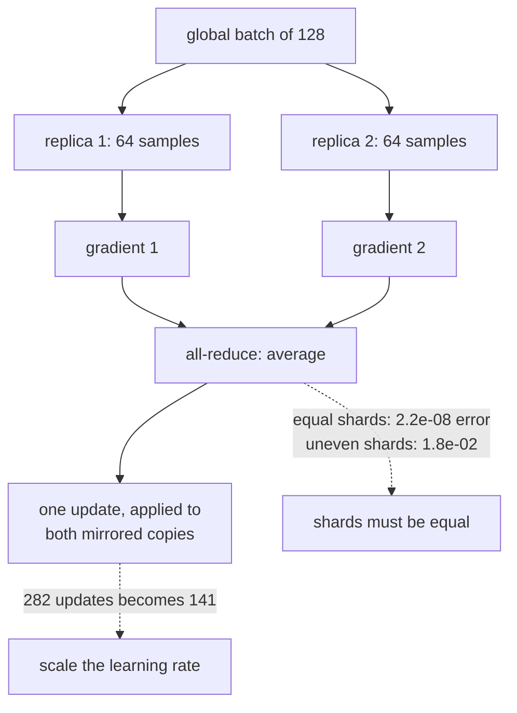

Data parallelism is a three-line change: wrap the model construction in a strategy scope and keep
everything else the same. What that change does to your **batch size**, your **number of updates**
and therefore your **effective learning rate** is where the difficulty lives, and none of it
requires a GPU to demonstrate.

:::note[No accelerators on this machine]
There is no GPU here, so a speed-up cannot be shown and this page does not claim one. The CPU is
split into two logical devices so `MirroredStrategy` has something to mirror onto — the variable
mirroring, the batch splitting and the gradient all-reduce are all real, but the parallelism is
not, because the same cores do all the work. Everything measured below is about **semantics and
overhead**, which is exactly the part that transfers to real hardware.

A four-replica strategy over virtual CPU devices raised an `InternalError` from the collective
ops and left the process unusable for later measurements, so these runs use two.
:::

## What a strategy does to your batch

```python title="The three-line change"
strategy = tf.distribute.MirroredStrategy()

with strategy.scope():
    model = build_model()                    # variables created once per replica
    model.compile(optimizer, loss, metrics=["accuracy"])

model.fit(x, y, batch_size=64 * strategy.num_replicas_in_sync)
```

That last line is the part people miss. The `batch_size` you pass is the **global** batch: it is
split across replicas, so each one sees `batch_size / num_replicas`.

| Replicas | Global batch | Per replica | Gradient updates | Accuracy |
| --- | --- | --- | --- | --- |
| 1 | 64 | 64 | **282** | 0.8813 |
| 2 | 128 | 64 | **141** | 0.8840 |
| 2 (batch **not** scaled) | 64 | 32 | 282 | 0.8813 |

Scaling the batch with the replica count keeps each device as busy as it was — but it **halves
the number of gradient updates** for the same data. Two replicas processing 128 samples at a time
take half as many steps through the epoch as one replica processing 64.

<Figure
  src="/images/dl/phase-08-scaling/distribution/batch-semantics"
  alt="Left: paired bars of gradient updates over three epochs for one and two replicas, under a scaled global batch (282 then 141) and a fixed one (282 for both). Right: accuracy against replica count for both conventions, with all four points between 0.8813 and 0.8840."
  title="Same data, same epochs, different batching conventions"
  caption="Halving the updates is the real cost of scaling out, and it is invisible in the accuracy column here only because three epochs on MNIST is a forgiving test — 0.8840 against 0.8813. On a job where the update count is what limits convergence, this is the difference between finishing and not, and it is why the learning rate is conventionally scaled alongside the batch."
/>

The standard remedy is the **linear scaling rule**: multiply the learning rate by the number of
replicas, so that a step over a batch of 128 moves as far as two steps over batches of 64 would
have. It is a heuristic, it needs a warm-up at large replica counts, and it stops working well
past a few thousand samples per batch — but it is the right default.

## The scaffolding is not free

<Figure
  src="/images/dl/phase-08-scaling/distribution/strategy-overhead"
  alt="Left: horizontal bars of milliseconds per step — 2.90 with no strategy, 4.36 with MirroredStrategy at one replica, 6.13 at two. Right: seconds for three epochs against replica count, showing a flat measured line against a dashed line for what N accelerators would ideally give."
  title="Identical model, identical batch of 64"
  caption="One replica is 1.50x slower than no strategy at all, and it parallelises nothing — that is pure scaffolding: variable placement, mirrored reads, and an all-reduce that has exactly one participant. Two replicas cost 2.11x. On real accelerators these costs are repaid many times over; the point of measuring them here is that they exist and are not proportional to the work being distributed."
/>

| Configuration | ms/step | Relative |
| --- | --- | --- |
| No strategy | **2.90** | 1.00× |
| `MirroredStrategy` ×1 | 4.36 | 1.50× |
| `MirroredStrategy` ×2 | 6.13 | 2.11× |

The one-replica row is the informative one. It does no distribution at all and still costs 50%
more per step, because the strategy still places variables, still routes reads through mirrored
copies, and still runs the all-reduce machinery over a single participant.

This is why distributing a small model is often slower than not distributing it, on any hardware:
below some model size the per-step coordination outweighs what the extra devices contribute.



## Is the averaged gradient the real gradient?

Data parallelism rests on a claim that is easy to state and easy to check: **the mean of the
per-replica gradients equals the gradient of the whole batch**. It is true, and only when the
shards are the same size.

<Figure
  src="/images/dl/phase-08-scaling/distribution/gradient-equivalence"
  alt="A bar chart on a log scale of the largest disagreement with the whole-batch gradient. Two, four and eight equal shards all sit near 2e-08, while two unequal shards sit at 1.8e-02, six orders of magnitude higher."
  title="256 samples, sharded and averaged against one whole-batch gradient"
  caption="Equal shards agree to 2.235e-08 on weights whose largest component is about 0.089 — a relative error of 2.5e-07, which is float32 rounding and nothing more. Two unequal shards of 200 and 56 samples disagree by 1.812e-02, a relative error of 20%, because averaging two per-shard means weights the 56-sample shard as heavily as the 200-sample one."
/>

| Sharding | Max difference | Relative |
| --- | --- | --- |
| 2 equal shards | 2.235e-08 | 2.505e-07 |
| 4 equal shards | 2.235e-08 | 2.505e-07 |
| 8 equal shards | 1.490e-08 | 1.670e-07 |
| **2 unequal shards** | **1.812e-02** | **2.031e-01** |

This is the same bug as the per-batch metric averaging on the
[custom training loops page](/deep-learning/phase-08---scaling--deploying-deep-models/custom-models-and-training-loops-tensorflow/),
wearing different clothes. Averaging means-of-means is only correct when the groups are equal, and
in a distributed job the group that is different is usually the **last batch of the epoch**.

`tf.distribute` handles this for you — it drops or pads the remainder rather than averaging
unequal shards — but a hand-written distributed loop must do so explicitly, and a custom loss that
reduces with `tf.reduce_mean` inside a replica context has exactly this problem. The correct
pattern sums the per-example losses and divides by the **global** batch size:

```python title="Reducing a loss correctly under a strategy"
per_example = keras.losses.sparse_categorical_crossentropy(labels, logits)
loss = tf.nn.compute_average_loss(per_example, global_batch_size=GLOBAL_BATCH)
```

## Which strategy to reach for

- **`MirroredStrategy`** — several devices on one machine. Variables are mirrored, gradients
  all-reduced. This is the one measured above and the one most people need.
- **`MultiWorkerMirroredStrategy`** — the same idea across machines, coordinated by a
  `TF_CONFIG` environment variable. The failure modes become network failure modes.
- **`ParameterServerStrategy`** — asynchronous, with variables held on dedicated servers. Scales
  to many workers and gives up gradient synchrony to do it.
- **`TPUStrategy`** — for TPUs, where the batch must be divisible by the number of cores.

All four share the interface used above, which is the genuine achievement of the API: the training
code does not change, only the scope it is built inside.

```p5 title="Replicas, batches and updates" desc="Drag the replica count and choose whether the global batch scales with it. The readout shows what happens to the per-replica batch and the number of gradient updates." height="360"
let replicas = 2;
let scaleBatch = true;
const SAMPLES = 6000;
const EPOCHS = 3;
const PER_REPLICA = 64;
function setup() {
  createCanvas(620, 360);
  textFont("monospace");
}
function draw() {
  background(13, 17, 23);
  const globalBatch = scaleBatch ? PER_REPLICA * replicas : PER_REPLICA;
  const perReplica = Math.floor(globalBatch / replicas);
  const updates = Math.ceil(SAMPLES / globalBatch) * EPOCHS;
  const baseline = Math.ceil(SAMPLES / PER_REPLICA) * EPOCHS;
  noStroke();
  fill(230);
  textSize(12);
  textAlign(LEFT, TOP);
  text(replicas + " replica" + (replicas > 1 ? "s" : "") + ", global batch "
    + (scaleBatch ? "scaled" : "fixed"), 30, 20);
  const boxWidth = Math.min(90, 460 / replicas);
  for (let i = 0; i < replicas; i++) {
    const x = 40 + i * (boxWidth + 8);
    fill(107, 169, 221);
    rect(x, 80, boxWidth, 54, 4);
    fill(15);
    textSize(10);
    textAlign(CENTER, CENTER);
    text(perReplica, x + boxWidth / 2, 100);
    textSize(8.5);
    text("samples", x + boxWidth / 2, 116);
    textAlign(LEFT, TOP);
  }
  fill(150);
  textSize(10);
  text("global batch " + globalBatch + " = " + replicas + " x " + perReplica,
    40, 146);
  fill(255, 211, 67);
  textSize(13);
  text("gradient updates: " + updates, 40, 182);
  fill(150);
  textSize(10.5);
  text("one replica would give " + baseline
    + "  (" + (baseline / updates).toFixed(1) + "x more)", 40, 204);
  if (scaleBatch && replicas > 1) {
    fill(224, 108, 117);
    textSize(10.5);
    text("scale the learning rate by " + replicas
      + "x, or each epoch travels less far", 40, 226);
  } else if (!scaleBatch && replicas > 1) {
    fill(126, 192, 143);
    textSize(10.5);
    text("update count preserved, but each replica only sees "
      + perReplica + " samples", 40, 226);
  }
  fill(150);
  textSize(9.5);
  text("measured: 282 updates at 1 replica, 141 at 2 with the batch scaled",
    40, 252);
  fill(scaleBatch ? color(255, 211, 67) : color(60, 70, 84));
  rect(40, 288, 150, 26, 4);
  fill(scaleBatch ? 20 : 200);
  textSize(10);
  textAlign(CENTER, CENTER);
  text("batch scales", 115, 301);
  fill(!scaleBatch ? color(255, 211, 67) : color(60, 70, 84));
  rect(200, 288, 150, 26, 4);
  fill(!scaleBatch ? 20 : 200);
  text("batch fixed", 275, 301);
  textAlign(LEFT, TOP);
  fill(60, 70, 84);
  rect(40, 338, 300, 4, 2);
  fill(255, 211, 67);
  circle(40 + ((replicas - 1) / 7) * 300, 340, 12);
  fill(120);
  textSize(9);
  text("drag: replicas", 360, 332);
}
function mousePressed() {
  if (mouseY > 284 && mouseY < 316) {
    if (mouseX > 40 && mouseX < 190) { scaleBatch = true; }
    else if (mouseX > 200 && mouseX < 350) { scaleBatch = false; }
    return;
  }
  mouseDragged();
}
function mouseDragged() {
  if (mouseY < 326) { return; }
  replicas = Math.round(1 + Math.min(Math.max((mouseX - 40) / 300, 0), 1) * 7);
}
```

```p5 title="The measured table, ranked" desc="Click a column to rank every row by it. The bars are that column's values and the highest and lowest are computed from the numbers, not written in." height="228"
let metric = 0;
const COLUMNS = ["Global batch", "Per replica", "Gradient updates", "Accuracy"];
const ROWS = [
  ["1", 64, 64, 282, 0.8813],
  ["2", 128, 64, 141, 0.884],
  ["2 (batch not scaled)", 64, 32, 282, 0.8813]
];
function setup() {
  createCanvas(620, 228);
  textFont("monospace");
}
function fmt(v) {
  if (v === 0) { return "0"; }
  const a = Math.abs(v);
  if (a >= 1000 || a < 0.001) { return v.toExponential(2); }
  if (a >= 100) { return v.toFixed(1); }
  return v.toFixed(4);
}
function draw() {
  background(13, 17, 23);
  noStroke();
  fill(230);
  textSize(12);
  textAlign(LEFT, TOP);
  text("Distributed Training with tf.distr", 26, 16);
  let x = 26;
  for (let i = 0; i < COLUMNS.length; i++) {
    const w = COLUMNS[i].length * 6.6 + 16;
    if (i === metric) { fill(255, 211, 67); } else { fill(48, 56, 68); }
    rect(x, 40, w, 22, 4);
    if (i === metric) { fill(13, 17, 23); } else { fill(180); }
    textSize(9);
    text(COLUMNS[i], x + 8, 47);
    x += w + 6;
    if (x > 500) { break; }
  }
  const values = ROWS.map((r) => r[metric + 1]);
  const lo = Math.min(...values);
  const hi = Math.max(...values);
  const span = hi - lo === 0 ? 1 : hi - lo;
  const order = ROWS.slice().sort((a, b) => b[metric + 1] - a[metric + 1]);
  for (let i = 0; i < order.length; i++) {
    const y = 78 + i * 26;
    const v = order[i][metric + 1];
    fill(160);
    textSize(9);
    text(order[i][0], 26, y + 5);
    fill(34, 40, 50);
    rect(230, y, 280, 18, 3);
    const frac = (v - lo) / span;
    if (v === hi) { fill(126, 192, 143); }
    else if (v === lo) { fill(224, 108, 117); }
    else { fill(107, 169, 221); }
    rect(230, y, Math.max(frac * 280, 3), 18, 3);
    fill(225);
    textSize(9);
    text(fmt(v), 518, y + 5);
  }
  const top = order[0];
  const bottom = order[order.length - 1];
  fill(150);
  textSize(9);
  const base = 78 + order.length * 26 + 8;
  text("highest " + COLUMNS[metric] + ": " + top[0] + " at " + fmt(top[1]),
       26, base);
  text("lowest  " + COLUMNS[metric] + ": " + bottom[0] + " at "
       + fmt(bottom[1]), 26, base + 14);
  text("bars are scaled within the chosen column - lowest is not zero", 26,
       base + 30);
}
function mousePressed() {
  let x = 26;
  for (let i = 0; i < COLUMNS.length; i++) {
    const w = COLUMNS[i].length * 6.6 + 16;
    if (mouseX > x && mouseX < x + w && mouseY > 40 && mouseY < 62) {
      metric = i;
    }
    x += w + 6;
  }
}
```

## Pitfalls

- **Forgetting the batch is global.** Two replicas at `batch_size=64` give each replica 32
  samples, not 64.
- **Not scaling the learning rate.** Two replicas halved the updates from 282 to 141; the same
  learning rate now travels half as far per epoch.
- **Distributing a small model.** One replica cost 1.50× per step and parallelised nothing.
- **Building the model outside the scope.** Variables must be created inside `strategy.scope()`
  or they are not mirrored.
- **Averaging unequal shards.** 20% relative error here; use `compute_average_loss` with the
  global batch size.
- **Assuming more replicas is always faster.** The coordination cost is per step and does not
  shrink as you add devices.
- **Measuring speed-up on virtual CPU devices.** They share the same cores; only semantics and
  overhead are measurable that way.

## Recap

- The `batch_size` passed to `fit` is the global batch, split across replicas.
- Scaling it with the replica count halved the gradient updates, 282 → 141, which is why the
  learning rate is conventionally scaled too.
- `MirroredStrategy` cost 1.50× per step at one replica and 2.11× at two, before any parallelism.
- Averaging equal shards reproduces the whole-batch gradient to 2.2e-08; unequal shards are wrong
  by 20%.
- Reduce losses with `compute_average_loss(..., global_batch_size=...)` rather than
  `reduce_mean`.
- The four strategies share one interface; the training code does not change, only the scope.

## Next

Training is finished. The remaining question is how anything else reaches the model:
[Serving Models with TensorFlow Serving](/deep-learning/phase-08---scaling--deploying-deep-models/serving-models-with-tensorflow-serving/).

<Quiz
  questions={[
    {
      q: "With two replicas and the global batch scaled to 128, the number of gradient updates fell from 282 to 141. Why does that matter?",
      options: [
        "It does not — the same data is still seen",
        "The same data is seen but the parameters are updated half as often, so at an unchanged learning rate the model travels half as far per epoch — which is why the linear scaling rule exists",
        "Fewer updates always means better generalisation",
        "It only matters if the batch does not divide evenly",
      ],
      answer: 1,
      explain: "Accuracy barely moved here (0.8840 against 0.8813) because three epochs on MNIST is forgiving, but on an update-limited job this is the difference between converging and not.",
    },
    {
      q: "MirroredStrategy with ONE replica cost 1.50x per step against no strategy at all. What is that overhead?",
      options: [
        "A measurement artefact",
        "Real scaffolding — variable placement, reads routed through mirrored copies, and the all-reduce machinery running over a single participant",
        "The cost of the virtual CPU devices",
        "Extra memory allocation for the second replica",
      ],
      answer: 1,
      explain: "It is why distributing a small model can be slower than not distributing it: below some size the per-step coordination outweighs what extra devices contribute.",
    },
    {
      q: "Averaging gradients over equal shards matched the whole-batch gradient to 2.2e-08, but two unequal shards were wrong by 1.8e-02. What causes that?",
      options: [
        "Floating-point error accumulates with uneven sizes",
        "Averaging per-shard means weights each shard equally regardless of how many samples it holds, so a 56-sample shard counts as heavily as a 200-sample one",
        "The gradient tape does not support uneven batches",
        "The smaller shard was not shuffled",
      ],
      answer: 1,
      explain: "It is the same bug as averaging per-batch accuracies, and in a distributed job the odd-sized group is usually the last batch of the epoch.",
    },
    {
      q: "Why must the model be constructed inside strategy.scope()?",
      options: [
        "To make the code easier to read",
        "Because that is where variables get created as mirrored copies — build outside the scope and you have ordinary variables that the strategy cannot keep in sync",
        "Because compile() requires it",
        "To enable the all-reduce optimisation",
      ],
      answer: 1,
      explain: "The training call itself stays unchanged, which is the point of the API: only the construction scope differs.",
    },
    {
      q: "How should a custom loss be reduced inside a replica context?",
      options: [
        "With tf.reduce_mean, as usual",
        "With tf.nn.compute_average_loss and the GLOBAL batch size — reduce_mean divides by the per-replica count, which reintroduces the unequal-shard weighting",
        "By summing without dividing",
        "It does not matter; the strategy corrects it",
      ],
      answer: 1,
      explain: "tf.distribute handles the built-in path by dropping or padding the remainder, but a hand-written reduction has to be explicit about the denominator.",
    },
  ]}
/>

## 🧪 Try It Yourself

<DataCampExercise
  lang="python"
  hint={`Divide the dataset by the global batch size, and remember the global batch is the per-replica batch times the replica count.`}
  expectedOutput={` replicas   batch scaled   batch fixed
        1            282           282
        2            141           282
        4             72           282
        8             36           282

measured on this page: 282 updates at one replica, 141 at two
with the batch scaled - exactly half, as the arithmetic predicts`}
  code={`# Task: Exercise 1 - What the replica count does to your step count
import math

SAMPLES = 6000
EPOCHS = 3
PER_REPLICA = 64


def updates(replicas, scale_batch=True):
    """Gradient updates over the whole run."""
    global_batch = PER_REPLICA * replicas if scale_batch else ___   # PER_REPLICA
    return math.ceil(SAMPLES / global_batch) * EPOCHS


print(f"{'replicas':>9} {'batch scaled':>14} {'batch fixed':>13}")
for replicas in (1, 2, 4, 8):
    print(f"{replicas:9d} {updates(replicas):14d} "
          f"{updates(replicas, False):13d}")

print("\\nmeasured on this page: 282 updates at one replica, 141 at two")
print("with the batch scaled - exactly half, as the arithmetic predicts")`}
  solution={`import math

SAMPLES = 6000
EPOCHS = 3
PER_REPLICA = 64


def updates(replicas, scale_batch=True):
    """Gradient updates over the whole run."""
    global_batch = PER_REPLICA * replicas if scale_batch else PER_REPLICA
    return math.ceil(SAMPLES / global_batch) * EPOCHS


print(f"{'replicas':>9} {'batch scaled':>14} {'batch fixed':>13}")
for replicas in (1, 2, 4, 8):
    print(f"{replicas:9d} {updates(replicas):14d} "
          f"{updates(replicas, False):13d}")

print("\\nmeasured on this page: 282 updates at one replica, 141 at two")
print("with the batch scaled - exactly half, as the arithmetic predicts")`}
  sct={`test_output_contains("141", pattern=False)
test_output_contains("replicas   batch scaled", pattern=False)
success_msg("Scaling the batch with the replica count halves the number of updates for two replicas, exactly as the arithmetic predicts.")`}
  height={400}
/>

<DataCampExercise
  lang="python"
  hint={`Weight each shard's mean by how many samples it holds, then divide by the total.`}
  code={`# Task: Exercise 2 - Averaging shards, correctly and incorrectly
import numpy as np

rng = np.random.default_rng(0)
values = rng.normal(0, 1, 256)                # per-example gradients


def naive(shards):
    """Average the shard means, ignoring their sizes."""
    return float(np.mean([shard.mean() for shard in shards]))


def weighted(shards):
    """Weight each shard mean by its sample count."""
    total = sum(len(shard) for shard in shards)
    return float(sum(shard.sum() for shard in shards) / ___)   # replace with total


truth = float(values.mean())
equal = [values[:128], values[128:]]
uneven = [values[:200], values[200:]]

print(f"whole batch:             {truth:+.8f}")
print(f"equal shards, naive:     {naive(equal):+.8f}  "
      f"error {abs(naive(equal) - truth):.2e}")
print(f"uneven shards, naive:    {naive(uneven):+.8f}  "
      f"error {abs(naive(uneven) - truth):.2e}")
print(f"uneven shards, weighted: {weighted(uneven):+.8f}  "
      f"error {abs(weighted(uneven) - truth):.2e}")
print("\\nequal shards make the naive version correct by accident; the")
print("weighted version is correct either way")`}
  solution={`import numpy as np

rng = np.random.default_rng(0)
values = rng.normal(0, 1, 256)                # per-example gradients


def naive(shards):
    """Average the shard means, ignoring their sizes."""
    return float(np.mean([shard.mean() for shard in shards]))


def weighted(shards):
    """Weight each shard mean by its sample count."""
    total = sum(len(shard) for shard in shards)
    return float(sum(shard.sum() for shard in shards) / total)


truth = float(values.mean())
equal = [values[:128], values[128:]]
uneven = [values[:200], values[200:]]

print(f"whole batch:             {truth:+.8f}")
print(f"equal shards, naive:     {naive(equal):+.8f}  "
      f"error {abs(naive(equal) - truth):.2e}")
print(f"uneven shards, naive:    {naive(uneven):+.8f}  "
      f"error {abs(naive(uneven) - truth):.2e}")
print(f"uneven shards, weighted: {weighted(uneven):+.8f}  "
      f"error {abs(weighted(uneven) - truth):.2e}")
print("\\nequal shards make the naive version correct by accident; the")
print("weighted version is correct either way")`}
  sct={`test_output_contains("uneven shards, weighted: +0.00189366", pattern=False)
test_output_contains("uneven shards, naive:    -0.01529567", pattern=False)
success_msg("Weighting each shard by its sample count is correct for any split; the naive average is only right when the shards are equal.")`}
  height={400}
/>

<DataCampExercise
  lang="python"
  hint={`Total time is the per-step cost times the number of steps. Scaling out cuts the steps but raises the per-step cost.`}
  code={`# Task: Exercise 3 - When does distributing actually pay?
MEASURED_OVERHEAD = {1: 4.36, 2: 6.13}         # ms/step, from this page
NO_STRATEGY = 2.90
STEPS_AT_ONE = 282


def total_seconds(replicas, compute_ms, overhead_ms):
    """Wall-clock when the batch scales with the replica count."""
    steps = STEPS_AT_ONE / replicas
    per_step = compute_ms / ___ + overhead_ms   # replace ___ with replicas
    return steps * per_step / 1000


print("a SMALL model, where compute is 2.90 ms and overhead dominates:")
for replicas in (1, 2):
    seconds = total_seconds(replicas, NO_STRATEGY,
                            MEASURED_OVERHEAD[replicas] - NO_STRATEGY)
    print(f"  {replicas} replica(s): {seconds:.2f}s")

print("\\na LARGE model, where one step costs 200 ms of real computation:")
for replicas in (1, 2):
    seconds = total_seconds(replicas, 200.0,
                            MEASURED_OVERHEAD[replicas] - NO_STRATEGY)
    print(f"  {replicas} replica(s): {seconds:.2f}s")

print("\\nthe overhead is a fixed cost per step; it only disappears into the")
print("noise when the step itself is expensive")`}
  solution={`MEASURED_OVERHEAD = {1: 4.36, 2: 6.13}         # ms/step, from this page
NO_STRATEGY = 2.90
STEPS_AT_ONE = 282


def total_seconds(replicas, compute_ms, overhead_ms):
    """Wall-clock when the batch scales with the replica count."""
    steps = STEPS_AT_ONE / replicas
    per_step = compute_ms / replicas + overhead_ms
    return steps * per_step / 1000


print("a SMALL model, where compute is 2.90 ms and overhead dominates:")
for replicas in (1, 2):
    seconds = total_seconds(replicas, NO_STRATEGY,
                            MEASURED_OVERHEAD[replicas] - NO_STRATEGY)
    print(f"  {replicas} replica(s): {seconds:.2f}s")

print("\\na LARGE model, where one step costs 200 ms of real computation:")
for replicas in (1, 2):
    seconds = total_seconds(replicas, 200.0,
                            MEASURED_OVERHEAD[replicas] - NO_STRATEGY)
    print(f"  {replicas} replica(s): {seconds:.2f}s")

print("\\nthe overhead is a fixed cost per step; it only disappears into the")
print("noise when the step itself is expensive")`}
  sct={`test_output_contains("2 replica(s): 14.56s", pattern=False)
test_output_contains("2 replica(s): 0.66s", pattern=False)
success_msg("The per-step overhead is a fixed cost: it dominates a small model and disappears when the step itself is expensive.")`}
  height={400}
/>

<DataCampExercise
  lang="python"
  hint={`The linear scaling rule multiplies the base learning rate by the replica count, with a warm-up over the first few epochs.`}
  code={`# Task: Exercise 4 - The linear scaling rule
BASE_RATE = 1e-3
WARMUP_EPOCHS = 5


def scaled_rate(replicas, epoch):
    """Linear scaling with a warm-up, as used for large-batch training."""
    target = BASE_RATE * ___                     # replace ___ with replicas
    if epoch >= WARMUP_EPOCHS:
        return target
    # Ramp from the base rate to the target over the warm-up.
    fraction = (epoch + 1) / WARMUP_EPOCHS
    return BASE_RATE + (target - BASE_RATE) * fraction


print(f"{'epoch':>6} " + " ".join(f"{r:>10}" for r in (1, 2, 8, 32)))
for epoch in range(8):
    row = " ".join(f"{scaled_rate(r, epoch):10.5f}" for r in (1, 2, 8, 32))
    print(f"{epoch:6d} {row}")

print("\\nwithout the warm-up, a 32x learning rate on the first step of an")
print("untrained network usually diverges immediately")`}
  solution={`BASE_RATE = 1e-3
WARMUP_EPOCHS = 5


def scaled_rate(replicas, epoch):
    """Linear scaling with a warm-up, as used for large-batch training."""
    target = BASE_RATE * replicas
    if epoch >= WARMUP_EPOCHS:
        return target
    # Ramp from the base rate to the target over the warm-up.
    fraction = (epoch + 1) / WARMUP_EPOCHS
    return BASE_RATE + (target - BASE_RATE) * fraction


print(f"{'epoch':>6} " + " ".join(f"{r:>10}" for r in (1, 2, 8, 32)))
for epoch in range(8):
    row = " ".join(f"{scaled_rate(r, epoch):10.5f}" for r in (1, 2, 8, 32))
    print(f"{epoch:6d} {row}")

print("\\nwithout the warm-up, a 32x learning rate on the first step of an")
print("untrained network usually diverges immediately")`}
  sct={`test_output_contains("0.03200", pattern=False)
test_output_contains("0.00720", pattern=False)
success_msg("Linear scaling multiplies the learning rate by the replica count, and a warm-up ramps to it so the first steps do not diverge.")`}
  height={400}
/>

<DataCampExercise
  lang="python"
  hint={`Split the global batch into one shard per replica, compute each shard's gradient, and average them: the result should equal the gradient of the whole batch.`}
  code={`# Task: Exercise 5 - Run data parallelism yourself
import numpy as np

rng = np.random.default_rng(0)
x = rng.normal(size=(2048, 16))
true_w = rng.normal(size=16)
y = x @ true_w + 0.1 * rng.normal(size=2048)
w = np.zeros(16)


def gradient(xs, ys, weights):
    """Gradient of the mean squared error on one shard."""
    return 2 * xs.T @ (xs @ weights - ys) / len(xs)


full = gradient(x, y, w)                         # the single-device answer
for replicas in (1, 2, 4):
    global_batch = 64 * replicas
    xs = np.array_split(x[:global_batch], ___)   # one shard per replica
    ys = np.array_split(y[:global_batch], replicas)
    shard_grads = [gradient(a, b, w) for a, b in zip(xs, ys)]
    averaged = np.mean(shard_grads, axis=0)      # the all-reduce
    reference = gradient(x[:global_batch], y[:global_batch], w)
    steps = int(np.ceil(len(x) / global_batch))
    print(f"{replicas} replica(s): global batch={global_batch}, per replica={global_batch // replicas}, steps={steps}")
    print("  averaged shard gradients match the single-device gradient:",
          bool(np.allclose(averaged, reference)))`}
  solution={`# Task: Exercise 5 - Run data parallelism yourself
import numpy as np

rng = np.random.default_rng(0)
x = rng.normal(size=(2048, 16))
true_w = rng.normal(size=16)
y = x @ true_w + 0.1 * rng.normal(size=2048)
w = np.zeros(16)


def gradient(xs, ys, weights):
    """Gradient of the mean squared error on one shard."""
    return 2 * xs.T @ (xs @ weights - ys) / len(xs)


full = gradient(x, y, w)                         # the single-device answer
for replicas in (1, 2, 4):
    global_batch = 64 * replicas
    xs = np.array_split(x[:global_batch], replicas)   # one shard per replica
    ys = np.array_split(y[:global_batch], replicas)
    shard_grads = [gradient(a, b, w) for a, b in zip(xs, ys)]
    averaged = np.mean(shard_grads, axis=0)      # the all-reduce
    reference = gradient(x[:global_batch], y[:global_batch], w)
    steps = int(np.ceil(len(x) / global_batch))
    print(f"{replicas} replica(s): global batch={global_batch}, per replica={global_batch // replicas}, steps={steps}")
    print("  averaged shard gradients match the single-device gradient:",
          bool(np.allclose(averaged, reference)))`}
  sct={`test_output_contains("4 replica(s): global batch=256, per replica=64, steps=8", pattern=False)
test_output_contains("averaged shard gradients match the single-device gradient: True", pattern=False)
success_msg("Each replica computes a gradient on its own shard and the average across replicas equals the gradient of the whole batch, so the update is the same.")`}
  height={400}
/>

<DataCampExercise
  lang="python"
  hint={`Sum the per-example losses across all replicas and divide by the global batch size, not the per-replica size.`}
  code={`# Task: Exercise 6 - Reducing a loss under a strategy
import numpy as np

rng = np.random.default_rng(0)
per_example = rng.random(200) * 2.0            # per-sample losses
GLOBAL_BATCH = 200


def replica_mean(shard):
    """What tf.reduce_mean does inside a replica: divides by the LOCAL count."""
    return float(shard.mean())


def compute_average_loss(shard, global_batch_size):
    """What tf.nn.compute_average_loss does: divides by the GLOBAL count."""
    return float(shard.sum() / ___)             # replace ___ with global_batch_size


truth = float(per_example.mean())
equal = [per_example[:100], per_example[100:]]
uneven = [per_example[:150], per_example[150:]]

for name, shards in (("equal shards", equal), ("uneven shards", uneven)):
    naive = float(np.mean([replica_mean(s) for s in shards]))
    correct = float(sum(compute_average_loss(s, GLOBAL_BATCH) for s in shards))
    print(f"{name:15s} reduce_mean {naive:.8f} (error "
          f"{abs(naive - truth):.2e})   compute_average_loss {correct:.8f} "
          f"(error {abs(correct - truth):.2e})")

print(f"\\ntrue mean loss: {truth:.8f}")
print("compute_average_loss is correct for both, which is why it exists")`}
  solution={`import numpy as np

rng = np.random.default_rng(0)
per_example = rng.random(200) * 2.0            # per-sample losses
GLOBAL_BATCH = 200


def replica_mean(shard):
    """What tf.reduce_mean does inside a replica: divides by the LOCAL count."""
    return float(shard.mean())


def compute_average_loss(shard, global_batch_size):
    """What tf.nn.compute_average_loss does: divides by the GLOBAL count."""
    return float(shard.sum() / global_batch_size)


truth = float(per_example.mean())
equal = [per_example[:100], per_example[100:]]
uneven = [per_example[:150], per_example[150:]]

for name, shards in (("equal shards", equal), ("uneven shards", uneven)):
    naive = float(np.mean([replica_mean(s) for s in shards]))
    correct = float(sum(compute_average_loss(s, GLOBAL_BATCH) for s in shards))
    print(f"{name:15s} reduce_mean {naive:.8f} (error "
          f"{abs(naive - truth):.2e})   compute_average_loss {correct:.8f} "
          f"(error {abs(correct - truth):.2e})")

print(f"\\ntrue mean loss: {truth:.8f}")
print("compute_average_loss is correct for both, which is why it exists")`}
  sct={`test_output_contains("compute_average_loss 1.07925934 (error 0.00e+00)", pattern=False)
test_output_contains("true mean loss: 1.07925934", pattern=False)
success_msg("Dividing each shard's summed loss by the global batch size is correct for any split, which is why compute_average_loss exists.")`}
  height={400}
/>
