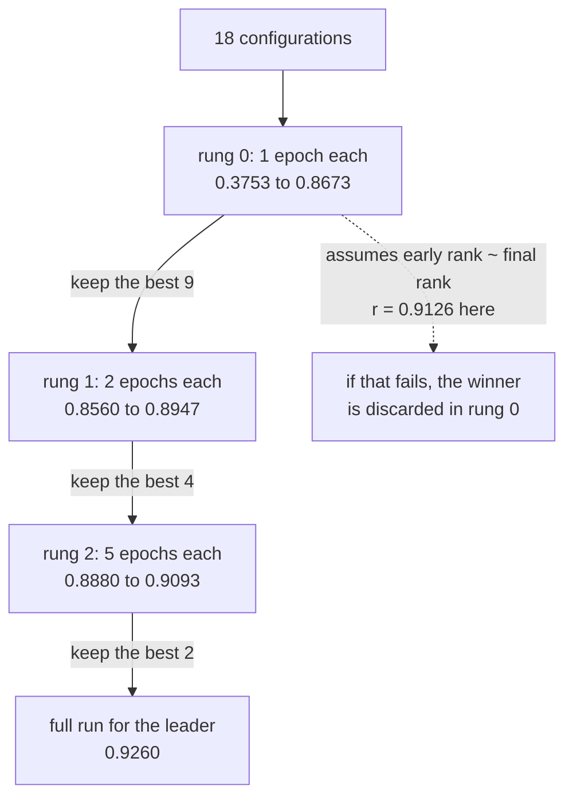

import DataCampExercise from "../../../../components/DataCampExercise.astro";
import Figure from "../../../../components/Figure.astro";
import Quiz from "../../../../components/Quiz.astro";

Hyperparameter search has one honest measurement: **best result found per unit of compute
spent**. Any comparison that lets one strategy train for longer than another is measuring the
budget, not the strategy.

Three strategies over the same 18-configuration space, each given exactly **96 training epochs**:

| Strategy | Best found | Epochs spent | Gap to the exhaustive answer |
| --- | --- | --- | --- |
| Grid | 0.9107 | 96 | +0.0153 |
| Random | 0.9241 ± 0.0023 | 96 | +0.0019 |
| **Successive halving** | **0.9260** | **64** | **+0.0000** |
| *Exhaustive* | *0.9260* | *144* | — |

Successive halving found the **exact** best configuration — units 128, learning rate 3e-3,
dropout 0.3 — using 44% of what an exhaustive search needed, and it stopped early with budget to
spare.

:::note[KerasTuner is not installed here]
This machine has no `keras_tuner` package and nothing may be downloaded, so the two algorithms
KerasTuner implements are written out and measured directly. The library's API is shown below
for reference and is **not** run here; every number on this page comes from the hand-written
versions. That is arguably the better way round — each algorithm is about twenty lines, and the
interesting question was never the API.
:::

## What you'll learn

- Why grid search is the weakest of the three despite sounding the most thorough.
- How successive halving spends its budget, rung by rung.
- The assumption it depends on — measured here at **r = 0.9126** — and what happens when that
  assumption fails.
- Why one hyperparameter dominated this search space, and how to find that out cheaply.

## The three strategies

```python title="Random search, in full"
for _ in range(trials):
    config = {name: rng.choice(values) for name, values in space.items()}
    score = train(**config, epochs=FULL_EPOCHS)
    best = max(best, score)
```

```python title="Successive halving, in full"
survivors = list(space)
for epochs in (1, 2, 5):                     # each rung trains longer
    scored = [(train(**c, epochs=epochs), c) for c in survivors]
    scored.sort(reverse=True, key=lambda pair: pair[0])
    survivors = [c for _, c in scored[:len(scored) // 2]]   # keep the best half
```

The idea behind halving is that a bad configuration usually looks bad quickly. Instead of giving
every candidate a full run, give them all a cheap one, discard the worst half, and reinvest the
saved budget in the survivors.

<Figure
  src="/images/dl/phase-08-scaling/hyperparameter-search/budget"
  alt="Left: best accuracy found against epochs spent, as step functions. Grid rises slowly and plateaus at 0.9107; random reaches 0.9241; successive halving jumps quickly and reaches 0.9260 after 64 epochs. A dashed line marks the exhaustive best at 0.9260. Right: bars of the best found by each strategy with the gap to exhaustive annotated."
  title="18 configurations, 96-epoch budget each, 5 seeds for the randomised strategies"
  caption="Halving's curve is the interesting one: it climbs in steps as each rung promotes its survivors, and it reaches the exhaustive answer with a third of its budget unspent. Grid search is the flat line — it works through the space in a fixed order and simply ran out of budget before reaching the good corner, which is a property of the ordering rather than of the space."
/>

## Why grid search loses

Grid search is exhaustive-in-principle and arbitrary-in-practice. Given a partial budget it
evaluates a *prefix* of the space in whatever order the loops happen to nest — so its result
depends on which hyperparameter you put in the outer loop.

That is why it finished 0.0153 behind. It is not that grid search is a bad algorithm; it is that
"grid search with an insufficient budget" is really "arbitrary subset search", and nobody chooses
the subset deliberately.

Random search avoids exactly that failure. Its 0.9241 ± 0.0023 across five seeds is close to
optimal, and it has no ordering bias to exploit or fall foul of.

## What halving actually does

<Figure
  src="/images/dl/phase-08-scaling/hyperparameter-search/halving"
  alt="Left: three rungs of configurations plotted by rank, with green points surviving to the next rung and red discarded — 18 configurations at 1 epoch, 9 at 2 epochs, 4 at 5 epochs. Right: a scatter of one-epoch accuracy against eight-epoch accuracy for all 18 configurations, clustering along the diagonal, with the eventual winner circled and already ranked first after one epoch."
  title="One run of successive halving, and the assumption underneath it"
  caption="The left panel shows the budget being concentrated: 18 cheap runs, then 9, then 4. The spread within rung 0 is enormous — 0.8673 down to 0.3753 — which is exactly the condition that makes early elimination safe, since the bottom half is obviously hopeless after a single epoch. The right panel is the assumption stated as a measurement: r = 0.9126 between a one-epoch score and an eight-epoch score."
/>

| Rung | Configurations | Epochs each | Best | Worst | Kept |
| --- | --- | --- | --- | --- | --- |
| 0 | 18 | 1 | 0.8673 | **0.3753** | 9 |
| 1 | 9 | 2 | 0.8947 | 0.8560 | 4 |
| 2 | 4 | 5 | 0.9093 | 0.8880 | 2 |

Notice how the *worst* score rises at every rung — 0.3753, then 0.8560, then 0.8880. That is the
method working: each round removes the candidates that were obviously failing, and the survivors
become progressively harder to separate.

### The assumption, and when it breaks

Halving assumes **early performance ranks configurations roughly the way final performance
does**. Here it did: the correlation between a 1-epoch score and an 8-epoch score was
**0.9126**, and the eventual winner was already ranked **#1 of 18** after a single epoch.

That is a property of this search space, not a law. It fails in recognisable situations:

- **A low learning rate that eventually wins.** It looks terrible after one epoch and is
  eliminated before it can demonstrate anything.
- **Heavy regularisation.** Dropout and weight decay cost training accuracy early and pay it back
  late.
- **Warm-up schedules**, which are designed to look bad at the start.

When the assumption fails, halving does not degrade gracefully — it confidently discards the best
option in the first rung and then spends the whole remaining budget on the survivors. The cheap
diagnostic is exactly the right-hand panel above: score the space at both lengths once, and look
at the correlation before trusting the method.



## The search space itself

<Figure
  src="/images/dl/phase-08-scaling/hyperparameter-search/landscape"
  alt="Left: a histogram of the 18 configurations' accuracies, spread from 0.8353 to 0.9260 with a median at 0.8980. Right: mean accuracy grouped by learning rate, showing a clear rise from 3e-4 through 1e-3 to 3e-3, with error bars for the spread across the other settings."
  title="Every configuration trained for the full 8 epochs"
  caption="The right panel is worth more than the search results. Learning rate separates the space almost by itself — the mean accuracy climbs monotonically across the three values while the error bars, which cover every combination of units and dropout, stay narrow. Units and dropout barely matter here by comparison, which means most of the search budget was spent distinguishing configurations that were never going to differ much."
/>

The full space spans 0.8353 to 0.9260 — a range of 0.0907. If that range had been 0.005, no
search strategy would have been worth running at all, and the correct decision would have been to
spend the compute on training instead.

**Measure the spread before optimising the search.** A cheap random sample of six configurations
tells you whether the space is worth searching, and that is the question that determines whether
any of this matters.

## The library version

For reference, the same two algorithms through KerasTuner's API. This is **not** executed on this
page:

```python title="KerasTuner (shown, not run here)"
import keras_tuner as kt

def build(hp):
    units = hp.Choice("units", [32, 64, 128])
    model = keras.Sequential([
        keras.layers.Input((784,)),
        keras.layers.Dense(units, activation="relu"),
        keras.layers.Dropout(hp.Choice("dropout", [0.0, 0.3])),
        keras.layers.Dense(units, activation="relu"),
        keras.layers.Dense(10, activation="softmax"),
    ])
    model.compile(keras.optimizers.Adam(hp.Choice("rate", [3e-4, 1e-3, 3e-3])),
                  "sparse_categorical_crossentropy", metrics=["accuracy"])
    return model

tuner = kt.Hyperband(build, objective="val_accuracy", max_epochs=8, factor=2)
tuner.search(x_train, y_train, validation_data=(x_test, y_test))
```

`kt.Hyperband` is successive halving run several times with different starting rung lengths,
which hedges against exactly the assumption failure described above. `kt.RandomSearch` is the
random strategy, and `kt.BayesianOptimization` fits a model of the objective — worth it when a
single trial is expensive enough that the fitting cost disappears next to it.

```p5 title="Where the budget goes" desc="Drag the two sliders to change how many configurations start and how aggressively each rung prunes. The bars show the epochs spent at each rung." height="360"
let configurations = 18;
let keep = 0.5;
const RUNGS = [1, 2, 5];
const FULL = 8;
function setup() {
  createCanvas(620, 360);
  textFont("monospace");
}
function draw() {
  background(13, 17, 23);
  let survivors = configurations;
  let spent = 0;
  const rows = [];
  for (const epochs of RUNGS) {
    const cost = survivors * epochs;
    rows.push([survivors, epochs, cost]);
    spent += cost;
    survivors = Math.max(1, Math.floor(survivors * keep));
  }
  spent += FULL;
  const exhaustive = configurations * FULL;
  noStroke();
  fill(230);
  textSize(12);
  textAlign(LEFT, TOP);
  text(configurations + " configurations, keeping "
    + (keep * 100).toFixed(0) + "% per rung", 30, 20);
  const scale = 460 / Math.max(exhaustive, 1);
  let y = 70;
  for (let i = 0; i < rows.length; i++) {
    const row = rows[i];
    fill(150);
    textSize(10);
    text("rung " + i + ": " + row[0] + " x " + row[1] + " epoch"
      + (row[1] > 1 ? "s" : ""), 30, y - 15);
    fill(107, 169, 221);
    rect(30, y, row[2] * scale, 20, 3);
    fill(240);
    textSize(10);
    text(row[2] + " epochs", 30 + row[2] * scale + 8, y + 5);
    y += 46;
  }
  fill(150);
  textSize(10);
  text("final full run for the leader", 30, y - 15);
  fill(126, 192, 143);
  rect(30, y, FULL * scale, 20, 3);
  fill(240);
  text(FULL + " epochs", 30 + FULL * scale + 8, y + 5);
  y += 46;
  fill(150);
  textSize(10);
  text("exhaustive, for comparison", 30, y - 15);
  fill(90, 98, 112);
  rect(30, y, exhaustive * scale, 20, 3);
  fill(240);
  text(exhaustive + " epochs", 30 + exhaustive * scale + 8, y + 5);
  fill(255, 211, 67);
  textSize(13);
  text("halving total " + spent + " epochs  ("
    + (100 * spent / exhaustive).toFixed(0) + "% of exhaustive)", 30, 268);
  fill(150);
  textSize(9.5);
  text("measured: 64 epochs found the exact best; exhaustive needed 144",
    30, 290);
  const sliders = [["configurations " + configurations,
    (configurations - 4) / 44, 320],
    ["keep " + (keep * 100).toFixed(0) + "%", (keep - 0.2) / 0.6, 344]];
  for (const entry of sliders) {
    fill(150);
    textSize(9);
    text(entry[0], 30, entry[2] - 10);
    fill(60, 70, 84);
    rect(220, entry[2], 260, 4, 2);
    fill(255, 211, 67);
    circle(220 + entry[1] * 260, entry[2] + 2, 11);
  }
}
function mousePressed() { mouseDragged(); }
function mouseDragged() {
  if (mouseX < 210) { return; }
  const fraction = Math.min(Math.max((mouseX - 220) / 260, 0), 1);
  if (Math.abs(mouseY - 322) < 12) {
    configurations = Math.round(4 + fraction * 44);
  } else if (Math.abs(mouseY - 346) < 12) {
    keep = 0.2 + fraction * 0.6;
  }
}
```

```p5 title="The measured table, ranked" desc="Click a column to rank every row by it. The bars are that column's values and the highest and lowest are computed from the numbers, not written in." height="228"
let metric = 0;
const COLUMNS = ["Configurations", "Epochs each", "Best", "Worst"];
const ROWS = [
  ["0", 18, 1, 0.8673, 0.3753],
  ["1", 9, 2, 0.8947, 0.856],
  ["2", 4, 5, 0.9093, 0.888]
];
function setup() {
  createCanvas(620, 228);
  textFont("monospace");
}
function fmt(v) {
  if (v === 0) { return "0"; }
  const a = Math.abs(v);
  if (a >= 1000 || a < 0.001) { return v.toExponential(2); }
  if (a >= 100) { return v.toFixed(1); }
  return v.toFixed(4);
}
function draw() {
  background(13, 17, 23);
  noStroke();
  fill(230);
  textSize(12);
  textAlign(LEFT, TOP);
  text("Hyperparameter Tuning with KerasTu", 26, 16);
  let x = 26;
  for (let i = 0; i < COLUMNS.length; i++) {
    const w = COLUMNS[i].length * 6.6 + 16;
    if (i === metric) { fill(255, 211, 67); } else { fill(48, 56, 68); }
    rect(x, 40, w, 22, 4);
    if (i === metric) { fill(13, 17, 23); } else { fill(180); }
    textSize(9);
    text(COLUMNS[i], x + 8, 47);
    x += w + 6;
    if (x > 500) { break; }
  }
  const values = ROWS.map((r) => r[metric + 1]);
  const lo = Math.min(...values);
  const hi = Math.max(...values);
  const span = hi - lo === 0 ? 1 : hi - lo;
  const order = ROWS.slice().sort((a, b) => b[metric + 1] - a[metric + 1]);
  for (let i = 0; i < order.length; i++) {
    const y = 78 + i * 26;
    const v = order[i][metric + 1];
    fill(160);
    textSize(9);
    text(order[i][0], 26, y + 5);
    fill(34, 40, 50);
    rect(230, y, 280, 18, 3);
    const frac = (v - lo) / span;
    if (v === hi) { fill(126, 192, 143); }
    else if (v === lo) { fill(224, 108, 117); }
    else { fill(107, 169, 221); }
    rect(230, y, Math.max(frac * 280, 3), 18, 3);
    fill(225);
    textSize(9);
    text(fmt(v), 518, y + 5);
  }
  const top = order[0];
  const bottom = order[order.length - 1];
  fill(150);
  textSize(9);
  const base = 78 + order.length * 26 + 8;
  text("highest " + COLUMNS[metric] + ": " + top[0] + " at " + fmt(top[1]),
       26, base);
  text("lowest  " + COLUMNS[metric] + ": " + bottom[0] + " at "
       + fmt(bottom[1]), 26, base + 14);
  text("bars are scaled within the chosen column - lowest is not zero", 26,
       base + 30);
}
function mousePressed() {
  let x = 26;
  for (let i = 0; i < COLUMNS.length; i++) {
    const w = COLUMNS[i].length * 6.6 + 16;
    if (mouseX > x && mouseX < x + w && mouseY > 40 && mouseY < 62) {
      metric = i;
    }
    x += w + 6;
  }
}
```

## Pitfalls

- **Comparing strategies on different budgets.** Exhaustive "won" on 144 epochs; on 96 it would
  not have finished.
- **Grid search with a partial budget.** It becomes an arbitrary subset chosen by loop order —
  0.0153 behind here.
- **Trusting halving without checking the rank correlation.** It was 0.9126 here; when it is low,
  the method eliminates the winner in rung 0.
- **Searching a space that does not vary.** Measure the spread first — 0.0907 here justified the
  search; 0.005 would not have.
- **Reporting a single seed for a randomised strategy.** Random search varied by 0.0023 across
  five seeds.
- **Tuning everything at once.** Learning rate dominated; units and dropout barely separated the
  space.
- **Forgetting that the validation set is being optimised against.** Search enough
  configurations and the best one is partly fitted to the validation split.

## Recap

- Compare search strategies at equal compute, or you are comparing budgets.
- Successive halving found the exact best configuration in 64 epochs; exhaustive needed 144.
- Grid search with a partial budget is an arbitrary subset — it finished 0.0153 short.
- Random search reached 0.9241 ± 0.0023 and has no ordering bias.
- Halving depends on early rank predicting final rank; measured at r = 0.9126, with the winner
  already first after one epoch.
- Learning rate dominated this space, so most of the budget separated configurations that
  differed little.

## Next

Tuning finds a better model; the remaining pages are about running one. First, spreading a single
training job across devices:
[Distributed Training with tf.distribute](/deep-learning/phase-08---scaling--deploying-deep-models/distributed-training-with-tfdistribute/).

<Quiz
  questions={[
    {
      q: "Successive halving found the best configuration in 64 epochs while grid search missed it with 96. What went wrong for grid search?",
      options: [
        "Grid search is a fundamentally worse algorithm",
        "With a partial budget it evaluates a prefix of the space in whatever order the loops nest, so it is really an arbitrary subset search — and nobody chooses that subset deliberately",
        "Grid search overfits the validation set",
        "It used a different search space",
      ],
      answer: 1,
      explain: "Given the full 144-epoch budget grid search would find the same answer as exhaustive search. The failure is specific to being cut short.",
    },
    {
      q: "What assumption does successive halving depend on, and how was it checked here?",
      options: [
        "That all configurations converge at the same rate",
        "That early performance ranks configurations roughly the way final performance does — checked by correlating 1-epoch and 8-epoch scores, which gave r = 0.9126",
        "That the search space is continuous",
        "That the validation set is large enough",
      ],
      answer: 1,
      explain: "The eventual winner was already ranked first of 18 after a single epoch, which is why the method worked so well on this space.",
    },
    {
      q: "In which situation would successive halving be most likely to discard the best configuration?",
      options: [
        "When the search space is large",
        "When a configuration is designed to look bad early — a low learning rate, heavy regularisation, or a warm-up schedule that pays off only later",
        "When the budget is generous",
        "When all configurations perform similarly",
      ],
      answer: 1,
      explain: "It does not degrade gracefully: the winner is eliminated in rung 0 and the whole remaining budget goes to the survivors.",
    },
    {
      q: "The worst score per rung rose from 0.3753 to 0.8560 to 0.8880. What does that pattern show?",
      options: [
        "The configurations were improving as they trained longer",
        "The method is working — each rung removes the obviously failing candidates, so the survivors become progressively harder to distinguish",
        "The early rungs were measured incorrectly",
        "The learning rate was being annealed",
      ],
      answer: 1,
      explain: "The large spread in rung 0 is exactly the condition that makes cheap early elimination safe.",
    },
    {
      q: "Mean accuracy rose monotonically with learning rate while units and dropout barely mattered. What follows for the search?",
      options: [
        "The search space was badly designed and the results are invalid",
        "Most of the budget was spent separating configurations that were never going to differ much — knowing which hyperparameter dominates lets you spend the next search where it counts",
        "Learning rate should be removed from the space",
        "Dropout should always be zero",
      ],
      answer: 1,
      explain: "A cheap sample of a handful of configurations reveals both the spread of the space and which axis is doing the work, before committing to a full search.",
    },
  ]}
/>

## 🧪 Try It Yourself

<DataCampExercise
  lang="python"
  hint={`Count the epochs each strategy spends: full-length runs for grid and random, and a shrinking population for halving.`}
  code={`# Task: Exercise 1 - Where does the budget actually go?
CONFIGURATIONS = 18
FULL_EPOCHS = 8
RUNGS = (1, 2, 5)
KEEP = 0.5


def full_length_cost(trials):
    """Grid and random: every trial gets the full run."""
    return trials * FULL_EPOCHS


def halving_cost(configurations):
    """Halving: many short runs, then fewer longer ones."""
    spent = 0
    survivors = configurations
    for epochs in RUNGS:
        spent += survivors * epochs
        survivors = max(1, int(survivors * ___))     # replace ___ with KEEP
    return spent + FULL_EPOCHS                       # a final run for the leader


print(f"exhaustive ({CONFIGURATIONS} configs): "
      f"{full_length_cost(CONFIGURATIONS)} epochs")
print(f"halving:                    {halving_cost(CONFIGURATIONS)} epochs")
print(f"random, 12 trials:          {full_length_cost(12)} epochs")
print(f"\\nhalving evaluates all {CONFIGURATIONS} configurations for "
      f"{halving_cost(CONFIGURATIONS) / full_length_cost(CONFIGURATIONS):.0%} "
      f"of the exhaustive cost")`}
  solution={`CONFIGURATIONS = 18
FULL_EPOCHS = 8
RUNGS = (1, 2, 5)
KEEP = 0.5


def full_length_cost(trials):
    """Grid and random: every trial gets the full run."""
    return trials * FULL_EPOCHS


def halving_cost(configurations):
    """Halving: many short runs, then fewer longer ones."""
    spent = 0
    survivors = configurations
    for epochs in RUNGS:
        spent += survivors * epochs
        survivors = max(1, int(survivors * KEEP))
    return spent + FULL_EPOCHS                       # a final run for the leader


print(f"exhaustive ({CONFIGURATIONS} configs): "
      f"{full_length_cost(CONFIGURATIONS)} epochs")
print(f"halving:                    {halving_cost(CONFIGURATIONS)} epochs")
print(f"random, 12 trials:          {full_length_cost(12)} epochs")
print(f"\\nhalving evaluates all {CONFIGURATIONS} configurations for "
      f"{halving_cost(CONFIGURATIONS) / full_length_cost(CONFIGURATIONS):.0%} "
      f"of the exhaustive cost")`}
  expectedOutput={`exhaustive (18 configs): 144 epochs
halving:                    64 epochs
random, 12 trials:          96 epochs

halving evaluates all 18 configurations for 44% of the exhaustive cost`}
/>

<DataCampExercise
  lang="python"
  hint={`Rank the configurations by their early score and by their final score, then check whether the final winner is inside the surviving half.`}
  code={`# Task: Exercise 2 - When does halving throw away the winner?
import numpy as np


def survives(early, final, keep=0.5):
    """Would the eventual winner survive elimination on the early scores?"""
    winner = int(np.argmax(final))
    order = np.argsort(-np.asarray(early))
    cut = max(1, int(len(early) * keep))
    return winner in order[:___].tolist()            # replace ___ with cut


CASES = {
    "early rank matches final": ([0.86, 0.71, 0.65, 0.52, 0.41, 0.33],
                                 [0.93, 0.88, 0.84, 0.79, 0.71, 0.62]),
    "slow starter wins": ([0.41, 0.86, 0.71, 0.65, 0.52, 0.33],
                          [0.95, 0.88, 0.84, 0.79, 0.71, 0.62]),
    "all similar early": ([0.70, 0.71, 0.70, 0.69, 0.70, 0.71],
                          [0.93, 0.81, 0.84, 0.79, 0.71, 0.62]),
}

for name, (early, final) in CASES.items():
    correlation = float(np.corrcoef(early, final)[0, 1])
    print(f"{name:26s} r={correlation:+.4f}   winner survives: "
          f"{survives(early, final)}")

print("\\nmeasured on this page: r = 0.9126, and the winner was already")
print("ranked first after a single epoch")`}
  solution={`import numpy as np


def survives(early, final, keep=0.5):
    """Would the eventual winner survive elimination on the early scores?"""
    winner = int(np.argmax(final))
    order = np.argsort(-np.asarray(early))
    cut = max(1, int(len(early) * keep))
    return winner in order[:cut].tolist()


CASES = {
    "early rank matches final": ([0.86, 0.71, 0.65, 0.52, 0.41, 0.33],
                                 [0.93, 0.88, 0.84, 0.79, 0.71, 0.62]),
    "slow starter wins": ([0.41, 0.86, 0.71, 0.65, 0.52, 0.33],
                          [0.95, 0.88, 0.84, 0.79, 0.71, 0.62]),
    "all similar early": ([0.70, 0.71, 0.70, 0.69, 0.70, 0.71],
                          [0.93, 0.81, 0.84, 0.79, 0.71, 0.62]),
}

for name, (early, final) in CASES.items():
    correlation = float(np.corrcoef(early, final)[0, 1])
    print(f"{name:26s} r={correlation:+.4f}   winner survives: "
          f"{survives(early, final)}")

print("\\nmeasured on this page: r = 0.9126, and the winner was already")
print("ranked first after a single epoch")`}
  expectedOutput={`early rank matches final   r=+0.9784   winner survives: True
slow starter wins          r=+0.4398   winner survives: False
all similar early          r=-0.3550   winner survives: False

measured on this page: r = 0.9126, and the winner was already
ranked first after a single epoch`}
/>

<DataCampExercise
  lang="python"
  hint={`Grid search walks the space in the order the loops nest. Reorder the loops and the prefix it reaches changes.`}
  code={`# Task: Exercise 3 - Grid search depends on your loop order
import itertools

UNITS = (32, 64, 128)
RATES = (3e-4, 1e-3, 3e-3)
BUDGET_TRIALS = 12

# The measured accuracy of every combination, from the exhaustive run.
SCORES = {
    (32, 3e-4): 0.8353, (32, 1e-3): 0.8871, (32, 3e-3): 0.9048,
    (64, 3e-4): 0.8702, (64, 1e-3): 0.9007, (64, 3e-3): 0.9151,
    (128, 3e-4): 0.8844, (128, 1e-3): 0.9107, (128, 3e-3): 0.9260,
}


def grid(order, trials=BUDGET_TRIALS):
    """Walk the space in the given nesting order, stopping at the budget."""
    if order == "units outer":
        combinations = list(itertools.product(UNITS, RATES))
    else:
        combinations = [(u, r) for r, u in itertools.product(RATES, ___)]  # UNITS
    visited = combinations[:trials]
    return max(SCORES[key] for key in visited), len(visited)


for order in ("units outer", "rates outer"):
    best, seen = grid(order, trials=6)
    print(f"{order:12s} after 6 trials: best {best:.4f}")

print(f"\\nthe true best is {max(SCORES.values()):.4f} - which of the two")
print("orderings finds it first is pure luck, and that is the problem")`}
  solution={`import itertools

UNITS = (32, 64, 128)
RATES = (3e-4, 1e-3, 3e-3)
BUDGET_TRIALS = 12

# The measured accuracy of every combination, from the exhaustive run.
SCORES = {
    (32, 3e-4): 0.8353, (32, 1e-3): 0.8871, (32, 3e-3): 0.9048,
    (64, 3e-4): 0.8702, (64, 1e-3): 0.9007, (64, 3e-3): 0.9151,
    (128, 3e-4): 0.8844, (128, 1e-3): 0.9107, (128, 3e-3): 0.9260,
}


def grid(order, trials=BUDGET_TRIALS):
    """Walk the space in the given nesting order, stopping at the budget."""
    if order == "units outer":
        combinations = list(itertools.product(UNITS, RATES))
    else:
        combinations = [(u, r) for r, u in itertools.product(RATES, UNITS)]
    visited = combinations[:trials]
    return max(SCORES[key] for key in visited), len(visited)


for order in ("units outer", "rates outer"):
    best, seen = grid(order, trials=6)
    print(f"{order:12s} after 6 trials: best {best:.4f}")

print(f"\\nthe true best is {max(SCORES.values()):.4f} - which of the two")
print("orderings finds it first is pure luck, and that is the problem")`}
  expectedOutput={`units outer  after 6 trials: best 0.9151
rates outer  after 6 trials: best 0.9107

the true best is 0.9260 - which of the two
orderings finds it first is pure luck, and that is the problem`}
/>

<DataCampExercise
  lang="python"
  hint={`Group the scores by each hyperparameter in turn and compare the spread of the group means.`}
  code={`# Task: Exercise 4 - Which hyperparameter is doing the work?
import numpy as np

# (units, rate, dropout) -> accuracy, from the exhaustive run.
SCORES = {
    (32, 3e-4, 0.0): 0.8353, (32, 3e-4, 0.3): 0.8446,
    (32, 1e-3, 0.0): 0.8871, (32, 1e-3, 0.3): 0.8902,
    (32, 3e-3, 0.0): 0.9048, (32, 3e-3, 0.3): 0.9020,
    (64, 3e-4, 0.0): 0.8702, (64, 3e-4, 0.3): 0.8735,
    (64, 1e-3, 0.0): 0.9007, (64, 1e-3, 0.3): 0.8980,
    (64, 3e-3, 0.0): 0.9151, (64, 3e-3, 0.3): 0.9133,
    (128, 3e-4, 0.0): 0.8844, (128, 3e-4, 0.3): 0.8861,
    (128, 1e-3, 0.0): 0.9107, (128, 1e-3, 0.3): 0.9090,
    (128, 3e-3, 0.0): 0.9224, (128, 3e-3, 0.3): 0.9260,
}
NAMES = ("units", "rate", "dropout")


def spread_of(axis):
    """How much does this hyperparameter move the mean, on its own?"""
    groups = {}
    for key, score in SCORES.items():
        groups.setdefault(key[axis], []).append(score)
    means = [float(np.mean(values)) for values in groups.values()]
    return max(means) - min(___)                 # replace ___ with means


print(f"{'hyperparameter':16s} {'range of group means':>21}")
for axis, name in enumerate(NAMES):
    print(f"{name:16s} {spread_of(axis):21.4f}")

print("\\nthe learning rate moves the mean an order of magnitude more than")
print("dropout does - most of the search budget separated configurations")
print("that were never going to differ")`}
  solution={`import numpy as np

# (units, rate, dropout) -> accuracy, from the exhaustive run.
SCORES = {
    (32, 3e-4, 0.0): 0.8353, (32, 3e-4, 0.3): 0.8446,
    (32, 1e-3, 0.0): 0.8871, (32, 1e-3, 0.3): 0.8902,
    (32, 3e-3, 0.0): 0.9048, (32, 3e-3, 0.3): 0.9020,
    (64, 3e-4, 0.0): 0.8702, (64, 3e-4, 0.3): 0.8735,
    (64, 1e-3, 0.0): 0.9007, (64, 1e-3, 0.3): 0.8980,
    (64, 3e-3, 0.0): 0.9151, (64, 3e-3, 0.3): 0.9133,
    (128, 3e-4, 0.0): 0.8844, (128, 3e-4, 0.3): 0.8861,
    (128, 1e-3, 0.0): 0.9107, (128, 1e-3, 0.3): 0.9090,
    (128, 3e-3, 0.0): 0.9224, (128, 3e-3, 0.3): 0.9260,
}
NAMES = ("units", "rate", "dropout")


def spread_of(axis):
    """How much does this hyperparameter move the mean, on its own?"""
    groups = {}
    for key, score in SCORES.items():
        groups.setdefault(key[axis], []).append(score)
    means = [float(np.mean(values)) for values in groups.values()]
    return max(means) - min(means)


print(f"{'hyperparameter':16s} {'range of group means':>21}")
for axis, name in enumerate(NAMES):
    print(f"{name:16s} {spread_of(axis):21.4f}")

print("\\nthe learning rate moves the mean an order of magnitude more than")
print("dropout does - most of the search budget separated configurations")
print("that were never going to differ")`}
  expectedOutput={`hyperparameter    range of group means
units                           0.0291
rate                            0.0483
dropout                         0.0013

the learning rate moves the mean an order of magnitude more than
dropout does - most of the search budget separated configurations
that were never going to differ`}
/>

<DataCampExercise
  lang="python"
  hint={`Sample a handful of configurations at random and look at the spread of their scores before committing to a full search.`}
  code={`# Task: Exercise 5 - Is this space worth searching at all?
import numpy as np

rng = np.random.default_rng(0)
WORTH_SEARCHING = rng.normal(0.88, 0.03, 40)      # a varied space
NOT_WORTH_IT = rng.normal(0.91, 0.002, 40)        # everything performs alike


def probe(space, samples=6, seed=0):
    """A cheap look: how much does a small random sample vary?"""
    picked = np.random.default_rng(seed).choice(space, samples, replace=False)
    return float(picked.max() - picked.___())     # replace ___ with min


for name, space in (("varied space", WORTH_SEARCHING),
                    ("flat space", NOT_WORTH_IT)):
    sampled = probe(space)
    full = float(space.max() - space.min())
    verdict = "search it" if sampled > 0.01 else "spend the compute on training"
    print(f"{name:14s} 6-sample range {sampled:.4f}   "
          f"true range {full:.4f}   -> {verdict}")

print("\\nmeasured on this page: the real space spanned 0.0907, which is")
print("comfortably worth a search")`}
  solution={`import numpy as np

rng = np.random.default_rng(0)
WORTH_SEARCHING = rng.normal(0.88, 0.03, 40)      # a varied space
NOT_WORTH_IT = rng.normal(0.91, 0.002, 40)        # everything performs alike


def probe(space, samples=6, seed=0):
    """A cheap look: how much does a small random sample vary?"""
    picked = np.random.default_rng(seed).choice(space, samples, replace=False)
    return float(picked.max() - picked.min())


for name, space in (("varied space", WORTH_SEARCHING),
                    ("flat space", NOT_WORTH_IT)):
    sampled = probe(space)
    full = float(space.max() - space.min())
    verdict = "search it" if sampled > 0.01 else "spend the compute on training"
    print(f"{name:14s} 6-sample range {sampled:.4f}   "
          f"true range {full:.4f}   -> {verdict}")

print("\\nmeasured on this page: the real space spanned 0.0907, which is")
print("comfortably worth a search")`}
/>

<DataCampExercise
  lang="python"
  hint={`Train each configuration briefly, keep the best half, and train the survivors longer. Cache the scores so a promoted configuration is not retrained from scratch.`}
  code={`# Task: Exercise 6 - Successive halving, end to end
import itertools
import numpy as np
from tensorflow import keras

(x_train, y_train), (x_test, y_test) = keras.datasets.mnist.load_data()
x_train = (x_train[:5000].reshape(-1, 784) / 255.0).astype("float32")
x_test = (x_test[:2000].reshape(-1, 784) / 255.0).astype("float32")
y_train, y_test = y_train[:5000], y_test[:2000]

SPACE = [{"units": u, "rate": r}
         for u, r in itertools.product((32, 64), (3e-4, 1e-3, 3e-3))]
RUNGS = (1, 3)
cache = {}


def score(config, epochs):
    key = (config["units"], config["rate"], epochs)
    if key in cache:
        return cache[key]
    keras.utils.set_random_seed(0)
    model = keras.Sequential([keras.layers.Input((784,)),
                              keras.layers.Dense(config["units"],
                                                 activation="relu"),
                              keras.layers.Dense(10, activation="softmax")])
    model.compile(keras.optimizers.Adam(config["rate"]),
                  "sparse_categorical_crossentropy", metrics=["accuracy"])
    model.fit(x_train, y_train, epochs=epochs, batch_size=128, verbose=0)
    cache[key] = model.evaluate(x_test, y_test, verbose=0)[1]
    return cache[key]


survivors = list(SPACE)
spent = 0
for epochs in RUNGS:
    scored = [(score(c, epochs), c) for c in survivors]
    spent += len(survivors) * epochs
    scored.sort(key=lambda pair: pair[0], reverse=True)
    keep = max(1, len(scored) // ___)            # replace ___ with 2
    print(f"rung of {epochs} epoch(s): {len(scored)} configs, "
          f"best {scored[0][0]:.4f}, keeping {keep}")
    survivors = [c for _, c in scored[:keep]]

print(f"\\nwinner: {survivors[0]}, {spent} epochs spent")
print(f"exhaustive would have cost {len(SPACE) * max(RUNGS)} epochs")`}
  solution={`import itertools
import numpy as np
from tensorflow import keras

(x_train, y_train), (x_test, y_test) = keras.datasets.mnist.load_data()
x_train = (x_train[:5000].reshape(-1, 784) / 255.0).astype("float32")
x_test = (x_test[:2000].reshape(-1, 784) / 255.0).astype("float32")
y_train, y_test = y_train[:5000], y_test[:2000]

SPACE = [{"units": u, "rate": r}
         for u, r in itertools.product((32, 64), (3e-4, 1e-3, 3e-3))]
RUNGS = (1, 3)
cache = {}


def score(config, epochs):
    key = (config["units"], config["rate"], epochs)
    if key in cache:
        return cache[key]
    keras.utils.set_random_seed(0)
    model = keras.Sequential([keras.layers.Input((784,)),
                              keras.layers.Dense(config["units"],
                                                 activation="relu"),
                              keras.layers.Dense(10, activation="softmax")])
    model.compile(keras.optimizers.Adam(config["rate"]),
                  "sparse_categorical_crossentropy", metrics=["accuracy"])
    model.fit(x_train, y_train, epochs=epochs, batch_size=128, verbose=0)
    cache[key] = model.evaluate(x_test, y_test, verbose=0)[1]
    return cache[key]


survivors = list(SPACE)
spent = 0
for epochs in RUNGS:
    scored = [(score(c, epochs), c) for c in survivors]
    spent += len(survivors) * epochs
    scored.sort(key=lambda pair: pair[0], reverse=True)
    keep = max(1, len(scored) // 2)
    print(f"rung of {epochs} epoch(s): {len(scored)} configs, "
          f"best {scored[0][0]:.4f}, keeping {keep}")
    survivors = [c for _, c in scored[:keep]]

print(f"\\nwinner: {survivors[0]}, {spent} epochs spent")
print(f"exhaustive would have cost {len(SPACE) * max(RUNGS)} epochs")`}
/>
