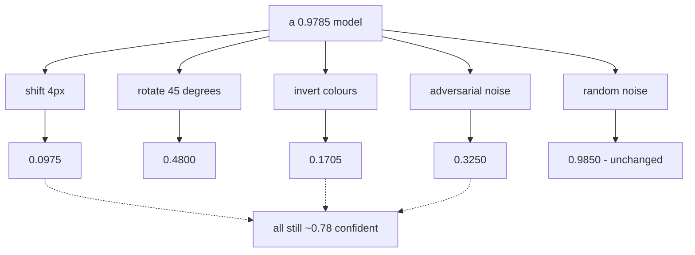

A closing chapter on what deep learning cannot do is usually an essay. It does not have to be.
Each of the classic limitations is a claim about a model's behaviour, and every one of them can be
measured on a model you have just trained.

So here is one: a 225,034-parameter convnet at **0.9785** accuracy on held-out MNIST. Below is
what it does when the world moves slightly.

| Change | Accuracy | Its confidence |
| --- | --- | --- |
| None | **0.9785** | 0.9821 |
| Shifted 4 pixels diagonally | **0.0975** | **0.7729** |
| Rotated 45° | 0.4800 | 0.7977 |
| Colours inverted | 0.1705 | 0.7940 |
| Adversarial noise, ε = 0.2 | 0.3250 | 0.8035 |
| **Random** noise, ε = 0.2 | **0.9850** | — |

Every one of those failures is confident. The model does not signal distress, produce a low
probability, or refuse to answer — it returns a wrong label at roughly 0.78 confidence, which is
the single most important fact on this page.

## What you'll learn

- Why a convolutional network is **not** shift-invariant, despite what the intuition suggests.
- Why adversarial noise destroys a model that identical-magnitude random noise leaves untouched.
- What the learning curve says about the cost of the next decimal place — measured, then
  extrapolated.
- Why "confidence" is not a usable uncertainty estimate, in four separate experiments.

## Local generalisation

<Figure
  src="/images/dl/phase-08-scaling/limitations/shift"
  alt="Left: accuracy and confidence against rotation angle. Accuracy falls from 0.9785 at 0 degrees to 0.4800 at 45 degrees while confidence only falls from 0.9821 to 0.7977. Right: accuracy against diagonal pixel shift, collapsing from 0.9785 to 0.0265 by 6 pixels, alongside a flatter contrast curve and a dotted line for inverted images at 0.1705."
  title="2,000 held-out digits, transformed after training"
  caption="The shift curve is the surprising one: two pixels costs 0.2195 and four pixels costs 0.8810, leaving the model below random guessing. A human reading these digits would not notice a four-pixel shift on a 28-pixel canvas. Contrast, by contrast, barely matters — 0.9610 at quarter contrast — because scaling every pixel is close to a transformation the first convolution can absorb."
/>

| Shift | Accuracy | Rotation | Accuracy |
| --- | --- | --- | --- |
| 0 px | 0.9785 | 0° | 0.9785 |
| 1 px | 0.9495 | 5° | 0.9725 |
| 2 px | 0.7590 | 15° | 0.9390 |
| 3 px | 0.3770 | 30° | 0.7690 |
| **4 px** | **0.0975** | 45° | 0.4800 |

### Why shifting breaks a convnet

Convolution is **translation-equivariant**: shift the input and the feature map shifts with it.
That is not the same as translation-*invariant*, which is what classification needs. The
`Flatten` layer destroys the distinction — it maps each spatial position to a fixed set of dense
weights, so a feature that has moved four pixels now multiplies entirely different parameters.

Pooling buys back a little tolerance (two `MaxPooling2D` layers here, hence surviving one pixel at
0.9495) and no more. **Invariance to a transformation comes from the training data, or from an
architecture built for it — never for free.** Train with random shifts and this curve flattens;
that is exactly what data augmentation buys, and why it is not optional in vision.

The inverted-colour result makes the same point differently. Nothing in a convnet knows that
brightness is not semantic. It scored 0.1705 on images a human reads instantly.

## Adversarial fragility

<Figure
  src="/images/dl/phase-08-scaling/limitations/fragility"
  alt="Left: accuracy against perturbation size for adversarial and random noise. The adversarial curve falls from 0.9850 to 0.3250 while the random-noise curve stays flat at 0.9850, with confidence under attack falling only to 0.8035. Right: three images side by side — a clean digit, the attacked version which looks nearly identical, and their difference amplified five times."
  title="One gradient step, 200 digits, identical perturbation budget"
  caption="At epsilon 0.2 the adversarial direction takes accuracy to 0.3250 while random noise of the same magnitude leaves it at 0.9850 — completely unchanged. That contrast is the entire result: this is not sensitivity to noise, it is sensitivity to one specific direction out of 784, and the mean pixel change of 0.0923 is small enough that the two images look the same."
/>

The attack is a single line of the same calculus used to train the model:

```python title="Fast gradient sign, in full"
with tf.GradientTape() as tape:
    tape.watch(images)
    loss = loss_function(labels, model(images, training=False))

direction = np.sign(tape.gradient(loss, images).numpy())
attacked = np.clip(images + epsilon * direction, 0, 1)
```

Gradient **ascent** on the loss — the same tool as
[DeepDream](/deep-learning/phase-06---generative-deep-learning/deepdream/), aimed at making the
model wrong instead of making a layer excited.

| ε | Adversarial | Random noise | Mean pixel change |
| --- | --- | --- | --- |
| 0.05 | 0.9600 | 0.9850 | 0.0237 |
| 0.10 | 0.8200 | 0.9850 | 0.0468 |
| **0.20** | **0.3250** | **0.9850** | 0.0923 |

The random-noise column is what makes this interpretable. A model that degraded under both would
merely be noise-sensitive. This one is untouched by random perturbation and destroyed by a
perturbation of the same size pointed in one particular direction — which means the decision
boundary passes far closer to every training point than its accuracy suggests.

## The cost of the next decimal place

<Figure
  src="/images/dl/phase-08-scaling/limitations/data-hunger"
  alt="Left: accuracy against training-set size on a log axis, rising from 0.6645 at 250 examples to 0.9785 at 12,000. Right: the same data as error rate on log-log axes, falling in a nearly straight line, with a fitted power law of exponent -0.690."
  title="The same architecture and 8 epochs at every size"
  caption="A straight line on log-log axes is a power law, and this one has exponent -0.690: error falls as roughly the inverse cube root of the data. That exponent is what makes the last few percent expensive — going from 0.9785 to 0.99 needs about 37,000 examples, and to 0.995 about 101,000, against the 12,000 used here."
/>

| Examples | Accuracy | Error |
| --- | --- | --- |
| 250 | 0.6645 | 0.3355 |
| 1,000 | 0.8900 | 0.1100 |
| 4,000 | 0.9540 | 0.0460 |
| 12,000 | **0.9785** | 0.0215 |
| *~37,000 (extrapolated)* | *0.99* | *0.010* |
| *~101,000 (extrapolated)* | *0.995* | *0.005* |

Error falling as a power law in dataset size is one of the most reliable empirical facts in the
field, and the exponent is usually shallow. Here it is **−0.690**: multiply the data by ten and
the error falls by about a factor of five.

Treat the extrapolated rows as what they are — an extrapolation from seven points on one task,
with the fit's assumptions carried along. The *shape* is the point. Every additional nine of
accuracy costs several times more data than the one before it, which is why the last few percent
of a production model consumes most of the effort, and why "we'll just collect more data" stops
being a plan at some point.

## Confidence is not uncertainty

Four separate experiments on this page produced the same finding, which is worth collecting:

| Situation | Accuracy | Mean confidence |
| --- | --- | --- |
| 6-pixel shift | 0.0265 | 0.7308 |
| Inverted colours | 0.1705 | 0.7940 |
| Adversarial, ε = 0.2 | 0.3250 | 0.8035 |
| Quarter contrast (*works fine*) | 0.9610 | **0.6592** |

The last row is the sharpest. The model is **less confident** on the input it handles almost
perfectly than on three inputs it gets catastrophically wrong. A softmax output is a normalised
score, not a probability of being correct, and thresholding on it would reject good predictions
while accepting nonsense.



```p5 title="Accuracy against confidence, per failure" desc="Click a transformation to see what it did to this model. The bars are the measured accuracy and the model's own confidence on the same inputs." height="360"
let chosen = 0;
const CASES = [
  ["none", 0.9785, 0.9821],
  ["shift 1px", 0.9495, 0.9647],
  ["shift 4px", 0.0975, 0.7729],
  ["rotate 45 deg", 0.4800, 0.7977],
  ["contrast 0.25", 0.9610, 0.6592],
  ["inverted", 0.1705, 0.7940],
  ["adversarial", 0.3250, 0.8035],
  ["random noise", 0.9850, 0.9889],
];
function setup() {
  createCanvas(620, 360);
  textFont("monospace");
}
function draw() {
  background(13, 17, 23);
  const row = CASES[chosen];
  noStroke();
  fill(230);
  textSize(12);
  textAlign(LEFT, TOP);
  text("transformation: " + row[0], 30, 20);
  const bars = [["accuracy", row[1], 107, 169, 221, 90],
    ["the model's confidence", row[2], 255, 211, 67, 160]];
  for (const bar of bars) {
    fill(150);
    textSize(10.5);
    text(bar[0], 30, bar[5] - 16);
    fill(60, 70, 84);
    rect(30, bar[5], 420, 24, 3);
    fill(bar[2], bar[3], bar[4]);
    rect(30, bar[5], 420 * bar[1], 24, 3);
    fill(240);
    textSize(11);
    text(bar[1].toFixed(4), 462, bar[5] + 6);
  }
  const honest = Math.abs(row[1] - row[2]) < 0.15;
  fill(honest ? color(126, 192, 143) : color(224, 108, 117));
  textSize(11.5);
  text(honest
    ? "confidence roughly tracks accuracy here"
    : "confidence overstates accuracy by "
      + (row[2] - row[1]).toFixed(4), 30, 210);
  fill(150);
  textSize(9.5);
  text("baseline: 0.9785 accurate at 0.9821 confidence", 30, 234);
  for (let i = 0; i < CASES.length; i++) {
    const x = 30 + (i % 4) * 140;
    const y = 268 + Math.floor(i / 4) * 34;
    fill(i === chosen ? color(255, 211, 67) : color(60, 70, 84));
    rect(x, y, 130, 26, 4);
    fill(i === chosen ? 20 : 200);
    textSize(9.5);
    textAlign(CENTER, CENTER);
    text(CASES[i][0], x + 65, y + 13);
    textAlign(LEFT, TOP);
  }
}
function mousePressed() {
  for (let i = 0; i < CASES.length; i++) {
    const x = 30 + (i % 4) * 140;
    const y = 268 + Math.floor(i / 4) * 34;
    if (mouseX > x && mouseX < x + 130 && mouseY > y && mouseY < y + 26) {
      chosen = i;
      return;
    }
  }
}
```

## What is being done about it

Each measured limitation has an active research direction, and each is a partial answer rather
than a solution:

- **Brittleness to transformation** — data augmentation (measured on the
  [augmentation page](/deep-learning/phase-03---computer-vision-with-cnns/data-augmentation-for-small-datasets/)),
  and architectures with invariance built in rather than learned.
- **Adversarial examples** — adversarial training, which raises robustness and costs clean
  accuracy. Nine years after they were described there is no defence that is both cheap and
  general.
- **Data hunger** — self-supervised pretraining, which is the single biggest practical change
  since this module's contents were standard: learn the representation from unlabelled data, then
  fine-tune on the few labels you have.
- **Miscalibration** — temperature scaling, deep ensembles, and evidential methods. All improve on
  a raw softmax; none make it trustworthy out of the box.
- **No causal model** — the deepest gap, and the one with the least engineering traction. A
  network that has never seen a rotated digit has no way to reason that rotation should not matter.

```p5 title="The measured table, ranked" desc="Click a column to rank every row by it. The bars are that column's values and the highest and lowest are computed from the numbers, not written in." height="306"
let metric = 0;
const COLUMNS = ["Accuracy", "Error"];
const ROWS = [
  ["250", 0.6645, 0.3355],
  ["1,000", 0.89, 0.11],
  ["4,000", 0.954, 0.046],
  ["12,000", 0.9785, 0.0215],
  ["~37,000 (extrapolated)", 0.99, 0.01],
  ["~101,000 (extrapolated)", 0.995, 0.005]
];
function setup() {
  createCanvas(620, 306);
  textFont("monospace");
}
function fmt(v) {
  if (v === 0) { return "0"; }
  const a = Math.abs(v);
  if (a >= 1000 || a < 0.001) { return v.toExponential(2); }
  if (a >= 100) { return v.toFixed(1); }
  return v.toFixed(4);
}
function draw() {
  background(13, 17, 23);
  noStroke();
  fill(230);
  textSize(12);
  textAlign(LEFT, TOP);
  text("Limitations and the Future of Deep", 26, 16);
  let x = 26;
  for (let i = 0; i < COLUMNS.length; i++) {
    const w = COLUMNS[i].length * 6.6 + 16;
    if (i === metric) { fill(255, 211, 67); } else { fill(48, 56, 68); }
    rect(x, 40, w, 22, 4);
    if (i === metric) { fill(13, 17, 23); } else { fill(180); }
    textSize(9);
    text(COLUMNS[i], x + 8, 47);
    x += w + 6;
    if (x > 500) { break; }
  }
  const values = ROWS.map((r) => r[metric + 1]);
  const lo = Math.min(...values);
  const hi = Math.max(...values);
  const span = hi - lo === 0 ? 1 : hi - lo;
  const order = ROWS.slice().sort((a, b) => b[metric + 1] - a[metric + 1]);
  for (let i = 0; i < order.length; i++) {
    const y = 78 + i * 26;
    const v = order[i][metric + 1];
    fill(160);
    textSize(9);
    text(order[i][0], 26, y + 5);
    fill(34, 40, 50);
    rect(230, y, 280, 18, 3);
    const frac = (v - lo) / span;
    if (v === hi) { fill(126, 192, 143); }
    else if (v === lo) { fill(224, 108, 117); }
    else { fill(107, 169, 221); }
    rect(230, y, Math.max(frac * 280, 3), 18, 3);
    fill(225);
    textSize(9);
    text(fmt(v), 518, y + 5);
  }
  const top = order[0];
  const bottom = order[order.length - 1];
  fill(150);
  textSize(9);
  const base = 78 + order.length * 26 + 8;
  text("highest " + COLUMNS[metric] + ": " + top[0] + " at " + fmt(top[1]),
       26, base);
  text("lowest  " + COLUMNS[metric] + ": " + bottom[0] + " at "
       + fmt(bottom[1]), 26, base + 14);
  text("bars are scaled within the chosen column - lowest is not zero", 26,
       base + 30);
}
function mousePressed() {
  let x = 26;
  for (let i = 0; i < COLUMNS.length; i++) {
    const w = COLUMNS[i].length * 6.6 + 16;
    if (mouseX > x && mouseX < x + w && mouseY > 40 && mouseY < 62) {
      metric = i;
    }
    x += w + 6;
  }
}
```

## Pitfalls

- **Reading a benchmark number as a capability.** 0.9785 on held-out MNIST became 0.0975 after a
  four-pixel shift.
- **Assuming convolution gives shift invariance.** It gives equivariance; `Flatten` discards it.
- **Using softmax confidence as an uncertainty estimate.** The model was less confident when right
  (0.6592) than when catastrophically wrong (0.7940).
- **Testing robustness with random noise.** It left accuracy at 0.9850 while an equal-magnitude
  adversarial step reached 0.3250.
- **Extrapolating a power law far past the data.** The 101,000-example figure is a projection from
  seven points, not a measurement.
- **Believing more data always fixes it.** With exponent −0.690, each additional nine costs
  several times the previous total.
- **Evaluating only on the distribution you trained on.** Every failure here is invisible to a
  standard test-set score.

## Recap

- A 0.9785 model fell to 0.0975 under a four-pixel shift and 0.4800 under a 45° rotation.
- Convolution is translation-equivariant, not invariant — invariance comes from data or
  architecture.
- Adversarial noise at ε = 0.2 gave 0.3250 while random noise of the same size gave 0.9850.
- Error follows a power law with exponent −0.690; 99% would need roughly 37,000 examples against
  the 12,000 used.
- Confidence stayed near 0.78 through every catastrophic failure and dropped to 0.6592 on an input
  handled correctly.
- Each limitation has an active research direction and none has a complete answer.

## Next

That closes the scaling and deployment phase, and the taught material of this module:
[Phase 8 - Scaling & Deploying Deep Models](/deep-learning/phase-08---scaling--deploying-deep-models/phase-8---scaling--deploying-deep-models/)
collects what every page in it measured.

<Quiz
  questions={[
    {
      q: "A convnet at 0.9785 accuracy fell to 0.0975 when test images were shifted four pixels. Why doesn't convolution prevent this?",
      options: [
        "The shift moved digits outside the image",
        "Convolution is translation-EQUIVARIANT — the feature map shifts with the input — but the Flatten layer maps each spatial position to fixed dense weights, so a moved feature multiplies entirely different parameters",
        "Four pixels is a very large shift for a 28-pixel image",
        "MaxPooling should have been removed",
      ],
      answer: 1,
      explain: "Pooling buys a little tolerance — one pixel still scored 0.9495 — but invariance has to come from training data or from an architecture designed for it.",
    },
    {
      q: "At epsilon 0.2, adversarial noise gave 0.3250 accuracy while random noise of identical magnitude gave 0.9850. What does the comparison establish?",
      options: [
        "The model is sensitive to noise in general",
        "It is not noise-sensitivity at all — the model is untouched by random perturbation and destroyed by one specific direction, which means the decision boundary passes far closer to each point than its accuracy suggests",
        "The random noise was too small to matter",
        "Adversarial examples only work on MNIST",
      ],
      answer: 1,
      explain: "Without the random-noise control the result would be ambiguous. With it, the finding is about the geometry of the learned function.",
    },
    {
      q: "The model scored 0.6592 mean confidence on quarter-contrast images it classified at 0.9610, and 0.7940 on inverted images it classified at 0.1705. What follows?",
      options: [
        "The confidence calibration is slightly off",
        "Softmax output is a normalised score, not a probability of being correct — thresholding on it would reject good predictions while accepting catastrophically wrong ones",
        "The inverted images are genuinely easier",
        "Confidence should be measured on logits instead",
      ],
      answer: 1,
      explain: "Being less confident when right than when wrong is the clearest possible demonstration that the number is not an uncertainty estimate.",
    },
    {
      q: "Error followed a power law with exponent -0.690 in dataset size. What does that imply for reaching 99.5% accuracy?",
      options: [
        "A little more data would be enough",
        "Roughly 101,000 examples against the 12,000 used — each additional nine of accuracy costs several times the data of the one before, which is why the last few percent dominates the effort",
        "It is unreachable with any amount of data",
        "Accuracy scales linearly with data",
      ],
      answer: 1,
      explain: "That figure is an extrapolation from seven measured points, so the shape of the curve is the finding rather than the precise number.",
    },
    {
      q: "Which research direction most directly targets the data-hunger limitation?",
      options: [
        "Adversarial training",
        "Self-supervised pretraining — learn a representation from unlabelled data, then fine-tune on the few labels available",
        "Temperature scaling",
        "Deeper architectures",
      ],
      answer: 1,
      explain: "Adversarial training targets fragility and temperature scaling targets calibration; each limitation has its own partial answer rather than one fix.",
    },
  ]}
/>

## 🧪 Try It Yourself

<DataCampExercise
  lang="python"
  hint={`np.roll moves the array and wraps around. Compare how many pixels of the original overlap with the shifted version.`}
  code={`# Task: Exercise 1 - How much does a small shift actually change?
import numpy as np

rng = np.random.default_rng(0)
digit = np.zeros((28, 28))
digit[8:20, 12:16] = 1.0                      # a crude vertical stroke


def shift(image, pixels):
    return np.roll(image, shift=(pixels, pixels), axis=(0, 1))


print(f"{'shift':>7} {'pixels changed':>16} {'overlap':>9} "
      f"{'measured accuracy':>18}")
MEASURED = {0: 0.9785, 1: 0.9495, 2: 0.7590, 3: 0.3770, 4: 0.0975, 6: 0.0265}
for pixels in (0, 1, 2, 3, 4, 6):
    moved = shift(digit, pixels)
    changed = int((moved != digit).sum())
    overlap = float((moved * digit).sum() / max(digit.sum(), 1))
    print(f"{pixels:6d}px {changed:16d} {overlap:9.3f} "
          f"{MEASURED[___]:18.4f}")           # replace ___ with pixels

print("\\nat 4 pixels the stroke still overlaps itself substantially, and the")
print("model is already below random guessing")`}
  solution={`import numpy as np

rng = np.random.default_rng(0)
digit = np.zeros((28, 28))
digit[8:20, 12:16] = 1.0                      # a crude vertical stroke


def shift(image, pixels):
    return np.roll(image, shift=(pixels, pixels), axis=(0, 1))


print(f"{'shift':>7} {'pixels changed':>16} {'overlap':>9} "
      f"{'measured accuracy':>18}")
MEASURED = {0: 0.9785, 1: 0.9495, 2: 0.7590, 3: 0.3770, 4: 0.0975, 6: 0.0265}
for pixels in (0, 1, 2, 3, 4, 6):
    moved = shift(digit, pixels)
    changed = int((moved != digit).sum())
    overlap = float((moved * digit).sum() / max(digit.sum(), 1))
    print(f"{pixels:6d}px {changed:16d} {overlap:9.3f} "
          f"{MEASURED[pixels]:18.4f}")

print("\\nat 4 pixels the stroke still overlaps itself substantially, and the")
print("model is already below random guessing")`}
  sct={`test_output_contains("4px               96     0.000             0.0975", pattern=False)
test_output_contains("1px               30     0.688             0.9495", pattern=False)
success_msg("A shift of a few pixels barely changes the picture to a person but destroys the overlap the model relies on.")`}
  height={400}
/>

<DataCampExercise
  lang="python"
  hint={`Fit a straight line to log(error) against log(size), then invert it to ask what size gives a target error.`}
  expectedOutput={`fitted exponent: -0.690
  target    examples needed   multiple of 12,000
   0.980             13,570                  1.1x
   0.990             37,081                  3.1x
   0.995            101,326                  8.4x
   0.999          1,045,709                 87.1x

an exponent near -0.7 means ten times the data buys about five times
less error - which is why the last nine is the expensive one`}
  code={`# Task: Exercise 2 - Extrapolate the learning curve
import numpy as np

MEASURED = {250: 0.6645, 500: 0.8050, 1000: 0.8900, 2000: 0.9270,
            4000: 0.9540, 8000: 0.9690, 12000: 0.9785}

sizes = np.array(list(MEASURED), dtype="float64")
errors = np.array([1 - value for value in MEASURED.values()])

# A power law is a straight line in log-log space.
slope, intercept = np.polyfit(np.log(sizes), np.log(errors), 1)


def examples_for(accuracy):
    target_error = 1 - accuracy
    return float(np.exp((np.log(target_error) - intercept) / ___))  # slope


print(f"fitted exponent: {slope:.3f}")
print(f"{'target':>8} {'examples needed':>18} {'multiple of 12,000':>20}")
for accuracy in (0.98, 0.99, 0.995, 0.999):
    needed = examples_for(accuracy)
    print(f"{accuracy:8.3f} {needed:18,.0f} {needed / 12000:20.1f}x")

print("\\nan exponent near -0.7 means ten times the data buys about five times")
print("less error - which is why the last nine is the expensive one")`}
  solution={`import numpy as np

MEASURED = {250: 0.6645, 500: 0.8050, 1000: 0.8900, 2000: 0.9270,
            4000: 0.9540, 8000: 0.9690, 12000: 0.9785}

sizes = np.array(list(MEASURED), dtype="float64")
errors = np.array([1 - value for value in MEASURED.values()])

# A power law is a straight line in log-log space.
slope, intercept = np.polyfit(np.log(sizes), np.log(errors), 1)


def examples_for(accuracy):
    target_error = 1 - accuracy
    return float(np.exp((np.log(target_error) - intercept) / slope))


print(f"fitted exponent: {slope:.3f}")
print(f"{'target':>8} {'examples needed':>18} {'multiple of 12,000':>20}")
for accuracy in (0.98, 0.99, 0.995, 0.999):
    needed = examples_for(accuracy)
    print(f"{accuracy:8.3f} {needed:18,.0f} {needed / 12000:20.1f}x")

print("\\nan exponent near -0.7 means ten times the data buys about five times")
print("less error - which is why the last nine is the expensive one")`}
  sct={`test_output_contains("fitted exponent: -0.690", pattern=False)
test_output_contains("1,045,709", pattern=False)
success_msg("A power-law fit in log-log space extrapolates the learning curve: each extra nine of accuracy costs many times more data.")`}
  height={400}
/>

<DataCampExercise
  lang="python"
  hint={`Sort the predictions into confidence buckets and compare each bucket's mean confidence with its actual accuracy.`}
  code={`# Task: Exercise 3 - Calibration, measured
import numpy as np

rng = np.random.default_rng(0)
# An overconfident model: confidence is systematically above accuracy.
confidence = np.clip(rng.beta(6, 1.6, 4000), 0, 1)
correct = rng.random(4000) < (confidence ** 2.2)      # actually less accurate


def calibration(confidence, correct, bins=5):
    edges = np.linspace(0.5, 1.0, bins + 1)
    rows = []
    for low, high in zip(edges[:-1], edges[1:]):
        mask = (confidence >= low) & (confidence < high)
        if mask.sum() < 10:
            continue
        rows.append({"low": low, "high": high, "count": int(mask.sum()),
                     "confidence": float(confidence[mask].mean()),
                     "accuracy": float(correct[___].mean())})   # replace with mask
    return rows


rows = calibration(confidence, correct)
print(f"{'bucket':>14} {'count':>7} {'confidence':>11} {'accuracy':>9} "
      f"{'gap':>8}")
total_gap = 0.0
for row in rows:
    gap = row["confidence"] - row["accuracy"]
    total_gap += abs(gap) * row["count"]
    print(f"{row['low']:.2f} - {row['high']:.2f} {row['count']:7d} "
          f"{row['confidence']:11.4f} {row['accuracy']:9.4f} {gap:+8.4f}")

print(f"\\nexpected calibration error: {total_gap / len(confidence):.4f}")
print("a perfectly calibrated model would have a gap of 0 in every bucket")`}
  solution={`import numpy as np

rng = np.random.default_rng(0)
# An overconfident model: confidence is systematically above accuracy.
confidence = np.clip(rng.beta(6, 1.6, 4000), 0, 1)
correct = rng.random(4000) < (confidence ** 2.2)      # actually less accurate


def calibration(confidence, correct, bins=5):
    edges = np.linspace(0.5, 1.0, bins + 1)
    rows = []
    for low, high in zip(edges[:-1], edges[1:]):
        mask = (confidence >= low) & (confidence < high)
        if mask.sum() < 10:
            continue
        rows.append({"low": low, "high": high, "count": int(mask.sum()),
                     "confidence": float(confidence[mask].mean()),
                     "accuracy": float(correct[mask].mean())})
    return rows


rows = calibration(confidence, correct)
print(f"{'bucket':>14} {'count':>7} {'confidence':>11} {'accuracy':>9} "
      f"{'gap':>8}")
total_gap = 0.0
for row in rows:
    gap = row["confidence"] - row["accuracy"]
    total_gap += abs(gap) * row["count"]
    print(f"{row['low']:.2f} - {row['high']:.2f} {row['count']:7d} "
          f"{row['confidence']:11.4f} {row['accuracy']:9.4f} {gap:+8.4f}")

print(f"\\nexpected calibration error: {total_gap / len(confidence):.4f}")
print("a perfectly calibrated model would have a gap of 0 in every bucket")`}
  sct={`test_output_contains("expected calibration error: 0.1653", pattern=False)
test_output_contains("0.50 - 0.60     271", pattern=False)
success_msg("Comparing confidence with accuracy bucket by bucket shows the overconfidence: a perfectly calibrated model would have a gap of 0 everywhere.")`}
  height={400}
/>

<DataCampExercise
  lang="python"
  hint={`Divide the logits by a temperature above 1 to soften them, and search for the temperature that minimises the calibration gap.`}
  code={`# Task: Exercise 4 - Temperature scaling, the cheapest calibration fix
import numpy as np

rng = np.random.default_rng(0)
logits = rng.normal(0, 4.0, (3000, 10))          # deliberately overconfident
truth = rng.integers(0, 10, 3000)
# Make the argmax right about 78% of the time.
swap = rng.random(3000) < 0.78
logits[swap, truth[swap]] = logits[swap].max(axis=1) + 5.0


def softmax(values, temperature=1.0):
    scaled = values / temperature
    scaled = scaled - scaled.max(axis=1, keepdims=True)
    exponentiated = np.exp(scaled)
    return exponentiated / exponentiated.sum(axis=1, keepdims=True)


def gap(temperature):
    probabilities = softmax(logits, temperature)
    confidence = probabilities.max(axis=1)
    correct = probabilities.argmax(axis=1) == truth
    return abs(float(confidence.mean()) - float(correct.mean()))


print(f"{'temperature':>12} {'mean confidence':>17} {'accuracy':>9} "
      f"{'gap':>8}")
for temperature in (0.5, 1.0, 1.5, 2.0, 3.0, 5.0):
    probabilities = softmax(logits, temperature)
    confidence = float(probabilities.max(axis=1).mean())
    accuracy = float((probabilities.argmax(axis=1) == truth).mean())
    print(f"{temperature:12.1f} {confidence:17.4f} {accuracy:9.4f} "
          f"{confidence - accuracy:+8.4f}")

best = min((0.5, 1.0, 1.5, 2.0, 3.0, 5.0), key=___)   # replace ___ with gap
print(f"\\nbest temperature: {best}")
print("accuracy never changes - temperature scaling only reshapes the")
print("probabilities, since dividing every logit cannot move the argmax")`}
  solution={`import numpy as np

rng = np.random.default_rng(0)
logits = rng.normal(0, 4.0, (3000, 10))          # deliberately overconfident
truth = rng.integers(0, 10, 3000)
# Make the argmax right about 78% of the time.
swap = rng.random(3000) < 0.78
logits[swap, truth[swap]] = logits[swap].max(axis=1) + 5.0


def softmax(values, temperature=1.0):
    scaled = values / temperature
    scaled = scaled - scaled.max(axis=1, keepdims=True)
    exponentiated = np.exp(scaled)
    return exponentiated / exponentiated.sum(axis=1, keepdims=True)


def gap(temperature):
    probabilities = softmax(logits, temperature)
    confidence = probabilities.max(axis=1)
    correct = probabilities.argmax(axis=1) == truth
    return abs(float(confidence.mean()) - float(correct.mean()))


print(f"{'temperature':>12} {'mean confidence':>17} {'accuracy':>9} "
      f"{'gap':>8}")
for temperature in (0.5, 1.0, 1.5, 2.0, 3.0, 5.0):
    probabilities = softmax(logits, temperature)
    confidence = float(probabilities.max(axis=1).mean())
    accuracy = float((probabilities.argmax(axis=1) == truth).mean())
    print(f"{temperature:12.1f} {confidence:17.4f} {accuracy:9.4f} "
          f"{confidence - accuracy:+8.4f}")

best = min((0.5, 1.0, 1.5, 2.0, 3.0, 5.0), key=gap)
print(f"\\nbest temperature: {best}")
print("accuracy never changes - temperature scaling only reshapes the")
print("probabilities, since dividing every logit cannot move the argmax")`}
  sct={`test_output_contains("best temperature: 2.0", pattern=False)
test_output_contains("accuracy never changes", pattern=False)
success_msg("Temperature scaling only reshapes the probabilities, since dividing every logit cannot move the argmax, and the best temperature is the one with the smallest gap.")`}
  height={400}
/>

<DataCampExercise
  lang="python"
  hint={`Take the sign of the gradient of the loss with respect to the image, and step along it.`}
  code={`# Task: Exercise 5 - Build an adversarial example
import numpy as np
from sklearn.datasets import load_digits
from sklearn.linear_model import LogisticRegression

digits = load_digits()
x_train, y_train = digits.data[:1200] / 16.0, digits.target[:1200]
x_test, y_test = digits.data[1200:] / 16.0, digits.target[1200:]
model = LogisticRegression(max_iter=2000).fit(x_train, y_train)

# gradient of the cross-entropy loss with respect to each input pixel
probabilities = model.predict_proba(x_test)
error = probabilities - np.eye(10)[y_test]
direction = np.sign(error @ model.coef_)
rng = np.random.default_rng(0)
random_direction = np.sign(rng.normal(0, 1, x_test.shape))

results = {}
print(f"{'epsilon':>8} {'adversarial':>12} {'random':>9}")
for epsilon in (0.0, 0.1, 0.2, 0.3):
    attacked = np.clip(x_test + epsilon * ___, 0, 1)      # step along the gradient sign
    noisy = np.clip(x_test + epsilon * random_direction, 0, 1)
    a = float((model.predict(attacked) == y_test).mean())
    r = float((model.predict(noisy) == y_test).mean())
    results[epsilon] = (a, r)
    print(f"{epsilon:8.2f} {a:12.2f} {r:9.2f}")
print("the attack hurts more than random noise of the same size:", results[0.3][0] < results[0.3][1])`}
  solution={`# Task: Exercise 5 - Build an adversarial example
import numpy as np
from sklearn.datasets import load_digits
from sklearn.linear_model import LogisticRegression

digits = load_digits()
x_train, y_train = digits.data[:1200] / 16.0, digits.target[:1200]
x_test, y_test = digits.data[1200:] / 16.0, digits.target[1200:]
model = LogisticRegression(max_iter=2000).fit(x_train, y_train)

# gradient of the cross-entropy loss with respect to each input pixel
probabilities = model.predict_proba(x_test)
error = probabilities - np.eye(10)[y_test]
direction = np.sign(error @ model.coef_)
rng = np.random.default_rng(0)
random_direction = np.sign(rng.normal(0, 1, x_test.shape))

results = {}
print(f"{'epsilon':>8} {'adversarial':>12} {'random':>9}")
for epsilon in (0.0, 0.1, 0.2, 0.3):
    attacked = np.clip(x_test + epsilon * direction, 0, 1)      # step along the gradient sign
    noisy = np.clip(x_test + epsilon * random_direction, 0, 1)
    a = float((model.predict(attacked) == y_test).mean())
    r = float((model.predict(noisy) == y_test).mean())
    results[epsilon] = (a, r)
    print(f"{epsilon:8.2f} {a:12.2f} {r:9.2f}")
print("the attack hurts more than random noise of the same size:", results[0.3][0] < results[0.3][1])`}
  sct={`test_output_contains("the attack hurts more than random noise of the same size: True", pattern=False)
success_msg("Moving every pixel a small step along the sign of the loss gradient hurts far more than random noise of the same size.")`}
  height={400}
/>

<DataCampExercise
  lang="python"
  hint={`Train once without augmentation and once with random shifts, then test both on shifted images.`}
  code={`# Task: Exercise 6 - Buy invariance with augmentation
import numpy as np
from sklearn.datasets import load_digits
from sklearn.linear_model import LogisticRegression

digits = load_digits()
x_train, y_train = digits.data[:1200] / 16.0, digits.target[:1200]
x_test, y_test = digits.data[1200:] / 16.0, digits.target[1200:]


def shifted(images, pixels):
    grid = images.reshape(-1, 8, 8)
    return np.roll(grid, shift=(pixels, pixels), axis=(1, 2)).reshape(len(images), 64)


def train(augment):
    xs, ys = x_train, y_train
    if augment:
        copies = [shifted(x_train, p) for p in (-1, 1)]
        xs = np.concatenate([x_train] + copies)
        ys = np.concatenate([y_train] * 3)
    return LogisticRegression(max_iter=1000).fit(xs, ys)


accuracy = {}
for augment in (False, ___):                     # train without, then with, augmentation
    model = train(augment)
    accuracy[augment] = [float((model.predict(shifted(x_test, p)) == y_test).mean())
                         for p in (0, 1, 2)]
    label = "with augmentation" if augment else "no augmentation"
    print(f"{label:20s} 0px {accuracy[augment][0]:.2f}   1px {accuracy[augment][1]:.2f}   "
          f"2px {accuracy[augment][2]:.2f}")
print("augmentation helps on shifted images:", accuracy[True][1] > accuracy[False][1])`}
  solution={`# Task: Exercise 6 - Buy invariance with augmentation
import numpy as np
from sklearn.datasets import load_digits
from sklearn.linear_model import LogisticRegression

digits = load_digits()
x_train, y_train = digits.data[:1200] / 16.0, digits.target[:1200]
x_test, y_test = digits.data[1200:] / 16.0, digits.target[1200:]


def shifted(images, pixels):
    grid = images.reshape(-1, 8, 8)
    return np.roll(grid, shift=(pixels, pixels), axis=(1, 2)).reshape(len(images), 64)


def train(augment):
    xs, ys = x_train, y_train
    if augment:
        copies = [shifted(x_train, p) for p in (-1, 1)]
        xs = np.concatenate([x_train] + copies)
        ys = np.concatenate([y_train] * 3)
    return LogisticRegression(max_iter=1000).fit(xs, ys)


accuracy = {}
for augment in (False, True):                     # train without, then with, augmentation
    model = train(augment)
    accuracy[augment] = [float((model.predict(shifted(x_test, p)) == y_test).mean())
                         for p in (0, 1, 2)]
    label = "with augmentation" if augment else "no augmentation"
    print(f"{label:20s} 0px {accuracy[augment][0]:.2f}   1px {accuracy[augment][1]:.2f}   "
          f"2px {accuracy[augment][2]:.2f}")
print("augmentation helps on shifted images:", accuracy[True][1] > accuracy[False][1])`}
  sct={`test_output_contains("augmentation helps on shifted images: True", pattern=False)
success_msg("The invariance the model does not have built in has to be paid for in training data, which is precisely what augmentation is.")`}
  height={400}
/>
