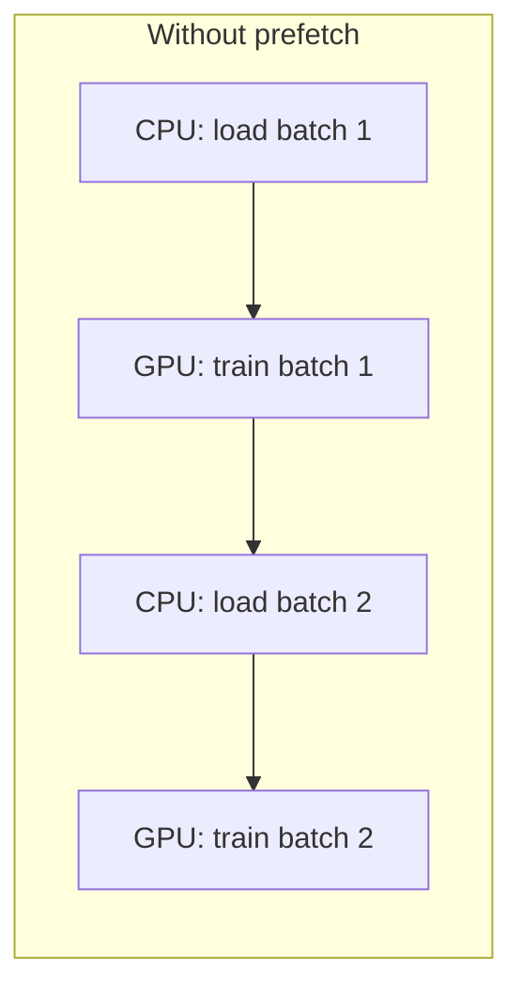
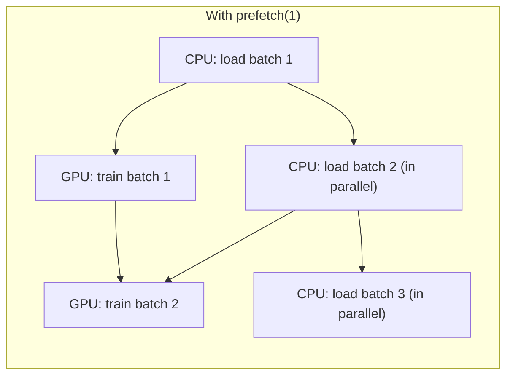

## What you'll learn

- what a `tf.data.Dataset` is, and how transformation methods chain together
- how to shuffle, repeat, batch, and preprocess data on the fly with `map()`
- why reading from many files and interleaving them beats reading one file at a time
- how to store large datasets efficiently using the **TFRecord** format
- why `prefetch()` is the one line that keeps your GPU from sitting idle

## Why not just load a NumPy array?

Every dataset so far in this module fit comfortably in RAM. Real datasets — millions
of images, gigabytes of logs — don't. The **Data API** (`tf.data`) solves this by
letting you describe a pipeline instead of a fixed array: "read from these files, skip
the header, parse each line, shuffle, batch, and get the next batch ready while the
GPU is still busy with the current one." TensorFlow handles the multithreading,
queuing, and memory management for you.

## The core idea: chaining transformations

A `tf.data.Dataset` represents a sequence of items. Every transformation method
(`.map()`, `.batch()`, `.shuffle()`, `.filter()`, `.repeat()`, ...) returns a **new**
dataset — it never modifies the original — so you chain them together:

```python title="Chaining dataset transformations" showLineNumbers{1}
import tensorflow as tf

X = tf.range(10)
dataset = tf.data.Dataset.from_tensor_slices(X)

# repeat the 10 items 3 times, then group them into batches of 7
dataset = dataset.repeat(3).batch(7)

for item in dataset:
    print(item.numpy())

# [0 1 2 3 4 5 6]
# [7 8 9 0 1 2 3]
# [4 5 6 7 8 9 0]
# [1 2 3 4 5 6 7]
# [8 9]
```

`repeat()` with no argument repeats forever — the code that iterates decides when to
stop. `batch()` outputs a smaller final batch unless you pass `drop_remainder=True`.

Use `.map()` to apply preprocessing to every item (pass `num_parallel_calls` to
spawn multiple threads for CPU-heavy work like resizing images), and `.filter()` to
drop items you don't want:

```python title="map() and filter()" showLineNumbers{1}
dataset = tf.data.Dataset.range(10)
dataset = dataset.map(lambda x: x * 2, num_parallel_calls=tf.data.AUTOTUNE)
dataset = dataset.filter(lambda x: x < 10)

print(list(dataset.as_numpy_iterator()))
# [0, 2, 4, 6, 8]
```

## Shuffling

Gradient Descent works best when training instances are independent and identically
distributed, so `shuffle()` fills a buffer with items from the source dataset and
pulls out a random one every time it's asked for an item, refilling from the source
as it goes:

```python title="Shuffling with a buffer" showLineNumbers{1}
dataset = tf.data.Dataset.range(10).repeat(3)
dataset = dataset.shuffle(buffer_size=5, seed=42).batch(7)

for item in dataset:
    print(item.numpy())
```

The buffer must be large enough to shuffle effectively — but it doesn't need to
exceed your dataset's size. For datasets too big to shuffle well in memory, split the
data across many files, read several of them at once with `interleave()`, and layer a
`shuffle()` buffer on top of that.

## Reading and interleaving many files

Real pipelines usually read from **many files at once**, cycling through them so
records from different files get interleaved instead of arriving in file order:

```python title="Interleaving multiple CSV files" showLineNumbers{1}
train_filepaths = ["data/housing_00.csv", "data/housing_01.csv", "data/housing_02.csv"]

filepath_dataset = tf.data.Dataset.list_files(train_filepaths, seed=42)

n_readers = 5
dataset = filepath_dataset.interleave(
    lambda filepath: tf.data.TextLineDataset(filepath).skip(1),  # skip header row
    cycle_length=n_readers,
    num_parallel_calls=tf.data.AUTOTUNE,
)
```

## Putting it together: a reusable CSV pipeline

```python title="A full csv_reader_dataset() pipeline" showLineNumbers{1}
import tensorflow as tf

n_inputs = 8  # number of feature columns

def preprocess(line, X_mean, X_std):
    defs = [0.0] * n_inputs + [tf.constant([], dtype=tf.float32)]
    fields = tf.io.decode_csv(line, record_defaults=defs)
    x = tf.stack(fields[:-1])
    y = tf.stack(fields[-1:])
    return (x - X_mean) / X_std, y

def csv_reader_dataset(
    filepaths, X_mean, X_std, repeat=1, n_readers=5,
    shuffle_buffer_size=10_000, n_parse_threads=5, batch_size=32,
):
    dataset = tf.data.Dataset.list_files(filepaths)
    dataset = dataset.interleave(
        lambda fp: tf.data.TextLineDataset(fp).skip(1),
        cycle_length=n_readers,
        num_parallel_calls=tf.data.AUTOTUNE,
    )
    dataset = dataset.map(
        lambda line: preprocess(line, X_mean, X_std),
        num_parallel_calls=n_parse_threads,
    )
    dataset = dataset.shuffle(shuffle_buffer_size).repeat(repeat)
    return dataset.batch(batch_size).prefetch(1)

# train_set = csv_reader_dataset(train_filepaths, X_mean, X_std)
# model.fit(train_set, epochs=10, validation_data=valid_set)
```

Notice the pipeline order: read → preprocess → shuffle → repeat → **batch** →
**prefetch**. If the whole preprocessed dataset fits in RAM, insert `.cache()` right
after preprocessing (before shuffling) so each instance is only parsed once per run,
not once per epoch.

## The TFRecord format

CSV is simple but not very efficient, and it doesn't handle complex data like images
well. **TFRecord** is TensorFlow's own binary format: a flat sequence of records,
usually serialized `Example` protocol buffers.

```python title="Writing and reading a TFRecord file" showLineNumbers{1}
import tensorflow as tf

# Write a couple of raw records
with tf.io.TFRecordWriter("my_data.tfrecord") as f:
    f.write(b"This is the first record")
    f.write(b"And this is the second record")

# Read them back
dataset = tf.data.TFRecordDataset(["my_data.tfrecord"])
for item in dataset:
    print(item.numpy())
```

In practice you serialize structured data using the `Example` protobuf, one per
instance, with named `float`, `int64`, or `bytes` features:

```python title="Serializing an Example protobuf" showLineNumbers{1}
from tensorflow.train import BytesList, FloatList, Int64List
from tensorflow.train import Feature, Features, Example
import tensorflow as tf

person_example = Example(
    features=Features(
        feature={
            "name": Feature(bytes_list=BytesList(value=[b"Alice"])),
            "id": Feature(int64_list=Int64List(value=[123])),
            "emails": Feature(bytes_list=BytesList(value=[b"a@b.com", b"c@d.com"])),
        }
    )
)

with tf.io.TFRecordWriter("my_contacts.tfrecord") as f:
    f.write(person_example.SerializeToString())

# Parsing it back requires a feature description
feature_description = {
    "name": tf.io.FixedLenFeature([], tf.string, default_value=""),
    "id": tf.io.FixedLenFeature([], tf.int64, default_value=0),
    "emails": tf.io.VarLenFeature(tf.string),
}

for serialized in tf.data.TFRecordDataset(["my_contacts.tfrecord"]):
    parsed = tf.io.parse_single_example(serialized, feature_description)
    print(parsed["name"].numpy(), tf.sparse.to_dense(parsed["emails"]).numpy())
```

Set `compression_type="GZIP"` on both `TFRecordOptions` (when writing) and
`TFRecordDataset` (when reading) if the files travel over a slow network.

## Prefetching: the one line that matters most





Calling `.prefetch(1)` at the end of a pipeline tells `tf.data` to always try to have
the **next** batch ready before it's needed. While the GPU trains on the current
batch, the CPU is already loading and preprocessing the next one in a background
thread — so the GPU (usually the most expensive, most limited resource) is almost
never idle.

:::tip[From the book]
Géron calls out `prefetch(1)` as "important for performance" even though it looks
like a throwaway last line in `csv_reader_dataset()`. Combined with
`num_parallel_calls` on `interleave()` and `map()`, it lets the CPU stay one batch
ahead of the GPU at all times — so, as the book puts it, "the GPU will be almost 100%
utilized... and training will run much faster." If your dataset fits in RAM, adding
`.cache()` right after preprocessing (and before shuffling) means each instance is
read and preprocessed only once total, instead of once per epoch.
:::

## Using a dataset with tf.keras

Once you have a pipeline, pass it straight to `fit()`, `evaluate()`, or `predict()`
instead of separate `X`/`y` arrays — `tf.keras` understands `tf.data.Dataset` objects
natively:

```python title="Training with a tf.data pipeline" showLineNumbers{1}
# train_set = csv_reader_dataset(train_filepaths, X_mean, X_std)
# valid_set = csv_reader_dataset(valid_filepaths, X_mean, X_std)
#
# model = keras.models.Sequential([...])
# model.compile(loss="mse", optimizer="adam")
# history = model.fit(train_set, epochs=10, validation_data=valid_set)
```

## Letting TensorFlow pick the buffer size

Every `num_parallel_calls` and `prefetch()` example so far uses a hand-picked number.
If you're not sure what to pick, pass `tf.data.AUTOTUNE` instead of a fixed integer —
TensorFlow tunes the value dynamically at runtime, based on the resources actually
available:

```python title="Letting TensorFlow tune prefetch and parallelism automatically" showLineNumbers{1}
dataset = dataset.map(preprocess, num_parallel_calls=tf.data.AUTOTUNE)
dataset = dataset.prefetch(tf.data.AUTOTUNE)
```

:::tip[From the book]
Chollet's advice applies just as much here as it does when training on multiple GPUs
or a TPU: always feed `fit()` a `tf.data.Dataset` rather than raw NumPy arrays when
performance matters, and always call `.prefetch()` as the last step of the pipeline
— `tf.data.AUTOTUNE` is the one-line way to stop guessing at the right buffer size.
:::

## Visualize it

Watch the CPU and GPU work in lockstep once prefetching kicks in — the CPU is always
one batch ahead, so the GPU never has to wait:

```p5 title="Prefetching: CPU stays one batch ahead of the GPU" desc="A queue fills with batches prepared by the CPU while the GPU consumes one batch at a time; with prefetching the GPU rarely stalls." height="260"
let queue = [];
let gpuBusyUntil = 0;
let cpuBusyUntil = 0;
let t = 0;
let trained = 0, stalls = 0;
const CPU_TIME = 55, GPU_TIME = 40, MAX_QUEUE = 3;
function reset() {
  queue = [];
  gpuBusyUntil = 0;
  cpuBusyUntil = 0;
  t = 0;
  trained = 0;
  stalls = 0;
}
function setup() {
  createCanvas(600, 260);
  textFont("monospace");
  textAlign(CENTER, CENTER);
  reset();
}
function draw() {
  background(13, 17, 23);
  t++;

  if (t >= cpuBusyUntil && queue.length < MAX_QUEUE) {
    queue.push(t);
    cpuBusyUntil = t + CPU_TIME;
  }
  let stalled = false;
  if (t >= gpuBusyUntil) {
    if (queue.length > 0) {
      queue.shift();
      gpuBusyUntil = t + GPU_TIME;
      trained++;
    } else {
      stalled = true;
      stalls++;
    }
  }

  noStroke();
  fill(180);
  textSize(13);
  text("CPU (prepares batches)", 150, 30);
  text("GPU (trains on batches)", 450, 30);

  fill(75, 139, 190);
  rect(90, 55, 120, 26, 4);
  fill(255);
  textSize(11);
  text(t < cpuBusyUntil ? "preparing batch..." : "idle", 150, 68);

  fill(24, 34, 44);
  stroke(90);
  strokeWeight(1);
  rect(230, 50, 140, 36, 4);
  noStroke();
  fill(255, 211, 67);
  for (let i = 0; i < queue.length; i++) {
    rect(238 + i * 40, 58, 32, 20, 3);
  }
  fill(150);
  textSize(10);
  text("prefetch queue (" + queue.length + "/" + MAX_QUEUE + ")", 300, 100);

  fill(stalled ? color(200, 90, 90) : color(120, 200, 120));
  rect(410, 55, 120, 26, 4);
  fill(255);
  textSize(11);
  text(stalled ? "STALLED (waiting)" : "training batch...", 470, 68);

  fill(107, 169, 221);
  textSize(13);
  text("batches trained: " + trained + "   |   GPU stalls: " + stalls, width / 2, 140);

  fill(150);
  textSize(11);
  text("With prefetch(1)+ the queue stays full and stalls stay near zero.", width / 2, 165);
  text("Click to restart the simulation.", width / 2, 185);

  if (t > 1400) reset();
}
function mousePressed() { reset(); }
```

## Mini-checkpoint

If your training loop is GPU-bound but the GPU utilization graph shows regular dips:

- your input pipeline is probably the bottleneck — add `num_parallel_calls` to
  `interleave()`/`map()`, and make sure you're calling `.prefetch()`.

import DataCampExercise from "../../../../components/DataCampExercise.astro";

## 🧪 Try It Yourself

### Exercise 1 – Chain repeat() and batch()

<DataCampExercise
  lang="python"
  hint={`\`from_tensor_slices\` builds the dataset; chain \`.repeat(2).batch(5)\` on it.`}
  code={`# Task: Exercise 1 - Chain repeat() and batch()
import tensorflow as tf

dataset = tf.data.Dataset.from_tensor_slices(tf.range(5))
dataset = dataset.___(2).batch(5)   # replace ___ with repeat

for item in dataset:
    print(item.numpy())

# ── Expected Output ───────────────────────────────────────────
# [0 1 2 3 4]
# [0 1 2 3 4]
# ──────────────────────────────────────────────────────────────`}
  solution={`import tensorflow as tf

dataset = tf.data.Dataset.from_tensor_slices(tf.range(5))
dataset = dataset.repeat(2).batch(5)

for item in dataset:
    print(item.numpy())`}
  sct={`test_output_contains("[0 1 2 3 4]")
success_msg("You chained repeat() and batch() correctly!")`}
  height={160}
/>

### Exercise 2 – Shuffle with a buffer

<DataCampExercise
  lang="python"
  hint={`\`shuffle()\` takes a \`buffer_size\` argument and (optionally) a \`seed\`.`}
  code={`# Task: Exercise 2 - Shuffle with a buffer
import tensorflow as tf

dataset = tf.data.Dataset.range(10)
dataset = dataset.___(buffer_size=10, seed=42)   # replace ___ with shuffle
dataset = dataset.batch(10)

for item in dataset:
    print("Batch size:", len(item.numpy()))

# ── Expected Output ───────────────────────────────────────────
# Batch size: 10
# ──────────────────────────────────────────────────────────────`}
  solution={`import tensorflow as tf

dataset = tf.data.Dataset.range(10)
dataset = dataset.shuffle(buffer_size=10, seed=42)
dataset = dataset.batch(10)

for item in dataset:
    print("Batch size:", len(item.numpy()))`}
  sct={`test_output_contains("Batch size: 10")
success_msg("Shuffling configured correctly!")`}
  height={160}
/>

### Exercise 3 – Add prefetch()

<DataCampExercise
  lang="python"
  hint={`Call \`.prefetch(1)\` as the very last step of the pipeline.`}
  code={`# Task: Exercise 3 - Add prefetch()
import tensorflow as tf

dataset = tf.data.Dataset.range(20).batch(4)
dataset = dataset.___(1)   # replace ___ with prefetch
print("Element spec:", dataset.element_spec)

# ── Expected Output ───────────────────────────────────────────
# Element spec: TensorSpec(shape=(None,), dtype=tf.int64, name=None)
# ──────────────────────────────────────────────────────────────`}
  solution={`import tensorflow as tf

dataset = tf.data.Dataset.range(20).batch(4)
dataset = dataset.prefetch(1)
print("Element spec:", dataset.element_spec)`}
  sct={`test_output_contains("Element spec:")
success_msg("Your pipeline now prefetches the next batch automatically!")`}
  height={150}
/>

## Next

Continue to **Custom Models and Training Loops (TensorFlow)** — once your model is
fed by a pipeline like this, the next step is looking at what's happening inside
`fit()` itself, and how to customize it when you need to.
