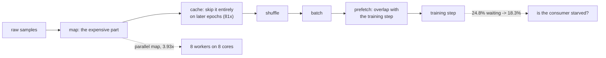

Input-pipeline advice usually arrives as a list of methods to chain in a particular order:
`map`, `cache`, `shuffle`, `batch`, `prefetch`. Every item on that list is a throughput claim,
and throughput is measurable, so this page times each one instead of repeating the list.

The measurements use a **deliberately slow** map function — four average-pooling passes plus
noise per image. That choice matters: on a pipeline whose per-sample work is trivial, every
option looks identical and the page would teach nothing.

| Pipeline | Rewrites **off** | Speed-up | Rewrites **on** (default) | Speed-up |
| --- | --- | --- | --- | --- |
| `map`, `batch` | 4,302/s | 1.00× | **15,177/s** | **3.53×** |
| `+ num_parallel_calls` | 16,895/s | 3.93× | 16,703/s | 3.88× |
| `+ prefetch` | 18,121/s | 4.21× | 17,904/s | 4.16× |
| `+ cache` (2nd epoch) | **348,547/s** | **81.01×** | 359,874/s | 83.64× |

The second column pair is the surprise. **tf.data already rewrote the plain `map` into a parallel
one** before being asked, which is why adding `num_parallel_calls` measures 3.88× against a
default that was already at 3.53×. The advice is not wrong — it is mostly already applied.

## What you'll learn

- What each pipeline option is worth on this machine, and which ones tf.data applies for you.
- Why `cache` is in a completely different league (81×) from everything else.
- What `prefetch` actually fixes, measured as time spent waiting rather than as throughput.
- Why the batch-size sweep came out **flat**, against the usual expectation.

## The graph rewrites you did not ask for

```python title="Turning the automatic optimisations off, to see what they were doing"
options = tf.data.Options()
options.experimental_optimization.map_parallelization = False
options.experimental_optimization.map_and_batch_fusion = False
options.autotune.enabled = False
pipeline = pipeline.with_options(options)
```

tf.data compiles your pipeline into a graph and rewrites it. A stateless `map` becomes a parallel
map; a `map` followed by a `batch` may be fused into one operation. Those rewrites are on by
default, and they account for the jump from 4,302/s to 15,177/s in the table above without a
single line of user code.

This has a practical consequence: **benchmarking a pipeline option on modern tf.data usually
measures nothing**, because the runtime already did it. To find out what an option is worth you
have to switch the rewrites off, which is what the first column pair does.

<Figure
  src="/images/dl/phase-08-scaling/tf-data/options"
  alt="Left: paired horizontal bars on a log axis comparing samples per second with graph rewrites off and on, for four pipelines. The plain map differs hugely (4,302 against 15,177) while the later pipelines nearly coincide. Right: speed-up against the unoptimised baseline for both settings, with the two lines converging after the parallel map is added and both jumping to roughly 80x at cache."
  title="4,000 MNIST images through a deliberately expensive map"
  caption="The two lines converge as soon as num_parallel_calls is set explicitly, because at that point the user has asked for what the rewrite was already doing. The gap on the first row — 3.53x — is the value tf.data adds silently. The last row dwarfs everything: caching a computed epoch is 81x, because the second pass does no work at all."
/>

## Cache is not in the same category

Everything except `cache` is about **overlapping** work. Caching removes the work entirely: on the
second epoch the expensive map has already run, and the pipeline is only replaying arrays from
memory. 348,547 samples per second is not a faster pipeline; it is the absence of a pipeline.

Two conditions make it safe, and both are easy to get wrong:

- **The data must fit.** `cache()` with no argument holds everything in RAM. `cache("path")`
  spills to disk, which is slower but survives a dataset larger than memory.
- **The cached step must be deterministic.** Caching *after* random augmentation freezes one
  augmentation per sample forever — the model then sees the same "random" crops every epoch,
  which quietly removes the regularisation you were paying for.

```python title="Where cache goes relative to augmentation"
# Right: deterministic work cached, randomness applied fresh each epoch.
pipeline = (raw.map(decode_and_resize, num_parallel_calls=AUTOTUNE)
               .cache()
               .map(random_augment, num_parallel_calls=AUTOTUNE)
               .batch(64).prefetch(AUTOTUNE))
```

That the numbers here were timed on the **second** pass is also deliberate. The first pass has to
do the work before there is anything to cache, so timing it would report the cost and hide the
benefit.

## Prefetch, measured properly

Throughput is the wrong test for `prefetch`. In the table above it contributes 4.21× against the
parallel map's 3.93× — barely anything — because when nothing is consuming the data there is
nothing to overlap with.

The right test simulates a training step and measures how long the consumer spends **waiting**:

<Figure
  src="/images/dl/phase-08-scaling/tf-data/starvation"
  alt="Two stacked horizontal bars, one per pipeline. Each shows time spent in the training step in green and time waiting for the next batch in red. Without prefetch, 24.8% of the epoch is spent waiting; with prefetch it falls to 18.3%, with the total dropping slightly from 0.25s to 0.24s."
  title="A 3 ms busy-wait standing in for the training step"
  caption="The step is a busy-wait rather than a sleep, so it cannot overlap by accident the way a sleeping thread would. Prefetch cut waiting from 24.8% of the epoch to 18.3% — real, and much smaller than the usual telling suggests, because the parallel map was already running ahead of the consumer. The remaining wait is the first batch, which nothing can overlap."
/>

`prefetch` does not make loading faster. It makes loading happen **while the previous batch is
being trained on**. The measurement to watch is the share of wall-clock the consumer spends
blocked, and here that share was already low before prefetch was added.



## Parallelism, and where AUTOTUNE landed

<Figure
  src="/images/dl/phase-08-scaling/tf-data/batch-and-parallelism"
  alt="Left: samples per second against batch size from 16 to 256, essentially flat between 16,448 and 17,197. Right: samples per second against the number of parallel map calls, rising from 4,511 at one worker to 16,701 at eight, with a dashed line marking AUTOTUNE at 14,641."
  title="This machine has 8 logical cores"
  caption="The parallelism curve is the clean result: 4,511 samples per second on one worker rising to 16,701 on eight, a 3.7x gain on 8 cores. AUTOTUNE landed at 14,641 — below the best explicit setting in this run, which is worth knowing: it adapts at run time and a short single-epoch measurement does not give it long to converge. The batch-size panel is flat, which is the honest result rather than a broken measurement."
/>

| Workers | Samples/s |
| --- | --- |
| 1 | 4,511 |
| 2 | 8,050 |
| 4 | 11,933 |
| **8** | **16,701** |
| AUTOTUNE | 14,641 |

Scaling from 1 to 8 workers gave 3.7× on 8 logical cores — close to linear until the last
doubling, where the cores are also running the main thread and TensorFlow's own thread pools.

**AUTOTUNE came in below the best fixed setting here.** That is not a reason to abandon it: it
tunes at run time across a whole training job, and these measurements are single passes over
4,000 samples. But it is a reason to distrust "AUTOTUNE is always optimal" and to measure if the
input pipeline is your bottleneck.

## The batch-size result

| Batch size | 16 | 32 | 64 | 128 | 256 |
| --- | --- | --- | --- | --- | --- |
| Samples/s | 16,840 | 17,197 | 16,699 | 16,448 | 16,876 |

Flat, within noise, across a 16× range. Batching amortises per-batch overhead, and on this
pipeline that overhead is negligible next to the map — so there is nothing to amortise.

This is worth stating because "use a bigger batch for throughput" is common advice. It is about
the *training step*, where a bigger batch means better hardware utilisation, not about the input
pipeline. Measuring the two separately is what keeps the claims straight.

```p5 title="Serial against overlapped" desc="Drag the loading time. The top track loads then trains, one after the other; the bottom track loads the next batch while training on the current one." height="360"
let loadMs = 4.0;
const STEP_MS = 3.0;
const BATCHES = 6;
function setup() {
  createCanvas(620, 360);
  textFont("monospace");
}
function draw() {
  background(13, 17, 23);
  const scale = 34;
  const left = 60;
  noStroke();
  fill(230);
  textSize(12);
  textAlign(LEFT, TOP);
  text("six batches, " + loadMs.toFixed(1) + " ms to load, "
    + STEP_MS.toFixed(1) + " ms to train", 30, 20);
  // Serial: load, step, load, step...
  let x = left;
  const serialY = 90;
  for (let i = 0; i < BATCHES; i++) {
    fill(107, 169, 221);
    rect(x, serialY, loadMs * scale, 26, 3);
    x += loadMs * scale;
    fill(126, 192, 143);
    rect(x, serialY, STEP_MS * scale, 26, 3);
    x += STEP_MS * scale;
  }
  const serialTotal = BATCHES * (loadMs + STEP_MS);
  // Overlapped: the loader runs ahead.
  const overY = 190;
  const slowest = Math.max(loadMs, STEP_MS);
  for (let i = 0; i < BATCHES; i++) {
    fill(107, 169, 221, 150);
    rect(left + i * slowest * scale, overY - 30, loadMs * scale, 26, 3);
    fill(126, 192, 143);
    rect(left + min(loadMs, STEP_MS) * scale + i * slowest * scale, overY,
      STEP_MS * scale, 26, 3);
  }
  const overTotal = BATCHES * slowest + Math.min(loadMs, STEP_MS);
  fill(150);
  textSize(10);
  textAlign(RIGHT, CENTER);
  text("serial", left - 8, serialY + 13);
  text("loader", left - 8, overY - 17);
  text("trainer", left - 8, overY + 13);
  textAlign(LEFT, TOP);
  fill(107, 169, 221);
  textSize(10);
  text("loading a batch", 30, 300);
  fill(126, 192, 143);
  text("training step", 190, 300);
  fill(255, 211, 67);
  textSize(12);
  text("serial " + serialTotal.toFixed(1) + " ms      overlapped "
    + overTotal.toFixed(1) + " ms      "
    + (serialTotal / overTotal).toFixed(2) + "x", 30, 264);
  fill(150);
  textSize(9.5);
  text("overlapping cannot beat the slower stage: "
    + slowest.toFixed(1) + " ms per batch", 30, 320);
  fill(60, 70, 84);
  rect(330, 302, 240, 4, 2);
  fill(255, 211, 67);
  circle(330 + ((loadMs - 0.5) / 7.5) * 240, 304, 12);
  fill(120);
  textSize(9);
  text("drag: load time", 330, 286);
}
function mousePressed() { mouseDragged(); }
function mouseDragged() {
  if (mouseY < 292 || mouseX < 320) { return; }
  loadMs = 0.5 + Math.min(Math.max((mouseX - 330) / 240, 0), 1) * 7.5;
}
```

```p5 title="The measured table, ranked" desc="Click a column to rank every row by it. The bars are that column's values and the highest and lowest are computed from the numbers, not written in." height="280"
let metric = 0;
const COLUMNS = ["Samples/s"];
const ROWS = [
  ["1", 4511],
  ["2", 8050],
  ["4", 11933],
  ["8", 16701],
  ["AUTOTUNE", 14641]
];
function setup() {
  createCanvas(620, 280);
  textFont("monospace");
}
function fmt(v) {
  if (v === 0) { return "0"; }
  const a = Math.abs(v);
  if (a >= 1000 || a < 0.001) { return v.toExponential(2); }
  if (a >= 100) { return v.toFixed(1); }
  return v.toFixed(4);
}
function draw() {
  background(13, 17, 23);
  noStroke();
  fill(230);
  textSize(12);
  textAlign(LEFT, TOP);
  text("Loading & Preprocessing Data with ", 26, 16);
  let x = 26;
  for (let i = 0; i < COLUMNS.length; i++) {
    const w = COLUMNS[i].length * 6.6 + 16;
    if (i === metric) { fill(255, 211, 67); } else { fill(48, 56, 68); }
    rect(x, 40, w, 22, 4);
    if (i === metric) { fill(13, 17, 23); } else { fill(180); }
    textSize(9);
    text(COLUMNS[i], x + 8, 47);
    x += w + 6;
    if (x > 500) { break; }
  }
  const values = ROWS.map((r) => r[metric + 1]);
  const lo = Math.min(...values);
  const hi = Math.max(...values);
  const span = hi - lo === 0 ? 1 : hi - lo;
  const order = ROWS.slice().sort((a, b) => b[metric + 1] - a[metric + 1]);
  for (let i = 0; i < order.length; i++) {
    const y = 78 + i * 26;
    const v = order[i][metric + 1];
    fill(160);
    textSize(9);
    text(order[i][0], 26, y + 5);
    fill(34, 40, 50);
    rect(230, y, 280, 18, 3);
    const frac = (v - lo) / span;
    if (v === hi) { fill(126, 192, 143); }
    else if (v === lo) { fill(224, 108, 117); }
    else { fill(107, 169, 221); }
    rect(230, y, Math.max(frac * 280, 3), 18, 3);
    fill(225);
    textSize(9);
    text(fmt(v), 518, y + 5);
  }
  const top = order[0];
  const bottom = order[order.length - 1];
  fill(150);
  textSize(9);
  const base = 78 + order.length * 26 + 8;
  text("highest " + COLUMNS[metric] + ": " + top[0] + " at " + fmt(top[1]),
       26, base);
  text("lowest  " + COLUMNS[metric] + ": " + bottom[0] + " at "
       + fmt(bottom[1]), 26, base + 14);
  text("bars are scaled within the chosen column - lowest is not zero", 26,
       base + 30);
}
function mousePressed() {
  let x = 26;
  for (let i = 0; i < COLUMNS.length; i++) {
    const w = COLUMNS[i].length * 6.6 + 16;
    if (mouseX > x && mouseX < x + w && mouseY > 40 && mouseY < 62) {
      metric = i;
    }
    x += w + 6;
  }
}
```

## Pitfalls

- **Benchmarking an option without disabling the rewrites.** Adding `num_parallel_calls` measured
  3.88× against a default of 3.53× — almost all of it was already applied.
- **Caching after random augmentation.** The randomness is frozen on the first epoch, silently
  removing the regularisation.
- **Timing `cache` on the first pass.** That pass pays the cost and gets none of the benefit.
- **Judging `prefetch` by throughput.** It contributes almost nothing there; its effect is on
  consumer waiting time, 24.8% → 18.3%.
- **Assuming AUTOTUNE beats a fixed setting.** It scored 14,641 against 16,701 for eight explicit
  workers in this run.
- **Expecting bigger batches to raise pipeline throughput.** Flat from 16 to 256 here.
- **Benchmarking with a trivial map.** Every option looks free, which is why so much pipeline
  advice is passed on untested.

## Recap

- tf.data rewrites your pipeline before running it; a stateless `map` is parallelised for you,
  worth 3.53× here.
- Explicit `num_parallel_calls` reached 3.93×, so the manual version adds little over the default.
- `cache` is categorically different at 81×, because the second epoch does no work — but only if
  the data fits and the cached stage is deterministic.
- `prefetch` overlaps loading with the training step; measured as waiting time it went 24.8% →
  18.3%.
- Parallel map scaling was 4,511 → 16,701 samples per second from 1 to 8 workers.
- Batch size did not affect pipeline throughput at all on this workload.

## Next

With data arriving fast enough, the next bottleneck is the training step itself — and the
`fit()` loop can be replaced with one you write:
[Custom Models and Training Loops](/deep-learning/phase-08---scaling--deploying-deep-models/custom-models-and-training-loops-tensorflow/).

<Quiz
  questions={[
    {
      q: "The plain map ran at 4,302 samples/s with graph rewrites off and 15,177 with them on. What does that mean for pipeline benchmarking?",
      options: [
        "The rewrites make measurements unreliable",
        "tf.data already parallelises a stateless map for you, so measuring 'the benefit of num_parallel_calls' on default settings mostly measures nothing — the rewrite had already applied it",
        "The rewrites should always be disabled",
        "The map function was stateful",
      ],
      answer: 1,
      explain: "Adding num_parallel_calls explicitly reached 3.93x against a default that was already at 3.53x.",
    },
    {
      q: "Caching gave 81x while every other option gave around 4x. Why is it in a different category?",
      options: [
        "It uses a faster memory allocator",
        "The other options overlap or parallelise the work; cache removes it — on the second epoch the expensive map has already run and the pipeline just replays arrays",
        "It skips the batching step",
        "It compresses the data",
      ],
      answer: 1,
      explain: "That is also why it must be timed on the second pass: the first one pays the full cost and has nothing cached yet.",
    },
    {
      q: "Why is caching AFTER a random augmentation step a bug?",
      options: [
        "It uses more memory",
        "The augmentation is executed once and its result stored, so every later epoch sees the identical 'random' transformation — the regularisation silently disappears",
        "Augmentation cannot be serialised",
        "It makes the pipeline non-deterministic",
      ],
      answer: 1,
      explain: "Cache belongs after the deterministic work — decoding, resizing — and before anything that should differ each epoch.",
    },
    {
      q: "Prefetch added almost nothing to raw throughput but cut consumer waiting from 24.8% to 18.3%. What does prefetch actually do?",
      options: [
        "It loads data faster",
        "It overlaps loading with the training step that consumes the previous batch, so throughput of the pipeline alone is the wrong measurement for it",
        "It increases the batch size automatically",
        "It caches the first few batches",
      ],
      answer: 1,
      explain: "With nothing consuming the data there is nothing to overlap with, which is why the throughput table barely moves.",
    },
    {
      q: "Batch size made no difference to pipeline throughput (16,448 to 17,197 across a 16x range). Is the common 'use bigger batches' advice wrong?",
      options: [
        "Yes, batch size never matters",
        "No — that advice is about the training step, where a larger batch improves hardware utilisation; here the map dominates and there is no per-batch overhead left to amortise",
        "Yes, because the measurement was too noisy",
        "No, but only because this ran on a CPU",
      ],
      answer: 1,
      explain: "Measuring the input pipeline and the training step separately is what keeps the two claims from being confused.",
    },
  ]}
/>

## 🧪 Try It Yourself

<DataCampExercise
  lang="python"
  hint={`Serial time is the sum of the per-stage times; a perfectly overlapped pipeline runs at the speed of its slowest stage.`}
  expectedOutput={`serial:     1.400s
overlapped: 0.803s
speed-up:   1.74x

the best possible saving is the SMALLER of the two stages -
overlapping cannot beat 4.0 ms per batch`}
  code={`# Task: Exercise 1 - Why overlapping beats speeding up
LOAD_MS = 4.0
STEP_MS = 3.0
BATCHES = 200


def serial(batches):
    """Load a batch, then train on it, then load the next."""
    return batches * (LOAD_MS + STEP_MS) / 1000.0


def overlapped(batches):
    """Load the next batch while training on the current one."""
    slowest = max(LOAD_MS, ___)                  # replace ___ with STEP_MS
    return (batches * slowest + min(LOAD_MS, STEP_MS)) / 1000.0


print(f"serial:     {serial(BATCHES):.3f}s")
print(f"overlapped: {overlapped(BATCHES):.3f}s")
print(f"speed-up:   {serial(BATCHES) / overlapped(BATCHES):.2f}x")
print(f"\\nthe best possible saving is the SMALLER of the two stages -")
print(f"overlapping cannot beat {max(LOAD_MS, STEP_MS)} ms per batch")`}
  solution={`LOAD_MS = 4.0
STEP_MS = 3.0
BATCHES = 200


def serial(batches):
    """Load a batch, then train on it, then load the next."""
    return batches * (LOAD_MS + STEP_MS) / 1000.0


def overlapped(batches):
    """Load the next batch while training on the current one."""
    slowest = max(LOAD_MS, STEP_MS)
    return (batches * slowest + min(LOAD_MS, STEP_MS)) / 1000.0


print(f"serial:     {serial(BATCHES):.3f}s")
print(f"overlapped: {overlapped(BATCHES):.3f}s")
print(f"speed-up:   {serial(BATCHES) / overlapped(BATCHES):.2f}x")
print(f"\\nthe best possible saving is the SMALLER of the two stages -")
print(f"overlapping cannot beat {max(LOAD_MS, STEP_MS)} ms per batch")`}
  sct={`test_output_contains("overlapped: 0.803s", pattern=False)
test_output_contains("speed-up:   1.74x", pattern=False)
success_msg("Overlapping loading with training hides the smaller stage, so the cost per batch becomes the slower of the two.")`}
  height={400}
/>

<DataCampExercise
  lang="python"
  hint={`Amdahl's law: if a fraction p of the work is parallelisable across n workers, the speed-up is 1 / ((1 - p) + p / n).`}
  expectedOutput={` workers   samples/s   measured   perfect  efficiency
       1       4,511      1.00x     1.00x      100.0%
       2       8,050      1.78x     2.00x       89.2%
       4      11,933      2.65x     4.00x       66.1%
       8      16,701      3.70x     8.00x       46.3%

efficiency falls with worker count because the main thread and
TensorFlow's own pools are competing for the same 8 cores`}
  code={`# Task: Exercise 2 - Compare measured scaling against the ideal
MEASURED = {1: 4511, 2: 8050, 4: 11933, 8: 16701}
BASELINE = MEASURED[1]


def amdahl(workers, parallel_fraction=1.0):
    """Ideal speed-up when a fraction of the work parallelises."""
    return 1.0 / ((1 - parallel_fraction) + parallel_fraction / ___)  # workers


print(f"{'workers':>8} {'samples/s':>11} {'measured':>10} {'perfect':>9} "
      f"{'efficiency':>11}")
for workers, rate in MEASURED.items():
    measured = rate / BASELINE
    perfect = amdahl(workers)
    print(f"{workers:8d} {rate:11,} {measured:9.2f}x {perfect:8.2f}x "
          f"{measured / perfect:11.1%}")

print("\\nefficiency falls with worker count because the main thread and")
print("TensorFlow's own pools are competing for the same 8 cores")`}
  solution={`MEASURED = {1: 4511, 2: 8050, 4: 11933, 8: 16701}
BASELINE = MEASURED[1]


def amdahl(workers, parallel_fraction=1.0):
    """Ideal speed-up when a fraction of the work parallelises."""
    return 1.0 / ((1 - parallel_fraction) + parallel_fraction / workers)


print(f"{'workers':>8} {'samples/s':>11} {'measured':>10} {'perfect':>9} "
      f"{'efficiency':>11}")
for workers, rate in MEASURED.items():
    measured = rate / BASELINE
    perfect = amdahl(workers)
    print(f"{workers:8d} {rate:11,} {measured:9.2f}x {perfect:8.2f}x "
          f"{measured / perfect:11.1%}")

print("\\nefficiency falls with worker count because the main thread and")
print("TensorFlow's own pools are competing for the same 8 cores")`}
  sct={`test_output_contains("8.00x", pattern=False)
test_output_contains("46.3%", pattern=False)
success_msg("Measured scaling falls short of the ideal because the workers compete for the same cores.")`}
  height={400}
/>

<DataCampExercise
  lang="python"
  hint={`Put cache after the deterministic work and before anything that must differ each epoch.`}
  expectedOutput={`decode, cache, augment, batch    correct: deterministic work cached
decode, augment, cache, batch    BROKEN: augment frozen on epoch 1
decode, augment, batch, cache    BROKEN: augment frozen on epoch 1
decode, augment, batch (none)    no caching: full cost every epoch

the second and third pipelines still run, still look faster, and
silently drop the augmentation after the first epoch`}
  code={`# Task: Exercise 3 - Where does cache belong?
PIPELINES = {
    "decode, cache, augment, batch": ["decode", "cache", "augment", "batch"],
    "decode, augment, cache, batch": ["decode", "augment", "cache", "batch"],
    "decode, augment, batch, cache": ["decode", "augment", "batch", "cache"],
    "decode, augment, batch (none)": ["decode", "augment", "batch"],
}
RANDOM_STAGES = {"augment"}


def audit(stages):
    """A cached pipeline is broken if anything random happens BEFORE the cache."""
    if "cache" not in stages:
        return "no caching: full cost every epoch"
    position = stages.index("cache")
    frozen = [s for s in stages[:position] if s in ___]   # replace with RANDOM_STAGES
    if frozen:
        return f"BROKEN: {', '.join(frozen)} frozen on epoch 1"
    return "correct: deterministic work cached"


for name, stages in PIPELINES.items():
    print(f"{name:32s} {audit(stages)}")

print("\\nthe second and third pipelines still run, still look faster, and")
print("silently drop the augmentation after the first epoch")`}
  solution={`PIPELINES = {
    "decode, cache, augment, batch": ["decode", "cache", "augment", "batch"],
    "decode, augment, cache, batch": ["decode", "augment", "cache", "batch"],
    "decode, augment, batch, cache": ["decode", "augment", "batch", "cache"],
    "decode, augment, batch (none)": ["decode", "augment", "batch"],
}
RANDOM_STAGES = {"augment"}


def audit(stages):
    """A cached pipeline is broken if anything random happens BEFORE the cache."""
    if "cache" not in stages:
        return "no caching: full cost every epoch"
    position = stages.index("cache")
    frozen = [s for s in stages[:position] if s in RANDOM_STAGES]
    if frozen:
        return f"BROKEN: {', '.join(frozen)} frozen on epoch 1"
    return "correct: deterministic work cached"


for name, stages in PIPELINES.items():
    print(f"{name:32s} {audit(stages)}")

print("\\nthe second and third pipelines still run, still look faster, and")
print("silently drop the augmentation after the first epoch")`}
  sct={`test_output_contains("decode, augment, cache, batch    BROKEN: augment frozen on epoch 1", pattern=False)
test_output_contains("correct: deterministic work cached", pattern=False)
success_msg("Cache only deterministic work: anything random placed before the cache is frozen after the first epoch.")`}
  height={400}
/>

<DataCampExercise
  lang="python"
  hint={`Time a full pass over the dataset and divide the row count by the elapsed seconds.`}
  code={`# Task: Exercise 4 - Model a pipeline and time it
import math

SAMPLES, BATCH = 3000, 64
MAP_MS = 1.0                 # preprocessing cost per sample
STEP_MS = 4.0                # training cost per batch


def epoch_seconds(workers=1, prefetch=False, cached=False):
    batches = math.ceil(SAMPLES / BATCH)
    load = 0.0 if cached else SAMPLES * MAP_MS / workers / 1000.0
    train = batches * STEP_MS / 1000.0
    return max(load, train) if prefetch else load + train


def throughput(seconds):
    return SAMPLES / ___                          # samples per second


rates = {}
for name, settings in (("map, batch", {}),
                       ("parallel map", {"workers": 4}),
                       ("+ prefetch", {"workers": 4, "prefetch": True}),
                       ("cached (2nd pass)", {"cached": True, "prefetch": True})):
    rates[name] = throughput(epoch_seconds(**settings))
    print(f"{name:20s} {rates[name]:10,.0f} samples/s")
print("each optimisation is faster than the last:",
      rates["map, batch"] < rates["parallel map"] < rates["+ prefetch"] < rates["cached (2nd pass)"])`}
  solution={`# Task: Exercise 4 - Model a pipeline and time it
import math

SAMPLES, BATCH = 3000, 64
MAP_MS = 1.0                 # preprocessing cost per sample
STEP_MS = 4.0                # training cost per batch


def epoch_seconds(workers=1, prefetch=False, cached=False):
    batches = math.ceil(SAMPLES / BATCH)
    load = 0.0 if cached else SAMPLES * MAP_MS / workers / 1000.0
    train = batches * STEP_MS / 1000.0
    return max(load, train) if prefetch else load + train


def throughput(seconds):
    return SAMPLES / seconds                          # samples per second


rates = {}
for name, settings in (("map, batch", {}),
                       ("parallel map", {"workers": 4}),
                       ("+ prefetch", {"workers": 4, "prefetch": True}),
                       ("cached (2nd pass)", {"cached": True, "prefetch": True})):
    rates[name] = throughput(epoch_seconds(**settings))
    print(f"{name:20s} {rates[name]:10,.0f} samples/s")
print("each optimisation is faster than the last:",
      rates["map, batch"] < rates["parallel map"] < rates["+ prefetch"] < rates["cached (2nd pass)"])`}
  sct={`test_output_contains("each optimisation is faster than the last: True", pattern=False)
test_output_contains("samples/s", pattern=False)
success_msg("Parallel maps, prefetching and caching each remove a different cost, and measuring samples per second shows what each one buys.")`}
  height={400}
/>

<DataCampExercise
  lang="python"
  hint={`Shuffle needs a buffer at least as large as the correlated run length, or the batches stay ordered.`}
  code={`# Task: Exercise 5 - The shuffle buffer has to be big enough
import numpy as np

# A dataset stored in class order, as image folders usually are.
LABELS = np.repeat(np.arange(10), 200)


def shuffled_batches(labels, buffer_size, batch=32, seed=0):
    """Approximate tf.data's streaming shuffle: draw from a sliding buffer."""
    rng = np.random.default_rng(seed)
    source = iter(labels)
    buffer = [next(source) for _ in range(min(buffer_size, len(labels)))]
    out = []
    for item in source:
        index = int(rng.integers(0, len(buffer)))
        out.append(buffer[index])
        buffer[index] = item
    # Drain what is left RANDOMLY. Emitting the leftover buffer in order would
    # make a buffer larger than the dataset look worse than a small one.
    while buffer:
        out.append(buffer.pop(int(rng.integers(0, len(buffer)))))
    return np.array(out[:len(labels) // batch * batch]).reshape(-1, ___)  # batch


for buffer_size in (1, 32, 500, 2000):
    batches = shuffled_batches(LABELS, buffer_size)
    distinct = np.mean([len(np.unique(row)) for row in batches])
    print(f"buffer {buffer_size:5d}: mean distinct classes per batch of 32: "
          f"{distinct:5.2f} / 10")

print("\\na buffer smaller than the run length leaves the data in class order,")
print("and every batch contains one or two classes")`}
  solution={`import numpy as np

# A dataset stored in class order, as image folders usually are.
LABELS = np.repeat(np.arange(10), 200)


def shuffled_batches(labels, buffer_size, batch=32, seed=0):
    """Approximate tf.data's streaming shuffle: draw from a sliding buffer."""
    rng = np.random.default_rng(seed)
    source = iter(labels)
    buffer = [next(source) for _ in range(min(buffer_size, len(labels)))]
    out = []
    for item in source:
        index = int(rng.integers(0, len(buffer)))
        out.append(buffer[index])
        buffer[index] = item
    # Drain what is left RANDOMLY. Emitting the leftover buffer in order would
    # make a buffer larger than the dataset look worse than a small one.
    while buffer:
        out.append(buffer.pop(int(rng.integers(0, len(buffer)))))
    return np.array(out[:len(labels) // batch * batch]).reshape(-1, batch)


for buffer_size in (1, 32, 500, 2000):
    batches = shuffled_batches(LABELS, buffer_size)
    distinct = np.mean([len(np.unique(row)) for row in batches])
    print(f"buffer {buffer_size:5d}: mean distinct classes per batch of 32: "
          f"{distinct:5.2f} / 10")

print("\\na buffer smaller than the run length leaves the data in class order,")
print("and every batch contains one or two classes")`}
  sct={`test_output_contains("buffer  2000: mean distinct classes per batch of 32:  9.69 / 10", pattern=False)
test_output_contains("buffer     1: mean distinct classes per batch of 32:  1.11 / 10", pattern=False)
success_msg("A shuffle buffer smaller than the run length leaves class-ordered data in class order, so every batch holds only one or two classes.")`}
  height={400}
/>

<DataCampExercise
  lang="python"
  hint={`Measure the consumer's waiting time separately from its compute time, and use a busy-wait so the step cannot overlap by accident.`}
  code={`# Task: Exercise 6 - Measure starvation, not throughput
import math

STEP_MS = 3.0            # training time per batch
LOAD_MS = 5.0            # time to produce one batch
BATCHES = 40


def run(prefetch):
    """Split an epoch into time spent waiting and time spent training."""
    if prefetch:
        # the next batch is prepared while the current one trains
        waiting = LOAD_MS + (BATCHES - 1) * max(0.0, LOAD_MS - ___)   # the training time
    else:
        waiting = BATCHES * LOAD_MS
    computing = BATCHES * STEP_MS
    return waiting, computing


shares = {}
for name, prefetch in (("no prefetch", False), ("prefetch", True)):
    waiting, computing = run(prefetch)
    shares[name] = waiting / (waiting + computing)
    print(f"{name:14s} waiting {waiting:6.1f} ms  training {computing:6.1f} ms  ({shares[name]:.1%} waiting)")
print("prefetching cuts the waiting share:", shares["prefetch"] < shares["no prefetch"])`}
  solution={`# Task: Exercise 6 - Measure starvation, not throughput
import math

STEP_MS = 3.0            # training time per batch
LOAD_MS = 5.0            # time to produce one batch
BATCHES = 40


def run(prefetch):
    """Split an epoch into time spent waiting and time spent training."""
    if prefetch:
        # the next batch is prepared while the current one trains
        waiting = LOAD_MS + (BATCHES - 1) * max(0.0, LOAD_MS - STEP_MS)   # the training time
    else:
        waiting = BATCHES * LOAD_MS
    computing = BATCHES * STEP_MS
    return waiting, computing


shares = {}
for name, prefetch in (("no prefetch", False), ("prefetch", True)):
    waiting, computing = run(prefetch)
    shares[name] = waiting / (waiting + computing)
    print(f"{name:14s} waiting {waiting:6.1f} ms  training {computing:6.1f} ms  ({shares[name]:.1%} waiting)")
print("prefetching cuts the waiting share:", shares["prefetch"] < shares["no prefetch"])`}
  sct={`test_output_contains("no prefetch    waiting  200.0 ms  training  120.0 ms  (62.5% waiting)", pattern=False)
test_output_contains("prefetching cuts the waiting share: True", pattern=False)
success_msg("Prefetching overlaps loading with training, so the accelerator spends a much smaller share of the epoch waiting for data.")`}
  height={400}
/>
