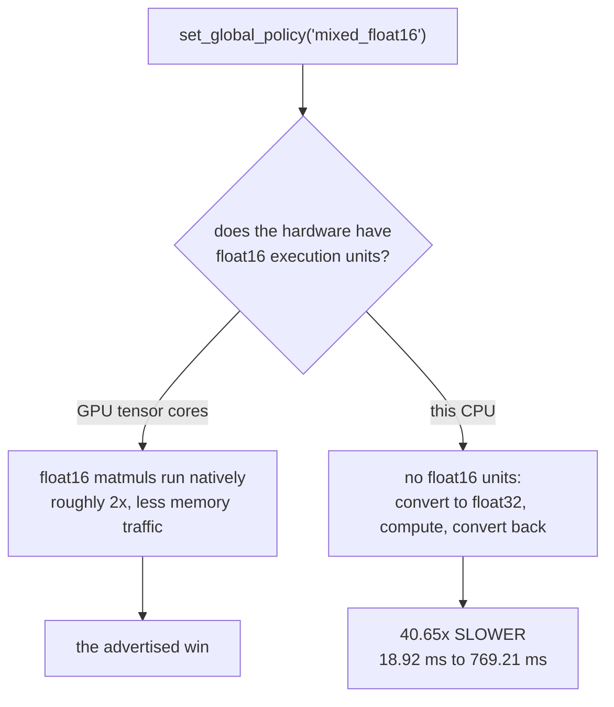

import DataCampExercise from "../../../../components/DataCampExercise.astro";
import Figure from "../../../../components/Figure.astro";
import Quiz from "../../../../components/Quiz.astro";

Mixed precision is usually introduced as a free speed-up: change one line, get roughly 2× on
modern GPUs. The line is real and so is the speed-up — **on hardware that has float16 execution
units**.

This machine does not. Rather than describe a number that cannot be shown here, this page
measures what the policy does on a CPU, which turns out to be the more useful lesson:

| Policy | ms/step | Relative | 3 epochs | Accuracy |
| --- | --- | --- | --- | --- |
| `float32` | **18.92** | 1.00× | 5.9s | 0.9073 |
| `mixed_float16` | **769.21** | **40.65×** | 144.8s | 0.9067 |
| `float64` | 67.50 | 3.57× | 15.9s | 0.9173 |

Mixed precision made training **40.65× slower** and changed accuracy by 0.0006. The numerics are
fine; the speed claim is entirely a property of the hardware, and applying the advice blindly on
a CPU costs two orders of magnitude.

## What you'll learn

- What `set_global_policy("mixed_float16")` actually changes — variables, computation, and the
  layer it deliberately leaves alone.
- Why float16 needs **loss scaling**, shown as the exact gradient magnitudes that vanish.
- Why the speed-up depends on hardware rather than on the model.
- What data parallelism across GPUs shares with this, and where it differs.

## What the policy changes

```python title="One line, applied globally"
keras.mixed_precision.set_global_policy("mixed_float16")
```

| Layer | Variables | Computes in |
| --- | --- | --- |
| `conv2d` | float32 | **float16** |
| `conv2d_1` | float32 | **float16** |
| `dense` | float32 | **float16** |
| `dense_1` (output) | float32 | **float32** |

The name is precise: it is **mixed**, not float16. The master copy of every weight stays in
float32 — the optimiser needs that precision, because a float16 weight update is frequently
smaller than the gap between two representable float16 values and would simply be lost. Only the
forward and backward arithmetic runs in float16.

<Figure
  src="/images/dl/phase-08-scaling/mixed-precision/policy"
  alt="Left: a table of layers with their variable dtype and compute dtype under the mixed policy, showing float32 variables throughout and float16 computation for every layer except the last. Right: a bar chart contrasting the compute dtype per layer under float32 and mixed_float16 policies, with the final dense layer remaining float32 under both."
  title="The same model built under two policies"
  caption="The final layer is pinned back to float32 deliberately. A softmax in float16 loses precision exactly where it matters — the largest logit dominates the exponentials, and the small differences between the remaining classes are what the loss gradient depends on. Keras makes this easy to get wrong by leaving it to you: dtype='float32' on the output layer is the fix."
/>

```python title="The output layer, done properly"
keras.layers.Dense(10, activation="softmax", dtype="float32")
```

## Why loss scaling exists

float16 has about three decimal digits of precision and, more importantly, a narrow range: its
smallest normal value is **6.1e-05** and its smallest subnormal is **6.0e-08**. Gradients live
below that more often than people expect.

<Figure
  src="/images/dl/phase-08-scaling/mixed-precision/overflow"
  alt="Left: paired bars for eight gradient magnitudes from 1e-1 down to 1e-10, showing which survive conversion to float16 with and without a scale factor of 1024. Everything at 1e-8 and below is lost in plain float16 and survives when scaled. Right: representable magnitude ranges for float16 and float32 on a log axis, with float16 spanning roughly 6e-08 to 6.6e+04 and float32 spanning far wider."
  title="Exact float16 conversions, not estimates"
  caption="A gradient of 1e-8 becomes exactly 0.0 in float16. It does not warn, it does not raise, and the parameter it belonged to simply stops learning. Multiplying the loss by 1024 before the backward pass moves those values into the representable band, and dividing the gradients by 1024 afterwards restores their true scale."
/>

| Gradient | As float16 | Survives | Scaled ×1024 | Survives |
| --- | --- | --- | --- | --- |
| 1e-05 | 1.00e-05 | yes | 1.00e-05 | yes |
| 1e-07 | 1.19e-07 | yes | 1.00e-07 | yes |
| **1e-08** | **0.00e+00** | **no** | 1.00e-08 | **yes** |
| 1e-09 | 0.00e+00 | no | 9.90e-10 | yes |
| 1e-10 | 0.00e+00 | no | 1.16e-10 | yes |

```python title="Loss scaling, which Keras handles for you"
optimizer = keras.mixed_precision.LossScaleOptimizer(keras.optimizers.Adam(1e-3))
```

`LossScaleOptimizer` multiplies the loss before the backward pass and divides the gradients
afterwards, so the arithmetic is unchanged but the intermediate values sit in a range float16 can
represent. It also adapts the scale factor: if the gradients overflow to infinity it halves the
factor and skips that step; if they behave for long enough it doubles it.

Note the 1e-07 row: the scaled version reads 1.00e-07 while the unscaled reads 1.19e-07. Both
survive, but the scaled one is *more accurate* — it was rounded at a finer resolution before
being divided back down.

## Why it is slower here



A CPU has no float16 arithmetic. Every float16 tensor must be widened to float32 to be operated
on and narrowed again afterwards, so the policy adds two conversions per operation and removes
nothing. That is the entire explanation for 40.65×.

<Figure
  src="/images/dl/phase-08-scaling/mixed-precision/cpu-cost"
  alt="Left: bars of milliseconds per step for the three policies — 18.92 for float32, 769.21 for mixed_float16 and 67.50 for float64, each annotated with its ratio. Right: validation accuracy per epoch for the three policies, three nearly overlapping curves ending at 0.9073, 0.9067 and 0.9173."
  title="Identical model and batch, 8-core CPU, no GPU"
  caption="The right panel is the control: accuracy is essentially unaffected — 0.9073 against 0.9067 — so the float16 arithmetic is numerically adequate for this model with loss scaling in place. Only the speed claim fails. float64 is included as a reference point for what genuinely-more-work looks like: 3.57x, which is far more reasonable than the conversion overhead of a dtype the hardware cannot execute."
/>

The practical rule follows directly: **mixed precision is a hardware feature, not a model
feature**. Measure one epoch before adopting it. On a GPU with tensor cores it usually pays; on
CPU it is catastrophic; on an older GPU without tensor cores it is roughly neutral.

## Multi-GPU, briefly

Data parallelism is measured properly on the
[distributed training page](/deep-learning/phase-08---scaling--deploying-deep-models/distributed-training-with-tfdistribute/),
but it shares this page's shape: a one-line API whose benefit depends entirely on hardware that
may not be present.

```python title="Both scaling levers together"
strategy = tf.distribute.MirroredStrategy()
keras.mixed_precision.set_global_policy("mixed_float16")

with strategy.scope():
    model = build_model()                      # variables mirrored per replica
    model.compile(keras.mixed_precision.LossScaleOptimizer(
        keras.optimizers.Adam(1e-3)), loss, metrics=["accuracy"])
```

They compose: each replica computes in float16, gradients are all-reduced in float32, and the
master weights stay float32 on every device. The two failure modes also compose — a model that
diverges under mixed precision will diverge on every replica at once, and the mirrored variables
make it slightly harder to see which one started it.

```p5 title="A gradient meeting float16" desc="Drag the gradient magnitude and the loss scale. The readout shows whether the value survives the round trip through float16, and what scaling recovers." height="360"
let exponent = -8;
let scaleExponent = 10;
function setup() {
  createCanvas(620, 360);
  textFont("monospace");
}
function roundTrip(value) {
  // float16: 10 mantissa bits, smallest subnormal 2^-24, largest 65504.
  const SUBNORMAL = Math.pow(2, -24);
  const MAX = 65504;
  if (value === 0) { return 0; }
  const magnitude = Math.abs(value);
  if (magnitude < SUBNORMAL / 2) { return 0; }
  if (magnitude > MAX) { return Infinity; }
  const power = Math.floor(Math.log2(magnitude));
  const step = Math.max(Math.pow(2, power - 10), SUBNORMAL);
  return Math.round(magnitude / step) * step;
}
function draw() {
  background(13, 17, 23);
  const gradient = Math.pow(10, exponent);
  const scale = Math.pow(2, scaleExponent);
  const plain = roundTrip(gradient);
  const scaled = roundTrip(gradient * scale) / scale;
  noStroke();
  fill(230);
  textSize(12);
  textAlign(LEFT, TOP);
  text("a gradient of 1e" + exponent + " through float16", 30, 20);
  fill(150);
  textSize(10.5);
  text("loss scale 2^" + scaleExponent + " = " + scale.toLocaleString(), 30, 42);
  const rows = [
    ["no loss scaling", plain, plain > 0, 100],
    ["scaled, then divided back", scaled, scaled > 0, 170],
  ];
  for (const row of rows) {
    fill(150);
    textSize(10.5);
    text(row[0], 30, row[3] - 16);
    if (row[2]) { fill(126, 192, 143); } else { fill(224, 108, 117); }
    rect(30, row[3], 300, 26, 3);
    fill(15);
    textSize(11);
    textAlign(CENTER, CENTER);
    text(row[2] ? row[1].toExponential(3) : "0.0  (LOST)", 180, row[3] + 13);
    textAlign(LEFT, TOP);
  }
  fill(150);
  textSize(9.5);
  text("float16 smallest subnormal 6.0e-08, smallest normal 6.1e-05", 30, 214);
  text("a lost gradient contributes nothing and raises no error", 30, 230);
  fill(255, 211, 67);
  textSize(11);
  if (plain === 0 && scaled > 0) {
    text("loss scaling rescued this gradient", 30, 254);
  } else if (plain > 0) {
    text("this gradient survives either way", 30, 254);
  } else {
    text("too small even for this scale - raise it", 30, 254);
  }
  const sliders = [["gradient 1e" + exponent, (exponent + 12) / 11, 306],
    ["scale 2^" + scaleExponent, scaleExponent / 20, 340]];
  for (const entry of sliders) {
    fill(150);
    textSize(9.5);
    text(entry[0], 30, entry[2] - 12);
    fill(60, 70, 84);
    rect(200, entry[2], 280, 4, 2);
    fill(255, 211, 67);
    circle(200 + entry[1] * 280, entry[2] + 2, 12);
  }
}
function mousePressed() { mouseDragged(); }
function mouseDragged() {
  if (mouseX < 190) { return; }
  const fraction = Math.min(Math.max((mouseX - 200) / 280, 0), 1);
  if (Math.abs(mouseY - 308) < 14) {
    exponent = Math.round(-12 + fraction * 11);
  } else if (Math.abs(mouseY - 342) < 14) {
    scaleExponent = Math.round(fraction * 20);
  }
}
```

```p5 title="The measured table, ranked" desc="Click a column to rank every row by it. The bars are that column's values and the highest and lowest are computed from the numbers, not written in." height="280"
let metric = 0;
const COLUMNS = ["As float16", "Scaled x1024"];
const ROWS = [
  ["1e-05", 1e-05, 1e-05],
  ["1e-07", 1.2e-07, 1e-07],
  ["1e-08", 0, 1e-08],
  ["1e-09", 0, 0.0],
  ["1e-10", 0, 0.0]
];
function setup() {
  createCanvas(620, 280);
  textFont("monospace");
}
function fmt(v) {
  if (v === 0) { return "0"; }
  const a = Math.abs(v);
  if (a >= 1000 || a < 0.001) { return v.toExponential(2); }
  if (a >= 100) { return v.toFixed(1); }
  return v.toFixed(4);
}
function draw() {
  background(13, 17, 23);
  noStroke();
  fill(230);
  textSize(12);
  textAlign(LEFT, TOP);
  text("Mixed Precision and Multi-GPU Trai", 26, 16);
  let x = 26;
  for (let i = 0; i < COLUMNS.length; i++) {
    const w = COLUMNS[i].length * 6.6 + 16;
    if (i === metric) { fill(255, 211, 67); } else { fill(48, 56, 68); }
    rect(x, 40, w, 22, 4);
    if (i === metric) { fill(13, 17, 23); } else { fill(180); }
    textSize(9);
    text(COLUMNS[i], x + 8, 47);
    x += w + 6;
    if (x > 500) { break; }
  }
  const values = ROWS.map((r) => r[metric + 1]);
  const lo = Math.min(...values);
  const hi = Math.max(...values);
  const span = hi - lo === 0 ? 1 : hi - lo;
  const order = ROWS.slice().sort((a, b) => b[metric + 1] - a[metric + 1]);
  for (let i = 0; i < order.length; i++) {
    const y = 78 + i * 26;
    const v = order[i][metric + 1];
    fill(160);
    textSize(9);
    text(order[i][0], 26, y + 5);
    fill(34, 40, 50);
    rect(230, y, 280, 18, 3);
    const frac = (v - lo) / span;
    if (v === hi) { fill(126, 192, 143); }
    else if (v === lo) { fill(224, 108, 117); }
    else { fill(107, 169, 221); }
    rect(230, y, Math.max(frac * 280, 3), 18, 3);
    fill(225);
    textSize(9);
    text(fmt(v), 518, y + 5);
  }
  const top = order[0];
  const bottom = order[order.length - 1];
  fill(150);
  textSize(9);
  const base = 78 + order.length * 26 + 8;
  text("highest " + COLUMNS[metric] + ": " + top[0] + " at " + fmt(top[1]),
       26, base);
  text("lowest  " + COLUMNS[metric] + ": " + bottom[0] + " at "
       + fmt(bottom[1]), 26, base + 14);
  text("bars are scaled within the chosen column - lowest is not zero", 26,
       base + 30);
}
function mousePressed() {
  let x = 26;
  for (let i = 0; i < COLUMNS.length; i++) {
    const w = COLUMNS[i].length * 6.6 + 16;
    if (mouseX > x && mouseX < x + w && mouseY > 40 && mouseY < 62) {
      metric = i;
    }
    x += w + 6;
  }
}
```

## Pitfalls

- **Assuming the speed-up is universal.** 40.65× slower here; the advertised ~2× requires tensor
  cores.
- **Leaving the output layer in float16.** A float16 softmax loses precision exactly where the
  loss gradient comes from; pin it with `dtype="float32"`.
- **Skipping `LossScaleOptimizer`.** Gradients at 1e-8 and below become exactly 0.0, silently.
- **Believing "mixed" means everything is float16.** Variables stay float32; only the arithmetic
  changes.
- **Debugging a divergence without switching the policy off first.** Establish whether the model
  trains in float32 before blaming precision.
- **Measuring the policy on a model too small to be compute-bound.** The overhead per operation
  dominates and the result says nothing about a real workload.
- **Using float64 "to be safe".** It cost 3.57× here and gained 0.0100 accuracy, which is within
  run-to-run noise.

## Recap

- `mixed_float16` keeps variables in float32 and runs the arithmetic in float16, except the
  output layer.
- On this CPU it was 40.65× slower, because there are no float16 execution units to use.
- Accuracy was unaffected (0.9073 against 0.9067), so the numerics work — only the speed claim is
  hardware-dependent.
- float16's smallest normal value is 6.1e-05; gradients at 1e-8 vanish to exactly zero without
  loss scaling.
- `LossScaleOptimizer` multiplies the loss, divides the gradients, and adapts the factor when it
  overflows.
- Mixed precision and data parallelism compose, and so do their failure modes.

## Next

Once training is finished and the model is fast enough, it has to be reachable by something other
than a Python script:
[Serving Models with TensorFlow Serving](/deep-learning/phase-08---scaling--deploying-deep-models/serving-models-with-tensorflow-serving/).

<Quiz
  questions={[
    {
      q: "Mixed precision made training 40.65x slower on this machine while accuracy stayed at 0.9067 against 0.9073. What does that show?",
      options: [
        "The implementation is broken",
        "The speed-up is a property of the hardware, not the model — a CPU has no float16 execution units, so every float16 tensor is widened to float32 and narrowed again, adding conversions and removing nothing",
        "float16 is numerically unsuitable for this model",
        "Loss scaling was misconfigured",
      ],
      answer: 1,
      explain: "The unchanged accuracy is the control: the arithmetic is adequate. Only the performance claim depends on tensor cores being present.",
    },
    {
      q: "Under a mixed_float16 policy, what dtype are the model's weights stored in?",
      options: [
        "float16, which is where the memory saving comes from",
        "float32 — the master copy stays in full precision because a float16 weight update is often smaller than the gap between two representable float16 values and would be lost entirely",
        "float64 for the optimiser and float16 for the layers",
        "It varies per layer",
      ],
      answer: 1,
      explain: "That is what 'mixed' means: float32 variables, float16 arithmetic. Only the computation changes dtype.",
    },
    {
      q: "Why must the output layer be pinned to float32 with dtype='float32'?",
      options: [
        "Because Keras cannot compute softmax in float16",
        "Because a float16 softmax loses precision exactly where it matters — the largest logit dominates the exponentials and the small differences between remaining classes are what the loss gradient depends on",
        "Because the labels are float32",
        "Because the output layer has the most parameters",
      ],
      answer: 1,
      explain: "Keras leaves this to you, which makes it an easy silent mistake when adopting the policy.",
    },
    {
      q: "A gradient of 1e-8 converts to exactly 0.00e+00 in float16. What does LossScaleOptimizer do about it?",
      options: [
        "It clips the gradient to a minimum value",
        "It multiplies the loss before the backward pass so intermediate gradients land inside float16's representable range, then divides the gradients afterwards to restore their true scale",
        "It switches those layers to float32",
        "It skips the update for that parameter",
      ],
      answer: 1,
      explain: "It also adapts the factor — halving it and skipping the step on overflow, doubling it after a stable run.",
    },
    {
      q: "float64 was 3.57x slower than float32 while mixed_float16 was 40.65x slower. Why is the float64 penalty so much smaller?",
      options: [
        "float64 uses less memory",
        "The CPU can execute float64 arithmetic natively, so it is genuinely doing more work; float16 is not executable at all and must be converted in both directions around every operation",
        "float64 benefits from vectorisation",
        "The measurement for float16 included compilation",
      ],
      answer: 1,
      explain: "3.57x is roughly what doing more real work costs. 40.65x is the signature of overhead rather than computation.",
    },
  ]}
/>

## 🧪 Try It Yourself

<DataCampExercise
  lang="python"
  hint={`Cast the values to float16 and back, then check which ones became exactly zero.`}
  code={`# Task: Exercise 1 - Where float16 runs out of room
import numpy as np

MAGNITUDES = np.array([1e-1, 1e-3, 1e-5, 1e-6, 1e-7, 1e-8, 1e-9, 1e-10])
SCALE = 1024.0


def survives(values, scale=1.0):
    """Does the value still exist after a round trip through float16?"""
    converted = (values * scale).astype("float16").astype("float64") / ___
    return converted > 0                          # replace ___ with scale


plain = survives(MAGNITUDES)
scaled = survives(MAGNITUDES, SCALE)
info = np.finfo(np.float16)

print(f"float16 smallest normal {info.tiny:.1e}, "
      f"smallest subnormal {info.smallest_subnormal:.1e}")
print(f"{'gradient':>10} {'plain':>8} {'scaled x1024':>14}")
for magnitude, a, b in zip(MAGNITUDES, plain, scaled):
    print(f"{magnitude:10.0e} {str(bool(a)):>8} {str(bool(b)):>14}")

print(f"\\nlost without scaling: {int((~plain).sum())} of {len(MAGNITUDES)}")
print(f"lost with scaling:    {int((~scaled).sum())} of {len(MAGNITUDES)}")`}
  solution={`import numpy as np

MAGNITUDES = np.array([1e-1, 1e-3, 1e-5, 1e-6, 1e-7, 1e-8, 1e-9, 1e-10])
SCALE = 1024.0


def survives(values, scale=1.0):
    """Does the value still exist after a round trip through float16?"""
    converted = (values * scale).astype("float16").astype("float64") / scale
    return converted > 0


plain = survives(MAGNITUDES)
scaled = survives(MAGNITUDES, SCALE)
info = np.finfo(np.float16)

print(f"float16 smallest normal {info.tiny:.1e}, "
      f"smallest subnormal {info.smallest_subnormal:.1e}")
print(f"{'gradient':>10} {'plain':>8} {'scaled x1024':>14}")
for magnitude, a, b in zip(MAGNITUDES, plain, scaled):
    print(f"{magnitude:10.0e} {str(bool(a)):>8} {str(bool(b)):>14}")

print(f"\\nlost without scaling: {int((~plain).sum())} of {len(MAGNITUDES)}")
print(f"lost with scaling:    {int((~scaled).sum())} of {len(MAGNITUDES)}")`}
  expectedOutput={`float16 smallest normal 6.1e-05, smallest subnormal 6.0e-08
  gradient    plain   scaled x1024
     1e-01     True           True
     1e-03     True           True
     1e-05     True           True
     1e-06     True           True
     1e-07     True           True
     1e-08    False           True
     1e-09    False           True
     1e-10    False           True

lost without scaling: 3 of 8
lost with scaling:    0 of 8`}
/>

<DataCampExercise
  lang="python"
  hint={`Compare each dtype's smallest and largest representable magnitudes with np.finfo.`}
  code={`# Task: Exercise 2 - How much range does each dtype have?
import numpy as np

for dtype in (np.float16, np.float32, np.float64):
    info = np.finfo(___)                         # replace ___ with dtype
    span = np.log10(info.max) - np.log10(info.smallest_subnormal)
    print(f"{np.dtype(dtype).name:8s} "
          f"smallest {info.smallest_subnormal:.1e}  "
          f"largest {info.max:.1e}  "
          f"decimal digits {info.precision}  "
          f"orders of magnitude {span:.0f}")

print("\\nfloat16 covers about 12 orders of magnitude; float32 covers 83.")
print("Gradients routinely span more than 12, which is the whole problem")`}
  solution={`import numpy as np

for dtype in (np.float16, np.float32, np.float64):
    info = np.finfo(dtype)
    span = np.log10(info.max) - np.log10(info.smallest_subnormal)
    print(f"{np.dtype(dtype).name:8s} "
          f"smallest {info.smallest_subnormal:.1e}  "
          f"largest {info.max:.1e}  "
          f"decimal digits {info.precision}  "
          f"orders of magnitude {span:.0f}")

print("\\nfloat16 covers about 12 orders of magnitude; float32 covers 83.")
print("Gradients routinely span more than 12, which is the whole problem")`}
  expectedOutput={`float16  smallest 6.0e-08  largest 6.6e+04  decimal digits 3  orders of magnitude 12
float32  smallest 1.4e-45  largest 3.4e+38  decimal digits 6  orders of magnitude 83
float64  smallest 4.9e-324  largest 1.8e+308  decimal digits 15  orders of magnitude 632

float16 covers about 12 orders of magnitude; float32 covers 83.
Gradients routinely span more than 12, which is the whole problem`}
/>

<DataCampExercise
  lang="python"
  hint={`Halve the scale on overflow and skip the step; double it after enough consecutive good steps.`}
  code={`# Task: Exercise 3 - Dynamic loss scaling
import numpy as np

GRADIENT_SCALES = [1e-6] * 6 + [1e2] * 2 + [1e-6] * 8    # a spike in the middle
FLOAT16_MAX = float(np.finfo(np.float16).max)


def run(initial=1024.0, growth_interval=4):
    scale = initial
    good_steps = 0
    history = []
    for gradient in GRADIENT_SCALES:
        overflowed = gradient * scale > FLOAT16_MAX
        if overflowed:
            scale = max(1.0, scale / 2)          # back off and skip the step
            good_steps = 0
        else:
            good_steps += 1
            if good_steps >= growth_interval:
                scale = scale * ___              # replace ___ with 2
                good_steps = 0
        history.append((gradient, scale, "SKIPPED" if overflowed else "applied"))
    return history


print(f"{'gradient':>10} {'scale after':>13} {'step':>9}")
for gradient, scale, status in run():
    print(f"{gradient:10.0e} {scale:13,.0f} {status:>9}")

print("\\nthe scale climbs while things are calm and retreats the moment a")
print("gradient overflows - which is why it is called DYNAMIC loss scaling")`}
  solution={`import numpy as np

GRADIENT_SCALES = [1e-6] * 6 + [1e2] * 2 + [1e-6] * 8    # a spike in the middle
FLOAT16_MAX = float(np.finfo(np.float16).max)


def run(initial=1024.0, growth_interval=4):
    scale = initial
    good_steps = 0
    history = []
    for gradient in GRADIENT_SCALES:
        overflowed = gradient * scale > FLOAT16_MAX
        if overflowed:
            scale = max(1.0, scale / 2)          # back off and skip the step
            good_steps = 0
        else:
            good_steps += 1
            if good_steps >= growth_interval:
                scale = scale * 2
                good_steps = 0
        history.append((gradient, scale, "SKIPPED" if overflowed else "applied"))
    return history


print(f"{'gradient':>10} {'scale after':>13} {'step':>9}")
for gradient, scale, status in run():
    print(f"{gradient:10.0e} {scale:13,.0f} {status:>9}")

print("\\nthe scale climbs while things are calm and retreats the moment a")
print("gradient overflows - which is why it is called DYNAMIC loss scaling")`}
/>

<DataCampExercise
  lang="python"
  hint={`Build the model under each policy and read layer.compute_dtype and the dtype of layer.weights[0].`}
  code={`# Task: Exercise 4 - Inspect what the policy did
from tensorflow import keras


def build():
    return keras.Sequential([
        keras.layers.Input((32,)),
        keras.layers.Dense(16, activation="relu", name="hidden"),
        keras.layers.Dense(4, activation="softmax", name="output",
                           dtype="float32"),
    ])


for policy in ("float32", "mixed_float16"):
    keras.mixed_precision.set_global_policy(policy)
    model = build()
    print(f"\\n[{policy}]")
    print(f"{'layer':10s} {'variables':>12} {'computes in':>13}")
    for layer in model.layers:
        if not layer.weights:
            continue
        variable = layer.weights[0].dtype
        print(f"{layer.name:10s} {str(variable):>12} "
              f"{str(layer.___):>13}")            # replace ___ with compute_dtype

keras.mixed_precision.set_global_policy("float32")   # always reset
print("\\nthe output layer keeps float32 under both policies because it was")
print("pinned explicitly - remove that and the softmax runs in float16")`}
  solution={`from tensorflow import keras


def build():
    return keras.Sequential([
        keras.layers.Input((32,)),
        keras.layers.Dense(16, activation="relu", name="hidden"),
        keras.layers.Dense(4, activation="softmax", name="output",
                           dtype="float32"),
    ])


for policy in ("float32", "mixed_float16"):
    keras.mixed_precision.set_global_policy(policy)
    model = build()
    print(f"\\n[{policy}]")
    print(f"{'layer':10s} {'variables':>12} {'computes in':>13}")
    for layer in model.layers:
        if not layer.weights:
            continue
        variable = layer.weights[0].dtype
        print(f"{layer.name:10s} {str(variable):>12} "
              f"{str(layer.compute_dtype):>13}")

keras.mixed_precision.set_global_policy("float32")   # always reset
print("\\nthe output layer keeps float32 under both policies because it was")
print("pinned explicitly - remove that and the softmax runs in float16")`}
/>

<DataCampExercise
  lang="python"
  hint={`Compute the softmax in each precision and compare the small probabilities, which is where the loss gradient comes from.`}
  code={`# Task: Exercise 5 - Why the softmax stays in float32
import numpy as np

LOGITS = np.array([12.0, 11.7, 4.2, 3.9, -1.0], dtype="float64")


def softmax(values, dtype):
    working = values.astype(dtype)
    shifted = working - working.max()
    exponentiated = np.exp(shifted)
    return (exponentiated / exponentiated.sum()).astype("float64")


reference = softmax(LOGITS, "float64")
half = softmax(LOGITS, "float16")
single = softmax(LOGITS, ___)                    # replace ___ with "float32"

print(f"{'class':>6} {'float64':>12} {'float32':>12} {'float16':>12} "
      f"{'f16 error':>12}")
for index in range(len(LOGITS)):
    print(f"{index:6d} {reference[index]:12.8f} {single[index]:12.8f} "
          f"{half[index]:12.8f} {abs(half[index] - reference[index]):12.2e}")

print(f"\\nlargest float16 error: {np.abs(half - reference).max():.2e}")
print(f"largest float32 error: {np.abs(single - reference).max():.2e}")
print("the absolute errors look small, but they land on the SMALL")
print("probabilities, which is precisely where the loss gradient lives")`}
  solution={`import numpy as np

LOGITS = np.array([12.0, 11.7, 4.2, 3.9, -1.0], dtype="float64")


def softmax(values, dtype):
    working = values.astype(dtype)
    shifted = working - working.max()
    exponentiated = np.exp(shifted)
    return (exponentiated / exponentiated.sum()).astype("float64")


reference = softmax(LOGITS, "float64")
half = softmax(LOGITS, "float16")
single = softmax(LOGITS, "float32")

print(f"{'class':>6} {'float64':>12} {'float32':>12} {'float16':>12} "
      f"{'f16 error':>12}")
for index in range(len(LOGITS)):
    print(f"{index:6d} {reference[index]:12.8f} {single[index]:12.8f} "
          f"{half[index]:12.8f} {abs(half[index] - reference[index]):12.2e}")

print(f"\\nlargest float16 error: {np.abs(half - reference).max():.2e}")
print(f"largest float32 error: {np.abs(single - reference).max():.2e}")
print("the absolute errors look small, but they land on the SMALL")
print("probabilities, which is precisely where the loss gradient lives")`}
/>

<DataCampExercise
  lang="python"
  hint={`Time the same step under each policy on your own machine, and remember to reset the global policy afterwards.`}
  code={`# Task: Exercise 6 - Measure the policy on YOUR hardware
import time
import numpy as np
from tensorflow import keras

results = {}
images = np.random.default_rng(0).random((128, 28, 28, 1)).astype("float32")
labels = np.zeros(128, "int32")

for policy in ("float32", "mixed_float16"):
    keras.mixed_precision.set_global_policy(policy)
    keras.utils.set_random_seed(0)
    model = keras.Sequential([
        keras.layers.Input((28, 28, 1)),
        keras.layers.Conv2D(16, 3, activation="relu"),
        keras.layers.MaxPooling2D(),
        keras.layers.Flatten(),
        keras.layers.Dense(128, activation="relu"),
        keras.layers.Dense(10, activation="softmax", dtype="float32"),
    ])
    optimizer = keras.optimizers.Adam(1e-3)
    if policy == "mixed_float16":
        optimizer = keras.mixed_precision.LossScaleOptimizer(optimizer)
    model.compile(optimizer, "sparse_categorical_crossentropy")
    model.train_on_batch(images, labels)         # warm-up
    started = time.perf_counter()
    for _ in range(20):
        model.train_on_batch(images, ___)        # replace ___ with labels
    results[policy] = (time.perf_counter() - started) / 20 * 1000

keras.mixed_precision.set_global_policy("float32")

for policy, milliseconds in results.items():
    ratio = milliseconds / results["float32"]
    print(f"{policy:16s} {milliseconds:8.2f} ms/step  ({ratio:.2f}x)")

verdict = ("mixed precision helps here"
           if results["mixed_float16"] < results["float32"]
           else "mixed precision does NOT help on this hardware")
print(f"\\n{verdict}")`}
  solution={`import time
import numpy as np
from tensorflow import keras

results = {}
images = np.random.default_rng(0).random((128, 28, 28, 1)).astype("float32")
labels = np.zeros(128, "int32")

for policy in ("float32", "mixed_float16"):
    keras.mixed_precision.set_global_policy(policy)
    keras.utils.set_random_seed(0)
    model = keras.Sequential([
        keras.layers.Input((28, 28, 1)),
        keras.layers.Conv2D(16, 3, activation="relu"),
        keras.layers.MaxPooling2D(),
        keras.layers.Flatten(),
        keras.layers.Dense(128, activation="relu"),
        keras.layers.Dense(10, activation="softmax", dtype="float32"),
    ])
    optimizer = keras.optimizers.Adam(1e-3)
    if policy == "mixed_float16":
        optimizer = keras.mixed_precision.LossScaleOptimizer(optimizer)
    model.compile(optimizer, "sparse_categorical_crossentropy")
    model.train_on_batch(images, labels)         # warm-up
    started = time.perf_counter()
    for _ in range(20):
        model.train_on_batch(images, labels)
    results[policy] = (time.perf_counter() - started) / 20 * 1000

keras.mixed_precision.set_global_policy("float32")

for policy, milliseconds in results.items():
    ratio = milliseconds / results["float32"]
    print(f"{policy:16s} {milliseconds:8.2f} ms/step  ({ratio:.2f}x)")

verdict = ("mixed precision helps here"
           if results["mixed_float16"] < results["float32"]
           else "mixed precision does NOT help on this hardware")
print(f"\\n{verdict}")`}
/>
