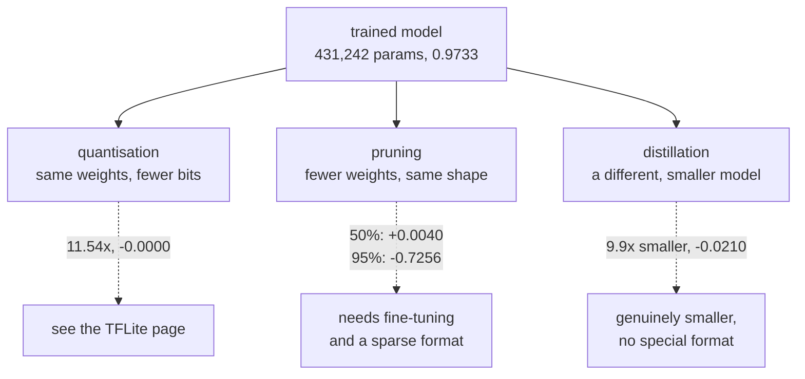

import DataCampExercise from "../../../../components/DataCampExercise.astro";
import Figure from "../../../../components/Figure.astro";
import Quiz from "../../../../components/Quiz.astro";

There are three ways to make a trained model smaller, and they work on different things.
**Quantisation** changes how each weight is stored. **Pruning** removes weights. **Distillation**
trains a different, smaller model to imitate the first one.

All three are measured here against one baseline: a 431,242-parameter convnet at **0.9733** test
accuracy. Two results are worth stating before the detail:

| Model | Estimated size | Accuracy | Against the baseline |
| --- | --- | --- | --- |
| Teacher (baseline) | 1,684.5 KB | 0.9733 | — |
| **Pruned 50%** | 1,263.4 KB | **0.9773** | **+0.0040** |
| Pruned 70% | 758.0 KB | 0.9760 | +0.0027 |
| Pruned 90% | 252.7 KB | 0.8797 | −0.0936 |
| Pruned 95% | 126.3 KB | 0.2477 | −0.7256 |
| Student, distilled | 170.7 KB | 0.9523 | −0.0210 |

Removing **half the weights made the model better**, and removing 95% of them made it worse than
guessing two classes. The interesting part of this page is what happens between those two rows.

## What you'll learn

- Why magnitude pruning needs a fine-tuning step, measured: it recovered **+0.4863** accuracy at
  90% sparsity.
- Where the cliff is, and why it is a cliff rather than a slope.
- What knowledge distillation transfers, and why it was worth only **+0.0017** here.
- Why the size numbers for pruning are an **estimate** and quantisation's are not.

## Magnitude pruning

The rule is as simple as it sounds: set the smallest weights to zero.

```python title="Prune, then repair"
threshold = np.quantile(np.abs(weights), sparsity)
pruned = np.where(np.abs(weights) < threshold, 0.0, weights)
```

Then fine-tune, re-applying the mask after every epoch:

```python title="The line everyone forgets"
for _ in range(FINETUNE_EPOCHS):
    model.fit(x_train, y_train, epochs=1, verbose=0)
    # Gradient descent has no idea those weights are supposed to be zero, and
    # will happily refill them. Without this line the accuracy looks great and
    # the sparsity is gone.
    model.set_weights([w * m if m is not None else w
                       for w, m in zip(model.get_weights(), masks)])
```

That masking step is not a detail. Adam updates every weight with a non-zero gradient, including
the pruned ones, so after one epoch of ordinary fine-tuning the model is dense again — with a
good accuracy and none of the compression you thought you had. The measured sparsities on this
page (50.00%, 69.95%, 89.98%, 94.95%, 98.98%) are checked *after* fine-tuning for exactly that
reason.

<Figure
  src="/images/dl/phase-08-scaling/compression/pruning"
  alt="Left: two accuracy curves against sparsity. Without fine-tuning, accuracy holds until 70% then collapses to 0.3933 at 90% and 0.1300 at 95%. With three epochs of fine-tuning it stays above 0.97 to 70%, recovers to 0.8797 at 90%, but only reaches 0.2477 at 95%. Right: bars of the accuracy recovered by fine-tuning at each level, peaking at +0.4863 at 90% sparsity."
  title="431,242 parameters, three epochs of fine-tuning after each pruning step"
  caption="The gap between the two curves is the whole technique. At 70% sparsity pruning alone costs 0.0343 and fine-tuning gives back 0.0370. At 90% the raw pruned model is at 0.3933 — barely better than chance — and fine-tuning restores it to 0.8797. Past that, at 95% and 99%, there is no longer enough capacity left to recover: +0.1177 and +0.0000."
/>

| Sparsity | Pruned, no fine-tuning | Fine-tuned | Recovered |
| --- | --- | --- | --- |
| 50% | 0.9723 | **0.9773** | +0.0050 |
| 70% | 0.9390 | 0.9760 | +0.0370 |
| 90% | 0.3933 | 0.8797 | **+0.4863** |
| 95% | 0.1300 | 0.2477 | +0.1177 |
| 99% | 0.1133 | 0.1133 | +0.0000 |

### Pruning half the model improved it

0.9773 against the baseline's 0.9733. That is not a rounding artefact — it is a 0.0040 gain from
*deleting* 215,000 weights.

The honest explanation is that removing small weights is a **regulariser**. A weight near zero
contributes almost nothing to the forward pass but still contributes noise to the gradient of
everything downstream; zeroing it and then fine-tuning lets the remaining weights re-fit without
that interference. It is closely related to why dropout works, and it means "compression" and
"accuracy" are not always in tension at moderate ratios.

Be careful not to over-read it: this is one run on one architecture, and a 0.0040 gain on a
3,000-sample test set is about 12 predictions. The safe claim is that pruning to 50–70% cost
nothing here.

### And why 95% is a cliff, not a slope

Between 90% and 95% the model goes from recoverable (0.8797) to destroyed (0.2477), and at 99% it
is a constant predictor that fine-tuning cannot revive at all. Sparsity is not a dial with a
smooth trade curve; there is a point where the surviving weights can no longer represent the
function, and no amount of fine-tuning creates capacity that is not there.

The practical consequence: **sweep it**. The right sparsity for a given architecture cannot be
guessed, and the difference between the last good setting and the first useless one was five
percentage points here.

## Distillation

A small model trained on the teacher's **soft** outputs rather than on the hard labels:

$$
\mathcal{L} = (1-\alpha)\,\mathcal{L}_{\text{hard}}(y, z_s)
+ \alpha T^2 \,\mathcal{L}_{\text{soft}}\!\left(\sigma(z_t/T),\, \sigma(z_s/T)\right)
$$

The temperature $T$ flattens both distributions so the teacher's *relative* opinions about wrong
classes survive — that a particular 4 looks somewhat like a 9 is information the one-hot label
throws away. The $T^2$ factor compensates for the gradient shrinking by $1/T^2$ when the logits
are divided.

<Figure
  src="/images/dl/phase-08-scaling/compression/distillation"
  alt="Left: test accuracy per epoch for a small student trained alone and the same student distilled from the teacher, the two curves nearly overlapping and ending at 0.9507 and 0.9523, both below the teacher's 0.9733. Right: a bar chart comparing a one-hot hard label against the teacher's temperature-4 soft targets for one ambiguous digit, where the soft target spreads probability across several plausible classes."
  title="43,706 parameters, 9.9x smaller than the teacher, same budget"
  caption="Distillation was worth +0.0017 here — 0.9523 against 0.9507 — which on a 3,000-sample test set is about five predictions and is not distinguishable from run-to-run noise with one seed each. The right panel shows what it is supposed to transfer: the hard label says only '4', while the teacher at T=4 also reports how much the image resembles the other classes."
/>

**The mechanism is real and the benefit here was negligible.** Both statements are supported by
the figure, and the reason is that MNIST is too easy: the student alone already reaches 0.9507,
so there is only 0.0226 of headroom to the teacher and very little dark knowledge to transfer.
Distillation earns its reputation on harder tasks where the gap between a small model trained
alone and a large one is wide.

What it did buy is the *only* genuinely smaller architecture on this page. Pruning leaves a
431,242-parameter model with zeros in it; the student really has 43,706 parameters, and needs no
special format to benefit.

## Comparing the three families

<Figure
  src="/images/dl/phase-08-scaling/compression/frontier"
  alt="A scatter plot of accuracy against estimated size on a log axis. The teacher sits at 1684 KB and 0.9733; pruned models trace a curve down and to the left, holding accuracy to 758 KB then falling off sharply; the two students sit at 170.7 KB with accuracy around 0.951, above the pruned models of comparable size."
  title="Every compressed model on one axis"
  caption="The two families cross. Above roughly 250 KB pruning is the better option — pruned 70% keeps 0.9760 at 758 KB. Below that it collapses, and the distilled student holds 0.9523 at 170.7 KB where pruned 90% manages only 0.8797 at 252.7 KB. Neither dominates; the crossover is what a real deployment decision turns on."
/>



### A caveat about the pruning sizes

The pruned sizes on this page are **estimates**, and the quantised ones on the
[TFLite page](/deep-learning/phase-08---scaling--deploying-deep-models/deploying-to-mobile--edge-with-tensorflow-lite/)
are measured files. The estimate assumes a sparse format costing a value plus a 16-bit index per
surviving weight.

Keras writes the dense array regardless. A model pruned to 90% saved on disk is exactly the same
size as the original — the zeros are stored like any other float. That saving is only real if the
deployment runtime supports a sparse format, and many do not. Quantisation's saving needs no such
cooperation, which is a large practical advantage that the accuracy numbers alone do not show.

The three also **compose**: pruning then quantising a model applies both reductions, and the
TFLite converter will happily quantise a model full of zeros.

```p5 title="What magnitude pruning removes" desc="Drag the sparsity slider. The bars are a weight distribution; the dimmed ones are set to zero, and the readout gives the measured accuracy at that level." height="360"
let sparsity = 0.5;
const MEASURED = [
  [0.0, 0.9733, 0.9733],
  [0.5, 0.9723, 0.9773],
  [0.7, 0.9390, 0.9760],
  [0.9, 0.3933, 0.8797],
  [0.95, 0.1300, 0.2477],
  [0.99, 0.1133, 0.1133],
];
let weights = [];
function setup() {
  createCanvas(620, 360);
  textFont("monospace");
  let seed = 7;
  const rnd = () => {
    seed = (seed * 1103515245 + 12345) % 2147483648;
    return seed / 2147483648;
  };
  for (let i = 0; i < 60; i++) {
    const u1 = Math.max(rnd(), 1e-6);
    const u2 = rnd();
    weights.push(Math.sqrt(-2 * Math.log(u1)) * Math.cos(2 * Math.PI * u2) * 0.4);
  }
}
function nearest() {
  let best = MEASURED[0];
  let gap = 99;
  for (const row of MEASURED) {
    if (Math.abs(row[0] - sparsity) < gap) { gap = Math.abs(row[0] - sparsity); best = row; }
  }
  return best;
}
function draw() {
  background(13, 17, 23);
  const sorted = weights.map((w) => Math.abs(w)).sort((a, b) => a - b);
  const cut = sorted[Math.min(sorted.length - 1,
    Math.floor(sparsity * sorted.length))];
  let removed = 0;
  noStroke();
  fill(230);
  textSize(12);
  textAlign(LEFT, TOP);
  text("60 weights, smallest " + (sparsity * 100).toFixed(0) + "% removed", 30, 20);
  const baseline = 200;
  const width = 8;
  for (let i = 0; i < weights.length; i++) {
    const x = 40 + i * 9.4;
    const height = weights[i] * 110;
    const kill = Math.abs(weights[i]) < cut;
    if (kill) { removed += 1; fill(60, 68, 80); }
    else if (weights[i] >= 0) { fill(107, 169, 221); }
    else { fill(224, 108, 117); }
    if (height >= 0) { rect(x, baseline - height, width, height, 2); }
    else { rect(x, baseline, width, -height, 2); }
  }
  stroke(120);
  line(30, baseline, 600, baseline);
  drawingContext.setLineDash([4, 4]);
  stroke(255, 211, 67);
  line(30, baseline - cut * 110, 600, baseline - cut * 110);
  line(30, baseline + cut * 110, 600, baseline + cut * 110);
  drawingContext.setLineDash([]);
  noStroke();
  fill(255, 211, 67);
  textSize(9.5);
  text("threshold +/-" + cut.toFixed(3), 30, baseline - cut * 110 - 14);
  const row = nearest();
  fill(150);
  textSize(10.5);
  text(removed + " of 60 weights zeroed", 30, 250);
  fill(224, 108, 117);
  textSize(11);
  text("measured at " + (row[0] * 100).toFixed(0) + "%: no fine-tuning "
    + row[1].toFixed(4), 30, 272);
  fill(126, 192, 143);
  text("                      fine-tuned  " + row[2].toFixed(4), 30, 290);
  fill(60, 70, 84);
  rect(30, 334, 300, 4, 2);
  fill(255, 211, 67);
  circle(30 + sparsity * 300, 336, 12);
  fill(120);
  textSize(9);
  text("drag: sparsity", 350, 330);
}
function mousePressed() { mouseDragged(); }
function mouseDragged() {
  if (mouseY < 322) { return; }
  sparsity = Math.min(Math.max((mouseX - 30) / 300, 0), 0.99);
}
```

```p5 title="The measured table, ranked" desc="Click a column to rank every row by it. The bars are that column's values and the highest and lowest are computed from the numbers, not written in." height="306"
let metric = 0;
const COLUMNS = ["Accuracy"];
const ROWS = [
  ["Teacher (baseline)", 0.9733],
  ["Pruned 50%", 0.9773],
  ["Pruned 70%", 0.976],
  ["Pruned 90%", 0.8797],
  ["Pruned 95%", 0.2477],
  ["Student, distilled", 0.9523]
];
function setup() {
  createCanvas(620, 306);
  textFont("monospace");
}
function fmt(v) {
  if (v === 0) { return "0"; }
  const a = Math.abs(v);
  if (a >= 1000 || a < 0.001) { return v.toExponential(2); }
  if (a >= 100) { return v.toFixed(1); }
  return v.toFixed(4);
}
function draw() {
  background(13, 17, 23);
  noStroke();
  fill(230);
  textSize(12);
  textAlign(LEFT, TOP);
  text("Model Compression (Pruning, Quanti", 26, 16);
  let x = 26;
  for (let i = 0; i < COLUMNS.length; i++) {
    const w = COLUMNS[i].length * 6.6 + 16;
    if (i === metric) { fill(255, 211, 67); } else { fill(48, 56, 68); }
    rect(x, 40, w, 22, 4);
    if (i === metric) { fill(13, 17, 23); } else { fill(180); }
    textSize(9);
    text(COLUMNS[i], x + 8, 47);
    x += w + 6;
    if (x > 500) { break; }
  }
  const values = ROWS.map((r) => r[metric + 1]);
  const lo = Math.min(...values);
  const hi = Math.max(...values);
  const span = hi - lo === 0 ? 1 : hi - lo;
  const order = ROWS.slice().sort((a, b) => b[metric + 1] - a[metric + 1]);
  for (let i = 0; i < order.length; i++) {
    const y = 78 + i * 26;
    const v = order[i][metric + 1];
    fill(160);
    textSize(9);
    text(order[i][0], 26, y + 5);
    fill(34, 40, 50);
    rect(230, y, 280, 18, 3);
    const frac = (v - lo) / span;
    if (v === hi) { fill(126, 192, 143); }
    else if (v === lo) { fill(224, 108, 117); }
    else { fill(107, 169, 221); }
    rect(230, y, Math.max(frac * 280, 3), 18, 3);
    fill(225);
    textSize(9);
    text(fmt(v), 518, y + 5);
  }
  const top = order[0];
  const bottom = order[order.length - 1];
  fill(150);
  textSize(9);
  const base = 78 + order.length * 26 + 8;
  text("highest " + COLUMNS[metric] + ": " + top[0] + " at " + fmt(top[1]),
       26, base);
  text("lowest  " + COLUMNS[metric] + ": " + bottom[0] + " at "
       + fmt(bottom[1]), 26, base + 14);
  text("bars are scaled within the chosen column - lowest is not zero", 26,
       base + 30);
}
function mousePressed() {
  let x = 26;
  for (let i = 0; i < COLUMNS.length; i++) {
    const w = COLUMNS[i].length * 6.6 + 16;
    if (mouseX > x && mouseX < x + w && mouseY > 40 && mouseY < 62) {
      metric = i;
    }
    x += w + 6;
  }
}
```

## Pitfalls

- **Fine-tuning without re-applying the mask.** Gradient descent refills the pruned weights; the
  accuracy looks fine and the sparsity is gone.
- **Reporting pruning as a size saving without a sparse format.** A dense file of mostly zeros is
  the same size as a dense file of weights.
- **Assuming sparsity trades smoothly.** 90% recovered to 0.8797 and 95% to 0.2477.
- **Skipping the fine-tuning step and concluding pruning does not work.** At 90% that is the
  difference between 0.3933 and 0.8797.
- **Reading +0.0040 or +0.0017 as a real improvement.** On a 3,000-sample test set those are
  roughly 12 and 5 predictions, from one seed.
- **Expecting distillation to shine on an easy task.** The student alone was already within
  0.0226 of the teacher.
- **Forgetting the $T^2$ factor.** Dividing logits by $T$ shrinks the gradient by $1/T^2$, so the
  soft term silently stops contributing.

## Recap

- Pruning to 50% *improved* accuracy to 0.9773 against 0.9733, acting as a regulariser.
- Fine-tuning after pruning is the technique: worth +0.4863 at 90% sparsity.
- The failure is a cliff, not a slope — 0.8797 at 90%, 0.2477 at 95%, 0.1133 at 99%.
- Distillation gave a 9.9× smaller model at 0.9523, worth +0.0017 over training the same student
  alone, which is within noise here.
- Pruning's size saving depends on a sparse deployment format; quantisation's does not.
- Above ~250 KB pruning won, below it the distilled student won — the families cross.

## Next

Compression assumes the model is finished. The other way to spend a fixed budget is on finding a
better model in the first place:
[Hyperparameter Tuning with KerasTuner](/deep-learning/phase-08---scaling--deploying-deep-models/hyperparameter-tuning-with-kerastuner/).

<Quiz
  questions={[
    {
      q: "Pruning 50% of the weights raised accuracy from 0.9733 to 0.9773. How can deleting weights help?",
      options: [
        "The measurement must be wrong",
        "Removing near-zero weights acts as a regulariser — they contribute almost nothing to the forward pass but add noise downstream, so the remaining weights re-fit better once they are gone",
        "Pruning increases the learning rate",
        "The pruned model was trained for longer",
      ],
      answer: 1,
      explain: "It is closely related to why dropout works. The gain is small — about 12 predictions on a 3,000-sample test set — so the safe claim is that pruning to 50% cost nothing.",
    },
    {
      q: "Why must the pruning mask be re-applied after every fine-tuning epoch?",
      options: [
        "To keep the file size down",
        "Because gradient descent updates every weight with a non-zero gradient, including the pruned ones — after one ordinary epoch the model is dense again, with good accuracy and no compression",
        "Because Keras resets weights between epochs",
        "To prevent overfitting",
      ],
      answer: 1,
      explain: "This is why the measured sparsities are checked after fine-tuning: 50.00%, 69.95%, 89.98%, and so on.",
    },
    {
      q: "Accuracy after fine-tuning was 0.8797 at 90% sparsity and 0.2477 at 95%. What does that shape tell you?",
      options: [
        "The fine-tuning budget was too small at 95%",
        "Sparsity is not a smooth trade — there is a point where the surviving weights cannot represent the function, and fine-tuning cannot create capacity that is not there",
        "The model was badly initialised",
        "95% sparsity is always too aggressive",
      ],
      answer: 1,
      explain: "Fine-tuning recovered +0.4863 at 90% and only +0.1177 at 95%, so the recovery mechanism itself breaks down rather than merely needing more epochs.",
    },
    {
      q: "Distillation produced 0.9523 against 0.9507 for the same student trained alone. What is the honest conclusion?",
      options: [
        "Distillation does not work",
        "The mechanism is real but the benefit here is negligible and within noise — MNIST is easy enough that the student alone was already within 0.0226 of the teacher, leaving little to transfer",
        "The temperature was set wrongly",
        "The student was too large",
      ],
      answer: 1,
      explain: "Distillation earns its reputation where the gap between a small model trained alone and a large one is wide, which is not the case here.",
    },
    {
      q: "Why are the pruned model sizes on this page called estimates while the quantised sizes on the TFLite page are not?",
      options: [
        "Pruning is less precise than quantisation",
        "Keras stores zeros like any other float, so a pruned model on disk is the same size as the original — the saving only exists if the deployment runtime supports a sparse format, whereas quantisation needs no such cooperation",
        "The estimate ignores the biases",
        "Pruned models cannot be saved",
      ],
      answer: 1,
      explain: "The estimate assumes a value plus a 16-bit index per surviving weight, which is what a CSR-style format costs — but nothing in the standard save path produces that.",
    },
  ]}
/>

## 🧪 Try It Yourself

<DataCampExercise
  lang="python"
  hint={`Use np.quantile on the absolute values to find the cut-off, then zero everything below it.`}
  code={`# Task: Exercise 1 - Magnitude pruning, by hand
import numpy as np

rng = np.random.default_rng(0)
weights = rng.normal(0, 0.1, (200, 100))


def prune(array, sparsity):
    """Zero the smallest weights by absolute value."""
    if sparsity <= 0:
        return array.copy()
    threshold = np.quantile(np.abs(array), ___)     # replace ___ with sparsity
    return np.where(np.abs(array) < threshold, 0.0, array)


print(f"{'target':>8} {'actual zeros':>13} {'kept weights':>13} "
      f"{'largest removed':>16}")
for sparsity in (0.0, 0.5, 0.7, 0.9, 0.95, 0.99):
    pruned = prune(weights, sparsity)
    zeros = float((pruned == 0).mean())
    removed = np.abs(weights[pruned == 0])
    largest = float(removed.max()) if removed.size else 0.0
    print(f"{sparsity:8.0%} {zeros:13.2%} {int((pruned != 0).sum()):13,} "
          f"{largest:16.5f}")

print(f"\\nthe weights being deleted are tiny: even at 99% sparsity nothing")
print(f"larger than {np.abs(weights[prune(weights, 0.99) == 0]).max():.4f} is removed")`}
  solution={`import numpy as np

rng = np.random.default_rng(0)
weights = rng.normal(0, 0.1, (200, 100))


def prune(array, sparsity):
    """Zero the smallest weights by absolute value."""
    if sparsity <= 0:
        return array.copy()
    threshold = np.quantile(np.abs(array), sparsity)
    return np.where(np.abs(array) < threshold, 0.0, array)


print(f"{'target':>8} {'actual zeros':>13} {'kept weights':>13} "
      f"{'largest removed':>16}")
for sparsity in (0.0, 0.5, 0.7, 0.9, 0.95, 0.99):
    pruned = prune(weights, sparsity)
    zeros = float((pruned == 0).mean())
    removed = np.abs(weights[pruned == 0])
    largest = float(removed.max()) if removed.size else 0.0
    print(f"{sparsity:8.0%} {zeros:13.2%} {int((pruned != 0).sum()):13,} "
          f"{largest:16.5f}")

print(f"\\nthe weights being deleted are tiny: even at 99% sparsity nothing")
print(f"larger than {np.abs(weights[prune(weights, 0.99) == 0]).max():.4f} is removed")`}
/>

<DataCampExercise
  lang="python"
  hint={`Multiply the weights by the mask after each update. Without that step the zeroed entries drift away from zero.`}
  code={`# Task: Exercise 2 - Why the mask has to be re-applied
import numpy as np

rng = np.random.default_rng(0)
weights = rng.normal(0, 0.1, 1000)
mask = (np.abs(weights) >= np.quantile(np.abs(weights), 0.9)).astype(float)
weights = weights * mask                       # 90% sparse to begin with


def fine_tune(values, mask, epochs=3, reapply=True):
    """Stand-in for training: every weight gets a gradient every step."""
    current = values.copy()
    for _ in range(epochs):
        current = current + rng.normal(0, 0.01, current.shape)   # the update
        if reapply:
            current = current * ___              # replace ___ with mask
    return current


for reapply in (True, False):
    result = fine_tune(weights, mask, reapply=reapply)
    sparsity = float((result == 0).mean())
    print(f"re-apply mask {str(reapply):5s}: sparsity after fine-tuning "
          f"{sparsity:.2%}")

print("\\nwithout the mask the model is dense again after one epoch, and")
print("nothing in the training logs would tell you")`}
  solution={`import numpy as np

rng = np.random.default_rng(0)
weights = rng.normal(0, 0.1, 1000)
mask = (np.abs(weights) >= np.quantile(np.abs(weights), 0.9)).astype(float)
weights = weights * mask                       # 90% sparse to begin with


def fine_tune(values, mask, epochs=3, reapply=True):
    """Stand-in for training: every weight gets a gradient every step."""
    current = values.copy()
    for _ in range(epochs):
        current = current + rng.normal(0, 0.01, current.shape)   # the update
        if reapply:
            current = current * mask
    return current


for reapply in (True, False):
    result = fine_tune(weights, mask, reapply=reapply)
    sparsity = float((result == 0).mean())
    print(f"re-apply mask {str(reapply):5s}: sparsity after fine-tuning "
          f"{sparsity:.2%}")

print("\\nwithout the mask the model is dense again after one epoch, and")
print("nothing in the training logs would tell you")`}
  expectedOutput={`re-apply mask True : sparsity after fine-tuning 90.00%
re-apply mask False: sparsity after fine-tuning 0.00%

without the mask the model is dense again after one epoch, and
nothing in the training logs would tell you`}
/>

<DataCampExercise
  lang="python"
  hint={`Divide the logits by the temperature before the softmax. Higher temperature flattens the distribution.`}
  code={`# Task: Exercise 3 - What temperature reveals
import numpy as np

# A teacher's logits for an ambiguous handwritten 4.
LOGITS = np.array([-2.1, -3.4, -1.2, 0.4, 6.8, -2.9, -1.8, 1.1, 0.2, 4.9])


def soften(logits, temperature):
    scaled = logits / ___                        # replace ___ with temperature
    scaled = scaled - scaled.max()
    exponentiated = np.exp(scaled)
    return exponentiated / exponentiated.sum()


print(f"{'T':>5} " + " ".join(f"{i:>7}" for i in range(10)))
for temperature in (1.0, 2.0, 4.0, 8.0):
    row = soften(LOGITS, temperature)
    print(f"{temperature:5.1f} " + " ".join(f"{v:7.4f}" for v in row))

hard = np.zeros(10)
hard[int(np.argmax(LOGITS))] = 1.0
print(f"{'hard':>5} " + " ".join(f"{v:7.4f}" for v in hard))
print("\\nat T=1 the teacher says '4' and almost nothing else; at T=4 it also")
print("says the digit resembles a 9, which is what the student learns from")`}
  solution={`import numpy as np

# A teacher's logits for an ambiguous handwritten 4.
LOGITS = np.array([-2.1, -3.4, -1.2, 0.4, 6.8, -2.9, -1.8, 1.1, 0.2, 4.9])


def soften(logits, temperature):
    scaled = logits / temperature
    scaled = scaled - scaled.max()
    exponentiated = np.exp(scaled)
    return exponentiated / exponentiated.sum()


print(f"{'T':>5} " + " ".join(f"{i:>7}" for i in range(10)))
for temperature in (1.0, 2.0, 4.0, 8.0):
    row = soften(LOGITS, temperature)
    print(f"{temperature:5.1f} " + " ".join(f"{v:7.4f}" for v in row))

hard = np.zeros(10)
hard[int(np.argmax(LOGITS))] = 1.0
print(f"{'hard':>5} " + " ".join(f"{v:7.4f}" for v in hard))
print("\\nat T=1 the teacher says '4' and almost nothing else; at T=4 it also")
print("says the digit resembles a 9, which is what the student learns from")`}
/>

<DataCampExercise
  lang="python"
  hint={`A dense array stores every weight; a sparse one stores only the survivors plus an index each. Work out where the two cross.`}
  code={`# Task: Exercise 4 - When is a sparse format actually smaller?
PARAMETERS = 431_242
DENSE_BYTES_PER_WEIGHT = 4
SPARSE_BYTES_PER_WEIGHT = 6        # value (4) + 16-bit index (2)


def dense_kb(parameters):
    return parameters * DENSE_BYTES_PER_WEIGHT / 1024


def sparse_kb(parameters, sparsity):
    surviving = parameters * (1 - sparsity)
    return surviving * ___ / 1024                # replace with SPARSE_BYTES_PER_WEIGHT


print(f"{'sparsity':>9} {'dense KB':>10} {'sparse KB':>11} {'smaller?':>10}")
for sparsity in (0.0, 0.3, 0.33, 0.5, 0.7, 0.9):
    dense = dense_kb(PARAMETERS)
    sparse = sparse_kb(PARAMETERS, sparsity)
    print(f"{sparsity:9.0%} {dense:10.1f} {sparse:11.1f} "
          f"{'yes' if sparse < dense else 'no':>10}")

crossover = 1 - DENSE_BYTES_PER_WEIGHT / SPARSE_BYTES_PER_WEIGHT
print(f"\\nsparse storage only wins above {crossover:.1%} sparsity - below that")
print("the indices cost more than the zeros save")`}
  solution={`PARAMETERS = 431_242
DENSE_BYTES_PER_WEIGHT = 4
SPARSE_BYTES_PER_WEIGHT = 6        # value (4) + 16-bit index (2)


def dense_kb(parameters):
    return parameters * DENSE_BYTES_PER_WEIGHT / 1024


def sparse_kb(parameters, sparsity):
    surviving = parameters * (1 - sparsity)
    return surviving * SPARSE_BYTES_PER_WEIGHT / 1024


print(f"{'sparsity':>9} {'dense KB':>10} {'sparse KB':>11} {'smaller?':>10}")
for sparsity in (0.0, 0.3, 0.33, 0.5, 0.7, 0.9):
    dense = dense_kb(PARAMETERS)
    sparse = sparse_kb(PARAMETERS, sparsity)
    print(f"{sparsity:9.0%} {dense:10.1f} {sparse:11.1f} "
          f"{'yes' if sparse < dense else 'no':>10}")

crossover = 1 - DENSE_BYTES_PER_WEIGHT / SPARSE_BYTES_PER_WEIGHT
print(f"\\nsparse storage only wins above {crossover:.1%} sparsity - below that")
print("the indices cost more than the zeros save")`}
  expectedOutput={` sparsity   dense KB   sparse KB   smaller?
       0%     1684.5      2526.8         no
      30%     1684.5      1768.8         no
      33%     1684.5      1693.0         no
      50%     1684.5      1263.4        yes
      70%     1684.5       758.0        yes
      90%     1684.5       252.7        yes

sparse storage only wins above 33.3% sparsity - below that
the indices cost more than the zeros save`}
/>

<DataCampExercise
  lang="python"
  hint={`Combine the hard-label loss and the temperature-scaled soft loss, remembering the T squared factor on the soft term.`}
  code={`# Task: Exercise 5 - The distillation loss, and the T-squared factor
import numpy as np

TEACHER = np.array([-2.1, -3.4, -1.2, 0.4, 6.8, -2.9, -1.8, 1.1, 0.2, 4.9])
STUDENT = np.array([-1.5, -2.8, -0.9, 0.7, 5.2, -2.2, -1.1, 0.9, 0.4, 3.1])
LABEL = 4
ALPHA = 0.7


def softmax(logits):
    shifted = logits - logits.max()
    exponentiated = np.exp(shifted)
    return exponentiated / exponentiated.sum()


def cross_entropy(target, predicted):
    return float(-np.sum(target * np.log(np.clip(predicted, 1e-12, None))))


def distillation_loss(teacher, student, label, temperature, alpha=ALPHA):
    hard = np.zeros(10)
    hard[label] = 1.0
    hard_loss = cross_entropy(hard, softmax(student))
    soft_loss = cross_entropy(softmax(teacher / temperature),
                              softmax(student / temperature))
    # Dividing logits by T shrinks the gradient by 1/T^2; this restores it.
    return (1 - alpha) * hard_loss + alpha * soft_loss * temperature ** ___  # 2


print(f"{'T':>5} {'with T^2':>10} {'without T^2':>13} {'ratio':>8}")
for temperature in (1.0, 2.0, 4.0, 8.0):
    with_factor = distillation_loss(TEACHER, STUDENT, LABEL, temperature)
    hard = np.zeros(10)
    hard[LABEL] = 1.0
    without = ((1 - ALPHA) * cross_entropy(hard, softmax(STUDENT))
               + ALPHA * cross_entropy(softmax(TEACHER / temperature),
                                       softmax(STUDENT / temperature)))
    print(f"{temperature:5.1f} {with_factor:10.4f} {without:13.4f} "
          f"{with_factor / without:8.2f}")

print("\\nwithout the T^2 factor the soft term shrinks as the temperature")
print("rises, so raising T quietly turns distillation off")`}
  solution={`import numpy as np

TEACHER = np.array([-2.1, -3.4, -1.2, 0.4, 6.8, -2.9, -1.8, 1.1, 0.2, 4.9])
STUDENT = np.array([-1.5, -2.8, -0.9, 0.7, 5.2, -2.2, -1.1, 0.9, 0.4, 3.1])
LABEL = 4
ALPHA = 0.7


def softmax(logits):
    shifted = logits - logits.max()
    exponentiated = np.exp(shifted)
    return exponentiated / exponentiated.sum()


def cross_entropy(target, predicted):
    return float(-np.sum(target * np.log(np.clip(predicted, 1e-12, None))))


def distillation_loss(teacher, student, label, temperature, alpha=ALPHA):
    hard = np.zeros(10)
    hard[label] = 1.0
    hard_loss = cross_entropy(hard, softmax(student))
    soft_loss = cross_entropy(softmax(teacher / temperature),
                              softmax(student / temperature))
    # Dividing logits by T shrinks the gradient by 1/T^2; this restores it.
    return (1 - alpha) * hard_loss + alpha * soft_loss * temperature ** 2


print(f"{'T':>5} {'with T^2':>10} {'without T^2':>13} {'ratio':>8}")
for temperature in (1.0, 2.0, 4.0, 8.0):
    with_factor = distillation_loss(TEACHER, STUDENT, LABEL, temperature)
    hard = np.zeros(10)
    hard[LABEL] = 1.0
    without = ((1 - ALPHA) * cross_entropy(hard, softmax(STUDENT))
               + ALPHA * cross_entropy(softmax(TEACHER / temperature),
                                       softmax(STUDENT / temperature)))
    print(f"{temperature:5.1f} {with_factor:10.4f} {without:13.4f} "
          f"{with_factor / without:8.2f}")

print("\\nwithout the T^2 factor the soft term shrinks as the temperature")
print("rises, so raising T quietly turns distillation off")`}
/>

<DataCampExercise
  lang="python"
  hint={`Prune, then fine-tune while re-applying the mask after each epoch, and compare with fine-tuning that skips the mask.`}
  code={`# Task: Exercise 6 - Prune and recover a real model
import numpy as np
from tensorflow import keras

keras.utils.set_random_seed(0)
(x_train, y_train), (x_test, y_test) = keras.datasets.mnist.load_data()
x_train = (x_train[:8000, ..., None] / 255.0).astype("float32")
x_test = (x_test[:2000, ..., None] / 255.0).astype("float32")

model = keras.Sequential([
    keras.layers.Input((28, 28, 1)),
    keras.layers.Conv2D(16, 3, activation="relu"),
    keras.layers.MaxPooling2D(),
    keras.layers.Flatten(),
    keras.layers.Dense(128, activation="relu"),
    keras.layers.Dense(10),
])
model.compile(keras.optimizers.Adam(1e-3),
              keras.losses.SparseCategoricalCrossentropy(from_logits=True),
              metrics=["accuracy"])
model.fit(x_train, y_train[:8000], epochs=4, batch_size=128, verbose=0)
baseline = model.evaluate(x_test, y_test[:2000], verbose=0)[1]

SPARSITY = 0.9
weights = model.get_weights()
pruned = []
for array in weights:
    if array.ndim < 2:
        pruned.append(array)
        continue
    threshold = np.quantile(np.abs(array), SPARSITY)
    pruned.append(np.where(np.abs(array) < threshold, 0.0, array))
model.set_weights(pruned)
masks = [(np.abs(w) > 0).astype("float32") if w.ndim >= 2 else None
         for w in model.get_weights()]
immediate = model.evaluate(x_test, y_test[:2000], verbose=0)[1]

for _ in range(3):
    model.fit(x_train, y_train[:8000], epochs=1, batch_size=128, verbose=0)
    model.set_weights([w * m if m is not None else w
                       for w, m in zip(model.get_weights(), ___)])  # masks
recovered = model.evaluate(x_test, y_test[:2000], verbose=0)[1]
sparsity = np.mean([(w == 0).mean() for w in model.get_weights() if w.ndim >= 2])

print(f"baseline:            {baseline:.4f}")
print(f"pruned {SPARSITY:.0%}, no repair: {immediate:.4f}")
print(f"after fine-tuning:   {recovered:.4f}  (recovered {recovered - immediate:+.4f})")
print(f"sparsity retained:   {sparsity:.2%}")`}
  solution={`import numpy as np
from tensorflow import keras

keras.utils.set_random_seed(0)
(x_train, y_train), (x_test, y_test) = keras.datasets.mnist.load_data()
x_train = (x_train[:8000, ..., None] / 255.0).astype("float32")
x_test = (x_test[:2000, ..., None] / 255.0).astype("float32")

model = keras.Sequential([
    keras.layers.Input((28, 28, 1)),
    keras.layers.Conv2D(16, 3, activation="relu"),
    keras.layers.MaxPooling2D(),
    keras.layers.Flatten(),
    keras.layers.Dense(128, activation="relu"),
    keras.layers.Dense(10),
])
model.compile(keras.optimizers.Adam(1e-3),
              keras.losses.SparseCategoricalCrossentropy(from_logits=True),
              metrics=["accuracy"])
model.fit(x_train, y_train[:8000], epochs=4, batch_size=128, verbose=0)
baseline = model.evaluate(x_test, y_test[:2000], verbose=0)[1]

SPARSITY = 0.9
weights = model.get_weights()
pruned = []
for array in weights:
    if array.ndim < 2:
        pruned.append(array)
        continue
    threshold = np.quantile(np.abs(array), SPARSITY)
    pruned.append(np.where(np.abs(array) < threshold, 0.0, array))
model.set_weights(pruned)
masks = [(np.abs(w) > 0).astype("float32") if w.ndim >= 2 else None
         for w in model.get_weights()]
immediate = model.evaluate(x_test, y_test[:2000], verbose=0)[1]

for _ in range(3):
    model.fit(x_train, y_train[:8000], epochs=1, batch_size=128, verbose=0)
    model.set_weights([w * m if m is not None else w
                       for w, m in zip(model.get_weights(), masks)])
recovered = model.evaluate(x_test, y_test[:2000], verbose=0)[1]
sparsity = np.mean([(w == 0).mean() for w in model.get_weights() if w.ndim >= 2])

print(f"baseline:            {baseline:.4f}")
print(f"pruned {SPARSITY:.0%}, no repair: {immediate:.4f}")
print(f"after fine-tuning:   {recovered:.4f}  (recovered {recovered - immediate:+.4f})")
print(f"sparsity retained:   {sparsity:.2%}")`}
/>
