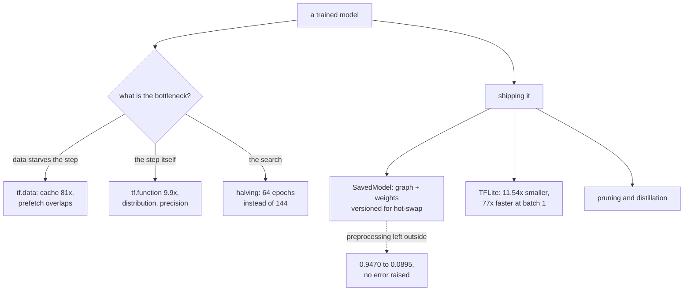

Every phase before this one ended with a trained model sitting in a notebook. This phase is about
the distance between that and something other people can use — and about how much of the standard
advice for crossing it is hardware-specific, already applied for you, or measurably wrong on the
machine in front of you.

Everything below was measured on this machine: TensorFlow 2.21, **CPU only, 8 cores, no GPU**. No
`keras_tuner`, no TensorFlow Serving binary. Those absences turned out to be useful — they forced
each page to measure the underlying mechanism rather than demonstrate an API.

## What was measured

| Page | The claim being tested | Result |
| --- | --- | --- |
| [tf.data](/deep-learning/phase-08---scaling--deploying-deep-models/loading--preprocessing-data-with-tfdata/) | Add `num_parallel_calls` for a big win | **Already applied** — tf.data rewrites a stateless `map` for you (3.53× of the 3.93×) |
| [Custom loops](/deep-learning/phase-08---scaling--deploying-deep-models/custom-models-and-training-loops-tensorflow/) | Hand-written loops are slower and riskier | Matched `fit` to 0.0010; **forgetting `@tf.function` costs 9.9× per step** |
| [tf.distribute](/deep-learning/phase-08---scaling--deploying-deep-models/distributed-training-with-tfdistribute/) | Distribution is nearly free | 1 replica costs **1.50×** before parallelising anything; updates halve 282 → 141 |
| [Hyperparameter tuning](/deep-learning/phase-08---scaling--deploying-deep-models/hyperparameter-tuning-with-kerastuner/) | Search strategies differ a lot | Halving found the **exact** best in 64 epochs; exhaustive needed 144 |
| [Mixed precision](/deep-learning/phase-08---scaling--deploying-deep-models/mixed-precision-and-multi-gpu-training/) | One line, roughly 2× faster | **40.65× SLOWER** here — it is a GPU feature, not a model feature |
| [TF Serving](/deep-learning/phase-08---scaling--deploying-deep-models/serving-models-with-tensorflow-serving/) | Serving is a packaging step | A client preprocessing differently dropped accuracy **0.9470 → 0.0895**, silently |
| [TensorFlow Lite](/deep-learning/phase-08---scaling--deploying-deep-models/deploying-to-mobile--edge-with-tensorflow-lite/) | Quantisation shrinks models | True (11.54×) — but **conversion alone** gave 3.06× and **77× lower latency** |
| [Model compression](/deep-learning/phase-08---scaling--deploying-deep-models/model-compression-pruning-quantisation-and-distillation/) | Compression costs accuracy | Pruning 50% **improved** it (0.9773 vs 0.9733); 95% destroyed it |
| [Limitations](/deep-learning/phase-08---scaling--deploying-deep-models/limitations-and-the-future-of-deep-learning/) | Deep learning generalises | Measured against rotation, shift, contrast and adversarial noise |

<Figure
  src="/images/dl/phase-08-scaling/mixed-precision/cpu-cost"
  alt="Left: bars of milliseconds per step for the three policies - 18.92 for float32, 769.21 for mixed_float16 and 67.50 for float64, each annotated with its ratio. Right: validation accuracy per epoch for the three policies, three nearly overlapping curves ending at 0.9073, 0.9067 and 0.9173."
  title="Identical model and batch, 8-core CPU, no GPU"
  caption="The right panel is the control: accuracy is essentially unaffected - 0.9073 against 0.9067 - so the float16 arithmetic is numerically adequate for this model with loss scaling in place. Only the speed claim fails. float64 is included as a reference point for what genuinely-more-work looks like: 3.57x, far more reasonable than the conversion overhead of a dtype the hardware cannot execute."
/>

<Figure
  src="/images/dl/phase-08-scaling/tflite/latency"
  alt="Left: horizontal bars of milliseconds per sample, with Keras at 1.627 far above the four TFLite variants between 0.021 and 0.033. Right: a scatter of accuracy against size on a log axis, showing all five variants at essentially the same accuracy across a 12x range of sizes."
  title="300 samples, batch of 1, through the TFLite interpreter"
  caption="Every TFLite variant is between 49x and 77x faster than Keras at batch size 1, and the differences among them are small - 0.021 ms for dynamic-range against 0.033 ms for float32. The right-hand panel is the summary of the whole page: a flat accuracy line across a 12x span of model sizes, which is why quantisation is close to free on a task like this."
/>

<Figure
  src="/images/dl/overviews/phase-summaries/phase-8"
  alt="Horizontal bars, one per page in the phase, each labelled with the claim it tested and coloured by the verdict: green where the standard story held, amber where it held at a price, red where the measurement contradicted it. 5 of 6 claims contradicted, 1 held at a price, 0 held."
  title="Every claim this phase set out to test"
  caption="Collected from the runs behind each page's own figures rather than measured afresh, so every bar is traceable to the page it names. Bar length is the log of the effect size, because the effects span from 0.0014 to 5,376 — the number that matters is printed on each bar. Across all nine phases, 34 of 54 claims were contradicted outright, 11 held at a cost that was worth stating, and 9 held as advertised."
/>

## The thread



Three lessons recur across the nine pages, and they are worth stating separately from the numbers.

**Most performance advice is hardware advice in disguise.** Mixed precision is the clearest case —
the same line that gives roughly 2× on tensor cores gave 40.65× *slower* here. The same is true of
distribution (1.50× overhead with nothing to parallelise onto) and of float16 more generally.
Measure one epoch on your own hardware before adopting any of it.

**Modern frameworks already applied the tutorial.** tf.data rewrote a stateless `map` into a
parallel one before being asked, so the classic "add `num_parallel_calls`" benchmark measures
almost nothing on default settings. Finding out what an option is worth now requires switching the
automatic rewrites **off**.

**Deployment failures do not raise exceptions.** A client that preprocesses differently from
training returns a perfectly-shaped probability vector at 8.5% accuracy and 0.81 confidence.
Quantisation changes 4 predictions in 2,000 without moving accuracy. Fine-tuning a pruned model
without re-applying the mask keeps the accuracy and silently discards the sparsity. Every one of
these is invisible unless something external is measuring it.

```p5 title="How often the standard story survived" desc="Step through the phases. Each bar splits the claims that phase tested into contradicted, held at a price, and held as advertised - the totals are summed live." height="400"
let picked = 0;
const PHASES = [
  [1, "Neural Network Foundations", 3, 0, 3, "a single neuron cannot do XOR - 0 of 40,401 weight pairs"],
  [2, "Training Deep Networks", 2, 2, 2, "146x the parameters bought 0.0150 accuracy"],
  [3, "Computer Vision", 4, 1, 1, "augmentation cost 0.1855 clean, bought 0.1105 rotated"],
  [4, "Sequence Models", 4, 2, 0, "a fixed state scored 0.0017 against attention's 1.0000"],
  [5, "NLP & Transformers", 4, 1, 1, "TF-IDF 0.8632 beat a transformer's 0.8462, 55x cheaper"],
  [6, "Generative", 3, 1, 2, "copying 200 real images scored FID 5.027 against real 9.605"],
  [7, "Reinforcement Learning", 4, 2, 0, "replay and target nets: 144.20 together, 53.45 either alone"],
  [8, "Scaling & Deployment", 5, 1, 0, "mixed precision measured 40.65x SLOWER on this CPU"],
  [9, "Capstones", 5, 1, 0, "a memoriser beat the VAE on Frechet distance"]
];
function setup() {
  createCanvas(620, 400);
  textFont("monospace");
}
function draw() {
  background(13, 17, 23);
  noStroke();
  fill(230);
  textSize(12);
  textAlign(LEFT, TOP);
  text("54 claims, 9 phases, every one tested by a measurement", 26, 16);
  let broke = 0;
  let cost = 0;
  let held = 0;
  for (let i = 0; i < PHASES.length; i++) {
    broke += PHASES[i][2];
    cost += PHASES[i][3];
    held += PHASES[i][4];
  }
  for (let i = 0; i < PHASES.length; i++) {
    const y = 48 + i * 26;
    const row = PHASES[i];
    const chosen = i === picked;
    fill(chosen ? 255 : 130, chosen ? 211 : 140, chosen ? 67 : 155);
    textSize(9);
    text("Phase " + row[0] + "  " + row[1], 26, y + 5);
    let x = 250;
    const unit = 34;
    fill(224, 108, 117);
    rect(x, y, row[2] * unit, 17, 2);
    x += row[2] * unit;
    fill(255, 211, 67);
    rect(x, y, row[3] * unit, 17, 2);
    x += row[3] * unit;
    fill(126, 192, 143);
    rect(x, y, row[4] * unit, 17, 2);
    if (chosen) {
      noFill();
      stroke(255, 211, 67);
      strokeWeight(1.5);
      rect(248, y - 2, 6 * unit + 4, 21, 3);
      noStroke();
    }
  }
  const row = PHASES[picked];
  fill(200);
  textSize(10);
  text("Phase " + row[0] + " headline:", 26, 300);
  fill(255, 211, 67);
  textSize(10);
  text(row[5], 26, 318);
  fill(150);
  textSize(9);
  text("contradicted " + row[2] + "   held at a price " + row[3]
       + "   held " + row[4], 26, 340);
  fill(224, 108, 117);
  rect(26, 360, 12, 12, 2);
  fill(150);
  textSize(9);
  text("contradicted  " + broke + " of 54", 44, 362);
  fill(255, 211, 67);
  rect(210, 360, 12, 12, 2);
  fill(150);
  text("held at a price  " + cost, 228, 362);
  fill(126, 192, 143);
  rect(400, 360, 12, 12, 2);
  fill(150);
  text("held  " + held, 418, 362);
  fill(110);
  textSize(8.5);
  text("click a row. Collected from each page's own measured run.", 26, 382);
}
function mousePressed() {
  for (let i = 0; i < PHASES.length; i++) {
    const y = 48 + i * 26;
    if (mouseY > y && mouseY < y + 20) { picked = i; }
  }
}
```

## Two numbers that changed how the rest of the phase was built

`model.predict()` costs about **470 ms per call** in a tight loop, an eager `model(x)` call about
**28 ms**, and a traced `tf.function` about **1.2 ms**. That 390× spread decided whether several
pages in this module — and the whole reinforcement-learning phase — were runnable at all.

And per-sample inference cost falls **14×** from batch 1 to batch 128. Framework overhead, not
arithmetic, dominates small-batch work; that single fact explains the TFLite latency result, the
serving batching scheduler, and why `predict()` is the wrong tool inside a loop.

```p5 title="What one forward pass costs" desc="Pick a way to run a batch through a model. The bar is the measured time per call on this machine, on a log scale because the spread is 390x." height="340"
let picked = 2;
const WAYS = [
  ["model.predict(x)", 470.0, "per-call setup built for large batches, paid every call"],
  ["model(x) eager", 28.0, "no setup, but every op dispatched from Python"],
  ["traced tf.function", 1.2, "one graph, compiled once, then just executed"],
];
function setup() {
  createCanvas(620, 340);
  textFont("monospace");
}
function draw() {
  background(13, 17, 23);
  noStroke();
  fill(230);
  textSize(12);
  textAlign(LEFT, TOP);
  text("one forward pass, same model, same batch", 26, 18);
  for (let i = 0; i < WAYS.length; i++) {
    const y = 58 + i * 62;
    const chosen = i === picked;
    if (chosen) { fill(255, 211, 67); } else { fill(150); }
    textSize(11);
    text(WAYS[i][0], 26, y);
    const span = Math.log10(WAYS[i][1] / 0.8) / Math.log10(470 / 0.8);
    fill(40, 47, 58);
    rect(26, y + 18, 480, 20, 3);
    if (chosen) { fill(255, 211, 67); } else { fill(70, 84, 102); }
    rect(26, y + 18, Math.max(span * 480, 6), 20, 3);
    fill(220);
    textSize(10);
    text(WAYS[i][1].toFixed(1) + " ms", 516, y + 22);
  }
  fill(150);
  textSize(9.5);
  text(WAYS[picked][2], 26, 250);
  fill(255, 211, 67);
  textSize(10.5);
  const ratio = (470.0 / WAYS[picked][1]).toFixed(0);
  text("that is " + ratio + "x the traced path cost", 26, 274);
  fill(150);
  textSize(9);
  text("an RL loop makes several of these per environment frame and needs", 26, 300);
  text("thousands of episodes - which is why this table decided the phase.", 26, 314);
}
function mousePressed() {
  for (let i = 0; i < WAYS.length; i++) {
    const y = 58 + i * 62;
    if (mouseY > y && mouseY < y + 46) { picked = i; }
  }
}
```

## Reading order

1. **tf.data** — get data to the model faster than it consumes it.
2. **Custom models and training loops** — replace `fit` when you need to, and pay the tracing cost
   knowingly.
3. **Distributed training** — what a strategy does to your batch, your update count and your
   learning rate.
4. **Hyperparameter tuning** — spend a fixed budget well.
5. **Mixed precision** — the clearest example of hardware-dependent advice.
6. **TensorFlow Serving** — the SavedModel contract and the skew failure it prevents.
7. **TensorFlow Lite** — conversion, quantisation, and where the size actually goes.
8. **Model compression** — pruning and distillation, measured against the same baseline.
9. **Limitations** — what none of this fixes.

## What this phase does not cover

- **Real multi-GPU or TPU results.** There are no accelerators here, so the pages measure
  semantics and overhead and say so.
- **Production infrastructure.** Load balancers, autoscaling, canary deployments and feature
  stores are all downstream of the model artefact this phase produces.
- **Very large models.** Everything here is MNIST-sized; sharding a model that does not fit on one
  device is a different problem from replicating one that does.

Each page states its own budget and hardware beside its numbers, so nothing needs to be taken on
trust.

## Next

Start with
[Loading & Preprocessing Data with tf.data](/deep-learning/phase-08---scaling--deploying-deep-models/loading--preprocessing-data-with-tfdata/) —
the pipeline that feeds everything else, and the page that shows how much of its own advice the
framework has already taken.

<Quiz
  questions={[
    {
      q: "`mixed_float16` measured 769.21 ms per step against float32's 18.92 ms - 40.65x slower - while final accuracy moved only 0.9073 to 0.9067. What does the accuracy control establish?",
      options: [
        "That mixed precision is numerically broken",
        "That the float16 arithmetic is fine and only the speed claim failed - this is an 8-core CPU with no tensor cores, so the dtype conversions are pure overhead",
        "That the model was too small to benefit",
        "That loss scaling was misconfigured"
      ],
      answer: 1,
      explanation: "Without the accuracy panel you could not tell a numerical failure from a hardware mismatch. The control separates them, and the answer is hardware: the advice is GPU advice."
    },
    {
      q: "A client that preprocessed differently from training dropped accuracy from 0.9470 to 0.0895 and raised no error. What class of failure is that?",
      options: [
        "A model bug",
        "A serving skew: the SavedModel contract covers tensor shape and dtype but not the meaning of the numbers, so a wrong-but-well-formed input returns a confident wrong answer",
        "A quantisation artefact",
        "A version mismatch in TensorFlow Serving"
      ],
      answer: 1,
      explanation: "It returned a correctly shaped probability vector with 0.81 confidence. Nothing in the stack can detect it - only an external check comparing serving output against training-time output can."
    },
    {
      q: "Adding `num_parallel_calls` to a stateless `map` gave only 3.93x total, of which tf.data's own automatic rewrite already supplied 3.53x. What follows for benchmarking framework advice?",
      options: [
        "The advice was never true",
        "You have to turn the automatic optimisations OFF to measure what an option is worth - otherwise you are measuring a rewrite the framework already applied",
        "Parallel mapping is slower than serial",
        "The dataset was too small"
      ],
      answer: 1,
      explanation: "Modern frameworks apply much of the classic tutorial advice by default, so a naive before/after benchmark on default settings measures almost nothing."
    },
    {
      q: "Pruning 50% of the weights IMPROVED accuracy (0.9773 against 0.9733) while pruning 95% destroyed it. What is the honest way to report this?",
      options: [
        "Pruning improves models",
        "Pruning is harmful",
        "Moderate pruning acted as regularisation on this model and dataset, and the useful deliverable is the whole sparsity curve rather than any single point on it",
        "The 50% result is measurement noise"
      ],
      answer: 2,
      explanation: "One point on the curve supports either headline. The curve supports neither slogan and tells you where the cliff is, which is the number you actually need before shipping."
    },
    {
      q: "Per-sample inference cost fell 14x from batch 1 to batch 128. Which later result does that single fact explain?",
      options: [
        "Why quantisation shrinks models",
        "Why TFLite is 77x faster at batch 1, why serving needs a batching scheduler, and why `predict()` is the wrong call inside a loop",
        "Why distribution has 1.50x overhead",
        "Why float64 is 3.57x slower"
      ],
      answer: 1,
      explanation: "Framework overhead rather than arithmetic dominates small-batch work, so anything that removes per-call overhead or amortises it across a batch produces a large win at batch 1 and almost none at batch 128."
    }
  ]}
/>
