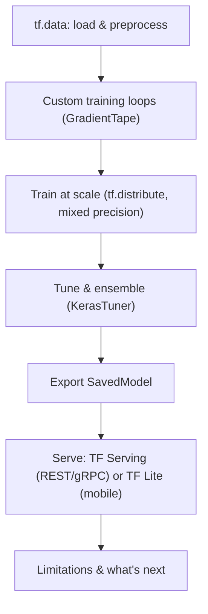

Every phase before this one ended with a trained model sitting in a Jupyter notebook.
Phase 8 is about everything that happens next: feeding that model data fast enough to
keep expensive hardware busy, putting it behind an API the rest of your product can
call, and — when one GPU isn't enough — spreading the training itself across many.

## You'll learn

- how the **tf.data** Data API builds efficient input pipelines: chaining
  transformations, shuffling, batching, and **prefetching** so the GPU is never
  waiting on the CPU
- how to store and stream large datasets using the **TFRecord** format
- how to drop below `tf.keras.fit()` to write custom losses, metrics, layers, and a
  hand-rolled training loop with `tf.GradientTape`
- how to use **GPUs** for training, and how **data parallelism** (the mirrored
  strategy, via `tf.distribute`) and **model parallelism** let you scale training
  across multiple devices and machines
- how to automate the search for the best architecture with **KerasTuner**, and
  squeeze out extra accuracy by **ensembling** several models together
- how **mixed-precision** training (float16 compute, float32 weights) speeds up
  training on GPU and TPU for close to free
- how to export a trained model as a **SavedModel** and serve it with
  **TensorFlow Serving** over REST or gRPC, with clean version rollouts and rollbacks
- how to shrink a model for phones and embedded devices with **TF Lite**
  (quantization, FlatBuffers)
- what deep learning still **can't** do, and how local generalization differs from
  the extreme generalization humans rely on

## Phase checklist

1. Loading & Preprocessing Data with tf.data
2. Custom Models and Training Loops (TensorFlow)
3. Distributed Training with tf.distribute
4. Hyperparameter Tuning with KerasTuner
5. Mixed Precision and Multi-GPU Training
6. Serving Models with TensorFlow Serving
7. Deploying to Mobile & Edge with TensorFlow Lite
8. Limitations and the Future of Deep Learning

## Prerequisites

- You've built and trained at least one tf.keras model (Phases 1–2 of this module).
- Comfortable with NumPy arrays and basic Python file I/O.
- No prior experience with Docker, GPUs, or distributed systems needed — each page
  starts from the basics.
