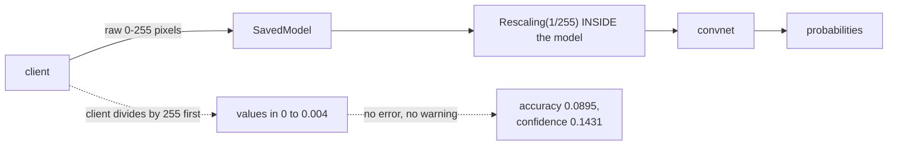

A trained model in a notebook is reachable by exactly one thing: that notebook. Serving is the
step that makes it reachable by anything else, and the failure mode it introduces is unlike
anything in training — the model keeps working, keeps returning plausible numbers, and is wrong.

Here is that failure, measured. The same served model, four clients that preprocess their input
slightly differently:

| Client preprocessing | Accuracy | Agreement | Mean confidence |
| --- | --- | --- | --- |
| Correct (raw 0–255) | **0.9470** | 1.0000 | 0.9416 |
| Also divided by 255 | **0.0895** | 0.0900 | 0.1431 |
| Centred to [−1, 1] | 0.0895 | 0.0900 | 0.1452 |
| Pixels inverted | 0.0850 | 0.0795 | **0.8061** |

Every one of those calls **succeeded**. No exception, no warning, no shape error. The last row is
the worst: 8.5% accurate while reporting 0.81 average confidence. A production server has no way
to notice this without labels, which it does not have.

:::note[TensorFlow Serving is not installed here]
TF Serving is a separate C++ binary and is not available on this machine. What it serves, though,
is an ordinary **SavedModel** directory, and everything about that artefact is inspectable: what
it contains, what its signature promises, and how it behaves under load. All the numbers on this
page come from exporting a SavedModel and calling its serving signature directly — which is
exactly what the server does on your behalf.
:::

## What "export" actually writes

```python title="Exporting for serving"
model.export("served/1")            # note the version number in the path
```

| File | Size |
| --- | --- |
| `variables/variables.data-00000-of-00001` | 444.8 KB |
| `saved_model.pb` | 56.7 KB |
| `variables/variables.index` | 1.0 KB |
| `fingerprint.pb` | 0.1 KB |
| **Total** | **502.6 KB** |
| *The same model as `.keras`* | *707.1 KB* |

Two things in that listing matter.

**The graph is separate from the weights.** `saved_model.pb` is the computation — a
language-independent protocol buffer that a C++ server can execute without Python. The weights sit
beside it. That separation is what makes serving possible at all; a `.keras` file is a Python
artefact that needs Keras to reconstitute.

**The path ends in a version number.** TF Serving watches the parent directory, and when
`served/2` appears it loads it, waits for in-flight requests to `served/1` to finish, and then
drops the old one. Version numbers in the directory layout are the entire deployment mechanism.

<Figure
  src="/images/dl/phase-08-scaling/serving/artefact"
  alt="Left: horizontal bars of the files inside the SavedModel directory, dominated by the variables data file at 444.8 KB with saved_model.pb at 56.7 KB. Right: two bars comparing the SavedModel total of 502.6 KB against the .keras file at 707.1 KB."
  title="One trained model, two formats"
  caption="The SavedModel is smaller than the .keras file despite containing the same weights, because it stores the executable graph rather than the configuration needed to rebuild the model in Python for further training. It is a deployment artefact: everything required to run the forward pass, and nothing required to continue training."
/>

## The signature is the API contract

```text
signatures: ['serve', 'serving_default']
  input   image        shape [-1, 28, 28, 1]  float32
  output  output_0     shape [-1, 10]         float32
```

This is what a client codes against, and it is worth reading carefully.

The **−1** is the batch dimension: the signature accepts any number of images per request. That
single detail is what makes server-side batching possible.

The **name** `image` is what a REST or gRPC caller uses as a key. Rename that input layer and
every client breaks — the signature is a public interface, and it should be treated with the same
care as any other API.

```python title="What a REST client sends"
{"instances": [[[0.0], [0.0], ...]]}          # shape must match [-1, 28, 28, 1]
```

Nothing in that payload says what units the pixels are in. The shape is checked; the **meaning**
is not.

## Batching is why servers are fast

<Figure
  src="/images/dl/phase-08-scaling/serving/latency"
  alt="Left: per-request and per-sample latency against batch size on log axes. Per-request rises from 1.352 ms at batch 1 to 12.379 ms at batch 128, while per-sample falls from 1.3521 ms to 0.0967 ms. Right: throughput rising from 740 samples per second at batch 1 to 10,340 at batch 128."
  title="60 requests per batch size, through the loaded serving signature"
  caption="Per-sample cost falls 14.0x from batch 1 to batch 128 while per-request latency rises only 9.2x. That gap is the fixed overhead of a request — graph dispatch, tensor allocation, the call itself — being spread over more samples. It is why TF Serving has a batching scheduler that waits a few milliseconds to accumulate requests before running them together."
/>

| Batch | ms/request | ms/sample | Samples/s |
| --- | --- | --- | --- |
| 1 | 1.352 | **1.3521** | 740 |
| 8 | 1.598 | 0.1997 | 5,007 |
| 32 | 4.744 | 0.1482 | 6,745 |
| 128 | 12.379 | **0.0967** | **10,340** |

The trade is explicit: batching improves throughput and *worsens* the latency of any individual
request, because a request must wait for the batch to fill. A server tuning this sets a maximum
wait time — collect requests for up to *N* milliseconds, then run whatever has arrived.

Note also that batch 2 was slightly *faster* per request than batch 1 (1.274 ms against 1.352).
At these sizes the measurement is dominated by fixed overhead, and small differences between
adjacent batch sizes are noise rather than signal.

## Training/serving skew

<Figure
  src="/images/dl/phase-08-scaling/serving/skew"
  alt="Grouped bars for four client preprocessing conventions, showing accuracy and agreement with the correct call. The correct convention scores 0.9470 and 1.0000; the other three collapse to below 0.09 on both measures."
  title="The same server, 2,000 digits, four client conventions"
  caption="This is the deployment failure that does not announce itself. The model was trained on raw 0-255 pixels with a Rescaling layer inside it; a client that helpfully divides by 255 first sends values in [0, 0.004] after the model's own rescaling, and the network has never seen anything like them. Accuracy falls from 0.9470 to 0.0895 — worse than guessing — and the request still returns a valid probability vector."
/>



The defence is structural, not procedural: **put the preprocessing inside the model**.

```python title="Preprocessing that ships with the weights"
inputs = keras.layers.Input((28, 28, 1), name="image")
x = keras.layers.Rescaling(1.0 / 255.0)(inputs)      # travels with the model
x = keras.layers.Conv2D(16, 3, activation="relu")(x)
```

Once the `Rescaling` layer is part of the exported graph, the contract is "send raw pixels" and
there is nothing for a client to get wrong. Anything left outside the model has to be reproduced
exactly by every caller, in every language, forever — and each one is an opportunity for the
table above.

The inverted-pixels row deserves a second look: **0.8061 mean confidence at 8.5% accuracy**. High
confidence is not evidence of correct input. A monitoring system watching only confidence would
have seen nothing wrong.

```p5 title="The batching trade" desc="Drag the maximum batch size and the maximum wait. The bars show how long a request spends queueing against computing, and the resulting throughput." height="360"
let maxBatch = 32;
let maxWaitMs = 5;
const ARRIVAL = 2000;
const MEASURED = [[1, 1.352], [8, 1.598], [32, 4.744], [128, 12.379]];
function setup() {
  createCanvas(620, 360);
  textFont("monospace");
}
function computeFor(batch) {
  let best = MEASURED[0];
  let gap = 1e9;
  for (const row of MEASURED) {
    if (Math.abs(row[0] - batch) < gap) { gap = Math.abs(row[0] - batch); best = row; }
  }
  return best[1];
}
function draw() {
  background(13, 17, 23);
  const fillMs = maxBatch / ARRIVAL * 1000;
  const waited = Math.min(fillMs, maxWaitMs);
  const effective = Math.max(1, Math.floor(ARRIVAL * waited / 1000));
  const compute = computeFor(effective);
  const total = waited + compute;
  const throughput = effective / (total / 1000);
  noStroke();
  fill(230);
  textSize(12);
  textAlign(LEFT, TOP);
  text("max batch " + maxBatch + ", max wait " + maxWaitMs.toFixed(0) + " ms",
    30, 20);
  fill(150);
  textSize(10);
  text("requests arrive at " + ARRIVAL + "/s", 30, 42);
  const scale = 460 / Math.max(total, 1);
  fill(255, 211, 67);
  rect(40, 90, waited * scale, 28, 3);
  fill(107, 169, 221);
  rect(40 + waited * scale, 90, compute * scale, 28, 3);
  fill(150);
  textSize(10);
  text("queueing " + waited.toFixed(2) + " ms", 40, 128);
  text("computing " + compute.toFixed(2) + " ms", 40 + waited * scale, 146);
  fill(255, 211, 67);
  textSize(13);
  text("latency " + total.toFixed(2) + " ms", 40, 186);
  fill(126, 192, 143);
  text("throughput " + throughput.toLocaleString(undefined,
    { maximumFractionDigits: 0 }) + " samples/s", 40, 210);
  fill(150);
  textSize(10);
  text("effective batch " + effective, 40, 234);
  fill(150);
  textSize(9.5);
  text("measured: 740 samples/s at batch 1, 10,340 at batch 128", 40, 258);
  const sliders = [["max batch " + maxBatch, (maxBatch - 1) / 255, 306],
    ["max wait " + maxWaitMs.toFixed(0) + " ms", maxWaitMs / 60, 340]];
  for (const entry of sliders) {
    fill(150);
    textSize(9.5);
    text(entry[0], 30, entry[2] - 12);
    fill(60, 70, 84);
    rect(200, entry[2], 280, 4, 2);
    fill(255, 211, 67);
    circle(200 + entry[1] * 280, entry[2] + 2, 12);
  }
}
function mousePressed() { mouseDragged(); }
function mouseDragged() {
  if (mouseX < 190) { return; }
  const fraction = Math.min(Math.max((mouseX - 200) / 280, 0), 1);
  if (Math.abs(mouseY - 308) < 14) {
    maxBatch = Math.round(1 + fraction * 255);
  } else if (Math.abs(mouseY - 342) < 14) {
    maxWaitMs = Math.round(fraction * 60);
  }
}
```

## What to monitor instead

Since accuracy is unavailable in production, monitor the things that are:

- **Input distribution.** Mean, standard deviation and range per feature, compared against
  training. The double-scaled client would have shown a mean 255× too small immediately.
- **Prediction distribution.** If a balanced classifier suddenly returns 80% one class, something
  upstream changed.
- **Confidence distribution**, but as a *shape*, not a threshold — the inverted-pixel row proves
  a high mean confidence can accompany near-random predictions.
- **Latency percentiles**, not the mean. The mean hides the batching tail.
- **Version and traffic split**, so a regression can be attributed to a specific deployment.

```p5 title="The measured table, ranked" desc="Click a column to rank every row by it. The bars are that column's values and the highest and lowest are computed from the numbers, not written in." height="254"
let metric = 0;
const COLUMNS = ["Accuracy", "Agreement", "Mean confidence"];
const ROWS = [
  ["Correct (raw 0–255)", 0.947, 1, 0.9416],
  ["Also divided by 255", 0.0895, 0.09, 0.1431],
  ["Centred to [-1, 1]", 0.0895, 0.09, 0.1452],
  ["Pixels inverted", 0.085, 0.0795, 0.8061]
];
function setup() {
  createCanvas(620, 254);
  textFont("monospace");
}
function fmt(v) {
  if (v === 0) { return "0"; }
  const a = Math.abs(v);
  if (a >= 1000 || a < 0.001) { return v.toExponential(2); }
  if (a >= 100) { return v.toFixed(1); }
  return v.toFixed(4);
}
function draw() {
  background(13, 17, 23);
  noStroke();
  fill(230);
  textSize(12);
  textAlign(LEFT, TOP);
  text("Serving Models with TensorFlow Ser", 26, 16);
  let x = 26;
  for (let i = 0; i < COLUMNS.length; i++) {
    const w = COLUMNS[i].length * 6.6 + 16;
    if (i === metric) { fill(255, 211, 67); } else { fill(48, 56, 68); }
    rect(x, 40, w, 22, 4);
    if (i === metric) { fill(13, 17, 23); } else { fill(180); }
    textSize(9);
    text(COLUMNS[i], x + 8, 47);
    x += w + 6;
    if (x > 500) { break; }
  }
  const values = ROWS.map((r) => r[metric + 1]);
  const lo = Math.min(...values);
  const hi = Math.max(...values);
  const span = hi - lo === 0 ? 1 : hi - lo;
  const order = ROWS.slice().sort((a, b) => b[metric + 1] - a[metric + 1]);
  for (let i = 0; i < order.length; i++) {
    const y = 78 + i * 26;
    const v = order[i][metric + 1];
    fill(160);
    textSize(9);
    text(order[i][0], 26, y + 5);
    fill(34, 40, 50);
    rect(230, y, 280, 18, 3);
    const frac = (v - lo) / span;
    if (v === hi) { fill(126, 192, 143); }
    else if (v === lo) { fill(224, 108, 117); }
    else { fill(107, 169, 221); }
    rect(230, y, Math.max(frac * 280, 3), 18, 3);
    fill(225);
    textSize(9);
    text(fmt(v), 518, y + 5);
  }
  const top = order[0];
  const bottom = order[order.length - 1];
  fill(150);
  textSize(9);
  const base = 78 + order.length * 26 + 8;
  text("highest " + COLUMNS[metric] + ": " + top[0] + " at " + fmt(top[1]),
       26, base);
  text("lowest  " + COLUMNS[metric] + ": " + bottom[0] + " at "
       + fmt(bottom[1]), 26, base + 14);
  text("bars are scaled within the chosen column - lowest is not zero", 26,
       base + 30);
}
function mousePressed() {
  let x = 26;
  for (let i = 0; i < COLUMNS.length; i++) {
    const w = COLUMNS[i].length * 6.6 + 16;
    if (mouseX > x && mouseX < x + w && mouseY > 40 && mouseY < 62) {
      metric = i;
    }
    x += w + 6;
  }
}
```

## Pitfalls

- **Leaving preprocessing outside the model.** 0.9470 → 0.0895 with no error raised.
- **Trusting confidence as a health signal.** The worst variant had the second-highest confidence
  at 0.8061.
- **Renaming an input layer after clients exist.** The layer name is the API key in the request
  payload.
- **Exporting without a version directory.** TF Serving's whole hot-swap mechanism keys off
  `.../1`, `.../2`.
- **Serving a `.keras` file.** It is a Python artefact; the server needs the SavedModel graph.
- **Benchmarking with batch 1 and provisioning for it.** Per-sample cost fell 14× by batch 128.
- **Reading small differences between adjacent batch sizes.** Batch 2 beat batch 1 here; that is
  overhead noise.

## Recap

- `model.export()` writes a versioned SavedModel: an executable graph (56.7 KB) plus weights
  (444.8 KB), smaller than the 707.1 KB `.keras` file because it drops everything training-only.
- The serving signature is a public API — input names and the −1 batch dimension are the contract.
- Batching cut per-sample cost 14.0× from batch 1 to 128, at the price of per-request latency.
- A client preprocessing differently from training dropped accuracy to 0.0895 with no error.
- Inverted pixels produced 0.8061 mean confidence at 0.0850 accuracy, so confidence is not a
  health check.
- Put preprocessing inside the model, and monitor input distributions rather than only outputs.

## Next

That is the deployment path end to end. The last page of the phase steps back and asks what this
whole approach still cannot do:
[Limitations and the Future of Deep Learning](/deep-learning/phase-08---scaling--deploying-deep-models/limitations-and-the-future-of-deep-learning/).

<Quiz
  questions={[
    {
      q: "A client divided its pixels by 255 before sending them to a model that already contains a Rescaling layer. Accuracy fell from 0.9470 to 0.0895. Why did nothing raise an error?",
      options: [
        "The server suppressed the exception",
        "The request had the correct shape and dtype — only the meaning of the values was wrong, and nothing in the signature describes units",
        "The model silently renormalised the input",
        "The error was logged but not returned",
      ],
      answer: 1,
      explain: "Shape and dtype are checked; semantics are not. This is why preprocessing belongs inside the exported graph.",
    },
    {
      q: "The inverted-pixel client scored 0.0850 accuracy with 0.8061 mean confidence. What does that rule out?",
      options: [
        "Nothing — confidence is still the best available signal",
        "Using confidence as a health check — a model can be confidently wrong on out-of-distribution input, so high average confidence is not evidence that the input is correct",
        "Using the model in production at all",
        "That the model was trained properly",
      ],
      answer: 1,
      explain: "It scored the second-highest confidence of the four variants while being the least accurate, which is exactly the case a confidence threshold would miss.",
    },
    {
      q: "Why does the SavedModel directory path end in a version number?",
      options: [
        "For human bookkeeping only",
        "TF Serving watches the parent directory — when a higher-numbered version appears it loads it, drains in-flight requests to the old one, and unloads it, which is the whole hot-swap mechanism",
        "Because protocol buffers require it",
        "To allow multiple models in one directory",
      ],
      answer: 1,
      explain: "The directory layout is the deployment interface, which is why exporting without a version number breaks the server's rollout behaviour.",
    },
    {
      q: "Per-sample cost fell from 1.3521 ms at batch 1 to 0.0967 ms at batch 128, while per-request latency rose from 1.352 ms to 12.379 ms. What is the trade?",
      options: [
        "There is no trade; batching is strictly better",
        "Throughput against individual latency — a request must wait for its batch to fill, so servers set a maximum wait time and run whatever has accumulated",
        "Accuracy against speed",
        "Memory against speed",
      ],
      answer: 1,
      explain: "The fixed per-request overhead is spread over more samples, which is why the per-sample curve falls 14x while the per-request curve rises only 9.2x.",
    },
    {
      q: "Why is the SavedModel (502.6 KB) smaller than the .keras file (707.1 KB) for the same model?",
      options: [
        "It compresses the weights",
        "It stores an executable graph plus weights and drops everything needed only to rebuild the model in Python for further training",
        "It uses lower precision",
        "It omits the optimiser but keeps the training configuration",
      ],
      answer: 1,
      explain: "It is a deployment artefact: everything required to run the forward pass from C++, and nothing required to continue training.",
    },
  ]}
/>

## 🧪 Try It Yourself

<DataCampExercise
  lang="python"
  hint={`Apply the model's own rescaling after the client's, and compare the resulting range with what the model saw in training.`}
  code={`# Task: Exercise 1 - What the model actually receives
import numpy as np

rng = np.random.default_rng(0)
raw_pixels = rng.integers(0, 256, 784).astype("float32")   # what a client has

CLIENTS = {
    "correct (send raw)": lambda x: x,
    "divides by 255": lambda x: x / 255.0,
    "centres to [-1, 1]": lambda x: x / 127.5 - 1.0,
    "inverts pixels": lambda x: 255.0 - x,
}
MODEL_RESCALING = 1.0 / 255.0


def what_the_network_sees(sent):
    """The model applies its own Rescaling layer to whatever arrives."""
    return sent * ___                            # replace ___ with MODEL_RESCALING


training_range = (0.0, 1.0)
print(f"the network was trained on values in {training_range}")
print(f"{'client':22s} {'min':>9} {'max':>9} {'mean':>9} {'full range?':>12}")
for name, transform in CLIENTS.items():
    seen = what_the_network_sees(transform(raw_pixels))
    ok = seen.min() <= training_range[0] + 0.05 and seen.max() >= training_range[1] - 0.05   # covers the trained range
    print(f"{name:22s} {seen.min():9.4f} {seen.max():9.4f} {seen.mean():9.4f} "
          f"{str(ok):>12}")

print("\\nthe two scaling clients squeeze the input into a sliver of the trained range,")
print("the inverted client fills the range with the wrong meaning, and")
print("the request succeeds in every case")`}
  solution={`import numpy as np

rng = np.random.default_rng(0)
raw_pixels = rng.integers(0, 256, 784).astype("float32")   # what a client has

CLIENTS = {
    "correct (send raw)": lambda x: x,
    "divides by 255": lambda x: x / 255.0,
    "centres to [-1, 1]": lambda x: x / 127.5 - 1.0,
    "inverts pixels": lambda x: 255.0 - x,
}
MODEL_RESCALING = 1.0 / 255.0


def what_the_network_sees(sent):
    """The model applies its own Rescaling layer to whatever arrives."""
    return sent * MODEL_RESCALING


training_range = (0.0, 1.0)
print(f"the network was trained on values in {training_range}")
print(f"{'client':22s} {'min':>9} {'max':>9} {'mean':>9} {'full range?':>12}")
for name, transform in CLIENTS.items():
    seen = what_the_network_sees(transform(raw_pixels))
    ok = seen.min() <= training_range[0] + 0.05 and seen.max() >= training_range[1] - 0.05   # covers the trained range
    print(f"{name:22s} {seen.min():9.4f} {seen.max():9.4f} {seen.mean():9.4f} "
          f"{str(ok):>12}")

print("\\nthe two scaling clients squeeze the input into a sliver of the trained range,")
print("the inverted client fills the range with the wrong meaning, and")
print("the request succeeds in every case")`}
  sct={`test_output_contains("the network was trained on values in (0.0, 1.0)", pattern=False)
test_output_contains("inverts pixels", pattern=False)
success_msg("The model applies its own rescaling to whatever arrives, so what the network actually sees depends on what each client sends.")`}
  height={400}
/>

<DataCampExercise
  lang="python"
  hint={`Per-sample cost is the request cost divided by the batch size. Throughput is the batch size divided by the request time.`}
  expectedOutput={`  batch   ms/request   ms/sample    samples/s
      1        1.352      1.3520          740
      2        1.274      0.6370        1,570
      8        1.598      0.1998        5,006
     32        4.744      0.1482        6,745
    128       12.379      0.0967       10,340

per-sample cost falls 14.0x from batch 1 to 128
per-request latency rises 9.2x
that gap is the fixed per-request overhead being amortised`}
  code={`# Task: Exercise 2 - Read a batching curve
MEASURED_MS = {1: 1.352, 2: 1.274, 8: 1.598, 32: 4.744, 128: 12.379}

print(f"{'batch':>7} {'ms/request':>12} {'ms/sample':>11} {'samples/s':>12}")
for batch, milliseconds in MEASURED_MS.items():
    per_sample = milliseconds / ___              # replace ___ with batch
    throughput = 1000.0 / per_sample
    print(f"{batch:7d} {milliseconds:12.3f} {per_sample:11.4f} "
          f"{throughput:12,.0f}")

single = MEASURED_MS[1] / 1
largest = MEASURED_MS[128] / 128
print(f"\\nper-sample cost falls {single / largest:.1f}x from batch 1 to 128")
print(f"per-request latency rises {MEASURED_MS[128] / MEASURED_MS[1]:.1f}x")
print("that gap is the fixed per-request overhead being amortised")`}
  solution={`MEASURED_MS = {1: 1.352, 2: 1.274, 8: 1.598, 32: 4.744, 128: 12.379}

print(f"{'batch':>7} {'ms/request':>12} {'ms/sample':>11} {'samples/s':>12}")
for batch, milliseconds in MEASURED_MS.items():
    per_sample = milliseconds / batch
    throughput = 1000.0 / per_sample
    print(f"{batch:7d} {milliseconds:12.3f} {per_sample:11.4f} "
          f"{throughput:12,.0f}")

single = MEASURED_MS[1] / 1
largest = MEASURED_MS[128] / 128
print(f"\\nper-sample cost falls {single / largest:.1f}x from batch 1 to 128")
print(f"per-request latency rises {MEASURED_MS[128] / MEASURED_MS[1]:.1f}x")
print("that gap is the fixed per-request overhead being amortised")`}
  sct={`test_output_contains("per-sample cost falls 14.0x from batch 1 to 128", pattern=False)
test_output_contains("per-request latency rises 9.2x", pattern=False)
success_msg("Batching amortises the fixed per-request overhead: the cost per sample falls 14x while the latency of one request rises.")`}
  height={400}
/>

<DataCampExercise
  lang="python"
  hint={`Compare the incoming batch's summary statistics against the training reference, and flag anything outside a tolerance.`}
  code={`# Task: Exercise 3 - Monitor inputs, since you cannot monitor accuracy
import numpy as np

TRAINING = {"mean": 33.32, "std": 78.57, "min": 0.0, "max": 255.0}
rng = np.random.default_rng(0)
raw = rng.integers(0, 256, (200, 784)).astype("float32") * (rng.random((200, 1)) < 0.15)

BATCHES = {
    "correct": raw,
    "divided by 255": raw / 255.0,
    "centred": raw / 127.5 - 1.0,
    "inverted": 255.0 - raw,
}


def drift_report(batch, reference=TRAINING, tolerance=0.25):
    """Flag a batch whose statistics have moved away from training."""
    observed = {"mean": float(batch.mean()), "std": float(batch.std()),
                "min": float(batch.min()), "max": float(batch.max())}
    moved = abs(observed["mean"] - reference["mean"]) / reference["std"]   # shift in training standard deviations
    return observed, moved > ___                 # replace ___ with tolerance


print(f"training reference: mean {TRAINING['mean']:.2f}, "
      f"range [{TRAINING['min']:.0f}, {TRAINING['max']:.0f}]")
print(f"{'batch':18s} {'mean':>9} {'min':>8} {'max':>8} {'alert?':>8}")
for name, batch in BATCHES.items():
    observed, alert = drift_report(batch)
    print(f"{name:18s} {observed['mean']:9.3f} {observed['min']:8.2f} "
          f"{observed['max']:8.2f} {'YES' if alert else 'no':>8}")

print("\\nan input monitor catches all three broken clients before a single")
print("label is available - which is the only defence a server has")`}
  solution={`import numpy as np

TRAINING = {"mean": 33.32, "std": 78.57, "min": 0.0, "max": 255.0}
rng = np.random.default_rng(0)
raw = rng.integers(0, 256, (200, 784)).astype("float32") * (rng.random((200, 1)) < 0.15)

BATCHES = {
    "correct": raw,
    "divided by 255": raw / 255.0,
    "centred": raw / 127.5 - 1.0,
    "inverted": 255.0 - raw,
}


def drift_report(batch, reference=TRAINING, tolerance=0.25):
    """Flag a batch whose statistics have moved away from training."""
    observed = {"mean": float(batch.mean()), "std": float(batch.std()),
                "min": float(batch.min()), "max": float(batch.max())}
    moved = abs(observed["mean"] - reference["mean"]) / reference["std"]   # shift in training standard deviations
    return observed, moved > tolerance


print(f"training reference: mean {TRAINING['mean']:.2f}, "
      f"range [{TRAINING['min']:.0f}, {TRAINING['max']:.0f}]")
print(f"{'batch':18s} {'mean':>9} {'min':>8} {'max':>8} {'alert?':>8}")
for name, batch in BATCHES.items():
    observed, alert = drift_report(batch)
    print(f"{name:18s} {observed['mean']:9.3f} {observed['min']:8.2f} "
          f"{observed['max']:8.2f} {'YES' if alert else 'no':>8}")

print("\\nan input monitor catches all three broken clients before a single")
print("label is available - which is the only defence a server has")`}
  sct={`test_output_contains("inverted             237.130", pattern=False)
test_output_contains("YES", pattern=False)
success_msg("An input monitor flags a batch whose statistics moved away from training, which is the only defence a server has without labels.")`}
  height={400}
/>

<DataCampExercise
  lang="python"
  hint={`Save the arrays into a version directory with np.savez, load them back with np.load, and index the loaded file by array name.`}
  code={`# Task: Exercise 4 - Export and inspect a saved model
import os
import tempfile
import numpy as np

rng = np.random.default_rng(0)
model = {"weights": rng.normal(size=(784, 10)), "bias": np.zeros(10)}
root = tempfile.mkdtemp()
path = os.path.join(root, "1")                   # the version directory
os.makedirs(path)
np.savez(os.path.join(path, "model.npz"), **model)

print("files written:", sorted(os.listdir(path)))
loaded = np.load(os.path.join(path, "model.npz"))
print("arrays stored:", sorted(loaded.files))
restored = loaded["___"]                         # the weights matrix
print("restored weights shape:", restored.shape)
print("the restored weights equal the saved weights:", bool(np.array_equal(restored, model["weights"])))
print("the version directory is named 1:", os.path.basename(path) == "1")`}
  solution={`# Task: Exercise 4 - Export and inspect a saved model
import os
import tempfile
import numpy as np

rng = np.random.default_rng(0)
model = {"weights": rng.normal(size=(784, 10)), "bias": np.zeros(10)}
root = tempfile.mkdtemp()
path = os.path.join(root, "1")                   # the version directory
os.makedirs(path)
np.savez(os.path.join(path, "model.npz"), **model)

print("files written:", sorted(os.listdir(path)))
loaded = np.load(os.path.join(path, "model.npz"))
print("arrays stored:", sorted(loaded.files))
restored = loaded["weights"]                         # the weights matrix
print("restored weights shape:", restored.shape)
print("the restored weights equal the saved weights:", bool(np.array_equal(restored, model["weights"])))
print("the version directory is named 1:", os.path.basename(path) == "1")`}
  sct={`test_output_contains("files written: ['model.npz']", pattern=False)
test_output_contains("restored weights shape: (784, 10)", pattern=False)
test_output_contains("the restored weights equal the saved weights: True", pattern=False)
success_msg("A served model is a versioned directory holding the saved arrays, and loading it back must reproduce the exact weights.")`}
  height={400}
/>

<DataCampExercise
  lang="python"
  hint={`Build one model with the preprocessing inside and one without, then send both the same raw pixels.`}
  code={`# Task: Exercise 5 - Preprocessing inside against outside
from sklearn.datasets import load_digits
from sklearn.linear_model import LogisticRegression
from sklearn.pipeline import make_pipeline
from sklearn.preprocessing import FunctionTransformer

digits = load_digits()
x_train, y_train = digits.data[:1200], digits.target[:1200]      # RAW 0-16
x_test, y_test = digits.data[1200:], digits.target[1200:]


def rescale(values):
    return values / 16.0


# Inside: the model carries its own rescaling, so the client sends raw pixels.
inside = make_pipeline(FunctionTransformer(rescale), LogisticRegression(max_iter=2000))
inside.fit(x_train, y_train)
# Outside: trained on pre-scaled pixels, so the CLIENT must scale too.
outside = LogisticRegression(max_iter=2000).fit(rescale(x_train), y_train)

a = inside.score(x_test, y_test)
b = outside.score(rescale(x_test), y_test)
c = outside.score(___, y_test)                   # the client forgets to scale
print(f"rescaling inside, client sends raw:   {a:.2f}")
print(f"rescaling outside, client scales:     {b:.2f}")
print(f"rescaling outside, client FORGETS:    {c:.2f}")
print("only the third case is a bug:", a == b and c < b)`}
  solution={`# Task: Exercise 5 - Preprocessing inside against outside
from sklearn.datasets import load_digits
from sklearn.linear_model import LogisticRegression
from sklearn.pipeline import make_pipeline
from sklearn.preprocessing import FunctionTransformer

digits = load_digits()
x_train, y_train = digits.data[:1200], digits.target[:1200]      # RAW 0-16
x_test, y_test = digits.data[1200:], digits.target[1200:]


def rescale(values):
    return values / 16.0


# Inside: the model carries its own rescaling, so the client sends raw pixels.
inside = make_pipeline(FunctionTransformer(rescale), LogisticRegression(max_iter=2000))
inside.fit(x_train, y_train)
# Outside: trained on pre-scaled pixels, so the CLIENT must scale too.
outside = LogisticRegression(max_iter=2000).fit(rescale(x_train), y_train)

a = inside.score(x_test, y_test)
b = outside.score(rescale(x_test), y_test)
c = outside.score(x_test, y_test)                   # the client forgets to scale
print(f"rescaling inside, client sends raw:   {a:.2f}")
print(f"rescaling outside, client scales:     {b:.2f}")
print(f"rescaling outside, client FORGETS:    {c:.2f}")
print("only the third case is a bug:", a == b and c < b)`}
  sct={`test_output_contains("only the third case is a bug: True", pattern=False)
success_msg("Putting the rescaling inside the model means a client cannot forget it; outside, forgetting it silently costs accuracy.")`}
  height={400}
/>

<DataCampExercise
  lang="python"
  hint={`A request waits until either the batch is full or the timeout expires, whichever comes first.`}
  code={`# Task: Exercise 6 - Tune a batching scheduler
MS_PER_REQUEST = {1: 1.352, 8: 1.598, 32: 4.744, 128: 12.379}
ARRIVAL_RATE = 2000        # requests per second reaching the server


def scheduler(max_batch, max_wait_ms):
    """How long a request waits, and what throughput the server sustains."""
    fill_ms = max_batch / ARRIVAL_RATE * 1000
    wait_ms = min(fill_ms, max_wait_ms)
    effective_batch = max(1, int(ARRIVAL_RATE * wait_ms / 1000))
    closest = min(MS_PER_REQUEST, key=lambda b: abs(b - effective_batch))
    compute_ms = MS_PER_REQUEST[closest]
    total_ms = wait_ms + ___                     # replace ___ with compute_ms
    return wait_ms, compute_ms, total_ms, effective_batch / (total_ms / 1000)


print(f"{'max batch':>10} {'max wait':>9} {'waited':>8} {'compute':>9} "
      f"{'latency':>9} {'throughput':>12}")
for max_batch, max_wait in ((1, 0), (32, 5), (128, 5), (128, 50)):
    wait, compute, total, throughput = scheduler(max_batch, max_wait)
    print(f"{max_batch:10d} {max_wait:9d} {wait:8.1f} {compute:9.2f} "
          f"{total:9.2f} {throughput:12,.0f}")

print("\\nraising the wait raises throughput and the latency every client")
print("sees - the scheduler is where that trade is made explicit")`}
  solution={`MS_PER_REQUEST = {1: 1.352, 8: 1.598, 32: 4.744, 128: 12.379}
ARRIVAL_RATE = 2000        # requests per second reaching the server


def scheduler(max_batch, max_wait_ms):
    """How long a request waits, and what throughput the server sustains."""
    fill_ms = max_batch / ARRIVAL_RATE * 1000
    wait_ms = min(fill_ms, max_wait_ms)
    effective_batch = max(1, int(ARRIVAL_RATE * wait_ms / 1000))
    closest = min(MS_PER_REQUEST, key=lambda b: abs(b - effective_batch))
    compute_ms = MS_PER_REQUEST[closest]
    total_ms = wait_ms + compute_ms
    return wait_ms, compute_ms, total_ms, effective_batch / (total_ms / 1000)


print(f"{'max batch':>10} {'max wait':>9} {'waited':>8} {'compute':>9} "
      f"{'latency':>9} {'throughput':>12}")
for max_batch, max_wait in ((1, 0), (32, 5), (128, 5), (128, 50)):
    wait, compute, total, throughput = scheduler(max_batch, max_wait)
    print(f"{max_batch:10d} {max_wait:9d} {wait:8.1f} {compute:9.2f} "
          f"{total:9.2f} {throughput:12,.0f}")

print("\\nraising the wait raises throughput and the latency every client")
print("sees - the scheduler is where that trade is made explicit")`}
  sct={`test_output_contains("1,603", pattern=False)
test_output_contains("max batch", pattern=False)
success_msg("Raising the wait raises throughput and the latency every client sees: the scheduler is where that trade is made explicit.")`}
  height={400}
/>
