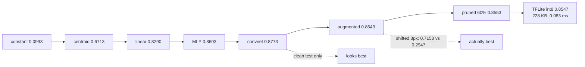

This capstone is the whole module applied to one problem: **Fashion-MNIST**, ten garment classes,
12,000 training images and 3,000 held out. Not MNIST — MNIST is easy enough that a linear model
reaches 0.92 and every later rung has nothing left to show.

The deliverable is not a model. It is a **ladder of models**, each one measured against the rung
below it, ending in something small enough to ship:

| Model | Parameters | Accuracy | Gain over the rung below |
| --- | --- | --- | --- |
| Always predict one class | 0 | 0.0993 | — |
| Nearest class centroid | 7,840 | 0.6713 | **+0.5720** |
| Linear (softmax) | 7,850 | 0.8290 | +0.1577 |
| MLP | 109,386 | 0.8603 | +0.0313 |
| Convnet | 225,034 | **0.8773** | +0.0170 |
| Convnet + augmentation | 225,034 | 0.8643 | **−0.0130** |

Read the gain column. Each rung buys less than the one before, and the last one is **negative** —
augmentation made the held-out score *worse*. That looks like a failed experiment. It is the most
useful result on the page, and the rest of it explains why.

## What you'll learn

- How to build a baseline ladder, and why the *gaps* matter more than the final number.
- Why a technique that lowers your test score can still be the right choice.
- How to take the chosen model through pruning and conversion, measuring at each step.
- What to report when you hand this in.

## The ladder

<Figure
  src="/images/dl/phase-09-capstones/image-classifier/ladder"
  alt="Left: horizontal bars of accuracy for six models from a constant predictor at 0.0993 to a convnet at 0.8773, each annotated with the gain over the previous rung. Right: accuracy against parameter count on a log axis, showing the linear model at 7,850 parameters reaching 0.8290 while the convnet needs 225,034 to reach 0.8773."
  title="3,000 held-out garments, identical split at every rung"
  caption="The first two rungs do most of the work: a nearest-centroid classifier with no gradient descent at all reaches 0.6713, and a linear model reaches 0.8290. Everything after that — a 14x increase in parameters and a 16x increase in training time — buys a combined 0.0483. That ratio is what a baseline ladder is for, and it is invisible if you only ever train the last model."
/>

**Start at the bottom, always.** The constant predictor tells you the class balance (0.0993 here,
so the classes are even). The centroid classifier tells you how much of the problem is solved by
"which class does this look most like on average" — 0.6713, which is two thirds of it.

The linear model at **0.8290** is the number that should discipline everything after it. It has
7,850 parameters and trains in four seconds. The convnet has 28× more parameters, takes 16× longer
and adds **0.0483**. On a real project that trade might well be the wrong one, and you cannot know
without having built both.

## The result that looks like a failure

The convnet reached **0.8974** on its training set against **0.8773** held out. That 0.0201 gap is
what augmentation exists to close — and when applied, it lowered the held-out score to 0.8643.

Reported on the clean test set alone, augmentation is a regression. So test it on something else:

<Figure
  src="/images/dl/phase-09-capstones/image-classifier/robustness"
  alt="Grouped bars comparing the plain convnet against the augmented one across six conditions. On clean data the plain model leads 0.8773 to 0.8643, but on shifted and rotated test sets the augmented model leads by increasing margins, reaching 0.7153 against 0.2947 at a three-pixel shift."
  title="The same two models, six versions of the test set"
  caption="The clean column is the only one where the plain convnet wins, and it wins by 0.0130. On a three-pixel shift — a change no human would remark on — the plain model collapses to 0.2947 while the augmented one holds 0.7153, a gap of 0.4207. Augmentation did not cost accuracy; it moved accuracy from a distribution you will not deploy on to distributions you might."
/>

| Test set | Convnet | Augmented | Delta |
| --- | --- | --- | --- |
| Clean | **0.8773** | 0.8643 | −0.0130 |
| Shift 1 px | 0.8177 | 0.8500 | +0.0323 |
| Shift 2 px | 0.6020 | 0.8173 | +0.2153 |
| **Shift 3 px** | 0.2947 | **0.7153** | **+0.4207** |
| Rotate 10° | 0.8187 | 0.8443 | +0.0257 |
| Rotate 20° | 0.6133 | 0.7350 | +0.1217 |

This is the capstone's central lesson, and it generalises well past augmentation: **a single test
number cannot tell you whether a change was good.** The plain convnet is better on the
distribution it was measured on and dramatically worse everywhere near it. Which model you want
depends on whether your deployed inputs will be perfectly centred — and they will not be.

The cost is real too: 24 epochs against 12, and 189 seconds against 66, because augmented data is
harder to fit and needs longer to converge. A run that gave augmentation the same 12-epoch budget
would have measured its cost and none of its benefit.

## Shipping it

The augmented convnet is the model to deploy. Here is what the deployment path did to it:

<Figure
  src="/images/dl/phase-09-capstones/image-classifier/deployment"
  alt="Left: horizontal bars of size on disk — Keras at 2,683.1 KB, pruned at 2,682.8 KB, TFLite float32 at 883.4 KB and TFLite int8 at 228.2 KB. Right: accuracy against per-sample latency on a log axis, showing the two TFLite artefacts far to the left at 0.159 and 0.083 milliseconds."
  title="One model, four artefacts"
  caption="The pruned bar is the instructive one: 60% of the weight matrices are zero and the file is 0.3 KB smaller, because a .keras file stores zeros like any other float. The size win comes entirely from conversion and quantisation — 11.8x — and the latency win of 47x comes from leaving the Keras runtime, not from making the model smaller."
/>

| Artefact | Size | Accuracy | ms/sample |
| --- | --- | --- | --- |
| Trained (Keras) | 2,683.1 KB | 0.8643 | 3.893 |
| Pruned 60% | 2,682.8 KB | 0.8553 | 3.792 |
| TFLite float32 | 883.4 KB | 0.8643 | 0.159 |
| **TFLite int8** | **228.2 KB** | 0.8547 | **0.083** |

Pruning to 60% dropped accuracy to **0.8067** immediately and recovered to **0.8553** after three
epochs of fine-tuning with the mask re-applied each epoch. That recovery step is the technique;
without it the number to report would have been 0.8067.

The final artefact is **11.8× smaller** and **47× faster per sample** for 0.0096 of accuracy.



## What to hand in

A defensible submission for this project is short and contains no adjectives:

1. **The ladder**, including the rungs that did not help. The negative gain from augmentation is
   part of the result.
2. **At least one off-distribution evaluation.** Clean accuracy alone would have chosen the wrong
   model here.
3. **The training/held-out gap** for the chosen model, so overfitting is visible rather than
   inferred.
4. **The deployment table**: size, accuracy and latency at each step, with the immediate
   post-pruning number as well as the recovered one.
5. **The budget.** 12 epochs, 24 for the augmented run, on 12,000 images on a CPU — every number
   above is conditional on that.

```p5 title="Which model wins depends on the test set" desc="Click a test condition. The bars are the two convnets measured on that version of the test set, and the verdict changes with the condition." height="340"
let chosen = 0;
const CONDITIONS = [
  ["clean", 0.8773, 0.8643],
  ["shift 1px", 0.8177, 0.8500],
  ["shift 2px", 0.6020, 0.8173],
  ["shift 3px", 0.2947, 0.7153],
  ["rotate 10 deg", 0.8187, 0.8443],
  ["rotate 20 deg", 0.6133, 0.7350],
];
function setup() {
  createCanvas(620, 340);
  textFont("monospace");
}
function draw() {
  background(13, 17, 23);
  const row = CONDITIONS[chosen];
  noStroke();
  fill(230);
  textSize(12);
  textAlign(LEFT, TOP);
  text("test set: " + row[0], 30, 20);
  const bars = [["plain convnet", row[1], 107, 169, 221, 80],
    ["convnet + augmentation", row[2], 126, 192, 143, 148]];
  for (const bar of bars) {
    fill(150);
    textSize(10.5);
    text(bar[0], 30, bar[5] - 16);
    fill(60, 70, 84);
    rect(30, bar[5], 420, 26, 3);
    fill(bar[2], bar[3], bar[4]);
    rect(30, bar[5], 420 * bar[1], 26, 3);
    fill(240);
    textSize(11);
    text(bar[1].toFixed(4), 462, bar[5] + 7);
  }
  const delta = row[2] - row[1];
  fill(delta > 0 ? color(126, 192, 143) : color(224, 108, 117));
  textSize(13);
  text(delta > 0
    ? "augmentation wins by " + delta.toFixed(4)
    : "plain convnet wins by " + (-delta).toFixed(4), 30, 204);
  fill(150);
  textSize(9.5);
  text("the clean set is the only condition the plain model wins", 30, 230);
  text("averaged over all six: plain 0.6706, augmented 0.8044", 30, 246);
  for (let i = 0; i < CONDITIONS.length; i++) {
    const x = 30 + (i % 3) * 190;
    const y = 274 + Math.floor(i / 3) * 32;
    fill(i === chosen ? color(255, 211, 67) : color(60, 70, 84));
    rect(x, y, 178, 26, 4);
    fill(i === chosen ? 20 : 200);
    textSize(9.5);
    textAlign(CENTER, CENTER);
    text(CONDITIONS[i][0], x + 89, y + 13);
    textAlign(LEFT, TOP);
  }
}
function mousePressed() {
  for (let i = 0; i < CONDITIONS.length; i++) {
    const x = 30 + (i % 3) * 190;
    const y = 274 + Math.floor(i / 3) * 32;
    if (mouseX > x && mouseX < x + 178 && mouseY > y && mouseY < y + 26) {
      chosen = i;
      return;
    }
  }
}
```

```p5 title="The measured table, ranked" desc="Click a column to rank every row by it. The bars are that column's values and the highest and lowest are computed from the numbers, not written in." height="306"
let metric = 0;
const COLUMNS = ["Parameters", "Accuracy"];
const ROWS = [
  ["Always predict one class", 0, 0.0993],
  ["Nearest class centroid", 7840, 0.6713],
  ["Linear (softmax)", 7850, 0.829],
  ["MLP", 109386, 0.8603],
  ["Convnet", 225034, 0.8773],
  ["Convnet + augmentation", 225034, 0.8643]
];
function setup() {
  createCanvas(620, 306);
  textFont("monospace");
}
function fmt(v) {
  if (v === 0) { return "0"; }
  const a = Math.abs(v);
  if (a >= 1000 || a < 0.001) { return v.toExponential(2); }
  if (a >= 100) { return v.toFixed(1); }
  return v.toFixed(4);
}
function draw() {
  background(13, 17, 23);
  noStroke();
  fill(230);
  textSize(12);
  textAlign(LEFT, TOP);
  text("Capstone 1 - An Image Classifier E", 26, 16);
  let x = 26;
  for (let i = 0; i < COLUMNS.length; i++) {
    const w = COLUMNS[i].length * 6.6 + 16;
    if (i === metric) { fill(255, 211, 67); } else { fill(48, 56, 68); }
    rect(x, 40, w, 22, 4);
    if (i === metric) { fill(13, 17, 23); } else { fill(180); }
    textSize(9);
    text(COLUMNS[i], x + 8, 47);
    x += w + 6;
    if (x > 500) { break; }
  }
  const values = ROWS.map((r) => r[metric + 1]);
  const lo = Math.min(...values);
  const hi = Math.max(...values);
  const span = hi - lo === 0 ? 1 : hi - lo;
  const order = ROWS.slice().sort((a, b) => b[metric + 1] - a[metric + 1]);
  for (let i = 0; i < order.length; i++) {
    const y = 78 + i * 26;
    const v = order[i][metric + 1];
    fill(160);
    textSize(9);
    text(order[i][0], 26, y + 5);
    fill(34, 40, 50);
    rect(230, y, 280, 18, 3);
    const frac = (v - lo) / span;
    if (v === hi) { fill(126, 192, 143); }
    else if (v === lo) { fill(224, 108, 117); }
    else { fill(107, 169, 221); }
    rect(230, y, Math.max(frac * 280, 3), 18, 3);
    fill(225);
    textSize(9);
    text(fmt(v), 518, y + 5);
  }
  const top = order[0];
  const bottom = order[order.length - 1];
  fill(150);
  textSize(9);
  const base = 78 + order.length * 26 + 8;
  text("highest " + COLUMNS[metric] + ": " + top[0] + " at " + fmt(top[1]),
       26, base);
  text("lowest  " + COLUMNS[metric] + ": " + bottom[0] + " at "
       + fmt(bottom[1]), 26, base + 14);
  text("bars are scaled within the chosen column - lowest is not zero", 26,
       base + 30);
}
function mousePressed() {
  let x = 26;
  for (let i = 0; i < COLUMNS.length; i++) {
    const w = COLUMNS[i].length * 6.6 + 16;
    if (mouseX > x && mouseX < x + w && mouseY > 40 && mouseY < 62) {
      metric = i;
    }
    x += w + 6;
  }
}
```

## Pitfalls

- **Skipping the baselines.** A centroid classifier reached 0.6713 here; without it, 0.8773 sounds
  like the model did all the work.
- **Judging augmentation on clean data.** It lost 0.0130 there and won 0.4207 three pixels away.
- **Giving augmentation the same epoch budget.** Augmented data is harder to fit; 12 epochs would
  have shown the cost and hidden the benefit.
- **Reporting the pruned model without fine-tuning.** 0.8067 against 0.8553.
- **Expecting a pruned `.keras` file to be smaller.** It was 0.3 KB smaller at 60% sparsity.
- **Measuring latency through Keras.** 3.893 ms against 0.083 ms for the same computation in
  TFLite at batch 1.
- **Reading the last rung as the only result.** The interesting numbers here are the gaps between
  rungs, not the top of the ladder.

## Recap

- The ladder ran 0.0993 → 0.6713 → 0.8290 → 0.8603 → 0.8773, with each rung buying less than the
  one before.
- A linear model with 7,850 parameters got within 0.0483 of a convnet with 225,034.
- Augmentation cost 0.0130 on clean data and gained 0.4207 on a three-pixel shift.
- The convnet's 0.0201 train/test gap is what augmentation was brought in to close.
- Pruning 60% needed fine-tuning to go from 0.8067 back to 0.8553, and saved no disk space.
- The deployed artefact is 11.8× smaller and 47× faster for 0.0096 of accuracy.

## Next

The same ladder, applied to text — where it stops climbing much earlier:
[Capstone 2 - A Text Classifier End to End](/deep-learning/phase-09---capstone-projects/capstone-2---a-text-classifier-end-to-end/).

<Quiz
  questions={[
    {
      q: "Augmentation lowered clean test accuracy from 0.8773 to 0.8643 but raised three-pixel-shift accuracy from 0.2947 to 0.7153. Which model should be deployed?",
      options: [
        "The plain convnet, since it scores higher on the test set",
        "The augmented one, unless you are certain deployed inputs will be as perfectly centred as the test set — a single test number cannot decide this",
        "Neither; retrain until clean accuracy improves",
        "It makes no difference",
      ],
      answer: 1,
      explain: "The clean test set is one distribution. The measurement that matters is performance on the distribution you will actually see, which is why the off-distribution evaluation is part of the deliverable.",
    },
    {
      q: "A nearest-centroid classifier with no gradient descent reached 0.6713 and a linear model 0.8290, while a convnet reached 0.8773. What does the ladder tell you?",
      options: [
        "The convnet is 0.8773 accurate, which is what matters",
        "Most of the problem is solved by very simple methods — the convnet's 28x parameter increase bought 0.0483, and that trade might be wrong on a real project",
        "The baselines were badly implemented",
        "Fashion-MNIST is too easy",
      ],
      answer: 1,
      explain: "The gaps between rungs are the result. Without the lower rungs there is no way to know how much the complexity contributed.",
    },
    {
      q: "The augmented model was trained for 24 epochs and the plain one for 12. Why not use the same budget?",
      options: [
        "To give augmentation an unfair advantage",
        "Augmented data is harder to fit, so an equal budget measures augmentation's cost while hiding its benefit — the comparison would be about convergence, not about the technique",
        "Because augmentation runs faster per epoch",
        "The budgets should have been equal",
      ],
      answer: 1,
      explain: "This exact mistake occurred earlier in the module: a fixed 15-epoch budget hid 0.1675 of an augmented model's accuracy.",
    },
    {
      q: "Pruning 60% of the weights left the .keras file 0.3 KB smaller. Why?",
      options: [
        "The pruning did not actually happen",
        "A zero is stored like any other float32 value — the saving only exists in a format that encodes sparsity, which is why the real size win came from TFLite conversion",
        "Keras compresses the file automatically",
        "Only the biases were pruned",
      ],
      answer: 1,
      explain: "60% of the weight matrices were verified as zero after fine-tuning, so the sparsity is real; it is the storage format that does not exploit it.",
    },
    {
      q: "Converting to TFLite cut per-sample latency from 3.893 ms to 0.159 ms with identical accuracy. What accounts for the 24x?",
      options: [
        "The converter optimised the arithmetic",
        "Leaving the Keras runtime — at batch size 1 the framework's per-call overhead dominates, and the accuracy being unchanged shows the computation is the same",
        "Quantisation of the weights",
        "The model was pruned first",
      ],
      answer: 1,
      explain: "The float32 TFLite artefact scored exactly 0.8643, the same as the Keras model, so nothing about the maths changed.",
    },
  ]}
/>

## 🧪 Try It Yourself

<DataCampExercise
  lang="python"
  hint={`Subtract each rung's accuracy from the one below it, and divide the gain by the extra parameters to see what the capacity bought.`}
  code={`# Task: Exercise 1 - Read a baseline ladder
LADDER = [
    ("constant", 0, 0.0993),
    ("centroid", 7_840, 0.6713),
    ("linear", 7_850, 0.8290),
    ("MLP", 109_386, 0.8603),
    ("convnet", 225_034, 0.8773),
]

print(f"{'model':12s} {'parameters':>12} {'accuracy':>9} {'gain':>8} "
      f"{'gain per 10k params':>21}")
previous = None
for name, parameters, accuracy in LADDER:
    if previous is None:
        print(f"{name:12s} {parameters:12,} {accuracy:9.4f} {'':>8} {'':>21}")
        previous = (parameters, accuracy)
        continue
    gain = accuracy - previous[1]
    extra = parameters - previous[___]           # replace ___ with 0
    efficiency = gain / (extra / 10_000) if extra > 0 else float("nan")
    print(f"{name:12s} {parameters:12,} {accuracy:9.4f} {gain:+8.4f} "
          f"{efficiency:21.5f}")
    previous = (parameters, accuracy)

print("\\nthe centroid rung is free and buys 0.57; the convnet rung costs")
print("115,648 parameters and buys 0.017")`}
  solution={`LADDER = [
    ("constant", 0, 0.0993),
    ("centroid", 7_840, 0.6713),
    ("linear", 7_850, 0.8290),
    ("MLP", 109_386, 0.8603),
    ("convnet", 225_034, 0.8773),
]

print(f"{'model':12s} {'parameters':>12} {'accuracy':>9} {'gain':>8} "
      f"{'gain per 10k params':>21}")
previous = None
for name, parameters, accuracy in LADDER:
    if previous is None:
        print(f"{name:12s} {parameters:12,} {accuracy:9.4f} {'':>8} {'':>21}")
        previous = (parameters, accuracy)
        continue
    gain = accuracy - previous[1]
    extra = parameters - previous[0]
    efficiency = gain / (extra / 10_000) if extra > 0 else float("nan")
    print(f"{name:12s} {parameters:12,} {accuracy:9.4f} {gain:+8.4f} "
          f"{efficiency:21.5f}")
    previous = (parameters, accuracy)

print("\\nthe centroid rung is free and buys 0.57; the convnet rung costs")
print("115,648 parameters and buys 0.017")`}
  sct={`test_output_contains("the centroid rung is free and buys 0.57", pattern=False)
test_output_contains("convnet", pattern=False)
success_msg("Reading a baseline ladder means comparing each rung's gain with its cost in parameters: the free centroid rung buys the most.")`}
  height={400}
/>

<DataCampExercise
  lang="python"
  hint={`Average across all the conditions, not just the clean one, to see which model is better overall.`}
  expectedOutput={`condition      convnet   augmented    delta
clean           0.8773      0.8643  -0.0130
shift 1px       0.8177      0.8500  +0.0323
shift 2px       0.6020      0.8173  +0.2153
shift 3px       0.2947      0.7153  +0.4206
rotate 10       0.8187      0.8443  +0.0256
rotate 20       0.6133      0.7350  +0.1217

clean only:      convnet 0.8773, augmented 0.8643
averaged over all: convnet 0.6706, augmented 0.8044
worst case:        convnet 0.2947, augmented 0.7153

the ranking flips as soon as you stop measuring only the clean set`}
  code={`# Task: Exercise 2 - Which model is actually better?
MEASURED = {
    "clean":      (0.8773, 0.8643),
    "shift 1px":  (0.8177, 0.8500),
    "shift 2px":  (0.6020, 0.8173),
    "shift 3px":  (0.2947, 0.7153),
    "rotate 10":  (0.8187, 0.8443),
    "rotate 20":  (0.6133, 0.7350),
}

plain = [values[0] for values in MEASURED.values()]
augmented = [values[1] for values in MEASURED.values()]

print(f"{'condition':12s} {'convnet':>9} {'augmented':>11} {'delta':>8}")
for condition, (a, b) in MEASURED.items():
    print(f"{condition:12s} {a:9.4f} {b:11.4f} {b - a:+8.4f}")

print(f"\\nclean only:      convnet {plain[0]:.4f}, augmented {augmented[0]:.4f}")
print(f"averaged over all: convnet {sum(plain) / len(plain):.4f}, "
      f"augmented {sum(augmented) / len(___):.4f}")   # replace ___ with augmented
print(f"worst case:        convnet {min(plain):.4f}, "
      f"augmented {min(augmented):.4f}")
print("\\nthe ranking flips as soon as you stop measuring only the clean set")`}
  solution={`MEASURED = {
    "clean":      (0.8773, 0.8643),
    "shift 1px":  (0.8177, 0.8500),
    "shift 2px":  (0.6020, 0.8173),
    "shift 3px":  (0.2947, 0.7153),
    "rotate 10":  (0.8187, 0.8443),
    "rotate 20":  (0.6133, 0.7350),
}

plain = [values[0] for values in MEASURED.values()]
augmented = [values[1] for values in MEASURED.values()]

print(f"{'condition':12s} {'convnet':>9} {'augmented':>11} {'delta':>8}")
for condition, (a, b) in MEASURED.items():
    print(f"{condition:12s} {a:9.4f} {b:11.4f} {b - a:+8.4f}")

print(f"\\nclean only:      convnet {plain[0]:.4f}, augmented {augmented[0]:.4f}")
print(f"averaged over all: convnet {sum(plain) / len(plain):.4f}, "
      f"augmented {sum(augmented) / len(augmented):.4f}")
print(f"worst case:        convnet {min(plain):.4f}, "
      f"augmented {min(augmented):.4f}")
print("\\nthe ranking flips as soon as you stop measuring only the clean set")`}
  sct={`test_output_contains("the ranking flips as soon as you stop measuring only the clean set", pattern=False)
test_output_contains("worst case:", pattern=False)
success_msg("Measured only on clean data the plain convnet wins; averaged over shifts and rotations, or judged by the worst case, the augmented model wins.")`}
  height={400}
/>

<DataCampExercise
  lang="python"
  hint={`Build the centroid of each class from the training set, then assign each test image to the nearest one.`}
  code={`# Task: Exercise 3 - Build the baseline that needs no training
import numpy as np
from sklearn.datasets import load_digits

digits = load_digits()
x_train, y_train = digits.data[:1200] / 16.0, digits.target[:1200]
x_test, y_test = digits.data[1200:] / 16.0, digits.target[1200:]

# Baseline 1: the class balance.
majority = np.bincount(y_train).argmax()
constant = float((y_test == majority).mean())

# Baseline 2: one average image per class.
centroids = np.stack([x_train[y_train == label].mean(axis=0) for label in range(10)])
distances = ((x_test[:, None, :] - centroids[None, :, :]) ** 2).sum(axis=___)   # over the pixels
predicted = distances.argmin(axis=1)
centroid = float((predicted == y_test).mean())
print(f"constant baseline: {constant:.2f}")
print(f"centroid baseline: {centroid:.2f}")
print("the centroid baseline beats the constant one:", centroid > constant)
print("it took no gradient steps at all")`}
  solution={`# Task: Exercise 3 - Build the baseline that needs no training
import numpy as np
from sklearn.datasets import load_digits

digits = load_digits()
x_train, y_train = digits.data[:1200] / 16.0, digits.target[:1200]
x_test, y_test = digits.data[1200:] / 16.0, digits.target[1200:]

# Baseline 1: the class balance.
majority = np.bincount(y_train).argmax()
constant = float((y_test == majority).mean())

# Baseline 2: one average image per class.
centroids = np.stack([x_train[y_train == label].mean(axis=0) for label in range(10)])
distances = ((x_test[:, None, :] - centroids[None, :, :]) ** 2).sum(axis=2)   # over the pixels
predicted = distances.argmin(axis=1)
centroid = float((predicted == y_test).mean())
print(f"constant baseline: {constant:.2f}")
print(f"centroid baseline: {centroid:.2f}")
print("the centroid baseline beats the constant one:", centroid > constant)
print("it took no gradient steps at all")`}
  sct={`test_output_contains("the centroid baseline beats the constant one: True", pattern=False)
test_output_contains("it took no gradient steps at all", pattern=False)
success_msg("A nearest-centroid classifier needs no training and sets the bar any trained model has to clear.")`}
  height={400}
/>

<DataCampExercise
  lang="python"
  hint={`Roll the test images and score the model on each shifted version. np.roll wraps, which is fine for a centred dataset.`}
  code={`# Task: Exercise 4 - Test off the distribution you trained on
import numpy as np
from sklearn.datasets import load_digits
from sklearn.linear_model import LogisticRegression

digits = load_digits()
x_train, y_train = digits.data[:1200] / 16.0, digits.target[:1200]
x_test, y_test = digits.data[1200:] / 16.0, digits.target[1200:]


def shifted(images, pixels):
    grid = images.reshape(-1, 8, 8)
    return np.roll(grid, shift=(pixels, pixels), axis=(1, ___)).reshape(len(images), 64)   # 2


def train(augment):
    xs, ys = x_train, y_train
    if augment:
        xs = np.concatenate([x_train, shifted(x_train, 1), shifted(x_train, -1)])
        ys = np.concatenate([y_train] * 3)
    return LogisticRegression(max_iter=1000).fit(xs, ys)


scores = {}
for augment in (False, True):
    model = train(augment)
    scores[augment] = [float((model.predict(shifted(x_test, p)) == y_test).mean()) for p in (0, 1, 2)]
    label = "augmented" if augment else "plain"
    print(f"{label:10s} " + "  ".join(f"{p}px {s:.2f}" for p, s in zip((0, 1, 2), scores[augment])))
print("augmentation holds up better on shifted images:", scores[True][1] > scores[False][1])`}
  solution={`# Task: Exercise 4 - Test off the distribution you trained on
import numpy as np
from sklearn.datasets import load_digits
from sklearn.linear_model import LogisticRegression

digits = load_digits()
x_train, y_train = digits.data[:1200] / 16.0, digits.target[:1200]
x_test, y_test = digits.data[1200:] / 16.0, digits.target[1200:]


def shifted(images, pixels):
    grid = images.reshape(-1, 8, 8)
    return np.roll(grid, shift=(pixels, pixels), axis=(1, 2)).reshape(len(images), 64)   # 2


def train(augment):
    xs, ys = x_train, y_train
    if augment:
        xs = np.concatenate([x_train, shifted(x_train, 1), shifted(x_train, -1)])
        ys = np.concatenate([y_train] * 3)
    return LogisticRegression(max_iter=1000).fit(xs, ys)


scores = {}
for augment in (False, True):
    model = train(augment)
    scores[augment] = [float((model.predict(shifted(x_test, p)) == y_test).mean()) for p in (0, 1, 2)]
    label = "augmented" if augment else "plain"
    print(f"{label:10s} " + "  ".join(f"{p}px {s:.2f}" for p, s in zip((0, 1, 2), scores[augment])))
print("augmentation holds up better on shifted images:", scores[True][1] > scores[False][1])`}
  sct={`test_output_contains("augmentation holds up better on shifted images: True", pattern=False)
success_msg("Testing only on the distribution you trained on hides fragility: shifting the test images shows what augmentation bought.")`}
  height={400}
/>

<DataCampExercise
  lang="python"
  hint={`Work out the compression from the size ratio and the speed-up from the latency ratio, then judge each step against the accuracy it cost.`}
  expectedOutput={`artefact             smaller   faster   accuracy cost  worth it?
trained (Keras)         1.0x     1.0x          0.0000          -
pruned 60%              1.0x     1.0x          0.0090          -
TFLite float32          3.0x    24.5x          0.0000        yes
TFLite int8            11.8x    46.9x          0.0096        yes

pruning alone changed nothing on disk - its value here is that the
sparse model quantises to a smaller int8 artefact afterwards`}
  code={`# Task: Exercise 5 - Was the deployment path worth it?
ARTEFACTS = {
    "trained (Keras)":  (2683.1, 0.8643, 3.893),
    "pruned 60%":       (2682.8, 0.8553, 3.792),
    "TFLite float32":   (883.4,  0.8643, 0.159),
    "TFLite int8":      (228.2,  0.8547, 0.083),
}

base_size, base_accuracy, base_latency = ARTEFACTS["trained (Keras)"]

print(f"{'artefact':18s} {'smaller':>9} {'faster':>8} {'accuracy cost':>15} "
      f"{'worth it?':>10}")
for name, (size, accuracy, latency) in ARTEFACTS.items():
    smaller = base_size / size
    faster = base_latency / ___                  # replace ___ with latency
    cost = base_accuracy - accuracy
    verdict = "yes" if (smaller > 2 or faster > 2) and cost < 0.02 else "-"
    print(f"{name:18s} {smaller:8.1f}x {faster:7.1f}x {cost:15.4f} "
          f"{verdict:>10}")

print("\\npruning alone changed nothing on disk - its value here is that the")
print("sparse model quantises to a smaller int8 artefact afterwards")`}
  solution={`ARTEFACTS = {
    "trained (Keras)":  (2683.1, 0.8643, 3.893),
    "pruned 60%":       (2682.8, 0.8553, 3.792),
    "TFLite float32":   (883.4,  0.8643, 0.159),
    "TFLite int8":      (228.2,  0.8547, 0.083),
}

base_size, base_accuracy, base_latency = ARTEFACTS["trained (Keras)"]

print(f"{'artefact':18s} {'smaller':>9} {'faster':>8} {'accuracy cost':>15} "
      f"{'worth it?':>10}")
for name, (size, accuracy, latency) in ARTEFACTS.items():
    smaller = base_size / size
    faster = base_latency / latency
    cost = base_accuracy - accuracy
    verdict = "yes" if (smaller > 2 or faster > 2) and cost < 0.02 else "-"
    print(f"{name:18s} {smaller:8.1f}x {faster:7.1f}x {cost:15.4f} "
          f"{verdict:>10}")

print("\\npruning alone changed nothing on disk - its value here is that the")
print("sparse model quantises to a smaller int8 artefact afterwards")`}
  sct={`test_output_contains("TFLite int8", pattern=False)
test_output_contains("pruning alone changed nothing on disk", pattern=False)
success_msg("A deployment path is worth it when the artefact is much smaller or faster and the accuracy cost stays small.")`}
  height={400}
/>

<DataCampExercise
  lang="python"
  hint={`Build the ladder yourself: constant, centroid, linear, then a small network, and print each gain.`}
  code={`# Task: Exercise 6 - Build your own ladder
import warnings
import numpy as np
from sklearn.datasets import load_digits
from sklearn.linear_model import LogisticRegression
from sklearn.neural_network import MLPClassifier

warnings.filterwarnings("ignore")
digits = load_digits()
x_train, y_train = digits.data[:1200] / 16.0, digits.target[:1200]
x_test, y_test = digits.data[1200:] / 16.0, digits.target[1200:]
results = {}
results["constant"] = float((y_test == np.bincount(y_train).argmax()).mean())
centroids = np.stack([x_train[y_train == label].mean(axis=0) for label in range(10)])
distances = ((x_test[:, None, :] - centroids[None, :, :]) ** 2).sum(axis=2)
results["centroid"] = float((distances.argmin(axis=1) == y_test).mean())
results["linear"] = LogisticRegression(max_iter=2000).fit(x_train, y_train).score(x_test, y_test)
results["MLP"] = MLPClassifier(hidden_layer_sizes=(64, 32), max_iter=50,
                               random_state=0).fit(x_train, y_train).score(x_test, y_test)
previous = None
print(f"{'rung':10s} {'accuracy':>9} {'gain':>8}")
for name, accuracy in results.items():
    gain = "" if previous is None else f"{accuracy - previous:+8.2f}"
    print(f"{name:10s} {accuracy:9.2f} {gain:>8}")
    previous = ___                               # carry this rung's accuracy forward
values = list(results.values())
print("every rung beats the one below it:", all(b > a for a, b in zip(values, values[1:])))`}
  solution={`# Task: Exercise 6 - Build your own ladder
import warnings
import numpy as np
from sklearn.datasets import load_digits
from sklearn.linear_model import LogisticRegression
from sklearn.neural_network import MLPClassifier

warnings.filterwarnings("ignore")
digits = load_digits()
x_train, y_train = digits.data[:1200] / 16.0, digits.target[:1200]
x_test, y_test = digits.data[1200:] / 16.0, digits.target[1200:]
results = {}
results["constant"] = float((y_test == np.bincount(y_train).argmax()).mean())
centroids = np.stack([x_train[y_train == label].mean(axis=0) for label in range(10)])
distances = ((x_test[:, None, :] - centroids[None, :, :]) ** 2).sum(axis=2)
results["centroid"] = float((distances.argmin(axis=1) == y_test).mean())
results["linear"] = LogisticRegression(max_iter=2000).fit(x_train, y_train).score(x_test, y_test)
results["MLP"] = MLPClassifier(hidden_layer_sizes=(64, 32), max_iter=50,
                               random_state=0).fit(x_train, y_train).score(x_test, y_test)
previous = None
print(f"{'rung':10s} {'accuracy':>9} {'gain':>8}")
for name, accuracy in results.items():
    gain = "" if previous is None else f"{accuracy - previous:+8.2f}"
    print(f"{name:10s} {accuracy:9.2f} {gain:>8}")
    previous = accuracy                             # carry this rung's accuracy forward
values = list(results.values())
print("every rung beats the one below it:", all(b > a for a, b in zip(values, values[1:])))`}
  sct={`test_output_contains("every rung beats the one below it: True", pattern=False)
test_output_contains("centroid", pattern=False)
success_msg("Build the ladder from the free baselines upward, and report each rung's gain over the one below it.")`}
  height={400}
/>
