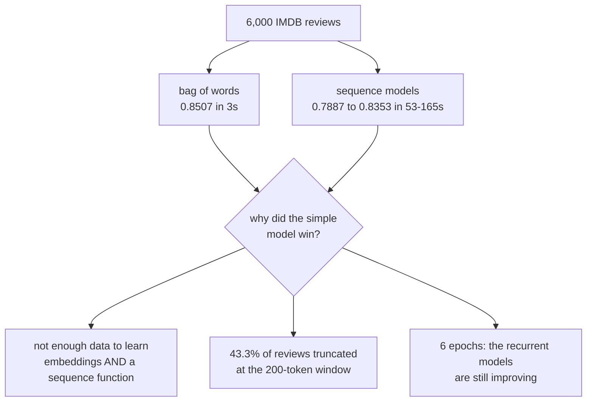

[Capstone 1](/deep-learning/phase-09---capstone-projects/capstone-1---an-image-classifier-end-to-end/)
built a ladder that climbed. This one does not, and the point of the project is to notice that
before spending three days on the top rung.

**IMDB sentiment**, 6,000 training reviews and 3,000 held out, every model given 6 epochs:

| Model | Parameters | Seconds | Accuracy | Gain |
| --- | --- | --- | --- | --- |
| Always predict one class | 0 | 0 | 0.5220 | — |
| **Bag of words + linear** | 10,001 | **3** | **0.8507** | **+0.3287** |
| Bag of words + MLP | 160,033 | 4 | 0.8567 | +0.0060 |
| Embedding + pooling | 321,089 | 6 | **0.8587** | +0.0020 |
| LSTM | 329,409 | 53 | 0.8353 | **−0.0233** |
| Bidirectional LSTM | 338,753 | 113 | **0.7887** | −0.0467 |
| Self-attention | 329,505 | 165 | 0.7957 | +0.0070 |

A linear model over a multi-hot vector — **no word order, no sequence information at all** —
reached 0.8507 in three seconds. Every recurrent and attention-based model, at 18× to 55× the
training time, did **worse**.

## What you'll learn

- Why the sequence models lost here, and what would have to change for them to win.
- How to test the specific claim recurrence makes, rather than the general one.
- Why the best single model is not the best available accuracy on this data.
- What to report when your ladder stops climbing.

## The ladder that stops

<Figure
  src="/images/dl/phase-09-capstones/text-classifier/ladder"
  alt="Left: horizontal bars of accuracy for seven models. The constant baseline is at 0.5220, bag of words at 0.8507, embedding-plus-pooling highest at 0.8587, then LSTM at 0.8353, bidirectional LSTM at 0.7887 and self-attention at 0.7957. Right: accuracy against training time on a log axis, showing the cheapest models at the top left and the most expensive at the bottom right."
  title="3,000 held-out reviews, 6 epochs per model"
  caption="The right panel is the summary: accuracy falls as training time rises. The bag-of-words model sits at the top left — 3 seconds, 0.8507 — and self-attention at the bottom right at 165 seconds and 0.7957. Nothing after rung three earns its cost, and two rungs actively lose ground."
/>

The honest reading is not "recurrence does not work for sentiment". It is more specific and more
useful:

**At 6,000 reviews and 6 epochs, a bag of words is the right model.** Sentiment classification is
substantially a matter of which words appear — `terrible`, `superb`, `waste` — and that is exactly
what a multi-hot vector encodes. Word order carries additional signal, but extracting it requires
learning an embedding *and* a sequence function from the same 6,000 examples, and there is not
enough data to do both.

Three things would change the answer, and none of them are architectural:

- **More data.** The published results that make LSTMs look good on IMDB use 25,000 training
  reviews, roughly 4× what is used here.
- **More epochs.** The recurrent models are still improving at 6 epochs while the bag of words has
  converged; they are undertrained, not incapable.
- **Pretrained embeddings.** The sequence models are learning word meanings from scratch, which is
  the expensive part and the part self-supervised pretraining exists to remove.

Stating those explicitly is part of the deliverable. A result of "the LSTM lost" without them is a
claim about LSTMs; with them it is a claim about this budget.

## Test the specific claim

Recurrence claims to use word **order**, which should matter most where a bag of words has the
most to lose: long reviews, where the same words could support either sentiment depending on
arrangement. So split the test set by true review length:

<Figure
  src="/images/dl/phase-09-capstones/text-classifier/length"
  alt="Grouped bars of accuracy across four review-length buckets for four models. In every bucket the bag-of-words and pooling models lead, and the gap widens on the longest reviews, where bag of words scores 0.8347 against the LSTM's 0.7813 and self-attention's 0.7387."
  title="Reviews bucketed by their true length before padding"
  caption="This is the panel that settles it. On reviews of 400 or more tokens — where word order should be doing the most work — the bag of words scores 0.8347 and the LSTM 0.7813. The sequence models lose by more on long reviews than on short ones, which is the opposite of the prediction. Note also that 43.3% of reviews exceed the 200-token window, so all of these models see a truncated version of the longest ones."
/>

| Model | 0–100 | 100–200 | 200–400 | 400+ |
| --- | --- | --- | --- | --- |
| Bag of words + linear | 0.8618 | 0.8550 | 0.8457 | **0.8347** |
| Embedding + pooling | 0.8672 | 0.8628 | 0.8563 | 0.8400 |
| LSTM | 0.8428 | 0.8515 | 0.8292 | 0.7813 |
| Self-attention | 0.8157 | 0.8067 | 0.7939 | **0.7387** |

Every model degrades on long reviews, which is expected — 43.3% of reviews are truncated at the
200-token window, so the longest ones are being judged on their first half. But the *sequence*
models degrade fastest, and self-attention worst of all at 0.7387.

A recurrent model has to carry information across more timesteps on a long review, and with 6,000
examples it has not learned to do that reliably. The bag of words has no such problem: its
representation of a 400-token review is exactly as easy to classify as its representation of a
50-token one.



## The best model is not the best accuracy

The two families disagree on 8.2% of reviews, and they are not the same 8.2%:

<Figure
  src="/images/dl/phase-09-capstones/text-classifier/errors"
  alt="Left: bars showing 2,441 reviews both models got right, 111 only the simple model, 135 only the pooling model, and 313 both wrong. Right: three bars comparing the simple model at 0.8507, the pooling model at 0.8587 and an oracle that picks the better model per review at 0.8957."
  title="Bag of words against embedding + pooling, 3,000 reviews"
  caption="313 reviews defeat both models and 246 are solved by exactly one of them. An oracle that chose the right model for each review would score 0.8957 — 0.0370 above the better single model. That gap is not achievable directly, but it is the measurement that justifies an ensemble, and it is invisible if you only compare the two accuracy numbers."
/>

| Outcome | Reviews | Share |
| --- | --- | --- |
| Both right | 2,441 | 81.4% |
| Only bag of words | 111 | 3.7% |
| Only embedding + pooling | 135 | 4.5% |
| Both wrong | 313 | 10.4% |
| **Oracle (pick the better one)** | — | **0.8957** |

The 10.4% both models fail is the genuinely hard remainder — sarcasm, mixed reviews, reviews about
a film's subject rather than its quality. No amount of architecture search moves those; better
data or a fundamentally stronger model would.

The 8.2% one model gets and the other misses is the opportunity. Averaging the two models'
probabilities is a two-line change and captures part of that 0.0370.

## What to hand in

1. **The full ladder including the rungs that lost.** "We tried an LSTM and it scored 0.8353"
   is a result; omitting it is not.
2. **The budget beside every number.** 6,000 reviews, 6 epochs, 200-token window, 43.3%
   truncated. Every conclusion here is conditional on those.
3. **One test of the specific claim**, not just overall accuracy. The length breakdown is what
   turns "the LSTM lost" into "the LSTM lost by more where it should have won".
4. **The disagreement analysis**, with the oracle number.
5. **What you would change**, with reasons: more data, more epochs, pretrained embeddings — in
   that order, because that is the order of expected effect.

```p5 title="Accuracy against what it cost" desc="Drag the slider to set how much you value training time. The ranking re-sorts, and the winner changes." height="360"
let timeWeight = 0.0;
const MODELS = [
  ["bag of words + linear", 0.8507, 3],
  ["bag of words + MLP", 0.8567, 4],
  ["embedding + pooling", 0.8587, 6],
  ["LSTM", 0.8353, 53],
  ["bidirectional LSTM", 0.7887, 113],
  ["self-attention", 0.7957, 165],
];
function setup() {
  createCanvas(620, 360);
  textFont("monospace");
}
function scoreOf(row) {
  // Subtract a penalty proportional to the log of the training time.
  return row[1] - timeWeight * Math.log10(row[2]) * 0.05;
}
function draw() {
  background(13, 17, 23);
  const ranked = MODELS.slice().sort((a, b) => scoreOf(b) - scoreOf(a));
  noStroke();
  fill(230);
  textSize(12);
  textAlign(LEFT, TOP);
  text("ranking with a time penalty of " + timeWeight.toFixed(2), 30, 20);
  fill(150);
  textSize(9.5);
  text("score = accuracy - penalty x log10(seconds) x 0.05", 30, 40);
  for (let i = 0; i < ranked.length; i++) {
    const row = ranked[i];
    const y = 68 + i * 36;
    const score = scoreOf(row);
    fill(150);
    textSize(9.5);
    text(row[0], 30, y);
    fill(60, 70, 84);
    rect(220, y - 2, 300, 18, 3);
    const width = Math.max(0, Math.min(1, score)) * 300;
    if (i === 0) { fill(126, 192, 143); } else { fill(107, 169, 221); }
    rect(220, y - 2, width, 18, 3);
    fill(240);
    textSize(9.5);
    text(score.toFixed(4), 530, y + 2);
    fill(120);
    textSize(8.5);
    text(row[2] + "s", 190, y + 2);
  }
  fill(255, 211, 67);
  textSize(11.5);
  text("winner: " + ranked[0][0], 30, 296);
  fill(150);
  textSize(9.5);
  text("at zero penalty the pooling model wins by 0.0080; add any weight at", 30, 318);
  text("all on training time and the bag of words takes over", 30, 332);
  fill(60, 70, 84);
  rect(430, 322, 150, 4, 2);
  fill(255, 211, 67);
  circle(430 + timeWeight * 150, 324, 11);
}
function mousePressed() { mouseDragged(); }
function mouseDragged() {
  if (mouseY < 310 || mouseX < 420) { return; }
  timeWeight = Math.min(Math.max((mouseX - 430) / 150, 0), 1);
}
```

```p5 title="The measured table, ranked" desc="Click a column to rank every row by it. The bars are that column's values and the highest and lowest are computed from the numbers, not written in." height="332"
let metric = 0;
const COLUMNS = ["Parameters", "Seconds", "Accuracy"];
const ROWS = [
  ["Always predict one class", 0, 0, 0.522],
  ["Bag of words + linear", 10001, 3, 0.8507],
  ["Bag of words + MLP", 160033, 4, 0.8567],
  ["Embedding + pooling", 321089, 6, 0.8587],
  ["LSTM", 329409, 53, 0.8353],
  ["Bidirectional LSTM", 338753, 113, 0.7887],
  ["Self-attention", 329505, 165, 0.7957]
];
function setup() {
  createCanvas(620, 332);
  textFont("monospace");
}
function fmt(v) {
  if (v === 0) { return "0"; }
  const a = Math.abs(v);
  if (a >= 1000 || a < 0.001) { return v.toExponential(2); }
  if (a >= 100) { return v.toFixed(1); }
  return v.toFixed(4);
}
function draw() {
  background(13, 17, 23);
  noStroke();
  fill(230);
  textSize(12);
  textAlign(LEFT, TOP);
  text("Capstone 2 - A Text Classifier End", 26, 16);
  let x = 26;
  for (let i = 0; i < COLUMNS.length; i++) {
    const w = COLUMNS[i].length * 6.6 + 16;
    if (i === metric) { fill(255, 211, 67); } else { fill(48, 56, 68); }
    rect(x, 40, w, 22, 4);
    if (i === metric) { fill(13, 17, 23); } else { fill(180); }
    textSize(9);
    text(COLUMNS[i], x + 8, 47);
    x += w + 6;
    if (x > 500) { break; }
  }
  const values = ROWS.map((r) => r[metric + 1]);
  const lo = Math.min(...values);
  const hi = Math.max(...values);
  const span = hi - lo === 0 ? 1 : hi - lo;
  const order = ROWS.slice().sort((a, b) => b[metric + 1] - a[metric + 1]);
  for (let i = 0; i < order.length; i++) {
    const y = 78 + i * 26;
    const v = order[i][metric + 1];
    fill(160);
    textSize(9);
    text(order[i][0], 26, y + 5);
    fill(34, 40, 50);
    rect(230, y, 280, 18, 3);
    const frac = (v - lo) / span;
    if (v === hi) { fill(126, 192, 143); }
    else if (v === lo) { fill(224, 108, 117); }
    else { fill(107, 169, 221); }
    rect(230, y, Math.max(frac * 280, 3), 18, 3);
    fill(225);
    textSize(9);
    text(fmt(v), 518, y + 5);
  }
  const top = order[0];
  const bottom = order[order.length - 1];
  fill(150);
  textSize(9);
  const base = 78 + order.length * 26 + 8;
  text("highest " + COLUMNS[metric] + ": " + top[0] + " at " + fmt(top[1]),
       26, base);
  text("lowest  " + COLUMNS[metric] + ": " + bottom[0] + " at "
       + fmt(bottom[1]), 26, base + 14);
  text("bars are scaled within the chosen column - lowest is not zero", 26,
       base + 30);
}
function mousePressed() {
  let x = 26;
  for (let i = 0; i < COLUMNS.length; i++) {
    const w = COLUMNS[i].length * 6.6 + 16;
    if (mouseX > x && mouseX < x + w && mouseY > 40 && mouseY < 62) {
      metric = i;
    }
    x += w + 6;
  }
}
```

## Pitfalls

- **Assuming the fancier model wins.** Six seconds of bag of words beat 165 seconds of
  self-attention by 0.0550.
- **Reporting only the winning rung.** The negative gains are the finding.
- **Concluding "LSTMs are bad at sentiment".** They are bad at sentiment *with 6,000 examples and
  6 epochs*, which is a different claim.
- **Ignoring truncation.** 43.3% of reviews exceed the window, so every model reads only part of
  the longest ones.
- **Comparing accuracy without comparing cost.** 0.0080 of accuracy for 55× the training time.
- **Stopping at the accuracy numbers.** The oracle at 0.8957 is 0.0370 above the best single
  model and only visible from the disagreement table.
- **Using `mask_zero=False` with padded sequences.** The model then spends capacity modelling
  padding, which is pure loss on a dataset where 43.3% of rows are padded or truncated.

## Recap

- The ladder stopped at rung three: bag of words 0.8507, pooling 0.8587, then three sequence
  models at 0.7887–0.8353.
- A linear model with no word-order information at all reached 0.8507 in 3 seconds.
- The sequence models lost by *more* on long reviews (0.7387 for attention at 400+ tokens), the
  opposite of what recurrence predicts.
- 43.3% of reviews are truncated at 200 tokens, which limits every model on this page.
- The two families disagree on 8.2% of reviews; an oracle would score 0.8957.
- The result is about this budget, and the page says what would have to change.

## Next

The third capstone changes the question entirely: when there is no accuracy to report, what does
a defensible result even look like?
[Capstone 3 - A Generative Model You Can Defend](/deep-learning/phase-09---capstone-projects/capstone-3---a-generative-model-you-can-defend/).

<Quiz
  questions={[
    {
      q: "A bag-of-words linear model scored 0.8507 in 3 seconds while self-attention scored 0.7957 in 165 seconds. What is the correct conclusion?",
      options: [
        "Attention does not work for text classification",
        "At 6,000 reviews and 6 epochs a bag of words is the right model — sentiment is largely about which words appear, and there is not enough data to learn embeddings and a sequence function together",
        "The attention implementation must be wrong",
        "Text classification does not benefit from deep learning",
      ],
      answer: 1,
      explain: "The published results that favour sequence models on IMDB use roughly four times this data. The finding is about the budget, and the page states what would change it.",
    },
    {
      q: "On reviews of 400+ tokens the bag of words scored 0.8347 and the LSTM 0.7813. Why is that particularly damaging to the case for recurrence?",
      options: [
        "It is not; long reviews are hard for everything",
        "Long reviews are exactly where word order should matter most, so the sequence models losing by MORE there is the opposite of the prediction they are supposed to satisfy",
        "The long-review bucket had too few samples",
        "Because 400 tokens exceeds the LSTM's memory",
      ],
      answer: 1,
      explain: "Testing the specific claim a technique makes, rather than just overall accuracy, is what turns 'it lost' into 'it lost where it should have won'.",
    },
    {
      q: "An oracle picking the better of two models per review would score 0.8957 against 0.8587 for the best single model. What does that justify?",
      options: [
        "Discarding the weaker model",
        "An ensemble — the 0.0370 gap exists because 246 reviews are solved by exactly one of the two models, so their errors are not the same errors",
        "Retraining the better model for longer",
        "Nothing; the oracle is not achievable",
      ],
      answer: 1,
      explain: "The oracle is not directly achievable, but averaging the two models' probabilities captures part of it and is a two-line change.",
    },
    {
      q: "43.3% of reviews exceed the 200-token window. How does that affect the comparison?",
      options: [
        "It invalidates the results",
        "It limits every model equally — all of them read only the first 200 tokens of the longest reviews — but it must be reported, since it caps what any of them could achieve",
        "Only the sequence models are affected",
        "Only the bag-of-words model is affected",
      ],
      answer: 1,
      explain: "Every model sees the same truncated input, so the ranking is fair; the truncation matters because it bounds the achievable accuracy and explains part of the drop on long reviews.",
    },
    {
      q: "What should be reported when a ladder stops climbing?",
      options: [
        "Only the best model, to keep the report clean",
        "The whole ladder including the negative gains, the budget every number is conditional on, and what you would change — the failed rungs are the finding",
        "A different dataset where the ladder does climb",
        "The best model plus an apology for the others",
      ],
      answer: 1,
      explain: "Omitting the rungs that lost turns a measurement into an advertisement, and it hides the information that would let someone else make a different budget decision.",
    },
  ]}
/>

## 🧪 Try It Yourself

<DataCampExercise
  lang="python"
  hint={`Divide each model's accuracy gain over the baseline by the seconds it took, to see what the training time bought.`}
  expectedOutput={`model                     accuracy  seconds  over baseline   per second
bag of words + linear       0.8507        3         0.3287      0.10957
bag of words + MLP          0.8567        4         0.3347      0.08367
embedding + pooling         0.8587        6         0.3367      0.05612
LSTM                        0.8353       53         0.3133      0.00591
bidirectional LSTM          0.7887      113         0.2667      0.00236
self-attention              0.7957      165         0.2737      0.00166

best value: bag of words + linear
the most accurate model and the best value are different models -
and on this problem they are only 0.0080 apart`}
  code={`# Task: Exercise 1 - Accuracy per second of training
LADDER = {
    "bag of words + linear": (0.8507, 3),
    "bag of words + MLP": (0.8567, 4),
    "embedding + pooling": (0.8587, 6),
    "LSTM": (0.8353, 53),
    "bidirectional LSTM": (0.7887, 113),
    "self-attention": (0.7957, 165),
}
BASELINE = 0.5220

print(f"{'model':24s} {'accuracy':>9} {'seconds':>8} {'over baseline':>14} "
      f"{'per second':>12}")
for name, (accuracy, seconds) in LADDER.items():
    gain = accuracy - BASELINE
    per_second = gain / ___                      # replace ___ with seconds
    print(f"{name:24s} {accuracy:9.4f} {seconds:8d} {gain:14.4f} "
          f"{per_second:12.5f}")

cheapest = max(LADDER, key=lambda k: (LADDER[k][0] - BASELINE) / LADDER[k][1])
print(f"\\nbest value: {cheapest}")
print("the most accurate model and the best value are different models -")
print("and on this problem they are only 0.0080 apart")`}
  solution={`LADDER = {
    "bag of words + linear": (0.8507, 3),
    "bag of words + MLP": (0.8567, 4),
    "embedding + pooling": (0.8587, 6),
    "LSTM": (0.8353, 53),
    "bidirectional LSTM": (0.7887, 113),
    "self-attention": (0.7957, 165),
}
BASELINE = 0.5220

print(f"{'model':24s} {'accuracy':>9} {'seconds':>8} {'over baseline':>14} "
      f"{'per second':>12}")
for name, (accuracy, seconds) in LADDER.items():
    gain = accuracy - BASELINE
    per_second = gain / seconds
    print(f"{name:24s} {accuracy:9.4f} {seconds:8d} {gain:14.4f} "
          f"{per_second:12.5f}")

cheapest = max(LADDER, key=lambda k: (LADDER[k][0] - BASELINE) / LADDER[k][1])
print(f"\\nbest value: {cheapest}")
print("the most accurate model and the best value are different models -")
print("and on this problem they are only 0.0080 apart")`}
  sct={`test_output_contains("best value: bag of words + linear", pattern=False)
test_output_contains("per second", pattern=False)
success_msg("Dividing the gain over the baseline by the training time shows that the cheap bag-of-words models give the best value.")`}
  height={400}
/>

<DataCampExercise
  lang="python"
  hint={`Multi-hot encoding marks a 1 for every word that appears, discarding both order and counts.`}
  code={`# Task: Exercise 2 - What a bag of words throws away
import numpy as np

VOCAB = {"the": 0, "film": 1, "was": 2, "not": 3, "good": 4, "bad": 5}
REVIEWS = {
    "the film was good": [0, 1, 2, 4],
    "the film was not good": [0, 1, 2, 3, 4],
    "good was not the film": [4, 2, 3, 0, 1],
    "the film was bad": [0, 1, 2, 5],
}


def multi_hot(tokens, size=len(VOCAB)):
    vector = np.zeros(size, dtype=int)
    vector[tokens] = ___                         # replace ___ with 1
    return vector


encoded = {text: multi_hot(tokens) for text, tokens in REVIEWS.items()}
print(f"{'review':26s} {'multi-hot':>20}")
for text, vector in encoded.items():
    print(f"{text:26s} {str(vector):>20}")

pairs = [("the film was not good", "good was not the film")]
for a, b in pairs:
    same = bool((encoded[a] == encoded[b]).all())
    print(f"\\n'{a}'\\nand '{b}'\\nencode identically: {same}")

print("\\nthose two reviews mean the same thing here, so nothing is lost - but")
print("'not good' against 'good' relies on the word 'not' being present,")
print("not on where it sits")`}
  solution={`import numpy as np

VOCAB = {"the": 0, "film": 1, "was": 2, "not": 3, "good": 4, "bad": 5}
REVIEWS = {
    "the film was good": [0, 1, 2, 4],
    "the film was not good": [0, 1, 2, 3, 4],
    "good was not the film": [4, 2, 3, 0, 1],
    "the film was bad": [0, 1, 2, 5],
}


def multi_hot(tokens, size=len(VOCAB)):
    vector = np.zeros(size, dtype=int)
    vector[tokens] = 1
    return vector


encoded = {text: multi_hot(tokens) for text, tokens in REVIEWS.items()}
print(f"{'review':26s} {'multi-hot':>20}")
for text, vector in encoded.items():
    print(f"{text:26s} {str(vector):>20}")

pairs = [("the film was not good", "good was not the film")]
for a, b in pairs:
    same = bool((encoded[a] == encoded[b]).all())
    print(f"\\n'{a}'\\nand '{b}'\\nencode identically: {same}")

print("\\nthose two reviews mean the same thing here, so nothing is lost - but")
print("'not good' against 'good' relies on the word 'not' being present,")
print("not on where it sits")`}
  sct={`test_output_contains("encode identically: True", pattern=False)
test_output_contains("multi-hot", pattern=False)
success_msg("A multi-hot vector records which words are present and discards where they sit.")`}
  height={400}
/>

<DataCampExercise
  lang="python"
  hint={`Average the two models' probabilities, then compare against each model alone, against the oracle, and against the same ensemble built from confidences that carry no information.`}
  code={`# Task: Exercise 3 - What an ensemble actually runs on
import numpy as np

rng = np.random.default_rng(0)
truth = rng.integers(0, 2, 3000)

# Two models with the measured accuracies and partly independent errors.
simple = truth.copy()
simple[rng.choice(3000, 448, replace=False)] ^= 1        # 0.8507
pooling = truth.copy()
pooling[rng.choice(3000, 424, replace=False)] ^= 1       # 0.8587


def calibrated(prediction):
    """A calibrated model is less sure on the reviews it gets wrong."""
    return np.where(prediction == truth,
                    rng.uniform(0.60, 0.99, len(truth)),
                    rng.uniform(0.51, 0.80, len(truth)))


simple_probs = np.where(simple == 1, calibrated(simple), 1 - calibrated(simple))
pooling_probs = np.where(pooling == 1, calibrated(pooling),
                         1 - calibrated(pooling))
ensemble = ((simple_probs + pooling_probs) / 2 > ___).astype(int)  # use 0.5

# The control: same predictions, but confidence says nothing about correctness.
blind_s, blind_p = rng.uniform(0.51, 0.99, 3000), rng.uniform(0.51, 0.99, 3000)
flat = ((np.where(simple == 1, blind_s, 1 - blind_s)
         + np.where(pooling == 1, blind_p, 1 - blind_p)) / 2 > 0.5).astype(int)

both_right = int(((simple == truth) & (pooling == truth)).sum())
either = int(((simple == truth) | (pooling == truth)).sum())
disagree = int((simple != pooling).sum())

print(f"simple:              {float((simple == truth).mean()):.4f}")
print(f"pooling:             {float((pooling == truth).mean()):.4f}")
print(f"ensemble:            {float((ensemble == truth).mean()):.4f}")
print(f"ensemble, blind:     {float((flat == truth).mean()):.4f}")
print(f"oracle:              {either / len(truth):.4f}")
print(f"\\nboth right on {both_right:,} of {len(truth):,}, "
      f"they disagree on {disagree:,}")
print("the ensemble only beats its members because confidence tracks")
print("correctness - strip that and averaging buys almost nothing. It still")
print("cannot reach the oracle: it has to decide without knowing the answer")`}
  solution={`import numpy as np

rng = np.random.default_rng(0)
truth = rng.integers(0, 2, 3000)

# Two models with the measured accuracies and partly independent errors.
simple = truth.copy()
simple[rng.choice(3000, 448, replace=False)] ^= 1        # 0.8507
pooling = truth.copy()
pooling[rng.choice(3000, 424, replace=False)] ^= 1       # 0.8587


def calibrated(prediction):
    """A calibrated model is less sure on the reviews it gets wrong."""
    return np.where(prediction == truth,
                    rng.uniform(0.60, 0.99, len(truth)),
                    rng.uniform(0.51, 0.80, len(truth)))


simple_probs = np.where(simple == 1, calibrated(simple), 1 - calibrated(simple))
pooling_probs = np.where(pooling == 1, calibrated(pooling),
                         1 - calibrated(pooling))
ensemble = ((simple_probs + pooling_probs) / 2 > 0.5).astype(int)

# The control: same predictions, but confidence says nothing about correctness.
blind_s, blind_p = rng.uniform(0.51, 0.99, 3000), rng.uniform(0.51, 0.99, 3000)
flat = ((np.where(simple == 1, blind_s, 1 - blind_s)
         + np.where(pooling == 1, blind_p, 1 - blind_p)) / 2 > 0.5).astype(int)

both_right = int(((simple == truth) & (pooling == truth)).sum())
either = int(((simple == truth) | (pooling == truth)).sum())
disagree = int((simple != pooling).sum())

print(f"simple:              {float((simple == truth).mean()):.4f}")
print(f"pooling:             {float((pooling == truth).mean()):.4f}")
print(f"ensemble:            {float((ensemble == truth).mean()):.4f}")
print(f"ensemble, blind:     {float((flat == truth).mean()):.4f}")
print(f"oracle:              {either / len(truth):.4f}")
print(f"\\nboth right on {both_right:,} of {len(truth):,}, "
      f"they disagree on {disagree:,}")
print("the ensemble only beats its members because confidence tracks")
print("correctness - strip that and averaging buys almost nothing. It still")
print("cannot reach the oracle: it has to decide without knowing the answer")`}
  sct={`test_output_contains("oracle:", pattern=False)
test_output_contains("ensemble, blind:", pattern=False)
success_msg("The ensemble only beats its members because confidence tracks correctness; it still cannot reach the oracle.")`}
  height={400}
/>

<DataCampExercise
  lang="python"
  hint={`Count how many reviews are longer than the window, and how much of the average long review is discarded.`}
  code={`# Task: Exercise 4 - How much text does the window throw away?
import numpy as np

rng = np.random.default_rng(0)
lengths = rng.lognormal(5.3, 0.6, 6000).astype(int) + 10   # review lengths in tokens
print(f"median length: {int(np.median(lengths))}")
print(f"mean length:   {lengths.mean():.0f}")
print(f"{'window':>8} {'truncated':>11} {'tokens kept':>13} {'tokens lost':>13}")
lost_share = []
for window in (100, 200, 400, 800):
    truncated = float((lengths > window).mean())
    kept = int(np.minimum(lengths, window).sum())
    lost = int(lengths.sum() - ___)              # the tokens that were kept
    lost_share.append(lost / lengths.sum())
    print(f"{window:8d} {truncated:11.1%} {kept:13,} {lost:13,}")
print("a longer window throws away less text:", lost_share == sorted(lost_share, reverse=True))
print("a window of 800 still truncates some reviews:", float((lengths > 800).mean()) > 0)`}
  solution={`# Task: Exercise 4 - How much text does the window throw away?
import numpy as np

rng = np.random.default_rng(0)
lengths = rng.lognormal(5.3, 0.6, 6000).astype(int) + 10   # review lengths in tokens
print(f"median length: {int(np.median(lengths))}")
print(f"mean length:   {lengths.mean():.0f}")
print(f"{'window':>8} {'truncated':>11} {'tokens kept':>13} {'tokens lost':>13}")
lost_share = []
for window in (100, 200, 400, 800):
    truncated = float((lengths > window).mean())
    kept = int(np.minimum(lengths, window).sum())
    lost = int(lengths.sum() - kept)              # the tokens that were kept
    lost_share.append(lost / lengths.sum())
    print(f"{window:8d} {truncated:11.1%} {kept:13,} {lost:13,}")
print("a longer window throws away less text:", lost_share == sorted(lost_share, reverse=True))
print("a window of 800 still truncates some reviews:", float((lengths > 800).mean()) > 0)`}
  sct={`test_output_contains("a longer window throws away less text: True", pattern=False)
test_output_contains("median length:", pattern=False)
success_msg("Truncating to a fixed window discards tokens, and every model on the ladder reads the same truncated reviews.")`}
  height={400}
/>

<DataCampExercise
  lang="python"
  hint={`Encode reviews as multi-hot vectors and fit a single linear layer (logistic regression) on them. No embeddings, no recurrence.`}
  code={`# Task: Exercise 5 - Build the rung that won
import numpy as np
from sklearn.feature_extraction.text import CountVectorizer
from sklearn.linear_model import LogisticRegression

POSITIVE = ["great", "good", "love", "brilliant", "enjoyed", "superb"]
NEGATIVE = ["bad", "boring", "awful", "hate", "poor", "dull"]
FILLER = ["the", "movie", "plot", "was", "and", "film", "acting", "a", "story"]


def make_reviews(count, seed):
    rng = np.random.default_rng(seed)
    texts, labels = [], []
    for _ in range(count):
        label = int(rng.integers(0, 2))
        words = [str(w) for w in rng.choice(FILLER, 8)]
        for _ in range(3):
            agrees = rng.random() < 0.85
            pool = POSITIVE if (label == 1) == agrees else NEGATIVE
            words.append(str(rng.choice(pool)))
        rng.shuffle(words)
        texts.append(" ".join(words))
        labels.append(label)
    return texts, np.array(labels)


train_texts, y_train = make_reviews(3000, 0)
test_texts, y_test = make_reviews(1000, 1)
encoder = CountVectorizer(binary=True)            # multi-hot: which words are present
x_train = encoder.fit_transform(train_texts)
model = LogisticRegression(max_iter=2000).fit(x_train, y_train)
accuracy = model.score(encoder.transform(___), y_test)    # the test reviews
print(f"parameters: {model.coef_.size + 1}")
print(f"accuracy:   {accuracy:.2f}")
print("a one-layer model on multi-hot words beats 0.85:", accuracy > 0.85)`}
  solution={`# Task: Exercise 5 - Build the rung that won
import numpy as np
from sklearn.feature_extraction.text import CountVectorizer
from sklearn.linear_model import LogisticRegression

POSITIVE = ["great", "good", "love", "brilliant", "enjoyed", "superb"]
NEGATIVE = ["bad", "boring", "awful", "hate", "poor", "dull"]
FILLER = ["the", "movie", "plot", "was", "and", "film", "acting", "a", "story"]


def make_reviews(count, seed):
    rng = np.random.default_rng(seed)
    texts, labels = [], []
    for _ in range(count):
        label = int(rng.integers(0, 2))
        words = [str(w) for w in rng.choice(FILLER, 8)]
        for _ in range(3):
            agrees = rng.random() < 0.85
            pool = POSITIVE if (label == 1) == agrees else NEGATIVE
            words.append(str(rng.choice(pool)))
        rng.shuffle(words)
        texts.append(" ".join(words))
        labels.append(label)
    return texts, np.array(labels)


train_texts, y_train = make_reviews(3000, 0)
test_texts, y_test = make_reviews(1000, 1)
encoder = CountVectorizer(binary=True)            # multi-hot: which words are present
x_train = encoder.fit_transform(train_texts)
model = LogisticRegression(max_iter=2000).fit(x_train, y_train)
accuracy = model.score(encoder.transform(test_texts), y_test)    # the test reviews
print(f"parameters: {model.coef_.size + 1}")
print(f"accuracy:   {accuracy:.2f}")
print("a one-layer model on multi-hot words beats 0.85:", accuracy > 0.85)`}
  sct={`test_output_contains("a one-layer model on multi-hot words beats 0.85: True", pattern=False)
success_msg("No embeddings, no recurrence, no attention: a single linear layer on multi-hot words is a strong baseline that is hard to beat.")`}
  height={400}
/>

<DataCampExercise
  lang="python"
  hint={`Split the test set by true review length and score each bucket separately, rather than reporting one overall number.`}
  code={`# Task: Exercise 6 - Break your accuracy down by something
import numpy as np

rng = np.random.default_rng(0)
lengths = rng.lognormal(5.2, 0.6, 3000).astype(int)
truth = rng.integers(0, 2, 3000)

# A model that degrades on long reviews, and one that does not.
sequence_correct = rng.random(3000) < np.clip(0.98 - lengths / 1600, 0.5, 1)
bag_correct = rng.random(3000) < 0.855

BUCKETS = ((0, 100), (100, 200), (200, 400), (400, 10_000))
print(f"{'bucket':>12} {'n':>6} {'bag of words':>14} {'sequence':>10}")
for low, high in BUCKETS:
    mask = (lengths >= low) & (lengths < high)
    if mask.sum() < 20:
        continue
    print(f"{f'{low}-{high}':>12} {int(mask.sum()):6d} "
          f"{float(bag_correct[mask].mean()):14.4f} "
          f"{float(sequence_correct[___].mean()):10.4f}")   # replace with mask

print(f"\\noverall: bag {float(bag_correct.mean()):.4f}, "
      f"sequence {float(sequence_correct.mean()):.4f}")
print("the overall numbers are close; the breakdown shows they fail")
print("differently, which is the thing a single number cannot tell you")`}
  solution={`import numpy as np

rng = np.random.default_rng(0)
lengths = rng.lognormal(5.2, 0.6, 3000).astype(int)
truth = rng.integers(0, 2, 3000)

# A model that degrades on long reviews, and one that does not.
sequence_correct = rng.random(3000) < np.clip(0.98 - lengths / 1600, 0.5, 1)
bag_correct = rng.random(3000) < 0.855

BUCKETS = ((0, 100), (100, 200), (200, 400), (400, 10_000))
print(f"{'bucket':>12} {'n':>6} {'bag of words':>14} {'sequence':>10}")
for low, high in BUCKETS:
    mask = (lengths >= low) & (lengths < high)
    if mask.sum() < 20:
        continue
    print(f"{f'{low}-{high}':>12} {int(mask.sum()):6d} "
          f"{float(bag_correct[mask].mean()):14.4f} "
          f"{float(sequence_correct[mask].mean()):10.4f}")

print(f"\\noverall: bag {float(bag_correct.mean()):.4f}, "
      f"sequence {float(sequence_correct.mean()):.4f}")
print("the overall numbers are close; the breakdown shows they fail")
print("differently, which is the thing a single number cannot tell you")`}
  sct={`test_output_contains("bag of words", pattern=False)
test_output_contains("the overall numbers are close", pattern=False)
success_msg("The overall numbers are close but the breakdown shows the models fail differently, which a single number cannot tell you.")`}
  height={400}
/>
