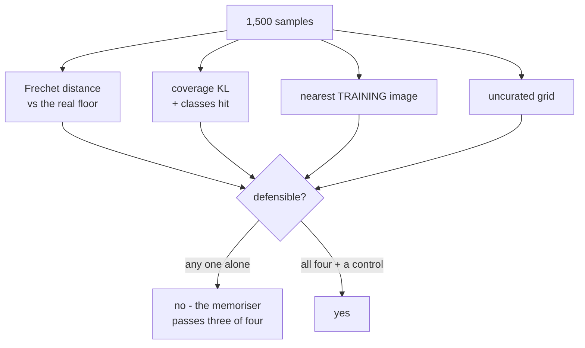

The first two capstones had an accuracy column. This one does not, and that single missing
column changes everything about what the deliverable is.

[Capstone 1](/deep-learning/phase-09---capstone-projects/capstone-1---an-image-classifier-end-to-end/)
could be summarised in one number, 0.8773, and defended by pointing at a held-out split.
[Capstone 2](/deep-learning/phase-09---capstone-projects/capstone-2---a-text-classifier-end-to-end/)
could be summarised in seven. A generative model produces images. There is no label to compare
them against, no split that scores itself, and the only thing that feels like evidence — a grid
of samples that look like digits — is the one thing you can produce without training anything at
all.

So the deliverable is not "a VAE". It is **a VAE and the evidence it works**, and the evidence
has to survive an adversary: a twelve-line program that generates nothing and copies 150 training
images instead. On this page that adversary beats the real model on two of the four metrics.

## What you'll learn

- Why every generative metric needs a **floor** measured from real data, and what the floor is.
- The four numbers that make a generative result defensible, and what each one alone misses.
- How a memoriser defeats the obvious memorisation check — and which check catches it.
- How to tell whether the latent space actually supports sampling before you look at samples.

## The setup

MNIST, 12,000 training images, a dense VAE with an 8-dimensional latent space, 25 epochs, **35
seconds** on CPU. A separate classifier — trained on the same data, reaching **0.9477**
validation accuracy — acts as the judge: it never sees the VAE, and it supplies both the feature
space distances are measured in and the class predictions coverage is measured from.

Four sources get scored, 1,500 samples each:

| Source | What it is |
| --- | --- |
| Real, held out | Real test digits, in neither reference set. **The floor.** |
| VAE, 25 epochs | The model the capstone is actually about. |
| VAE, 2 epochs | The same model trained badly. **The control.** |
| Memorised, 150 images | Copies of `x_train[:150]`, tiled. **The adversary.** |

The last two are the part people skip. Without the control you cannot show the metrics respond
to quality at all; without the adversary you cannot show they respond to *generation* rather
than to *resemblance*.

## The report

<Figure
  src="/images/dl/phase-09-capstones/generative-project/report"
  alt="Left: grouped bars for four sources across four metrics, each metric scaled to its largest value. The memorised source is lowest on distance to the nearest training image at 0.00 while the others sit near 5. Right: share of samples per digit class for each source, with the 2-epoch VAE spiking on some digits and missing two entirely."
  title="1,500 samples each, one judge"
  caption="The left panel is scaled per metric, so bar heights compare within a group and not across groups. The only column where the memoriser looks different from real data is the last one — distance to the nearest training image, 0.0035 against 5.0696. On the other three it is indistinguishable from a working model, and on Frechet distance it beats one."
/>

| Source | Fréchet | Classes | KL from uniform | Judge confidence | Nearest held-out | Nearest **training** |
| --- | --- | --- | --- | --- | --- | --- |
| Real, held out (floor) | **1.101** | 10 | 0.0016 | 0.9690 | 5.2787 | 5.0696 |
| VAE, 25 epochs | 17.343 | 10 | 0.0234 | 0.8481 | 5.0886 | 4.8392 |
| VAE, 2 epochs | 133.022 | **8** | **0.9654** | 0.7833 | 7.2647 | 7.1922 |
| Memorised, 150 images | **16.425** | 10 | 0.0294 | **0.9952** | 5.3939 | **0.0035** |

Read the memoriser's row before anything else. It scores **16.425** on Fréchet distance against
the VAE's 17.343 — *better*. It hits all ten classes. Its coverage KL is 0.0294 against the VAE's
0.0234, effectively a tie. The judge is more confident about it than about real held-out data,
0.9952 against 0.9690, because it is looking at images it was trained on.

**Three of the four metrics rank a program that generates nothing at or above the model that
generates something.** That is not a flaw in the metrics; it is what they measure. Fréchet
distance asks whether the sample distribution matches the real one, and copies of real data
trivially do.

## The check that failed

The obvious defence is a nearest-neighbour check: for each generated image, find the closest real
image and report the mean distance. If the model is copying, that distance collapses toward zero.

Here is what that check produced on the first attempt, comparing against held-out data:

| Source | Distance to nearest held-out image |
| --- | --- |
| Real, held out | 5.2787 |
| VAE, 25 epochs | 5.0886 |
| Memorised, 150 images | **5.3939** |

The memoriser scored **higher** than the VAE. The check did not merely fail to flag it — it
ranked it as the *least* suspicious of the three.

The reason is a one-word bug in the experiment, not the code. The memoriser copies from
`x_train`; the check measured against `x_test`. **Copies of training images are perfectly
ordinary digits as far as the test split is concerned** — no closer to it than real held-out data
is, which is exactly what 5.3939 against 5.2787 says.

:::danger[The split you compare against is the experiment]
A nearest-neighbour check against held-out data answers "is this sample a copy of *some* real
image". Only a check against the **training** data answers "is this a copy of something the model
was shown". They are different questions and the second is the one memorisation is about. Run the
first and the report contains a column, a plausible number, and no information — the check looks
like it ran.
:::

Against the training set the same computation reads:

| Source | Distance to nearest **training** image |
| --- | --- |
| Real, held out | 5.0696 |
| VAE, 25 epochs | 4.8392 |
| Memorised, 150 images | **0.0035** |

0.0035 is floating-point noise on top of zero. The adversary is now unmissable, and the VAE's
4.8392 sits just below the real-data floor of 5.0696 — slightly closer to the training set than
real data is, which is what a model that has learned the distribution *should* look like.

## The four numbers

Each metric catches something the others miss, which is why the report has four columns and not
one.

**Fréchet distance** compares the mean and covariance of judge features between real and
generated samples, treating each as a Gaussian:

$$
d^2 = \lVert \mu_r - \mu_g \rVert^2 + \operatorname{tr}\!\left(\Sigma_r + \Sigma_g - 2\left(\Sigma_r \Sigma_g\right)^{1/2}\right)
$$

It is a distribution-level measurement, so it is blind to whether individual samples are novel.
It also has a **floor that is not zero**: two disjoint samples of real data score 1.101 here, not
0, because 1,500 samples estimate $\mu$ and $\Sigma$ imperfectly. Quoting 17.343 without that
floor is quoting a number with no scale.

**Coverage** runs the judge over the samples and measures how far the predicted class histogram
is from uniform:

$$
D_{\mathrm{KL}}(u \parallel p) = \sum_{k=1}^{K} u_k \log \frac{u_k}{p_k}, \qquad u_k = \frac{1}{K}
$$

This is the mode-collapse detector, and it is the one metric where the 2-epoch control fails
loudly: 0.9654 against the trained model's 0.0234, with only 8 of 10 classes produced at all.

**Judge confidence** is the mean maximum softmax probability — how *typical* the samples look.
Note that it moves the wrong way for the memoriser (0.9952, above real data's 0.9690), which is
itself a signal: samples the judge finds easier than real data are usually samples the judge has
memorised too.

**Nearest-training distance** is the novelty check, and per the section above it only works
against the split the model trained on.



## Does the latent space support sampling?

Everything above scores samples. This checks something earlier: whether drawing $z \sim
\mathcal{N}(0, I)$ and decoding is even a meaningful operation.

<Figure
  src="/images/dl/phase-09-capstones/generative-project/latent"
  alt="Left: scatter of encoder means in the first two of eight latent dimensions, coloured by digit class, forming overlapping clusters centred near the origin. Right: two overlapping histograms of distance from the origin, the encoder means centred near 3.12 and the prior near 2.73, with substantial overlap."
  title="Encoder means for the held-out set, 8 latent dimensions"
  caption="The right panel is the check that matters. Encoder means sit at mean radius 3.1233 from the origin; samples from the prior sit at 2.7348. Those distributions overlap heavily, so a vector drawn from the prior lands in a region the decoder has actually seen. If the encoder radius were far from the prior's, every sample would be decoded from a place the model never visited during training."
/>

Two things get measured:

**Active dimensions.** A VAE can satisfy its KL term by switching latent dimensions off — driving
the posterior for a dimension to exactly the prior, which costs zero KL and carries zero
information. Here **8 of 8** dimensions have a standard deviation above 0.1 across the test set:

```
1.049  1.070  1.115  1.141  1.256  0.948  1.166  1.056
```

None collapsed. An 8-dimensional latent space that is really a 3-dimensional one still produces
images, and the sample grid will not tell you.

**Radius agreement.** In $d$ dimensions a standard normal concentrates on a shell of radius
approximately $\sqrt{d}$, not near the origin — for $d = 8$ that is 2.7348, measured. The encoder
means average 3.1233. Close enough that the prior samples where the decoder was trained; a
posterior sitting at, say, 0.9 would mean prior sampling was extrapolation dressed up as
generation.

## The uncurated grid

<Figure
  src="/images/dl/phase-09-capstones/generative-project/samples"
  alt="Three grids of 36 MNIST-like images each. The 25-epoch VAE grid shows blurry but recognisable digits, the 2-epoch grid shows indistinct grey blobs, and the memorised grid shows sharp, perfectly formed digits."
  title="The first 36 samples from each source, nothing selected"
  caption="Left to right: the trained VAE, the undertrained control, the memoriser. The memoriser's grid is the sharpest of the three by a wide margin — which is the whole problem with sample grids as evidence. The control's grid, by contrast, is honestly bad, and that is what the metrics are calibrated to detect."
/>

Sample grids belong in the report, but with two rules. **Uncurated** — the first $n$ samples from
a fixed seed, not the best $n$. And **beside the control**, because a grid alone has no scale:
the memoriser's grid is the most convincing one on this page.

```p5 title="Which check catches which failure" desc="Click a generator to score it. Each metric lights up green when it would pass and red when it would catch that generator - no single row catches everything." height="380"
let picked = 0;
const SOURCES = [
  ["real, held out", 1.101, 0.0016, 5.0696, 10],
  ["VAE, 25 epochs", 17.343, 0.0234, 4.8392, 10],
  ["VAE, 2 epochs", 133.022, 0.9654, 7.1922, 8],
  ["memorised x150", 16.425, 0.0294, 0.0035, 10],
];
const CHECKS = [
  ["Frechet distance", (r) => r[1] < 60, "close to the real distribution"],
  ["coverage KL", (r) => r[2] < 0.5, "all ten digits, roughly balanced"],
  ["nearest TRAINING", (r) => r[3] > 2.5, "not copying what it was shown"],
  ["classes hit", (r) => r[4] === 10, "no mode collapse"],
];
function setup() {
  createCanvas(620, 380);
  textFont("monospace");
}
function draw() {
  background(13, 17, 23);
  noStroke();
  fill(230);
  textSize(12);
  textAlign(LEFT, TOP);
  text("pick a source, then read down the checks", 26, 18);
  for (let i = 0; i < SOURCES.length; i++) {
    const x = 26 + i * 148;
    if (i === picked) { fill(255, 211, 67); } else { fill(48, 56, 68); }
    rect(x, 44, 138, 26, 4);
    if (i === picked) { fill(13, 17, 23); } else { fill(190); }
    textSize(9.5);
    textAlign(CENTER, CENTER);
    text(SOURCES[i][0], x + 69, 58);
  }
  const row = SOURCES[picked];
  textAlign(LEFT, TOP);
  let passed = 0;
  for (let i = 0; i < CHECKS.length; i++) {
    const y = 96 + i * 56;
    const ok = CHECKS[i][1](row);
    if (ok) { passed += 1; }
    if (ok) { fill(126, 192, 143); } else { fill(224, 108, 117); }
    rect(26, y, 10, 40, 2);
    fill(230);
    textSize(11);
    text(CHECKS[i][0], 48, y);
    fill(140);
    textSize(9);
    text(CHECKS[i][2], 48, y + 16);
    fill(ok ? 126 : 224, ok ? 192 : 108, ok ? 143 : 117);
    textSize(10);
    text(ok ? "passes" : "CAUGHT", 48, y + 28);
    fill(180);
    textSize(9.5);
    textAlign(RIGHT, TOP);
    const shown = [row[1], row[2], row[3], row[4]][i];
    text(i === 3 ? shown + " / 10" : shown.toFixed(4), 590, y + 8);
    textAlign(LEFT, TOP);
  }
  fill(150);
  textSize(9.5);
  text("passes " + passed + " of 4 checks", 26, 330);
  fill(255, 211, 67);
  textSize(10);
  if (picked === 3) {
    text("copies 150 training images and passes three of the four", 26, 350);
  } else if (picked === 2) {
    text("the control: caught by the metrics, as it should be", 26, 350);
  } else if (picked === 1) {
    text("the model: the only source that passes and generated anything", 26, 350);
  } else {
    text("the floor: this is what passing looks like", 26, 350);
  }
}
function mousePressed() {
  for (let i = 0; i < SOURCES.length; i++) {
    const x = 26 + i * 148;
    if (mouseX > x && mouseX < x + 138 && mouseY > 44 && mouseY < 70) {
      picked = i;
    }
  }
}
```

## What to hand in

1. **The floor**, measured on real data at the same sample count as everything else. 1.101 here.
   Without it, 17.343 is a number with no units.
2. **An undertrained control** — the same model, trained badly. 2 epochs: Fréchet 133.022,
   8 of 10 classes, KL 0.9654. It costs one extra run and it is the only thing that shows the
   metrics respond to quality rather than to noise.
3. **A memorisation adversary**, and the check that catches it, **against the training split**.
   Report the number, not the reassurance.
4. **All four metrics, including the ones your model loses on.** The VAE loses to the memoriser
   on Fréchet distance. Say so, and say why the result still stands.
5. **The latent diagnostics**: active dimensions (8 of 8) and encoder radius against prior radius
   (3.1233 against 2.7348), which justify prior sampling before any sample is shown.
6. **An uncurated grid** from a fixed seed, next to the control's grid.

```p5 title="The measured table, ranked" desc="Click a column to rank every row by it. The bars are that column's values and the highest and lowest are computed from the numbers, not written in." height="254"
let metric = 0;
const COLUMNS = ["Fréchet", "Classes", "KL from uniform", "Judge confidence"];
const ROWS = [
  ["Real, held out (floor)", 1.101, 10, 0.0016, 0.969],
  ["VAE, 25 epochs", 17.343, 10, 0.0234, 0.8481],
  ["VAE, 2 epochs", 133.022, 8, 0.9654, 0.7833],
  ["Memorised, 150 images", 16.425, 10, 0.0294, 0.9952]
];
function setup() {
  createCanvas(620, 254);
  textFont("monospace");
}
function fmt(v) {
  if (v === 0) { return "0"; }
  const a = Math.abs(v);
  if (a >= 1000 || a < 0.001) { return v.toExponential(2); }
  if (a >= 100) { return v.toFixed(1); }
  return v.toFixed(4);
}
function draw() {
  background(13, 17, 23);
  noStroke();
  fill(230);
  textSize(12);
  textAlign(LEFT, TOP);
  text("Capstone 3 - A Generative Model Yo", 26, 16);
  let x = 26;
  for (let i = 0; i < COLUMNS.length; i++) {
    const w = COLUMNS[i].length * 6.6 + 16;
    if (i === metric) { fill(255, 211, 67); } else { fill(48, 56, 68); }
    rect(x, 40, w, 22, 4);
    if (i === metric) { fill(13, 17, 23); } else { fill(180); }
    textSize(9);
    text(COLUMNS[i], x + 8, 47);
    x += w + 6;
    if (x > 500) { break; }
  }
  const values = ROWS.map((r) => r[metric + 1]);
  const lo = Math.min(...values);
  const hi = Math.max(...values);
  const span = hi - lo === 0 ? 1 : hi - lo;
  const order = ROWS.slice().sort((a, b) => b[metric + 1] - a[metric + 1]);
  for (let i = 0; i < order.length; i++) {
    const y = 78 + i * 26;
    const v = order[i][metric + 1];
    fill(160);
    textSize(9);
    text(order[i][0], 26, y + 5);
    fill(34, 40, 50);
    rect(230, y, 280, 18, 3);
    const frac = (v - lo) / span;
    if (v === hi) { fill(126, 192, 143); }
    else if (v === lo) { fill(224, 108, 117); }
    else { fill(107, 169, 221); }
    rect(230, y, Math.max(frac * 280, 3), 18, 3);
    fill(225);
    textSize(9);
    text(fmt(v), 518, y + 5);
  }
  const top = order[0];
  const bottom = order[order.length - 1];
  fill(150);
  textSize(9);
  const base = 78 + order.length * 26 + 8;
  text("highest " + COLUMNS[metric] + ": " + top[0] + " at " + fmt(top[1]),
       26, base);
  text("lowest  " + COLUMNS[metric] + ": " + bottom[0] + " at "
       + fmt(bottom[1]), 26, base + 14);
  text("bars are scaled within the chosen column - lowest is not zero", 26,
       base + 30);
}
function mousePressed() {
  let x = 26;
  for (let i = 0; i < COLUMNS.length; i++) {
    const w = COLUMNS[i].length * 6.6 + 16;
    if (mouseX > x && mouseX < x + w && mouseY > 40 && mouseY < 62) {
      metric = i;
    }
    x += w + 6;
  }
}
```

## Pitfalls

- **Reporting Fréchet distance without a floor.** Two samples of real data score 1.101 at
  $n = 1{,}500$; the floor moves with $n$, so it has to be measured at the same $n$.
- **Running the memorisation check against the wrong split.** 5.3939 against held-out data,
  0.0035 against training data — same code, same adversary, opposite conclusions.
- **Curating the sample grid.** The memoriser's grid is the best-looking one on this page.
- **Treating high judge confidence as quality.** The memoriser scored 0.9952, above real data.
- **Skipping the control.** Metrics that never saw a bad model have not been shown to detect one.
- **Assuming all latent dimensions are used.** A collapsed dimension costs zero KL and carries
  zero information, and nothing in the sample grid reveals it.
- **Comparing scores across judges or feature spaces.** Fréchet distance is only comparable
  against numbers computed with the same feature extractor on the same number of samples.

## Recap

- A generative result has no accuracy column, so the deliverable is the evaluation, not the model.
- A memoriser copying 150 training images beat the VAE on Fréchet distance (16.425 against
  17.343), tied it on coverage, and scored higher judge confidence than real data.
- The nearest-neighbour check against **held-out** data ranked the memoriser as the least
  suspicious source, at 5.3939. Against **training** data it read 0.0035.
- The floor is not zero: real against real scored 1.101 at 1,500 samples.
- The undertrained control failed loudly — 133.022, 8 of 10 classes, KL 0.9654 — which is what
  makes the trained model's numbers mean something.
- All 8 latent dimensions stayed active, and the encoder radius of 3.1233 sits close enough to
  the prior's 2.7348 that prior sampling is defensible.

## Next

That is the module. Nine phases, from a perceptron fitted by hand to a generative model with an
evaluation that survives an adversary.
[Back to the Deep Learning overview](/deep-learning/deep-learning/).

<Quiz
  questions={[
    {
      q: "A program that copies 150 training images scored 16.425 on Fréchet distance while the trained VAE scored 17.343. What does that show?",
      options: [
        "The memoriser is a better generative model",
        "Fréchet distance is broken and should not be used",
        "Fréchet distance measures distribution match, which copied real data trivially achieves - so it cannot detect memorisation on its own",
        "The VAE needs more epochs"
      ],
      answer: 2,
      explanation: "Fréchet distance compares the mean and covariance of the two sample sets. Copies of real data match the real distribution by construction. The metric is doing exactly what it claims; it just does not claim novelty."
    },
    {
      q: "The nearest-neighbour check gave the memoriser 5.3939 against held-out data and 0.0035 against training data. Why the difference?",
      options: [
        "The test split is noisier than the training split",
        "The memoriser copies from the training split, so its samples are ordinary unseen digits relative to the test split and exact matches relative to the training split",
        "The distance metric is unstable at small sample sizes",
        "Held-out images have different pixel scaling"
      ],
      answer: 1,
      explanation: "Memorisation is defined relative to what the model was shown. A check against data the model never saw answers a different question and returns a normal-looking number."
    },
    {
      q: "Two disjoint samples of real held-out data scored 1.101 on Fréchet distance rather than 0. What is that number?",
      options: [
        "A bug in the implementation",
        "Evidence that the test set is not representative",
        "The estimation floor - 1,500 samples estimate the mean and covariance imperfectly, so any generative score must be read against it",
        "The irreducible error of the judge classifier"
      ],
      answer: 2,
      explanation: "The floor shrinks as the sample size grows and must be measured at the same n as the scores it calibrates."
    },
    {
      q: "Why is an undertrained control (the same VAE at 2 epochs) part of the deliverable?",
      options: [
        "To show the model improves with training",
        "To demonstrate that the metrics respond to quality - without a known-bad source, nothing shows the metrics can detect one",
        "To provide a second set of samples for the grid",
        "To measure how long training takes"
      ],
      answer: 1,
      explanation: "The control scored 133.022 with 8 of 10 classes and KL 0.9654. A metric suite that has never been shown failing on a bad model has not been validated."
    },
    {
      q: "All 8 latent dimensions had standard deviation above 0.1, and encoder means averaged 3.1233 from the origin against the prior's 2.7348. What do those two facts establish?",
      options: [
        "That the VAE reconstructs its inputs accurately",
        "That the samples will be sharp",
        "That no dimension collapsed to the prior, and that vectors drawn from the prior land where the decoder was actually trained - so prior sampling is meaningful",
        "That the latent space is 8-dimensional"
      ],
      answer: 2,
      explanation: "A collapsed dimension carries no information at zero KL cost, and a posterior radius far from the prior's means prior samples are decoded from unvisited regions. Both are invisible in a sample grid."
    },
    {
      q: "The judge classifier was more confident about the memoriser's images (0.9952) than about real held-out data (0.9690). What should that be read as?",
      options: [
        "Evidence the memoriser produces high-quality images",
        "A signal - samples the judge finds easier than real data are typically samples it was trained on",
        "A miscalibration of the judge that invalidates the report",
        "Proof the judge overfitted the test set"
      ],
      answer: 1,
      explanation: "Confidence measures typicality, not quality or novelty. Above-real-data confidence points at training-set overlap rather than at a better generator."
    }
  ]}
/>

## 🧪 Try It Yourself

<DataCampExercise
  lang="python"
  hint={`Both halves are real data, so the true distance is zero - whatever you measure is the estimation bias at that sample size.`}
  code={`# Task: Exercise 1 - Measure the floor before you quote a score
import numpy as np
from scipy import linalg
from sklearn.datasets import load_digits

pool = load_digits().data / 16.0


def features(images):
    """16 features per image: mean intensity of each 2x2 block."""
    return images.reshape(len(images), 4, 2, 4, 2).mean(axis=(2, 4)).reshape(len(images), 16)


def frechet(a, b):
    mu_a, mu_b = a.mean(0), b.mean(0)
    eye = np.eye(a.shape[1]) * 1e-6            # keep sqrtm out of the weeds
    cov_a = np.cov(a, rowvar=False) + eye
    cov_b = np.cov(b, rowvar=False) + eye
    covmean, _ = linalg.sqrtm(cov_a @ cov_b, disp=False)
    return float(((mu_a - mu_b) ** 2).sum()
                 + np.trace(cov_a + cov_b - 2 * np.real(___)))  # the matrix square root


encoded = features(pool)
rng = np.random.default_rng(0)
floors = []
print(f"{'samples per side':>17} {'Frechet, real vs real':>23}")
for n in (50, 100, 200, 400, 800):
    scores = []
    for _ in range(5):                          # average away the draw luck
        picked = rng.choice(len(encoded), 2 * n, replace=False)
        scores.append(frechet(encoded[picked[:n]], encoded[picked[n:]]))
    floors.append(float(np.mean(scores)))
    print(f"{n:17,} {floors[-1]:23.4f}")
print("both halves are real digits, so the true distance is zero")
print("the measured floor shrinks as the sample grows:", floors[0] > floors[-1])`}
  solution={`# Task: Exercise 1 - Measure the floor before you quote a score
import numpy as np
from scipy import linalg
from sklearn.datasets import load_digits

pool = load_digits().data / 16.0


def features(images):
    """16 features per image: mean intensity of each 2x2 block."""
    return images.reshape(len(images), 4, 2, 4, 2).mean(axis=(2, 4)).reshape(len(images), 16)


def frechet(a, b):
    mu_a, mu_b = a.mean(0), b.mean(0)
    eye = np.eye(a.shape[1]) * 1e-6            # keep sqrtm out of the weeds
    cov_a = np.cov(a, rowvar=False) + eye
    cov_b = np.cov(b, rowvar=False) + eye
    covmean, _ = linalg.sqrtm(cov_a @ cov_b, disp=False)
    return float(((mu_a - mu_b) ** 2).sum()
                 + np.trace(cov_a + cov_b - 2 * np.real(covmean)))  # the matrix square root


encoded = features(pool)
rng = np.random.default_rng(0)
floors = []
print(f"{'samples per side':>17} {'Frechet, real vs real':>23}")
for n in (50, 100, 200, 400, 800):
    scores = []
    for _ in range(5):                          # average away the draw luck
        picked = rng.choice(len(encoded), 2 * n, replace=False)
        scores.append(frechet(encoded[picked[:n]], encoded[picked[n:]]))
    floors.append(float(np.mean(scores)))
    print(f"{n:17,} {floors[-1]:23.4f}")
print("both halves are real digits, so the true distance is zero")
print("the measured floor shrinks as the sample grows:", floors[0] > floors[-1])`}
  sct={`test_output_contains("the measured floor shrinks as the sample grows: True", pattern=False)
success_msg("Even two halves of the same real data have a positive Frechet distance, a bias that shrinks with the sample size: measure the floor at the same n before quoting a score.")`}
  height={400}
/>

<DataCampExercise
  lang="python"
  hint={`Score each source twice - against the split the model never saw, and against the split it trained on.`}
  code={`# Task: Exercise 2 - Run the memorisation check against both splits
import numpy as np
from sklearn.datasets import load_digits

digits = load_digits().data / 16.0
train = digits[:1000]
held_out = digits[1000:1600]


def nearest(samples, reference):
    squared = (np.sum(samples ** 2, axis=1)[:, None]
               + np.sum(reference ** 2, axis=1)[None, :]
               - 2 * samples @ reference.T)
    return float(np.sqrt(np.maximum(squared.min(axis=1), 0)).mean())


rng = np.random.default_rng(0)
sources = {
    "real, held out": held_out[:200],
    "noise": rng.random((200, 64)),
    "memorised training data": np.tile(train[:50], (4, 1)),
}
print(f"{'source':26s} {'vs HELD-OUT':>13} {'vs TRAINING':>13} {'caught?':>9}")
caught_by = {}
for label, samples in sources.items():
    against_test = nearest(samples, held_out[200:])
    against_train = nearest(samples, ___)          # the training split
    caught_by[label] = against_train < 0.5
    print(f"{label:26s} {against_test:13.4f} {against_train:13.4f} "
          f"{'yes' if caught_by[label] else 'no':>9}")
print("only the training split catches the memoriser:",
      caught_by["memorised training data"] and not caught_by["real, held out"])`}
  solution={`# Task: Exercise 2 - Run the memorisation check against both splits
import numpy as np
from sklearn.datasets import load_digits

digits = load_digits().data / 16.0
train = digits[:1000]
held_out = digits[1000:1600]


def nearest(samples, reference):
    squared = (np.sum(samples ** 2, axis=1)[:, None]
               + np.sum(reference ** 2, axis=1)[None, :]
               - 2 * samples @ reference.T)
    return float(np.sqrt(np.maximum(squared.min(axis=1), 0)).mean())


rng = np.random.default_rng(0)
sources = {
    "real, held out": held_out[:200],
    "noise": rng.random((200, 64)),
    "memorised training data": np.tile(train[:50], (4, 1)),
}
print(f"{'source':26s} {'vs HELD-OUT':>13} {'vs TRAINING':>13} {'caught?':>9}")
caught_by = {}
for label, samples in sources.items():
    against_test = nearest(samples, held_out[200:])
    against_train = nearest(samples, train)          # the training split
    caught_by[label] = against_train < 0.5
    print(f"{label:26s} {against_test:13.4f} {against_train:13.4f} "
          f"{'yes' if caught_by[label] else 'no':>9}")
print("only the training split catches the memoriser:",
      caught_by["memorised training data"] and not caught_by["real, held out"])`}
  sct={`test_output_contains("only the training split catches the memoriser: True", pattern=False)
success_msg("Copied digits look perfectly normal against the held-out split: only a comparison against the training split catches a memoriser.")`}
  height={400}
/>

<DataCampExercise
  lang="python"
  hint={`KL(uniform || share) is zero for a perfectly balanced generator and grows without bound as classes go missing.`}
  code={`# Task: Exercise 3 - What coverage catches and what it cannot
import numpy as np

CLASSES = 10
uniform = np.full(CLASSES, 1 / CLASSES)


def divergence(share):
    """KL(uniform || share) - large when the generator skips a class."""
    return float(np.sum(uniform * np.log(uniform / np.clip(___, 1e-9, None))))


rng = np.random.default_rng(0)
GENERATORS = {
    "balanced": np.full(CLASSES, 0.1),
    "mildly skewed": np.array([.14, .13, .12, .11, .10, .09, .08, .08, .08, .07]),
    "five modes lost": np.array([.25, .25, .20, .20, .10, 0., 0., 0., 0., 0.]),
    "one mode only": np.array([1., 0., 0., 0., 0., 0., 0., 0., 0., 0.]),
}

print(f"{'generator':18s} {'classes hit':>12} {'KL from uniform':>17} "
      f"{'largest share':>15}")
for label, share in GENERATORS.items():
    hit = int((share > 0.01).sum())
    print(f"{label:18s} {hit:12d} {divergence(share):17.4f} "
          f"{float(share.max()):15.4f}")

print("\\ncounting classes is a blunt instrument: 'mildly skewed' and")
print("'balanced' both hit 10 of 10, and only the KL separates them")
print(f"({divergence(GENERATORS['mildly skewed']):.4f} against "
      f"{divergence(GENERATORS['balanced']):.4f})")
print("neither metric looks at a single image - a generator emitting ten")
print("kinds of noise in equal proportion would score perfectly here, which")
print("is why coverage is reported alongside Frechet distance, never alone")`}
  solution={`# Task: Exercise 3 - What coverage catches and what it cannot
import numpy as np

CLASSES = 10
uniform = np.full(CLASSES, 1 / CLASSES)


def divergence(share):
    """KL(uniform || share) - large when the generator skips a class."""
    return float(np.sum(uniform * np.log(uniform / np.clip(share, 1e-9, None))))


rng = np.random.default_rng(0)
GENERATORS = {
    "balanced": np.full(CLASSES, 0.1),
    "mildly skewed": np.array([.14, .13, .12, .11, .10, .09, .08, .08, .08, .07]),
    "five modes lost": np.array([.25, .25, .20, .20, .10, 0., 0., 0., 0., 0.]),
    "one mode only": np.array([1., 0., 0., 0., 0., 0., 0., 0., 0., 0.]),
}

print(f"{'generator':18s} {'classes hit':>12} {'KL from uniform':>17} "
      f"{'largest share':>15}")
for label, share in GENERATORS.items():
    hit = int((share > 0.01).sum())
    print(f"{label:18s} {hit:12d} {divergence(share):17.4f} "
          f"{float(share.max()):15.4f}")

print("\\ncounting classes is a blunt instrument: 'mildly skewed' and")
print("'balanced' both hit 10 of 10, and only the KL separates them")
print(f"({divergence(GENERATORS['mildly skewed']):.4f} against "
      f"{divergence(GENERATORS['balanced']):.4f})")
print("neither metric looks at a single image - a generator emitting ten")
print("kinds of noise in equal proportion would score perfectly here, which")
print("is why coverage is reported alongside Frechet distance, never alone")`}
  sct={`test_output_contains("counting classes is a blunt instrument", pattern=False)
test_output_contains("one mode only", pattern=False)
test_output_contains("balanced", pattern=False)
success_msg("Counting classes is a blunt instrument; the KL from uniform separates a skewed generator from a balanced one.")`}
  height={400}
/>

<DataCampExercise
  lang="python"
  hint={`A standard normal in d dimensions concentrates on a shell of radius about sqrt(d), so "near the origin" means something different in every latent size.`}
  code={`# Task: Exercise 4 - Where the prior actually lives
import numpy as np

rng = np.random.default_rng(0)
ROWS = 4000

print(f"{'latent dims':>12} {'prior radius':>14} {'sqrt(d - 0.5)':>15} "
      f"{'collapsed sd 0.3':>18} {'ratio':>8}")
for dims in (2, 8, 32, 128):
    prior = np.linalg.norm(rng.normal(0, 1, (ROWS, dims)), axis=___).mean()
    collapsed = np.linalg.norm(rng.normal(0, 0.3, (ROWS, dims)), axis=1).mean()
    print(f"{dims:12d} {prior:14.4f} {np.sqrt(dims - 0.5):15.4f} "
          f"{collapsed:18.4f} {collapsed / prior:8.4f}")

print("\\nthe prior's radius grows like sqrt(d), so 'close to the origin' means")
print("something different in every latent size - the number is only readable")
print("next to the prior measured in the same dimension")
print("\\na posterior with standard deviation 0.3 sits at 0.30 of the prior's")
print("radius in every dimension. Sampling from the prior then lands the")
print("decoder in a region it never saw during training, and the sample grid")
print("is where you notice")`}
  solution={`# Task: Exercise 4 - Where the prior actually lives
import numpy as np

rng = np.random.default_rng(0)
ROWS = 4000

print(f"{'latent dims':>12} {'prior radius':>14} {'sqrt(d - 0.5)':>15} "
      f"{'collapsed sd 0.3':>18} {'ratio':>8}")
for dims in (2, 8, 32, 128):
    prior = np.linalg.norm(rng.normal(0, 1, (ROWS, dims)), axis=1).mean()
    collapsed = np.linalg.norm(rng.normal(0, 0.3, (ROWS, dims)), axis=1).mean()
    print(f"{dims:12d} {prior:14.4f} {np.sqrt(dims - 0.5):15.4f} "
          f"{collapsed:18.4f} {collapsed / prior:8.4f}")

print("\\nthe prior's radius grows like sqrt(d), so 'close to the origin' means")
print("something different in every latent size - the number is only readable")
print("next to the prior measured in the same dimension")
print("\\na posterior with standard deviation 0.3 sits at 0.30 of the prior's")
print("radius in every dimension. Sampling from the prior then lands the")
print("decoder in a region it never saw during training, and the sample grid")
print("is where you notice")`}
  sct={`test_output_contains("sqrt(d - 0.5)", pattern=False)
test_output_contains("the prior's radius grows like sqrt(d)", pattern=False)
success_msg("The radius of the prior grows like the square root of the dimension, so 'close to the origin' only means something in the same dimension.")`}
  height={400}
/>

<DataCampExercise
  lang="python"
  hint={`The reparameterisation trick: sample noise, scale it by exp(0.5 * log_var), add the mean. The KL term keeps the posterior near the prior.`}
  code={`# Task: Exercise 5 - Train the VAE and run the latent diagnostics
import numpy as np
from sklearn.datasets import load_digits

LATENT = 4
digits = load_digits().data / 16.0
x_train, x_test = digits[:1200], digits[1200:]
rng = np.random.default_rng(0)


def sigmoid(u):
    return 1 / (1 + np.exp(-u))


w_mu = rng.normal(0, 0.1, (64, LATENT)); b_mu = np.zeros(LATENT)
w_lv = rng.normal(0, 0.1, (64, LATENT)); b_lv = np.zeros(LATENT)
w_d = rng.normal(0, 0.1, (LATENT, 64)); b_d = np.zeros(64)
params = [w_mu, b_mu, w_lv, b_lv, w_d, b_d]
first = [np.zeros_like(p) for p in params]
second = [np.zeros_like(p) for p in params]
batch = len(x_train)
for t in range(1, 401):
    mu = x_train @ w_mu + b_mu
    log_var = np.clip(x_train @ w_lv + b_lv, -8, 4)
    eps = rng.normal(size=mu.shape)
    z = mu + np.exp(0.5 * log_var) * ___          # the noise draw
    x_hat = sigmoid(z @ w_d + b_d)
    d_u = (x_hat - x_train) / batch
    d_z = d_u @ w_d.T
    d_mu = d_z + mu / batch
    d_lv = d_z * eps * 0.5 * np.exp(0.5 * log_var) + 0.5 * (np.exp(log_var) - 1) / batch
    grads = [x_train.T @ d_mu, d_mu.sum(0), x_train.T @ d_lv, d_lv.sum(0),
             z.T @ d_u, d_u.sum(0)]
    for i, (p, g) in enumerate(zip(params, grads)):         # Adam update
        first[i] = 0.9 * first[i] + 0.1 * g
        second[i] = 0.999 * second[i] + 0.001 * g * g
        p -= 0.02 * (first[i] / (1 - 0.9 ** t)) / (np.sqrt(second[i] / (1 - 0.999 ** t)) + 1e-8)

means = x_test @ w_mu + b_mu
active = int((means.std(axis=0) > 0.1).sum())
radius = float(np.linalg.norm(means, axis=1).mean())
prior = float(np.linalg.norm(rng.normal(0, 1, means.shape), axis=1).mean())
print(f"active dimensions: {active} of {LATENT}")
print(f"encoder radius:    {radius:.2f}")
print(f"prior radius:      {prior:.2f}")
print("at least one latent dimension is active:", active >= 1)
print("the encoder radius is within a factor of 3 of the prior radius:", prior / 3 < radius < prior * 3)`}
  solution={`# Task: Exercise 5 - Train the VAE and run the latent diagnostics
import numpy as np
from sklearn.datasets import load_digits

LATENT = 4
digits = load_digits().data / 16.0
x_train, x_test = digits[:1200], digits[1200:]
rng = np.random.default_rng(0)


def sigmoid(u):
    return 1 / (1 + np.exp(-u))


w_mu = rng.normal(0, 0.1, (64, LATENT)); b_mu = np.zeros(LATENT)
w_lv = rng.normal(0, 0.1, (64, LATENT)); b_lv = np.zeros(LATENT)
w_d = rng.normal(0, 0.1, (LATENT, 64)); b_d = np.zeros(64)
params = [w_mu, b_mu, w_lv, b_lv, w_d, b_d]
first = [np.zeros_like(p) for p in params]
second = [np.zeros_like(p) for p in params]
batch = len(x_train)
for t in range(1, 401):
    mu = x_train @ w_mu + b_mu
    log_var = np.clip(x_train @ w_lv + b_lv, -8, 4)
    eps = rng.normal(size=mu.shape)
    z = mu + np.exp(0.5 * log_var) * eps          # the noise draw
    x_hat = sigmoid(z @ w_d + b_d)
    d_u = (x_hat - x_train) / batch
    d_z = d_u @ w_d.T
    d_mu = d_z + mu / batch
    d_lv = d_z * eps * 0.5 * np.exp(0.5 * log_var) + 0.5 * (np.exp(log_var) - 1) / batch
    grads = [x_train.T @ d_mu, d_mu.sum(0), x_train.T @ d_lv, d_lv.sum(0),
             z.T @ d_u, d_u.sum(0)]
    for i, (p, g) in enumerate(zip(params, grads)):         # Adam update
        first[i] = 0.9 * first[i] + 0.1 * g
        second[i] = 0.999 * second[i] + 0.001 * g * g
        p -= 0.02 * (first[i] / (1 - 0.9 ** t)) / (np.sqrt(second[i] / (1 - 0.999 ** t)) + 1e-8)

means = x_test @ w_mu + b_mu
active = int((means.std(axis=0) > 0.1).sum())
radius = float(np.linalg.norm(means, axis=1).mean())
prior = float(np.linalg.norm(rng.normal(0, 1, means.shape), axis=1).mean())
print(f"active dimensions: {active} of {LATENT}")
print(f"encoder radius:    {radius:.2f}")
print(f"prior radius:      {prior:.2f}")
print("at least one latent dimension is active:", active >= 1)
print("the encoder radius is within a factor of 3 of the prior radius:", prior / 3 < radius < prior * 3)`}
  sct={`test_output_contains("at least one latent dimension is active: True", pattern=False)
test_output_contains("the encoder radius is within a factor of 3 of the prior radius: True", pattern=False)
success_msg("Comparing the encoder's radius with the prior's tells you whether samples drawn from the prior land where the decoder was trained.")`}
  height={400}
/>

<DataCampExercise
  lang="python"
  hint={`Score four sources on three metrics. Watch which source wins each one - the ranking is not the same twice.`}
  code={`# Task: Exercise 6 - Build the whole report, adversary included
import numpy as np
from scipy import linalg
from sklearn.datasets import load_digits

digits = load_digits()
pool, labels = digits.data / 16.0, digits.target
train, y_train = pool[:1000], labels[:1000]
held_out = pool[1000:1400]
reference = pool[1400:]
# The judge: one centroid per class, the cheapest classifier that works.
centroids = np.stack([train[y_train == digit].mean(0) for digit in range(10)])


def judge(samples):
    return np.argmin(((samples[:, None, :] - centroids[None]) ** 2).sum(2), 1)


def blocks(images):
    """16 features per image: mean intensity of each 2x2 block."""
    return images.reshape(len(images), 4, 2, 4, 2).mean((2, 4)).reshape(len(images), 16)


def frechet(a, b):
    a, b = blocks(a), blocks(b)
    eye = np.eye(16) * 1e-6
    cov_a, cov_b = np.cov(a, rowvar=False) + eye, np.cov(b, rowvar=False) + eye
    covmean, _ = linalg.sqrtm(cov_a @ cov_b, disp=False)
    return float(((a.mean(0) - b.mean(0)) ** 2).sum()
                 + np.trace(cov_a + cov_b - 2 * np.real(covmean)))


def divergence(samples):
    share = np.bincount(judge(samples), minlength=10) / len(samples)
    uniform = np.full(10, 0.1)
    return float(np.sum(uniform * np.log(uniform / np.clip(share, 1e-9, None))))


def nearest(samples, source):
    squared = (np.sum(samples ** 2, 1)[:, None] + np.sum(source ** 2, 1)[None]
               - 2 * samples @ source.T)
    return float(np.sqrt(np.maximum(squared.min(1), 0)).mean())


rng = np.random.default_rng(0)
noisy = np.clip(held_out[:300] + rng.normal(0, 0.25, (300, 64)), 0, 1)
SOURCES = {
    "real, held out": held_out[:300],
    "a mediocre generator": noisy,
    "memorised training": train[:300],
    "one digit, repeated": np.tile(train[y_train == 3][:1], (300, 1)),
}
print(f"{'source':22s} {'Frechet':>9} {'KL unif':>9} {'near train':>12}")
rows = {}
for label, samples in SOURCES.items():
    rows[label] = (frechet(reference, samples), divergence(samples),
                   nearest(samples[:200], ___))     # the training split
    print(f"{label:22s} {rows[label][0]:9.4f} {rows[label][1]:9.4f} {rows[label][2]:12.4f}")
memoriser, mediocre = rows["memorised training"], rows["a mediocre generator"]
collapse = rows["one digit, repeated"]
print("the memoriser beats the mediocre generator on Frechet distance:", memoriser[0] < mediocre[0])
print("only the distance to the training set exposes the memoriser:", memoriser[2] < 0.01 < mediocre[2])
print("the coverage number catches the one-digit source:", collapse[1] > 5 * mediocre[1])
print("no single metric is enough, which is why the report has four columns")`}
  solution={`# Task: Exercise 6 - Build the whole report, adversary included
import numpy as np
from scipy import linalg
from sklearn.datasets import load_digits

digits = load_digits()
pool, labels = digits.data / 16.0, digits.target
train, y_train = pool[:1000], labels[:1000]
held_out = pool[1000:1400]
reference = pool[1400:]
# The judge: one centroid per class, the cheapest classifier that works.
centroids = np.stack([train[y_train == digit].mean(0) for digit in range(10)])


def judge(samples):
    return np.argmin(((samples[:, None, :] - centroids[None]) ** 2).sum(2), 1)


def blocks(images):
    """16 features per image: mean intensity of each 2x2 block."""
    return images.reshape(len(images), 4, 2, 4, 2).mean((2, 4)).reshape(len(images), 16)


def frechet(a, b):
    a, b = blocks(a), blocks(b)
    eye = np.eye(16) * 1e-6
    cov_a, cov_b = np.cov(a, rowvar=False) + eye, np.cov(b, rowvar=False) + eye
    covmean, _ = linalg.sqrtm(cov_a @ cov_b, disp=False)
    return float(((a.mean(0) - b.mean(0)) ** 2).sum()
                 + np.trace(cov_a + cov_b - 2 * np.real(covmean)))


def divergence(samples):
    share = np.bincount(judge(samples), minlength=10) / len(samples)
    uniform = np.full(10, 0.1)
    return float(np.sum(uniform * np.log(uniform / np.clip(share, 1e-9, None))))


def nearest(samples, source):
    squared = (np.sum(samples ** 2, 1)[:, None] + np.sum(source ** 2, 1)[None]
               - 2 * samples @ source.T)
    return float(np.sqrt(np.maximum(squared.min(1), 0)).mean())


rng = np.random.default_rng(0)
noisy = np.clip(held_out[:300] + rng.normal(0, 0.25, (300, 64)), 0, 1)
SOURCES = {
    "real, held out": held_out[:300],
    "a mediocre generator": noisy,
    "memorised training": train[:300],
    "one digit, repeated": np.tile(train[y_train == 3][:1], (300, 1)),
}
print(f"{'source':22s} {'Frechet':>9} {'KL unif':>9} {'near train':>12}")
rows = {}
for label, samples in SOURCES.items():
    rows[label] = (frechet(reference, samples), divergence(samples),
                   nearest(samples[:200], train))     # the training split
    print(f"{label:22s} {rows[label][0]:9.4f} {rows[label][1]:9.4f} {rows[label][2]:12.4f}")
memoriser, mediocre = rows["memorised training"], rows["a mediocre generator"]
collapse = rows["one digit, repeated"]
print("the memoriser beats the mediocre generator on Frechet distance:", memoriser[0] < mediocre[0])
print("only the distance to the training set exposes the memoriser:", memoriser[2] < 0.01 < mediocre[2])
print("the coverage number catches the one-digit source:", collapse[1] > 5 * mediocre[1])
print("no single metric is enough, which is why the report has four columns")`}
  sct={`test_output_contains("only the distance to the training set exposes the memoriser: True", pattern=False)
test_output_contains("the coverage number catches the one-digit source: True", pattern=False)
success_msg("Each failure is caught by a different column: Frechet misses the memoriser, the training-set distance exposes it, and only coverage catches the one-digit generator.")`}
  height={400}
/>
