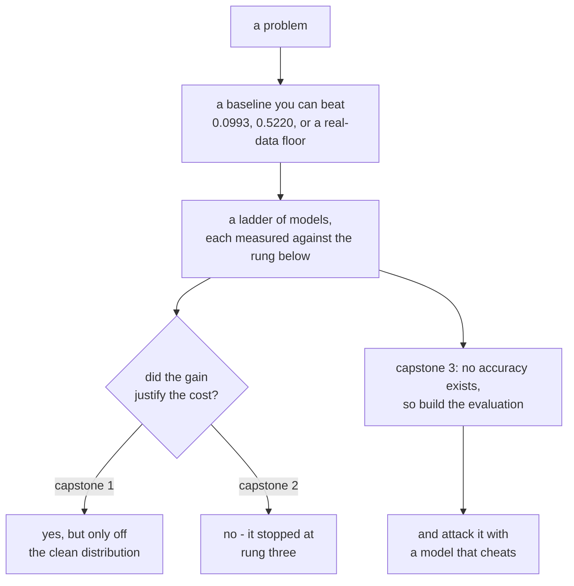

import Figure from "../../../../components/Figure.astro";
import Quiz from "../../../../components/Quiz.astro";

The eight phases before this one each isolated a mechanism. This one puts the whole thing together
three times, on three problems that fail in three different ways — and in every case the
deliverable is not the model. It is **the evidence that the model works**, in a form someone
sceptical can check.

Everything below was measured on this machine: TensorFlow 2.21, Keras 3.15, **CPU only, 8 cores**.

## The three projects

| Capstone | Problem | What it turns out to be about |
| --- | --- | --- |
| [1 — An image classifier](/deep-learning/phase-09---capstone-projects/capstone-1---an-image-classifier-end-to-end/) | Fashion-MNIST, 12,000 train / 3,000 held out | A ladder that climbs, and the rung whose gain is **negative** |
| [2 — A text classifier](/deep-learning/phase-09---capstone-projects/capstone-2---a-text-classifier-end-to-end/) | IMDB sentiment, 6,000 train / 3,000 held out | A ladder that **stops at rung three** and what to report when it does |
| [3 — A generative model](/deep-learning/phase-09---capstone-projects/capstone-3---a-generative-model-you-can-defend/) | MNIST, a VAE with an 8-dimensional latent space | A result with **no accuracy column**, and the adversary it has to survive |

## What each one measured

**Capstone 1** built six rungs from a constant predictor to a deployed TFLite artefact:

| Rung | Accuracy | Gain |
| --- | --- | --- |
| Always predict one class | 0.0993 | — |
| Nearest class centroid | 0.6713 | +0.5720 |
| Linear (softmax) | 0.8290 | +0.1577 |
| MLP | 0.8603 | +0.0313 |
| Convnet | **0.8773** | +0.0170 |
| Convnet + augmentation | 0.8643 | **−0.0130** |

The last row is the finding. Augmentation cost 0.0130 on the clean test set and gained **0.4207**
on the same test set shifted three pixels — 0.2947 against 0.7153. A single held-out number said
the change was bad; six of them said the opposite.

**Capstone 2** built the same kind of ladder on text and watched it stop:

| Model | Seconds | Accuracy |
| --- | --- | --- |
| Bag of words + linear | **3** | 0.8507 |
| Embedding + pooling | 6 | **0.8587** |
| LSTM | 53 | 0.8353 |
| Bidirectional LSTM | 113 | 0.7887 |
| Self-attention | 165 | 0.7957 |

A linear model with no word-order information at all beat every sequence model, at 18× to 55×
less training time. The page's job is then to say *why* — 6,000 examples, 6 epochs, a 200-token
window truncating 43.3% of reviews — so the result reads as a claim about the budget rather than
a claim about recurrence.

**Capstone 3** removed the accuracy column entirely. A VAE produces images; there is no label to
score them against. So the evaluation itself became the deliverable, and it was tested against a
twelve-line adversary that copies 150 training images and generates nothing:

| Source | Fréchet | KL from uniform | Nearest **training** |
| --- | --- | --- | --- |
| Real, held out (floor) | 1.101 | 0.0016 | 5.0696 |
| VAE, 25 epochs | 17.343 | 0.0234 | 4.8392 |
| Memorised, 150 images | **16.425** | 0.0294 | **0.0035** |

The memoriser beat the real model on Fréchet distance and tied it on coverage. Only the distance
to the **training** split exposed it — and the first version of that check, run against held-out
data, ranked the memoriser as the *least* suspicious source of the three.

<Figure
  src="/images/dl/phase-09-capstones/image-classifier/robustness"
  alt="Grouped bars comparing the plain convnet against the augmented one across six conditions. On clean data the plain model leads 0.8773 to 0.8643, but on shifted and rotated test sets the augmented model leads by increasing margins, reaching 0.7153 against 0.2947 at a three-pixel shift."
  title="The same two models, six versions of the test set"
  caption="The clean column is the only one where the plain convnet wins, and it wins by 0.0130. On a three-pixel shift — a change no human would remark on — the plain model collapses to 0.2947 while the augmented one holds 0.7153, a gap of 0.4207. Augmentation did not cost accuracy; it moved accuracy from a distribution you will not deploy on to distributions you might."
/>

<Figure
  src="/images/dl/phase-09-capstones/generative-project/report"
  alt="Left: grouped bars for four sources across four metrics, each metric scaled to its largest value. The memorised source is lowest on distance to the nearest training image at 0.00 while the others sit near 5. Right: share of samples per digit class for each source, with the 2-epoch VAE spiking on some digits and missing two entirely."
  title="1,500 samples each, one judge"
  caption="The left panel is scaled per metric, so bar heights compare within a group and not across groups. The only column where the memoriser looks different from real data is the last one — distance to the nearest training image, 0.0035 against 5.0696. On the other three it is indistinguishable from a working model, and on Frechet distance it beats one."
/>

<Figure
  src="/images/dl/overviews/phase-summaries/phase-9"
  alt="Horizontal bars, one per page in the phase, each labelled with the claim it tested and coloured by the verdict: green where the standard story held, amber where it held at a price, red where the measurement contradicted it. 5 of 6 claims contradicted, 1 held at a price, 0 held."
  title="Every claim this phase set out to test"
  caption="Collected from the runs behind each page's own figures rather than measured afresh, so every bar is traceable to the page it names. Bar length is the log of the effect size, because the effects span from 0.0014 to 5,376 — the number that matters is printed on each bar. Across all nine phases, 34 of 54 claims were contradicted outright, 11 held at a cost that was worth stating, and 9 held as advertised."
/>

## The thread



Three habits recur across all three pages, and they are the transferable part.

**A number needs a floor.** 0.8773 means nothing without 0.0993 beside it; 17.343 means nothing
without 1.101. Every capstone starts by measuring the cheapest thing that could possibly work,
because that is what makes every later number readable.

**One test set answers one question.** Augmentation looked like a regression on clean data and a
0.4207 improvement three pixels away. The IMDB ladder looked flat until reviews were bucketed by
length. A single held-out score is a measurement of one distribution, not a property of the model.

**Report the rungs that lost.** The negative gain, the LSTM that came fourth, the metric the
memoriser won — those are the results that let someone else trust the ones that went your way.

```p5 title="One test set answers one question" desc="Pick a test set. The two capstone-1 models swap places depending on which distribution you judge them on - and neither is better in general." height="360"
let picked = 0;
const CONDITIONS = ["clean", "shift 1px", "shift 2px", "shift 3px",
                    "rotate 10", "rotate 20"];
const PLAIN = [0.8773, 0.8177, 0.6020, 0.2947, 0.8187, 0.6133];
const AUGMENTED = [0.8643, 0.8500, 0.8173, 0.7153, 0.8443, 0.7350];
function setup() {
  createCanvas(620, 360);
  textFont("monospace");
}
function draw() {
  background(13, 17, 23);
  noStroke();
  fill(230);
  textSize(12);
  textAlign(LEFT, TOP);
  text("Fashion-MNIST, 3,000 held out - same two trained models", 26, 18);
  for (let i = 0; i < CONDITIONS.length; i++) {
    const x = 26 + (i % 3) * 190;
    const y = 46 + Math.floor(i / 3) * 30;
    if (i === picked) { fill(255, 211, 67); } else { fill(48, 56, 68); }
    rect(x, y, 178, 24, 4);
    if (i === picked) { fill(13, 17, 23); } else { fill(185); }
    textSize(10);
    textAlign(CENTER, CENTER);
    text(CONDITIONS[i], x + 89, y + 12);
    textAlign(LEFT, TOP);
  }
  const rows = [["convnet", PLAIN[picked]],
                ["convnet + augmentation", AUGMENTED[picked]]];
  const winner = AUGMENTED[picked] > PLAIN[picked] ? 1 : 0;
  for (let i = 0; i < 2; i++) {
    const y = 130 + i * 62;
    fill(190);
    textSize(11);
    text(rows[i][0], 26, y);
    fill(40, 47, 58);
    rect(26, y + 20, 460, 24, 3);
    if (i === winner) { fill(126, 192, 143); } else { fill(107, 169, 221); }
    rect(26, y + 20, rows[i][1] * 460, 24, 3);
    fill(238);
    textSize(11);
    text(rows[i][1].toFixed(4), 496, y + 25);
  }
  const delta = AUGMENTED[picked] - PLAIN[picked];
  if (delta >= 0) { fill(126, 192, 143); } else { fill(224, 108, 117); }
  textSize(12);
  text("augmentation: " + (delta >= 0 ? "+" : "") + delta.toFixed(4), 26, 262);
  fill(150);
  textSize(9);
  text("on clean data augmentation LOSES 0.0130 - and a report that stopped", 26, 296);
  text("there would have called the experiment a failure. Three pixels away", 26, 310);
  text("it WINS 0.4207. Your deployed inputs will not be perfectly centred.", 26, 324);
}
function mousePressed() {
  for (let i = 0; i < CONDITIONS.length; i++) {
    const x = 26 + (i % 3) * 190;
    const y = 46 + Math.floor(i / 3) * 30;
    if (mouseX > x && mouseX < x + 178 && mouseY > y && mouseY < y + 24) {
      picked = i;
    }
  }
}
```

```p5 title="How often the standard story survived" desc="Step through the phases. Each bar splits the claims that phase tested into contradicted, held at a price, and held as advertised - the totals are summed live." height="400"
let picked = 0;
const PHASES = [
  [1, "Neural Network Foundations", 3, 0, 3, "a single neuron cannot do XOR - 0 of 40,401 weight pairs"],
  [2, "Training Deep Networks", 2, 2, 2, "146x the parameters bought 0.0150 accuracy"],
  [3, "Computer Vision", 4, 1, 1, "augmentation cost 0.1855 clean, bought 0.1105 rotated"],
  [4, "Sequence Models", 4, 2, 0, "a fixed state scored 0.0017 against attention's 1.0000"],
  [5, "NLP & Transformers", 4, 1, 1, "TF-IDF 0.8632 beat a transformer's 0.8462, 55x cheaper"],
  [6, "Generative", 3, 1, 2, "copying 200 real images scored FID 5.027 against real 9.605"],
  [7, "Reinforcement Learning", 4, 2, 0, "replay and target nets: 144.20 together, 53.45 either alone"],
  [8, "Scaling & Deployment", 5, 1, 0, "mixed precision measured 40.65x SLOWER on this CPU"],
  [9, "Capstones", 5, 1, 0, "a memoriser beat the VAE on Frechet distance"]
];
function setup() {
  createCanvas(620, 400);
  textFont("monospace");
}
function draw() {
  background(13, 17, 23);
  noStroke();
  fill(230);
  textSize(12);
  textAlign(LEFT, TOP);
  text("54 claims, 9 phases, every one tested by a measurement", 26, 16);
  let broke = 0;
  let cost = 0;
  let held = 0;
  for (let i = 0; i < PHASES.length; i++) {
    broke += PHASES[i][2];
    cost += PHASES[i][3];
    held += PHASES[i][4];
  }
  for (let i = 0; i < PHASES.length; i++) {
    const y = 48 + i * 26;
    const row = PHASES[i];
    const chosen = i === picked;
    fill(chosen ? 255 : 130, chosen ? 211 : 140, chosen ? 67 : 155);
    textSize(9);
    text("Phase " + row[0] + "  " + row[1], 26, y + 5);
    let x = 250;
    const unit = 34;
    fill(224, 108, 117);
    rect(x, y, row[2] * unit, 17, 2);
    x += row[2] * unit;
    fill(255, 211, 67);
    rect(x, y, row[3] * unit, 17, 2);
    x += row[3] * unit;
    fill(126, 192, 143);
    rect(x, y, row[4] * unit, 17, 2);
    if (chosen) {
      noFill();
      stroke(255, 211, 67);
      strokeWeight(1.5);
      rect(248, y - 2, 6 * unit + 4, 21, 3);
      noStroke();
    }
  }
  const row = PHASES[picked];
  fill(200);
  textSize(10);
  text("Phase " + row[0] + " headline:", 26, 300);
  fill(255, 211, 67);
  textSize(10);
  text(row[5], 26, 318);
  fill(150);
  textSize(9);
  text("contradicted " + row[2] + "   held at a price " + row[3]
       + "   held " + row[4], 26, 340);
  fill(224, 108, 117);
  rect(26, 360, 12, 12, 2);
  fill(150);
  textSize(9);
  text("contradicted  " + broke + " of 54", 44, 362);
  fill(255, 211, 67);
  rect(210, 360, 12, 12, 2);
  fill(150);
  text("held at a price  " + cost, 228, 362);
  fill(126, 192, 143);
  rect(400, 360, 12, 12, 2);
  fill(150);
  text("held  " + held, 418, 362);
  fill(110);
  textSize(8.5);
  text("click a row. Collected from each page's own measured run.", 26, 382);
}
function mousePressed() {
  for (let i = 0; i < PHASES.length; i++) {
    const y = 48 + i * 26;
    if (mouseY > y && mouseY < y + 20) { picked = i; }
  }
}
```

## Where to go next

The capstones are the end of the module. If you want to keep going, the two directions with the
most immediate return are the ones this module could only gesture at: **pretrained models**,
which remove the most expensive part of every project here (learning representations from
scratch, on 6,000 examples), and **GPU access**, which changes the feasible experiment size by an
order of magnitude and makes several of Phase 8's negative results — mixed precision at 40.65×
slower, distribution at 1.50× overhead — flip sign.

[Back to the Deep Learning overview](/deep-learning/deep-learning/).


<Quiz
  questions={[
    {
      q: "Augmentation cost 0.0130 on the clean test set and gained 0.4207 on the same test set shifted three pixels. What does that say about single-number evaluation?",
      options: [
        "Clean accuracy is the number that matters",
        "A held-out score measures one distribution, not a property of the model - and the distribution you measured may not be the one you deploy on",
        "Augmentation should always be used",
        "The shift was too large to be realistic"
      ],
      answer: 1,
      explanation: "The plain convnet is better on the distribution it was scored on and dramatically worse everywhere near it. Which model you want depends on whether your inputs will be centred."
    },
    {
      q: "On IMDB, a bag of words scored 0.8507 in 3 seconds and self-attention 0.7957 in 165. What does capstone 2 do with that instead of stopping at 'the LSTM lost'?",
      options: [
        "Retunes until the LSTM wins",
        "States the budget - 6,000 examples, 6 epochs, a 200-token window truncating 43.3% of reviews - so the result reads as a claim about this budget rather than about recurrence",
        "Drops the sequence models from the report",
        "Concludes that attention does not work on text"
      ],
      answer: 1,
      explanation: "Without the budget it is a claim about architectures and it is wrong. With it, it is a claim about what 6,000 examples can support, which is both true and useful."
    },
    {
      q: "Capstone 3's memoriser copied 150 training images and beat the real VAE on Frechet distance (16.425 against 17.343). Why did the first memorisation check fail to catch it?",
      options: [
        "The check had a coding bug",
        "It compared against held-out data while the memoriser copied training data - so its samples were ordinary unseen digits by that measure, scoring 5.3939 against the VAE's 5.0886",
        "150 images is too few to detect",
        "Frechet distance overrides the check"
      ],
      answer: 1,
      explanation: "Against the training split the same computation reads 0.0035. The split you compare against IS the experiment; get it wrong and the report contains a plausible number and no information."
    },
    {
      q: "Every capstone begins by measuring the cheapest thing that could possibly work - 0.0993, 0.5220, or a real-data floor of 1.101. Why?",
      options: [
        "To pad the results table",
        "Because a number is only readable against a floor: 0.8773 means nothing without 0.0993, and 17.343 means nothing without 1.101",
        "To check the data loads correctly",
        "Because reviewers expect it"
      ],
      answer: 1,
      explanation: "The floor converts a raw score into a gain. It also catches whole classes of pipeline bug, since a broken setup usually scores at or below the trivial baseline."
    },
    {
      q: "Capstone 1's ladder has a NEGATIVE last rung and capstone 2's ladder stops climbing at rung three. Why are both reported rather than trimmed?",
      options: [
        "For completeness of the record",
        "Because the losing rungs are the findings - they say where the returns ran out on this data, which is exactly what someone repeating the work needs to know",
        "Because trimming would be dishonest but not informative",
        "To make the ladders longer"
      ],
      answer: 1,
      explanation: "A ladder showing only the winner tells you one model works. A ladder showing where it stopped paying tells you how much of the machinery was worth its cost, which is the transferable part."
    }
  ]}
/>
