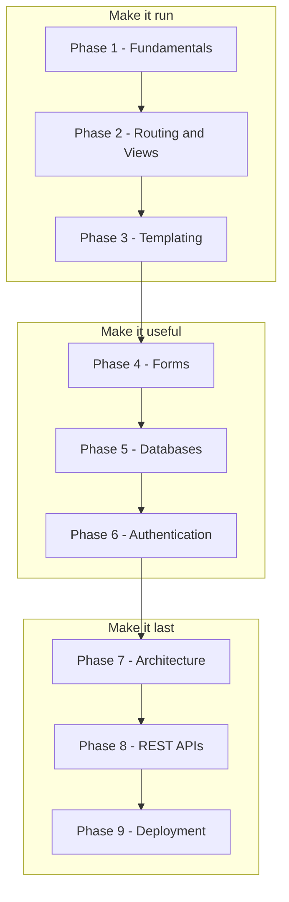

Flask is a lightweight Python web framework that’s perfect for learning how web backends work.

This tutorial track is organized into phases. Each phase builds a real mental model (request → routing → view → template → response), and gradually adds production-ready patterns.

## What you’ll build

By the end of this track, you’ll be able to:

- Build multi-page Flask apps with templates, forms, and databases
- Structure apps with Blueprints and the application factory pattern
- Create REST APIs and secure them
- Deploy Flask apps using Gunicorn + Nginx (and optionally Docker)

## How to use this section

- Start at **Phase 1** and follow the pages in order.
- Don’t skip the “concept” pages (WSGI, routing, etc.). They make debugging much easier later.

## How the track is organised

Nine phases, 88 pages. Each phase assumes the one before it, and each ends with something you can actually build.



The three groupings are worth naming. **Make it run** gets a request to reach your code and a page back to the browser. **Make it useful** adds input, storage and identity — the point at which it becomes an application rather than a demo. **Make it last** is everything that matters once other people depend on it.

## Where each phase takes you

```p5 title="The track, and what each phase unlocks" desc="Each phase assumes the one before it. Click a phase to see what you can build once it is done." height="330"
let sel = 0;
const NAMES = ['Fundamentals', 'Routing', 'Templating', 'Forms', 'Databases', 'Auth', 'Architecture', 'REST APIs', 'Deployment'];
const BUILDS = ['a page that says hello', 'a site with several URLs and a JSON endpoint', 'a real multi-page site with a shared layout', 'a site that accepts and validates input', 'a site whose data survives a restart', 'a site with accounts and private pages', 'an app split into modules, configurable per environment', 'an API other programs can call', 'all of it, running on a public server'];

function setup() {
  createCanvas(600, 330);
  textFont('monospace');
}

function draw() {
  background(13, 17, 23);
  noStroke();
  fill(230);
  textSize(13);
  textAlign(LEFT, TOP);
  text('the Flask track', 24, 16);
  fill(120);
  textSize(11);
  text('click a phase', 24, 36);

  for (let i = 0; i < NAMES.length; i++) {
    const col = i % 3;
    const row = floor(i / 3);
    const x = 24 + col * 186;
    const y = 62 + row * 56;
    const done = i < sel;
    const on = i === sel;
    stroke(on ? color(255, 211, 67) : (done ? color(120, 190, 130) : color(48, 56, 68)));
    strokeWeight(on ? 2 : 1);
    fill(on ? color(38, 34, 18) : (done ? color(18, 28, 22) : color(17, 22, 29)));
    rect(x, y, 174, 46, 4);
    noStroke();
    fill(on ? color(255, 211, 67) : (done ? color(120, 190, 130) : 110));
    textSize(11);
    textAlign(LEFT, TOP);
    text('Phase ' + (i + 1), x + 12, y + 8);
    fill(on ? color(255, 211, 67) : (done ? 150 : 90));
    textSize(11);
    text(NAMES[i], x + 12, y + 26);
  }

  stroke(48, 56, 68);
  strokeWeight(1);
  fill(18, 23, 30);
  rect(24, 240, 552, 62, 5);
  noStroke();
  fill(110);
  textSize(10);
  textAlign(LEFT, TOP);
  text('after Phase ' + (sel + 1) + ' you can build', 38, 250);
  fill(120, 190, 130);
  textSize(13);
  text(BUILDS[sel], 38, 272);

  fill(90);
  textSize(10);
  textAlign(LEFT, TOP);
  text('green = assumed knowledge by the time you reach the highlighted phase', 24, 312);
}

function mousePressed() {
  for (let i = 0; i < NAMES.length; i++) {
    const col = i % 3;
    const row = floor(i / 3);
    const x = 24 + col * 186;
    const y = 62 + row * 56;
    if (mouseX > x && mouseX < x + 174 && mouseY > y && mouseY < y + 46) sel = i;
  }
}
```

## Choosing where to start

| if you | start at |
|:--|:--|
| have never used a web framework | Phase 1 |
| know routing but write HTML in Python strings | Phase 3 |
| have pages but no way to accept input | Phase 4 |
| have forms but nothing is saved | Phase 5 |
| have an app in one large file | Phase 7 |
| are building for machines, not browsers | Phase 8 |
| have it working locally and nowhere else | Phase 9 |


:::note[The phases are cumulative, not independent]
Phase 5 assumes forms from Phase 4, which assume templates from Phase 3. Skipping ahead works for reading, but the examples will use ideas introduced earlier without re-explaining them.
:::

## Check yourself

<Quiz
  questions={[
    {
      q: "What do the three groupings of the track correspond to?",
      options: [
        "beginner, intermediate and advanced difficulty",
        "make it run, make it useful, make it last: reaching your code, adding input and storage, then everything that matters once others depend on it",
        "front end, back end and database",
        "the three Flask releases",
      ],
      answer: 1,
      explain:
        "They describe what the app can do after each group, rather than how hard the material is.",
    },
    {
      q: "You have a working Flask app in one large file with routes, templates and a database. Where should you start?",
      options: [
        "Phase 1",
        "Phase 5",
        "Phase 7 - Architecture",
        "Phase 9 - Deployment",
      ],
      answer: 2,
      explain:
        "Blueprints, the application factory and configuration handling all address exactly that problem: code that has outgrown a single module.",
    },
    {
      q: "What do the phase overview pages give you that the individual pages do not?",
      options: [
        "the full code for each topic",
        "the reading order, what the phase assumes, and what you can build once it is done",
        "a downloadable project template",
        "the deployment configuration",
      ],
      answer: 1,
      explain:
        "Each overview lists its pages in sidebar order and names the phase's prerequisites and outcome, so you can tell whether you are ready for it.",
    },
  ]}
/>
