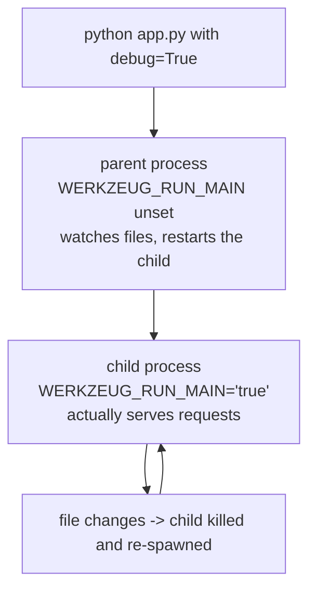

import Quiz from "../../../../components/Quiz.astro";

Flask debug mode is designed to speed up development.

It usually provides:

- automatic reload when code changes
- interactive debugger with stack traces

## Enabling debug mode

### Option A: environment variable

```bash
export FLASK_DEBUG=1
flask run
```

### Option B: app.run

```python
app.run(debug=True)
```

## Why debug mode is dangerous in production

The interactive debugger can allow code execution if it’s exposed.

Rule of thumb:

- Debug mode is fine locally.
- Never enable debug mode on a public server.

In production, you’ll use Gunicorn (or another WSGI server) and configuration-based logging.

## Auto reload: what to know

When auto-reload is enabled, Flask may start your app twice (a reloader process + the actual app).

If your code does something at import time (like sending emails, starting a scheduler, etc.), it may run twice.

Best practice:

- keep side effects out of module import time
- put startup code behind guards or proper app factories

## Debug mode starts your program twice

This is the behaviour that confuses everyone the first time. With the reloader on,
there are **two processes**: a watcher that never serves requests, and a child that
does. Module-level code runs in both.



Measured output from a real run:

```text title="two pids, one program"
MODULE EXECUTED  pid=17536  WERKZEUG_RUN_MAIN=None
 * Serving Flask app 'reload_demo'
 * Debug mode: on
 * Running on http://127.0.0.1:5099
 * Restarting with stat
MODULE EXECUTED  pid=8324   WERKZEUG_RUN_MAIN='true'
 * Debugger is active!
 * Debugger PIN: 126-124-415
```

The module-level `print` ran **twice, in two different processes**. Anything expensive
or one-shot at import time — opening a database, spawning a thread, sending a
notification — therefore happens twice in development and once in production, which is
a genuinely confusing class of bug.

```python title="run_once.py" showLineNumbers{1}
import os

# runs only in the process that actually serves requests
if os.environ.get("WERKZEUG_RUN_MAIN") == "true" or not app.debug:
    start_background_worker()
```

## What `debug=True` switches on

| setting | default | with `debug=True` |
|:--|:--|:--|
| `app.debug` | `False` | `True` |
| reloader | off | on — restarts on file change |
| interactive debugger | off | on, guarded by a PIN |
| `TEMPLATES_AUTO_RELOAD` | `None` (follows debug) | effectively on |
| unhandled exception | 500 page | traceback, and the exception propagates |

```python title="errors.py" showLineNumbers{1}
# debug off: the client gets a generic page, the traceback goes to the log
GET /boom -> 500, body starts b'<!doctype html>\n<html lang=en>\n<title>'

# debug on: the exception reaches you (and the browser gets an interactive console)
GET /boom -> ValueError: kaboom
```

:::danger[The debugger executes arbitrary code]
The interactive traceback lets anyone who can reach it run Python **in your process**.
The PIN slows an attacker down; it does not stop one. Debug mode reachable from the
internet is a full remote code execution hole. Never set `debug=True` behind a public
address, and never ship it — use a real WSGI server and read the log instead.
:::

## See it move

```p5 title="The reloader's two processes" desc="The parent watches files and never serves. The child serves requests and is killed and respawned on every save." height="330"
let t = 0;
let saves = 0;
let childPid = 8324;

function setup() {
  createCanvas(600, 330);
  textFont("monospace");
}

function draw() {
  background(13, 17, 23);
  t++;
  noStroke();
  fill(230);
  textSize(13);
  textAlign(LEFT, TOP);
  text("app.run(debug=True)", 24, 16);
  fill(120);
  textSize(11);
  text("click 'save a file' to trigger a reload", 24, 36);

  // parent
  stroke(75, 139, 190);
  strokeWeight(2);
  fill(20, 30, 42);
  rect(24, 68, 250, 96, 5);
  noStroke();
  fill(75, 139, 190);
  textSize(12);
  textAlign(LEFT, TOP);
  text("parent  pid 17536", 38, 82);
  fill(150);
  textSize(10);
  text("WERKZEUG_RUN_MAIN unset", 38, 104);
  text("watches files", 38, 120);
  text("never serves a request", 38, 136);

  // child
  const flash = t - saves * 0 < 20 && saves > 0 && t % 200 < 20;
  stroke(120, 190, 130);
  strokeWeight(2);
  fill(20, 34, 24);
  rect(320, 68, 250, 96, 5);
  noStroke();
  fill(120, 190, 130);
  textSize(12);
  textAlign(LEFT, TOP);
  text("child  pid " + childPid, 334, 82);
  fill(150);
  textSize(10);
  text("WERKZEUG_RUN_MAIN = 'true'", 334, 104);
  text("serves every request", 334, 120);
  text("killed and respawned on save", 334, 136);

  stroke(60, 70, 84);
  strokeWeight(1);
  line(274, 116, 320, 116);
  noStroke();
  fill(90);
  textSize(9);
  textAlign(CENTER, BOTTOM);
  text("spawns", 297, 112);

  fill(255, 211, 67);
  textSize(11);
  textAlign(LEFT, TOP);
  text("module-level code has now run " + (saves + 2) + " times across " + (saves + 2) + " processes", 24, 186);
  fill(120);
  textSize(10);
  text("(once in the parent, once per child)", 24, 204);

  fill(150);
  textSize(11);
  text("reloads: " + saves, 24, 232);

  drawBtn(24, 258, 150, "save a file");
  drawBtn(186, 258, 110, "reset");
  fill(90);
  textSize(10);
  textAlign(LEFT, TOP);
  text("guard one-shot setup with WERKZEUG_RUN_MAIN", 24, 296);
}

function drawBtn(x, y, w, label) {
  const hot = mouseX > x && mouseX < x + w && mouseY > y && mouseY < y + 24;
  stroke(hot ? color(255, 211, 67) : color(60, 70, 84));
  strokeWeight(1);
  fill(hot ? color(34, 40, 50) : color(22, 28, 36));
  rect(x, y, w, 24, 4);
  noStroke();
  fill(hot ? color(255, 211, 67) : 200);
  textSize(11);
  textAlign(CENTER, CENTER);
  text(label, x + w / 2, y + 12);
}

function mousePressed() {
  if (mouseY < 258 || mouseY > 282) return;
  if (mouseX > 24 && mouseX < 174) { saves++; childPid = 8324 + saves * 104; }
  if (mouseX > 186 && mouseX < 296) { saves = 0; childPid = 8324; }
}
```

## Check yourself

<Quiz
  questions={[
    {
      q: "With debug=True, a print at module level appeared twice with two different pids. Why?",
      options: [
        "Flask imports the module twice to validate it",
        "the reloader runs a parent watcher process and a child that serves requests; module code runs in both",
        "the print was buffered and flushed twice",
        "debug mode enables multithreading",
      ],
      answer: 1,
      explain:
        "Measured pid 17536 with WERKZEUG_RUN_MAIN unset, then pid 8324 with it set to 'true'. Guard one-shot setup with that variable or it happens twice in development.",
    },
    {
      q: "Why must debug mode never be enabled on a public server?",
      options: [
        "it slows the server down",
        "the interactive debugger allows arbitrary Python execution in your process, so it is a remote code execution hole",
        "it writes too much to the log",
        "the reloader consumes too much memory",
      ],
      answer: 1,
      explain:
        "The traceback console runs code inside your process. The PIN is a speed bump, not a control. Reachable debug mode is a full compromise of the host.",
    },
    {
      q: "With debug off, what does a view that raises ValueError return to the client?",
      options: [
        "the ValueError traceback",
        "a generic 500 HTML page, with the traceback sent to the log",
        "a 200 with an empty body",
        "the exception propagates out of the application",
      ],
      answer: 1,
      explain:
        "Measured: status 500 and a body beginning '<!doctype html>'. With debug on the exception propagates instead, which is why tests often set it.",
    },
  ]}
/>
