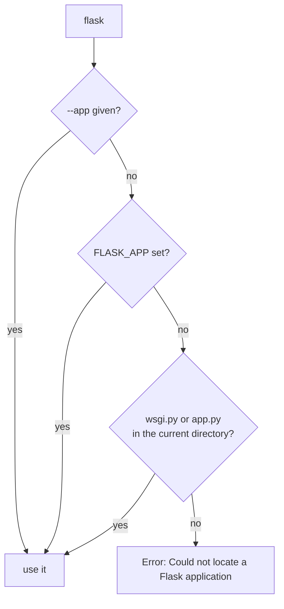

Flask includes a CLI (built on Click) that makes development workflows smooth.

## How the Flask CLI finds your app

The CLI needs to know what Flask application to run.

Common ways:

- `FLASK_APP=app` (points to `app.py` module)
- `FLASK_APP=package:create_app` (factory pattern)

### Example

If you have `app.py` with `app = Flask(__name__)`:

```bash
export FLASK_APP=app
flask run
```

## Useful built-in commands

- `flask run` — run dev server
- `flask routes` — list all routes (very helpful!)
- `flask shell` — open a Python shell with app context (commonly used in bigger apps)

## Adding custom commands (preview)

Later, you can add custom commands like:

- `flask create-admin`
- `flask seed-db`

Typically you’ll register them through the app factory or extensions.

## Troubleshooting

If you see errors like:

- “Could not locate a Flask application”

It usually means:

- `FLASK_APP` is not set
- your import path is wrong
- you’re in the wrong working directory

## How `flask` finds your application

The `flask` command is a `click` application installed alongside Flask. Before it can do
anything it has to locate your app object, and it looks in a fixed order:



Run from the wrong directory and you get exactly this, measured:

```text title="the error you will actually see"
Error: Could not locate a Flask application. Use the 'flask --app' option,
'FLASK_APP' environment variable, or a 'wsgi.py' or 'app.py' file in the
current directory.
```

The fix is nearly always `--app`, which takes a module path rather than a file name:

```bash title="usage"
flask --app app run          # module app, i.e. app.py
flask --app myapp:create_app run    # a factory
flask --app app routes
flask --app app shell
```

## The three commands you get for free

```text title="flask --app app --help"
Commands:
  routes  Show the routes for the app.
  run     Run a development server.
  shell   Run a shell in the app context.
```

`flask routes` is the fastest way to answer "why is my URL 404?" — measured on a small
app:

```text title="flask --app app routes"
Endpoint  Methods    Rule
--------  ---------  -----------------------
index     GET        /
items     GET, POST  /api/items
static    GET        /static/<path:filename>
user      GET        /user/<name>
```

Every rule the app really has, including the automatic `static` one. If the route you
expected is missing, the module was never imported or the decorator never ran.

`flask shell` opens a REPL **inside an application context**, so `current_app`,
`url_for` and your database session work without any setup. A plain `python` REPL gives
you `RuntimeError: Working outside of application context` for the same code.

:::note[Adding your own commands]
```python title="commands.py" showLineNumbers{1}
@app.cli.command("seed")
def seed():
    "Insert sample rows."
    db.session.add_all(sample_rows())
    db.session.commit()
```
It then appears in `flask --help` and runs with the app context already pushed — the
right home for migrations, seeding and one-off maintenance jobs.
:::

## See it move

```p5 title="How flask locates your app" desc="The CLI checks --app, then FLASK_APP, then wsgi.py or app.py in the current directory, and fails if none of them resolve." height="330"
let hasFlag = false;
let hasEnv = false;
let hasFile = true;

function setup() {
  createCanvas(600, 330);
  textFont("monospace");
}

function draw() {
  background(13, 17, 23);
  const src = hasFlag ? 0 : (hasEnv ? 1 : (hasFile ? 2 : -1));

  noStroke();
  fill(230);
  textSize(13);
  textAlign(LEFT, TOP);
  text("flask routes", 24, 16);

  const steps = [
    { n: "--app given on the command line", on: hasFlag },
    { n: "FLASK_APP environment variable", on: hasEnv },
    { n: "app.py or wsgi.py in this directory", on: hasFile },
  ];
  for (let i = 0; i < steps.length; i++) {
    const y = 52 + i * 46;
    const used = i === src;
    const skipped = src >= 0 && i > src;
    stroke(used ? color(120, 190, 130) : color(48, 56, 68));
    strokeWeight(used ? 2 : 1);
    fill(used ? color(20, 34, 24) : color(17, 22, 29));
    rect(24, y, 400, 36, 4);
    noStroke();
    fill(used ? color(120, 190, 130) : (skipped ? 60 : 140));
    textSize(11);
    textAlign(LEFT, CENTER);
    text(steps[i].n, 38, y + 18);
    fill(steps[i].on ? color(255, 211, 67) : 70);
    textAlign(RIGHT, CENTER);
    textSize(10);
    text(steps[i].on ? "present" : "absent", 412, y + 18);

    textAlign(LEFT, CENTER);
    fill(used ? color(120, 190, 130) : (skipped ? 60 : 90));
    textSize(10);
    text(used ? "used" : (skipped ? "not checked" : "miss"), 436, y + 18);
  }

  const ok = src >= 0;
  stroke(ok ? color(120, 190, 130) : color(232, 110, 110));
  strokeWeight(1);
  fill(18, 23, 30);
  rect(24, 200, 540, 54, 5);
  noStroke();
  fill(ok ? color(120, 190, 130) : color(232, 110, 110));
  textSize(12);
  textAlign(LEFT, TOP);
  if (ok) {
    text("app found - the routes table prints", 38, 212);
    fill(120);
    textSize(10);
    text("index  GET  /     |  items  GET, POST  /api/items  |  static  GET  /static/...", 38, 234);
  } else {
    text("Error: Could not locate a Flask application.", 38, 212);
    fill(120);
    textSize(10);
    text("pass --app, set FLASK_APP, or cd to the folder holding app.py", 38, 234);
  }

  drawBtn(24, 274, 118, "--app: " + (hasFlag ? "on" : "off"));
  drawBtn(152, 274, 148, "FLASK_APP: " + (hasEnv ? "on" : "off"));
  drawBtn(310, 274, 150, "app.py: " + (hasFile ? "on" : "off"));
}

function drawBtn(x, y, w, label) {
  const hot = mouseX > x && mouseX < x + w && mouseY > y && mouseY < y + 24;
  stroke(hot ? color(255, 211, 67) : color(60, 70, 84));
  strokeWeight(1);
  fill(hot ? color(34, 40, 50) : color(22, 28, 36));
  rect(x, y, w, 24, 4);
  noStroke();
  fill(hot ? color(255, 211, 67) : 200);
  textSize(11);
  textAlign(CENTER, CENTER);
  text(label, x + w / 2, y + 12);
}

function mousePressed() {
  if (mouseY < 274 || mouseY > 298) return;
  if (mouseX > 24 && mouseX < 142) hasFlag = !hasFlag;
  if (mouseX > 152 && mouseX < 300) hasEnv = !hasEnv;
  if (mouseX > 310 && mouseX < 460) hasFile = !hasFile;
}
```

## Check yourself

<Quiz
  questions={[
    {
      q: "In what order does the flask command look for your application?",
      options: [
        "FLASK_APP, then --app, then any .py file in the directory",
        "--app, then FLASK_APP, then wsgi.py or app.py in the current directory",
        "it always requires --app",
        "it imports every module in the directory and picks the first Flask object",
      ],
      answer: 1,
      explain:
        "The explicit flag wins, then the environment variable, then the conventional file names. If none resolve you get 'Could not locate a Flask application'.",
    },
    {
      q: "Why does flask shell differ from running python and importing your app?",
      options: [
        "it loads your models automatically",
        "it opens the REPL inside an application context, so current_app and url_for work",
        "it is faster to start",
        "it enables debug mode",
      ],
      answer: 1,
      explain:
        "Without an application context the same code raises RuntimeError: Working outside of application context. flask shell pushes one for you.",
    },
    {
      q: "You expect /profile to exist but get 404. What does flask routes tell you?",
      options: [
        "whether the view function has a bug",
        "whether the rule is registered at all; if it is missing, the module was never imported or the decorator never ran",
        "which template the route renders",
        "the HTTP status the route will return",
      ],
      answer: 1,
      explain:
        "flask routes prints the real url_map. A missing rule is a registration problem, not a view problem — usually a blueprint that was never registered or a module never imported.",
    },
  ]}
/>
