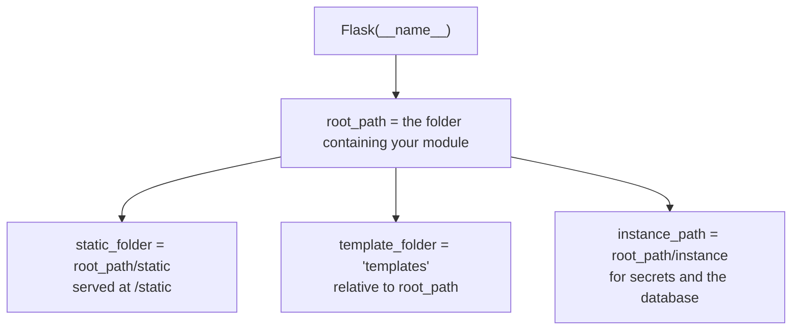

Flask lets you start with a single file, but real apps need structure.

A clean structure makes it easier to:

- scale your codebase
- write tests
- add Blueprints
- deploy reliably

## Option 1: single-file starter (learning only)

```
app.py
```

This is okay for “Hello World”, but it gets messy fast.

## Option 2: recommended starter package layout

```
myapp/
  app.py
  templates/
    home.html
  static/
    styles.css
```

Flask will auto-discover `templates/` and `static/` relative to your app.

## Option 3: scalable layout (closer to production)

```
myapp/
  __init__.py          # create_app() lives here
  routes.py            # routes / views
  models.py            # database models
  templates/
  static/
config.py
wsgi.py                # entrypoint for gunicorn
```

### Why separate `wsgi.py`?

A typical production command is:

- `gunicorn "wsgi:app"`

So `wsgi.py` is an easy “server entry point”.

## What’s next

In Phase 2 you’ll learn routing and views in depth.

In Phase 7 you’ll learn:

- Blueprints
- application factory pattern

Those concepts make Option 3 feel natural.

## The paths Flask assumes before you configure anything

`Flask(__name__)` derives every location from where that module lives. Measured on a
fresh app:



| attribute | measured value |
|:--|:--|
| `app.root_path` | the directory of the module that called `Flask()` |
| `app.static_folder` | `<root_path>/static` — an **absolute** path |
| `app.static_url_path` | `/static` |
| `app.template_folder` | `templates` — a **relative** path |
| `app.instance_path` | `<root_path>/instance` |

Note the inconsistency, because it causes real confusion: `static_folder` comes back
absolute and `template_folder` comes back relative. Both are resolved against
`root_path`; only their representation differs.

```text title="the layout those defaults expect"
myapp/
  app.py            <- root_path is this folder
  static/           <- served at /static, no code needed
    style.css
  templates/        <- render_template looks here
    index.html
  instance/         <- config and sqlite that must NOT be in git
    config.py
```

:::note[`instance/` exists for the things you must not commit]
It is outside the package, is created on demand, and is the intended home for the
database file and any secret configuration. Add it to `.gitignore` and load it with
`app.config.from_pyfile("config.py")`.
:::

## When one file stops being enough

A single `app.py` is correct until routes multiply or you need more than one app
instance (say, one for tests). The next step is a package with an application factory:

```text title="the factory layout"
myapp/
  __init__.py       <- create_app() lives here
  routes/
    __init__.py
    users.py        <- a Blueprint
  models.py
  templates/
  static/
tests/
config.py
```

```python title="__init__.py" showLineNumbers{1}
from flask import Flask

def create_app(config=None):
    app = Flask(__name__, instance_relative_config=True)
    app.config.from_object(config or "config.Default")

    from .routes.users import bp as users_bp
    app.register_blueprint(users_bp, url_prefix="/users")
    return app
```

The factory matters because a module-level `app = Flask(__name__)` is created at import
time with one fixed configuration. A factory lets tests build an app with a temporary
database and throw it away, which is the difference between testable and not.

## See it move

```p5 title="Where Flask looks for each kind of file" desc="Every default path is derived from root_path, which is the folder holding the module that called Flask()." height="330"
let sel = 0;
const ITEMS = [
  { n: "render_template('index.html')", where: "templates/index.html", note: "template_folder, relative to root_path" },
  { n: "url_for('static', filename='style.css')", where: "static/style.css", note: "static_folder, served at /static" },
  { n: "app.config.from_pyfile('config.py')", where: "instance/config.py", note: "instance_path, with instance_relative_config=True" },
  { n: "sqlite:///app.db", where: "instance/app.db", note: "keep the database out of the package" },
];

function setup() {
  createCanvas(600, 330);
  textFont("monospace");
}

function draw() {
  background(13, 17, 23);
  noStroke();
  fill(230);
  textSize(13);
  textAlign(LEFT, TOP);
  text("Flask(__name__)  ->  root_path = this folder", 24, 16);

  for (let i = 0; i < ITEMS.length; i++) {
    const y = 48 + i * 30;
    const on = i === sel;
    stroke(on ? color(255, 211, 67) : color(40, 48, 58));
    strokeWeight(1);
    fill(on ? color(30, 36, 46) : color(17, 22, 29));
    rect(24, y, 330, 26, 3);
    noStroke();
    fill(on ? color(255, 211, 67) : 130);
    textSize(10);
    textAlign(LEFT, CENTER);
    text(ITEMS[i].n, 34, y + 13);
  }

  // tree
  const tree = ["myapp/", "  app.py", "  static/", "    style.css", "  templates/", "    index.html", "  instance/", "    config.py", "    app.db"];
  const hit = [-1, -1, 1, 1, 0, 0, 2, 2, 3];
  for (let i = 0; i < tree.length; i++) {
    const y = 178 + i * 16;
    const on = hit[i] === sel;
    noStroke();
    fill(on ? color(120, 190, 130) : 90);
    textSize(11);
    textAlign(LEFT, TOP);
    text(tree[i], 24, y);
  }

  noStroke();
  fill(75, 139, 190);
  textSize(11);
  textAlign(LEFT, TOP);
  text("resolves to  " + ITEMS[sel].where, 300, 190);
  fill(120);
  textSize(10);
  text(ITEMS[sel].note, 300, 212);
  fill(90);
  text("click a call on the left", 300, 246);
}

function mousePressed() {
  for (let i = 0; i < ITEMS.length; i++) {
    const y = 48 + i * 30;
    if (mouseX > 24 && mouseX < 354 && mouseY > y && mouseY < y + 26) sel = i;
  }
}
```

## Check yourself

<Quiz
  questions={[
    {
      q: "What determines app.root_path?",
      options: [
        "the current working directory when the server starts",
        "the folder containing the module that called Flask(__name__)",
        "the directory holding the templates folder",
        "it must be configured explicitly",
      ],
      answer: 1,
      explain:
        "Flask derives root_path from the module you pass as __name__, and static_folder, template_folder and instance_path are all resolved from it. That is why moving app.py moves everything.",
    },
    {
      q: "What is the instance/ folder for?",
      options: [
        "compiled templates",
        "configuration and data files such as the SQLite database that must not be committed",
        "static assets served to the browser",
        "the virtual environment",
      ],
      answer: 1,
      explain:
        "instance_path sits outside the package, is created on demand, and is the intended home for secrets and the database. It belongs in .gitignore.",
    },
    {
      q: "Why prefer an application factory over a module-level app = Flask(__name__)?",
      options: [
        "it makes the server start faster",
        "it is required for blueprints",
        "it lets you build an app per configuration, so tests can create one with a temporary database and discard it",
        "module-level apps cannot serve static files",
      ],
      answer: 2,
      explain:
        "A module-level app is created once at import with one fixed configuration. A factory makes configuration a parameter, which is what makes the app testable.",
    },
  ]}
/>
