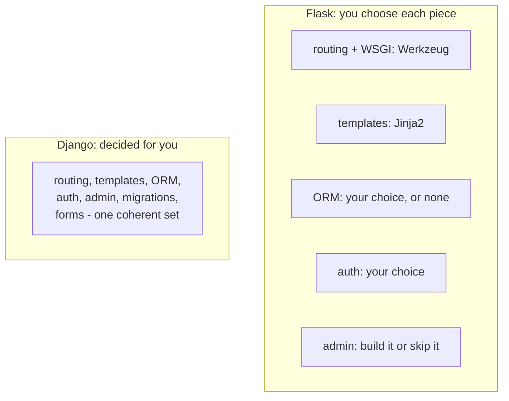

import Quiz from "../../../../components/Quiz.astro";

Flask and Django are both popular Python web frameworks.

The right choice depends on your project constraints and your team’s preference.

## The core difference

- **Flask** gives you a minimal core and lets you add what you need.
- **Django** includes a full set of features and conventions out of the box.

Think of it like this:

- Flask: “here are the building blocks, build your architecture.”
- Django: “here’s the architecture, follow the pattern.”

## Quick comparison table

| Topic | Flask | Django |
|---|---|---|
| Style | Minimal + extensions | Batteries included |
| Learning goal | Great for understanding internals | Great for building quickly |
| ORM | Optional (Flask-SQLAlchemy) | Built-in ORM |
| Admin panel | Optional (Flask-Admin) | Built-in admin |
| Project structure | You decide | Strong conventions |
| APIs | Great (plain Flask, or Flask-RESTful style) | Excellent (Django REST Framework) |

## When Flask is a great choice

- You’re learning web backends and want to understand each layer
- You want a small service/API or a microservice
- You want full control over libraries (ORM, auth, settings)
- You’re building a custom architecture or integrating into an existing ecosystem

## When Django is a great choice

- You want a full website quickly (auth, admin, ORM, forms)
- Your team prefers conventions and a standard layout
- You’re building a content-heavy web app (CMS-like)
- You expect many common features and want less assembly work

## A common real-world approach

- Flask for APIs/internal tools/microservices
- Django for “product apps” that want admin + full-stack features quickly

This tutorial track uses Flask because it teaches you the fundamentals clearly, and you can still build production apps with it.

## Measured, not asserted

The usual framing is "Flask is lightweight, Django is heavy". Measured in clean virtual
environments on CPython 3.14.4, that is only partly true:

| | Flask 3.1.3 | Django 6.1 |
|:--|--:|--:|
| packages installed | **9** | **5** |
| site-packages on disk | **19 MB** | **56 MB** |
| files in a minimal app | **1** | **6** |
| lines in a minimal app | **6** | **203** |

Django installs **fewer** distributions, because it is one large package that includes
its ORM, admin, auth, forms and migrations. Flask installs more distributions that add up
to less code, because it delegates to Werkzeug and Jinja2 and simply has no ORM or auth
to ship.

So the honest summary is not "small versus large" but **assembled versus included**.



## The minimal app, side by side

```python title="flask: app.py — the entire application" showLineNumbers{1}
from flask import Flask
app = Flask(__name__)

@app.route("/")
def index():
    return "Hello"
```

`django-admin startproject demo` produces **6 Python files and 203 lines** before you
have written a single view: `manage.py`, `settings.py`, `urls.py`, `wsgi.py`, `asgi.py`
and `__init__.py`.

That difference is the whole trade-off. Flask's six lines assume nothing, so everything
beyond them is a decision you make and maintain. Django's 203 lines have already decided
how settings, URLs, deployment entry points and the ORM fit together.

## Choosing between them

| choose Flask when | choose Django when |
|:--|:--|
| the service is an API or a few endpoints | you need users, an admin, and a database on day one |
| you want a specific ORM, or none | the built-in ORM and migrations suit you |
| you are adding HTTP to an existing library | a team benefits from one prescribed layout |
| the app must stay small and explicit | the app will grow and need conventions |

:::note[Neither choice is permanent, but they are not symmetric]
Growing a Flask app into something Django-shaped means selecting and wiring an ORM, auth,
migrations and an admin yourself — real work, but incremental. Shrinking Django is
harder, because its parts assume each other. Pick based on the features you know you
need within a few months, not on which framework is fashionable.
:::

## See it move

```p5 title="Assembled versus included" desc="Flask ships the HTTP layer and leaves the rest to you. Django includes a decided set of components that assume each other." height="340"
let side = 0;   // 0 = flask, 1 = django
const PARTS = [
  { n: "routing", f: true, d: true },
  { n: "templates", f: true, d: true },
  { n: "ORM", f: false, d: true },
  { n: "migrations", f: false, d: true },
  { n: "auth", f: false, d: true },
  { n: "admin UI", f: false, d: true },
  { n: "forms", f: false, d: true },
  { n: "sessions", f: true, d: true },
];

function setup() {
  createCanvas(600, 340);
  textFont("monospace");
}

function draw() {
  background(13, 17, 23);
  const isF = side === 0;

  noStroke();
  fill(230);
  textSize(14);
  textAlign(LEFT, TOP);
  text(isF ? "Flask 3.1.3" : "Django 6.1", 24, 16);
  fill(120);
  textSize(11);
  text(isF ? "9 packages, 19 MB, 6-line app" : "5 packages, 56 MB, 203-line project", 24, 38);

  for (let i = 0; i < PARTS.length; i++) {
    const col = i % 2;
    const row = floor(i / 2);
    const x = 24 + col * 280;
    const y = 70 + row * 46;
    const included = isF ? PARTS[i].f : PARTS[i].d;
    stroke(included ? color(120, 190, 130) : color(60, 70, 84));
    strokeWeight(1);
    fill(included ? color(20, 34, 24) : color(17, 22, 29));
    rect(x, y, 262, 36, 4);
    noStroke();
    fill(included ? color(120, 190, 130) : 80);
    textSize(12);
    textAlign(LEFT, CENTER);
    text(PARTS[i].n, x + 14, y + 18);
    textSize(10);
    textAlign(RIGHT, CENTER);
    fill(included ? color(120, 190, 130) : color(255, 211, 67));
    text(included ? "included" : "you choose one", x + 248, y + 18);
  }

  noStroke();
  fill(180);
  textSize(11);
  textAlign(LEFT, TOP);
  const n = PARTS.filter(function (p) { return isF ? p.f : p.d; }).length;
  text(n + " of " + PARTS.length + " components ship with the framework", 24, 262);
  fill(90);
  textSize(10);
  text(isF ? "everything else is a decision you make and maintain"
           : "the parts assume each other, which is why Django is hard to shrink", 24, 282);

  drawBtn(24, 302, 200, isF ? "showing: Flask" : "showing: Django");
}

function drawBtn(x, y, w, label) {
  const hot = mouseX > x && mouseX < x + w && mouseY > y && mouseY < y + 24;
  stroke(hot ? color(255, 211, 67) : color(60, 70, 84));
  strokeWeight(1);
  fill(hot ? color(34, 40, 50) : color(22, 28, 36));
  rect(x, y, w, 24, 4);
  noStroke();
  fill(hot ? color(255, 211, 67) : 200);
  textSize(11);
  textAlign(CENTER, CENTER);
  text(label, x + w / 2, y + 12);
}

function mousePressed() {
  if (mouseY > 302 && mouseY < 326 && mouseX > 24 && mouseX < 224) side = 1 - side;
}
```

## Check yourself

<Quiz
  questions={[
    {
      q: "Measured in clean venvs: Flask 9 packages / 19 MB, Django 5 packages / 56 MB. What is the accurate summary?",
      options: [
        "Flask is lighter by every measure",
        "Django is lighter by every measure",
        "Flask is smaller on disk but installs more distributions, because it is assembled from independent libraries while Django is one included set",
        "the two are equivalent in size",
      ],
      answer: 2,
      explain:
        "Django is a single large distribution carrying its ORM, admin and auth. Flask delegates to Werkzeug and Jinja2, so it has more packages and far less code. The real axis is assembled versus included.",
    },
    {
      q: "A minimal Flask app is 6 lines in 1 file; django-admin startproject produces 203 lines across 6 files. What does the difference represent?",
      options: [
        "Django is less efficient at generating code",
        "Django has already decided how settings, URLs and deployment entry points fit together, while Flask leaves each to you",
        "the Flask app is incomplete",
        "Django requires more code for the same features",
      ],
      answer: 1,
      explain:
        "Those 203 lines are structure, not logic: settings, urls, wsgi and asgi. Flask assumes none of it, which is freedom and also work you own.",
    },
    {
      q: "Why is moving from Flask to Django harder than the reverse in practice?",
      options: [
        "Django cannot import Flask code",
        "Django's components assume each other, so adopting or removing parts piecemeal is difficult, whereas a Flask app grows by adding chosen pieces",
        "Flask apps cannot be deployed the same way",
        "Django does not support APIs",
      ],
      answer: 1,
      explain:
        "Django's ORM, auth and admin are designed together. Flask grows incrementally because each piece was already an independent choice. Choose on the features you need within a few months.",
    },
  ]}
/>
